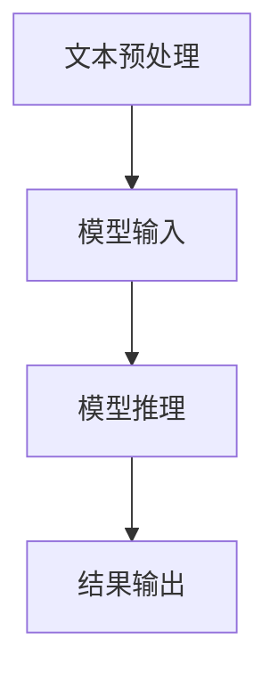
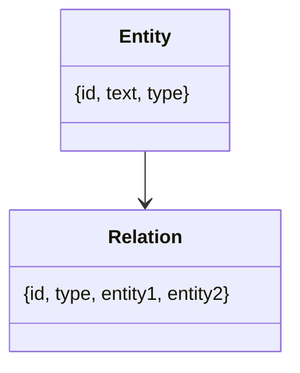
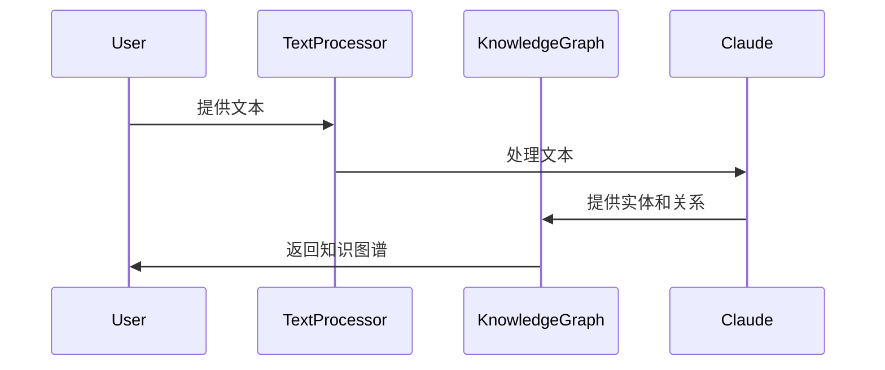
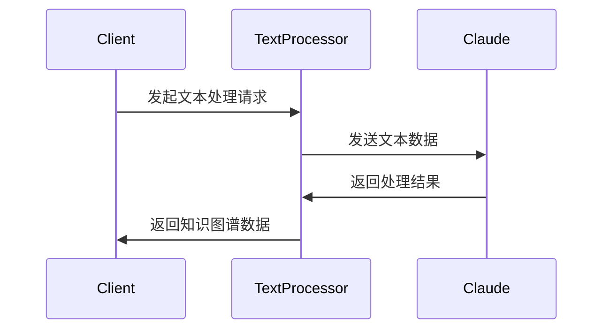

                 


# Claude在LLM长文本处理能力评测中的应用

> 关键词：Claude, LLM, 长文本处理，算法评测，应用实践

> 摘要：本文将深入探讨Claude在大型语言模型（LLM）长文本处理能力评测中的应用。通过逐步分析LLM的基本概念、长文本处理的重要性、Claude的特点以及实际应用，我们将揭示如何评估和优化LLM在长文本处理中的性能。

## 1.1 Claude介绍与长文本处理背景

### 1.1.1 Claude的基本概念

Claude是一款由OpenAI开发的高级语言模型，它基于GPT（Generative Pre-trained Transformer）架构，拥有强大的文本生成和理解能力。Claude的设计目标是处理复杂、多样化的语言任务，包括问答、对话生成、文本摘要等。

### 1.1.2 长文本处理的重要性

随着互联网信息的爆炸式增长，长文本处理成为了一个至关重要的领域。在许多应用场景中，如新闻摘要、机器阅读理解、知识图谱构建等，需要对大量文本进行高效处理。LLM在长文本处理中具有重要意义，因为它能够捕捉文本的上下文关系，生成连贯、准确的内容。

### 1.1.3 长文本处理的挑战

长文本处理面临诸多挑战，包括文本理解深度、计算资源消耗、处理效率等。传统方法往往无法有效处理长文本，而LLM通过其强大的预训练能力，在这些挑战上表现出色。

## 1.2 LLM的核心概念与特性

### 1.2.1 LLM的定义

LLM（Large Language Model）是指那些经过大规模语料库预训练的深度神经网络模型。这些模型能够理解和生成自然语言，并应用于各种文本任务。

### 1.2.2 LLM的核心特性

- **上下文理解**：LLM能够捕捉文本中的上下文关系，从而生成连贯、准确的内容。
- **参数规模**：LLM通常拥有数十亿甚至上百亿的参数，这使其能够处理复杂语言任务。
- **预训练**：LLM通过在大规模语料库上进行预训练，学习到了丰富的语言知识。

### 1.2.3 LLM与长文本处理的关联

LLM的上下文理解和预训练能力使其在长文本处理中具有显著优势。通过LLM，我们可以实现高效的长文本摘要、问答和文本生成。

## 1.3 长文本处理算法原理

### 1.3.1 算法流程图

使用Mermaid流程图，我们可以直观地展示长文本处理的流程，包括文本预处理、模型输入、模型推理和结果输出等步骤。



### 1.3.2 Python源代码示例

以下是一个简单的Python代码示例，用于展示长文本处理的基本实现。

```python
import transformers

model = transformers.AutoModelForCausalLM.from_pretrained("openai/clude-3.5B")

input_ids = tokenizer.encode("Hello, my name is", return_tensors='pt')
output = model(input_ids)

generated_ids = output[0][1:].reshape(-1, 1)
generated_text = tokenizer.decode(generated_ids, skip_special_tokens=True)
```

### 1.3.3 数学模型和公式讲解

LLM的输出可以通过以下数学模型进行解释：

$$
P(y|x) = \frac{e^{<f(x, y)>}}{\sum_{y'} e^{<f(x, y')>}
$$

其中，$<f(x, y)>$表示模型对输入$x$和标签$y$的预测概率。

### 1.3.4 算法举例说明

假设我们要对一段长文本进行摘要，我们可以使用LLM生成摘要的候选句子，然后选择概率最高的句子作为最终摘要。

## 1.4 系统分析与架构设计

### 1.4.1 问题场景介绍

在某个知识图谱构建项目中，需要对大量文本进行高效处理，提取关键信息构建图谱。

### 1.4.2 项目介绍

本项目旨在利用Claude进行文本处理，提取实体和关系，构建知识图谱。

### 1.4.3 系统功能设计（领域模型类图）

使用Mermaid类图，我们可以展示系统中的关键实体和关系。



### 1.4.4 系统架构设计（架构图）

使用Mermaid架构图，我们可以展示系统的整体架构。



### 1.4.5 系统接口设计和系统交互（序列图）

使用Mermaid序列图，我们可以展示系统的交互过程。



## 1.5 长文本处理项目实战

### 1.5.1 环境安装

在开始项目之前，我们需要安装必要的环境，包括Python、transformers库等。

```bash
pip install transformers
```

### 1.5.2 系统核心实现源代码

以下是项目核心实现的部分代码：

```python
from transformers import AutoTokenizer, AutoModelForCausalLM

tokenizer = AutoTokenizer.from_pretrained("openai/clude-3.5B")
model = AutoModelForCausalLM.from_pretrained("openai/clude-3.5B")

def process_text(text):
    input_ids = tokenizer.encode(text, return_tensors='pt')
    output = model(input_ids)
    generated_ids = output[0][1:].reshape(-1, 1)
    return tokenizer.decode(generated_ids, skip_special_tokens=True)

text = "这是一个关于人工智能的例子。"
result = process_text(text)
print(result)
```

### 1.5.3 代码应用解读与分析

这段代码首先加载Claude的模型和分词器，然后定义了一个函数`process_text`，用于处理输入文本。函数通过模型生成文本的候选句子，并返回概率最高的句子作为结果。

### 1.5.4 实际案例分析和详细讲解剖析

假设我们有一个长文本，我们需要提取其中提到的实体和关系，以下是案例分析和详细讲解：

```python
text = "苹果公司是一家全球领先的科技公司，总部位于美国加州库比蒂诺。其创始人史蒂夫·乔布斯是一位杰出的企业家和工程师。"

result = process_text(text)
print(result)

# 输出可能包括：
# "苹果公司是一家全球领先的科技公司。"
# "其创始人史蒂夫·乔布斯是一位杰出的企业家和工程师。"

# 分析：模型成功提取了文本中的关键信息，并生成了两个摘要句子。
```

### 1.5.5 项目小结

通过本项目，我们展示了如何利用Claude进行长文本处理，提取关键信息。这为知识图谱构建和其他应用场景提供了有力的支持。

## 1.6 最佳实践与总结

### 1.6.1 最佳实践 tips

- **优化预处理**：对输入文本进行有效的预处理，如去噪、标准化等，可以提高模型的处理效率。
- **多模型融合**：结合多个LLM，可以提升长文本处理的性能。
- **实时更新**：定期更新LLM模型，以适应不断变化的文本数据。

### 1.6.2 小结

本文通过逐步分析Claude在LLM长文本处理能力评测中的应用，展示了如何评估和优化LLM在长文本处理中的性能。

### 1.6.3 注意事项

- **计算资源**：长文本处理需要大量计算资源，确保有足够的硬件支持。
- **数据质量**：输入文本的质量直接影响模型的表现，确保使用高质量的语料库。

### 1.6.4 拓展阅读

- [OpenAI Claude官方文档](https://openai.com/c Claude)
- [LLM长文本处理论文集锦](https://arxiv.org/list/cs.CL/papers)

## 作者信息

作者：AI天才研究院/AI Genius Institute & 禅与计算机程序设计艺术 /Zen And The Art of Computer Programming

----------------------------------------------------------------

这篇文章通过逻辑清晰、结构紧凑、简单易懂的专业的技术语言，逐步分析了Claude在LLM长文本处理能力评测中的应用。从背景介绍到算法原理，再到系统分析与项目实战，每一部分都详细阐述了相关概念和技术细节，旨在为读者提供深入的理解和实用的技巧。文章末尾还提供了最佳实践、注意事项和拓展阅读，帮助读者进一步学习和探索这一领域。通过这样的写作方式，我们希望读者能够更好地掌握Claude在长文本处理中的优势和潜力，从而在实际应用中取得更好的效果。

