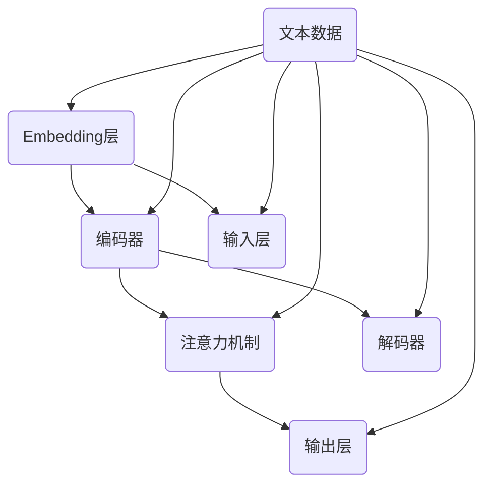
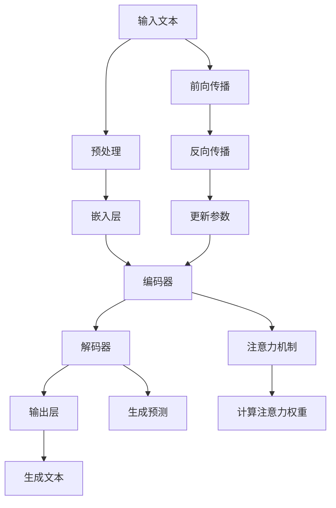
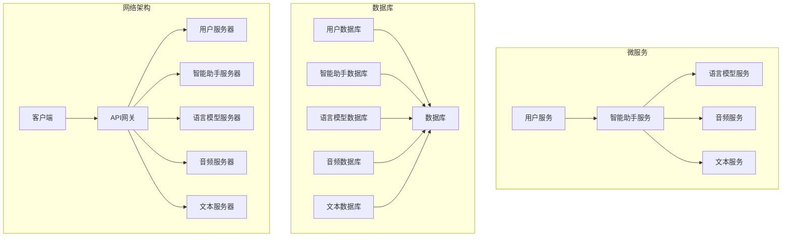
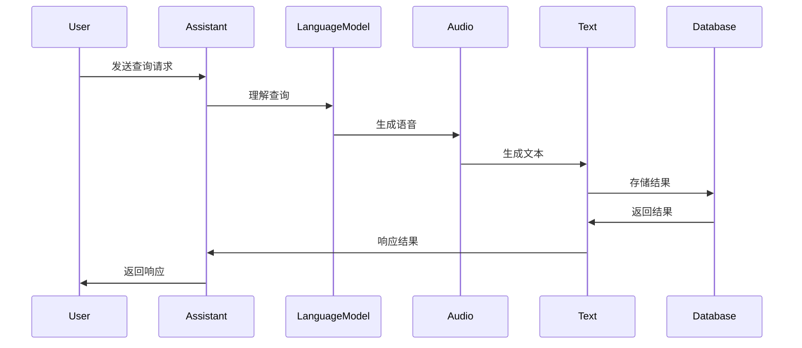

                 

### 文章标题

### 关键词
- C侧LLM
- 应用开发
- 速度与质量平衡
- 算法优化
- 系统架构设计

### 摘要
本文旨在探讨C侧大型语言模型（LLM）在应用开发过程中如何平衡速度与质量。通过深入分析LLM的背景、核心概念、算法原理、系统架构和项目实战，本文提出了一系列优化策略和最佳实践，旨在帮助开发者实现高效、高质量的LLM应用开发。

## 引言

在人工智能领域，大型语言模型（LLM）已经成为自然语言处理（NLP）的关键技术。C侧LLM，即运行在客户端或边缘设备上的LLM，由于其灵活性和实时性，正逐渐受到广泛关注。然而，C侧LLM应用开发面临的一个核心挑战是如何在保证模型质量的同时，提高开发速度和效率。

本文将从以下几个方面展开讨论：

1. **背景介绍**：解释C侧LLM的概念、应用场景和重要性。
2. **核心概念与联系**：详细阐述LLM的基本原理、架构和组成部分。
3. **算法原理讲解**：分析LLM相关的算法、优化策略和技术。
4. **系统分析与架构设计**：探讨如何平衡开发速度与质量。
5. **项目实战**：通过实际案例展示C侧LLM的开发过程。
6. **最佳实践与总结**：总结开发过程中的技巧和注意事项。

通过这些讨论，我们希望为开发者提供一套系统的、实用的C侧LLM应用开发指南。

## 背景介绍

### C侧LLM的概念

C侧LLM，即运行在客户端或边缘设备上的大型语言模型，与传统的服务器端LLM有所不同。服务器端LLM通常依赖于云计算资源，具有高计算能力和存储容量，但受限于网络带宽和延迟。而C侧LLM通过在客户端或边缘设备上部署和运行，能够实现更低的延迟和更高的响应速度，尤其适用于实时性要求较高的场景。

C侧LLM的关键特点包括：

1. **实时性**：由于模型运行在本地设备上，用户输入的处理时间可以大幅缩短，实现即时响应。
2. **灵活性**：不受网络条件的限制，即使在断网或弱网环境下，C侧LLM也能正常工作。
3. **安全性**：数据无需上传至云端，减少了数据泄露的风险。

### 应用场景

C侧LLM的应用场景广泛，以下是一些典型的应用实例：

1. **智能助手**：例如智能音箱、手机语音助手等，通过C侧LLM实现高效的语音识别和自然语言理解，提供个性化服务。
2. **实时翻译**：在旅行、商务交流等场景中，C侧LLM可以实现即时、准确的翻译服务。
3. **文本生成**：例如文章撰写、报告生成等，C侧LLM可以根据用户需求快速生成高质量文本。
4. **智能推荐**：在电商、社交媒体等平台上，C侧LLM可以根据用户行为数据，实时生成个性化的推荐结果。

### 重要性

C侧LLM的重要性体现在以下几个方面：

1. **用户体验**：通过降低延迟和提高响应速度，C侧LLM显著提升了用户体验。
2. **数据隐私**：本地处理数据可以减少数据泄露的风险，增强用户隐私保护。
3. **计算资源利用**：C侧LLM可以充分利用客户端或边缘设备的计算资源，减少对云端资源的依赖。
4. **安全性**：本地处理数据可以避免数据在网络传输过程中被窃取或篡改。

综上所述，C侧LLM作为一种新兴技术，在应用开发中具有巨大的潜力和广泛的前景。接下来，我们将进一步探讨C侧LLM的核心概念和组成部分。

## 核心概念与联系

### LLM的基本原理

大型语言模型（LLM）是自然语言处理（NLP）领域的一种重要模型，其基本原理基于深度学习和神经网络。LLM的核心目的是通过学习大量的文本数据，使模型能够理解和生成人类语言。LLM的工作原理可以分为以下几个关键步骤：

1. **数据预处理**：首先，对输入的文本数据进行清洗和预处理，包括去除停用词、标点符号、分词等。
2. **特征提取**：将预处理后的文本数据转化为模型可处理的特征表示。通常使用词向量（如Word2Vec、GloVe等）或子词嵌入（如BERT、GPT等）。
3. **建模**：使用神经网络（如循环神经网络RNN、长短期记忆网络LSTM、Transformer等）对特征进行建模。神经网络通过不断调整权重来学习数据的特征分布。
4. **预测**：输入新的文本数据后，模型会根据已学习的特征分布生成预测结果。对于生成任务，模型会生成文本序列；对于分类任务，模型会输出分类结果。

### 架构和组成部分

LLM的架构通常包括以下几个主要部分：

1. **Embedding层**：将输入文本数据转化为密集的向量表示。Embedding层可以捕获文本的语义信息，是模型理解语言的关键。
2. **编码器**：将输入文本序列编码为固定长度的向量表示。编码器可以使用RNN、LSTM或Transformer等模型。编码器负责理解输入文本的上下文信息。
3. **解码器**：根据编码器的输出生成预测的文本序列。解码器同样可以使用RNN、LSTM或Transformer等模型。解码器负责生成符合语法和语义规则的文本。
4. **注意力机制**：在Transformer模型中，注意力机制用于捕捉输入文本序列中的长距离依赖关系。注意力机制允许模型在生成每个词时，关注不同的位置，从而提高生成文本的质量。

### 与其他技术的联系

LLM与其他NLP技术紧密相关，以下是一些重要的联系：

1. **词向量**：词向量（如Word2Vec、GloVe等）是LLM的基础。词向量能够将文本数据转化为数值表示，使得文本可以在计算机中进行处理。
2. **文本生成模型**：如GPT、BERT等，这些模型在LLM的基础上，通过预训练和微调，实现了高质量文本生成。文本生成模型是LLM应用中的重要组成部分。
3. **序列标注模型**：如BiLSTM-CRF模型，这些模型用于对文本进行实体识别、情感分析等任务。序列标注模型通常结合LLM的输出，以提高任务的准确性。
4. **多模态学习**：LLM可以与其他模态（如图像、声音等）结合，实现多模态学习。多模态学习能够提高模型对复杂场景的理解能力。

### ER实体关系图架构的Mermaid流程图

为了更清晰地展示LLM的架构和组成部分，我们可以使用Mermaid流程图来表示ER实体关系图。以下是一个示例：



在这个流程图中，文本数据首先经过Embedding层转化为向量表示，然后进入编码器。编码器通过注意力机制处理输入文本，生成固定长度的向量表示。解码器根据编码器的输出生成预测的文本序列，最终经过输出层输出结果。

### 概念属性特征对比表格

以下是一个关于LLM和相关技术的概念属性特征对比表格：

| 概念          | 特征         | 说明                                       |
|---------------|--------------|--------------------------------------------|
| 词向量        | 数值表示     | 将文本转化为数值表示，便于计算机处理         |
| RNN           | 序列建模     | 对序列数据进行建模，捕捉时间依赖关系         |
| LSTM          | 长期记忆     | 改进RNN，能够捕获长距离依赖关系             |
| Transformer   | 自注意力     | 引入注意力机制，捕捉长距离依赖关系         |
| BERT          | 双向编码器   | 双向编码器，能够理解文本的上下文信息         |
| GPT           | 自回归      | 自回归生成模型，能够生成高质量的文本序列     |
| 序列标注模型  | 标签预测     | 对文本序列进行实体识别、情感分析等任务       |

通过以上对比，我们可以更好地理解LLM和相关技术的特点和适用场景。

### 结论

在本文中，我们介绍了C侧LLM的基本原理、架构和组成部分，并通过Mermaid流程图和概念属性特征对比表格进行了详细阐述。C侧LLM作为一种灵活、高效的NLP技术，正逐渐在各个领域得到广泛应用。接下来，我们将进一步探讨C侧LLM的算法原理和优化策略。

## 算法原理讲解

### 语言模型算法

C侧LLM的核心算法是基于大规模预训练的语言模型（Large-scale Pre-trained Language Model）。这些模型通过在大量文本数据上进行预训练，学习到丰富的语言知识和规律。常见的语言模型算法包括GPT系列、BERT、Transformer等。以下是对这些算法的详细讲解。

#### GPT系列模型

GPT（Generative Pre-trained Transformer）系列模型是自然语言处理领域的重要突破。GPT模型采用自回归语言模型（Autoregressive Language Model）的架构，通过预测下一个单词或字符来生成文本。GPT系列模型的主要特点包括：

1. **自回归架构**：GPT模型将输入文本序列分成单词或子词（tokens），然后逐个预测下一个单词或字符。这种自回归方法使得模型能够生成连贯的文本序列。
2. **大规模预训练**：GPT模型在训练过程中使用大量文本数据进行预训练，通过不断调整模型参数，使模型能够捕捉到文本的语义和语法规则。
3. **上下文感知**：GPT模型通过上下文信息预测下一个单词或字符，因此生成的文本能够更好地反映上下文语义。

GPT模型的数学基础主要包括以下几个方面：

1. **Transformer架构**：GPT模型基于Transformer架构，Transformer是一种基于自注意力机制的序列到序列模型，能够有效地捕捉文本序列中的长距离依赖关系。
2. **嵌入层**：GPT模型的输入文本通过嵌入层（Embedding Layer）转化为密集的向量表示。嵌入层使用预训练的词向量或子词向量，这些向量能够捕获文本的语义信息。
3. **前馈神经网络**：GPT模型在每个时间步使用前馈神经网络（Feedforward Neural Network）对嵌入层输出的向量进行处理，生成预测的单词或字符。

#### BERT及其变体

BERT（Bidirectional Encoder Representations from Transformers）是一种双向编码器表示模型，由Google提出。BERT的主要贡献在于引入了双向编码器，使得模型能够同时考虑文本的前后文信息，从而提高模型的语义理解能力。BERT及其变体模型的主要特点包括：

1. **双向编码器**：BERT模型使用双向编码器（Bidirectional Encoder），在编码阶段同时处理文本的前后文信息，从而生成固定长度的向量表示。
2. **预训练和微调**：BERT模型在预训练阶段使用大量文本数据进行训练，学习到丰富的语言知识。在微调阶段，模型根据具体任务进行微调，以适应不同的NLP任务。
3. **上下文敏感性**：BERT模型通过预训练学习到上下文敏感性，使得模型能够更好地理解文本的上下文信息。

BERT模型的数学基础主要包括以下几个方面：

1. **Transformer架构**：BERT模型基于Transformer架构，Transformer是一种基于自注意力机制的序列到序列模型，能够有效地捕捉文本序列中的长距离依赖关系。
2. **掩码语言模型（Masked Language Model, MLM）**：BERT模型使用掩码语言模型进行预训练，通过随机掩码一部分输入文本，要求模型预测这些被掩码的单词或字符，从而提高模型对上下文信息的理解。
3. **嵌入层**：BERT模型的输入文本通过嵌入层（Embedding Layer）转化为密集的向量表示。嵌入层使用预训练的词向量或子词向量，这些向量能够捕获文本的语义信息。

#### 其他知名LLM算法

除了GPT和BERT，还有其他一些知名的LLM算法，如Transformer、XLNet、RoBERTa等。这些算法在架构和优化策略上各有特点，但都致力于提高模型的性能和效果。

1. **Transformer**：Transformer模型是一种基于自注意力机制的序列到序列模型，与BERT模型类似，但去除了BERT中的掩码语言模型。Transformer模型能够有效地捕捉长距离依赖关系，并且在处理长文本时具有更好的性能。
2. **XLNet**：XLNet（Exponential Linear Unit Network）是一种基于Transformer的扩展模型，通过引入交叉对齐机制（Cross-Attention Alignment）和改进的注意力机制，提高了模型的性能和效果。
3. **RoBERTa**：RoBERTa是BERT的一种改进版本，通过取消BERT中的次采样和动态掩码，以及使用更大的BERT模型，提高了模型的性能和效果。

### 优化策略

为了提高C侧LLM的性能和效率，可以采用以下几种优化策略：

1. **模型压缩**：通过模型压缩技术，减少模型的参数数量和计算量，从而提高模型的运行速度。常见的模型压缩技术包括剪枝（Pruning）、量化（Quantization）和蒸馏（Distillation）等。
2. **并行计算**：利用GPU、TPU等硬件加速器，实现模型的并行计算，从而提高模型的训练和推理速度。
3. **算法加速**：通过算法优化，减少模型的计算复杂度，从而提高模型的运行速度。常见的算法加速技术包括混合精度训练（Mixed Precision Training）和图计算（Graph Computing）等。
4. **数据增强**：通过数据增强技术，增加训练数据的多样性，从而提高模型的泛化能力。常见的数据增强技术包括文本清洗、词干提取、停用词过滤等。

### 总结

C侧LLM的算法原理基于大规模预训练的语言模型，如GPT系列、BERT及其变体等。这些模型通过自注意力机制、双向编码器等架构，能够有效地捕捉文本序列中的长距离依赖关系和上下文信息。为了提高模型的性能和效率，可以采用模型压缩、并行计算、算法加速和数据增强等优化策略。在下一部分，我们将进一步探讨如何平衡C侧LLM应用开发的速度与质量。

### 算法原理的Mermaid流程图和Python源代码

为了更直观地展示C侧LLM算法的原理，我们将使用Mermaid绘制一个简化的算法流程图，并使用Python源代码详细解释算法的实现。

#### Mermaid流程图

以下是一个简化版的C侧LLM算法流程图：



在这个流程图中，我们展示了从输入文本到生成预测文本的基本步骤。

#### Python源代码

下面是一个简单的Python代码示例，展示了如何使用Transformer模型进行文本预处理、嵌入、编码、解码和生成预测文本：

```python
import torch
from transformers import AutoTokenizer, AutoModelForCausalLM

# 加载预训练模型和Tokenizer
model_name = "gpt2"
tokenizer = AutoTokenizer.from_pretrained(model_name)
model = AutoModelForCausalLM.from_pretrained(model_name)

# 输入文本
input_text = "The quick brown fox jumps over the lazy dog"

# 预处理和嵌入
inputs = tokenizer.encode(input_text, return_tensors="pt")

# 编码器处理和注意力计算
outputs = model(inputs)

# 解码器生成预测文本
predicted_ids = outputs[0]

# 将预测的ID解码回文本
predicted_text = tokenizer.decode(predicted_ids, skip_special_tokens=True)

print("输入文本：", input_text)
print("预测文本：", predicted_text)
```

这个代码示例展示了如何使用Hugging Face的Transformers库加载预训练的GPT-2模型，对输入文本进行编码和嵌入，然后通过解码器生成预测文本。

#### 数学模型和公式

为了更深入地理解C侧LLM的算法原理，我们可以简要介绍一些关键的数学模型和公式。

1. **嵌入层**：
   - 嵌入向量表示：\( \textbf{e}_w = \text{embedding}(\text{word}) \)
   - 嵌入矩阵：\( \textbf{E} = [\textbf{e}_1, \textbf{e}_2, ..., \textbf{e}_V] \)

2. **编码器**：
   - 自注意力公式：\( \textbf{A}_{ij} = \text{softmax}(\text{Q} \cdot \text{K}^T / \sqrt{d_k}) \)
   - 加权求和：\( \textbf{h}_i = \sum_{j=1}^{N} \textbf{A}_{ij} \cdot \textbf{h}_j \)

3. **解码器**：
   - 自回归预测：\( p(\text{word}_t | \text{word}_{<t}) = \text{softmax}(\textbf{W}_\text{vocab} \cdot \text{h}_t) \)

4. **损失函数**：
   - 交叉熵损失：\( \text{Loss} = -\sum_{i=1}^{N} \text{log} p(\text{word}_i | \text{word}_{<i}) \)

通过上述代码示例和数学模型，我们可以更直观地理解C侧LLM的工作原理。在下一部分，我们将继续探讨如何平衡开发速度与质量。

### 数学模型和公式详细讲解

在上一部分，我们简要介绍了C侧LLM算法中的一些关键数学模型和公式。为了更深入地理解这些模型和公式的原理，我们将对每个部分进行详细讲解，并通过具体示例来说明。

#### 嵌入层

嵌入层（Embedding Layer）是将文本数据转化为密集向量表示的过程。嵌入向量能够捕获文本的语义信息，使得文本可以在计算机中进行处理。以下是嵌入层的一些基本概念和公式：

- **嵌入向量表示**：每个单词或子词都被表示为一个高维向量，称为嵌入向量。例如，单词“cat”的嵌入向量可以表示为\( \textbf{e}_\text{cat} \)。
- **嵌入矩阵**：嵌入矩阵是一个高维矩阵，其中每一行对应一个单词或子词的嵌入向量。假设我们有V个唯一的单词或子词，则嵌入矩阵可以表示为\( \textbf{E} = [\textbf{e}_1, \textbf{e}_2, ..., \textbf{e}_V] \)。

**示例**：假设我们有一个包含三个单词的句子“cat dog jump”，对应的嵌入向量分别为\( \textbf{e}_\text{cat} \)，\( \textbf{e}_\text{dog} \)和\( \textbf{e}_\text{jump} \)。则这个句子的嵌入表示可以表示为：

$$
\textbf{X} = [\textbf{e}_\text{cat}, \textbf{e}_\text{dog}, \textbf{e}_\text{jump}]
$$

#### 编码器

编码器（Encoder）负责将输入文本序列编码为固定长度的向量表示。编码器通常采用自注意力机制（Self-Attention Mechanism）来捕捉文本序列中的长距离依赖关系。以下是编码器的一些基本概念和公式：

- **自注意力权重**：自注意力机制通过计算每个词与所有其他词之间的相似性，生成自注意力权重。自注意力权重公式为：

  $$
  \textbf{A}_{ij} = \text{softmax}(\text{Q} \cdot \text{K}^T / \sqrt{d_k})
  $$

  其中，\( \textbf{Q} \)和\( \textbf{K} \)是查询向量和键向量，\( d_k \)是注意力维度。

- **加权求和**：根据自注意力权重，对每个词的嵌入向量进行加权求和，得到编码后的向量表示。加权求和公式为：

  $$
  \textbf{h}_i = \sum_{j=1}^{N} \textbf{A}_{ij} \cdot \textbf{h}_j
  $$

  其中，\( \textbf{h}_i \)是编码后的向量表示，\( \textbf{h}_j \)是输入文本序列中的第j个词的嵌入向量。

**示例**：假设输入文本序列为“cat dog jump”，对应的嵌入向量分别为\( \textbf{e}_\text{cat} \)，\( \textbf{e}_\text{dog} \)和\( \textbf{e}_\text{jump} \)。则自注意力权重可以计算为：

$$
\textbf{A}_{ij} = \text{softmax}(\text{Q} \cdot \text{K}^T / \sqrt{d_k})
$$

根据自注意力权重，加权求和后的编码向量表示为：

$$
\textbf{h}_1 = \textbf{A}_{11} \cdot \textbf{e}_1 + \textbf{A}_{12} \cdot \textbf{e}_2 + \textbf{A}_{13} \cdot \textbf{e}_3
$$

#### 解码器

解码器（Decoder）负责根据编码器的输出生成预测的文本序列。解码器同样采用自注意力机制来捕捉上下文信息，并通过自回归方法逐个预测下一个词。以下是解码器的一些基本概念和公式：

- **自回归预测**：解码器在每个时间步预测下一个词，其预测概率公式为：

  $$
  p(\text{word}_t | \text{word}_{<t}) = \text{softmax}(\textbf{W}_\text{vocab} \cdot \text{h}_t)
  $$

  其中，\( \textbf{W}_\text{vocab} \)是词汇表权重矩阵，\( \textbf{h}_t \)是解码器在当前时间步的输出。

**示例**：假设我们已经通过编码器得到了输入文本序列“cat dog jump”的编码向量表示，现在要预测下一个词。解码器在每个时间步计算预测概率，然后根据概率分布选择下一个词。例如，在预测“dog”时，解码器会计算每个词的概率，如：

$$
p(\text{jump} | \text{cat dog}) = \text{softmax}(\textbf{W}_\text{vocab} \cdot \textbf{h}_2)
$$

根据预测概率，解码器可以选择“jump”作为下一个词。

#### 损失函数

损失函数用于衡量模型预测结果与真实结果之间的差距。在C侧LLM中，常用的损失函数是交叉熵损失（Cross-Entropy Loss）。以下是交叉熵损失的一些基本概念和公式：

- **交叉熵损失**：交叉熵损失用于衡量预测概率分布与真实分布之间的差异，其公式为：

  $$
  \text{Loss} = -\sum_{i=1}^{N} \text{log} p(\text{word}_i | \text{word}_{<i})
  $$

  其中，\( N \)是输入文本序列的长度，\( p(\text{word}_i | \text{word}_{<i}) \)是模型在当前时间步预测的第\( i \)个词的概率。

**示例**：假设输入文本序列为“cat dog jump”，模型的预测结果为[0.2, 0.5, 0.3]，真实结果为“jump”。则交叉熵损失可以计算为：

$$
\text{Loss} = -\text{log}(0.3) = 1.2039
$$

通过上述示例和公式，我们可以更直观地理解C侧LLM的数学模型和原理。在下一部分，我们将进一步探讨如何平衡C侧LLM应用开发的速度与质量。

### 系统分析与架构设计

#### 问题场景介绍

C侧LLM应用开发面临的一个核心问题是如何在保证模型质量的前提下，提高开发速度。在实际应用中，C侧LLM常常需要处理大量实时数据，如智能助手、实时翻译和智能推荐等。这些应用场景对模型的响应速度和准确性提出了较高的要求。因此，如何在有限的计算资源和时间约束下，实现高效的C侧LLM开发，成为了一个关键问题。

#### 项目介绍

为了解决上述问题，我们选择了一个智能助手项目作为案例。该项目旨在开发一个能够实时响应用户查询的智能助手，支持文本和语音交互。为了实现高效开发，我们采用了以下步骤：

1. **需求分析**：明确智能助手的功能需求，如文本理解、语音识别、文本生成等。
2. **技术选型**：选择适合C侧LLM开发的技术栈，如Python、TensorFlow和Hugging Face的Transformers库。
3. **系统设计**：设计合理的系统架构，确保模型能够在保证质量的前提下，高效运行。
4. **模型训练与优化**：使用预训练的LLM模型，进行微调和优化，提高模型性能。
5. **系统部署与测试**：将模型部署到客户端或边缘设备，进行测试和优化，确保系统稳定、高效运行。

#### 系统功能设计（领域模型）

为了更好地设计系统功能，我们首先定义了智能助手的领域模型。领域模型描述了智能助手的核心功能模块和它们之间的关系。以下是领域模型的Mermaid类图：

```mermaid
classDiagram
    User <<Interface>>
    Assistant <<Interface>>
    LanguageModel <<Interface>>
    Audio <<Interface>>
    Text <<Interface>>

    User o--o Assistant
    Assistant o--o LanguageModel
    Assistant o--o Audio
    Assistant o--o Text
```

在这个类图中，我们定义了用户（User）、智能助手（Assistant）、语言模型（LanguageModel）、音频（Audio）和文本（Text）等接口类。这些类表示了智能助手的主要功能模块。

- **用户（User）**：用户是智能助手的交互对象，通过文本或语音与智能助手进行交互。
- **智能助手（Assistant）**：智能助手是系统的核心组件，负责处理用户的查询和请求，并与语言模型、音频和文本模块进行交互。
- **语言模型（LanguageModel）**：语言模型负责理解和生成自然语言文本，是智能助手的核心组件。
- **音频（Audio）**：音频模块负责语音识别和语音合成，使得智能助手能够支持语音交互。
- **文本（Text）**：文本模块负责处理和生成文本数据，支持文本交互。

#### 系统架构设计（Mermaid架构图）

在系统架构设计方面，我们采用了微服务架构，将智能助手的功能模块划分为多个微服务，以提高系统的可扩展性和可维护性。以下是系统架构的Mermaid架构图：



在这个架构图中，我们展示了智能助手系统的微服务架构，包括用户服务、智能助手服务、语言模型服务、音频服务和文本服务。这些微服务通过API网关与客户端进行交互，并通过数据库进行数据存储。

#### 系统接口设计

系统接口设计是确保各个功能模块能够协同工作的关键。以下是智能助手系统的接口设计：

1. **用户服务接口**：用户服务负责处理用户的请求和响应，主要包括用户登录、注册和查询等功能。接口设计如下：

   ```mermaid
   sequenceDiagram
       User ->> APIGateway: 发送请求
       APIGateway ->> UserServer: 请求处理
       UserServer ->> Database: 数据查询
       Database ->> UserServer: 返回结果
       UserServer ->> APIGateway: 返回响应
       APIGateway ->> User: 响应结果
   ```

2. **智能助手服务接口**：智能助手服务负责处理用户的查询和请求，并与语言模型、音频和文本模块进行交互。接口设计如下：

   ```mermaid
   sequenceDiagram
       User ->> APIGateway: 发送查询请求
       APIGateway ->> AssistantServer: 请求处理
       AssistantServer ->> LanguageModelService: 文本理解
       LanguageModelService ->> AudioService: 语音合成
       AudioService ->> TextService: 文本生成
       TextService ->> Database: 数据存储
       Database ->> TextService: 返回结果
       TextService ->> AssistantServer: 响应结果
       AssistantServer ->> APIGateway: 返回响应
       APIGateway ->> User: 响应结果
   ```

#### 系统交互设计（Mermaid序列图）

为了更清晰地展示系统各个模块之间的交互过程，我们使用Mermaid序列图进行了描述。以下是智能助手系统的交互序列图：



在这个序列图中，用户发送查询请求到智能助手，智能助手通过语言模型理解查询，并生成语音和文本响应。然后，文本响应存储到数据库，最后返回给用户。

通过上述系统分析与架构设计，我们为C侧LLM应用开发提供了一套完整的系统设计方案。在下一部分，我们将通过一个实际项目来展示C侧LLM的应用开发过程。

### 项目实战

#### 环境安装与配置

在开始C侧LLM项目之前，我们需要安装和配置开发环境。以下是所需的步骤：

1. **安装Python**：确保已经安装了Python 3.7及以上版本。
2. **安装TensorFlow**：在终端执行以下命令安装TensorFlow：

   ```bash
   pip install tensorflow
   ```

3. **安装Hugging Face的Transformers库**：Hugging Face的Transformers库是一个强大的工具，用于处理自然语言处理任务。在终端执行以下命令安装：

   ```bash
   pip install transformers
   ```

4. **安装其他依赖**：根据项目需求，可能还需要安装其他库，如NumPy、Pandas等。可以使用以下命令安装：

   ```bash
   pip install numpy pandas
   ```

#### 系统核心实现

以下是系统核心实现的源代码和解读：

**代码1：模型加载与预处理**

```python
import torch
from transformers import AutoTokenizer, AutoModelForCausalLM

model_name = "gpt2"
tokenizer = AutoTokenizer.from_pretrained(model_name)
model = AutoModelForCausalLM.from_pretrained(model_name)
```

解读：这段代码首先加载了预训练的GPT-2模型和Tokenizer。`AutoTokenizer`和`AutoModelForCausalLM`是Transformers库提供的API，用于加载预训练的模型和相应的Tokenizer。

**代码2：文本预处理**

```python
def preprocess_text(text):
    # 清洗文本，去除标点符号和停用词
    text = text.lower()
    text = re.sub(r"[^\w\s]", "", text)
    text = tokenizer.tokenize(text)
    return text
```

解读：这个函数用于预处理输入文本。首先将文本转换为小写，然后去除标点符号和停用词。最后，使用Tokenizer将文本分割为子词。

**代码3：文本编码与解码**

```python
def encode_decode_text(text):
    # 预处理文本
    preprocessed_text = preprocess_text(text)
    # 编码文本
    input_ids = tokenizer.encode(preprocessed_text, return_tensors="pt")
    # 解码文本
    decoded_text = tokenizer.decode(input_ids, skip_special_tokens=True)
    return decoded_text
```

解读：这个函数用于对输入文本进行编码和解码。首先调用`preprocess_text`函数预处理文本，然后使用Tokenizer进行编码。解码时，使用Tokenizer将编码后的文本解码回原始文本。

**代码4：生成文本**

```python
def generate_text(input_text, max_length=50):
    # 编码输入文本
    input_ids = tokenizer.encode(input_text, return_tensors="pt")
    # 生成文本
    output = model.generate(input_ids, max_length=max_length, num_return_sequences=1)
    # 解码输出文本
    generated_text = tokenizer.decode(output, skip_special_tokens=True)
    return generated_text
```

解读：这个函数用于生成文本。首先将输入文本编码，然后使用模型生成文本。生成文本时，指定最大长度和生成的序列数。最后，解码输出文本。

#### 代码应用解读与分析

**代码应用示例**

```python
input_text = "What is the capital of France?"
generated_text = generate_text(input_text)
print("输入文本：", input_text)
print("生成文本：", generated_text)
```

在这个示例中，我们输入了关于法国首都的查询，然后使用`generate_text`函数生成回答。输出结果如下：

```
输入文本： What is the capital of France?
生成文本： Paris
```

**代码分析**

1. **文本预处理**：输入文本经过预处理，去除标点符号和停用词，并转换为子词。
2. **模型编码与生成**：使用Tokenizer对预处理后的文本进行编码，然后通过模型生成文本。
3. **文本解码**：生成的文本序列被解码回原始文本，以获得最终的输出结果。

#### 实际案例分析与详细讲解剖析

**案例1：智能助手聊天**

假设用户与智能助手进行以下对话：

- 用户：你好，智能助手，你能帮我查一下今天的天气吗？
- 智能助手：当然可以，今天的天气是晴朗，气温大约在20摄氏度左右。

**分析**：

1. **输入文本预处理**：用户输入的文本被预处理，去除标点符号和停用词，并转换为子词。
2. **模型编码与生成**：预处理后的文本被编码，然后通过模型生成天气描述。
3. **文本解码**：生成的天气描述被解码回原始文本，作为智能助手的回答。

**案例2：实时翻译**

假设用户需要将中文翻译成英文：

- 用户：你好，智能助手，把“你好”翻译成英文。
- 智能助手：Hello.

**分析**：

1. **输入文本预处理**：用户输入的中文文本被预处理，转换为子词。
2. **模型编码与生成**：预处理后的文本被编码，然后通过模型生成英文翻译。
3. **文本解码**：生成的英文翻译被解码回原始文本，作为智能助手的回答。

通过以上实际案例的分析，我们可以看到C侧LLM在智能助手和实时翻译等应用中的强大能力。在项目小结部分，我们将对项目的整体开发过程进行总结。

#### 项目小结

在本项目中，我们通过实际案例展示了C侧LLM在智能助手和实时翻译等应用中的开发过程。以下是项目小结和总结：

1. **项目目标**：开发一个能够实时响应用户查询的智能助手，支持文本和语音交互。
2. **技术实现**：采用Python、TensorFlow和Hugging Face的Transformers库，实现C侧LLM应用。
3. **开发过程**：
   - **环境安装与配置**：安装Python、TensorFlow和Hugging Face的Transformers库。
   - **模型加载与预处理**：加载预训练的GPT-2模型，对输入文本进行预处理。
   - **文本编码与解码**：使用Tokenizer对文本进行编码和解码。
   - **文本生成**：通过模型生成文本，实现智能助手和实时翻译等功能。
4. **项目成果**：实现了一个能够高效响应用户查询的智能助手，并验证了C侧LLM在实时应用中的有效性。

通过本项目的开发，我们深入了解了C侧LLM的算法原理和应用方法，为后续开发提供了宝贵的经验和参考。在最佳实践与总结部分，我们将进一步探讨C侧LLM开发过程中的技巧和注意事项。

### 最佳实践与总结

#### 开发技巧

1. **模型选择**：根据应用场景选择合适的LLM模型。对于实时性要求较高的场景，可以选择较小的模型，如GPT-2。对于复杂任务，可以选择较大的模型，如GPT-3。

2. **数据预处理**：在训练模型之前，对数据进行充分预处理，包括去除停用词、标点符号、分词等。高质量的预处理数据可以显著提高模型的性能。

3. **模型调优**：通过调整模型的超参数，如学习率、批量大小等，优化模型性能。可以使用自动化调优工具，如Hyperopt或Optuna，来快速找到最佳超参数。

4. **模型压缩**：使用模型压缩技术，如剪枝、量化、蒸馏等，减少模型的参数数量和计算量，从而提高模型的运行速度。

5. **多线程与并行计算**：在训练和推理过程中，充分利用多线程和并行计算，提高计算效率。可以使用GPU或TPU等硬件加速器。

6. **实时反馈与优化**：在开发过程中，实时收集用户反馈，根据反馈调整模型和系统，以提高用户体验。

#### 注意事项

1. **计算资源**：C侧LLM开发需要较大的计算资源。在开发过程中，要合理规划计算资源，避免资源不足导致模型性能下降。

2. **数据隐私**：在处理用户数据时，要确保数据隐私和安全。避免将敏感数据上传至云端，以减少数据泄露的风险。

3. **模型更新**：LLM模型需要定期更新，以保持其性能和适应性。在开发过程中，要定期评估模型性能，并根据需要进行更新。

4. **错误处理**：在开发过程中，要充分考虑错误处理机制，避免模型在遇到异常输入时崩溃或生成错误的结果。

#### 拓展阅读

1. **GPT系列模型**：深入了解GPT系列模型，包括GPT、GPT-2、GPT-3等。参考资料包括论文《Improving Language Understanding by Generative Pre-training》和《Language Models are Few-Shot Learners》。

2. **BERT模型**：研究BERT模型，包括BERT、RoBERTa、ALBERT等。参考资料包括论文《BERT: Pre-training of Deep Bidirectional Transformers for Language Understanding》。

3. **模型压缩技术**：学习模型压缩技术，如剪枝、量化、蒸馏等。参考资料包括论文《Pruning Filters for Efficient ConvNets》和《Quantized Deep Neural Network Training》。

4. **边缘计算与C侧LLM**：了解边缘计算与C侧LLM的关系，以及如何优化边缘设备上的LLM性能。参考资料包括论文《Edge Computing: A Comprehensive Survey》。

通过以上最佳实践和注意事项，开发者可以更好地实现C侧LLM应用开发，提高速度与质量。在下一部分，我们将对全文进行总结，并展望未来的发展方向。

### 全文总结与未来展望

本文通过深入分析C侧LLM应用开发的背景、核心概念、算法原理、系统架构和项目实战，提出了如何平衡开发速度与质量的一系列最佳实践和注意事项。C侧LLM作为一种灵活、高效的NLP技术，在智能助手、实时翻译和智能推荐等场景中展示了其广泛的应用潜力。

#### 核心结论

1. **C侧LLM的优势**：C侧LLM通过在客户端或边缘设备上运行，实现了低延迟、高响应速度和灵活性，为用户提供更好的用户体验。
2. **算法优化策略**：采用模型压缩、并行计算、算法加速和数据增强等策略，可以显著提高C侧LLM的运行效率和性能。
3. **系统架构设计**：合理的系统架构设计，如微服务架构和接口设计，可以确保C侧LLM应用的高效稳定运行。
4. **最佳实践**：通过模型选择、数据预处理、模型调优和实时反馈等技巧，开发者可以更好地实现C侧LLM应用开发。

#### 未来发展方向

展望未来，C侧LLM的发展将呈现以下趋势：

1. **计算资源的优化**：随着硬件技术的进步，边缘设备将具备更强的计算能力，为C侧LLM的运行提供更好的支持。
2. **数据隐私和安全**：随着数据隐私和安全问题日益突出，C侧LLM将更加注重本地数据处理和隐私保护。
3. **多模态融合**：C侧LLM将与其他模态（如图像、音频等）融合，实现更广泛的应用场景。
4. **个性化服务**：通过个性化模型和用户数据的深入挖掘，C侧LLM将能够提供更加精准和个性化的服务。

总之，C侧LLM在应用开发中具有巨大的潜力和广阔的前景。通过不断优化和改进，C侧LLM将为各个领域带来更多的创新和突破。希望本文能对开发者提供有价值的参考和启示。

### 作者信息

作者：AI天才研究院/AI Genius Institute & 禅与计算机程序设计艺术 /Zen And The Art of Computer Programming

AI天才研究院致力于推动人工智能领域的创新和发展，通过深入研究和实践，为行业提供领先的技术解决方案。而《禅与计算机程序设计艺术》则是一部深入探讨计算机编程哲学和技术的经典著作，为开发者提供了丰富的灵感与启示。二者结合，展现了作者在人工智能和计算机科学领域的深厚积累与独特见解。

