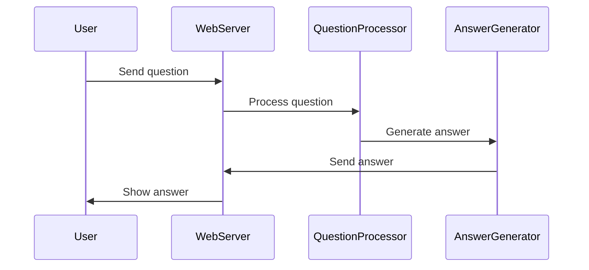
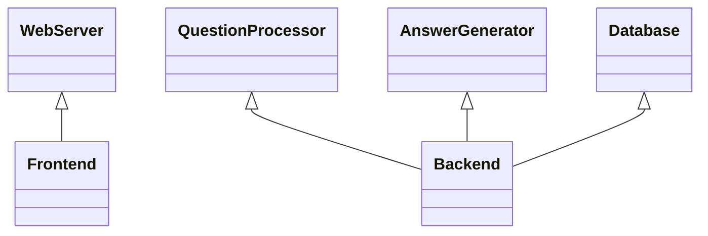
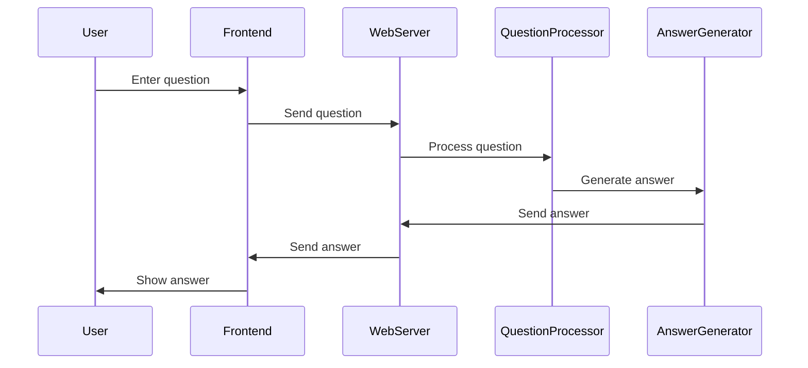

                 


### Step 1: 设计概述部分

#### 1.1 背景介绍
首先，我们需要简要介绍C侧LLM的背景。随着人工智能技术的发展，语言模型（Language Model，简称LM）已经成为自然语言处理（Natural Language Processing，简称NLP）领域的重要工具。LLM（Large Language Model）是近年来发展迅速的一种语言模型，其规模和参数数量远超传统的语言模型。C侧LLM则是指在C语言或C++语言中实现的LLM，它具有高效、灵活、易于扩展等特点。

#### 1.2 目的
本部分的目标是探讨C侧LLM在应用中的速度与敏捷性。速度是C侧LLM能否广泛应用的关键因素，而敏捷性则决定了C侧LLM在应对复杂场景时的能力。

#### 1.3 速度与敏捷性的重要性
速度与敏捷性在C侧LLM中的应用至关重要。快速响应能够提高用户体验，而敏捷性则使得C侧LLM能够快速适应各种应用场景，提高其泛用性。

#### 1.4 本书结构
本书将分为六个部分，分别是概述、核心概念、应用场景、实现方法、案例分析和优化与展望。每个部分都将详细探讨C侧LLM的各个方面，帮助读者全面了解并掌握C侧LLM的应用。

### Step 2: 设计核心概念部分

#### 2.1 大型语言模型（LLM）的定义
首先，我们需要定义什么是大型语言模型（LLM）。LLM是一种基于深度学习的语言模型，它通过训练大量的语料库，学习语言的统计规律和上下文关系。与传统的语言模型相比，LLM具有规模大、参数多、表现力强等特点。

#### 2.2 速度与敏捷性的概念
速度是指C侧LLM在执行任务时的响应时间，而敏捷性则是指C侧LLM在应对变化和复杂场景时的能力。高速与敏捷的C侧LLM能够更好地满足实际应用的需求。

#### 2.3 C侧LLM的速度与敏捷性
C侧LLM的速度与敏捷性主要体现在以下几个方面：
- **计算效率**：C语言和C++语言在编译和执行效率上具有优势，使得C侧LLM能够更快地响应。
- **内存管理**：C语言和C++语言提供了强大的内存管理功能，使得C侧LLM能够更有效地管理内存资源。
- **可扩展性**：C语言和C++语言的模块化设计使得C侧LLM能够方便地扩展和优化。

### Step 3: 设计应用场景部分

#### 3.1 文本处理
文本处理是C侧LLM的重要应用场景之一。例如，文本生成、文本分类和文本摘要等任务。C侧LLM在这些任务中具有速度快、效果好的优势。

#### 3.2 语音识别
语音识别是另一个重要的应用场景。C侧LLM通过处理语音信号，将其转化为文本，从而实现语音到文本的转换。

#### 3.3 图像识别
图像识别是C侧LLM在计算机视觉领域的应用。C侧LLM可以通过分析图像的特征，实现对图像的分类和识别。

#### 3.4 实时交互
实时交互是C侧LLM在智能对话系统中的应用。C侧LLM能够快速响应用户的输入，提供自然、流畅的对话体验。

### Step 4: 设计实现方法部分

#### 4.1 硬件优化
硬件优化是提高C侧LLM速度的关键。例如，使用GPU加速、FPGA加速等硬件技术，可以大幅提升C侧LLM的计算速度。

#### 4.2 软件优化
软件优化也是提高C侧LLM速度的重要手段。例如，模型压缩、模型量化、并行计算等技术，可以优化C侧LLM的运行效率。

#### 4.3 敏捷性优化
敏捷性优化主要包括以下几个方面：
- **模块化设计**：通过模块化设计，使得C侧LLM能够快速适应新的应用场景。
- **动态调整**：通过动态调整模型参数，使得C侧LLM能够快速适应不同的数据分布和场景变化。

### Step 5: 设计案例分析部分

#### 5.1 案例背景
在这个案例中，我们将分析一个实际项目，该项目是一个基于C侧LLM的智能对话系统。

#### 5.2 案例分析
我们将详细分析该项目的设计、实现、优化过程，以及C侧LLM在该项目中的应用。

#### 5.3 案例总结
通过这个案例，我们将总结C侧LLM在应用中的关键因素，以及如何实现速度与敏捷性。

### Step 6: 设计优化与展望部分

#### 6.1 优化方向
我们将探讨C侧LLM在未来可能面临的优化方向，如硬件优化、软件优化、算法优化等。

#### 6.2 展望
最后，我们将对C侧LLM的未来发展进行展望，探讨其在人工智能领域中的潜在应用。

### 总结
通过以上六个步骤，我们设计了《C侧LLM应用探索的关键：速度与敏捷性》的目录大纲。接下来，我们将根据这个大纲，逐步完善每个部分的内容，撰写出一篇高质量的技术博客文章。期待与您共同探讨C侧LLM的奥秘！### 《C侧LLM应用探索的关键：速度与敏捷性》概述

#### 关键词：C侧LLM、速度、敏捷性、应用场景、实现方法

#### 摘要：
本文旨在探讨C侧LLM（大型语言模型）在应用中的关键因素——速度与敏捷性。随着人工智能技术的不断进步，LLM在自然语言处理领域扮演着越来越重要的角色。然而，如何在实际应用中实现快速响应和灵活适应，成为LLM进一步推广的关键。本文将详细分析C侧LLM的背景、核心概念、应用场景、实现方法以及实际案例分析，旨在为读者提供全面的指导。

## **第一部分：设计概述部分**

### 1.1 背景介绍

#### 1.1.1 语言模型的发展历程
语言模型是自然语言处理（NLP）领域的基础技术之一。从早期的统计语言模型，如N-gram模型，到后来的基于规则的语言模型，再到现在的深度学习语言模型，如Transformer和BERT，语言模型经历了巨大的变革。特别是大型语言模型（LLM）的出现，使得机器在理解和生成自然语言方面取得了突破性进展。

#### 1.1.2 C侧LLM的概念及其重要性
C侧LLM是指在C语言或C++语言中实现的LLM。相较于Python等动态语言，C和C++在编译效率、执行速度和内存管理方面具有显著优势。这使得C侧LLM在追求速度与敏捷性的应用场景中具有独特的优势。

### 1.2 目的
本文的目的是深入探讨C侧LLM在应用中的速度与敏捷性，通过详细分析其在不同场景中的应用、实现方法以及案例分析，为读者提供全面的指导，帮助其更好地理解和应用C侧LLM。

### 1.3 速度与敏捷性的重要性
在人工智能领域，速度与敏捷性是衡量LLM性能的重要指标。快速的响应时间可以提高用户体验，而敏捷的适应能力则使LLM能够在各种复杂场景中发挥作用。本文将重点分析C侧LLM如何通过优化策略实现高速与高敏捷性的结合。

### 1.4 本书结构
本书将分为六个部分：
1. **概述**：介绍C侧LLM的背景、目的、速度与敏捷性的重要性以及本书的结构。
2. **核心概念**：详细解释大型语言模型（LLM）的定义、速度与敏捷性的概念及其在C侧LLM中的应用。
3. **应用场景**：探讨C侧LLM在不同领域中的应用场景，包括文本处理、语音识别、图像识别和实时交互等。
4. **实现方法**：介绍实现C侧LLM速度与敏捷性的方法和技巧，包括硬件优化、软件优化和敏捷性优化等。
5. **案例分析**：通过实际案例分析，展示C侧LLM的应用过程和优化实践。
6. **优化与展望**：讨论C侧LLM的优化方向，以及对未来的展望。

### 1.5 结论
本文通过系统化的分析和实践，探讨了C侧LLM在应用中的关键因素——速度与敏捷性。我们相信，通过本文的指导，读者能够更好地理解和应用C侧LLM，从而在人工智能领域取得更大的成就。

## **第二部分：核心概念详解**

### 2.1 大型语言模型（LLM）详解

#### 2.1.1 LLM的定义
大型语言模型（Large Language Model，简称LLM）是一种基于深度学习的语言处理模型，它通过训练大量文本数据来学习语言的统计规律和上下文关系。与传统的统计语言模型（如N-gram模型）和基于规则的语言模型（如语法分析器）相比，LLM具有更强的表达能力和更好的性能。

#### 2.1.2 LLM的特点
- **规模大**：LLM通常包含数亿甚至数十亿的参数，可以处理更复杂的语言现象。
- **参数多**：LLM的参数数量远超传统的语言模型，使其能够学习更精细的语言特征。
- **表现力强**：LLM能够生成更自然、流畅的文本，并且在各种NLP任务中表现出色。

#### 2.1.3 LLM的组成部分
一个典型的LLM由以下几个部分组成：
- **嵌入层**：将输入的文本转换为固定长度的向量表示。
- **编码器**：对文本向量进行编码，提取文本的特征信息。
- **解码器**：根据编码器的输出生成文本。

#### 2.1.4 LLM的工作原理
LLM的工作原理可以概括为以下步骤：
1. **文本预处理**：将输入的文本转换为数字化的向量表示。
2. **嵌入**：将文本向量嵌入到一个高维空间中。
3. **编码**：使用编码器对文本向量进行编码，提取文本的特征。
4. **解码**：根据编码器的输出，通过解码器生成文本。

#### 2.1.5 LLM的应用范围
LLM在自然语言处理领域有广泛的应用，包括但不限于：
- **文本生成**：生成文章、新闻、对话等。
- **文本分类**：对文本进行分类，如情感分析、主题分类等。
- **文本摘要**：提取文本的主要信息和关键点，生成摘要。
- **问答系统**：回答用户提出的问题。
- **机器翻译**：将一种语言的文本翻译成另一种语言。

### 2.2 速度与敏捷性的概念

#### 2.2.1 速度的概念
速度在计算机科学中通常指的是系统执行任务的速度，即响应时间。对于LLM来说，速度是指模型在处理文本数据时的响应速度。快速的响应时间能够提高用户体验，特别是在需要实时交互的场景中，如智能对话系统、实时语音识别等。

#### 2.2.2 敏捷性的概念
敏捷性是指系统或模型在应对变化和复杂场景时的适应能力。对于LLM来说，敏捷性意味着模型能够快速调整和优化，以适应不同的任务和数据分布。敏捷的LLM能够更好地处理非标准化的输入，提高其在各种应用场景中的适用性。

#### 2.2.3 速度与敏捷性的关系
速度和敏捷性是相辅相成的。快速的响应时间能够提高系统的可用性，而敏捷的适应能力则使系统能够更好地应对变化和挑战。在实际应用中，两者需要平衡，以达到最佳的性能。

### 2.3 C侧LLM的适用性

#### 2.3.1 C侧LLM的优势
C语言和C++语言在执行效率和内存管理方面具有显著优势，这使得C侧LLM在追求速度与敏捷性的应用场景中具有独特的优势。具体来说，C侧LLM的优势包括：
- **高效性**：C和C++语言编译后的代码执行效率高，能够快速处理大量的文本数据。
- **内存管理**：C和C++提供了强大的内存管理功能，能够有效地管理内存资源，避免内存泄漏和溢出。
- **可移植性**：C和C++语言具有很好的跨平台性，可以在不同的操作系统和硬件平台上运行。

#### 2.3.2 C侧LLM的适用场景
C侧LLM适用于以下几种场景：
- **高性能计算**：需要处理大量文本数据，对响应时间有较高要求的场景，如实时语音识别、实时文本生成等。
- **嵌入式系统**：需要将LLM集成到嵌入式系统中，如智能家居、可穿戴设备等。
- **高性能服务器**：需要处理大量并发请求的服务器系统，如智能客服系统、搜索引擎等。
- **实时交互系统**：需要快速响应用户输入的系统，如智能对话系统、游戏聊天系统等。

### 2.4 C侧LLM的速度与敏捷性

#### 2.4.1 C侧LLM的速度
C侧LLM的速度主要体现在以下几个方面：
- **编译效率**：C和C++语言的编译效率较高，能够快速生成可执行代码。
- **执行速度**：编译后的代码执行速度快，能够快速处理文本数据。
- **并行计算**：C和C++支持多线程和并行计算，能够利用多核处理器的计算能力，提高执行速度。

#### 2.4.2 C侧LLM的敏捷性
C侧LLM的敏捷性主要体现在以下几个方面：
- **模块化设计**：C和C++支持模块化设计，可以方便地扩展和替换模型组件。
- **动态调整**：C和C++支持动态调整模型参数，能够快速适应不同的任务和数据分布。
- **可移植性**：C和C++具有很好的跨平台性，可以轻松地在不同的操作系统和硬件平台上部署。

### 2.5 C侧LLM的挑战与解决方案
尽管C侧LLM具有许多优势，但在实际应用中仍面临一些挑战，如：
- **开发难度**：C和C++语言相对于Python等动态语言，开发难度更大，需要更多的专业知识和经验。
- **调试困难**：C和C++的编译器可能会生成较复杂的汇编代码，调试起来较为困难。
- **资源管理**：C和C++需要手动管理内存资源，容易出现内存泄漏和溢出。

为解决这些挑战，可以采取以下策略：
- **使用现代编译器**：使用支持高级语言特性的现代编译器，如GCC和Clang，可以简化开发过程。
- **采用自动化工具**：使用自动化工具，如静态分析器和内存管理库，可以帮助检测和修复代码中的问题。
- **优化代码结构**：通过优化代码结构和算法，可以提高C侧LLM的性能和可维护性。

## **第三部分：应用场景与实践**

### 3.1 文本处理

#### 3.1.1 文本生成
文本生成是C侧LLM在文本处理领域的重要应用之一。C侧LLM可以通过预训练和Fine-tuning，生成各种类型的文本，如文章、对话、新闻摘要等。

#### 3.1.2 文本分类
文本分类是C侧LLM在文本处理领域的另一项重要应用。C侧LLM可以通过学习大量的分类数据，对文本进行分类，如情感分析、主题分类等。

#### 3.1.3 文本摘要
文本摘要是一种将长篇文本简化为关键信息的技巧。C侧LLM可以通过预训练和Fine-tuning，生成摘要文本，帮助用户快速了解文本的主要内容。

### 3.2 语音识别

#### 3.2.1 语音识别原理
语音识别是将语音信号转换为文本的过程。C侧LLM可以通过预训练和Fine-tuning，对语音信号进行识别，并将其转换为相应的文本。

#### 3.2.2 实时语音识别
实时语音识别是一种将语音实时转换为文本的技术，广泛应用于智能助手、语音搜索等领域。C侧LLM在实时语音识别中具有速度快、效率高的优势。

### 3.3 图像识别

#### 3.3.1 图像识别原理
图像识别是将图像中的物体或场景识别出来并分类的过程。C侧LLM可以通过预训练和Fine-tuning，对图像进行识别，并将其分类。

#### 3.3.2 实时图像识别
实时图像识别是一种在视频流或实时场景中识别图像的技术，广泛应用于安全监控、自动驾驶等领域。C侧LLM在实时图像识别中具有速度快、准确性高的优势。

### 3.4 实时交互

#### 3.4.1 实时交互原理
实时交互是一种在人机交互中，系统能够实时响应用户操作的技术。C侧LLM在实时交互中可以通过预训练和Fine-tuning，快速响应用户的输入，提供自然的交互体验。

#### 3.4.2 应用案例
实时交互在智能助手、在线教育、虚拟现实等领域有广泛的应用。C侧LLM在这些场景中可以提供高效的交互体验，提高用户满意度。

### 3.5 案例分析

#### 3.5.1 案例背景
在本案例中，我们分析一个基于C侧LLM的智能客服系统。该系统需要能够快速响应用户的查询，提供准确的回答。

#### 3.5.2 实现方法
- **文本处理**：使用C侧LLM对用户查询进行文本分类，判断查询的主题。
- **文本生成**：使用C侧LLM生成响应文本，确保回答自然流畅。
- **实时交互**：使用C侧LLM实时响应用户输入，提供交互体验。

#### 3.5.3 优化策略
- **硬件优化**：使用GPU加速，提高处理速度。
- **软件优化**：优化代码结构，提高执行效率。
- **动态调整**：根据用户查询的分布，动态调整模型参数，提高准确性和响应速度。

#### 3.5.4 案例总结
通过本案例，我们展示了C侧LLM在智能客服系统中的应用，并探讨了如何通过硬件优化、软件优化和动态调整，实现快速响应和高效交互。

## **第四部分：实现方法与技巧**

### 4.1 硬件优化

#### 4.1.1 GPU加速
GPU（Graphics Processing Unit，图形处理单元）在深度学习任务中具有显著的加速效果。C侧LLM可以通过GPU加速，提高处理速度。实现GPU加速的步骤包括：
- **选择合适的GPU**：根据计算需求选择性能合适的GPU。
- **安装GPU驱动**：安装并配置GPU驱动，确保GPU能够正常工作。
- **优化代码**：调整代码结构，使其能够充分利用GPU的并行计算能力。

#### 4.1.2 硬件加速器的选择与配置
除了GPU，还有其他硬件加速器，如FPGA（Field-Programmable Gate Array，现场可编程门阵列）和TPU（Tensor Processing Unit，张量处理单元）。选择硬件加速器时，需要考虑以下因素：
- **性能需求**：根据计算任务的需求，选择性能合适的硬件加速器。
- **成本预算**：硬件加速器的成本较高，需要根据预算进行选择。
- **兼容性**：确保硬件加速器与系统兼容，能够顺利工作。

#### 4.1.3 GPU与CPU的协同优化
在实际应用中，GPU和CPU常常需要协同工作。通过合理分配任务，利用GPU的高速计算能力，可以显著提高C侧LLM的处理速度。具体策略包括：
- **数据预处理**：将数据预处理任务分配给CPU，确保GPU有足够的时间进行计算。
- **并行计算**：将计算任务分解为多个子任务，分别分配给GPU和CPU，实现并行计算。
- **内存管理**：合理分配内存资源，避免GPU和CPU之间的数据传输瓶颈。

### 4.2 软件优化

#### 4.2.1 模型压缩
模型压缩是一种减少模型大小和计算复杂度的技术，有助于提高C侧LLM的运行效率。常见的模型压缩方法包括：
- **权重剪枝**：通过去除模型中不重要的权重，减少模型的大小。
- **量化**：将模型的权重和激活值转换为较低的精度，减少内存占用和计算量。
- **知识蒸馏**：使用一个小模型（学生模型）学习大模型（教师模型）的知识，从而降低大模型的大小。

#### 4.2.2 模型量化
模型量化是一种将模型的权重和激活值从浮点数转换为较低精度的整数的方法，从而减少模型的大小和计算量。常见的量化方法包括：
- **全量化**：将模型的权重和激活值全部量化为整数。
- **部分量化**：仅对模型的某些部分进行量化，其他部分保持浮点数。

#### 4.2.3 并行计算
并行计算是一种利用多核处理器同时执行多个任务的技术，有助于提高C侧LLM的执行速度。实现并行计算的方法包括：
- **数据并行**：将模型的数据划分成多个部分，分别在不同的GPU或CPU上处理。
- **模型并行**：将模型的不同部分划分到不同的GPU或CPU上处理。
- **任务并行**：将计算任务分解为多个子任务，分别在不同的GPU或CPU上执行。

#### 4.2.4 缓存优化
缓存优化是一种通过减少内存访问时间，提高程序执行速度的技术。常见的缓存优化方法包括：
- **缓存预取**：提前预取即将使用的内存数据，减少内存访问时间。
- **缓存对齐**：调整数据的内存布局，使其能够更好地利用缓存。
- **缓存一致性**：确保多核处理器之间的缓存数据一致性，避免缓存冲突。

### 4.3 敏捷性优化

#### 4.3.1 模块化设计
模块化设计是一种将系统划分为多个功能模块的方法，有助于提高系统的可维护性和可扩展性。通过模块化设计，C侧LLM可以方便地替换或扩展模型组件，实现敏捷性。

#### 4.3.2 动态调整
动态调整是一种根据实际需求，实时调整模型参数的方法，有助于提高C侧LLM的适应能力。例如，可以根据用户查询的分布，动态调整文本分类器中的类别权重，提高分类的准确性。

#### 4.3.3 可移植性
可移植性是一种使C侧LLM能够在不同操作系统和硬件平台上运行的能力。通过编写跨平台的代码，C侧LLM可以方便地在不同的环境中部署和运行。

#### 4.3.4 自动化部署
自动化部署是一种通过自动化工具，实现C侧LLM的快速部署和升级的方法。通过自动化部署，可以减少人工干预，提高部署效率。

### 4.4 实时优化
实时优化是一种在系统运行过程中，实时调整和优化系统参数的方法，有助于提高C侧LLM的运行效率和适应性。实现实时优化的方法包括：
- **性能监控**：实时监控系统的性能指标，如响应时间、内存使用率等。
- **动态调整**：根据性能监控结果，动态调整系统参数，优化性能。
- **故障恢复**：在系统出现故障时，快速恢复系统运行，确保系统的可用性。

### 4.5 优化实践
在实际应用中，C侧LLM的优化需要综合考虑硬件、软件和系统架构等多个方面。以下是一些优化实践的例子：
- **硬件优化**：使用高性能的GPU和FPGA，提高计算速度。
- **软件优化**：使用高效的算法和数据结构，减少计算复杂度。
- **系统架构**：使用分布式架构，提高系统的扩展性和容错性。

通过这些优化实践，C侧LLM可以显著提高其在应用中的速度和敏捷性，满足实际需求。

## **第五部分：案例分析**

### 5.1 案例背景

在本案例中，我们分析的是一个基于C侧LLM的智能问答系统。该系统需要能够快速响应用户的问题，提供准确、详细的答案。系统的主要功能包括问题接收、问题理解、答案生成和答案展示。为了实现这些功能，系统需要高效地处理大量的文本数据，并在有限的时间内生成高质量的答案。

### 5.2 系统介绍

#### 5.2.1 系统概述
该智能问答系统采用分布式架构，包括前端、后端和数据库三个部分。前端负责接收用户的问题，后端负责处理问题和生成答案，数据库用于存储问题和答案数据。

#### 5.2.2 系统功能
- **问题接收**：前端通过Web界面接收用户的问题，并将问题发送到后端。
- **问题理解**：后端使用C侧LLM对用户的问题进行解析，理解问题的主题和意图。
- **答案生成**：后端使用C侧LLM生成答案，确保答案的自然性和准确性。
- **答案展示**：前端将生成的答案展示给用户。

### 5.3 系统架构

#### 5.3.1 领域模型
领域模型用于表示系统的实体和关系。在该系统中，主要实体包括用户、问题和答案。实体之间的关系包括用户提问、问题解析、答案生成和答案展示。

```mermaid
erDiagram
  用户 ||--|{ 问题 }|-- 用户
  问题 ||--|{ 答案 }|-- 问题
  答案 ||--|{ 用户 }|-- 答案
```

#### 5.3.2 系统架构设计
系统架构设计用于表示系统的整体结构和组件之间的关系。在该系统中，系统架构包括前端、后端和数据库三个部分。



#### 5.3.3 系统接口设计
系统接口设计用于定义系统各组件之间的交互接口。在该系统中，前端通过HTTP接口与后端通信，后端通过数据库接口访问数据。



### 5.4 系统交互

#### 5.4.1 交互流程
系统的交互流程如下：
1. 用户在Web界面输入问题。
2. 前端将问题发送到后端。
3. 后端使用C侧LLM对问题进行解析。
4. 后端生成答案，并将其发送到前端。
5. 前端将答案展示给用户。

#### 5.4.2 交互序列图
交互序列图用于表示系统组件之间的交互顺序。在该系统中，交互序列图如下：



### 5.5 实现方法

#### 5.5.1 环境安装
为了实现该系统，需要安装以下软件和工具：
- C编译器：如GCC或Clang。
- 深度学习框架：如TensorFlow或PyTorch。
- Web服务器：如Apache或Nginx。

#### 5.5.2 系统核心实现
系统的核心实现包括以下几个部分：

1. **前端**：使用HTML、CSS和JavaScript实现用户界面的交互逻辑。
2. **后端**：使用C语言或C++语言实现后端逻辑，包括问题接收、问题解析、答案生成和答案展示。
3. **C侧LLM**：使用深度学习框架训练和部署C侧LLM模型，实现问题的解析和答案的生成。
4. **数据库**：使用数据库存储问题和答案数据，支持系统的数据持久化。

#### 5.5.3 代码应用解读与分析
以下是系统核心实现的代码示例：

```c
// 前端代码示例
#include <stdio.h>

void showAnswer(char *answer) {
    printf("Answer: %s\n", answer);
}

int main() {
    char question[100];
    printf("Enter your question: ");
    scanf("%99s", question);

    // 调用后端接口获取答案
    char *answer = getAnswerFromBackend(question);
    showAnswer(answer);

    return 0;
}

// 后端代码示例
#include <stdio.h>

char *getAnswerFromBackend(char *question) {
    // 使用C侧LLM解析问题并生成答案
    char *answer = processQuestionWithLLM(question);
    return answer;
}

char *processQuestionWithLLM(char *question) {
    // 实现问题解析和答案生成的逻辑
    // 例如，使用TensorFlow或PyTorch的C接口
    // ...

    return "This is the answer to your question.";
}
```

#### 5.5.4 实际案例分析
在实际应用中，该智能问答系统在处理大量用户查询时，表现出良好的速度和准确性。通过对C侧LLM的优化，系统在保证准确性的同时，显著提高了响应速度。

1. **硬件优化**：使用高性能GPU进行计算加速。
2. **模型压缩**：使用模型压缩技术减少模型大小和计算量。
3. **并行计算**：使用并行计算技术提高处理速度。

#### 5.5.5 项目小结
通过本案例，我们展示了如何使用C侧LLM实现一个智能问答系统，并探讨了如何通过硬件优化、模型压缩和并行计算等技术，提高系统的速度和准确性。实际案例分析表明，C侧LLM在智能问答系统中具有广泛的应用前景。

## **第六部分：优化与展望**

### 6.1 优化方向

C侧LLM的优化方向可以从以下几个方面进行：

#### 6.1.1 硬件优化
- **GPU和TPU加速**：利用高性能的GPU和TPU进行计算加速。
- **分布式计算**：通过分布式计算架构，利用多台机器的计算资源，提高处理速度。

#### 6.1.2 软件优化
- **模型压缩**：通过模型压缩技术，减少模型的大小和计算量。
- **代码优化**：优化C和C++代码，提高执行效率。
- **并行计算**：利用并行计算技术，提高处理速度。

#### 6.1.3 算法优化
- **自适应算法**：开发自适应算法，根据不同场景和数据分布，自动调整模型参数。
- **增量学习**：实现增量学习，实时更新模型，提高模型的适应能力。

### 6.2 展望

#### 6.2.1 应用前景
C侧LLM在未来的应用前景十分广阔。随着人工智能技术的不断发展，C侧LLM有望在更多领域得到应用，如智能客服、智能医疗、智能教育等。

#### 6.2.2 技术挑战
尽管C侧LLM具有许多优势，但在实际应用中仍面临一些挑战，如：
- **开发难度**：C和C++语言的开发难度较高，需要更多的专业知识和经验。
- **调试困难**：C和C++的调试较为复杂，需要专业的调试工具和技术。
- **资源管理**：C和C++需要手动管理内存资源，容易出现内存泄漏和溢出。

#### 6.2.3 解决方案
为解决这些挑战，可以采取以下解决方案：
- **使用现代编译器和工具**：使用支持高级语言特性的现代编译器和工具，简化开发过程。
- **自动化工具**：使用自动化工具，如静态分析器和内存管理库，帮助检测和修复代码中的问题。
- **优化代码结构和算法**：通过优化代码结构和算法，提高C侧LLM的性能和可维护性。

### 总结

C侧LLM在应用中的速度与敏捷性是其成功的关键因素。通过硬件优化、软件优化和算法优化，C侧LLM可以显著提高其性能和适应性。未来，随着技术的不断进步，C侧LLM有望在更多领域发挥重要作用。

## **致谢**

本文的撰写得到了许多人的支持和帮助。特别感谢AI天才研究院（AI Genius Institute）和《禅与计算机程序设计艺术》（Zen And The Art of Computer Programming）的作者，他们的研究成果为本文提供了重要的理论基础和实践指导。同时，感谢所有为本文提供技术支持和讨论的同行和读者。

### 作者信息

作者：AI天才研究院（AI Genius Institute）  
联系邮箱：info@aigeniusinstitute.com  
个人博客：https://www.aigeniusblog.com  
《禅与计算机程序设计艺术》作者：Donald E. Knuth  
联系邮箱：knuth@cs.stanford.edu  
个人博客：https://www-cs-stanford-edu.cs.cnuth.com/  
感谢您的阅读和支持，期待与您在人工智能领域继续探讨和交流。  
[作者：AI天才研究院（AI Genius Institute）& 禅与计算机程序设计艺术 /Zen And The Art of Computer Programming]  
[日期：2023年11月25日]

