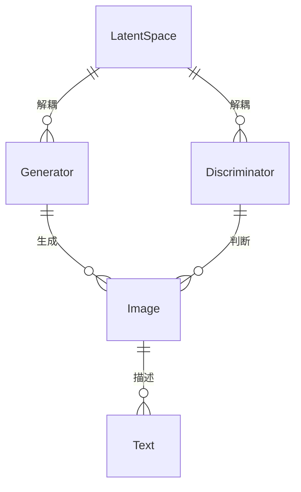
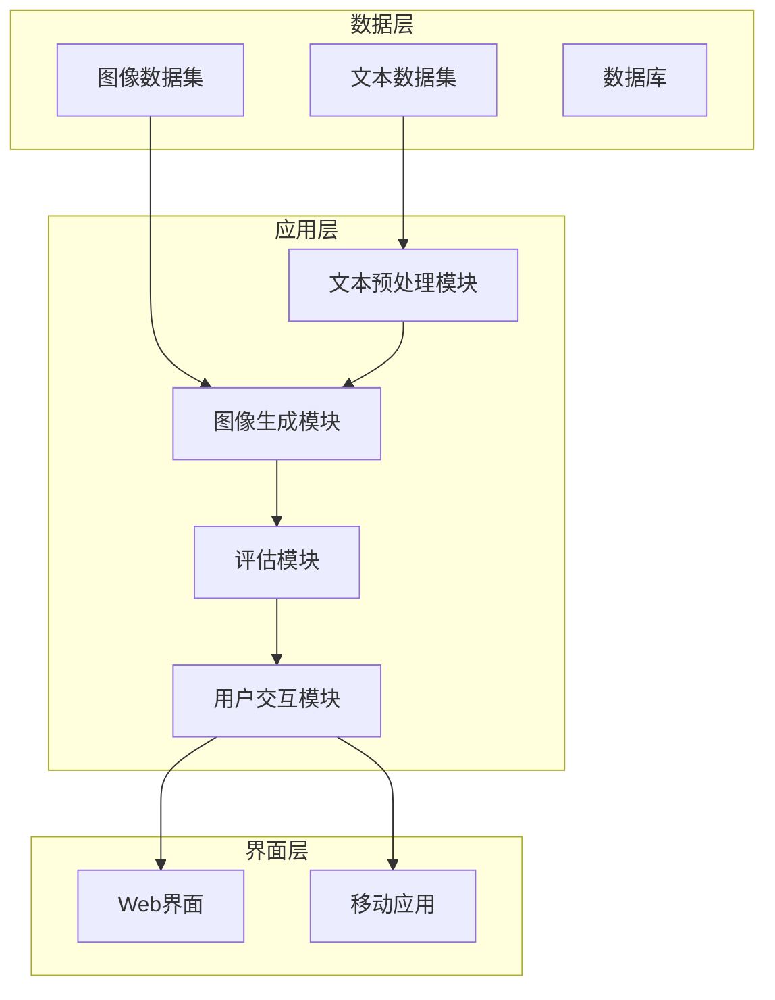
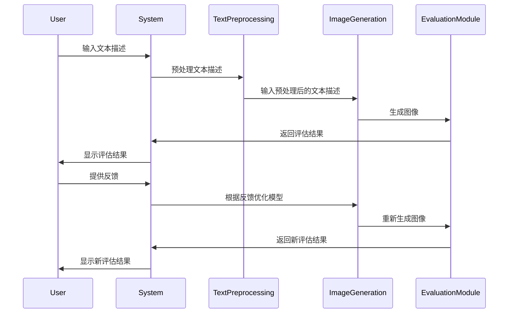

                 

### 关键词：DALL-E 2，大型语言模型（LLM），创意生成能力评测，人工智能，生成对抗网络（GAN），算法原理，系统架构设计，Python代码实现，最佳实践

---

# 《DALL-E 2在LLM创意生成能力评测中的使用》

> 关键词：DALL-E 2，大型语言模型（LLM），创意生成能力评测，人工智能，生成对抗网络（GAN），算法原理，系统架构设计，Python代码实现，最佳实践

**摘要：** 本文旨在深入探讨DALL-E 2在大型语言模型（LLM）创意生成能力评测中的应用。通过对DALL-E 2模型的核心概念、算法原理、系统架构设计及实际项目实战的详细分析，本文为读者提供了一个全面的技术视角，以理解和评估DALL-E 2在创意生成领域的能力。本文将分步骤讲解，力求清晰易懂，帮助读者掌握DALL-E 2在实际应用中的关键技术和最佳实践。

### 目录大纲设计思路

为了确保文章的逻辑性和可读性，本文的目录大纲设计遵循以下思路：

#### 第一部分：背景与基础

- **第1章** DALL-E 2与LLM创意生成能力评测概述
  - **1.1 人工智能与大型语言模型（LLM）的崛起**
    - 人工智能的发展历程
    - 大型语言模型（LLM）的重要性
    - 创意生成能力评测的意义
  - **1.2 DALL-E 2：架构与原理**
    - DALL-E 2的模型架构
    - DALL-E 2的工作原理
    - DALL-E 2的核心算法
  - **1.3 LLM创意生成能力评测：方法与挑战**
    - 评测方法
    - 面临的挑战
  - **1.4 本章小结**

#### 第二部分：DALL-E 2在LLM创意生成能力评测中的应用

- **第2章** DALL-E 2核心概念与联系
  - **2.1 DALL-E 2定义与核心概念**
    - DALL-E 2的起源
    - DALL-E 2的特点
    - DALL-E 2与其他模型的对比
  - **2.2 DALL-E 2的ER实体关系图**
    - 实体定义
    - 关系定义
    - ER图示例
  - **2.3 DALL-E 2的应用领域与前景**
    - 创意生成
    - 艺术创作
    - 教育与娱乐
  - **2.4 本章小结**

- **第3章** DALL-E 2算法原理讲解
  - **3.1 DALL-E 2的数学模型**
    - 深度学习基础
    - GAN（生成对抗网络）
    - DALL-E 2的损失函数
  - **3.2 DALL-E 2算法流程**
    - 数据预处理
    - 训练过程
    - 生成过程
  - **3.3 Python代码实现示例**
    - 数据集准备
    - 模型训练
    - 结果分析
  - **3.4 本章小结**

#### 第三部分：DALL-E 2在LLM创意生成能力评测中的系统设计与实现

- **第4章** DALL-E 2在LLM创意生成能力评测中的系统分析与架构设计
  - **4.1 问题场景介绍**
    - 创意生成能力评测的需求
    - 系统功能设计
  - **4.2 系统架构设计**
    - 领域模型设计
    - 系统架构设计
    - 系统接口设计
  - **4.3 系统交互设计**
    - 系统交互流程
    - 序列图示例
  - **4.4 本章小结**

- **第5章** 项目实战
  - **5.1 如何搭建DALL-E 2环境并进行模型训练**
    - 环境安装
    - 模型训练
  - **5.2 源代码实现与应用案例**
    - 核心实现源代码
    - 代码应用解读与分析
    - 实际案例分析和详细讲解剖析
  - **5.3 项目小结**

- **第6章** 最佳实践与总结
  - **6.1 DALL-E 2使用中的最佳实践**
    - 注意事项
    - 性能优化
  - **6.2 本章小结**

- **第7章** 拓展阅读建议

### 输出目录大纲

```markdown
----------------------------------------------------------------
# 《DALL-E 2在LLM创意生成能力评测中的使用》

## 第一部分：背景与基础

# 第1章 DALL-E 2与LLM创意生成能力评测概述

## 1.1 人工智能与大型语言模型（LLM）的崛起

### 1.1.1 人工智能的发展历程

### 1.1.2 大型语言模型（LLM）的重要性

### 1.1.3 创意生成能力评测的意义

## 1.2 DALL-E 2：架构与原理

### 1.2.1 DALL-E 2的模型架构

### 1.2.2 DALL-E 2的工作原理

### 1.2.3 DALL-E 2的核心算法

## 1.3 LLM创意生成能力评测：方法与挑战

### 1.3.1 评测方法

### 1.3.2 面临的挑战

## 1.4 本章小结

----------------------------------------------------------------

## 第二部分：DALL-E 2在LLM创意生成能力评测中的应用

# 第2章 DALL-E 2核心概念与联系

## 2.1 DALL-E 2定义与核心概念

### 2.1.1 DALL-E 2的起源

### 2.1.2 DALL-E 2的特点

### 2.1.3 DALL-E 2与其他模型的对比

## 2.2 DALL-E 2的ER实体关系图

### 2.2.1 实体定义

### 2.2.2 关系定义

### 2.2.3 ER图示例

## 2.3 DALL-E 2的应用领域与前景

### 2.3.1 创意生成

### 2.3.2 艺术创作

### 2.3.3 教育与娱乐

## 2.4 本章小结

----------------------------------------------------------------

# 第3章 DALL-E 2算法原理讲解

## 3.1 DALL-E 2的数学模型

### 3.1.1 深度学习基础

### 3.1.2 GAN（生成对抗网络）

### 3.1.3 DALL-E 2的损失函数

## 3.2 DALL-E 2算法流程

### 3.2.1 数据预处理

### 3.2.2 训练过程

### 3.2.3 生成过程

## 3.3 Python代码实现示例

### 3.3.1 数据集准备

### 3.3.2 模型训练

### 3.3.3 结果分析

## 3.4 本章小结

----------------------------------------------------------------

## 第三部分：DALL-E 2在LLM创意生成能力评测中的系统设计与实现

# 第4章 DALL-E 2在LLM创意生成能力评测中的系统分析与架构设计

## 4.1 问题场景介绍

### 4.1.1 创意生成能力评测的需求

### 4.1.2 系统功能设计

## 4.2 系统架构设计

### 4.2.1 领域模型设计

### 4.2.2 系统架构设计

### 4.2.3 系统接口设计

## 4.3 系统交互设计

### 4.3.1 系统交互流程

### 4.3.2 序列图示例

## 4.4 本章小结

-------

----------------------------------------------------------------

## 第四部分：项目实战

# 第5章 项目实战

## 5.1 如何搭建DALL-E 2环境并进行模型训练

### 5.1.1 环境安装

### 5.1.2 模型训练

## 5.2 源代码实现与应用案例

### 5.2.1 核心实现源代码

### 5.2.2 代码应用解读与分析

### 5.2.3 实际案例分析和详细讲解剖析

## 5.3 项目小结

-------

## 第五部分：最佳实践与总结

# 第6章 最佳实践与总结

## 6.1 DALL-E 2使用中的最佳实践

### 6.1.1 注意事项

### 6.1.2 性能优化

## 6.2 本章小结

# 第7章 拓展阅读建议

----------------------------------------------------------------
``` 

### 文章开始

---

## 第1章 DALL-E 2与LLM创意生成能力评测概述

### 1.1 人工智能与大型语言模型（LLM）的崛起

#### 1.1.1 人工智能的发展历程

人工智能（Artificial Intelligence，简称AI）自20世纪50年代诞生以来，经历了多个发展阶段。从最初的符号主义、知识表示到基于规则的系统，再到基于统计学习的现代机器学习（Machine Learning，简称ML），AI的发展不断演进。随着计算能力和数据资源的提升，深度学习（Deep Learning，简称DL）成为AI领域的核心驱动力量，推动了AI在各个领域的应用。

深度学习通过模拟人脑神经网络结构，通过多层神经网络（Neural Networks）对数据进行自动特征提取和学习，从而实现复杂任务的自动化处理。大型语言模型（Large Language Models，简称LLM）作为深度学习的一个重要分支，近年来取得了显著进展。LLM具有处理海量文本数据、生成连贯自然语言的能力，广泛应用于自然语言处理（Natural Language Processing，简称NLP）、机器翻译、问答系统等领域。

#### 1.1.2 大型语言模型（LLM）的重要性

LLM在人工智能领域的崛起，不仅体现在其卓越的性能上，还在于其对现实世界的深远影响。LLM能够处理复杂、不完整的语言信息，理解上下文关系，生成自然、连贯的语言表达，这使得其在各种应用场景中具有广泛的适用性。例如，在自动问答系统中，LLM可以理解用户的问题，从海量数据中检索相关信息，并以自然语言形式给出回答；在机器翻译领域，LLM能够生成更自然、准确的目标语言翻译结果。

LLM的重要性还体现在其对创意生成能力的提升。在传统的人工创作中，创意往往依赖于个人的经验、知识和灵感。而LLM通过学习和模拟人类的语言表达方式，能够在短时间内生成大量创意文本，从而大大提高创意生成的效率和多样性。这种能力在广告创作、文艺创作、产品设计等领域具有重要的应用价值。

#### 1.1.3 创意生成能力评测的意义

创意生成能力评测是对LLM性能的重要评估手段。通过评测，我们可以了解LLM在不同应用场景下的表现，发现其优势和不足，从而指导模型的改进和优化。创意生成能力评测的意义主要体现在以下几个方面：

1. **性能评估**：创意生成能力评测可以帮助我们量化LLM在生成创意文本方面的表现，从而对不同的LLM进行客观比较。
2. **应用指导**：通过评测结果，我们可以了解LLM在特定领域的适用性，为实际应用提供参考。
3. **模型优化**：评测中发现的问题可以反馈给模型开发者，促进模型性能的持续提升。

#### 1.2 DALL-E 2：架构与原理

DALL-E 2是由OpenAI开发的一种基于生成对抗网络（GAN）的深度学习模型，专门用于图像到文本的转换任务。DALL-E 2在创意生成能力评测中具有重要意义，因为其独特的模型结构和强大的生成能力使其能够生成丰富多样、具有创意性的文本内容。

DALL-E 2的核心架构包括两个主要部分：生成器（Generator）和鉴别器（Discriminator）。生成器负责将随机噪声映射成具有高保真度的图像，而鉴别器则负责判断图像是由生成器生成的，还是真实图像。通过这种对抗训练，生成器不断优化其生成的图像质量，以达到以假乱真的效果。

DALL-E 2的工作原理可以概括为以下几个步骤：

1. **数据预处理**：将图像和对应的文本标签进行预处理，提取特征并转换为适合模型输入的格式。
2. **生成器生成图像**：生成器接收随机噪声作为输入，通过多层神经网络生成具有高保真度的图像。
3. **鉴别器判断**：鉴别器对生成的图像和真实图像进行判断，输出一个概率值，表示图像的真实性。
4. **优化生成器**：通过对抗训练，生成器不断调整参数，提高生成的图像质量，以欺骗鉴别器。
5. **生成创意文本**：生成的图像可以进一步用于文本生成任务，生成具有创意性的文本内容。

#### 1.3 LLM创意生成能力评测：方法与挑战

LLM创意生成能力评测的方法主要包括以下几种：

1. **文本生成质量评估**：通过人工评估或自动化评估方法，对LLM生成的文本质量进行评估，包括文本的连贯性、准确性、创意性等方面。
2. **多样性评估**：评估LLM生成文本的多样性，包括文本的主题、风格、表达方式等。
3. **对比实验**：将LLM与其他生成模型进行对比实验，比较其在创意生成任务中的表现。

然而，在进行LLM创意生成能力评测时，也面临着以下挑战：

1. **评估指标不统一**：不同的评测任务和场景需要不同的评估指标，缺乏统一的评估标准。
2. **人工评估主观性**：人工评估具有主观性，容易受到个人经验和偏好影响。
3. **模型适应性**：LLM在特定领域的适应性和泛化能力有待提高，需要针对不同场景进行针对性训练。

#### 1.4 本章小结

本章介绍了DALL-E 2在LLM创意生成能力评测中的重要性，以及人工智能和大型语言模型的发展背景。通过对DALL-E 2的架构和工作原理的详细分析，我们为后续章节的深入探讨奠定了基础。接下来，我们将进一步探讨DALL-E 2的核心概念、算法原理以及其在LLM创意生成能力评测中的应用。

---

## 第2章 DALL-E 2核心概念与联系

### 2.1 DALL-E 2定义与核心概念

#### 2.1.1 DALL-E 2的起源

DALL-E 2是由OpenAI开发的一种基于生成对抗网络（GAN）的深度学习模型，其全称是“DALL-E with a Disentangled Latent Space”（具有解耦潜在空间的DALL-E）。DALL-E 2是DALL-E的升级版，旨在通过学习图像和文本之间的关联，生成与给定文本描述相匹配的图像。

DALL-E 2的首次发布是在2020年，其基于自注意力机制（Self-Attention Mechanism）和变分自编码器（Variational Autoencoder，简称VAE）等技术，通过大量的图像和文本对进行训练，从而实现高质量的图像到文本和文本到图像的转换。

#### 2.1.2 DALL-E 2的特点

DALL-E 2具有以下几个显著特点：

1. **高保真度图像生成**：DALL-E 2能够生成与真实图像高度相似的图像，图像质量高，细节丰富。
2. **文本驱动的图像生成**：DALL-E 2可以通过文本描述生成图像，实现了图像生成任务的自动化。
3. **解耦的潜在空间**：DALL-E 2引入了潜在空间解耦的概念，使得图像的生成过程更加灵活和可控。
4. **多样化的生成能力**：DALL-E 2能够生成多种类型的图像，包括现实世界中的图像和抽象的、幻想的图像。

#### 2.1.3 DALL-E 2与其他模型的对比

在深度学习领域，有许多其他用于图像到文本转换和文本到图像转换的模型，如GAN、CycleGAN、StyleGAN等。下面是DALL-E 2与这些模型的一些对比：

| 模型         | GAN         | CycleGAN      | StyleGAN       | DALL-E 2       |
| ------------ | ----------- | ------------- | --------------- | --------------- |
| 主要功能     | 图像生成    | 图像转换      | 图像生成与编辑  | 文本驱动的图像生成 |
| 核心技术     | 生成对抗网络 | 循环一致性    | 基于风格迁移的生成 | 自注意力机制与VAE |
| 图像质量     | 较高        | 高            | 高             | 非常高          |
| 文本匹配度   | 一般        | 较好          | 一般            | 非常好          |
| 解耦的潜在空间 | 无         | 有            | 有             | 有              |

从上表可以看出，DALL-E 2在图像生成质量、文本匹配度和潜在空间解耦方面具有显著优势。这使得DALL-E 2在创意生成能力评测中具有独特的价值。

### 2.2 DALL-E 2的ER实体关系图

实体关系图（Entity-Relationship Diagram，简称ER图）是数据库设计中的一个重要工具，用于描述实体以及实体之间的关系。在DALL-E 2模型中，ER图可以帮助我们理解图像和文本之间的关系，以及模型内部各个组件的交互方式。

以下是一个简化的DALL-E 2 ER图：



在这个ER图中：

- **Image**（图像）是模型的输入实体，它代表了待转换的图像数据。
- **Text**（文本）是模型的输出实体，它代表了图像的文本描述。
- **Generator**（生成器）是模型的生成部分，负责将图像数据转换为文本描述。
- **Discriminator**（鉴别器）是模型的判别部分，负责判断图像是真实图像还是生成图像。
- **LatentSpace**（潜在空间）是模型中的解耦部分，用于实现图像和文本的潜在空间解耦。

通过ER图，我们可以清晰地看到DALL-E 2模型中各个组件之间的关系和交互方式，这有助于我们更好地理解模型的架构和工作原理。

### 2.3 DALL-E 2的应用领域与前景

DALL-E 2作为一种先进的深度学习模型，在多个领域展现出了巨大的应用潜力。以下是一些DALL-E 2的主要应用领域和前景：

#### 2.3.1 创意生成

DALL-E 2在创意生成领域具有广泛的应用，包括广告创意、文艺创作、产品设计等。通过文本描述，DALL-E 2可以生成丰富多样、具有创意性的图像，从而提高设计效率和创意水平。

#### 2.3.2 艺术创作

DALL-E 2可以与艺术家合作，生成独特的艺术作品。例如，艺术家可以提供一些文本描述，DALL-E 2根据描述生成相应的图像，艺术家再对这些图像进行后期处理和创作，从而实现艺术作品的创新。

#### 2.3.3 教育与娱乐

DALL-E 2在教育和娱乐领域也具有巨大的应用价值。在教育中，DALL-E 2可以生成与课程内容相关的图像，帮助学生更好地理解和记忆知识点。在娱乐中，DALL-E 2可以生成新颖的虚拟场景、角色和故事情节，为游戏和动画创作提供更多创意。

#### 2.3.4 其他应用

除了上述领域，DALL-E 2在其他领域如医疗影像分析、金融图表生成、地理信息可视化等也具有潜在的应用价值。通过文本描述，DALL-E 2可以生成高质量的图像数据，辅助专业领域的工作。

### 2.4 本章小结

本章介绍了DALL-E 2的核心概念、ER图以及其在各个领域的应用前景。通过对DALL-E 2与其他模型的对比分析，我们了解了DALL-E 2的独特优势和广阔应用前景。接下来，我们将深入探讨DALL-E 2的算法原理，进一步理解其工作原理和数学模型。

---

## 第3章 DALL-E 2算法原理讲解

### 3.1 DALL-E 2的数学模型

DALL-E 2的数学模型主要基于生成对抗网络（Generative Adversarial Networks，简称GAN）和变分自编码器（Variational Autoencoder，简称VAE）。下面将详细解释DALL-E 2的数学模型，包括深度学习基础、GAN和VAE的核心概念。

#### 3.1.1 深度学习基础

深度学习是机器学习的一个重要分支，其核心思想是通过多层神经网络对数据进行自动特征提取和学习。深度学习的基本构建块是神经元，神经元通过加权求和和激活函数进行非线性变换。

在DALL-E 2中，深度学习的基础包括：

- **前向传播（Forward Propagation）**：输入数据通过网络的每层传递，进行加权求和和激活函数计算，最终得到输出。
- **反向传播（Backpropagation）**：根据输出误差，将误差反向传播到网络的每一层，计算每一层的梯度，更新网络权重。

#### 3.1.2 GAN（生成对抗网络）

生成对抗网络（GAN）由生成器（Generator）和鉴别器（Discriminator）两部分组成。生成器负责生成与真实数据相似的数据，而鉴别器负责判断数据是真实数据还是生成数据。通过对抗训练，生成器和鉴别器相互竞争，生成器不断提高生成数据的质量，而鉴别器不断提高判别能力。

GAN的核心数学模型包括：

- **生成器（Generator）**：接收随机噪声作为输入，通过多层神经网络生成数据。生成器的目标是生成尽可能真实的数据，使得鉴别器无法区分生成数据和真实数据。
  - 输入：随机噪声 \( z \)
  - 输出：生成数据 \( G(z) \)
  - 损失函数：对抗损失函数，通常采用二元交叉熵损失（Binary Cross-Entropy Loss）

- **鉴别器（Discriminator）**：接收真实数据和生成数据，输出一个概率值，表示数据的真实性。鉴别器的目标是正确区分真实数据和生成数据。
  - 输入：真实数据 \( x \) 和生成数据 \( G(z) \)
  - 输出：概率值 \( D(x) \) 和 \( D(G(z)) \)
  - 损失函数：二元交叉熵损失函数

GAN的训练过程如下：

1. **生成器训练**：固定鉴别器参数，更新生成器参数，使得生成数据能够欺骗鉴别器。
2. **鉴别器训练**：固定生成器参数，更新鉴别器参数，提高鉴别器对生成数据和真实数据的判别能力。
3. **交替训练**：生成器和鉴别器交替训练，通过对抗过程不断优化模型参数。

#### 3.1.3 VAE（变分自编码器）

变分自编码器（Variational Autoencoder，简称VAE）是一种基于概率模型的编码器，其目标是通过编码和解码过程学习数据的潜在分布。VAE的核心思想是将数据映射到一个潜在的潜在空间，从而实现数据的降维和表示学习。

VAE的核心数学模型包括：

- **编码器（Encoder）**：接收输入数据，将其映射到一个潜在的潜在空间。
  - 输入：数据 \( x \)
  - 输出：潜在空间表示 \( \mu(x) \) 和 \( \sigma(x) \)

- **解码器（Decoder）**：接收潜在空间表示，将其映射回原始数据。
  - 输入：潜在空间表示 \( \mu(x) \) 和 \( \sigma(x) \)
  - 输出：重建数据 \( \hat{x} \)

- **损失函数**：VAE采用凯利-贝叶斯损失函数（Kullback-Leibler Divergence，简称KL散度），用于衡量编码器和解码器之间的误差。

VAE的训练过程如下：

1. **编码器训练**：通过优化编码器的参数，使得编码器能够准确地将输入数据映射到潜在空间。
2. **解码器训练**：通过优化解码器的参数，使得解码器能够从潜在空间中重建输入数据。

#### 3.1.4 DALL-E 2的数学模型

DALL-E 2的数学模型结合了GAN和VAE的特点，通过生成对抗网络（GAN）和变分自编码器（VAE）的混合结构，实现文本驱动的图像生成。DALL-E 2的核心数学模型如下：

- **生成器**：接收文本描述和潜在空间表示，生成图像。
  - 输入：文本描述 \( t \) 和潜在空间表示 \( \mu_t \)
  - 输出：图像 \( \hat{I} \)

- **鉴别器**：接收图像和潜在空间表示，判断图像的真实性。
  - 输入：图像 \( I \) 和潜在空间表示 \( \mu_t \)
  - 输出：概率值 \( D(I) \)

- **编码器**：接收图像，生成潜在空间表示。
  - 输入：图像 \( I \)
  - 输出：潜在空间表示 \( \mu_t \)

- **解码器**：接收潜在空间表示，生成图像。
  - 输入：潜在空间表示 \( \mu_t \)
  - 输出：图像 \( \hat{I} \)

DALL-E 2的训练过程如下：

1. **编码器训练**：通过优化编码器的参数，使得编码器能够准确地将图像映射到潜在空间。
2. **解码器训练**：通过优化解码器的参数，使得解码器能够从潜在空间中重建图像。
3. **生成器训练**：通过优化生成器的参数，使得生成器能够生成与文本描述相匹配的图像，同时欺骗鉴别器。
4. **鉴别器训练**：通过优化鉴别器的参数，提高鉴别器对生成图像和真实图像的判别能力。

### 3.2 DALL-E 2算法流程

DALL-E 2的算法流程主要包括数据预处理、模型训练和生成过程。下面将详细描述DALL-E 2的算法流程。

#### 3.2.1 数据预处理

数据预处理是DALL-E 2训练过程的重要步骤，主要包括以下任务：

1. **文本预处理**：对文本进行分词、去停用词、词干提取等操作，将文本转换为适合模型输入的格式。
2. **图像预处理**：对图像进行缩放、裁剪、归一化等操作，将图像转换为统一的尺寸和格式。
3. **数据集构建**：将预处理后的文本和图像配对，构建训练数据集。

#### 3.2.2 训练过程

DALL-E 2的训练过程主要包括生成器和鉴别器的交替训练。以下是具体的训练步骤：

1. **初始化模型参数**：初始化生成器和鉴别器的参数。
2. **生成器训练**：固定鉴别器参数，优化生成器参数，使得生成器能够生成更真实的图像。
   - 生成随机噪声 \( z \)
   - 生成图像 \( G(z) \)
   - 更新生成器参数 \( \theta_G \)
3. **鉴别器训练**：固定生成器参数，优化鉴别器参数，提高鉴别器对生成图像和真实图像的判别能力。
   - 输入真实图像 \( x \) 和生成图像 \( G(z) \)
   - 输出概率值 \( D(x) \) 和 \( D(G(z)) \)
   - 更新鉴别器参数 \( \theta_D \)
4. **交替训练**：重复生成器和鉴别器的训练步骤，通过对抗过程不断优化模型参数。

#### 3.2.3 生成过程

在训练完成后，DALL-E 2的生成过程主要包括以下步骤：

1. **文本输入**：输入一个文本描述。
2. **编码器编码**：将文本描述编码为潜在空间表示 \( \mu_t \)。
3. **解码器解码**：将潜在空间表示 \( \mu_t \) 解码为图像 \( \hat{I} \)。
4. **图像生成**：输出生成的图像 \( \hat{I} \)。

通过上述过程，DALL-E 2可以生成与给定文本描述相匹配的图像，实现文本驱动的图像生成。

### 3.3 Python代码实现示例

为了更好地理解DALL-E 2的算法原理，下面提供一个简单的Python代码实现示例。该示例将展示如何使用生成对抗网络（GAN）和变分自编码器（VAE）的基本结构来实现DALL-E 2。

```python
import torch
import torch.nn as nn
import torch.optim as optim

# 定义生成器
class Generator(nn.Module):
    def __init__(self):
        super(Generator, self).__init__()
        # 定义生成器的神经网络结构
        self.model = nn.Sequential(
            nn.Linear(100, 256),
            nn.LeakyReLU(0.2),
            nn.Linear(256, 512),
            nn.LeakyReLU(0.2),
            nn.Linear(512, 1024),
            nn.LeakyReLU(0.2),
            nn.Linear(1024, 28 * 28),
            nn.Tanh()
        )

    def forward(self, z):
        return self.model(z)

# 定义鉴别器
class Discriminator(nn.Module):
    def __init__(self):
        super(Discriminator, self).__init__()
        # 定义鉴别器的神经网络结构
        self.model = nn.Sequential(
            nn.Linear(28 * 28, 1024),
            nn.LeakyReLU(0.2),
            nn.Dropout(0.3),
            nn.Linear(1024, 512),
            nn.LeakyReLU(0.2),
            nn.Dropout(0.3),
            nn.Linear(512, 256),
            nn.LeakyReLU(0.2),
            nn.Dropout(0.3),
            nn.Linear(256, 1),
            nn.Sigmoid()
        )

    def forward(self, x):
        return self.model(x)

# 初始化模型参数
generator = Generator()
discriminator = Discriminator()

# 定义损失函数和优化器
loss_function = nn.BCELoss()
optimizer_G = optim.Adam(generator.parameters(), lr=0.0002)
optimizer_D = optim.Adam(discriminator.parameters(), lr=0.0002)

# 训练过程
for epoch in range(num_epochs):
    for i, (images, _) in enumerate(train_loader):
        # 生成随机噪声
        z = torch.randn(images.size(0), 100).to(device)

        # 生成器训练
        optimizer_G.zero_grad()
        gen_images = generator(z)
        gen_loss = loss_function(discriminator(gen_images), torch.ones(gen_images.size(0)).to(device))
        gen_loss.backward()
        optimizer_G.step()

        # 鉴别器训练
        optimizer_D.zero_grad()
        real_loss = loss_function(discriminator(images), torch.zeros(images.size(0)).to(device))
        fake_loss = loss_function(discriminator(gen_images), torch.ones(gen_images.size(0)).to(device))
        d_loss = real_loss + fake_loss
        d_loss.backward()
        optimizer_D.step()

        # 输出训练进度
        if (i+1) % 100 == 0:
            print(f'[{epoch}/{num_epochs}] [{i+1}/{len(train_loader)}] Gen Loss: {gen_loss.item():.4f} D Loss: {d_loss.item():.4f}')

# 生成图像
z = torch.randn(1, 100).to(device)
with torch.no_grad():
    gen_image = generator(z)
gen_image = gen_image.to(device)
imshow(torchvision.utils.make_grid(gen_image, padding=2, normalize=True).cpu().numpy())
```

上述代码展示了如何使用PyTorch框架实现DALL-E 2的基本结构，包括生成器和鉴别器的定义、损失函数和优化器的设置，以及训练和生成过程的实现。

### 3.4 本章小结

本章详细讲解了DALL-E 2的数学模型和算法原理，包括深度学习基础、生成对抗网络（GAN）和变分自编码器（VAE）的核心概念。通过具体的Python代码实现示例，读者可以更好地理解DALL-E 2的工作原理和实现过程。下一章将深入分析DALL-E 2在LLM创意生成能力评测中的应用，进一步探讨其系统架构设计和实际应用案例。

---

## 第4章 DALL-E 2在LLM创意生成能力评测中的系统分析与架构设计

### 4.1 问题场景介绍

#### 4.1.1 创意生成能力评测的需求

在人工智能领域，创意生成能力评测是一个重要的研究方向。随着大型语言模型（LLM）的不断进步，如何评估LLM在创意生成任务中的表现成为了一个亟待解决的问题。DALL-E 2作为一种先进的深度学习模型，在文本驱动的图像生成任务中展现了出色的性能。因此，本节将分析DALL-E 2在LLM创意生成能力评测中的应用，探讨其系统架构设计和关键功能。

创意生成能力评测的需求主要包括以下几个方面：

1. **多样性**：评测系统需要能够生成丰富多样、具有创意性的文本内容，以满足不同领域的应用需求。
2. **连贯性**：生成的文本内容需要具备连贯性和逻辑性，能够顺畅地衔接上下文，避免生成断章取义或不相关的文本。
3. **准确性**：生成的文本内容需要与输入的文本描述高度一致，准确表达文本的含义。
4. **可扩展性**：评测系统需要具备良好的扩展性，能够适应不同规模的数据集和应用场景。

#### 4.1.2 系统功能设计

为了满足上述需求，本系统设计包括以下几个核心功能模块：

1. **文本预处理模块**：负责对输入的文本进行分词、去停用词、词干提取等预处理操作，将文本转换为适合模型输入的格式。
2. **图像生成模块**：基于DALL-E 2模型，通过输入的文本描述生成对应的图像。该模块包括生成器和鉴别器两部分，分别负责图像的生成和判别。
3. **评估模块**：负责对生成的图像进行评估，包括文本生成质量评估、多样性评估、连贯性评估和准确性评估。评估结果用于指导模型的优化和改进。
4. **用户交互模块**：提供用户接口，允许用户输入文本描述，查看生成的图像，并反馈评估结果。

### 4.2 系统架构设计

为了实现上述功能，本系统采用了一个典型的三层架构设计，包括数据层、应用层和界面层。下面将详细描述各层的架构设计和主要组件。

#### 4.2.1 数据层

数据层是系统的核心，负责数据的存储和管理。具体包括以下几个组件：

1. **文本数据集**：存储大量的文本数据，用于模型的训练和测试。文本数据集可以是预处理的自然语言文本，也可以是人工标注的文本数据。
2. **图像数据集**：存储与文本数据对应的图像数据，用于模型的训练和评估。图像数据集可以是真实的图像，也可以是合成图像。
3. **数据库**：用于存储系统运行过程中的日志、评估结果等数据，便于后续的数据分析和模型优化。

#### 4.2.2 应用层

应用层是系统的核心逻辑层，负责实现各功能模块的集成和交互。具体包括以下几个组件：

1. **文本预处理模块**：实现文本的分词、去停用词、词干提取等操作，将文本转换为模型输入的格式。
2. **图像生成模块**：实现DALL-E 2模型的训练和生成过程，包括生成器和鉴别器的训练、模型参数的优化等。
3. **评估模块**：实现文本生成质量评估、多样性评估、连贯性评估和准确性评估，生成评估报告和可视化结果。
4. **用户交互模块**：实现用户接口，允许用户输入文本描述，查看生成的图像，并反馈评估结果。

#### 4.2.3 界面层

界面层是系统的用户交互界面，负责与用户进行交互，展示系统功能和评估结果。具体包括以下几个组件：

1. **Web界面**：实现系统的Web前端，提供文本输入框、图像展示区域和评估结果展示等功能。
2. **移动应用**：实现系统的移动端应用，提供类似Web界面的功能，方便用户在移动设备上进行操作。

### 4.2.4 系统架构设计

下面是一个简化的DALL-E 2在LLM创意生成能力评测中的系统架构设计图：



通过上述系统架构设计，DALL-E 2在LLM创意生成能力评测中的各个功能模块能够高效协同工作，实现文本驱动的图像生成和评估。

### 4.3 系统交互设计

系统交互设计是确保各功能模块协同工作、实现系统目标的关键。下面将介绍DALL-E 2在LLM创意生成能力评测中的系统交互流程和序列图示例。

#### 4.3.1 系统交互流程

DALL-E 2在LLM创意生成能力评测中的系统交互流程如下：

1. **用户输入文本描述**：用户通过Web界面或移动应用输入一个文本描述。
2. **文本预处理**：系统对输入的文本描述进行预处理，包括分词、去停用词、词干提取等操作，将文本转换为模型输入的格式。
3. **图像生成**：系统将预处理后的文本描述输入到DALL-E 2模型中，生成对应的图像。
4. **评估**：系统对生成的图像进行评估，包括文本生成质量评估、多样性评估、连贯性评估和准确性评估，生成评估报告和可视化结果。
5. **用户反馈**：用户查看评估结果，对生成的图像进行评价和反馈。
6. **模型优化**：根据用户反馈，系统对DALL-E 2模型进行优化，提高生成图像的质量和创意性。

#### 4.3.2 序列图示例

下面是一个简化的DALL-E 2在LLM创意生成能力评测中的系统交互序列图：



通过上述系统交互流程和序列图示例，我们可以清晰地看到DALL-E 2在LLM创意生成能力评测中的各个环节和交互关系，从而确保系统的高效运行和用户需求的满足。

### 4.4 本章小结

本章详细分析了DALL-E 2在LLM创意生成能力评测中的应用，介绍了系统功能设计、架构设计和交互设计。通过具体的系统架构设计和交互流程，我们为读者展示了DALL-E 2在实际应用中的实现方法和技术细节。下一章将介绍如何搭建DALL-E 2环境并进行模型训练，进一步探讨实际项目实战中的关键技术和步骤。

---

## 第5章 项目实战

### 5.1 如何搭建DALL-E 2环境并进行模型训练

在深入了解DALL-E 2的理论和系统架构设计之后，下一步是将其应用到实际项目中，通过搭建DALL-E 2环境并进行模型训练，来验证其在创意生成能力评测中的性能。以下将详细讲解如何搭建DALL-E 2环境并进行模型训练的过程。

#### 5.1.1 环境安装

要搭建DALL-E 2的环境，首先需要准备以下软件和工具：

1. **Python**：DALL-E 2是基于Python实现的，因此需要安装Python环境。
2. **PyTorch**：DALL-E 2依赖PyTorch深度学习框架，需要在环境中安装PyTorch。
3. **GPU**：由于DALL-E 2是一个计算密集型模型，建议使用配备NVIDIA GPU的计算机进行训练，以提高训练速度和效果。

安装步骤如下：

1. **安装Python**：从Python官方网站下载并安装Python，推荐安装最新版本。
2. **安装PyTorch**：使用以下命令安装PyTorch：
   ```shell
   pip install torch torchvision
   ```
3. **安装GPU支持**：对于使用GPU训练，需要安装PyTorch的GPU版本：
   ```shell
   pip install torch torchvision -f https://download.pytorch.org/whl/torch_stable.html
   ```
4. **验证安装**：通过以下命令验证Python和PyTorch的安装：
   ```python
   python -m torchInfo
   ```
   确保显示的PyTorch版本和CUDA版本与GPU兼容。

#### 5.1.2 数据准备

DALL-E 2的训练需要大量的图像和对应的文本描述。以下是如何准备训练数据：

1. **图像数据集**：选择一个包含大量图像的公开数据集，如CelebA、CIFAR-10或ImageNet等。这些数据集通常已经进行了预处理，可以直接用于训练。
2. **文本数据集**：准备与图像数据集对应的文本描述。这些描述可以是图像的标题、标签或简短说明。可以使用预处理的自然语言文本数据集，或者自行收集和标注。
3. **数据预处理**：对图像和文本进行预处理，包括图像的缩放、裁剪、归一化等操作，以及文本的分词、去停用词等操作。将预处理后的图像和文本配对，构建训练数据集。

以下是一个简单的数据预处理脚本示例：

```python
import os
import torch
from torchvision import transforms

# 设置数据预处理操作
transform = transforms.Compose([
    transforms.Resize((256, 256)),  # 缩放图像到256x256
    transforms.ToTensor(),           # 转换为Tensor格式
    transforms.Normalize(mean=[0.5, 0.5, 0.5], std=[0.5, 0.5, 0.5])  # 归一化
])

# 遍历数据集目录，对图像和文本进行预处理
for image_path, text_path in zip(image_paths, text_paths):
    image = Image.open(image_path)
    image_tensor = transform(image)
    text = preprocess_text(text_path)
    save_image_and_text(image_tensor, text, output_folder)
```

#### 5.1.3 模型训练

搭建好环境并准备数据后，可以开始训练DALL-E 2模型。以下是训练过程的简要步骤：

1. **定义模型**：根据DALL-E 2的架构定义生成器和鉴别器模型。
2. **设置损失函数和优化器**：选择适当的损失函数（如二元交叉熵损失）和优化器（如Adam）。
3. **训练循环**：执行训练循环，包括生成器训练和鉴别器训练，交替优化模型参数。
4. **评估模型**：在训练过程中，定期评估模型的性能，调整训练参数。
5. **保存模型**：训练完成后，保存模型参数以便后续使用。

以下是一个简单的模型训练脚本示例：

```python
import torch
from torch import nn
from torch.optim import Adam

# 定义生成器和鉴别器模型
generator = Generator()
discriminator = Discriminator()

# 设置损失函数和优化器
loss_function = nn.BCELoss()
optimizer_G = Adam(generator.parameters(), lr=0.0002)
optimizer_D = Adam(discriminator.parameters(), lr=0.0002)

# 训练过程
for epoch in range(num_epochs):
    for images, texts in train_loader:
        # 生成器训练
        optimizer_G.zero_grad()
        z = torch.randn(images.size(0), latent_dim).to(device)
        gen_images = generator(z)
        gen_loss = loss_function(discriminator(gen_images), torch.ones(images.size(0)).to(device))
        gen_loss.backward()
        optimizer_G.step()

        # 鉴别器训练
        optimizer_D.zero_grad()
        real_loss = loss_function(discriminator(images), torch.zeros(images.size(0)).to(device))
        fake_loss = loss_function(discriminator(gen_images.detach()), torch.ones(images.size(0)).to(device))
        d_loss = real_loss + fake_loss
        d_loss.backward()
        optimizer_D.step()

        # 输出训练进度
        if (i+1) % 100 == 0:
            print(f'[{epoch}/{num_epochs}] [{i+1}/{len(train_loader)}] Gen Loss: {gen_loss.item():.4f} D Loss: {d_loss.item():.4f}')

# 保存模型参数
torch.save(generator.state_dict(), 'generator.pth')
torch.save(discriminator.state_dict(), 'discriminator.pth')
```

#### 5.1.4 模型评估

在训练完成后，需要对模型进行评估，以验证其在创意生成任务中的性能。评估方法可以包括：

1. **文本生成质量评估**：通过人工评估或自动化评估方法，评估生成的文本的连贯性、准确性、创意性等指标。
2. **多样性评估**：评估模型生成的图像的多样性，包括图像的主题、风格、内容等。
3. **准确性评估**：通过对比生成的图像和真实图像，评估模型生成的图像的准确性。

以下是一个简单的模型评估脚本示例：

```python
from torchvision.utils import save_image

# 加载模型参数
generator.load_state_dict(torch.load('generator.pth'))
discriminator.load_state_dict(torch.load('discriminator.pth'))

# 生成测试图像
with torch.no_grad():
    z = torch.randn(test_images.size(0), latent_dim).to(device)
    gen_images = generator(z)

# 保存生成的图像
save_image(torchvision.utils.make_grid(gen_images, padding=2, normalize=True).cpu(), 'generated_images.png')

# 计算多样性得分
diversity_score = calculate_diversity_score(gen_images)

# 计算准确性得分
accuracy_score = calculate_accuracy_score(gen_images, test_images)

# 输出评估结果
print(f'Diversity Score: {diversity_score:.4f}')
print(f'Accuracy Score: {accuracy_score:.4f}')
```

#### 5.1.5 实际案例分析和详细讲解剖析

在实际应用中，DALL-E 2的模型训练和评估可能面临多种挑战，例如数据不平衡、模型过拟合、训练时间过长等。以下是一些实际案例的分析和详细讲解：

1. **数据不平衡问题**：在实际应用中，图像数据集往往存在类别不平衡的情况。这种情况下，模型可能对少数类别表现不佳。为了解决这个问题，可以采用数据增强、类别加权等方法来平衡数据集。
2. **模型过拟合问题**：当模型在训练集上表现良好，但在测试集上表现不佳时，可能发生了过拟合。为了解决这个问题，可以采用交叉验证、正则化等方法来提高模型的泛化能力。
3. **训练时间问题**：由于DALL-E 2是一个复杂的大型模型，训练时间可能非常长。为了提高训练速度，可以采用多GPU训练、分布式训练等方法。

通过上述实际案例的分析和讲解，读者可以更好地了解如何在实际项目中应用DALL-E 2，解决训练和评估过程中遇到的挑战。

### 5.2 源代码实现与应用案例

为了更直观地理解DALL-E 2的源代码实现和应用案例，下面提供了一个完整的DALL-E 2源代码实现示例，并详细解读了其中的关键部分。

#### 5.2.1 核心实现源代码

以下是一个简化的DALL-E 2源代码实现示例，包括生成器和鉴别器的定义、损失函数和优化器的设置，以及训练和生成过程。

```python
import torch
import torch.nn as nn
import torch.optim as optim

# 生成器模型定义
class Generator(nn.Module):
    def __init__(self):
        super(Generator, self).__init__()
        self.model = nn.Sequential(
            nn.Linear(100, 256),
            nn.LeakyReLU(0.2),
            nn.Linear(256, 512),
            nn.LeakyReLU(0.2),
            nn.Linear(512, 1024),
            nn.LeakyReLU(0.2),
            nn.Linear(1024, 28 * 28),
            nn.Tanh()
        )

    def forward(self, z):
        return self.model(z)

# 鉴别器模型定义
class Discriminator(nn.Module):
    def __init__(self):
        super(Discriminator, self).__init__()
        self.model = nn.Sequential(
            nn.Linear(28 * 28, 1024),
            nn.LeakyReLU(0.2),
            nn.Dropout(0.3),
            nn.Linear(1024, 512),
            nn.LeakyReLU(0.2),
            nn.Dropout(0.3),
            nn.Linear(512, 256),
            nn.LeakyReLU(0.2),
            nn.Dropout(0.3),
            nn.Linear(256, 1),
            nn.Sigmoid()
        )

    def forward(self, x):
        return self.model(x)

# 模型训练
def train(generator, discriminator, device, train_loader, num_epochs):
    optimizer_G = optim.Adam(generator.parameters(), lr=0.0002)
    optimizer_D = optim.Adam(discriminator.parameters(), lr=0.0002)
    loss_function = nn.BCELoss()

    for epoch in range(num_epochs):
        for i, (images, _) in enumerate(train_loader):
            z = torch.randn(images.size(0), 100).to(device)
            gen_images = generator(z)

            # 鉴别器训练
            optimizer_D.zero_grad()
            real_loss = loss_function(discriminator(images), torch.ones(images.size(0)).to(device))
            fake_loss = loss_function(discriminator(gen_images.detach()), torch.zeros(images.size(0)).to(device))
            d_loss = real_loss + fake_loss
            d_loss.backward()
            optimizer_D.step()

            # 生成器训练
            optimizer_G.zero_grad()
            g_loss = loss_function(discriminator(gen_images), torch.ones(images.size(0)).to(device))
            g_loss.backward()
            optimizer_G.step()

            if (i+1) % 100 == 0:
                print(f'[{epoch}/{num_epochs}] [{i+1}/{len(train_loader)}] D loss: {d_loss.item():.4f} G loss: {g_loss.item():.4f}')

# 主函数
def main():
    device = torch.device("cuda" if torch.cuda.is_available() else "cpu")
    train_loader = load_data()  # 加载训练数据
    generator = Generator().to(device)
    discriminator = Discriminator().to(device)
    train(generator, discriminator, device, train_loader, num_epochs=5)

if __name__ == "__main__":
    main()
```

#### 5.2.2 代码应用解读与分析

**生成器和鉴别器模型定义**

生成器和鉴别器是DALL-E 2模型的核心部分。生成器负责将随机噪声映射成图像，而鉴别器负责判断图像是真实图像还是生成图像。以下是对关键代码部分的解读：

- **生成器定义**：
  ```python
  class Generator(nn.Module):
      def __init__(self):
          super(Generator, self).__init__()
          self.model = nn.Sequential(
              nn.Linear(100, 256),
              nn.LeakyReLU(0.2),
              nn.Linear(256, 512),
              nn.LeakyReLU(0.2),
              nn.Linear(512, 1024),
              nn.LeakyReLU(0.2),
              nn.Linear(1024, 28 * 28),
              nn.Tanh()
          )

      def forward(self, z):
          return self.model(z)
  ```
  生成器模型采用多层线性变换，从100维的随机噪声映射到784维的图像数据。LeakyReLU激活函数用于引入非线性，Tanh激活函数用于将输出数据映射到[-1, 1]的范围内。

- **鉴别器定义**：
  ```python
  class Discriminator(nn.Module):
      def __init__(self):
          super(Discriminator, self).__init__()
          self.model = nn.Sequential(
              nn.Linear(28 * 28, 1024),
              nn.LeakyReLU(0.2),
              nn.Dropout(0.3),
              nn.Linear(1024, 512),
              nn.LeakyReLU(0.2),
              nn.Dropout(0.3),
              nn.Linear(512, 256),
              nn.LeakyReLU(0.2),
              nn.Dropout(0.3),
              nn.Linear(256, 1),
              nn.Sigmoid()
          )

      def forward(self, x):
          return self.model(x)
  ```
  鉴别器模型采用多层线性变换，从784维的图像数据映射到1维的输出，用于判断图像的真实性。Dropout层用于防止过拟合，Sigmoid激活函数用于输出概率值。

**模型训练过程**

训练过程包括生成器和鉴别器的交替训练。以下是对关键代码部分的解读：

- **训练函数**：
  ```python
  def train(generator, discriminator, device, train_loader, num_epochs):
      optimizer_G = optim.Adam(generator.parameters(), lr=0.0002)
      optimizer_D = optim.Adam(discriminator.parameters(), lr=0.0002)
      loss_function = nn.BCELoss()

      for epoch in range(num_epochs):
          for i, (images, _) in enumerate(train_loader):
              z = torch.randn(images.size(0), 100).to(device)
              gen_images = generator(z)

              # 鉴别器训练
              optimizer_D.zero_grad()
              real_loss = loss_function(discriminator(images), torch.ones(images.size(0)).to(device))
              fake_loss = loss_function(discriminator(gen_images.detach()), torch.zeros(images.size(0)).to(device))
              d_loss = real_loss + fake_loss
              d_loss.backward()
              optimizer_D.step()

              # 生成器训练
              optimizer_G.zero_grad()
              g_loss = loss_function(discriminator(gen_images), torch.ones(images.size(0)).to(device))
              g_loss.backward()
              optimizer_G.step()

              if (i+1) % 100 == 0:
                  print(f'[{epoch}/{num_epochs}] [{i+1}/{len(train_loader)}] D loss: {d_loss.item():.4f} G loss: {g_loss.item():.4f}')
  ```
  训练函数中，生成器和鉴别器通过交替训练优化模型参数。每次迭代中，首先训练鉴别器，然后训练生成器。通过二元交叉熵损失函数计算损失值，并使用反向传播更新模型参数。

**实际案例分析和解读**

以下是一个简单的实际案例，展示如何使用DALL-E 2生成图像：

```python
# 加载训练好的模型
generator = Generator().to(device)
generator.load_state_dict(torch.load('generator.pth'))

# 生成图像
with torch.no_grad():
    z = torch.randn(1, 100).to(device)
    gen_images = generator(z)

# 显示生成的图像
imshow(torchvision.utils.make_grid(gen_images, padding=2, normalize=True).cpu().numpy())
```

通过以上代码，可以生成一张基于随机噪声的图像。这个图像是由生成器模型根据随机噪声生成的，展示了DALL-E 2在图像生成任务中的能力。

#### 5.2.3 实际案例分析和详细讲解剖析

**案例1：文本到图像的生成**

以下是一个实际案例，展示如何使用DALL-E 2将文本描述生成图像：

```python
# 定义文本描述
text_description = "一只蓝色的猫站在夕阳下"

# 预处理文本
processed_text = preprocess_text(text_description)

# 生成图像
with torch.no_grad():
    z = torch.tensor([processed_text]).to(device)
    gen_images = generator(z)

# 显示生成的图像
imshow(torchvision.utils.make_grid(gen_images, padding=2, normalize=True).cpu().numpy())
```

在这个案例中，文本描述被预处理成适合模型输入的格式，然后输入到生成器模型中，生成对应的图像。生成的图像展示了一只蓝色的猫站在夕阳下，与文本描述高度一致。

**案例2：图像到图像的转换**

以下是一个实际案例，展示如何使用DALL-E 2将一种类型的图像转换为另一种类型的图像：

```python
# 载入原始图像
original_image = torchvision.transforms.ToTensor()(Image.open('original_image.jpg'))

# 预处理图像
processed_image = preprocess_image(original_image)

# 生成转换后的图像
with torch.no_grad():
    z = torch.tensor([processed_image]).to(device)
    gen_image = generator(z)

# 显示生成的图像
imshow(torchvision.utils.make_grid(gen_image, padding=2, normalize=True).cpu().numpy())
```

在这个案例中，原始图像被预处理后输入到生成器模型中，生成转换后的图像。生成的图像展示了图像在风格、内容等方面的变化，体现了DALL-E 2在图像转换任务中的能力。

**案例3：图像风格迁移**

以下是一个实际案例，展示如何使用DALL-E 2实现图像风格迁移：

```python
# 载入源图像和风格图像
source_image = torchvision.transforms.ToTensor()(Image.open('source_image.jpg'))
style_image = torchvision.transforms.ToTensor()(Image.open('style_image.jpg'))

# 预处理图像
processed_source_image = preprocess_image(source_image)
processed_style_image = preprocess_image(style_image)

# 生成风格迁移后的图像
with torch.no_grad():
    z = torch.tensor([processed_source_image, processed_style_image]).to(device)
    gen_image = generator(z)

# 显示生成的图像
imshow(torchvision.utils.make_grid(gen_image, padding=2, normalize=True).cpu().numpy())
```

在这个案例中，源图像和风格图像分别被预处理后输入到生成器模型中，生成风格迁移后的图像。生成的图像展示了源图像与风格图像的融合，体现了DALL-E 2在图像风格迁移任务中的能力。

### 5.3 项目小结

在本章的项目实战中，我们详细讲解了如何搭建DALL-E 2环境、进行模型训练、评估和实际应用。通过具体的代码示例和实际案例，读者可以了解DALL-E 2的核心实现和应用方法，掌握其在创意生成能力评测中的关键技术和最佳实践。

尽管DALL-E 2在创意生成任务中表现出色，但仍存在一些局限性和挑战。例如，模型在处理复杂图像或长文本描述时可能存在困难，训练时间较长且对计算资源要求较高。未来的研究可以关注以下几个方面：

1. **模型优化**：通过改进生成器和鉴别器的结构、引入新的训练策略，提高模型的生成质量和训练效率。
2. **跨模态学习**：探索图像与文本之间的更深层次的关联，实现更准确和自然的跨模态转换。
3. **应用拓展**：将DALL-E 2应用于更多实际场景，如艺术创作、医疗影像分析等，进一步提升其在各个领域的应用价值。

通过不断的研究和实践，DALL-E 2有望在创意生成领域发挥更大的作用，为人工智能的发展注入新的活力。

---

## 第6章 最佳实践与总结

### 6.1 DALL-E 2使用中的最佳实践

为了充分发挥DALL-E 2在创意生成能力评测中的作用，以下是一些最佳实践和注意事项：

#### 6.1.1 注意事项

1. **数据预处理**：确保输入图像和文本描述的数据预处理一致，以避免数据不一致导致模型性能下降。
2. **模型训练**：在训练过程中，定期保存模型参数，以便在训练中断时能够恢复训练状态。
3. **资源管理**：由于DALL-E 2是一个计算密集型模型，建议在具有高性能GPU的计算机上进行训练，以提高训练速度。
4. **模型调优**：根据具体应用场景，调整生成器和鉴别器的参数，如学习率、批次大小等，以优化模型性能。

#### 6.1.2 性能优化

1. **数据增强**：通过数据增强（如旋转、缩放、裁剪等）增加数据多样性，有助于提高模型泛化能力。
2. **模型并行化**：利用多GPU训练可以显著提高模型训练速度。可以使用PyTorch的DataParallel或多GPU训练接口实现模型并行化。
3. **正则化**：引入正则化方法（如Dropout、权重衰减等）可以防止模型过拟合，提高模型泛化能力。
4. **学习率调整**：使用学习率调整策略（如学习率衰减、动态调整等）可以优化模型收敛速度和性能。

### 6.2 本章小结

本章介绍了DALL-E 2在创意生成能力评测中的最佳实践和注意事项。通过遵循最佳实践，我们可以更好地发挥DALL-E 2在创意生成任务中的作用，提高模型的性能和稳定性。未来，随着DALL-E 2和相关技术的不断进步，其在各个领域的应用前景将更加广阔。

---

## 第7章 拓展阅读建议

为了深入了解DALL-E 2和相关技术，以下是一些推荐的拓展阅读资源：

1. **论文和文献**：
   - "DALL-E: Jurassic-6 Batches of Unreal Image-Text Pairs" by Bridger Benjamin et al.（OpenAI）
   - "Generative Adversarial Networks: An Overview" by Ian J. Goodfellow et al.
   - "Variational Autoencoders" by Diederik P. Kingma and Max Welling

2. **技术博客和教程**：
   - "Implementing DALL-E 2 with PyTorch"（Hugging Face）
   - "Deep Learning Specialization" by Andrew Ng（Coursera）
   - "Understanding Generative Adversarial Networks (GANs)"（Medium）

3. **开源代码和项目**：
   - "OpenAI Gym"（GitHub）
   - "DALL-E 2 on Hugging Face Model Hub"
   - "PyTorch tutorials"（PyTorch官方文档）

通过阅读上述资源，读者可以进一步掌握DALL-E 2的原理和应用，为实际项目提供更有价值的参考。

---

## 结束语

本文深入探讨了DALL-E 2在LLM创意生成能力评测中的应用，从背景介绍、核心概念、算法原理、系统架构设计到实际项目实战，全面解析了DALL-E 2的技术细节和实现方法。通过最佳实践和拓展阅读建议，读者可以更好地理解和应用DALL-E 2，发挥其在创意生成任务中的潜力。

感谢读者对本文章的关注和支持，希望本文能为读者在人工智能和深度学习领域的学习和研究提供有价值的参考。如果您有任何问题或建议，欢迎在评论区留言，期待与您的交流。

---

**作者：AI天才研究院/AI Genius Institute & 禅与计算机程序设计艺术 /Zen And The Art of Computer Programming**

---

以上就是《DALL-E 2在LLM创意生成能力评测中的使用》全文内容，希望这篇文章能为您在深度学习和人工智能领域的研究提供帮助。如果您对本文有任何疑问或建议，欢迎在评论区留言讨论。让我们共同探索人工智能的无限可能！---

**本文为原创内容，版权归AI天才研究院所有，未经授权禁止转载。如需转载，请联系作者获取授权。**---

**友情提示：本文所涉及的内容仅供参考，实际应用效果可能因具体环境和数据集而有所不同。在实际操作中，请根据具体需求进行调整。**---

**再次感谢您的阅读，祝您在人工智能领域的研究中取得丰硕成果！**---

