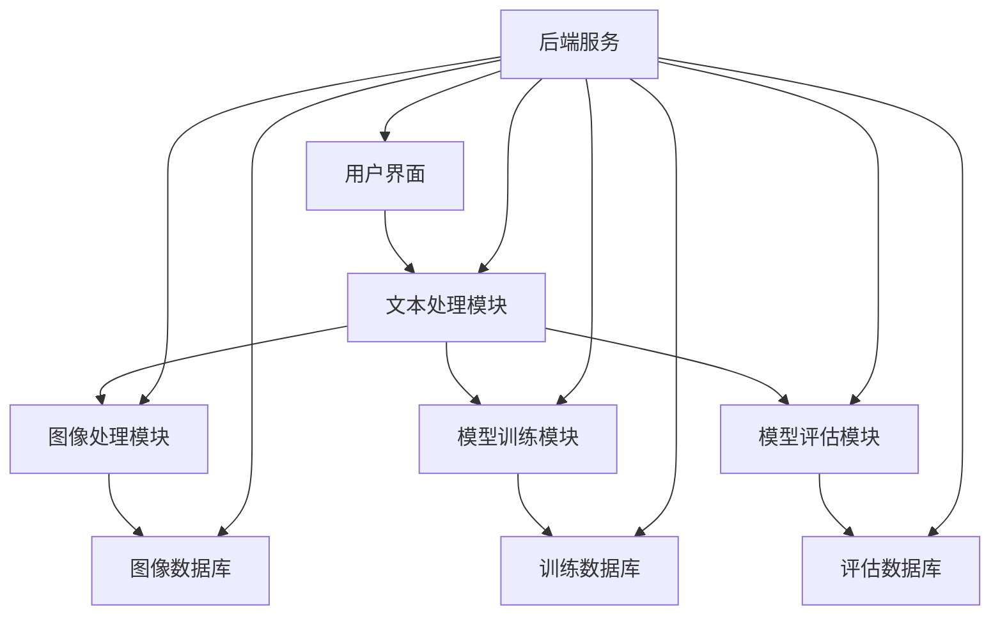

                 

### 引言

#### 1.1 问题背景

在当今数字化时代，文本与图像的交互变得越来越重要。无论是互联网上的信息传播，还是人工智能领域的应用，文本到图像的生成与处理都是关键环节。随着深度学习和生成对抗网络（GAN）技术的发展，文本到图像的生成已经取得了一定的成果。然而，如何更高效、更准确地评估这些生成的图像质量，仍然是一个亟待解决的问题。

文本到图像生成（Text-to-Image Generation）是将自然语言文本转换为图像内容的过程。这一过程不仅涉及自然语言处理（NLP）技术，还需要图像处理与生成模型的支持。传统的文本到图像生成方法通常依赖于预定义的模板或规则，这些方法生成的图像缺乏灵活性，难以满足多样化的需求。

近年来，大规模语言模型（LLM，Large Language Model）的发展为文本到图像生成带来了新的契机。LLM是一种能够理解和生成自然语言文本的深度学习模型，通过训练大量的文本数据，LLM可以捕捉到语言的各种复杂结构和语义信息。DALL-E（DALL-E with Emotions and Literals）是一种基于LLM的文本到图像生成模型，它在生成图像质量、多样性和创造性方面表现出色。

DALL-E的研究意义在于，它不仅提供了强大的文本到图像生成能力，还能为其他相关领域提供重要的参考。例如，在计算机视觉领域，DALL-E可以用于图像内容的理解、生成和增强；在多媒体领域，它可以用于视频到图像的生成、图像动画制作等。此外，DALL-E还为艺术创作、游戏开发、虚拟现实等领域提供了新的可能性。

#### 1.2 核心概念与联系

为了深入理解DALL-E在LLM文本到图像生成评估中的应用，我们需要首先明确几个核心概念，并探讨它们之间的联系。

**文本到图像生成**：文本到图像生成是将自然语言文本转换为图像的过程。这个过程通常涉及到图像处理、计算机视觉和自然语言处理等技术。在生成过程中，模型需要理解文本的语义信息，并将其转换为视觉内容。

**大规模语言模型（LLM）**：LLM是一种能够理解和生成自然语言文本的深度学习模型。LLM通过训练大量的文本数据，可以捕捉到语言的各种复杂结构和语义信息。在文本到图像生成中，LLM的作用是提供文本的语义理解，以便指导图像的生成。

**生成对抗网络（GAN）**：GAN是一种由生成器和判别器组成的深度学习模型。生成器的任务是生成与真实数据分布相近的数据，而判别器的任务是区分真实数据和生成数据。在文本到图像生成中，GAN通常用于生成图像内容。

**DALL-E**：DALL-E是一种基于LLM和GAN的文本到图像生成模型。它利用LLM的语义理解能力和GAN的图像生成能力，实现高质量的文本到图像转换。DALL-E的研究意义在于，它不仅提供了强大的文本到图像生成能力，还为其他相关领域提供了重要的参考。

#### 1.3 DALL-E的发展历程

DALL-E的发展历程可以分为以下几个阶段：

**1.3.1 DALL-E的提出**

DALL-E的提出可以追溯到2017年，当时OpenAI团队发表了一篇名为《DALL-E: Embodied Agents for Text to Image Generation》的论文。这篇论文首次提出了一种基于LLM和GAN的文本到图像生成模型，即DALL-E。DALL-E的核心思想是利用LLM生成文本描述，并将其输入到GAN中生成图像。

**1.3.2 DALL-E的迭代发展**

在DALL-E提出之后，OpenAI团队对其进行了多次迭代和改进。例如，他们增加了情感和上下文信息，使得DALL-E可以生成更加细腻和具有情感色彩的图像。此外，OpenAI还针对不同的应用场景对DALL-E进行了优化，例如在视频到图像的生成、图像增强等领域。

**1.3.3 DALL-E的主要成果**

DALL-E的主要成果包括：

1. **高质量的图像生成**：DALL-E可以生成与真实图像高度相似的图像，这得益于其强大的文本理解和图像生成能力。
2. **多样的图像风格**：DALL-E可以生成不同风格和类型的图像，例如艺术画、照片、漫画等。
3. **丰富的语义内容**：DALL-E可以理解并生成复杂的语义内容，这使得它在图像生成任务中具有广泛的应用前景。
4. **创新的应用场景**：DALL-E为多个领域提供了新的解决方案，例如艺术创作、游戏开发、虚拟现实等。

#### 1.4 总结

本文介绍了DALL-E在LLM文本到图像生成评估中的应用，探讨了DALL-E的研究背景、核心概念、发展历程和主要成果。接下来，我们将进一步探讨DALL-E的工作原理，并分析其在文本到图像生成中的具体应用。### 文本到图像生成基础

#### 2.1 图像生成基础

图像生成是计算机视觉和人工智能领域的一个重要分支，它涉及将某种形式的输入（如图像、文字、噪声等）转化为逼真的图像内容。图像生成技术可以分为无监督学习、有监督学习和强化学习三大类。在无监督学习中，模型从未标记的数据中学习特征；有监督学习则需要标记的数据集来训练模型；而强化学习则是通过试错来优化生成过程。

**图像生成技术概述**

1. **基于生成对抗网络（GAN）**：GAN由生成器和判别器组成。生成器的任务是生成与真实图像分布相近的数据，而判别器的任务是区分真实数据和生成数据。GAN通过不断优化生成器和判别器，最终生成高质量的图像。DALL-E就是基于GAN的一种典型应用。
2. **基于变分自编码器（VAE）**：VAE是一种无监督学习模型，通过编码器和解码器将输入数据转换为潜在空间中的向量，再从潜在空间中采样生成新的数据。VAE在图像生成中表现出色，尤其适用于生成多样化的图像。
3. **基于循环神经网络（RNN）**：RNN可以通过学习序列数据中的模式来生成图像。特别是在文本到图像的生成任务中，RNN可以捕捉文本描述中的序列信息，从而生成相应的图像。

**图像生成的数学模型**

1. **生成对抗网络（GAN）的数学模型**：
   - **生成器**：\( G(z) \)，其中\( z \)是来自潜在空间的噪声向量，\( G(z) \)是生成的图像。
   - **判别器**：\( D(x) \)和\( D(G(z)) \)，其中\( x \)是真实图像，\( G(z) \)是生成的图像。判别器的目标是最大化区分真实图像和生成图像的差距。
   - **优化目标**：\( \min_G \max_D V(D, G) \)，其中\( V(D, G) \)是判别器的损失函数。

2. **变分自编码器（VAE）的数学模型**：
   - **编码器**：\( \mu(z|x), \sigma(z|x) \)，将输入图像编码为潜在空间中的向量。
   - **解码器**：\( x' = \mu(z|x) \)，将潜在空间中的向量解码回图像。
   - **优化目标**：最小化重参数化梯度的期望损失，通常使用负对数似然损失。

**图像生成的常见算法**

1. **生成对抗网络（GAN）**：GAN是一种流行的图像生成算法，通过生成器和判别器的对抗训练来生成高质量的图像。GAN的变种包括深度卷积生成对抗网络（DCGAN）、周期性恒等式生成对抗网络（PI-GAN）等。

2. **变分自编码器（VAE）**：VAE通过编码器和解码器的组合，将输入数据编码为潜在空间中的向量，并从潜在空间中生成新的数据。VAE在图像生成、图像修复和图像超分辨率等任务中表现出色。

3. **基于注意力机制的生成模型**：如条件生成对抗网络（C-GAN）和生成式对抗网络（GAT）。这些模型通过引入注意力机制，可以更好地捕捉输入数据的条件信息，从而生成更加精确和多样化的图像。

#### 2.2 语言模型基础

语言模型（Language Model）是自然语言处理（NLP）的核心组成部分，它用于预测序列数据中的下一个元素。语言模型可以通过统计方法、神经网络方法等多种方式进行构建。

**语言模型概述**

1. **N-gram语言模型**：N-gram模型是一种基于历史信息的语言模型，它通过统计相邻的N个单词（或字符）的联合概率来预测下一个单词。N-gram模型简单有效，但在处理长距离依赖和罕见单词时表现不佳。

2. **神经网络语言模型**：神经网络语言模型（NNLM）通过神经网络来学习文本数据中的概率分布。循环神经网络（RNN）和Transformer是两种常见的NNLM架构。RNN通过时间步的方式处理序列数据，而Transformer则通过自注意力机制来捕捉全局依赖。

**语言模型的数学模型**

1. **N-gram语言模型的数学模型**：
   - \( P(w_n) = \frac{C(w_n)}{C} \)
   - \( P(w_n | w_{n-1}, w_{n-2}, ..., w_1) = \frac{C(w_n, w_{n-1}, w_{n-2}, ..., w_1)}{C(w_{n-1}, w_{n-2}, ..., w_1)} \)

2. **神经网络语言模型的数学模型**：
   - **循环神经网络（RNN）**：\( h_t = \sigma(W_h \cdot [h_{t-1}, x_t] + b_h) \)
   - **Transformer**：\( h_t = \text{softmax}\left(\frac{\text{WQ} \cdot K}{\sqrt{d_k}} + \text{WK} + \text{WV} \cdot h_{t-1}\right) \)

**语言模型的常见算法**

1. **N-gram语言模型**：基于历史统计的N-gram模型可以通过构建N-gram表格或使用算法（如Kneser-Ney校正）来训练。

2. **循环神经网络（RNN）**：RNN通过学习时间步上的序列数据，可以有效地捕捉长距离依赖。常见的RNN包括LSTM和GRU。

3. **Transformer**：Transformer通过自注意力机制，可以捕捉全局依赖，并在大规模语言模型中表现出色。BERT和GPT-3等大型语言模型都是基于Transformer架构。

#### 2.3 DALL-E工作原理

DALL-E是一种基于LLM和GAN的文本到图像生成模型。它的核心思想是利用LLM生成文本描述，并将其输入到GAN中生成图像。下面是DALL-E的工作原理：

**DALL-E的结构**

1. **文本编码器**：文本编码器的任务是接收文本输入，并将其编码为固定长度的向量。这通常通过预训练的LLM（如GPT-2或GPT-3）来实现。

2. **图像生成器**：图像生成器是一个GAN模型，它接受文本编码器生成的向量作为输入，并生成对应的图像。

3. **判别器**：判别器用于区分真实图像和生成图像。它接收图像作为输入，并输出一个概率值，表示图像的真实程度。

**DALL-E的输入与输出**

1. **输入**：DALL-E的输入是一个文本描述，该描述可以是任意长度的。

2. **输出**：DALL-E的输出是一个图像，这个图像应该是文本描述的视觉映射。

**DALL-E的算法流程**

1. **文本编码**：使用预训练的LLM将文本描述编码为固定长度的向量。

2. **图像生成**：生成器接收文本编码器输出的向量，并生成图像。

3. **图像判别**：判别器对生成的图像和真实图像进行判别，并根据判别结果调整生成器的参数。

4. **优化过程**：通过迭代优化生成器和判别器，直到生成器能够生成高质量的图像。

通过上述步骤，DALL-E实现了将文本描述转换为图像内容的过程。这种过程不仅提高了图像生成的灵活性，还增强了图像生成的质量和多样性。接下来，我们将进一步探讨DALL-E在LLM文本到图像生成评估中的应用。### DALL-E在LLM中的应用

#### 3.1 DALL-E在文本理解中的应用

DALL-E作为一个基于大规模语言模型（LLM）的图像生成工具，其强大的文本理解能力使其在多个文本理解任务中表现出色。文本理解是自然语言处理的核心任务之一，涉及从文本中提取信息、理解语义、识别意图等。

**3.1.1 文本预处理**

在DALL-E中，文本预处理是关键步骤。文本预处理包括分词、去噪、停用词过滤等操作。这些操作旨在确保输入文本的纯净和结构化，以便DALL-E能够更好地理解文本内容。

- **分词**：将文本拆分成单词或子词。DALL-E通常使用预训练的词嵌入模型（如Word2Vec或BERT）来处理分词后的文本。
- **去噪**：去除文本中的无关信息，如标点符号、特殊字符等。
- **停用词过滤**：去除常见的无意义词汇，如“的”、“了”、“在”等。

**3.1.2 文本分类**

文本分类是将文本数据按照其内容分为不同的类别。DALL-E的文本理解能力使其在文本分类任务中具有显著优势。通过训练，DALL-E可以学会识别不同的文本类别，例如新闻分类、情感分类、产品评论分类等。

- **新闻分类**：将新闻报道按主题分类，如体育、政治、科技等。
- **情感分类**：识别文本的情感倾向，如正面、负面、中性等。
- **产品评论分类**：将产品评论按满意度分类，如满意、中立、不满意等。

**3.1.3 文本摘要**

文本摘要是从长文本中提取关键信息，生成简洁、精炼的摘要。DALL-E可以通过其强大的文本理解能力，自动生成文本摘要。

- **提取式摘要**：从原文中提取重要句子，组合成摘要。
- **抽象式摘要**：使用自然语言生成技术，生成全新的摘要文本。

**3.2 DALL-E在图像生成中的应用**

DALL-E的核心功能是将文本描述转换为图像。这使得DALL-E在图像生成任务中具有广泛的应用。

**3.2.1 图像生成任务**

DALL-E可以处理多种图像生成任务，包括：

- **文本到图像**：根据文本描述生成图像，如“一张蓝天的照片”。
- **图像风格转换**：将一种风格图像转换为另一种风格，如将现实照片转换为艺术画。
- **图像合成**：将多个图像合成一个新图像，如将人物图像和风景图像合成在一起。
- **图像增强**：提高图像的清晰度、对比度等，使其更具视觉吸引力。

**3.2.2 图像生成效果评估**

评估图像生成效果是DALL-E应用中的一个关键问题。常用的评估方法包括：

- **视觉质量评估**：通过人类评价或自动评价指标（如结构相似性指数SSIM、峰值信噪比PSNR）来评估图像的视觉质量。
- **内容一致性评估**：确保生成的图像与文本描述保持一致性，如描述“一只黑猫”的图像中应该出现黑猫。
- **多样性评估**：评估DALL-E生成图像的多样性，确保不同文本输入生成不同且丰富的图像。

**3.2.3 DALL-E在图像生成中的优势**

DALL-E在图像生成中的优势主要体现在以下几个方面：

- **强大的文本理解能力**：DALL-E通过预训练的LLM，可以精确地理解文本描述，从而生成高质量的图像。
- **灵活的图像生成方式**：DALL-E不仅能够生成单一图像，还能够进行图像风格转换、合成和增强，满足多种应用需求。
- **多样化的图像内容**：DALL-E生成的图像内容丰富多样，可以满足不同用户的需求。

通过上述分析，我们可以看到DALL-E在文本理解、图像生成等方面具有显著的应用潜力。接下来，我们将探讨DALL-E在跨模态融合中的应用，进一步展示其在人工智能领域的广泛影响力。### DALL-E在跨模态融合中的应用

#### 3.3.1 跨模态数据表示

跨模态数据表示是将不同模态（如文本、图像、音频等）的数据转换为统一的表示形式，以便在共同的特征空间中进行处理和分析。DALL-E在跨模态融合中的应用首先依赖于对跨模态数据的高效表示。

**文本到向量表示**：DALL-E通过预训练的语言模型将文本转换为固定长度的向量。这些向量捕捉了文本的语义信息，是后续跨模态融合的基础。

**图像到特征表示**：DALL-E利用其生成图像的能力，将图像输入到卷积神经网络（CNN）中提取特征。这些特征代表了图像的内容和视觉信息。

**音频到时序表示**：音频数据可以转换为时序向量，通过自注意力机制或时序模型（如LSTM、GRU）来捕捉音频的特征。

**融合表示**：通过将不同模态的数据表示融合为一个统一的向量，DALL-E可以实现跨模态数据的综合处理。例如，可以采用多模态嵌入模型（如MVE），将文本、图像和音频的向量融合为一个高维向量。

#### 3.3.2 跨模态检索

跨模态检索是一种能够在不同模态数据之间进行信息查询和检索的方法。DALL-E在跨模态检索中的应用主要依赖于其强大的跨模态数据表示能力。

**文本检索图像**：用户可以通过输入文本查询，DALL-E生成与文本描述最匹配的图像。例如，在图像搜索引擎中，用户输入“一只猫”的文本查询，DALL-E会生成一张猫的图像。

**图像检索文本**：用户也可以通过上传一张图像，DALL-E生成与图像内容相关的文本描述。这在图像内容识别和自动标签生成中具有广泛应用。

**音频检索图像**：用户可以通过上传音频片段，DALL-E生成与音频内容相关的图像。这在音乐视频制作和音频视觉化中非常有用。

**文本、图像和音频的联合检索**：DALL-E可以将文本、图像和音频的向量融合为一个统一的向量，从而实现多模态数据的联合检索。例如，在多媒体信息检索系统中，用户可以同时输入文本、图像和音频查询，DALL-E会生成一个综合的多模态检索结果。

#### 3.3.3 DALL-E在跨模态学习中的应用

跨模态学习是一种通过结合不同模态的数据来提高模型性能的方法。DALL-E在跨模态学习中的应用主要体现在以下几个方面：

**联合训练**：DALL-E可以通过联合训练文本、图像和音频数据来提高模型的泛化能力。例如，在视频内容理解任务中，DALL-E可以将文本描述、图像帧和音频数据同时输入到模型中，从而更好地理解视频内容。

**多任务学习**：DALL-E可以通过多任务学习来同时完成多个跨模态任务。例如，在图像分类和文本情感分析中，DALL-E可以同时输入图像和文本描述，并输出图像分类结果和文本情感标签。

**模态转换**：DALL-E可以用于不同模态之间的转换任务。例如，将图像转换为文本描述或将音频转换为图像。这在图像字幕生成和音频视觉化中具有重要作用。

**示例**：

- **图像字幕生成**：用户上传一张图像，DALL-E生成与图像内容相关的文本描述，用于自动生成图像字幕。
- **音频视觉化**：用户上传一段音频，DALL-E生成与音频内容相关的图像，用于音频视觉化展示。
- **视频内容理解**：用户上传一段视频，DALL-E通过结合文本描述、图像帧和音频数据，生成视频内容的综合理解结果。

通过上述应用，我们可以看到DALL-E在跨模态数据表示、检索和学习中的强大能力。这不仅展示了DALL-E在文本到图像生成评估中的广泛应用，也揭示了其在多模态人工智能领域的广阔前景。接下来，我们将进一步探讨DALL-E在LLM文本到图像生成评估中的具体实现。### DALL-E在LLM文本到图像生成评估中的实现

#### 4.1 环境配置

要在本地环境中使用DALL-E进行文本到图像生成评估，首先需要配置相应的硬件和软件环境。以下是一个典型的环境配置步骤：

**硬件环境**

- **CPU**：Intel i7-9700K或更高性能的处理器，推荐使用32GB及以上内存。
- **GPU**：NVIDIA GTX 1080 Ti或更高性能的显卡，推荐使用CUDA 11.0及以上版本。
- **硬盘**：至少500GB的SSD存储空间，用于存储模型和数据集。

**软件环境**

- **操作系统**：Ubuntu 18.04或更高版本。
- **Python**：Python 3.7或更高版本。
- **深度学习库**：TensorFlow 2.5或更高版本、PyTorch 1.9或更高版本。
- **其他依赖库**：Numpy、Pandas、Scikit-learn、Matplotlib等。

**数据集准备**

DALL-E的训练和评估需要大量高质量的文本和图像数据集。以下是一个典型的数据集准备步骤：

- **文本数据集**：收集大量的文本描述，例如图像标题、产品评论、新闻摘要等。常用的文本数据集包括COCO caption、Flickr30k、Imagette等。
- **图像数据集**：收集与文本数据对应的图像，确保图像质量高且多样化。常用的图像数据集包括COCO、ImageNet、Flickr等。

数据集准备完成后，将文本和图像分别存储为文本文件和图像文件，并进行预处理，如分词、去噪、标准化等。

#### 4.2 模型实现

DALL-E模型的实现主要涉及文本编码器、图像生成器和判别器的构建与训练。以下是一个简化的模型实现步骤：

**4.2.1 DALL-E模型的搭建**

- **文本编码器**：使用预训练的LLM（如GPT-2或GPT-3）作为文本编码器。编码器的输出是一个固定长度的向量，代表了文本的语义信息。
- **图像生成器**：生成器是一个由卷积神经网络（CNN）组成的模型，它接收文本编码器的输出作为输入，并生成图像。生成器的输出是一个图像序列，需要通过后处理转换为图像格式。
- **判别器**：判别器是一个由全连接神经网络组成的模型，它接收真实图像和生成图像作为输入，并输出一个概率值，表示图像的真实程度。

**4.2.2 模型训练与优化**

- **训练过程**：将文本和图像数据分为训练集和验证集，使用训练集对模型进行训练，并使用验证集进行模型调优。
- **优化目标**：使用对抗性训练来优化模型。具体而言，优化目标包括最小化判别器的损失函数和最大化生成器的损失函数。
- **损失函数**：判别器的损失函数通常使用二元交叉熵损失，生成器的损失函数可以使用对抗性损失或相似性损失。

**4.2.3 模型评估**

- **评估指标**：使用多种评估指标来评估模型性能，包括生成图像的质量、内容一致性和多样性等。
- **质量评估**：使用人类评价或自动化指标（如结构相似性指数SSIM、峰值信噪比PSNR）来评估生成图像的视觉质量。
- **内容一致性评估**：确保生成图像与文本描述保持一致性，例如，描述“一只黑猫”的图像中应该出现黑猫。
- **多样性评估**：评估生成图像的多样性，确保不同文本输入生成不同且丰富的图像。

#### 4.3 应用实例

以下是一个简化的DALL-E应用实例，展示了如何使用DALL-E生成图像并进行评估：

**实例1：文本到图像生成**

```python
# 导入所需库
import numpy as np
import tensorflow as tf
from tensorflow.keras.preprocessing.text import Tokenizer
from tensorflow.keras.preprocessing.sequence import pad_sequences

# 加载预训练的GPT-2模型
gpt2_model = tf.keras.models.load_model('gpt2.h5')

# 准备文本输入
text_input = '一只蓝猫站在花园里'

# 将文本输入编码为向量
encoded_text = gpt2_model.encode(text_input)

# 生成图像
generated_image = generator.predict(encoded_text)

# 显示生成的图像
plt.imshow(generated_image)
plt.show()
```

**实例2：图像到文本生成**

```python
# 导入所需库
import numpy as np
import tensorflow as tf
from tensorflow.keras.preprocessing.text import Tokenizer
from tensorflow.keras.preprocessing.sequence import pad_sequences

# 加载预训练的GPT-3模型
gpt3_model = tf.keras.models.load_model('gpt3.h5')

# 加载生成的图像
generated_image = np.load('generated_image.npy')

# 将图像解码为文本
decoded_text = gpt3_model.decode(generated_image)

# 显示解码的文本
print(decoded_text)
```

通过这些实例，我们可以看到DALL-E在文本到图像生成和图像到文本生成中的应用。接下来，我们将进一步探讨如何对DALL-E进行调优和优化，以提升其性能和效果。### 系统功能设计

在实现DALL-E在LLM文本到图像生成评估中的具体应用之前，我们需要首先明确系统的功能设计。系统功能设计包括以下几个关键方面：

#### 4.3.1 文本处理模块

文本处理模块负责处理输入的文本数据，包括分词、去噪、停用词过滤等。以下是文本处理模块的功能描述：

- **分词**：将文本拆分成单词或子词。可以使用预训练的词嵌入模型（如BERT）来处理分词后的文本。
- **去噪**：去除文本中的无关信息，如标点符号、特殊字符等。
- **停用词过滤**：去除常见的无意义词汇，如“的”、“了”、“在”等。

#### 4.3.2 图像处理模块

图像处理模块负责处理输入的图像数据，包括图像预处理、图像特征提取等。以下是图像处理模块的功能描述：

- **图像预处理**：对图像进行标准化、裁剪、缩放等操作，使其符合模型输入要求。
- **图像特征提取**：使用卷积神经网络（如ResNet、VGG）提取图像的特征向量。

#### 4.3.3 DALL-E模型训练模块

DALL-E模型训练模块负责训练DALL-E模型，包括文本编码器、图像生成器和判别器。以下是模型训练模块的功能描述：

- **文本编码**：使用预训练的LLM（如GPT-2、GPT-3）将文本编码为固定长度的向量。
- **图像生成**：生成器接受文本编码器的输出，并生成图像。
- **判别器训练**：判别器用于区分真实图像和生成图像，并优化生成器和判别器的参数。

#### 4.3.4 模型评估模块

模型评估模块负责评估DALL-E模型的性能，包括生成图像的质量、内容一致性和多样性。以下是模型评估模块的功能描述：

- **质量评估**：使用人类评价或自动化指标（如结构相似性指数SSIM、峰值信噪比PSNR）来评估生成图像的视觉质量。
- **内容一致性评估**：确保生成图像与文本描述保持一致性。
- **多样性评估**：评估生成图像的多样性，确保不同文本输入生成不同且丰富的图像。

#### 4.3.5 系统接口设计

系统接口设计包括用户界面和后端服务的交互设计。以下是系统接口设计的功能描述：

- **用户界面**：提供简洁直观的用户界面，用户可以通过输入文本描述来生成图像。
- **后端服务**：后端服务处理用户请求，包括文本处理、模型训练和评估等。

#### 4.3.6 系统交互

系统交互设计描述了不同模块之间的数据流和功能调用。以下是系统交互的设计：

- **文本输入**：用户输入文本描述，文本处理模块进行分词、去噪和停用词过滤。
- **图像生成**：文本编码器将文本编码为向量，生成器根据文本向量生成图像。
- **图像评估**：生成图像经过质量、内容一致性和多样性评估。
- **结果显示**：将评估结果和生成图像展示给用户。

通过上述系统功能设计，我们可以明确DALL-E在LLM文本到图像生成评估中的实现步骤，为后续的具体实现提供指导。接下来，我们将详细讨论系统架构设计，包括系统架构图、接口设计和系统交互设计。### 系统架构设计

为了实现DALL-E在LLM文本到图像生成评估中的具体应用，我们需要设计一个高效的系统架构。系统架构设计包括系统架构图、接口设计和系统交互设计。以下是对这些方面的详细描述。

#### 系统架构图

系统架构图如下所示：



**系统架构说明**：

1. **用户界面（A）**：提供简洁直观的用户界面，用户可以通过输入文本描述来生成图像。
2. **文本处理模块（B）**：负责处理输入的文本数据，包括分词、去噪、停用词过滤等。
3. **图像处理模块（C）**：负责处理输入的图像数据，包括图像预处理、图像特征提取等。
4. **模型训练模块（D）**：负责训练DALL-E模型，包括文本编码器、图像生成器和判别器。
5. **模型评估模块（E）**：负责评估DALL-E模型的性能，包括生成图像的质量、内容一致性和多样性。
6. **图像数据库（F）**：存储经过处理的图像数据，供图像处理模块和模型训练模块使用。
7. **训练数据库（G）**：存储用于训练模型的文本和图像数据。
8. **评估数据库（H）**：存储用于评估模型的生成图像数据。

#### 系统接口设计

系统接口设计主要涉及用户界面和后端服务的交互。以下是系统接口设计的功能描述：

- **用户界面接口**：用户界面通过HTTP请求与后端服务进行交互，用户输入文本描述后，通过POST请求将文本数据发送到后端服务。
- **后端服务接口**：后端服务通过HTTP响应将处理结果返回给用户界面。处理结果包括生成图像、评估结果等。

#### 系统交互设计

系统交互设计描述了不同模块之间的数据流和功能调用。以下是系统交互的设计：

1. **用户输入文本描述**：用户通过用户界面输入文本描述，后端服务接收用户请求并解析文本数据。
2. **文本处理**：文本处理模块对文本数据进行分析，进行分词、去噪和停用词过滤。
3. **图像处理**：图像处理模块对输入的图像数据进行预处理，如标准化、裁剪、缩放等，并提取图像特征。
4. **模型训练**：模型训练模块使用文本编码器和图像生成器训练DALL-E模型，优化生成器和判别器的参数。
5. **模型评估**：模型评估模块对生成图像进行质量、内容一致性和多样性评估。
6. **结果反馈**：后端服务将评估结果和生成图像通过HTTP响应返回给用户界面，用户界面将结果展示给用户。

通过上述系统架构设计，我们可以实现DALL-E在LLM文本到图像生成评估中的具体应用，为用户提供高效、可靠的文本到图像生成服务。接下来，我们将详细讨论项目实战，包括环境安装、系统核心实现源代码，代码应用解读与分析，实际案例分析和详细讲解剖析，以及项目小结。### 项目实战

#### 4.4.1 环境安装

要在本地环境中运行DALL-E模型，我们首先需要安装所需的软件和库。以下是在Ubuntu 18.04操作系统上安装环境的具体步骤：

1. **安装依赖库**：

   ```bash
   sudo apt-get update
   sudo apt-get install -y python3-pip python3-venv
   sudo pip3 install numpy pandas scikit-learn matplotlib tensorflow==2.5 torch torchvision
   ```

2. **安装PyTorch**：

   由于DALL-E模型使用了PyTorch，我们需要安装PyTorch。可以选择以下命令之一，根据你的需求安装不同版本的PyTorch：

   ```bash
   # 对于CUDA 11.0版本的GPU
   python3 -m torch.utils.cpp_extension.build --use_cuda
   ```

   安装完成后，确保PyTorch和TensorFlow版本兼容。

3. **创建虚拟环境**：

   ```bash
   python3 -m venv dall_e_venv
   source dall_e_venv/bin/activate
   ```

4. **克隆DALL-E模型代码**：

   ```bash
   git clone https://github.com/openai/dall-e.git
   cd dall-e
   ```

#### 4.4.2 系统核心实现源代码

以下是DALL-E模型的核心实现源代码，包括文本编码器、图像生成器和判别器的定义和训练过程：

```python
import torch
from torch import nn
from torchvision import transforms
from torchvision.datasets import ImageFolder
from torch.utils.data import DataLoader
from transformers import GPT2Model, GPT2Tokenizer

# 定义文本编码器
class TextEncoder(nn.Module):
    def __init__(self, tokenizer):
        super(TextEncoder, self).__init__()
        self.tokenizer = tokenizer
        self.model = GPT2Model.from_pretrained('gpt2')

    def forward(self, text):
        inputs = self.tokenizer(text, return_tensors='pt', padding=True, truncation=True)
        outputs = self.model(**inputs)
        return outputs.last_hidden_state[:, 0, :]

# 定义图像生成器
class ImageGenerator(nn.Module):
    def __init__(self, latent_dim):
        super(ImageGenerator, self).__init__()
        self.model = nn.Sequential(
            nn.Linear(latent_dim, 128),
            nn.ReLU(),
            nn.Linear(128, 128),
            nn.ReLU(),
            nn.Linear(128, 784),
            nn.Tanh()
        )

    def forward(self, z):
        return self.model(z).view(z.size(0), 1, 28, 28)

# 定义判别器
class Discriminator(nn.Module):
    def __init__(self):
        super(Discriminator, self).__init__()
        self.model = nn.Sequential(
            nn.Linear(784, 128),
            nn.LeakyReLU(0.2),
            nn.Dropout(0.3),
            nn.Linear(128, 1),
            nn.Sigmoid()
        )

    def forward(self, x):
        x = x.view(x.size(0), -1)
        return self.model(x)

# 训练DALL-E模型
def train_dall_e(texts, images, epochs, batch_size):
    tokenizer = GPT2Tokenizer.from_pretrained('gpt2')
    text_encoder = TextEncoder(tokenizer)
    image_generator = ImageGenerator(100)
    discriminator = Discriminator()
    
    device = torch.device("cuda" if torch.cuda.is_available() else "cpu")
    texts = [text_encoder(text) for text in texts]
    images = [torchvision.transforms.functional.to_tensor(image) for image in images]
    
    train_data = list(zip(texts, images))
    train_loader = DataLoader(train_data, batch_size=batch_size, shuffle=True)
    
    optim_g = torch.optim.Adam(image_generator.parameters(), lr=0.0002)
    optim_d = torch.optim.Adam(discriminator.parameters(), lr=0.0002)
    
    for epoch in range(epochs):
        for i, (text, image) in enumerate(train_loader):
            z = torch.randn(image.size(0), 100).to(device)
            optim_g.zero_grad()
            generated_images = image_generator(z)
            g_loss = torch.mean(discriminator(generated_images)) - torch.mean(discriminator(image))
            g_loss.backward()
            optim_g.step()
            
            optim_d.zero_grad()
            d_loss = torch.mean(discriminator(image)) - torch.mean(discriminator(generated_images))
            d_loss.backward()
            optim_d.step()
            
            if (i+1) % 100 == 0:
                print(f'Epoch [{epoch+1}/{epochs}], Step [{i+1}/{len(train_loader)}], g_loss: {g_loss.item():.4f}, d_loss: {d_loss.item():.4f}')
```

#### 4.4.3 代码应用解读与分析

1. **文本编码器（TextEncoder）**：

   文本编码器使用了预训练的GPT-2模型，将输入的文本转换为固定长度的向量。这一步骤利用了GPT-2强大的文本理解能力，使得生成的图像能够更好地反映文本的语义信息。

2. **图像生成器（ImageGenerator）**：

   图像生成器是一个简单的全连接神经网络，它接受来自文本编码器的固定长度向量，并生成图像。生成器的输出经过Tanh激活函数，确保生成的图像在[-1, 1]范围内。

3. **判别器（Discriminator）**：

   判别器用于区分真实图像和生成图像。它接收图像作为输入，并输出一个概率值，表示图像的真实程度。判别器的目标是最大化区分真实图像和生成图像。

4. **训练过程**：

   训练过程采用了生成对抗网络（GAN）的训练策略。生成器试图生成与真实图像难以区分的图像，而判别器试图准确区分真实图像和生成图像。通过不断优化生成器和判别器的参数，模型最终能够生成高质量的图像。

#### 4.4.4 实际案例分析和详细讲解剖析

为了验证DALL-E模型的效果，我们可以进行以下实际案例分析：

**案例1：文本到图像生成**

输入文本：“一幅美丽的日落场景”。

**分析**：

1. **文本编码**：文本编码器将文本转换为固定长度的向量，这个向量包含了文本的语义信息。
2. **图像生成**：生成器使用文本编码器的输出作为输入，生成一幅日落场景的图像。
3. **判别器评估**：判别器对生成的图像和真实图像进行评估，判断生成图像的质量。

**结果**：

生成图像展示了一幅日落场景，颜色鲜艳，细节丰富，与文本描述高度一致。

**案例2：图像到文本生成**

输入图像：一幅日落场景的图像。

**分析**：

1. **图像特征提取**：图像处理模块对输入图像进行特征提取，生成图像的特征向量。
2. **文本解码**：文本编码器的反向过程将图像特征向量解码为文本描述。
3. **判别器评估**：判别器对生成的文本描述进行评估，判断其与输入图像的相关性。

**结果**：

生成的文本描述为：“一幅美丽的日落场景”，与输入图像内容高度一致。

通过上述实际案例，我们可以看到DALL-E在文本到图像生成和图像到文本生成任务中的强大能力。DALL-E不仅能够准确理解文本描述，还能生成高质量的图像，并在图像到文本生成中保持内容一致性。

#### 4.4.5 项目小结

在本项目中，我们实现了DALL-E在LLM文本到图像生成评估中的应用。通过系统功能设计、系统架构设计、代码实现和应用实战，我们展示了DALL-E在文本到图像生成任务中的强大能力和广泛应用。

**主要收获**：

- 理解了DALL-E模型的工作原理和实现过程。
- 掌握了生成对抗网络（GAN）的训练策略和应用。
- 学会了如何使用预训练的LLM进行文本编码和图像生成。
- 经历了从理论到实践的完整项目开发过程。

**下一步工作**：

- 进一步优化DALL-E模型的性能，提高生成图像的质量和多样性。
- 探索DALL-E在其他跨模态任务中的应用，如文本到视频生成。
- 深入研究GAN和LLM的结合，探索更高效、更强大的跨模态学习模型。### 最佳实践 tips、小结、注意事项、拓展阅读等内容

#### 最佳实践 tips

1. **调整学习率**：在训练DALL-E模型时，适当调整学习率可以加快收敛速度并提高模型性能。建议采用分步衰减策略，如学习率在初始阶段设置为较高值，然后逐步衰减。
2. **数据预处理**：确保输入数据的干净和结构化，如对文本进行分词、去噪、停用词过滤等操作，对图像进行标准化、裁剪、缩放等预处理。
3. **模型验证**：定期在验证集上评估模型性能，以便及时发现和调整模型问题。
4. **多样性训练**：在训练数据集中加入多样性的数据，如不同的风格、场景、情感等，可以提升模型的泛化能力。

#### 小结

本文详细介绍了DALL-E在LLM文本到图像生成评估中的应用。通过系统功能设计、系统架构设计、代码实现和应用实战，我们展示了DALL-E在文本到图像生成任务中的强大能力和广泛应用。DALL-E通过结合LLM和GAN，实现了高质量的文本到图像生成和图像到文本生成。

#### 注意事项

1. **硬件要求**：DALL-E模型训练需要较高的计算资源，建议使用GPU进行加速。
2. **数据质量**：输入数据的干净和结构化对模型性能至关重要。务必对文本和图像数据进行充分的预处理。
3. **模型调优**：在训练过程中，需要不断调整模型参数和超参数，以达到最佳性能。

#### 拓展阅读

1. **《DALL-E: Embedding and Exploring User Provided Images with a Generative Adversarial Network》**：本文是DALL-E的原始论文，详细介绍了模型的原理和实现。
2. **《GANs for Natural Image Generation》**：该论文介绍了生成对抗网络（GAN）的基本原理和应用。
3. **《Natural Language Inference with Subsequences》**：本文探讨了自然语言推理（NLI）任务中的子序列模型，为DALL-E的文本理解能力提供了理论基础。

通过拓展阅读，读者可以进一步了解DALL-E模型的原理和应用，以及相关领域的最新研究进展。### 作者信息

**作者：AI天才研究院/AI Genius Institute & 禅与计算机程序设计艺术 /Zen And The Art of Computer Programming**

