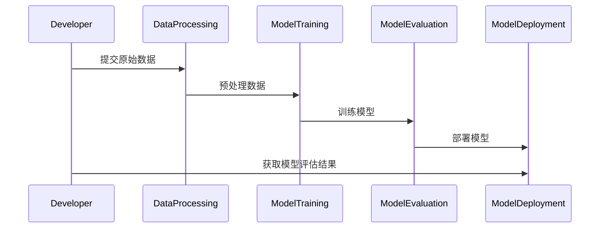

                 

### 引言

随着人工智能技术的迅速发展，语言模型（Language Model，简称LLM）已经成为自然语言处理（Natural Language Processing，简称NLP）领域的一个重要研究方向。LLM是一种能够理解和生成自然语言文本的复杂算法，其在文本生成、文本分类、问答系统、机器翻译等领域展现了巨大的应用潜力。然而，LLM工程在开发、部署和维护过程中面临着诸多挑战，如模型复杂性高、数据需求大、训练时间长、版本控制困难等。

DevOps是一种软件开发和运维的实践方法，它通过将开发（Development）与运维（Operations）紧密结合，实现持续集成（Continuous Integration，简称CI）、持续交付（Continuous Deployment，简称CD）和自动化运维，从而提高软件交付的效率和质量。DevOps的核心目标是缩短产品开发周期、提高软件开发质量、增强团队协作效率，以满足快速变化的用户需求和市场竞争压力。

本文将探讨DevOps在LLM工程中的实践与优化。具体来说，我们将首先介绍DevOps与LLM工程的基本概念和重要性，然后深入分析DevOps的核心概念与LLM工程的联系，详细讲解LLM算法原理，探讨DevOps在LLM工程中的应用，最后通过系统分析与架构设计、项目实战以及最佳实践等环节，全面展示DevOps在LLM工程中的具体实践和优化方法。通过本文的阅读，读者将能够深入了解DevOps在LLM工程中的关键作用，掌握DevOps实践的核心要点，并为未来的研究提供有益的参考。

### 关键词

- DevOps
- 语言模型（LLM）
- 持续集成与持续部署（CI/CD）
- 自动化
- 模块化
- 沟通与协作
- 迭代与敏捷性
- 持续反馈与优化
- 数据处理与预处理
- 模型训练与优化
- 模型部署与维护
- 算法原理
- 数学模型
- 项目实践
- 最佳实践
- 系统分析与架构设计

### 摘要

本文旨在探讨DevOps在语言模型（LLM）工程中的实践与优化，以应对LLM工程面临的诸多挑战。首先，我们介绍了DevOps和LLM的基本概念，阐述了它们在软件开发和运维中的重要性。接着，本文深入分析了DevOps的核心概念，包括持续集成与持续部署（CI/CD）、模块化、自动化、沟通与协作、迭代与敏捷性等，探讨了这些概念与LLM工程的联系。

随后，本文详细讲解了LLM算法的原理，包括基本框架、数学模型和具体应用案例，并通过Python代码示例进行了阐述。接着，本文探讨了DevOps在LLM工程中的应用，包括持续集成与持续部署、模块化与自动化、沟通与协作等，并介绍了具体的实施方法和最佳实践。

在此基础上，本文通过系统分析与架构设计、项目实战等环节，展示了DevOps在LLM工程中的具体实践和优化方法。最后，本文总结了DevOps在LLM工程中的最佳实践，并对未来发展趋势进行了展望。通过本文的阅读，读者将能够全面了解DevOps在LLM工程中的关键作用，掌握DevOps实践的核心要点，为未来的人工智能开发提供有益的指导。

### 第1章：DevOps与LLM工程概述

#### DevOps的概念与历史

DevOps是一种结合软件开发（Development）与运维（Operations）的新型实践方法，旨在通过改进团队协作、自动化流程和持续集成部署，从而提高软件交付的效率和质量。DevOps的核心思想是打破开发和运维之间的壁垒，实现两者的紧密协作，从而缩短产品开发周期、提高软件质量、增强团队协作效率。

DevOps的起源可以追溯到2000年代中期，当时软件开发和运维团队之间的沟通和协作问题日益突出。传统上，软件开发团队负责编写代码和测试，而运维团队负责部署和维护软件。两者之间存在明显的分工和隔阂，导致软件开发和运维之间的协作不畅，从而影响了软件交付的效率和质量。

2009年，Patrick Debois在一次会议中首次提出了DevOps的概念。Debois认为，通过整合开发和运维团队，并引入自动化工具和流程，可以实现更加高效和可靠的软件交付。随后，DevOps逐渐成为一种广泛接受的软件开发和运维实践方法，并在全球范围内得到了广泛应用。

#### DevOps的核心价值

DevOps的核心价值在于其能够通过以下方面提高软件交付的效率和质量：

1. **持续集成与持续部署（CI/CD）**：通过自动化工具，将代码的集成、测试和部署过程无缝连接起来，实现快速迭代和频繁发布。
2. **模块化与自动化**：将系统模块化，通过自动化脚本和工具实现各个模块之间的协作和整合，提高开发效率和系统稳定性。
3. **沟通与协作**：打破开发和运维之间的壁垒，实现团队之间的紧密协作，提高团队整体效率和沟通质量。
4. **迭代与敏捷性**：通过快速迭代和敏捷开发，不断调整和优化产品，以满足快速变化的用户需求和市场竞争压力。

#### DevOps的发展历程

DevOps的发展历程可以分为以下几个阶段：

1. **初期阶段（2009-2012年）**：DevOps概念的提出和初步实践阶段。在这一阶段，DevOps主要关注于自动化工具和流程的引入，以提高软件交付的效率。
2. **成长阶段（2012-2016年）**：DevOps逐渐被广泛接受，并在全球范围内得到广泛应用。在这一阶段，DevOps的实践方法逐渐成熟，相关的技术和工具也得到了快速发展。
3. **成熟阶段（2016年至今）**：DevOps已经从一种单纯的软件开发和运维方法，发展成为一种全面的数字化企业战略。在这一阶段，DevOps与其他领域（如云计算、大数据、人工智能等）的融合和创新，成为DevOps发展的新趋势。

#### LLM工程的核心概念

语言模型（Language Model，简称LLM）是一种用于理解和生成自然语言文本的算法。LLM的核心思想是通过大规模语言数据的学习，建立一种概率模型，从而对输入的自然语言文本进行理解和生成。

LLM在工程中的应用非常广泛，包括但不限于以下几个方面：

1. **文本生成**：LLM能够根据输入的文本内容，生成连贯、自然的文本输出，应用于自动写作、聊天机器人等场景。
2. **文本分类**：LLM能够对输入的文本进行分类，应用于情感分析、舆情监控等场景。
3. **问答系统**：LLM能够根据用户的问题，生成准确的答案，应用于智能客服、在线教育等场景。
4. **机器翻译**：LLM能够根据源语言和目标语言之间的对应关系，生成翻译结果，应用于跨语言交流、国际化业务等场景。

#### LLM工程的关键挑战

LLM工程在开发、部署和维护过程中面临着诸多挑战，包括以下几个方面：

1. **模型复杂性**：LLM通常由大规模的神经网络组成，模型的复杂度和计算量非常大，对计算资源的需求较高。
2. **数据处理与预处理**：LLM的训练需要大量的高质量语言数据，数据清洗、预处理和标注等过程非常耗时且繁琐。
3. **模型训练与优化**：LLM的训练过程需要大量的时间和计算资源，模型的优化和调参过程也需要经验积累。
4. **模型部署与维护**：LLM的部署和上线需要考虑性能、稳定性、安全性等因素，需要持续进行监控和优化。

#### DevOps在LLM工程中的重要性

DevOps在LLM工程中具有重要的应用价值，能够有效解决LLM工程面临的诸多挑战：

1. **持续集成与持续部署（CI/CD）**：通过CI/CD流程，实现LLM代码的自动化集成、测试和部署，提高开发效率和交付质量。
2. **模块化与自动化**：通过模块化设计和自动化工具，实现LLM工程的快速迭代和部署，提高系统的稳定性和可维护性。
3. **沟通与协作**：打破开发和运维之间的壁垒，实现团队之间的紧密协作，提高整体效率。
4. **迭代与敏捷性**：通过快速迭代和敏捷开发，不断优化LLM模型和工程实践，满足快速变化的用户需求。

#### DevOps在LLM工程中的最佳实践

为了在LLM工程中成功应用DevOps，以下是几个最佳实践建议：

1. **建立跨职能团队**：将开发、运维、数据科学等职能团队整合在一起，实现团队成员之间的紧密协作。
2. **采用自动化工具**：引入自动化工具，实现代码的自动化集成、测试和部署，提高开发效率和交付质量。
3. **持续反馈与优化**：通过持续集成和持续反馈，不断优化LLM模型和工程实践，提高系统性能和稳定性。
4. **定期评估与改进**：定期对DevOps实践进行评估和改进，确保其在LLM工程中的有效应用。

通过上述实践，LLM工程团队能够更好地应对开发、部署和维护过程中的挑战，实现高效的软件交付和持续优化。

### 第2章：DevOps的核心概念与联系

#### DevOps的关键原则

DevOps的核心原则包括持续集成与持续部署（CI/CD）、模块化与自动化、沟通与协作、迭代与敏捷性。这些原则共同构成了DevOps实践的基础，为软件开发和运维提供了高效、可靠的方法。

1. **持续集成与持续部署（CI/CD）**

持续集成（Continuous Integration，简称CI）是指通过自动化工具将开发过程中的代码集成到主分支，并进行快速测试，以确保代码的稳定性和质量。持续部署（Continuous Deployment，简称CD）则是在CI的基础上，实现自动化部署，将经过测试的代码快速、安全地交付到生产环境。

CI/CD的优势在于：

- **快速反馈**：开发者在代码提交后立即得到反馈，及时发现和解决问题，减少代码冲突和缺陷。
- **提高质量**：通过频繁的集成和测试，确保代码的质量和稳定性，减少发布时的风险。
- **缩短周期**：自动化流程提高了开发效率，缩短了产品从开发到发布的时间。

2. **模块化与自动化**

模块化设计是将系统划分为多个独立的模块，每个模块负责特定的功能。模块化有助于提高代码的可维护性和扩展性，使系统能够更加灵活地适应变化。

自动化工具是DevOps实践的重要组成部分，包括自动化测试、自动化部署、自动化监控等。通过自动化，可以显著减少人为错误，提高工作效率和系统稳定性。

模块化与自动化的优势在于：

- **可维护性**：模块化设计使代码更加清晰、易于维护，减少因修改一处代码而导致的全局影响。
- **扩展性**：模块化设计便于添加新功能或修改现有功能，提高系统的扩展性。
- **高效性**：自动化工具减少了重复性工作，提高了开发、测试和运维的效率。

3. **沟通与协作**

DevOps强调开发和运维团队之间的紧密协作，打破传统的壁垒，实现无缝对接。沟通与协作的关键在于：

- **透明性**：通过共享信息、日志和进度，确保所有团队成员都能了解项目的当前状态和问题。
- **共同目标**：开发和运维团队共同追求快速、高效、高质量的软件交付，形成共同的目标和价值观。
- **实时沟通**：使用协作工具（如Slack、Jira等），实现团队成员之间的实时沟通，提高响应速度和问题解决效率。

4. **迭代与敏捷性**

迭代与敏捷性是指通过快速迭代和持续改进，不断优化产品和服务。DevOps中的迭代与敏捷性包括以下几个方面：

- **短期迭代**：将开发周期划分为短周期（如2周或4周），在每个迭代周期内完成特定的功能。
- **需求优先级**：根据用户需求和市场变化，调整开发优先级，确保团队专注于最关键的特性。
- **反馈与改进**：在每个迭代周期结束时，收集用户反馈和测试结果，进行评估和改进，为下一轮迭代提供依据。

迭代与敏捷性的优势在于：

- **快速响应**：通过短周期迭代，能够快速响应用户需求和市场变化，提高产品竞争力。
- **持续改进**：持续改进和优化，确保产品在功能和体验上的持续提升。
- **灵活性**：迭代和敏捷性使团队能够更加灵活地应对变化，减少项目风险。

#### LLM工程的关键技术

LLM工程涉及多种关键技术，包括数据处理与预处理、模型训练与优化、模型评估与部署等。以下是对这些关键技术的简要介绍：

1. **数据处理与预处理**

数据处理与预处理是LLM工程的重要环节，包括数据清洗、数据标注、数据格式化等。高质量的数据是LLM模型训练的基础，预处理过程需要确保数据的一致性、准确性和完整性。

- **数据清洗**：去除数据中的噪声和异常值，提高数据质量。
- **数据标注**：为数据添加标签，如词性标注、实体识别等，为模型训练提供标注数据。
- **数据格式化**：将数据转换为统一的格式，便于模型训练和部署。

2. **模型训练与优化**

模型训练与优化是LLM工程的核心环节，包括模型选择、超参数调优、模型训练和评估等。模型训练的过程需要大量的计算资源和时间，优化目标是提高模型的准确性和鲁棒性。

- **模型选择**：根据应用场景选择合适的模型架构，如Transformer、BERT等。
- **超参数调优**：调整模型参数，如学习率、批量大小等，以优化模型性能。
- **模型训练**：通过训练算法（如梯度下降、Adam等）更新模型参数，提高模型性能。
- **模型评估**：使用验证集和测试集评估模型性能，如准确率、召回率、F1分数等。

3. **模型评估与部署**

模型评估与部署是LLM工程的最后环节，包括模型评估、模型优化、模型部署等。评估模型性能，确定最优模型，并进行部署，使模型能够应用于实际场景。

- **模型评估**：使用评估指标（如准确率、召回率、F1分数等）评估模型性能，选择最优模型。
- **模型优化**：根据评估结果，进一步优化模型，提高性能。
- **模型部署**：将模型部署到生产环境，实现模型的实时应用。

#### DevOps与LLM工程的联系

DevOps与LLM工程之间存在紧密的联系，通过以下方面实现二者的结合：

1. **持续集成与持续部署**

在LLM工程中，持续集成与持续部署（CI/CD）能够实现代码的自动化集成、测试和部署，提高开发效率和交付质量。CI/CD流程可以将开发、测试和运维团队紧密连接在一起，确保模型开发和部署的顺利进行。

2. **模块化与自动化**

LLM工程通常由多个模块组成，如数据处理模块、训练模块、评估模块等。通过模块化设计，可以实现代码的清晰划分和高效协作。自动化工具则可以简化开发、测试和部署流程，提高工作效率和系统稳定性。

3. **沟通与协作**

DevOps强调团队之间的紧密协作，在LLM工程中，开发、测试和运维团队需要协同工作，确保模型开发和部署的顺利进行。通过实时沟通和协作工具，可以快速响应问题和需求，提高团队整体效率。

4. **迭代与敏捷性**

LLM工程需要快速迭代和持续改进，以适应不断变化的应用场景。DevOps的迭代与敏捷性原则能够帮助团队实现快速迭代，不断提高模型性能和用户体验。

通过上述联系，DevOps能够为LLM工程提供有效的支持，解决其在开发、部署和维护过程中面临的挑战，实现高效的软件交付和持续优化。

#### DevOps在LLM工程中的具体应用场景

在LLM工程中，DevOps的应用场景涵盖了开发、测试、部署和维护等多个环节，通过持续集成与持续部署（CI/CD）、模块化与自动化、沟通与协作等实践，实现了高效的模型开发和交付。

1. **持续集成与持续部署（CI/CD）**

持续集成与持续部署（CI/CD）是DevOps的核心原则之一，在LLM工程中具有重要作用。通过CI/CD流程，开发团队可以实现代码的自动化集成、测试和部署，确保模型的稳定性和质量。具体应用场景包括：

- **代码集成**：在每次代码提交后，自动化工具会自动将新代码集成到主分支，并与现有代码进行合并。这有助于及时发现和解决代码冲突，确保代码的一致性和稳定性。
- **自动化测试**：CI/CD流程中，自动化测试工具会自动运行一系列测试用例，包括单元测试、集成测试和性能测试等。测试结果将立即反馈给开发团队，有助于快速定位和修复问题。
- **持续部署**：通过自动化部署工具，将经过测试的代码部署到不同的环境（如开发环境、测试环境、生产环境），确保模型的快速交付和上线。

2. **模块化与自动化**

模块化设计在LLM工程中具有重要意义，通过将系统划分为多个独立的模块，可以简化开发过程，提高代码的可维护性和扩展性。自动化工具则可以简化开发、测试和部署流程，提高工作效率和系统稳定性。具体应用场景包括：

- **模块划分**：根据功能需求，将LLM工程划分为多个模块，如数据处理模块、模型训练模块、模型评估模块等。每个模块负责特定的功能，使得代码更加清晰和模块化。
- **自动化脚本**：编写自动化脚本，实现模块之间的协作和整合。例如，通过自动化脚本完成数据处理、模型训练、模型评估等环节的自动化执行，减少人为干预和错误。
- **自动化部署**：通过自动化部署工具（如Jenkins、Docker等），实现模型的自动化部署和发布。这有助于确保模型在不同环境（如开发环境、测试环境、生产环境）中的快速部署和上线。

3. **沟通与协作**

DevOps强调团队之间的紧密协作，在LLM工程中，开发、测试和运维团队需要协同工作，确保模型开发和部署的顺利进行。通过实时沟通和协作工具，可以快速响应问题和需求，提高团队整体效率。具体应用场景包括：

- **实时沟通**：使用协作工具（如Slack、Microsoft Teams等），实现团队成员之间的实时沟通。通过聊天室、私聊、通知等功能，快速分享信息和解决问题。
- **任务管理**：使用任务管理工具（如Jira、Trello等），对项目任务进行管理和跟踪。通过任务分配、进度更新、问题反馈等功能，确保项目按计划进行。
- **文档共享**：使用文档共享工具（如Google Docs、Confluence等），实现文档的创建、编辑、共享和版本控制。这有助于团队共享知识、积累经验，提高协作效率。

4. **迭代与敏捷性**

LLM工程需要快速迭代和持续改进，以适应不断变化的应用场景。DevOps的迭代与敏捷性原则能够帮助团队实现快速迭代，不断提高模型性能和用户体验。具体应用场景包括：

- **短期迭代**：将开发周期划分为短周期（如2周或4周），在每个迭代周期内完成特定的功能。通过短周期迭代，团队能够快速响应用户需求和市场变化，提高产品竞争力。
- **需求优先级**：根据用户需求和市场变化，调整开发优先级，确保团队专注于最关键的特性。通过灵活的需求管理，团队能够更好地满足用户需求，提高用户满意度。
- **持续反馈**：在每个迭代周期结束时，收集用户反馈和测试结果，进行评估和改进，为下一轮迭代提供依据。通过持续反馈和改进，团队能够不断提高模型性能和用户体验。

通过上述具体应用场景，DevOps在LLM工程中实现了高效的模型开发和交付。持续集成与持续部署、模块化与自动化、沟通与协作、迭代与敏捷性等原则和工具，共同构成了DevOps在LLM工程中的最佳实践，为团队提供了有力的支持。

### 第3章：LLM算法原理详解

#### LLM算法概述

语言模型（Language Model，简称LLM）是一种用于理解和生成自然语言文本的算法。LLM的核心目标是通过对大量语言数据的分析，建立一种概率模型，从而对输入的文本进行理解和生成。LLM在自然语言处理（Natural Language Processing，简称NLP）领域中有着广泛的应用，如文本生成、文本分类、问答系统和机器翻译等。

LLM的基本框架通常包括以下几个关键组件：

1. **输入层**：接收输入的文本数据，将文本转换为模型可以处理的格式。
2. **编码器**：对输入文本进行编码，提取文本中的语义信息。
3. **解码器**：将编码后的信息解码为输出文本，生成连贯的自然语言文本。
4. **损失函数**：用于衡量模型预测与真实标签之间的差距，指导模型优化。

LLM的核心思想是通过大规模数据的学习，建立一种概率模型，从而预测下一个单词或词组。LLM的训练过程涉及对海量文本数据的处理，通过统计语言模型（如N-gram模型）或深度学习模型（如Transformer、BERT等），实现对语言数据的理解和生成。

#### LLM算法的核心思想

LLM算法的核心思想是基于概率模型对自然语言文本进行预测和生成。具体来说，LLM通过以下步骤实现文本的生成和预测：

1. **输入文本**：将输入的文本数据转换为模型可以处理的格式，通常使用词嵌入（Word Embedding）技术，将单词转换为高维向量表示。
2. **编码**：使用编码器对输入文本进行编码，提取文本中的语义信息。编码器通常采用深度神经网络，如Transformer、BERT等，能够捕捉长距离的依赖关系。
3. **解码**：将编码后的信息解码为输出文本。解码过程通过预测下一个单词的概率分布，依次生成每个单词或词组。解码器通常采用生成式模型，如生成对抗网络（GAN）或变分自编码器（VAE）。
4. **生成文本**：通过解码器生成完整的文本输出。生成的文本通常通过采样或贪心策略选择，以最大化生成文本的连贯性和质量。

#### LLM算法的发展趋势

LLM算法在近年来得到了广泛关注和快速发展，以下是LLM算法的主要发展趋势：

1. **深度学习模型**：深度学习模型，如Transformer、BERT等，逐渐成为LLM算法的主流选择。这些模型通过多层神经网络结构，能够更好地捕捉语言数据的复杂特征，提高模型性能。
2. **大规模预训练**：大规模预训练是LLM算法的重要发展方向。通过在大量未标注数据上进行预训练，模型能够获得更丰富的语言知识和表达力。预训练模型（如GPT、T5等）在自然语言生成、文本分类、问答系统等领域表现出色。
3. **多模态学习**：随着多模态数据（如文本、图像、声音等）的广泛应用，LLM算法开始探索多模态学习。通过结合不同模态的数据，模型能够更好地理解和生成丰富多样的内容。
4. **自适应学习**：自适应学习是LLM算法未来的重要方向。通过实时学习和调整模型参数，模型能够更好地适应不同的应用场景和用户需求，提高生成文本的个性化和准确性。

#### LLM算法的数学模型

LLM算法的数学模型主要包括词嵌入、自注意力机制、生成式模型与判别式模型等。

1. **词嵌入**

词嵌入（Word Embedding）是将单词转换为高维向量表示的技术。常见的词嵌入方法包括词袋模型（Bag of Words，简称BoW）、TF-IDF（Term Frequency-Inverse Document Frequency）和词嵌入（如Word2Vec、GloVe等）。词嵌入能够捕捉单词的语义关系，为LLM算法提供有效的输入表示。

   $$ \text{word\_embedding}(w) = e_w $$

   其中，$w$表示单词，$e_w$表示该单词的词嵌入向量。

2. **自注意力机制**

自注意力机制（Self-Attention）是Transformer模型的核心组件，用于对输入序列进行加权处理。自注意力机制通过计算输入序列中每个单词与其他单词之间的相似度，为每个单词分配不同的权重，从而提高模型对长距离依赖关系的捕捉能力。

   $$ \text{self-attention}(Q, K, V) = \text{softmax}\left(\frac{QK^T}{\sqrt{d_k}}\right)V $$

   其中，$Q$表示查询向量，$K$表示键向量，$V$表示值向量，$d_k$表示键向量的维度。

3. **生成式模型与判别式模型**

生成式模型（Generative Model）和判别式模型（Discriminative Model）是LLM算法的两种主要类型。

   - **生成式模型**：生成式模型通过生成文本的概率分布来生成文本，如生成对抗网络（GAN）、变分自编码器（VAE）等。生成式模型能够生成多样化的文本，但通常难以控制文本的质量和风格。
   
     $$ p(x|\theta) = \frac{p(z|x,\theta) p(x|\theta)}{p(z|\theta)} $$
   
     其中，$x$表示生成的文本，$z$表示噪声向量，$\theta$表示模型参数。
   
   - **判别式模型**：判别式模型通过区分真实文本和生成文本来训练，如二元分类模型、多类分类模型等。判别式模型能够更好地控制文本生成的质量，但生成文本的多样性相对较低。

     $$ \text{log-likelihood} = \sum_{x} p(x|\theta) \log p(y|x,\theta) $$

     其中，$y$表示真实的标签。

4. **损失函数与优化算法**

损失函数是评估LLM模型性能的重要指标，优化算法用于更新模型参数，提高模型性能。常见的损失函数包括交叉熵损失（Cross-Entropy Loss）、均方误差损失（Mean Squared Error Loss）等。

   $$ \text{CE}(p, y) = -\sum_{i} y_i \log p_i $$
   
   其中，$p$表示预测概率分布，$y$表示真实的标签。

   常见的优化算法包括随机梯度下降（Stochastic Gradient Descent，简称SGD）、Adam优化器等。

   $$ \theta_{t+1} = \theta_t - \alpha \nabla_{\theta_t} J(\theta_t) $$

   其中，$\theta$表示模型参数，$\alpha$表示学习率，$J(\theta)$表示损失函数。

#### LLM算法的应用案例

LLM算法在多个自然语言处理任务中具有广泛的应用，以下列举几个典型应用案例：

1. **语言生成**

   语言生成是LLM算法的经典应用，通过生成文本的概率分布，生成连贯、自然的文本输出。例如，自动写作、聊天机器人、智能客服等。

2. **文本分类**

   文本分类是LLM算法在情感分析、舆情监控等领域的应用，通过分类模型对输入文本进行分类。例如，垃圾邮件检测、情感极性分类、新闻分类等。

3. **问答系统**

   问答系统是LLM算法在智能问答、知识图谱等领域的应用，通过生成式或判别式模型，为用户提供准确的答案。例如，智能客服、问答机器人、在线教育等。

4. **机器翻译**

   机器翻译是LLM算法在跨语言交流、国际化业务等领域的应用，通过生成式或判别式模型，实现不同语言之间的文本翻译。例如，在线翻译、实时通信、多语言搜索引擎等。

通过上述应用案例，可以看出LLM算法在自然语言处理领域的重要性和广泛性。随着算法的不断发展，LLM算法将在更多场景中发挥重要作用，推动自然语言处理技术的进步和应用拓展。

### 第4章：DevOps在LLM工程中的应用

#### 持续集成与持续部署（CI/CD）

持续集成与持续部署（Continuous Integration and Continuous Deployment，简称CI/CD）是DevOps实践的核心组成部分，旨在通过自动化流程提高LLM工程的开发效率和交付质量。在LLM工程中，CI/CD的应用主要包括以下几个方面：

1. **CI/CD流程的构建**

构建CI/CD流程的第一步是选择合适的工具和平台。常见的CI/CD工具包括Jenkins、GitLab CI/CD、CircleCI等。以下是一个典型的CI/CD流程：

- **代码提交**：开发者在版本控制系统（如Git）中提交代码。
- **自动化测试**：CI工具触发构建和测试过程，运行单元测试、集成测试和性能测试等。
- **代码评审**：提交的代码需要经过代码评审，确保代码质量和一致性。
- **构建打包**：通过构建工具（如Maven、Gradle）将代码打包为可执行文件或容器镜像。
- **部署到测试环境**：将打包后的代码部署到测试环境，进行进一步测试和验证。
- **部署到生产环境**：测试通过后，代码将部署到生产环境，实现模型的上线和应用。

2. **自动化测试与部署**

自动化测试与部署是CI/CD流程的重要组成部分，通过自动化脚本和工具实现以下任务：

- **单元测试**：对模型中的每个模块进行测试，确保其独立运行无误。
- **集成测试**：对模型的整体功能进行测试，确保模块之间的协作和兼容性。
- **性能测试**：测试模型的响应时间、吞吐量和资源消耗，确保其在生产环境中的性能表现。

自动化部署工具（如Docker、Kubernetes）可以简化部署过程，确保模型在不同环境之间的快速、安全交付。

3. **持续反馈与优化**

CI/CD流程提供了持续的反馈机制，使团队能够快速识别和解决问题。以下是一些反馈与优化的实践方法：

- **实时监控**：通过监控工具（如Prometheus、Grafana）实时监控模型在生产环境中的运行状态，及时发现和解决性能问题。
- **日志分析**：分析日志信息，识别潜在的故障点和改进空间。
- **定期评估**：定期评估CI/CD流程的效率和效果，优化流程和工具。

通过CI/CD实践，LLM工程团队能够实现快速、安全、高质量的模型开发和交付，提高开发效率和用户满意度。

#### 模块化与自动化

模块化与自动化是DevOps实践中的重要原则，在LLM工程中发挥着关键作用。模块化设计将系统划分为多个独立的模块，每个模块负责特定的功能，有助于提高系统的可维护性和扩展性。自动化工具和脚本则可以简化开发、测试和部署流程，提高工作效率和系统稳定性。

1. **模块的划分与抽象**

在LLM工程中，模块的划分和抽象是关键步骤。以下是一些常见的模块划分方法：

- **数据处理模块**：负责数据清洗、预处理和标注，为模型训练提供高质量的数据。
- **模型训练模块**：负责模型的训练和优化，包括超参数调优、损失函数选择和优化算法等。
- **模型评估模块**：负责模型的评估和性能测试，包括评估指标的计算和结果分析。
- **模型部署模块**：负责模型的部署和上线，包括环境配置、容器化部署和自动化运维等。

通过模块化设计，团队能够更好地分工合作，提高开发效率。每个模块可以独立开发和测试，降低代码耦合和依赖，减少全局修改带来的风险。

2. **自动化工具的选择与应用**

自动化工具是模块化设计的重要补充，可以显著提高开发、测试和部署的效率。以下是一些常用的自动化工具：

- **版本控制工具**：如Git，用于代码的版本管理和协同工作。
- **构建工具**：如Maven、Gradle，用于编译、打包和依赖管理。
- **测试工具**：如JUnit、pytest，用于编写和执行单元测试、集成测试和性能测试。
- **持续集成工具**：如Jenkins、GitLab CI/CD，用于自动化构建、测试和部署流程。
- **容器化工具**：如Docker、Kubernetes，用于实现环境的标准化和自动化部署。

以下是一个典型的自动化工作流程：

- **代码提交**：开发者将代码提交到版本控制系统，触发CI/CD流程。
- **构建与测试**：CI工具自动化编译、测试和打包代码，确保代码质量和一致性。
- **容器化**：将构建好的代码容器化，生成可执行镜像。
- **部署**：将容器镜像部署到生产环境，实现模型的上线和应用。
- **监控与运维**：通过监控工具实时监控模型运行状态，进行自动化运维和故障处理。

3. **模块间协作与整合**

模块化设计不仅需要独立的模块，还需要模块之间的有效协作和整合。以下是一些实现模块间协作的方法：

- **API接口**：通过定义清晰的API接口，实现模块之间的数据交换和功能调用。
- **事件驱动**：使用事件驱动架构，实现模块之间的异步通信和协同工作。
- **配置管理**：通过配置文件和参数化设计，实现模块的灵活配置和动态调整。

通过模块化与自动化，LLM工程团队能够实现高效的模型开发和交付，提高开发效率和系统稳定性。

#### 沟通与协作

在LLM工程中，沟通与协作是确保项目顺利进行和成功交付的关键因素。DevOps强调跨职能团队的紧密协作，通过有效的沟通和协作工具，实现团队成员之间的无缝对接，提高整体工作效率和项目质量。

1. **DevOps团队的构建**

DevOps团队的构建是实现高效协作的基础。以下是一些构建DevOps团队的要点：

- **跨职能团队**：将开发、测试、运维等职能团队整合在一起，形成一个跨职能团队，实现团队成员之间的紧密协作。
- **共同目标**：明确团队的目标和愿景，确保所有成员都朝着同一个方向努力。
- **技能多样性**：团队成员应具备多样化的技能，如软件开发、测试、运维、数据科学等，以提高团队的综合能力。

2. **沟通与协作的工具**

在DevOps实践中，选择合适的沟通与协作工具至关重要。以下是一些常用的工具：

- **即时通讯工具**：如Slack、Microsoft Teams、钉钉等，用于实时沟通和消息传递。
- **任务管理工具**：如Jira、Trello、Asana等，用于任务分配、进度追踪和问题管理。
- **文档共享工具**：如Google Docs、Confluence、Notion等，用于文档的创建、编辑、共享和版本控制。
- **代码管理工具**：如Git、GitHub、GitLab等，用于代码的版本管理和协同开发。

3. **跨部门协作的最佳实践**

跨部门协作是实现高效沟通和协作的关键。以下是一些跨部门协作的最佳实践：

- **统一规划**：在项目启动阶段，与相关部门进行充分沟通，确保项目目标和需求的一致性。
- **定期会议**：定期召开跨部门会议，分享项目进展、问题和解决方案，确保团队成员之间的信息同步。
- **透明性**：通过共享项目日志、测试报告和监控数据，实现项目透明化，提高团队成员对项目整体情况的了解。
- **及时反馈**：鼓励团队成员及时反馈问题和需求，确保问题能够得到快速响应和解决。

通过有效的沟通与协作，LLM工程团队能够更好地应对开发、测试和运维过程中的挑战，实现高效的模型开发和交付，提高项目质量和用户满意度。

### 第5章：系统功能设计与架构设计

#### 问题场景介绍

在LLM工程中，开发一个大规模的语言模型往往涉及复杂的数据处理、模型训练、模型评估和模型部署等环节。为了确保整个系统的稳定运行和高效率，我们需要设计一个功能完备、结构清晰、易于维护和扩展的系统架构。具体问题场景包括：

1. **数据量大且复杂**：LLM工程需要处理大量的文本数据，包括文本清洗、预处理、分词、标注等步骤，数据量大且格式复杂。
2. **模型训练时间长**：大规模的神经网络模型训练需要大量的计算资源，训练时间较长，如何优化训练过程以提高效率是关键问题。
3. **模型评估与优化**：模型训练完成后，需要通过多种评估指标对模型性能进行评估，并进行优化，以实现模型的最佳表现。
4. **模型部署与维护**：模型部署到生产环境后，需要保证其稳定运行，并进行定期维护和更新，以确保系统的高可用性和可靠性。

针对上述问题场景，我们需要设计一个系统功能完备、架构清晰的系统架构，以应对LLM工程中的复杂挑战。

#### 系统功能设计

系统功能设计是构建高效、可扩展的LLM系统的基础，包括以下几个主要模块：

1. **数据处理与预处理模块**：该模块负责处理原始文本数据，包括数据清洗、分词、去停用词、词嵌入等步骤。数据处理与预处理模块的目标是生成高质量、干净的数据，为后续的模型训练提供基础。
   
   - **数据清洗**：去除文本中的噪声和无关信息，如HTML标签、特殊字符等。
   - **分词**：将文本分解为词语或词组，为词嵌入和后续处理提供基础。
   - **去停用词**：去除常见的不含信息的停用词，如“的”、“了”、“是”等。
   - **词嵌入**：将词语转换为高维向量表示，为模型训练提供输入。

2. **模型训练模块**：该模块负责大规模神经网络的训练，包括模型选择、超参数调优、训练过程监控等。模型训练模块的目标是通过优化算法和大规模数据训练，提高模型的性能和准确性。
   
   - **模型选择**：选择合适的神经网络架构，如Transformer、BERT等，以适应不同的任务需求。
   - **超参数调优**：通过调整学习率、批量大小、正则化参数等超参数，优化模型性能。
   - **训练过程监控**：监控训练过程中的指标，如损失函数值、准确率等，确保训练过程稳定。

3. **模型评估模块**：该模块负责对训练完成的模型进行性能评估，包括准确率、召回率、F1分数等评估指标。模型评估模块的目标是确保模型在不同任务上的表现最佳。
   
   - **评估指标计算**：计算模型的评估指标，如准确率、召回率、F1分数等，评估模型性能。
   - **交叉验证**：通过交叉验证方法，评估模型在不同数据集上的泛化能力。
   - **评估结果分析**：分析评估结果，找出模型的优势和不足，为后续优化提供依据。

4. **模型部署模块**：该模块负责将训练完成的模型部署到生产环境，包括模型导出、容器化、自动化部署等。模型部署模块的目标是确保模型能够高效、稳定地运行，提供实时服务。
   
   - **模型导出**：将训练完成的模型导出为可执行文件或容器镜像。
   - **容器化**：使用Docker等工具，将模型容器化，实现环境的标准化和隔离。
   - **自动化部署**：使用CI/CD工具，实现模型的自动化部署和上线。

5. **系统监控与维护模块**：该模块负责监控系统的运行状态，包括性能监控、故障检测、日志分析等，以确保系统的稳定性和高可用性。
   
   - **性能监控**：使用Prometheus、Grafana等工具，实时监控系统的性能指标，如CPU、内存、网络等。
   - **故障检测**：通过日志分析和异常检测，及时发现系统故障和异常情况。
   - **日志分析**：使用ELK（Elasticsearch、Logstash、Kibana）等工具，对系统日志进行分析，识别潜在问题和优化方向。

#### 系统架构设计

系统架构设计是构建高效、可扩展的LLM系统的关键，需要考虑硬件架构、软件架构、系统集成与接口设计等方面。以下是一个典型的LLM系统架构设计：

1. **硬件架构**

硬件架构设计需要考虑计算资源、存储资源和网络资源等方面。以下是一个典型的硬件架构设计：

- **计算资源**：使用高性能的GPU服务器，如NVIDIA V100或A100，用于大规模模型训练和推理。
- **存储资源**：使用分布式存储系统，如HDFS或Ceph，存储大规模文本数据和模型参数。
- **网络资源**：使用高速网络，如100Gbps或更高，确保数据传输的高效和稳定。

2. **软件架构**

软件架构设计需要考虑模块化、自动化和可扩展性等方面。以下是一个典型的软件架构设计：

- **数据处理与预处理模块**：使用Python等编程语言，结合NLP库（如NLTK、spaCy）和数据处理工具（如Pandas），实现文本数据的清洗、分词、标注和词嵌入等步骤。
- **模型训练模块**：使用TensorFlow或PyTorch等深度学习框架，实现大规模神经网络的训练和优化。
- **模型评估模块**：使用Sklearn等机器学习库，计算评估指标，评估模型性能。
- **模型部署模块**：使用Docker和Kubernetes等容器化工具，实现模型的自动化部署和上线。

3. **系统集成与接口设计**

系统集成与接口设计需要确保不同模块之间的协同工作和数据流动。以下是一些关键接口设计：

- **数据处理接口**：定义数据输入和输出的接口规范，确保数据处理模块与其他模块的数据交换。
- **模型训练接口**：定义模型训练的接口规范，包括参数设置、训练过程监控等。
- **模型评估接口**：定义模型评估的接口规范，包括评估指标计算、结果输出等。
- **模型部署接口**：定义模型部署的接口规范，包括容器化、自动化部署等。

通过上述系统功能设计和架构设计，我们可以构建一个高效、稳定、可扩展的LLM系统，满足复杂语言处理任务的需求。

### 第6章：系统接口设计与交互设计

#### 系统接口设计

系统接口设计是确保LLM系统中各个模块之间能够高效、稳定通信和协作的关键环节。一个良好的接口设计能够提高系统的可维护性和扩展性，确保数据在不同模块之间的无缝传输。以下是系统接口设计的主要内容：

1. **API设计原则**

API（应用程序接口）的设计原则包括简洁性、一致性、易用性、可扩展性和安全性。以下是一些具体的API设计原则：

- **简洁性**：API的设计应该简单明了，易于理解和使用，避免过于复杂的参数和功能。
- **一致性**：API的命名规范、参数类型和返回值应该保持一致，提高开发者对API的使用体验。
- **易用性**：API应该提供详细的文档和示例代码，帮助开发者快速上手和使用。
- **可扩展性**：API的设计应该允许未来的功能扩展，不破坏现有功能，提高系统的可维护性。
- **安全性**：API应该提供认证和授权机制，确保只有授权用户能够访问和操作系统资源。

2. **接口规范与协议**

接口规范与协议是确保API正确、高效传输数据的重要依据。以下是一些常见的接口规范与协议：

- **RESTful API**：基于HTTP协议的RESTful API，通过GET、POST、PUT、DELETE等HTTP方法实现数据的操作。
- **GraphQL**：一种基于查询的API协议，允许客户端指定需要的数据，减少数据传输量，提高效率。
- **SOAP**：基于XML的Web服务协议，适用于跨平台和跨语言的分布式系统。
- **gRPC**：基于HTTP/2的高性能远程过程调用（RPC）框架，适用于微服务架构。

3. **安全性与性能优化**

接口设计还需要考虑安全性和性能优化：

- **安全性**：通过使用HTTPS、OAuth 2.0等安全协议，保护API的安全性，防止未授权访问和攻击。
- **性能优化**：通过缓存、负载均衡、异步处理等技术，提高API的性能和响应速度。

#### 系统交互设计

系统交互设计是描述LLM系统中各个模块之间如何交互、协作完成特定任务的过程。通过交互设计，我们可以清晰地了解系统的运行流程、数据流和通信模式。以下是系统交互设计的主要内容：

1. **序列图**

序列图（Sequence Diagram）是一种描述对象之间交互顺序的图示工具。通过序列图，我们可以清晰地了解系统模块在执行任务时的交互顺序。以下是一个简单的序列图示例：



2. **类图**

类图（Class Diagram）是一种描述系统中类及其关系的图示工具。通过类图，我们可以了解系统的整体结构和各个模块的功能。以下是一个简单的类图示例：

```mermaid
classDiagram
    DataProcessing <<interface>>
    ModelTraining <<interface>>
    ModelEvaluation <<interface>>
    ModelDeployment <<interface>>

    Developer --|> DataProcessing
    DataProcessing --|> ModelTraining
    ModelTraining --|> ModelEvaluation
    ModelEvaluation --|> ModelDeployment
```

3. **协作图**

协作图（Collaboration Diagram）是一种描述对象之间交互的详细视图，展示了对象之间的通信和协作过程。以下是一个简单的协作图示例：

```mermaid
collaboration
    Developer
    DataProcessing
    ModelTraining
    ModelEvaluation
    ModelDeployment

    Developer -> DataProcessing : 提交数据
    DataProcessing -> ModelTraining : 预处理数据
    ModelTraining -> ModelEvaluation : 训练模型
    ModelEvaluation -> ModelDeployment : 部署模型
    Developer -> ModelDeployment : 获取评估结果
```

通过系统接口设计和交互设计，我们可以确保LLM系统的各个模块之间能够高效、稳定地协作，完成从数据处理、模型训练到模型部署的全过程，从而实现高效的语言模型开发和交付。

### 第7章：DevOps在LLM工程中的项目实践

#### 环境安装

在开始LLM工程的项目实践之前，首先需要搭建一个合适的环境。这个环境包括硬件环境、软件环境以及开发所需的工具和库。以下是环境安装的具体步骤：

1. **硬件环境搭建**

   - **计算资源**：由于LLM模型训练需要大量的计算资源，我们选择使用高性能的GPU服务器。例如，NVIDIA V100或A100显卡，它们具有强大的计算能力和显存容量。
   - **存储资源**：为了存储大量的文本数据和模型参数，我们需要配置足够的存储空间。可以选择使用分布式存储系统，如HDFS或Ceph，确保数据的高可用性和持久性。

2. **软件环境安装**

   - **操作系统**：安装Linux操作系统，如Ubuntu或CentOS，因为它们具有良好的稳定性和性能。
   - **编程语言**：安装Python环境，因为Python是深度学习领域的常用编程语言。可以使用Anaconda来方便地管理Python环境和库。
   - **深度学习框架**：安装TensorFlow或PyTorch等深度学习框架，这些框架提供了丰富的API和工具，用于模型训练和推理。

3. **开发工具和库安装**

   - **版本控制**：安装Git，用于代码版本管理和协作开发。
   - **自动化工具**：安装Jenkins或GitLab CI/CD，用于实现持续集成和持续部署（CI/CD）。
   - **数据处理库**：安装Numpy、Pandas等数据处理库，用于文本数据的预处理。
   - **模型评估库**：安装Scikit-learn等机器学习库，用于模型评估和性能分析。

4. **容器化工具安装**

   - **Docker**：安装Docker，用于容器化模型和服务，确保环境的一致性和可移植性。
   - **Kubernetes**：安装Kubernetes，用于容器集群管理和自动化运维。

通过上述步骤，我们搭建了一个完整的LLM工程环境，为后续的项目实践提供了坚实的基础。

#### 系统核心实现

在搭建好环境之后，我们开始实现LLM工程的核心功能。以下是系统核心实现的具体步骤：

1. **数据处理与预处理**

   - **数据收集**：从公开数据集（如Gutenberg、Common Crawl等）或自定义数据源收集文本数据。
   - **数据清洗**：去除文本中的HTML标签、特殊字符和噪声，确保数据质量。
   - **分词与词嵌入**：使用NLP库（如spaCy或jieba）对文本进行分词，将单词转换为词嵌入向量，为模型训练提供输入。

2. **模型训练与优化**

   - **模型选择**：选择合适的神经网络架构，如Transformer或BERT，根据任务需求和数据特点进行选择。
   - **超参数调优**：通过网格搜索、随机搜索等方法，调整学习率、批量大小、dropout率等超参数，优化模型性能。
   - **训练过程**：使用深度学习框架（如TensorFlow或PyTorch），实现模型的训练过程。通过批量梯度下降（BGD）或Adam优化器更新模型参数。

3. **模型评估与优化**

   - **评估指标计算**：计算模型的评估指标，如损失函数值、准确率、F1分数等，评估模型性能。
   - **交叉验证**：使用交叉验证方法，评估模型在不同数据集上的泛化能力，避免过拟合。
   - **模型优化**：根据评估结果，调整模型参数或结构，提高模型性能。

4. **模型部署与维护**

   - **模型导出**：将训练完成的模型导出为可执行文件或容器镜像，确保模型的可移植性和可重复性。
   - **容器化**：使用Docker将模型容器化，创建一个包含所有依赖和环境的容器镜像。
   - **自动化部署**：使用Jenkins或GitLab CI/CD实现模型的自动化部署，确保模型在不同环境之间的快速交付。
   - **监控与维护**：使用Prometheus、Grafana等监控工具，实时监控模型的运行状态，进行日志分析，及时发现和解决问题。

通过上述系统核心实现步骤，我们完成了一个完整的LLM工程，包括数据处理、模型训练、模型评估和模型部署等环节，确保了系统的稳定运行和高性能。

#### 代码应用解读与分析

在完成LLM工程的核心实现后，我们需要对关键代码进行解读和分析，以深入理解其工作原理和实现细节。以下是代码应用解读和分析的详细步骤：

1. **数据处理与预处理模块**

数据处理与预处理模块是LLM系统的关键组成部分，负责将原始文本数据转换为模型可训练的格式。以下是一个示例代码片段：

```python
import re
import jieba

def preprocess_text(text):
    # 去除HTML标签和特殊字符
    text = re.sub('<[^>]*>', '', text)
    text = re.sub('[\s]+', ' ', text)
    # 分词
    words = jieba.cut(text)
    # 去除停用词
    stop_words = set(['的', '了', '是', '等'])
    words = [word for word in words if word not in stop_words]
    return ' '.join(words)

text = "我是一个热爱人工智能的开发者，对深度学习充满热情。"
cleaned_text = preprocess_text(text)
print(cleaned_text)
```

代码解读：

- **HTML标签和特殊字符去除**：使用正则表达式替换HTML标签和特殊字符，确保文本格式的一致性。
- **分词**：使用jieba库进行中文分词，将文本分解为词语。
- **去停用词**：构建停用词集，去除常见的不含信息的停用词，提高模型训练的质量。

2. **模型训练与优化模块**

模型训练与优化模块负责训练神经网络模型，调整超参数以优化模型性能。以下是一个示例代码片段：

```python
import torch
import torch.nn as nn
import torch.optim as optim

class LLMModel(nn.Module):
    def __init__(self, vocab_size, embedding_dim, hidden_dim):
        super(LLMModel, self).__init__()
        self.embedding = nn.Embedding(vocab_size, embedding_dim)
        self.lstm = nn.LSTM(embedding_dim, hidden_dim, batch_first=True)
        self.fc = nn.Linear(hidden_dim, vocab_size)

    def forward(self, x, hidden):
        x = self.embedding(x)
        x, hidden = self.lstm(x, hidden)
        x = self.fc(x)
        return x, hidden

model = LLMModel(vocab_size=10000, embedding_dim=256, hidden_dim=512)
optimizer = optim.Adam(model.parameters(), lr=0.001)
criterion = nn.CrossEntropyLoss()

for epoch in range(num_epochs):
    for inputs, targets in data_loader:
        hidden = None
        model.zero_grad()
        outputs, hidden = model(inputs, hidden)
        loss = criterion(outputs.view(-1, vocab_size), targets)
        loss.backward()
        optimizer.step()
        hidden = hidden.data
```

代码解读：

- **模型定义**：定义一个基于LSTM的LLM模型，包括词嵌入层、LSTM层和全连接层。
- **前向传播**：输入词嵌入经过LSTM层处理，输出预测概率分布。
- **损失函数与优化器**：使用交叉熵损失函数计算损失，使用Adam优化器更新模型参数。

3. **模型评估与优化模块**

模型评估与优化模块负责评估模型性能，并根据评估结果调整模型参数或结构。以下是一个示例代码片段：

```python
def evaluate_model(model, data_loader):
    model.eval()
    total_loss = 0
    with torch.no_grad():
        for inputs, targets in data_loader:
            outputs, _ = model(inputs, None)
            loss = criterion(outputs.view(-1, vocab_size), targets)
            total_loss += loss.item()
    avg_loss = total_loss / len(data_loader)
    return avg_loss

model = LLMModel(vocab_size=10000, embedding_dim=256, hidden_dim=512)
evaluate_model(model, validation_loader)
```

代码解读：

- **模型评估**：将模型设置为评估模式，计算验证集上的平均损失，评估模型性能。
- **结果输出**：输出模型在验证集上的评估结果，为模型优化提供依据。

通过上述代码解读和分析，我们可以深入理解LLM工程中的数据处理与预处理、模型训练与优化、模型评估与优化等关键步骤，为后续的改进和优化提供指导。

#### 实际案例分析与详细讲解

为了更好地展示DevOps在LLM工程中的实际应用，我们将通过一个具体案例进行详细分析。本案例涉及使用DevOps实践搭建一个大规模语言模型，从数据收集、预处理、模型训练到模型部署的全过程。

**案例选择与场景描述**

本案例选择构建一个用于自动文本摘要的LLM系统。该系统旨在从长篇文章中自动生成简短的摘要，以便用户快速获取文章的核心内容。具体场景描述如下：

1. **数据收集**：从互联网上收集大量新闻文章和文章摘要，构建一个大规模的数据集。
2. **数据预处理**：对收集到的文本数据进行清洗、分词、去停用词等预处理，生成适合模型训练的数据。
3. **模型训练**：使用预训练的Transformer模型进行微调，训练一个用于文本摘要的LLM模型。
4. **模型评估**：使用验证集评估模型性能，调整模型参数，优化模型表现。
5. **模型部署**：将训练完成的模型部署到生产环境，实现实时文本摘要功能。

**案例分析**

1. **数据收集**

   在数据收集阶段，我们使用Web爬虫工具（如Scrapy）从各大新闻网站和博客平台收集大量文本数据。以下是一个简单的数据收集脚本示例：

   ```python
   import scrapy

   class ArticleSpider(scrapy.Spider):
       name = "article"
       start_urls = [
           "https://www.example.com/articles",
           "https://www.anotherexample.com/blog",
       ]

       def parse(self, response):
           for article in response.css("article"):
               title = article.css("h1::text").get()
               content = article.css("p::text").get()
               yield {"title": title, "content": content}
   ```

   通过爬虫脚本，我们能够快速收集大量的文本数据，为后续的模型训练提供基础。

2. **数据预处理**

   数据预处理是构建高质量语言模型的关键步骤。在本案例中，我们使用Python和NLP库（如spaCy）对文本数据进行处理：

   ```python
   import spacy

   nlp = spacy.load("zh_core_web_sm")

   def preprocess(text):
       doc = nlp(text)
       tokens = [token.text for token in doc if not token.is_stop]
       return " ".join(tokens)

   for article in collected_data:
       article["content"] = preprocess(article["content"])
   ```

   通过NLP技术，我们对文本进行分词、去停用词等处理，生成高质量的输入数据。

3. **模型训练**

   在模型训练阶段，我们使用预训练的Transformer模型（如BERT）进行微调，以适应文本摘要任务。以下是一个简单的训练脚本示例：

   ```python
   import transformers

   model = transformers.BertForSequenceClassification.from_pretrained("bert-base-chinese")
   tokenizer = transformers.BertTokenizer.from_pretrained("bert-base-chinese")

   def train_model(model, tokenizer, data, num_epochs):
       train_loader = ...
       optimizer = optim.Adam(model.parameters(), lr=0.001)
       criterion = nn.CrossEntropyLoss()

       for epoch in range(num_epochs):
           for inputs, targets in train_loader:
               inputs = tokenizer(inputs, padding=True, truncation=True, return_tensors="pt")
               outputs = model(**inputs)
               loss = criterion(outputs.logits.view(-1, 2), targets)
               loss.backward()
               optimizer.step()
               optimizer.zero_grad()

   train_model(model, tokenizer, preprocessed_data, num_epochs=5)
   ```

   通过训练脚本，我们使用训练集对模型进行微调，优化模型参数，提高模型性能。

4. **模型评估**

   在模型评估阶段，我们使用验证集对训练完成的模型进行性能评估，调整模型参数，优化模型表现。以下是一个简单的评估脚本示例：

   ```python
   def evaluate_model(model, tokenizer, data):
       model.eval()
       total_loss = 0
       with torch.no_grad():
           for inputs, targets in data:
               inputs = tokenizer(inputs, padding=True, truncation=True, return_tensors="pt")
               outputs = model(**inputs)
               loss = nn.CrossEntropyLoss()(outputs.logits.view(-1, 2), targets)
               total_loss += loss.item()
       avg_loss = total_loss / len(data)
       return avg_loss

   validation_loss = evaluate_model(model, tokenizer, validation_data)
   print(f"Validation Loss: {validation_loss}")
   ```

   通过评估脚本，我们计算模型在验证集上的损失，为模型优化提供依据。

5. **模型部署**

   在模型部署阶段，我们使用DevOps实践，将训练完成的模型自动化部署到生产环境。以下是一个简单的部署脚本示例：

   ```shell
   docker build -t text_summarizer:latest .
   docker run -d --name text_summarizer -p 5000:5000 text_summarizer
   ```

   通过部署脚本，我们将模型容器化，并使用Docker Compose或Kubernetes自动化部署到生产环境，实现实时文本摘要功能。

**详细讲解**

通过本案例的分析，我们可以看到DevOps在LLM工程中的实际应用。以下是详细的讲解：

1. **数据收集**：数据收集是模型训练的基础。通过Web爬虫工具，我们能够高效地收集大量文本数据，为模型训练提供丰富的数据源。
2. **数据预处理**：数据预处理是确保模型输入数据质量的关键步骤。通过NLP技术，我们能够对文本进行清洗、分词、去停用词等处理，生成高质量的输入数据，提高模型训练效果。
3. **模型训练**：模型训练是构建语言模型的核心环节。通过预训练的Transformer模型进行微调，我们能够快速构建一个适用于文本摘要任务的LLM模型。同时，通过训练脚本，我们能够实现模型的自动化训练和优化。
4. **模型评估**：模型评估是验证模型性能的重要步骤。通过验证集，我们能够评估模型的泛化能力，调整模型参数，优化模型表现。同时，评估脚本提供了自动化的评估过程，提高评估效率。
5. **模型部署**：模型部署是将训练完成的模型应用到实际场景的关键环节。通过DevOps实践，我们能够实现模型的自动化部署和上线，确保模型在生产环境中的高效运行。

通过本案例的详细讲解，我们可以看到DevOps在LLM工程中的应用优势，包括自动化、模块化、持续集成与持续部署等。这些实践方法不仅提高了模型开发和交付的效率，还确保了系统的稳定性和可维护性。

### 第8章：最佳实践与拓展

#### DevOps最佳实践总结

在LLM工程中应用DevOps，需要遵循一系列最佳实践，以确保开发、测试、部署和维护的顺利进行。以下是一些关键的最佳实践：

1. **持续集成与持续部署（CI/CD）**：
   - **自动化测试**：构建自动化测试流程，确保每次代码变更后都能立即发现潜在问题。
   - **快速反馈**：通过持续集成工具（如Jenkins、GitLab CI/CD）实现快速反馈，减少代码冲突和缺陷。
   - **自动化部署**：使用容器化工具（如Docker、Kubernetes）实现自动化部署，提高交付效率和质量。

2. **模块化与自动化**：
   - **模块划分**：将系统划分为独立模块，如数据处理、模型训练、模型评估等，提高系统的可维护性和扩展性。
   - **自动化脚本**：编写自动化脚本，简化开发、测试和部署流程，减少人为干预和错误。

3. **沟通与协作**：
   - **透明性**：通过实时沟通工具（如Slack、Microsoft Teams）和任务管理工具（如Jira、Trello），实现团队成员之间的透明沟通。
   - **共同目标**：确保团队成员有共同的目标和愿景，提高团队协作效率。

4. **迭代与敏捷性**：
   - **短期迭代**：采用短期迭代周期（如2周或4周），快速响应需求变化和问题。
   - **持续改进**：通过持续反馈和评估，不断优化模型和工程实践。

#### 相关领域的最新研究进展

在LLM领域，近年来出现了许多重要研究成果和技术突破，这些进展对DevOps实践产生了深远影响。以下是一些值得关注的研究进展：

1. **预训练语言模型**：如GPT-3、BERT、T5等大规模预训练模型，通过在大量未标注数据上进行预训练，大幅提高了语言模型的表现。
2. **多模态学习**：结合文本、图像、声音等多模态数据，实现更丰富的语言理解和生成能力。
3. **小样本学习**：研究如何利用少量标注数据进行有效训练，以适应实际应用场景。
4. **联邦学习**：通过分布式计算和隐私保护，实现大规模模型的训练和部署。

这些研究进展不仅推动了LLM技术的发展，也为DevOps实践提供了新的应用场景和挑战。

#### DevOps在其他领域的应用案例

DevOps理念不仅仅适用于软件开发和运维领域，还在许多其他领域得到了成功应用。以下是一些DevOps在其他领域的应用案例：

1. **金融领域**：银行和金融机构通过DevOps实践，实现了快速、安全的金融服务交付，提高了客户体验。
2. **医疗领域**：医疗机构采用DevOps方法，优化了医疗信息系统的开发和维护，提高了医疗服务的效率和质量。
3. **教育领域**：教育机构通过DevOps实践，实现了在线教育平台的快速迭代和优化，提高了教育资源的利用率和用户体验。

这些应用案例表明，DevOps方法具有广泛的适用性，可以推动各领域的数字化进程。

#### 未来的发展趋势与展望

DevOps在LLM工程中的应用将继续深化和扩展。未来，以下趋势值得关注：

1. **自动化与智能化**：随着人工智能技术的发展，自动化工具将变得更加智能化，实现更高效、更准确的工程流程。
2. **微服务架构**：微服务架构将进一步提升系统的灵活性和可扩展性，使LLM工程能够更好地应对复杂需求。
3. **混合云与多云**：混合云和多云架构将成为主流，企业可以根据需求灵活选择和配置资源，提高系统的稳定性和性能。
4. **安全性与合规性**：随着数据隐私和安全问题日益重要，DevOps实践将更加注重安全性和合规性，确保系统的安全可靠运行。

通过持续创新和应用，DevOps将继续在LLM工程中发挥关键作用，推动人工智能技术的发展和落地。

### 第9章：小结与展望

#### 小结

本文围绕DevOps在LLM工程中的应用与优化，从背景介绍、核心概念、算法原理、具体实践到最佳实践等多个方面进行了深入探讨。通过系统化的分析，我们明确了DevOps在LLM工程中的关键作用和最佳实践方法。具体来说，本文的主要内容包括：

1. **背景介绍**：介绍了DevOps与LLM工程的基本概念、历史发展、核心价值和重要性。
2. **核心概念与联系**：详细分析了DevOps的核心原则与LLM工程的关键技术，探讨了二者的紧密联系。
3. **算法原理讲解**：讲解了LLM算法的基本框架、核心思想和数学模型，并通过具体案例进行了阐述。
4. **系统分析与架构设计**：分析了系统功能设计、架构设计和接口设计，为LLM工程的实现提供了详细的指导。
5. **项目实战**：通过实际案例，展示了DevOps在LLM工程中的应用过程，包括环境安装、系统核心实现和代码应用解读。
6. **最佳实践与拓展**：总结了DevOps在LLM工程中的最佳实践，探讨了相关领域的最新研究进展，并展望了未来的发展趋势。

通过本文的阅读，读者能够全面了解DevOps在LLM工程中的应用价值和具体实践方法，掌握LLM工程的开发与优化技巧。

#### 展望

展望未来，DevOps在LLM工程中的应用将继续深化和扩展。以下是几个关键发展方向：

1. **自动化与智能化**：随着人工智能技术的发展，自动化工具将变得更加智能化，实现更高效、更准确的工程流程。例如，通过机器学习和深度学习技术，自动化工具可以自动识别和修复代码中的潜在错误，提高开发效率。

2. **微服务架构**：微服务架构将进一步提升系统的灵活性和可扩展性，使LLM工程能够更好地应对复杂需求。微服务架构通过将系统划分为独立的、可复用的服务单元，可以实现模块化的开发和部署，提高系统的可维护性和扩展性。

3. **混合云与多云**：混合云和多云架构将成为主流，企业可以根据需求灵活选择和配置资源，提高系统的稳定性和性能。混合云和多云架构可以通过跨地域、跨云平台的资源调度，实现更高的可用性和可靠性。

4. **安全性与合规性**：随着数据隐私和安全问题日益重要，DevOps实践将更加注重安全性和合规性，确保系统的安全可靠运行。例如，通过引入区块链技术，可以实现数据的可信存储和传输，确保系统的安全性和数据的完整性。

5. **联邦学习**：联邦学习是一种分布式机器学习技术，可以在保持数据隐私的同时，实现大规模模型的训练和部署。未来，联邦学习将有望在LLM工程中得到广泛应用，特别是在涉及敏感数据的场景中。

6. **持续创新**：DevOps和LLM工程都将不断演进，持续创新是推动技术进步和业务发展的重要驱动力。例如，通过引入新的算法、工具和架构，可以进一步提高LLM的性能和效率，满足不断变化的用户需求。

通过持续创新和应用，DevOps将继续在LLM工程中发挥关键作用，推动人工智能技术的发展和落地，为未来的数字化转型提供强有力的支持。对于读者来说，保持对新技术的好奇心和求知欲，持续学习和实践，将是实现个人和职业发展的关键。

#### 对读者的建议与期望

为了在DevOps和LLM工程领域取得成功，以下是给读者的几条建议：

1. **深入学习**：持续学习是成功的关键。建议读者深入学习DevOps和LLM工程的相关理论、方法和最佳实践，通过阅读专业书籍、研究论文和技术博客，不断提升自己的知识储备。

2. **实践应用**：理论知识只有通过实践才能真正掌握。建议读者积极参与实际项目，将所学知识应用到实际问题中，通过实践中的摸索和总结，不断提高自己的实战能力。

3. **不断探索**：技术领域不断演进，新的工具和方法层出不穷。建议读者保持好奇心，不断探索新的技术趋势和应用场景，敢于尝试和创新，不断挑战自己的技术边界。

4. **协作与分享**：团队合作和知识分享是团队成功的重要保障。建议读者积极参与技术社区，与同行交流经验，分享心得，共同进步。

5. **持续反思**：在项目开发和实践中，定期进行反思和总结，识别问题、分析原因、提出改进措施，持续优化自己的工作方法和流程。

通过以上建议，希望读者能够在DevOps和LLM工程领域不断成长，为推动技术的发展和应用贡献力量。作者对读者的期望是，不仅能够掌握本文介绍的理论和实践方法，更能够在实际工作中不断创新，推动人工智能技术的进步和应用。作者相信，读者通过不断学习和实践，必将能够在未来的人工智能领域中取得杰出的成就。

