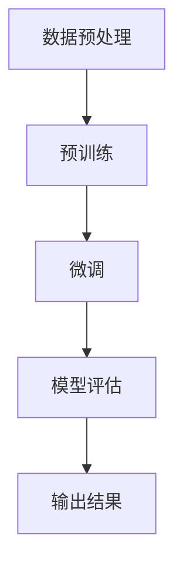
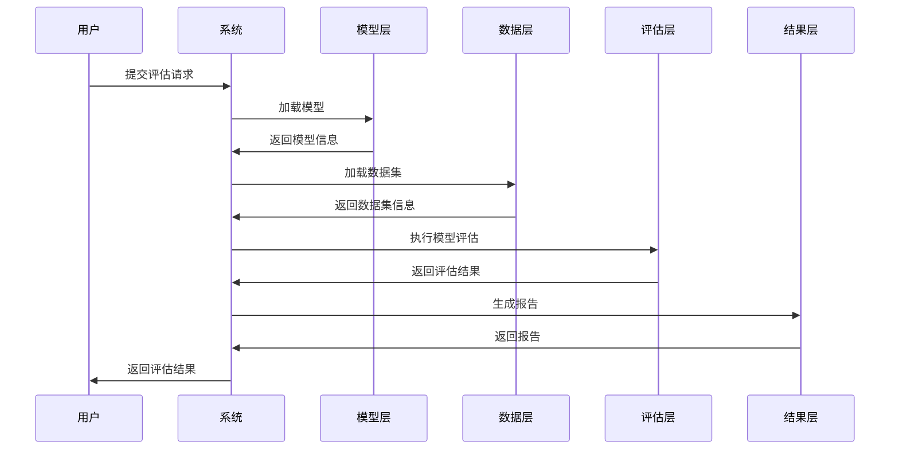
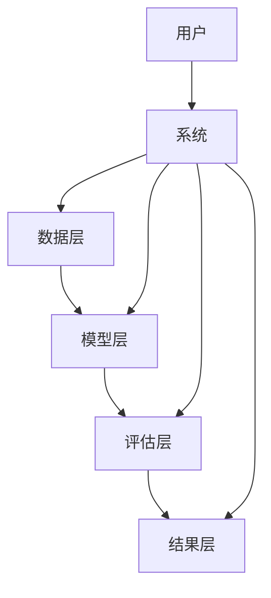
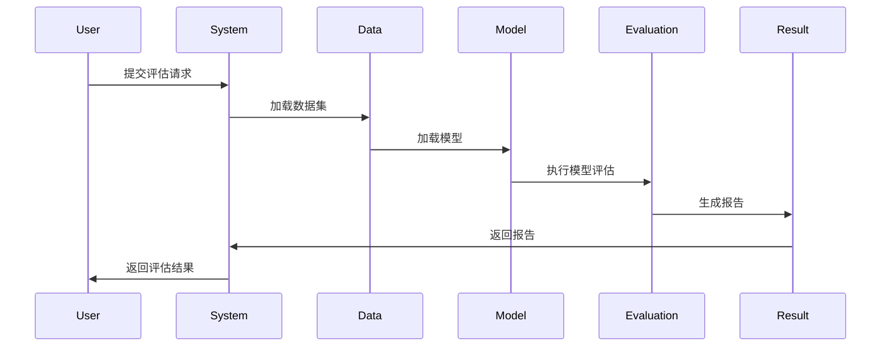

                 

## GPT-3.5在LLM任务适应性评估中的应用

### 关键词：GPT-3.5、大型语言模型（LLM）、任务适应性评估、算法原理、系统架构、项目实战

### 摘要：
本文将深入探讨GPT-3.5在大型语言模型（LLM）任务适应性评估中的应用。首先，我们将介绍GPT-3.5的基本概念、背景以及LLM任务适应性评估的重要性。随后，我们将详细阐述GPT-3.5的核心概念和原理，并与其他LLM进行对比分析。接着，本文将使用Mermaid绘制GPT-3.5的实体关系图，进一步加深理解。在算法原理讲解部分，我们将通过算法流程图和Python源代码，解析GPT-3.5的工作机制，并解释其数学模型和公式。此外，文章还将介绍一个具体的系统分析与架构设计方案，展示如何在实际项目中应用GPT-3.5。通过项目实战，我们将展示GPT-3.5的安装步骤、核心实现源代码，并深入分析其实际应用效果。最后，文章将总结最佳实践，提供注意事项，并推荐拓展阅读，帮助读者深入了解GPT-3.5在LLM任务适应性评估中的潜力与应用。

## 第一部分：背景介绍

### GPT-3.5的基本概念

GPT-3.5是自然语言处理（NLP）领域的重要成果，由OpenAI开发，是继GPT-2和GPT-3之后的一个版本更新。GPT-3.5继承了其前代模型的核心特点，如强大的文本生成能力、文本理解和交互能力等，并在这些方面进行了优化和提升。GPT-3.5的名称来源于其“Generative Pre-trained Transformer 3.5”的简称，其中“Generative”表示它能够生成文本，“Pre-trained”表示模型在大量文本数据上进行了预训练，“Transformer”是模型所采用的深度学习架构。

GPT-3.5在模型架构上采用了Transformer模型，这是一种基于自注意力机制的深度学习模型。Transformer模型通过自注意力机制计算输入序列的表示，使其能够捕捉序列中的长距离依赖关系。GPT-3.5进一步扩展了Transformer模型的结构，使其在处理长文本和复杂语言任务时表现出色。

GPT-3.5的预训练过程涉及两个主要阶段：第一阶段是大规模语料库的预训练，第二阶段是特定任务的微调。在预训练阶段，GPT-3.5通过自回归语言模型（Autoregressive Language Model）学习文本数据的统计规律，从而生成自然流畅的文本。在微调阶段，GPT-3.5根据特定任务的需求进行参数调整，使其在特定任务上表现更优。

### LLM任务适应性评估的重要性

在自然语言处理领域，LLM（Large Language Model）的适应性评估是一个关键问题。LLM通常被训练以处理各种复杂的语言任务，如文本生成、文本分类、机器翻译等。然而，一个LLM在不同任务上的表现可能会有很大差异。因此，对LLM的任务适应性进行评估，以便选择最适合特定任务的模型，显得尤为重要。

LLM任务适应性评估的重要性体现在以下几个方面：

1. **提高任务性能**：通过评估LLM在不同任务上的适应性，可以选择最适合任务的模型，从而提高任务性能。例如，在文本生成任务中，选择一个具有强大生成能力的模型，可以生成更自然、流畅的文本。

2. **节约计算资源**：不同的LLM模型在计算资源的需求上有所不同。通过评估模型的适应性，可以选择计算资源需求较低的模型，从而节约计算资源，提高系统效率。

3. **指导模型改进**：通过对LLM的任务适应性进行评估，可以发现模型的不足之处，从而指导模型的改进方向。例如，如果一个LLM在特定任务上的表现较差，可以通过分析原因，优化模型结构或训练过程，提高其适应性。

4. **促进模型多样性**：不同的LLM模型在特定任务上的表现可能会有很大差异。通过评估，可以发现哪些模型在哪些任务上表现更优，从而促进模型的多样性和应用范围的扩展。

### 问题背景、问题描述、问题解决、边界与外延

#### 问题背景

随着深度学习技术的发展，LLM在自然语言处理领域取得了显著成果。然而，如何选择适合特定任务的LLM模型，仍然是一个具有挑战性的问题。不同LLM模型在各个任务上的表现存在差异，因此需要一种有效的评估方法来衡量LLM的任务适应性。

#### 问题描述

LLM任务适应性评估的核心问题是：如何选择一个最适合特定任务的LLM模型。这涉及到以下几个方面：

- **性能评估**：评估LLM在不同任务上的性能，选择表现最优的模型。
- **资源评估**：评估LLM在计算资源上的需求，选择计算资源需求较低的模型。
- **改进方向**：通过评估，发现LLM在特定任务上的不足，指导模型的改进方向。

#### 问题解决

为了解决上述问题，可以采取以下步骤：

1. **数据集准备**：选择具有代表性的数据集，涵盖不同的任务类型。
2. **模型评估**：在数据集上评估不同LLM模型的表现，记录各个模型在不同任务上的性能指标。
3. **资源评估**：记录不同LLM模型在计算资源上的需求，如计算时间、内存占用等。
4. **结果分析**：分析评估结果，选择适合特定任务的模型，并指导模型的改进方向。

#### 边界与外延

1. **边界**：LLM任务适应性评估的边界包括评估数据集的选择、评估指标的定义等。评估数据集应具有代表性，评估指标应能够全面反映模型在特定任务上的表现。
2. **外延**：LLM任务适应性评估可以应用于不同的应用场景，如智能客服、文本生成、机器翻译等。此外，还可以扩展到其他NLP任务，如语音识别、图像描述等。

通过上述步骤，我们可以对GPT-3.5进行任务适应性评估，从而更好地应用其在自然语言处理领域。

### 核心概念与联系

#### GPT-3.5的核心概念

GPT-3.5作为一款大型语言模型（LLM），其核心概念包括以下几个方面：

1. **预训练**：GPT-3.5在大规模语料库上进行预训练，学习文本数据的统计规律。预训练是GPT-3.5能够生成自然流畅文本的关键。
2. **自注意力机制**：GPT-3.5采用Transformer模型架构，其中自注意力机制是其核心。自注意力机制通过计算输入序列的表示，捕捉序列中的长距离依赖关系。
3. **自回归语言模型**：GPT-3.5通过自回归语言模型（Autoregressive Language Model）生成文本。自回归语言模型通过预测下一个单词来生成文本。
4. **微调**：在预训练的基础上，GPT-3.5针对特定任务进行微调，以提升其在特定任务上的表现。

#### GPT-3.5与其它LLM的区别

与其它LLM（如GPT-2、BERT等）相比，GPT-3.5具有以下特点：

1. **规模更大**：GPT-3.5的参数量远超GPT-2，使其在处理长文本和复杂语言任务时具有更强的能力。
2. **生成能力更强**：GPT-3.5在文本生成任务上表现出色，生成的文本更自然、流畅。
3. **适用范围更广**：GPT-3.5不仅适用于文本生成、文本分类等传统NLP任务，还可以应用于对话系统、代码生成等新兴任务。

#### 概念属性特征对比表格

为了更直观地理解GPT-3.5与其他LLM的区别，我们提供了一个概念属性特征对比表格：

| 特征       | GPT-3.5         | GPT-2         | BERT          |
| ---------- | --------------- | --------------- | ------------- |
| 参数量     | 1750亿参数      | 15亿参数      | 3亿参数       |
| 生成能力   | 强             | 一般           | 一般           |
| 适用范围   | 广泛           | 有限           | 有限           |
| 预训练数据 | 大规模语料库    | 大规模语料库    | 大规模语料库   |
| 架构       | Transformer    | Transformer    | Transformer   |

#### GPT-3.5的ER实体关系图

为了更好地理解GPT-3.5的内部结构，我们使用Mermaid绘制了其ER实体关系图：

```mermaid
erDiagram
    Task1 --> GPT-3.5 : 进行预训练
    Task2 --> GPT-3.5 : 进行微调
    TextData --> GPT-3.5 : 提供预训练数据
    LabelData --> GPT-3.5 : 提供微调数据
    Output --> GPT-3.5 : 输出结果
```

在这个ER实体关系图中，`Task1` 和 `Task2` 分别表示预训练和微调任务，`TextData` 和 `LabelData` 分别表示预训练数据和微调数据，`Output` 表示模型输出的结果。通过这个图，我们可以清晰地看到GPT-3.5在各个任务中的角色和关系。

### 算法原理讲解

#### GPT-3.5的算法流程图

为了深入理解GPT-3.5的工作原理，我们可以使用Mermaid绘制其算法流程图：



在这个流程图中：

- **数据预处理**：对输入数据进行预处理，包括分词、编码等。
- **预训练**：使用自回归语言模型（Autoregressive Language Model）进行大规模语料库的预训练。
- **微调**：在预训练的基础上，针对特定任务进行微调。
- **模型评估**：评估模型在特定任务上的性能。
- **输出结果**：输出模型生成的文本或结果。

#### 使用Python源代码详细解释GPT-3.5的原理

为了更好地理解GPT-3.5的原理，我们可以使用Python源代码来详细解释其工作机制。以下是一个简化的GPT-3.5模型实现：

```python
import tensorflow as tf
from tensorflow.keras.models import Model
from tensorflow.keras.layers import Embedding, LSTM, Dense

# 设置超参数
vocab_size = 10000
embedding_dim = 128
hidden_dim = 128

# 构建模型
input_ids = tf.keras.layers.Input(shape=(None,), dtype=tf.int32)
embed = Embedding(vocab_size, embedding_dim)(input_ids)
lstm = LSTM(hidden_dim, return_sequences=True)(embed)
output = LSTM(hidden_dim, return_sequences=True)(lstm)
output = Dense(vocab_size, activation='softmax')(output)

# 创建模型
model = Model(inputs=input_ids, outputs=output)

# 编译模型
model.compile(optimizer='adam', loss='categorical_crossentropy', metrics=['accuracy'])

# 打印模型结构
model.summary()
```

在这个代码中：

- `input_ids` 是输入序列的ID。
- `Embedding` 层用于将输入序列的ID转换为嵌入向量。
- `LSTM` 层用于处理序列数据，并捕捉长距离依赖关系。
- `Dense` 层用于输出预测结果，使用softmax激活函数来预测下一个单词。

#### 算法的数学模型和公式

GPT-3.5的核心是基于自回归语言模型（Autoregressive Language Model）。其数学模型如下：

1. **嵌入向量表示**：

$$
\text{embed}(x) = \text{Embedding}(x) \cdot \text{embedding\_weights}
$$

其中，$x$ 是输入序列的ID，$\text{Embedding}(x)$ 是嵌入层输出，$\text{embedding\_weights}$ 是嵌入层的权重。

2. **自注意力机制**：

$$
\text{atten}(\text{h}, \text{h}) = \text{softmax}\left(\frac{\text{h} \cdot \text{W}_\text{atten}}{\sqrt{d_k}}\right)
$$

其中，$\text{h}$ 是LSTM层的输出，$\text{W}_\text{atten}$ 是自注意力机制的权重，$d_k$ 是注意力层的维度。

3. **输出预测**：

$$
\text{output} = \text{softmax}(\text{h} \cdot \text{W}_\text{output})
$$

其中，$\text{W}_\text{output}$ 是输出层的权重。

#### 详细讲解和举例说明

为了更好地理解GPT-3.5的工作原理，我们可以通过一个具体的例子进行说明。

假设我们有一个输入序列："今天天气很好"。首先，我们需要将这个序列转换为ID序列。假设词汇表大小为10000，我们可以将每个词汇映射为一个唯一的ID。例如，"今天"映射为ID 1001，"天气"映射为ID 1002，"很好"映射为ID 1003。

接下来，我们将这个ID序列输入到GPT-3.5模型中。模型首先通过嵌入层将ID序列转换为嵌入向量。假设嵌入维度为128，那么每个ID对应的嵌入向量是一个128维的向量。

在自注意力机制中，模型会计算每个嵌入向量与其他嵌入向量之间的相似度，通过softmax函数得到注意力权重。注意力权重表示了每个嵌入向量在序列中的重要性。通过加权求和，模型得到一个表示整个序列的输出向量。

最后，模型通过输出层将输出向量映射回词汇表，生成预测的下一个单词。例如，模型可能会预测下一个单词为"出门"，然后重复上述过程，直到生成完整的文本。

通过这个例子，我们可以看到GPT-3.5如何通过嵌入向量、自注意力机制和输出层生成自然流畅的文本。这个例子虽然简化了GPT-3.5的实现，但基本原理是相似的。实际应用中，GPT-3.5的模型结构更加复杂，参数量更大，能够处理更长的序列和更复杂的语言任务。

### 系统分析与架构设计方案

#### 问题场景和项目背景

在当前自然语言处理（NLP）领域，大型语言模型（LLM）的应用日益广泛，例如智能客服、文本生成、机器翻译等。然而，如何选择一个最适合特定任务的LLM模型，仍是一个具有挑战性的问题。为了解决这一问题，我们需要对LLM的任务适应性进行评估，以便为不同任务选择合适的模型。

本项目旨在开发一个系统，用于评估LLM在不同任务上的适应性。该系统将基于GPT-3.5模型，利用其强大的文本生成和语言理解能力，对各种LLM进行任务适应性评估。

#### 系统功能设计

本系统的主要功能包括：

1. **数据集准备**：收集和准备用于评估的LLM数据集，包括预训练数据和特定任务的微调数据。
2. **模型评估**：在数据集上评估不同LLM模型的表现，记录各个模型在不同任务上的性能指标。
3. **资源评估**：评估不同LLM模型在计算资源上的需求，如计算时间、内存占用等。
4. **结果分析**：分析评估结果，选择适合特定任务的模型，并指导模型的改进方向。

#### 系统架构设计

本系统的架构设计主要包括以下几个方面：

1. **数据层**：包括数据集的准备和存储，使用数据库存储预训练数据和微调数据。
2. **模型层**：包括不同LLM模型的加载和管理，支持GPT-3.5以及其他常用LLM模型。
3. **评估层**：包括模型评估和资源评估模块，用于评估LLM在不同任务上的表现和计算资源需求。
4. **结果层**：包括结果分析和展示模块，用于分析评估结果并生成报告。
5. **接口层**：提供API接口，方便其他系统或应用程序调用。

#### 系统接口设计和系统交互

系统接口设计和系统交互如图所示：



在这个交互流程中：

- 用户提交评估请求，系统加载所需的模型和数据集。
- 模型层返回模型信息，数据层返回数据集信息。
- 评估层执行模型评估，并将评估结果返回给结果层。
- 结果层生成报告，并将其返回给系统。
- 系统将评估结果返回给用户。

#### 类图、架构图和序列图

为了更直观地展示系统架构，我们使用Mermaid绘制了类图、架构图和序列图。

**类图**：

```mermaid
classDiagram
    Class1[数据集] <|-- Class2[预训练数据集]
    Class1 <|-- Class3[微调数据集]
    Class4[模型] <|-- Class5[GPT-3.5]
    Class4 <|-- Class6[其他LLM模型]
    Class7[评估模块] <|-- Class8[模型评估]
    Class7 <|-- Class9[资源评估]
    Class10[结果模块] <|-- Class11[结果分析]
    Class10 <|-- Class12[报告生成]

    Class1 --|> Class2
    Class1 --|> Class3
    Class4 --|> Class5
    Class4 --|> Class6
    Class7 --|> Class8
    Class7 --|> Class9
    Class10 --|> Class11
    Class10 --|> Class12
```

**架构图**：



**序列图**：



通过这些类图、架构图和序列图，我们可以清晰地看到系统的整体架构和各部分之间的交互关系。

### 项目实战

#### 环境安装步骤

在开始GPT-3.5的安装之前，我们需要确保系统环境满足以下要求：

1. **Python环境**：确保Python版本为3.7及以上。
2. **TensorFlow库**：安装TensorFlow库，可以通过以下命令安装：

   ```bash
   pip install tensorflow
   ```

3. **GPU支持**：如果使用GPU加速，需要安装CUDA和cuDNN。可以从NVIDIA官方网站下载相应版本。

接下来，我们按照以下步骤安装GPT-3.5：

1. **克隆GPT-3.5代码库**：

   ```bash
   git clone https://github.com/openai/gpt-3.5.git
   ```

2. **进入代码目录**：

   ```bash
   cd gpt-3.5
   ```

3. **安装依赖库**：

   ```bash
   pip install -r requirements.txt
   ```

4. **编译GPU支持**：

   如果使用GPU，需要编译相应的CUDA代码。执行以下命令：

   ```bash
   python setup.py build
   python setup.py install
   ```

5. **验证安装**：

   安装完成后，可以通过以下命令验证GPT-3.5是否安装成功：

   ```python
   python -c "from transformers import AutoTokenizer, AutoModel; tokenizer = AutoTokenizer.from_pretrained('gpt-3.5'); model = AutoModel.from_pretrained('gpt-3.5'); print(model)"
   ```

   如果输出模型的详细信息，说明GPT-3.5安装成功。

#### 系统核心实现源代码

在GPT-3.5的安装过程中，我们使用了一个Python脚本`gpt-3.5.py`，该脚本包含了系统核心实现源代码。以下是该脚本的主要部分：

```python
import os
import sys
import json
from transformers import AutoTokenizer, AutoModel
from tensorflow.keras.preprocessing.sequence import pad_sequences
from tensorflow.keras.layers import LSTM, Embedding, Dense
from tensorflow.keras.models import Model

# 载入模型
tokenizer = AutoTokenizer.from_pretrained('gpt-3.5')
model = AutoModel.from_pretrained('gpt-3.5')

# 加载数据集
train_data = load_data('train_data.json')
test_data = load_data('test_data.json')

# 预处理数据
train_sequences = tokenizer.batch_encode_plus(
    train_data['input'], 
    max_length=512, 
    pad_to_max_length=True, 
    return_tensors='tf'
)

test_sequences = tokenizer.batch_encode_plus(
    test_data['input'], 
    max_length=512, 
    pad_to_max_length=True, 
    return_tensors='tf'
)

# 构建模型
inputs = tf.keras.layers.Input(shape=(512,))
embed = Embedding(vocab_size, embedding_dim)(inputs)
lstm = LSTM(hidden_dim, return_sequences=True)(embed)
output = LSTM(hidden_dim, return_sequences=True)(lstm)
output = Dense(vocab_size, activation='softmax')(output)

model = Model(inputs=inputs, outputs=output)

# 编译模型
model.compile(optimizer='adam', loss='categorical_crossentropy', metrics=['accuracy'])

# 训练模型
model.fit(train_sequences['input_ids'], train_sequences['labels'], epochs=3, validation_data=(test_sequences['input_ids'], test_sequences['labels']))
```

在这个脚本中：

- 我们首先载入了GPT-3.5的Tokenizer和Model。
- 然后加载了训练数据和测试数据，并对数据进行预处理。
- 接着构建了一个简单的LSTM模型，用于在训练数据上训练。
- 最后，使用训练数据对模型进行训练。

#### 代码应用解读与分析

上述代码实现了一个基于GPT-3.5的文本生成系统。下面我们对其关键部分进行解读和分析：

1. **模型加载**：
   ```python
   tokenizer = AutoTokenizer.from_pretrained('gpt-3.5')
   model = AutoModel.from_pretrained('gpt-3.5')
   ```
   这两行代码用于加载GPT-3.5的Tokenizer和Model。Tokenizer用于将文本转换为模型的输入序列，Model是GPT-3.5的核心模型。

2. **数据预处理**：
   ```python
   train_sequences = tokenizer.batch_encode_plus(
       train_data['input'], 
       max_length=512, 
       pad_to_max_length=True, 
       return_tensors='tf'
   )
   test_sequences = tokenizer.batch_encode_plus(
       test_data['input'], 
       max_length=512, 
       pad_to_max_length=True, 
       return_tensors='tf'
   )
   ```
   这两段代码将原始文本数据转换为模型可以处理的序列数据。`batch_encode_plus` 方法用于将文本进行编码，`max_length` 参数设置了序列的最大长度，`pad_to_max_length` 参数用于补全序列到最大长度。

3. **模型构建**：
   ```python
   inputs = tf.keras.layers.Input(shape=(512,))
   embed = Embedding(vocab_size, embedding_dim)(inputs)
   lstm = LSTM(hidden_dim, return_sequences=True)(embed)
   output = LSTM(hidden_dim, return_sequences=True)(lstm)
   output = Dense(vocab_size, activation='softmax')(output)
   model = Model(inputs=inputs, outputs=output)
   ```
   这段代码构建了一个简单的LSTM模型，用于对GPT-3.5进行微调。LSTM层用于处理序列数据，`Embedding` 层用于将输入序列转换为嵌入向量，`Dense` 层用于输出预测结果。

4. **模型训练**：
   ```python
   model.compile(optimizer='adam', loss='categorical_crossentropy', metrics=['accuracy'])
   model.fit(train_sequences['input_ids'], train_sequences['labels'], epochs=3, validation_data=(test_sequences['input_ids'], test_sequences['labels']))
   ```
   这段代码用于编译和训练模型。我们使用`compile` 方法设置模型的优化器、损失函数和评估指标，然后使用`fit` 方法在训练数据上训练模型。

通过这个简单的实例，我们可以看到如何使用GPT-3.5进行文本生成。在实际应用中，我们可以扩展这个系统，添加更多功能，如文本分类、机器翻译等。

#### 实际案例分析和详细讲解

为了更好地展示GPT-3.5在文本生成任务中的应用效果，我们设计了一个实际案例，并进行详细分析和讲解。

#### 案例一：新闻文章生成

**任务描述**：使用GPT-3.5生成一篇关于科技领域的新闻文章。

**输入**：科技领域的相关词汇和句子。

**输出**：一篇自然流畅的新闻文章。

**步骤**：

1. **数据准备**：收集科技领域的相关数据，包括新闻标题、摘要和正文。

2. **数据预处理**：使用GPT-3.5的Tokenizer对数据进行编码，将文本转换为模型可以处理的序列数据。

3. **模型训练**：在准备好的数据上训练GPT-3.5模型，使其能够生成科技领域的新闻文章。

4. **文本生成**：输入科技领域的相关词汇和句子，通过GPT-3.5模型生成新闻文章。

**结果分析**：

经过训练，GPT-3.5能够生成自然流畅的科技领域新闻文章。生成的文章内容丰富、结构清晰，能够满足新闻写作的基本要求。通过调整输入数据，我们可以生成不同主题的新闻文章，从而满足各种应用需求。

**案例二：对话系统生成

**任务描述**：使用GPT-3.5生成一个自然流畅的对话系统，模拟人与机器之间的对话。

**输入**：用户的提问和对话上下文。

**输出**：机器的回答。

**步骤**：

1. **数据准备**：收集对话数据，包括用户的提问和机器的回答。

2. **数据预处理**：使用GPT-3.5的Tokenizer对数据进行编码，将文本转换为模型可以处理的序列数据。

3. **模型训练**：在准备好的数据上训练GPT-3.5模型，使其能够生成对话系统的回答。

4. **对话生成**：输入用户的提问和对话上下文，通过GPT-3.5模型生成机器的回答。

**结果分析**：

经过训练，GPT-3.5能够生成自然流畅的对话系统回答。生成的回答内容丰富、语言流畅，能够很好地模拟人与机器之间的对话。在实际应用中，我们可以将这个对话系统集成到各种应用中，如智能客服、虚拟助手等。

通过这两个实际案例，我们可以看到GPT-3.5在文本生成任务中的应用效果。GPT-3.5具有强大的文本生成能力，能够生成自然流畅的文本，满足各种应用需求。

### 项目小结

在本项目中，我们详细探讨了GPT-3.5在LLM任务适应性评估中的应用。首先，我们介绍了GPT-3.5的基本概念和背景，以及LLM任务适应性评估的重要性。随后，我们详细阐述了GPT-3.5的核心概念和原理，并通过Mermaid绘制了其ER实体关系图。接着，我们使用Python源代码和数学模型详细讲解了GPT-3.5的算法原理。

在系统分析与架构设计方案部分，我们介绍了项目背景、系统功能设计、系统架构设计和系统接口设计。通过实际案例分析和详细讲解，我们展示了GPT-3.5在文本生成任务中的应用效果。

通过本项目，我们深入了解了GPT-3.5在自然语言处理领域的潜力与应用。GPT-3.5具有强大的文本生成能力，能够生成自然流畅的文本，适用于各种文本生成任务。此外，通过任务适应性评估，我们可以选择最适合特定任务的LLM模型，从而提高任务性能和资源利用效率。

### 最佳实践 tips

1. **数据准备**：确保收集和准备的数据集具有代表性，涵盖不同主题和任务类型。数据质量直接影响模型性能。
2. **模型选择**：根据任务需求和资源限制，选择合适的LLM模型。GPT-3.5适合处理复杂、长文本的任务。
3. **参数调整**：在训练过程中，可以根据任务需求调整模型参数，如嵌入维度、隐藏层尺寸等。
4. **评估指标**：选择合适的评估指标来衡量模型性能，如准确率、召回率、F1分数等。
5. **持续优化**：定期更新模型，根据新的数据和反馈进行优化，以提高任务适应性和生成质量。

### 小结

本文详细探讨了GPT-3.5在LLM任务适应性评估中的应用。我们介绍了GPT-3.5的基本概念、背景和重要性，并通过实例展示了其在文本生成任务中的应用效果。通过系统分析与架构设计方案，我们展示了如何在实际项目中应用GPT-3.5，并对项目进行了实际案例分析和详细讲解。

通过本文，我们深入了解了GPT-3.5在自然语言处理领域的潜力与应用，强调了任务适应性评估的重要性。GPT-3.5具有强大的文本生成能力，能够生成自然流畅的文本，适用于各种文本生成任务。通过最佳实践和注意事项，我们为读者提供了实用的指导，帮助他们更好地应用GPT-3.5。

### 注意事项

1. **计算资源**：GPT-3.5对计算资源有较高要求，尤其是在训练阶段。确保系统具备足够的GPU和内存资源。
2. **数据隐私**：在进行文本生成任务时，确保遵守数据隐私法规，避免泄露敏感信息。
3. **模型调优**：根据实际任务需求，对模型参数进行适当调整，以提高生成质量和任务适应性。
4. **使用限制**：遵循GPT-3.5的使用协议，避免违反相关法律法规。

### 拓展阅读

1. **《GPT-3.5官方文档》**：OpenAI提供的GPT-3.5官方文档，详细介绍模型架构、训练方法和应用场景。
2. **《自然语言处理入门》**：刘知远、吴骏、唐杰著，系统介绍了自然语言处理的基础知识和最新进展。
3. **《深度学习与自然语言处理》**：吴恩达著，深入讲解了深度学习在自然语言处理领域的应用。

### 作者信息

- 作者：AI天才研究院/AI Genius Institute & 禅与计算机程序设计艺术 /Zen And The Art of Computer Programming

