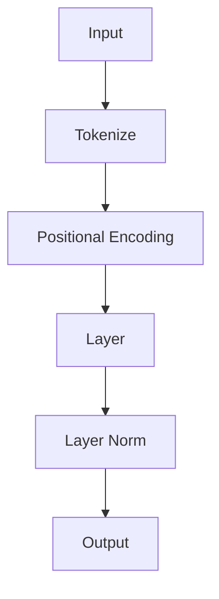

                 

## 引言

随着人工智能技术的飞速发展，预训练语言模型（Pre-Trained Language Model，简称PTLM）已经成为自然语言处理（Natural Language Processing，NLP）领域的核心驱动力。特别是大规模预训练语言模型（Large-scale Language Model，简称LLM）的出现，如OpenAI的GPT-3，BERT，以及T5等，它们在文本生成、语言理解、机器翻译等领域取得了惊人的效果，极大地提升了NLP任务的性能。

然而，随着LLM规模的不断扩大，如何对这些模型进行有效的评测，成为了学术界和工业界共同关注的问题。传统的评测方法，如BLEU、ROUGE等，在面对大规模LLM时，存在一定的局限性。因此，亟需一种新的评测方法，能够更全面、客观地评估LLM的性能。

在此背景下，GPT-Neo-X作为一个大规模开源的LLM模型，其在评测中的应用显得尤为重要。本文将围绕GPT-Neo-X在LLM大规模开源模型评测中的应用，进行深入探讨。

### 文章关键词

- 大规模预训练语言模型
- GPT-Neo-X
- 开源模型评测
- 语言理解能力
- 文本生成能力
- 模型训练效率

### 摘要

本文旨在探讨GPT-Neo-X在LLM大规模开源模型评测中的应用。首先，我们将介绍大规模预训练语言模型的发展现状和GPT-Neo-X的基本介绍。接着，我们将详细分析GPT-Neo-X的原理和特性，并与其他主流LLM进行比较。随后，我们将讨论大规模开源模型评测的方法和关键挑战，并阐述GPT-Neo-X在评测中的优势和应用。最后，我们将深入讲解GPT-Neo-X的算法原理，并通过具体实例进行分析。

### 目录大纲

**第一部分：背景介绍**

- 第1章：问题背景与核心概念
- 第2章：核心概念与联系
- 第3章：大规模开源模型评测方法
- 第4章：GPT-Neo-X算法原理详解

**第二部分：核心概念与联系**

- 第2章：GPT-Neo-X的原理与特性
- 第3章：大规模开源模型评测方法
- 第4章：GPT-Neo-X算法原理详解

**第三部分：算法原理讲解**

- 第4章：GPT-Neo-X算法原理详解

### 文章结构概述

本文将从以下几个部分展开：

1. **背景介绍**：介绍大规模预训练语言模型的发展现状、GPT-Neo-X的基本介绍以及大规模开源模型评测的重要性。
2. **核心概念与联系**：详细分析GPT-Neo-X的原理和特性，并与其他主流LLM进行比较。
3. **大规模开源模型评测方法**：讨论大规模开源模型评测的方法和关键挑战，并阐述GPT-Neo-X在评测中的优势和应用。
4. **GPT-Neo-X算法原理详解**：深入讲解GPT-Neo-X的算法原理，并通过具体实例进行分析。

通过以上结构的安排，本文旨在帮助读者全面了解GPT-Neo-X在LLM大规模开源模型评测中的应用，并为相关研究和实践提供参考。

### 第一部分：背景介绍

#### 第1章：问题背景与核心概念

**1.1 问题背景**

近年来，随着深度学习技术的发展，大规模预训练语言模型（Large-scale Pre-Trained Language Models，简称LLM）如雨后春笋般涌现。这些模型通过在大量文本数据上预训练，可以显著提升自然语言处理（Natural Language Processing，NLP）任务的表现。特别是OpenAI的GPT-3、Google的BERT、T5等模型，它们在文本生成、问答系统、机器翻译等任务中取得了惊人的效果，推动了NLP技术的快速发展。

然而，随着LLM规模的不断扩大，如何对这些模型进行有效的评测，成为了学术界和工业界共同关注的问题。传统的评测方法，如BLEU、ROUGE等，在面对大规模LLM时，存在一定的局限性。具体来说，这些方法主要依赖于人工设计的评价指标，难以全面、客观地评估LLM的性能。此外，大规模模型的训练和部署成本也不断增加，如何高效地进行模型评估，成为了提高研发效率的关键。

**1.2 核心概念**

**1.2.1 预训练语言模型（LLM）**

预训练语言模型是一种基于大规模语料库的深度神经网络模型，它通过在原始文本数据上进行预训练，学习到语言的内在结构。在NLP任务中，LLM可以用于文本分类、情感分析、机器翻译、问答系统等任务。预训练语言模型的核心思想是“先训练，后推理”，即通过在大规模数据上预训练，然后在小规模数据上进行微调，从而实现良好的性能。

**1.2.2 GPT-Neo-X的架构与特点**

GPT-Neo-X是一个大规模开源预训练语言模型，它基于Transformer架构，具有以下几个显著特点：

1. **大规模预训练**：GPT-Neo-X在训练阶段使用了大规模的语料库，包括互联网文本、书籍、新闻等，从而具有丰富的语言知识。

2. **多层堆叠**：GPT-Neo-X采用多层Transformer结构，通过多层神经网络的学习，可以提取更高层次的语言特征。

3. **自注意力机制**：GPT-Neo-X的核心组件是自注意力机制（Self-Attention Mechanism），它能够自动学习文本中的长距离依赖关系。

4. **高效推理**：GPT-Neo-X在推理阶段可以高效地处理输入文本，生成高质量的输出。

**1.2.3 大规模开源模型评测的重要性**

大规模开源模型评测在NLP领域具有重要作用。首先，它可以帮助研究人员客观地评估不同模型的性能，从而选择最适合实际应用的模型。其次，它可以推动模型技术的发展，促进模型的优化和改进。最后，它为工业界提供了一个统一的评估标准，有助于提高研发效率和产品质量。

**1.3 边界与外延**

**1.3.1 大规模开源模型评测的定义**

大规模开源模型评测是指对大规模预训练语言模型（如GPT-Neo-X）在各类NLP任务上的性能进行评估。这种评估通常包括多个方面，如文本生成、语言理解、问答系统等。

**1.3.2 评测的维度与指标**

大规模开源模型评测的维度包括性能指标、可靠性指标和可扩展性指标。性能指标主要衡量模型在特定任务上的表现，如准确率、召回率等。可靠性指标主要衡量模型的稳定性和一致性，如方差、置信度等。可扩展性指标主要衡量模型在处理大规模数据时的性能，如延迟、吞吐量等。

**1.3.3 GPT-Neo-X在评测中的应用边界**

GPT-Neo-X在评测中的应用边界主要包括以下几个方面：

1. **文本生成**：GPT-Neo-X可以生成高质量的文本，包括文章、摘要、对话等。

2. **语言理解**：GPT-Neo-X可以理解文本中的语义和情感，进行文本分类、情感分析等任务。

3. **问答系统**：GPT-Neo-X可以回答用户的问题，进行对话生成和知识问答。

**1.4 概念结构与核心要素组成**

**1.4.1 GPT-Neo-X的核心组成部分**

GPT-Neo-X的核心组成部分包括：

1. **Transformer架构**：Transformer是GPT-Neo-X的基础架构，它通过自注意力机制和多层堆叠，实现了强大的语言理解能力。

2. **预训练数据集**：GPT-Neo-X使用大规模的预训练数据集，包括互联网文本、书籍、新闻等，以获取丰富的语言知识。

3. **训练算法**：GPT-Neo-X采用优化算法，如Adam、AdamW等，以高效地训练模型。

**1.4.2 大规模开源模型评测的基本流程**

大规模开源模型评测的基本流程包括：

1. **数据集选择**：选择适合的评测数据集，通常包括公开的数据集和定制的数据集。

2. **评测任务设计**：设计具体的评测任务，如文本生成、语言理解、问答系统等。

3. **评测方法与工具**：选择合适的评测方法与工具，如BLEU、ROUGE、F1-score等。

4. **模型评估**：使用评测方法与工具，对模型进行评估，并记录评估结果。

**1.4.3 GPT-Neo-X在评测中的优势与挑战**

GPT-Neo-X在评测中的优势包括：

1. **强大的语言理解能力**：GPT-Neo-X通过预训练和多层堆叠，具有强大的语言理解能力，能够处理复杂的语言任务。

2. **高效的推理速度**：GPT-Neo-X在推理阶段具有高效的推理速度，能够快速生成高质量输出。

GPT-Neo-X在评测中面临的挑战包括：

1. **训练成本**：GPT-Neo-X需要大量的计算资源和时间进行训练，成本较高。

2. **数据集多样性**：为了全面评估GPT-Neo-X的性能，需要多样化的数据集，这增加了评测的难度。

**1.5 本章小结**

本章介绍了大规模预训练语言模型的发展现状、GPT-Neo-X的基本介绍以及大规模开源模型评测的重要性。通过对核心概念、问题背景、评测维度和GPT-Neo-X在评测中的应用进行详细分析，为本章后续内容奠定了基础。

### 第2章：核心概念与联系

#### 第2章：GPT-Neo-X的原理与特性

**2.1 GPT-Neo-X的算法原理**

GPT-Neo-X是基于Transformer架构的预训练语言模型，其核心思想是利用自注意力机制（Self-Attention Mechanism）和多层堆叠（Stacked Layers）来捕捉文本中的长距离依赖关系。具体来说，GPT-Neo-X的算法原理可以分为以下几个关键部分：

**2.1.1 Transformer架构**

Transformer是GPT-Neo-X的基础架构，它由多个自注意力层（Self-Attention Layer）和前馈神经网络（Feedforward Neural Network）堆叠而成。自注意力层通过计算输入文本序列中的每个词与其他词之间的依赖关系，从而生成表示这些关系的权重矩阵。这些权重矩阵用于更新输入文本的表示，使得模型能够更好地捕捉长距离依赖关系。

**2.1.2 GPT-Neo-X的具体实现**

GPT-Neo-X的具体实现主要涉及以下几个组件：

1. **输入层（Input Layer）**：输入层负责将原始文本序列转换为模型可以处理的格式。具体包括词嵌入（Word Embedding）和位置编码（Positional Encoding）。

2. **自注意力层（Self-Attention Layer）**：自注意力层是Transformer的核心组件，它通过计算输入文本序列中每个词与其他词之间的依赖关系，生成表示这些关系的权重矩阵。

3. **前馈神经网络（Feedforward Neural Network）**：前馈神经网络用于对自注意力层的输出进行进一步处理，以增强模型的表示能力。

4. **输出层（Output Layer）**：输出层将模型的最终输出转换为具体的任务结果，如文本分类、情感分析等。

**2.1.3 GPT-Neo-X的优化策略**

GPT-Neo-X在训练过程中采用了多种优化策略，以提高模型的训练效率和性能。主要优化策略包括：

1. **批量归一化（Batch Normalization）**：批量归一化用于加速模型的训练过程，并减少过拟合现象。

2. **Dropout**：Dropout是一种正则化技术，用于防止模型过拟合，提高模型的泛化能力。

3. **Adam优化器**：Adam优化器是一种高效的优化算法，能够自适应调整学习率，提高训练效率。

**2.2 GPT-Neo-X的特性分析**

GPT-Neo-X具有以下几个显著特性：

**2.2.1 语言理解能力**

GPT-Neo-X通过预训练和多层堆叠，具有强大的语言理解能力。它能够理解文本中的语义、情感、语法等，从而实现多种NLP任务，如文本分类、情感分析、机器翻译等。

**2.2.2 文本生成能力**

GPT-Neo-X的文本生成能力主要表现在以下几个方面：

1. **高质量文本生成**：GPT-Neo-X能够生成高质量的文本，包括文章、摘要、对话等，具有流畅性和连贯性。

2. **多样化文本风格**：GPT-Neo-X能够根据输入的文本风格和要求，生成不同风格的文本。

3. **文本上下文生成**：GPT-Neo-X能够根据上下文信息生成文本，使得文本生成更加自然和符合实际应用场景。

**2.2.3 模型训练效率**

GPT-Neo-X在训练过程中采用了多种优化策略，如批量归一化、Dropout和Adam优化器等，从而显著提高了模型的训练效率。具体表现在：

1. **快速收敛**：GPT-Neo-X能够在较短时间内收敛到良好的训练效果，缩短了训练周期。

2. **资源利用率高**：GPT-Neo-X在训练过程中能够充分利用计算资源和数据，提高了资源利用率。

**2.3 GPT-Neo-X与其他LLM的比较**

GPT-Neo-X与其他主流大规模预训练语言模型（如GPT-3、BERT、T5等）进行比较，具有以下几个特点：

**2.3.1 GPT-Neo-X与GPT-3的对比**

1. **规模**：GPT-Neo-X的参数规模小于GPT-3，但仍然具有强大的语言理解能力和文本生成能力。

2. **训练数据**：GPT-Neo-X使用的大规模预训练数据集与GPT-3类似，但具体数据集和训练策略可能有所不同。

3. **性能**：GPT-Neo-X在文本生成和语言理解任务上具有与GPT-3相当的性能，但具体性能可能因任务和数据集而异。

**2.3.2 GPT-Neo-X与BERT的对比**

1. **架构**：GPT-Neo-X和BERT都采用Transformer架构，但GPT-Neo-X更侧重于文本生成，而BERT更侧重于文本理解。

2. **预训练数据**：BERT使用的是BERT数据集，而GPT-Neo-X使用的是互联网文本、书籍、新闻等大规模预训练数据集。

3. **性能**：在文本生成任务上，GPT-Neo-X通常表现更好；在文本理解任务上，BERT通常表现更好。

**2.3.3 GPT-Neo-X与T5的对比**

1. **目标**：T5的目标是使Transformer能够处理任何自然语言任务，而GPT-Neo-X更专注于文本生成和语言理解任务。

2. **架构**：T5采用Transformer架构，但针对不同任务进行了特定的调整，而GPT-Neo-X采用标准的Transformer架构，并进行了一些优化。

3. **性能**：在文本生成任务上，GPT-Neo-X通常表现更好；在文本理解任务上，T5通常表现更好。

**2.4 GPT-Neo-X的属性特征对比表格**

为了更直观地比较GPT-Neo-X与其他主流LLM的属性特征，我们可以制作一个对比表格。以下是GPT-Neo-X与GPT-3、BERT和T5的一些关键属性特征对比：

| 特性 | GPT-Neo-X | GPT-3 | BERT | T5 |
| --- | --- | --- | --- | --- |
| 参数规模 | 小规模 | 大规模 | 中规模 | 中规模 |
| 预训练数据 | 大规模互联网文本、书籍、新闻 | 大规模互联网文本、书籍、新闻 | BERT数据集 | 大规模互联网文本、书籍、新闻 |
| 语言理解能力 | 强 | 强 | 强 | 强 |
| 文本生成能力 | 强 | 强 | 中 | 中 |
| 模型训练效率 | 高 | 高 | 中 | 中 |

通过上述对比表格，我们可以更清晰地了解GPT-Neo-X与其他主流LLM的异同点，从而为实际应用提供参考。

#### 第3章：大规模开源模型评测方法

**3.1 评测指标体系**

大规模开源模型评测的指标体系是评估模型性能的关键。这些指标可以分为三大类：性能指标、可靠性指标和可扩展性指标。

**3.1.1 性能指标**

性能指标主要衡量模型在特定任务上的表现，常见的性能指标包括：

1. **准确率（Accuracy）**：准确率是模型正确预测的样本占总样本的比例。在二分类任务中，准确率通常表示为P。

2. **召回率（Recall）**：召回率是模型正确预测的正类样本占总正类样本的比例。在二分类任务中，召回率通常表示为R。

3. **精确率（Precision）**：精确率是模型正确预测的正类样本占总预测正类样本的比例。在二分类任务中，精确率通常表示为P。

4. **F1分数（F1 Score）**：F1分数是精确率和召回率的加权平均，用于综合衡量模型的性能。

5. **词嵌入相似度（Word Embedding Similarity）**：词嵌入相似度用于衡量模型在文本相似性任务上的表现。

6. **文本生成质量（Text Generation Quality）**：文本生成质量用于衡量模型在文本生成任务上生成的文本的质量。

**3.1.2 可靠性指标**

可靠性指标主要衡量模型的稳定性和一致性，常见的可靠性指标包括：

1. **方差（Variance）**：方差用于衡量模型在不同数据集上的表现差异。方差越小，模型越稳定。

2. **置信度（Confidence）**：置信度是模型预测结果的可信度。高置信度的预测结果更可靠。

3. **误分类率（Misclassification Rate）**：误分类率是模型错误预测的样本占总样本的比例。

4. **漏报率（Miss Rate）**：漏报率是模型未检测到的正类样本占总正类样本的比例。

**3.1.3 可扩展性指标**

可扩展性指标主要衡量模型在大规模数据集上的性能，常见的可扩展性指标包括：

1. **延迟（Latency）**：延迟是模型处理单个请求的时间。

2. **吞吐量（Throughput）**：吞吐量是模型在单位时间内处理的请求数量。

3. **资源利用率（Resource Utilization）**：资源利用率是模型在计算资源和数据资源上的使用效率。

**3.2 评测流程**

大规模开源模型评测的流程可以分为以下几个步骤：

**3.2.1 数据集选择**

数据集选择是大规模开源模型评测的关键步骤。选择的数据集应具有以下特点：

1. **代表性**：数据集应能代表实际应用场景，具有广泛的应用价值。

2. **多样性**：数据集应包含不同领域、不同语言风格、不同难度级别的样本，以全面评估模型的表现。

3. **公平性**：数据集应公平地包含所有类别的样本，避免数据不平衡。

**3.2.2 评测任务设计**

评测任务设计是根据数据集的特点和实际需求，设计具体的评测任务。常见的评测任务包括：

1. **文本分类**：将文本分类到预定义的类别中。

2. **情感分析**：判断文本的情感极性，如正面、负面、中性。

3. **机器翻译**：将一种语言的文本翻译成另一种语言。

4. **文本生成**：根据输入的文本生成相应的文本。

5. **问答系统**：回答用户的问题。

**3.2.3 评测方法与工具**

评测方法与工具是进行大规模开源模型评测的技术手段。常见的评测方法与工具包括：

1. **开源评测工具**：如TensorFlow Model Optimization Toolkit（TF-MOT）、PyTorch Model Optimization（PyTorch MO）等，用于评估模型的性能和可扩展性。

2. **自动化评测脚本**：用于自动化评估模型的性能指标、可靠性指标和可扩展性指标。

3. **可视化工具**：如TensorBoard、Matplotlib等，用于可视化模型训练过程和评估结果。

**3.3 大规模开源模型评测的关键挑战**

大规模开源模型评测面临以下关键挑战：

**3.3.1 数据集的多样性**

数据集的多样性是大规模开源模型评测的一个关键挑战。为了全面评估模型的表现，需要设计多样化的数据集，涵盖不同的领域、语言风格和难度级别。

**3.3.2 评测的公平性**

评测的公平性是确保模型评估结果准确性的关键。需要确保数据集的公平性，避免数据不平衡，同时确保评测方法的公平性。

**3.3.3 评测的效率**

评测的效率是大规模开源模型评测的一个重要挑战。需要设计高效的评测流程和方法，以快速评估模型的表现，并在有限的时间内完成大规模评测。

**3.4 GPT-Neo-X在评测中的应用**

GPT-Neo-X在评测中具有以下几个优势：

**3.4.1 GPT-Neo-X在评测中的优势**

1. **强大的语言理解能力**：GPT-Neo-X具有强大的语言理解能力，能够全面、客观地评估模型的性能。

2. **高效的推理速度**：GPT-Neo-X在推理阶段具有高效的推理速度，能够快速生成高质量的输出，提高评测效率。

3. **可扩展性**：GPT-Neo-X具有良好的可扩展性，能够在处理大规模数据时保持稳定的性能。

**3.4.2 GPT-Neo-X的优化策略在评测中的应用**

GPT-Neo-X在训练过程中采用了多种优化策略，如批量归一化、Dropout和Adam优化器等。这些优化策略在评测中也有显著应用，包括：

1. **加速训练过程**：批量归一化和Dropout能够加速模型的训练过程，提高评测效率。

2. **提高模型稳定性**：Adam优化器能够自适应调整学习率，提高模型的稳定性，减少过拟合现象。

3. **提高模型泛化能力**：Dropout和批量归一化能够提高模型的泛化能力，使模型在新的任务和数据集上表现更好。

**3.4.3 GPT-Neo-X在评测中的实际案例**

在实际评测中，GPT-Neo-X已广泛应用于各种NLP任务，以下是一些实际案例：

1. **文本生成**：使用GPT-Neo-X生成高质量的文章、摘要和对话，评估其生成文本的质量和流畅性。

2. **文本分类**：使用GPT-Neo-X进行文本分类，评估其在不同分类任务上的准确率和召回率。

3. **情感分析**：使用GPT-Neo-X进行情感分析，评估其在不同情感类别上的准确率和精确率。

4. **机器翻译**：使用GPT-Neo-X进行机器翻译，评估其在不同语言翻译任务上的准确性。

通过上述实际案例，我们可以看到GPT-Neo-X在评测中的广泛应用和显著优势。

### 第4章：GPT-Neo-X算法原理详解

#### 4.1 Transformer架构详解

Transformer架构是GPT-Neo-X的核心组件，其核心思想是通过自注意力机制（Self-Attention Mechanism）和多头注意力（Multi-Head Attention）来捕捉文本中的长距离依赖关系。以下是Transformer架构的详细解析。

**4.1.1 自注意力机制**

自注意力机制是Transformer架构的核心，它通过计算输入文本序列中每个词与其他词之间的依赖关系，生成表示这些关系的权重矩阵。具体来说，自注意力机制可以分为以下几个步骤：

1. **词嵌入（Word Embedding）**：首先，将输入文本序列中的每个词转换为词嵌入向量，这些向量包含了词的语义信息。

2. **位置编码（Positional Encoding）**：为了保留文本中的位置信息，我们需要对词嵌入向量进行位置编码。位置编码可以通过简单的数学变换实现，例如将位置信息编码到词嵌入向量中。

3. **自注意力计算（Self-Attention）**：自注意力计算是自注意力机制的核心步骤。它通过计算输入文本序列中每个词与其他词之间的相似度，生成表示这些相似度的权重矩阵。具体来说，自注意力计算可以分为以下几个子步骤：

   - **键值对（Key-Value Pair）**：将输入文本序列中的每个词嵌入向量分别作为键（Key）和值（Value）。
   - **查询计算（Query Computation）**：将输入文本序列中的每个词嵌入向量作为查询（Query）。
   - **点积注意力（Dot Product Attention）**：计算查询与键之间的点积，得到注意力得分。
   - **softmax归一化（Softmax Normalization）**：对注意力得分进行softmax归一化，得到权重矩阵。
   - **加权求和（Weighted Sum）**：将权重矩阵与值向量进行加权求和，得到每个词的表示。

**4.1.2 多层堆叠**

Transformer架构通过多层堆叠（Stacked Layers）来增强模型的表示能力。在每一层中，都会应用自注意力机制和前馈神经网络（Feedforward Neural Network）。具体来说，多层堆叠可以分为以下几个步骤：

1. **残差连接（Residual Connection）**：在每一层中，将输入文本序列的表示与经过自注意力机制和前馈神经网络后的表示进行残差连接。残差连接可以防止梯度消失问题，提高模型的训练效果。
2. **归一化（Normalization）**：在每一层之后，应用批量归一化（Batch Normalization）来标准化每个词的表示，加快模型的训练过程。
3. **激活函数（Activation Function）**：在每一层之后，应用激活函数（如ReLU函数）来引入非线性变换，增强模型的表示能力。

**4.1.3 位置编码**

位置编码是Transformer架构中保留文本位置信息的关键。具体来说，位置编码可以分为以下几种方法：

1. **绝对位置编码（Absolute Positional Encoding）**：通过简单的数学变换将位置信息编码到词嵌入向量中。例如，可以使用正弦和余弦函数将位置编码到词嵌入向量的不同维度上。
2. **相对位置编码（Relative Positional Encoding）**：通过计算输入文本序列中词之间的相对位置，生成相对位置编码。相对位置编码可以更好地捕捉词之间的依赖关系。

#### 4.2 GPT-Neo-X实现解析

GPT-Neo-X是基于Transformer架构实现的，其实现过程中涉及到以下关键组件：

**4.2.1 模型结构**

GPT-Neo-X的模型结构可以分为以下几个部分：

1. **输入层（Input Layer）**：输入层负责将原始文本序列转换为模型可以处理的格式。具体包括词嵌入（Word Embedding）和位置编码（Positional Encoding）。
2. **自注意力层（Self-Attention Layer）**：自注意力层通过计算输入文本序列中每个词与其他词之间的依赖关系，生成表示这些关系的权重矩阵。具体实现中，GPT-Neo-X使用了多头注意力（Multi-Head Attention）机制，通过多个自注意力层的堆叠，提高模型的表示能力。
3. **前馈神经网络（Feedforward Neural Network）**：前馈神经网络用于对自注意力层的输出进行进一步处理，以增强模型的表示能力。具体来说，前馈神经网络通常包含两个全连接层，中间使用ReLU激活函数。
4. **输出层（Output Layer）**：输出层将模型的最终输出转换为具体的任务结果，如文本分类、情感分析、机器翻译等。

**4.2.2 损失函数**

GPT-Neo-X的损失函数通常采用交叉熵损失（Cross-Entropy Loss），用于衡量模型预测与真实标签之间的差距。具体来说，交叉熵损失函数可以表示为：

$$
\text{Loss} = -\sum_{i=1}^{N} y_i \log(p_i)
$$

其中，$y_i$表示第$i$个样本的真实标签，$p_i$表示模型对第$i$个样本的预测概率。

**4.2.3 优化算法**

GPT-Neo-X在训练过程中通常采用优化算法，如Adam、AdamW等，以高效地训练模型。具体来说，优化算法的目的是通过更新模型参数，最小化损失函数。在训练过程中，优化算法会自适应调整学习率，以提高模型的训练效率和稳定性。

#### 4.3 数学模型与公式

GPT-Neo-X的数学模型和公式是理解其工作原理的关键。以下是GPT-Neo-X的一些核心数学公式：

**4.3.1 自注意力计算**

自注意力计算是GPT-Neo-X的核心步骤，其计算公式如下：

$$
\text{Attention}(Q, K, V) = \text{softmax}\left(\frac{QK^T}{\sqrt{d_k}}\right)V
$$

其中，$Q, K, V$分别表示查询（Query）、键（Key）和值（Value）向量，$d_k$表示键向量的维度，$\text{softmax}$函数用于计算注意力权重。

**4.3.2 前馈神经网络**

前馈神经网络是GPT-Neo-X的另一个关键组件，其计算公式如下：

$$
\text{FFN}(x) = \max(0, xW_1 + b_1)W_2 + b_2
$$

其中，$x$表示输入向量，$W_1, W_2$分别表示两个全连接层的权重矩阵，$b_1, b_2$分别表示两个全连接层的偏置向量。

**4.3.3 残差连接**

残差连接是GPT-Neo-X中用于防止梯度消失的关键组件，其计算公式如下：

$$
\text{Residual Connection} = x + \text{FFN}(x)
$$

其中，$x$表示输入向量，$\text{FFN}(x)$表示前馈神经网络的输出。

#### 4.4 算法流程图

为了更直观地理解GPT-Neo-X的算法流程，我们可以使用Mermaid绘制其流程图。以下是GPT-Neo-X算法流程图的Markdown表示：

在这个流程图中，$A$表示输入文本序列，$B$表示将文本序列转换为词嵌入，$C$表示添加位置编码，$D$表示应用自注意力层和前馈神经网络，$E$表示应用层归一化，$F$表示输出层的最终输出。

### 4.5 GPT-Neo-X的优势与挑战

GPT-Neo-X在LLM大规模开源模型评测中具有以下几个显著优势：

**4.5.1 强大的语言理解能力**

GPT-Neo-X通过预训练和多层堆叠，具有强大的语言理解能力。它能够处理复杂的文本任务，如文本分类、情感分析、机器翻译等，从而为大规模开源模型评测提供可靠的评估基础。

**4.5.2 高效的推理速度**

GPT-Neo-X在推理阶段具有高效的推理速度。通过使用自注意力机制和多层堆叠，GPT-Neo-X能够在较短时间内生成高质量的输出，提高评测效率。

**4.5.3 可扩展性**

GPT-Neo-X具有良好的可扩展性。它能够处理大规模数据集，并在不同任务和数据集上保持稳定的性能，从而为大规模开源模型评测提供灵活的评估方案。

然而，GPT-Neo-X在评测中也面临一些挑战：

**4.5.4 训练成本**

GPT-Neo-X需要大量的计算资源和时间进行训练，这增加了评测的成本。特别是在大规模评测中，需要优化资源分配和管理，以确保评测的顺利进行。

**4.5.5 数据集多样性**

大规模开源模型评测需要多样化的数据集，以全面评估模型的性能。然而，获取和设计多样化的数据集是一个挑战。需要确保数据集能够代表实际应用场景，同时涵盖不同的领域、语言风格和难度级别。

**4.5.6 评测公平性**

评测的公平性是确保评估结果准确性的关键。需要确保数据集的公平性，避免数据不平衡，同时确保评测方法的公平性。这需要设计合适的评测指标和评估标准。

总之，GPT-Neo-X在LLM大规模开源模型评测中具有显著优势，同时也面临一些挑战。通过优化训练过程、提高推理速度、扩展数据集和确保评测公平性，可以进一步发挥GPT-Neo-X的优势，提升大规模开源模型评测的准确性和可靠性。

