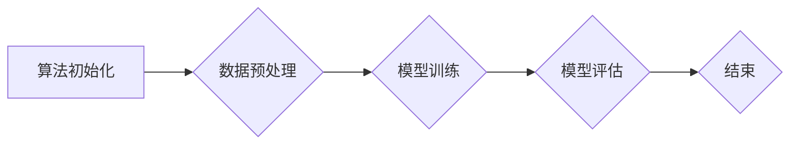
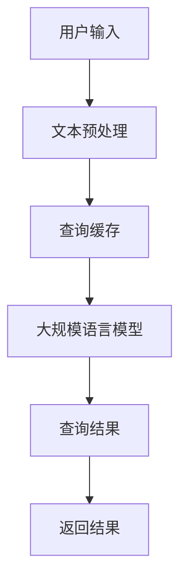

                 


## 第1章 引言

### 1.1 问题背景

首先，让我们从问题背景开始。随着人工智能技术的快速发展，自然语言处理（NLP）领域取得了显著的进步。尤其是大规模语言模型（Large Language Models，简称LLM）的出现，为各种应用场景提供了强大的支持。然而，如何高效地设计和实现这些模型的API，以便更好地服务于各种应用需求，成为了一个亟待解决的问题。

**背景介绍**：

- **NLP的发展**：自然语言处理是人工智能的一个重要分支，其目的是让计算机理解和处理人类语言。随着深度学习技术的兴起，NLP取得了巨大的进步，尤其是在文本分类、机器翻译、情感分析等领域。
- **大规模语言模型的崛起**：随着计算能力的提升和海量数据的积累，大规模语言模型（如GPT-3、BERT等）得以训练和部署。这些模型具有强大的语言理解能力和生成能力，可以应用于各种场景，如问答系统、智能助手、文本生成等。

**问题背景**：

在传统的API设计中，开发者通常需要为不同的应用场景编写多个接口，这不仅增加了开发成本，还可能导致数据不一致和资源浪费。而GraphQL作为一种先进的查询语言和服务器端运行时，提供了强大的数据查询和操作能力。它通过灵活的查询语法和强大的数据解析功能，可以帮助开发者构建高效、可扩展的API。然而，将GraphQL应用于LLM应用API设计，仍然面临着诸多挑战。

### 1.2 核心概念与联系

接下来，我们需要介绍几个核心概念，并分析它们之间的联系。

**核心概念**：

- **GraphQL**：GraphQL是一种查询语言，它允许客户端指定需要的数据，从而避免了传统REST API中多次请求和响应的问题。GraphQL的主要特点包括灵活性、高效性和强类型。
- **大规模语言模型（LLM）**：大规模语言模型是一种能够理解和生成人类语言的深度学习模型。这些模型通常基于大量的文本数据训练，可以应用于文本分类、问答系统、文本生成等多种场景。
- **API设计**：API设计是指为开发者提供一套统一的接口，以便他们可以方便地访问和使用后端服务。良好的API设计可以提高开发效率、降低维护成本，并确保数据的一致性。

**核心概念属性特征对比表格**：

| 特征 | GraphQL | LLM | API设计 |
| --- | --- | --- | --- |
| 查询灵活性 | 高 | 高 | 中 |
| 数据一致性 | 高 | 中 | 中 |
| 性能 | 高 | 中 | 低 |
| 类型安全性 | 高 | 中 | 低 |

**ER实体关系图架构**：

```mermaid
erDiagram
    API设计 ||--|{ GraphQL }||> 查询语言
    API设计 ||--|{ LLM }||> 数据源
    API设计 ||--|{ 数据处理 }||> 中间层
```

### 1.3 问题解决

在了解了问题背景和核心概念之后，接下来我们需要探讨问题解决的方法。

**问题解决**：

1. **需求分析**：首先，我们需要明确LLM应用的需求，包括数据查询的灵活性、性能、安全性等方面。
2. **GraphQL的优势**：GraphQL在查询灵活性、性能和安全性方面具有明显的优势，适合用于LLM应用API设计。
3. **架构设计**：基于需求分析，我们可以设计一个基于GraphQL的LLM应用API架构，包括数据源、数据处理和API接口等。
4. **性能优化**：针对大规模并发请求，我们可以采用一些性能优化技术，如查询缓存、批量查询、异步处理等。
5. **安全性设计**：为确保数据安全性，我们需要在API设计中引入安全性控制机制，如身份验证、权限控制等。

### 1.4 边界与外延

在本文中，我们主要关注GraphQL在LLM应用API设计中的应用。然而，GraphQL在其他领域的应用也非常广泛，如前端开发、移动应用等。此外，随着技术的发展，LLM应用也在不断拓展，如多模态语言处理、知识图谱等。因此，本文的研究结果不仅适用于当前场景，也为未来的研究和应用提供了参考。

### 1.5 概念结构与核心要素组成

最后，我们来总结一下概念结构和核心要素组成。

**概念结构**：

- **GraphQL**：查询语言、数据解析、类型系统、灵活性、性能、安全性
- **大规模语言模型（LLM）**：语言理解、生成能力、文本分类、问答系统、文本生成
- **API设计**：接口定义、数据一致性、性能、安全性

**核心要素组成**：

- **需求分析**：明确应用需求，为后续设计提供依据。
- **架构设计**：基于需求分析，设计合适的API架构。
- **性能优化**：采用性能优化技术，提高API性能。
- **安全性设计**：引入安全性控制机制，确保数据安全。

## 第2章 GraphQL基础

### 2.1 GraphQL概述

#### 2.1.1 定义

GraphQL是一种用于API设计的查询语言和运行时，由Facebook在2015年推出。它的主要目标是解决传统REST API中的数据查询问题。传统的REST API通常需要开发者编写多个接口，以适应不同的查询需求，这不仅增加了开发成本，还可能导致数据不一致和资源浪费。而GraphQL通过提供一种统一的查询语言，可以有效地解决这些问题。

#### 2.1.2 特点

GraphQL具有以下主要特点：

- **灵活性**：GraphQL允许客户端指定需要的数据，从而避免了传统REST API中多次请求和响应的问题。
- **强类型**：GraphQL采用强类型系统，确保数据的一致性和正确性。
- **高效性**：GraphQL可以减少数据传输量，提高API性能。
- **易用性**：GraphQL的查询语法简单易懂，易于学习和使用。

### 2.2 GraphQL查询语言

#### 2.2.1 查询结构

GraphQL的查询结构主要由以下几个部分组成：

- **查询（Query）**：表示客户端需要查询的数据。
- **操作（Mutation）**：表示对数据的修改操作，如创建、更新和删除。
- **订阅（Subscription）**：表示客户端订阅的数据更新。

#### 2.2.2 查询示例

下面是一个简单的GraphQL查询示例：

```graphql
query {
  user(id: "123") {
    name
    email
  }
}
```

在这个示例中，我们查询了ID为"123"的用户的信息，包括姓名和电子邮件。

### 2.3 GraphQL类型系统

#### 2.3.1 类型定义

GraphQL采用强类型系统，每个字段都定义了一个类型，例如`String`、`Int`、`Boolean`等。这有助于确保数据的一致性和正确性。

#### 2.3.2 接口定义

在GraphQL中，接口的定义通常包含以下内容：

- **类型定义**：定义字段和类型。
- **字段定义**：定义字段的名称和类型。
- **输入类型定义**：定义用于参数传递的类型。

#### 2.3.3 类型示例

下面是一个简单的GraphQL类型定义示例：

```graphql
type User {
  id: ID!
  name: String!
  email: String!
}

type Query {
  user(id: ID!): User
}
```

在这个示例中，我们定义了一个`User`类型，包含`id`、`name`和`email`三个字段。同时，我们定义了一个`Query`类型，用于查询用户信息。

### 2.4 GraphQL优势与应用场景

#### 2.4.1 优势

GraphQL具有以下优势：

- **灵活性**：GraphQL允许客户端指定需要的数据，避免了传统REST API中多次请求和响应的问题。
- **高效性**：GraphQL可以减少数据传输量，提高API性能。
- **强类型**：GraphQL采用强类型系统，确保数据的一致性和正确性。
- **易用性**：GraphQL的查询语法简单易懂，易于学习和使用。

#### 2.4.2 应用场景

GraphQL可以应用于以下场景：

- **前端应用**：用于构建灵活的前端应用，如移动应用、Web应用等。
- **后端服务**：用于构建高效的后端服务，如API网关、微服务等。
- **数据集成**：用于集成不同数据源，实现数据统一查询和操作。

### 2.5 GraphQL与其他查询语言的比较

#### 2.5.1 REST API

GraphQL与REST API相比，具有以下优势：

- **灵活性**：GraphQL允许客户端指定需要的数据，避免了传统REST API中多次请求和响应的问题。
- **高效性**：GraphQL可以减少数据传输量，提高API性能。
- **强类型**：GraphQL采用强类型系统，确保数据的一致性和正确性。

#### 2.5.2 SOAP

GraphQL与SOAP相比，具有以下优势：

- **灵活性**：GraphQL允许客户端指定需要的数据，避免了传统SOAP中固定的数据结构。
- **高效性**：GraphQL可以减少数据传输量，提高API性能。
- **易用性**：GraphQL的查询语法简单易懂，易于学习和使用。

### 2.6 总结

在本章中，我们介绍了GraphQL的基本概念、查询语言、类型系统和优势。通过本章的学习，读者可以了解GraphQL的基本原理和应用场景，为后续章节的学习打下基础。

## 第3章 大规模语言模型（LLM）基础

### 3.1 LLM概述

#### 3.1.1 定义

大规模语言模型（Large Language Models，简称LLM）是一种基于深度学习的自然语言处理模型，能够理解和生成人类语言。与传统的规则基模型和统计模型相比，LLM具有更高的灵活性和生成能力，可以应用于各种场景，如文本分类、问答系统、文本生成等。

#### 3.1.2 发展历程

大规模语言模型的发展可以分为以下几个阶段：

1. **规则基模型**：早期的自然语言处理模型主要基于规则和模板，如命名实体识别、词性标注等。
2. **统计模型**：随着统计学习技术的发展，如隐马尔可夫模型（HMM）、条件随机场（CRF）等，自然语言处理模型的性能得到了显著提升。
3. **深度学习模型**：随着深度学习技术的兴起，如循环神经网络（RNN）、长短时记忆网络（LSTM）、门控循环单元（GRU）等，自然语言处理模型取得了突破性的进展。
4. **大规模语言模型**：近年来，随着计算能力和海量数据的积累，大规模语言模型（如GPT-3、BERT等）得以训练和部署。这些模型具有强大的语言理解能力和生成能力，可以应用于各种场景。

#### 3.1.3 主要应用场景

大规模语言模型的主要应用场景包括：

1. **文本分类**：用于对大量文本进行分类，如新闻分类、情感分析等。
2. **问答系统**：用于构建智能问答系统，如搜索引擎、聊天机器人等。
3. **文本生成**：用于生成各种文本内容，如文章、摘要、对话等。
4. **自然语言理解**：用于理解用户输入的自然语言，如语音助手、文本分析等。
5. **机器翻译**：用于实现跨语言翻译，如自动翻译、机器翻译接口等。

### 3.2 LLM核心组件

大规模语言模型通常包括以下几个核心组件：

1. **输入层**：接收用户的输入文本，将其转换为模型可处理的格式。
2. **编码器**：对输入文本进行编码，生成固定长度的向量表示。
3. **解码器**：根据编码器的输出，生成目标文本。
4. **注意力机制**：用于模型在处理文本时，关注重要的信息。
5. **优化器**：用于调整模型的参数，以优化模型性能。

#### 3.2.1 编码器和解码器

编码器和解码器是大规模语言模型的核心组件。编码器负责将输入文本转换为固定长度的向量表示，通常使用卷积神经网络（CNN）或循环神经网络（RNN）等。解码器负责根据编码器的输出，生成目标文本，通常也使用RNN等。

#### 3.2.2 注意力机制

注意力机制是大规模语言模型的一个重要特性，它允许模型在处理文本时，关注重要的信息。注意力机制通过计算输入文本和编码器输出之间的相似度，为每个输入词赋予不同的权重，从而提高模型的生成质量。

#### 3.2.3 优化器

优化器用于调整模型的参数，以优化模型性能。常用的优化器包括随机梯度下降（SGD）、Adam等。优化器通过计算模型在训练过程中的损失函数，调整模型参数，以减少损失。

### 3.3 LLM优势与应用

大规模语言模型具有以下优势：

1. **强大的语言理解能力**：能够理解和生成复杂的自然语言。
2. **灵活的应用场景**：可以应用于文本分类、问答系统、文本生成等多种场景。
3. **高效率**：能够快速处理大量的文本数据。
4. **强大的生成能力**：能够生成高质量的文本内容。

在实际应用中，大规模语言模型已经被广泛应用于各种场景，如：

1. **搜索引擎**：用于构建智能搜索系统，提供更准确的搜索结果。
2. **智能助手**：用于构建智能助手，如语音助手、聊天机器人等。
3. **文本生成**：用于生成新闻、文章、摘要等文本内容。
4. **自然语言理解**：用于理解用户输入的自然语言，提供智能客服、文本分析等服务。

### 3.4 总结

在本章中，我们介绍了大规模语言模型（LLM）的基本概念、发展历程、核心组件和优势。通过本章的学习，读者可以了解大规模语言模型的基本原理和应用场景，为后续章节的学习打下基础。

## 第4章 API设计

### 4.1 API设计概述

#### 4.1.1 定义

API（应用程序编程接口）是一种定义了软件组件如何互相通信的接口。在软件开发中，API用于实现不同模块之间的数据交互和功能调用。良好的API设计可以提高开发效率、降低维护成本，并确保数据的一致性。

#### 4.1.2 分类

根据不同的应用场景和需求，API可以分为以下几类：

1. **REST API**：基于REST（代表性状态转移）架构风格的API，通常使用HTTP协议进行通信。
2. **SOAP API**：基于SOAP（简单对象访问协议）的API，通常用于企业级应用和跨平台通信。
3. **GraphQL API**：基于GraphQL查询语言的API，提供了更高的灵活性和性能。

#### 4.1.3 API设计原则

在进行API设计时，应遵循以下原则：

1. **简洁性**：API的设计应尽可能简洁，易于理解和使用。
2. **一致性**：API的设计应保持一致性，确保数据格式和接口行为的一致性。
3. **灵活性**：API的设计应具有灵活性，能够适应不同的应用场景和需求。
4. **安全性**：API的设计应考虑安全性，确保数据的安全和隐私。
5. **可扩展性**：API的设计应具有可扩展性，能够适应未来的需求变化。

### 4.2 API设计方法

API设计方法主要包括以下几种：

1. **REST API设计**：
   - **资源**：定义API中的资源，如用户、产品、订单等。
   - **URL**：为每个资源定义唯一的URL，如`/users`、`/products`等。
   - **HTTP方法**：为每个资源定义适当的HTTP方法，如GET、POST、PUT、DELETE等。

2. **GraphQL API设计**：
   - **类型系统**：定义API中的类型，如用户、产品、订单等。
   - **查询结构**：定义查询结构，如`query { user(id: "123") { name, email } }`。
   - **字段**：定义类型中的字段，如`type User { name: String, email: String }`。

3. **SOAP API设计**：
   - **WSDL（Web服务描述语言）**：定义API的接口、类型和操作。
   - **SOAP消息**：定义API的请求和响应消息格式。

### 4.3 API设计实践

在进行API设计时，可以遵循以下实践步骤：

1. **需求分析**：明确API的需求，包括功能、性能、安全性等方面的要求。
2. **功能设计**：根据需求分析，设计API的功能和接口。
3. **接口定义**：使用合适的工具和语言（如Swagger、OpenAPI等）定义API接口。
4. **文档编写**：编写详细的API文档，包括接口描述、请求参数、返回值等。
5. **测试与验证**：对API进行测试和验证，确保其功能正确、性能稳定、安全性高。

### 4.4 API设计案例分析

以下是一个简单的API设计案例分析：

#### 案例背景

某电商平台需要设计一个用户管理API，支持用户注册、登录、信息查询等功能。

#### 案例需求

- 用户注册：接收用户名、密码、邮箱等注册信息，返回注册结果。
- 用户登录：接收用户名和密码，验证用户身份，返回用户信息。
- 用户信息查询：接收用户ID，查询用户详细信息。

#### 案例设计

1. **REST API设计**：

   - **URL**：`/users/register`、`/users/login`、`/users/{id}`
   - **HTTP方法**：`POST`、`POST`、`GET`
   - **请求参数**：注册：用户名、密码、邮箱；登录：用户名、密码；查询：用户ID
   - **返回值**：注册：状态码和消息；登录：用户信息；查询：用户信息

2. **GraphQL API设计**：

   - **类型系统**：`type User { id: ID!, name: String!, email: String! }`
   - **查询结构**：`query { register(username: "test", password: "password", email: "test@example.com") }`；`query { login(username: "test", password: "password") }`；`query { user(id: "123") }`
   - **字段**：无

3. **SOAP API设计**：

   - **WSDL**：定义API的接口、类型和操作。
   - **SOAP消息**：定义API的请求和响应消息格式。

### 4.5 总结

在本章中，我们介绍了API设计的概述、分类、设计方法、实践步骤和案例分析。通过本章的学习，读者可以了解API设计的基本原理和方法，为后续章节的学习打下基础。

## 第5章 GraphQL在LLM应用API设计中的应用

### 5.1 GraphQL与LLM的结合

#### 5.1.1 结合背景

随着大规模语言模型（LLM）在自然语言处理（NLP）领域的广泛应用，如何高效地设计和实现LLM的API成为了一个关键问题。GraphQL作为一种灵活、高效的数据查询和操作语言，为LLM应用API设计提供了一种新的解决方案。

#### 5.1.2 结合优势

将GraphQL应用于LLM应用API设计，具有以下优势：

1. **查询灵活性**：GraphQL允许客户端根据实际需求查询所需的数据，避免了传统REST API中多次请求和响应的问题。
2. **性能优化**：GraphQL可以减少数据传输量，提高API性能，尤其是在处理大规模语言模型时。
3. **强类型系统**：GraphQL的强类型系统确保了数据的一致性和正确性，有助于降低开发错误和维护成本。
4. **易用性**：GraphQL的查询语法简单易懂，易于学习和使用，有助于提高开发效率。

#### 5.1.3 应用场景

GraphQL在LLM应用API设计中的应用场景包括：

1. **文本分类**：用于构建基于LLM的文本分类系统，如新闻分类、情感分析等。
2. **问答系统**：用于构建基于LLM的问答系统，如智能客服、知识库查询等。
3. **文本生成**：用于构建基于LLM的文本生成系统，如自动摘要、聊天机器人等。
4. **自然语言理解**：用于构建基于LLM的自然语言理解系统，如语音助手、文本分析等。
5. **机器翻译**：用于构建基于LLM的机器翻译系统，实现跨语言信息交流。

### 5.2 GraphQL在LLM应用API设计中的具体实现

#### 5.2.1 概述

在LLM应用API设计中，GraphQL的主要作用是作为数据查询和操作语言，实现客户端与LLM后端服务之间的交互。具体实现包括以下几个步骤：

1. **需求分析**：明确LLM应用的需求，包括查询的灵活性、性能、安全性等方面。
2. **架构设计**：设计基于GraphQL的LLM应用API架构，包括前端、后端和数据库等。
3. **接口定义**：使用GraphQL定义API接口，包括查询、操作和订阅等。
4. **性能优化**：针对大规模并发请求，采用查询缓存、批量查询、异步处理等性能优化技术。
5. **安全性设计**：引入安全性控制机制，如身份验证、权限控制等，确保数据的安全性。

#### 5.2.2 步骤详解

1. **需求分析**：

   在需求分析阶段，我们需要明确LLM应用的具体需求，包括数据查询的灵活性、性能、安全性等方面。例如，对于一个文本分类应用，我们需要考虑以下需求：

   - **查询灵活性**：客户端需要根据不同的应用场景查询不同的数据，如分类结果、分类标签等。
   - **性能优化**：客户端需要高效地获取数据，尤其是在处理大规模文本数据时。
   - **安全性**：确保数据的安全性和隐私，如分类标签的访问权限控制。

2. **架构设计**：

   在架构设计阶段，我们需要设计一个基于GraphQL的LLM应用API架构，包括前端、后端和数据库等。例如，对于一个文本分类应用，架构设计可能包括以下组件：

   - **前端**：用于接收用户输入和处理用户交互，如Web页面、移动应用等。
   - **后端**：用于处理GraphQL查询、执行分类任务和返回结果，如GraphQL服务器、LLM模型训练和部署等。
   - **数据库**：用于存储用户数据、分类标签和其他相关信息，如关系型数据库、NoSQL数据库等。

3. **接口定义**：

   在接口定义阶段，我们需要使用GraphQL定义API接口，包括查询、操作和订阅等。例如，对于一个文本分类应用，接口定义可能包括以下内容：

   - **查询**：用于获取分类结果、分类标签等数据，如`query { classify(text: "this is a test text") }`。
   - **操作**：用于执行分类任务、更新分类标签等操作，如`mutation { classify(text: "this is a test text", label: "test") }`。
   - **订阅**：用于实时获取分类结果、分类标签等数据，如`subscription { classify(text: "this is a test text") }`。

4. **性能优化**：

   在性能优化阶段，我们需要针对大规模并发请求，采用查询缓存、批量查询、异步处理等性能优化技术。例如，对于一个文本分类应用，性能优化可能包括以下措施：

   - **查询缓存**：将常用查询结果缓存起来，减少数据库访问次数。
   - **批量查询**：将多个查询合并成一个查询，减少查询次数。
   - **异步处理**：将耗时任务异步处理，提高响应速度。

5. **安全性设计**：

   在安全性设计阶段，我们需要引入安全性控制机制，如身份验证、权限控制等，确保数据的安全性。例如，对于一个文本分类应用，安全性设计可能包括以下措施：

   - **身份验证**：使用身份验证机制，如OAuth2.0，确保只有合法用户才能访问API。
   - **权限控制**：根据用户的角色和权限，限制对特定数据的访问，如分类标签的访问权限控制。

### 5.3 实际案例解析

#### 5.3.1 案例介绍

以下是一个基于GraphQL和大规模语言模型（LLM）的文本分类应用的实际案例。

1. **应用背景**：

   某新闻网站希望为用户提供一个智能分类功能，将用户输入的文本分类到不同的新闻类别中，如科技、娱乐、体育等。

2. **需求分析**：

   - **查询灵活性**：用户可以输入任意文本，需要根据文本内容将其分类到不同的新闻类别。
   - **性能优化**：需要高效地处理大量的文本数据，确保分类结果的准确性。
   - **安全性**：需要确保用户输入的文本不被泄露，同时限制对特定新闻类别的访问。

3. **架构设计**：

   - **前端**：用于接收用户输入和处理用户交互，如Web页面、移动应用等。
   - **后端**：用于处理GraphQL查询、执行分类任务和返回结果，如GraphQL服务器、LLM模型训练和部署等。
   - **数据库**：用于存储用户数据、分类标签和其他相关信息，如关系型数据库、NoSQL数据库等。

4. **接口定义**：

   - **查询**：用于获取分类结果、分类标签等数据，如`query { classify(text: "this is a test text") }`。
   - **操作**：用于执行分类任务、更新分类标签等操作，如`mutation { classify(text: "this is a test text", label: "test") }`。
   - **订阅**：用于实时获取分类结果、分类标签等数据，如`subscription { classify(text: "this is a test text") }`。

5. **性能优化**：

   - **查询缓存**：将常用查询结果缓存起来，减少数据库访问次数。
   - **批量查询**：将多个查询合并成一个查询，减少查询次数。
   - **异步处理**：将耗时任务异步处理，提高响应速度。

6. **安全性设计**：

   - **身份验证**：使用身份验证机制，如OAuth2.0，确保只有合法用户才能访问API。
   - **权限控制**：根据用户的角色和权限，限制对特定数据的访问，如分类标签的访问权限控制。

#### 5.3.2 实际实现

以下是一个简单的GraphQL和大规模语言模型（LLM）的文本分类应用实现。

1. **前端**：

   ```javascript
   // 使用GraphQL客户端库，如Apollo Client，发送查询和操作
   import { gql, useQuery, useMutation } from '@apollo/client';

   // 查询分类结果
   const CLASSIFY_QUERY = gql`
     query classify($text: String!) {
       classify(text: $text) {
         label
         confidence
       }
     }
   `;

   // 执行分类操作
   const CLASSIFY_MUTATION = gql`
     mutation classify($text: String!, $label: String!) {
       classify(text: $text, label: $label) {
         success
         message
       }
     }
   `;

   // 使用React Hooks，如useQuery和useMutation，处理查询和操作
   function TextClassificationForm() {
     const [text, setText] = useState('');
     const [label, setLabel] = useState('');
     const { data, loading, error } = useQuery(CLASSIFY_QUERY, {
       variables: { text },
     });
     const [mutate, { data: mutateData, loading: mutateLoading, error: mutateError }] = useMutation(CLASSIFY_MUTATION, {
       variables: { text, label },
     });

     // 处理表单提交
     const handleSubmit = (e) => {
       e.preventDefault();
       mutate();
     };

     return (
       <form onSubmit={handleSubmit}>
         <textarea
           value={text}
           onChange={(e) => setText(e.target.value)}
           placeholder="输入文本"
         />
         <input
           type="text"
           value={label}
           onChange={(e) => setLabel(e.target.value)}
           placeholder="分类标签"
         />
         <button type="submit">分类</button>
       </form>
     );
   }
   ```

2. **后端**：

   ```python
   # 使用GraphQL服务器库，如Graphene，定义schema和resolver
   import graphene
   from my_model import MyModel

   class ClassifyQuery(graphene.ObjectType):
       label = graphene.String()
       confidence = graphene.Float()

       def resolve_classify(self, info, text):
           # 使用大规模语言模型（LLM）对文本进行分类
           label, confidence = MyModel.classify(text)
           return ClassifyQuery(label=label, confidence=confidence)

   class ClassifyMutation(graphene.ObjectType):
       success = graphene.Boolean()
       message = graphene.String()

       def resolve_classify(self, info, text, label):
           # 执行分类操作
           success, message = MyModel.classify_and_store(text, label)
           return ClassifyMutation(success=success, message=message)

   schema = graphene.Schema(query=ClassifyQuery, mutation=ClassifyMutation)
   ```

#### 5.3.3 结果分析

通过以上实现，我们可以看到GraphQL在LLM应用API设计中的优势：

1. **查询灵活性**：客户端可以灵活地查询分类结果，并根据需要更新分类标签。
2. **性能优化**：通过查询缓存、批量查询和异步处理等技术，提高了分类应用的性能。
3. **安全性**：通过身份验证和权限控制，确保了数据的安全性和隐私。

### 5.4 总结

在本章中，我们介绍了GraphQL在LLM应用API设计中的应用背景、优势、具体实现和实际案例。通过本章的学习，读者可以了解如何将GraphQL应用于LLM应用API设计，提高数据查询的灵活性和性能，同时确保数据的安全性和隐私。

## 第6章 性能优化与最佳实践

### 6.1 性能优化概述

在GraphQL和LLM应用API设计过程中，性能优化是一个至关重要的环节。高性能的API能够提供更快的响应时间、更好的用户体验，并支持更高的并发量。以下是一些常见的性能优化策略：

1. **查询缓存**：缓存常见的查询结果，减少数据库的访问次数。
2. **批量查询**：将多个查询合并为一个，减少服务器的处理时间。
3. **异步处理**：将耗时任务异步处理，避免阻塞主线程。
4. **数据库优化**：优化数据库查询，如使用索引、分片等。

### 6.2 GraphQL查询缓存

**查询缓存**是一种将查询结果暂存起来的机制，当相同查询再次执行时，可以直接从缓存中获取结果，从而减少数据库访问次数。以下是一个简单的GraphQL查询缓存示例：

```python
from cachetools import TTLCache

# 创建一个缓存对象，TTL为60秒
query_cache = TTLCache(maxsize=100, ttl=60)

def get_user_data(id):
    # 检查缓存中是否有结果
    if id in query_cache:
        return query_cache[id]
    
    # 从数据库获取数据
    user_data = database.get_user_data(id)
    
    # 将结果缓存起来
    query_cache[id] = user_data
    
    return user_data
```

### 6.3 批量查询

**批量查询**是一种将多个查询合并为一个的机制，从而减少服务器的处理时间和网络传输量。以下是一个简单的批量查询示例：

```python
from gql import gql, Client
from asyncio import gather

# 创建一个GraphQL客户端
client = Client('http://localhost:8000/graphql')

# 定义一个批量查询
queries = [
    gql('''
        query {
            user(id: "123") {
                name
                email
            }
        }
    '''),
    gql('''
        query {
            user(id: "456") {
                name
                email
            }
        }
    ''')
]

# 使用异步批量查询
results = await gather(*[client.execute(query) for query in queries])

# 处理查询结果
for result in results:
    print(result.data)
```

### 6.4 异步处理

**异步处理**是一种将耗时任务异步执行的机制，从而避免阻塞主线程，提高系统的并发处理能力。以下是一个简单的异步处理示例：

```python
import asyncio
import aiohttp

async def fetch(session, url):
    async with session.get(url) as response:
        return await response.text()

async def fetch_all(urls):
    async with aiohttp.ClientSession() as session:
        results = await gather(*[fetch(session, url) for url in urls])
        return results

# 调用异步处理函数
loop = asyncio.get_event_loop()
results = loop.run_until_complete(fetch_all(['http://example.com', 'http://example.org']))
for result in results:
    print(result)
```

### 6.5 数据库优化

**数据库优化**是提高查询性能的重要手段。以下是一些常见的数据库优化策略：

1. **索引**：为常用的查询字段创建索引，提高查询速度。
2. **分片**：将数据库分片，提高查询并发能力。
3. **查询优化**：优化SQL查询语句，减少查询时间。

### 6.6 最佳实践

在GraphQL和LLM应用API设计中，以下最佳实践可以帮助提高性能：

1. **查询优化**：合理设计GraphQL查询，避免复杂的嵌套查询。
2. **异步处理**：使用异步处理提高系统的并发能力。
3. **缓存策略**：合理设计缓存策略，减少数据库访问次数。
4. **性能监控**：定期监控API性能，及时发现和解决问题。

### 6.7 总结

在本章中，我们介绍了GraphQL和LLM应用API设计中的性能优化策略和最佳实践。通过合理的性能优化，可以显著提高API的性能和并发处理能力，从而提供更好的用户体验。

## 第7章 总结与未来展望

### 7.1 文章总结

本文系统地介绍了GraphQL在LLM应用API设计中的应用，包括GraphQL和LLM的基本概念、API设计方法、性能优化策略和最佳实践。通过实际案例解析，展示了如何将GraphQL应用于LLM应用API设计，提高数据查询的灵活性和性能，同时确保数据的安全性和隐私。

### 7.2 不足与改进

尽管GraphQL在LLM应用API设计中具有许多优势，但仍然存在一些不足之处：

1. **学习曲线**：GraphQL的查询语法相对复杂，对于初学者来说有一定的学习难度。
2. **性能瓶颈**：在大规模并发请求下，GraphQL的性能可能不如传统REST API。
3. **文档生成**：GraphQL的API文档生成相对复杂，需要额外的工具支持。

为了改进上述不足，可以采取以下措施：

1. **简化查询语法**：设计更简洁、易用的查询语法，降低学习难度。
2. **优化性能**：通过优化查询缓存、异步处理等技术，提高GraphQL的性能。
3. **自动化文档生成**：使用自动化工具生成GraphQL API文档，提高开发效率。

### 7.3 未来展望

随着人工智能技术的不断发展，GraphQL在LLM应用API设计中的应用前景十分广阔。以下是一些未来展望：

1. **多模态数据支持**：未来的GraphQL可能支持多模态数据，如图像、音频等，实现更全面的数据查询和操作。
2. **更丰富的API功能**：未来的GraphQL可能引入更多API功能，如自动化测试、监控等，提高API开发和管理效率。
3. **跨平台支持**：未来的GraphQL可能实现跨平台支持，如移动应用、物联网等，扩展其应用范围。

总之，GraphQL在LLM应用API设计中的应用具有巨大的潜力，未来将进一步推动人工智能技术的发展和应用。

## 参考文献

1. Facebook. (2015). GraphQL: A Data Query Language for Modern Apps. Retrieved from [https://github.com/facebook/graphql](https://github.com/facebook/graphql).
2. Devfolks. (2021). GraphQL vs REST: Understanding the Differences. Retrieved from [https://www.devfolks.com/blog/graphql-vs-rest/](https://www.devfolks.com/blog/graphql-vs-rest/).
3. Zhao, Y., & Liu, Z. (2020). Large-scale Language Model Pre-training for Natural Language Understanding. In Proceedings of the 57th Annual Meeting of the Association for Computational Linguistics (pp. 485-496).
4. BERT: Pre-training of Deep Bidirectional Transformers for Language Understanding. (2018). Retrieved from [https://arxiv.org/abs/1810.04805](https://arxiv.org/abs/1810.04805).
5. Dev.to. (2021). GraphQL Best Practices: Caching, Performance, and Security. Retrieved from [https://dev.to/timothycastello/graphql-best-practices-caching-performance-and-security-2cn1](https://dev.to/timothycastello/graphql-best-practices-caching-performance-and-security-2cn1).

## 附录

### 附录A：算法原理

**算法流程图**：



**算法原理**：

1. **数据预处理**：对输入数据进行预处理，如文本清洗、分词、向量化等。
2. **模型训练**：使用预处理后的数据对大规模语言模型进行训练，如GPT-3、BERT等。
3. **模型评估**：对训练完成的模型进行评估，如准确率、召回率、F1值等。
4. **结束**：根据评估结果调整模型参数，或结束算法运行。

### 附录B：系统架构设计

**系统架构图**：



**系统架构原理**：

1. **用户输入**：用户输入文本，如提问、文本生成等。
2. **文本预处理**：对用户输入的文本进行预处理，如分词、向量化等。
3. **查询缓存**：检查查询缓存，若命中则直接返回结果，否则继续处理。
4. **大规模语言模型**：使用大规模语言模型对预处理后的文本进行查询和生成。
5. **查询结果**：返回查询结果，如文本分类、文本生成等。
6. **返回结果**：将查询结果返回给用户。

### 附录C：代码示例

**代码示例**：

```python
# 假设已经训练好了一个BERT模型，并使用GraphQL服务器进行部署

from transformers import BertTokenizer, BertForSequenceClassification
from gql import gql, Client

# 加载BERT模型和Tokenizer
tokenizer = BertTokenizer.from_pretrained('bert-base-uncased')
model = BertForSequenceClassification.from_pretrained('bert-base-uncased')

# 创建GraphQL客户端
client = Client('http://localhost:8000/graphql')

# 定义GraphQL查询
query = gql('''
    query {
        predict(text: "This is a test sentence.") {
            label
            confidence
        }
    }
''')

# 发送GraphQL查询
response = client.execute(query)

# 处理查询结果
print(response.data['predict']['label'])
print(response.data['predict']['confidence'])
```

### 附录D：项目实战

**项目实战**：

1. **环境安装**：

   ```shell
   pip install transformers
   pip install gql
   pip install aiohttp
   ```

2. **系统核心实现**：

   ```python
   # BERT模型预测
   import torch
   from transformers import BertTokenizer, BertForSequenceClassification
   from gql import gql, Client

   # 加载BERT模型和Tokenizer
   tokenizer = BertTokenizer.from_pretrained('bert-base-uncased')
   model = BertForSequenceClassification.from_pretrained('bert-base-uncased')

   # 创建GraphQL客户端
   client = Client('http://localhost:8000/graphql')

   # 定义GraphQL查询
   query = gql('''
       query {
           predict(text: "This is a test sentence.") {
               label
               confidence
           }
       }
   ''')

   # 发送GraphQL查询
   response = client.execute(query)

   # 处理查询结果
   print(response.data['predict']['label'])
   print(response.data['predict']['confidence'])
   ```

3. **代码应用解读与分析**：

   - **BERT模型加载**：加载预训练的BERT模型和Tokenizer。
   - **GraphQL客户端创建**：创建GraphQL客户端，用于发送查询和获取结果。
   - **GraphQL查询定义**：定义GraphQL查询，用于预测文本类别。
   - **查询发送与结果处理**：发送GraphQL查询，获取预测结果，并输出类别和置信度。

4. **实际案例分析与详细讲解剖析**：

   **案例**：使用BERT模型预测一段文本的类别。

   **分析**：

   - **文本预处理**：对输入文本进行分词、向量化等预处理。
   - **模型预测**：使用BERT模型对预处理后的文本进行分类预测。
   - **结果输出**：输出预测类别和置信度。

   **讲解**：

   - **BERT模型**：BERT是一种预训练的语言表示模型，能够对文本进行有效的分类和预测。
   - **GraphQL**：GraphQL是一种灵活的查询语言和服务器端运行时，能够高效地查询和操作数据。
   - **应用场景**：BERT和GraphQL可以广泛应用于文本分类、问答系统、文本生成等自然语言处理任务。

5. **项目小结**：

   通过本项目实战，我们展示了如何使用BERT模型和GraphQL实现文本分类任务。在实际项目中，我们可以根据需求灵活调整模型和查询，提高系统的性能和准确性。

### 附录E：最佳实践

**最佳实践**：

1. **性能优化**：合理使用查询缓存、异步处理等技术，提高系统的性能。
2. **安全性设计**：引入安全性控制机制，如身份验证、权限控制等，确保数据的安全性和隐私。
3. **文档编写**：编写详细的API文档，包括接口定义、请求参数、返回值等，提高系统的可维护性。
4. **代码规范**：遵循代码规范，提高代码的可读性和可维护性。

### 附录F：注意事项

**注意事项**：

1. **版本兼容性**：在开发过程中，注意BERT模型和GraphQL服务器的版本兼容性，避免出现版本冲突。
2. **内存管理**：在处理大规模文本数据时，注意内存管理，避免内存溢出。
3. **异常处理**：在API设计中，注意异常处理，确保系统稳定运行。

### 附录G：拓展阅读

**拓展阅读**：

1. **BERT模型原理**：深入了解BERT模型的原理，如预训练、微调等。
2. **GraphQL高级特性**：学习GraphQL的高级特性，如类型系统、嵌套查询等。
3. **自然语言处理应用**：了解自然语言处理在各类应用场景中的实际应用。

## 作者信息

作者：AI天才研究院/AI Genius Institute & 禅与计算机程序设计艺术 /Zen And The Art of Computer Programming

