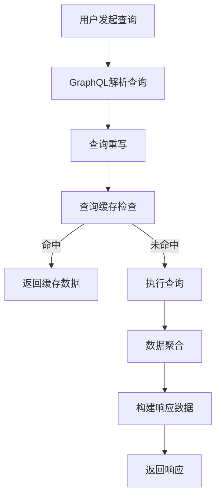
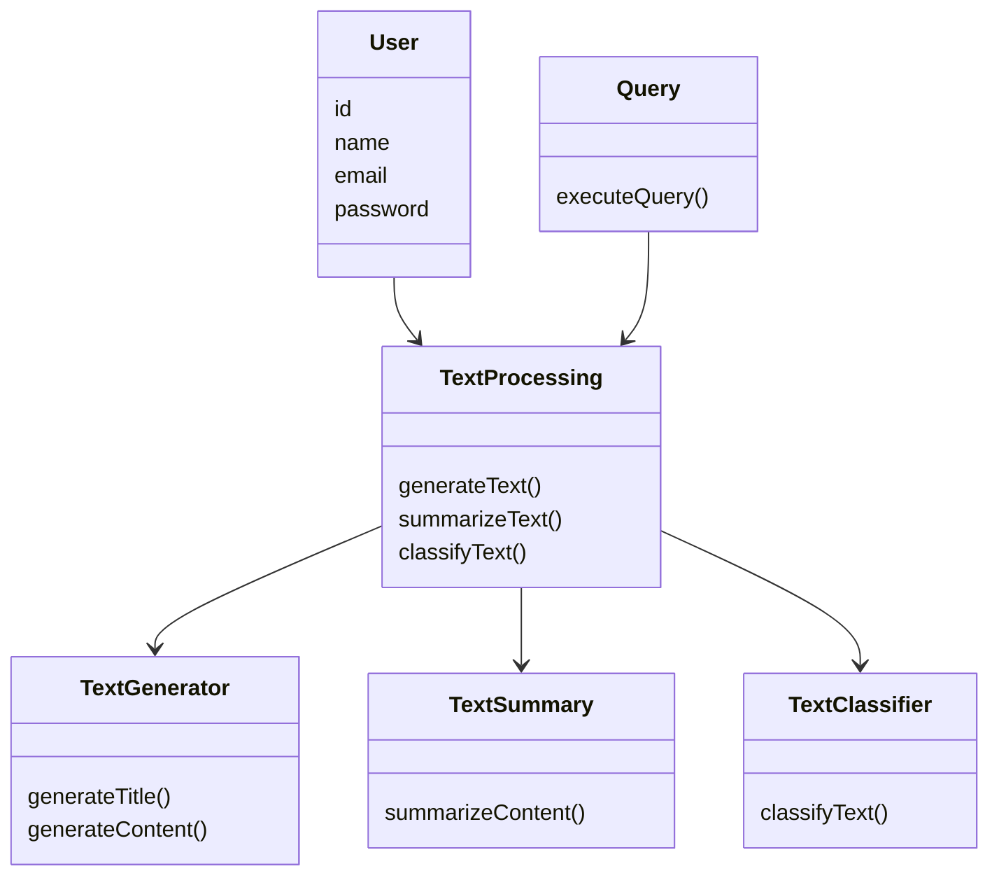
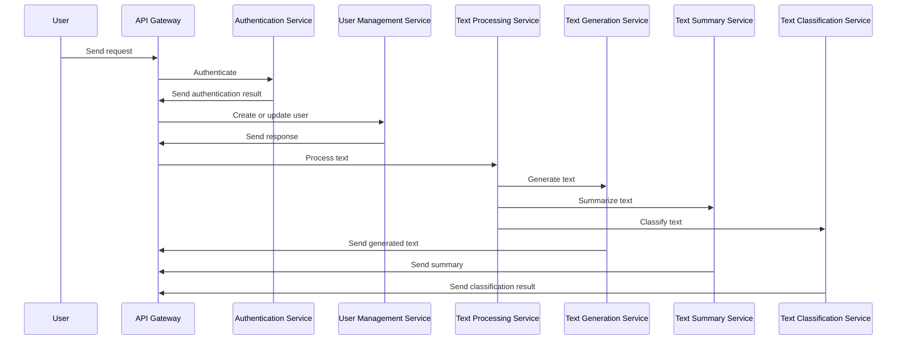

                 

### 《GraphQL在灵活LLM API设计中的应用》

关键词：GraphQL、LLM、API设计、灵活、性能优化

摘要：本文深入探讨了GraphQL在灵活LLM API设计中的应用。首先介绍了GraphQL和LLM的基本概念和背景，然后详细分析了GraphQL在LLM API设计中的优势和应用场景。通过逐步剖析算法原理，本文提出了优化LLM API的设计方案，并提供了实际项目的实现细节和最佳实践。本文旨在为开发者提供清晰、易懂的指导，以实现高效、灵活的LLM API设计。

## 引言

在当今的软件开发领域，API设计已成为一项至关重要的任务。随着应用程序的复杂度不断增加，如何设计灵活、高效且易于使用的API成为开发者的关注焦点。近年来，GraphQL作为一种新兴的API设计语言，因其强大的灵活性和性能优势，逐渐受到开发者的青睐。同时，大型语言模型（LLM）作为自然语言处理领域的核心技术，也在不断推动人工智能应用的发展。本文将围绕GraphQL在灵活LLM API设计中的应用展开讨论，旨在为开发者提供一种全新的API设计思路。

### 问题的提出

在传统的API设计中，开发者通常需要根据预定义的接口和数据结构来提供服务和数据。然而，这种方式往往难以满足动态变化的需求。例如，当用户请求的数据结构发生变化时，开发者需要重新设计和实现API，导致开发和维护成本增加。此外，传统API在查询性能上存在一定瓶颈，难以满足大规模数据处理的场景。因此，如何设计一种灵活、高效的API成为开发者亟待解决的问题。

### GraphQL与LLM的背景介绍

GraphQL作为一种灵活的查询语言，由Facebook在2015年推出。它允许客户端根据需要精确地指定所需数据的结构，从而避免了传统REST API中“过度提供”或“不足提供”数据的问题。GraphQL通过一种统一的查询语言，实现了对各种数据源（如数据库、外部服务等）的灵活查询，提高了API的性能和可维护性。

另一方面，大型语言模型（LLM）是一种基于深度学习的自然语言处理技术。通过训练大规模的神经网络模型，LLM可以理解和生成自然语言，广泛应用于机器翻译、问答系统、文本摘要等领域。随着LLM技术的不断发展，其在API设计中的应用也越来越广泛。

### 书籍目标和结构

本文的目标是探讨GraphQL在灵活LLM API设计中的应用，为开发者提供一种全新的API设计思路。本文将分为以下几个部分：

1. **GraphQL基础**：介绍GraphQL的基本概念、核心特性和查询方法。
2. **LLM基础**：介绍LLM的基本概念、核心组件和应用场景。
3. **GraphQL在LLM API设计中的应用**：分析GraphQL在LLM API设计中的优势和应用场景，并提出优化方案。
4. **算法原理讲解**：详细讲解GraphQL在LLM API设计中的算法原理，包括查询优化、数据结构设计等。
5. **数学模型与公式**：介绍与算法相关的数学模型和公式，并进行通俗易懂的举例说明。
6. **系统分析与架构设计**：分析一个实际项目，介绍其系统功能设计、架构设计和接口设计。
7. **项目实战**：提供实际项目的实现细节，包括环境安装、系统核心实现和代码应用解读。
8. **最佳实践与拓展**：总结最佳实践，指出注意事项，并提供拓展阅读。

通过以上结构，本文将逐步引导读者深入理解GraphQL在灵活LLM API设计中的应用，为开发者提供实用的指导和参考。

## GraphQL基础

### GraphQL的概念与优势

GraphQL是一种基于查询的API设计语言，旨在解决传统REST API的诸多痛点。与传统API相比，GraphQL具有以下显著优势：

1. **灵活性**：GraphQL允许客户端指定所需数据的结构和内容，而不仅仅是资源的路径。这意味着开发者无需为每个可能的查询路径编写不同的接口，从而简化了API的设计和维护。
2. **减少数据传输**：GraphQL通过聚合多个查询请求为一个单一的请求，减少了客户端与服务器之间的往返次数，从而提高了数据传输的效率。
3. **错误处理**：GraphQL能够明确地返回错误信息，使开发者可以更方便地处理错误和调试问题。
4. **易于集成**：GraphQL可以与各种后端技术和数据源无缝集成，包括数据库、外部服务、微服务等。

### GraphQL的核心概念

1. **类型**：类型是GraphQL的基本构建块，包括对象、接口、联合类型和标量类型。每种类型都定义了一组属性和方法，用于描述数据和操作。
2. **字段**：字段是类型中的属性，用于表示对象的具体信息。在GraphQL查询中，客户端可以通过字段来请求特定类型的数据。
3. **查询**：查询是GraphQL的核心概念，用于请求数据。查询由多个选择器（字段）组成，选择器可以嵌套以获取嵌套数据。
4. **mutation**：mutation是GraphQL中的另一种操作，用于更新数据。与查询类似，mutation也由多个选择器组成，但用于修改现有数据。

### GraphQL查询与响应

GraphQL查询通常由以下部分组成：

1. **选择器**：选择器定义了查询的目标和所需的数据字段。选择器可以嵌套，以获取嵌套数据。
2. **变量**：变量是GraphQL查询中的占位符，用于传递动态值。变量可以用于选择器和过滤条件，提高了查询的灵活性。
3. **操作**：操作定义了GraphQL查询的执行方式，包括查询（query）和mutation。

一个典型的GraphQL查询示例如下：

```graphql
{
  user(id: "123") {
    name
    email
    posts {
      title
      content
    }
  }
}
```

此查询请求获取用户ID为"123"的用户信息，包括用户名、电子邮件和帖子列表。响应将包含以下结构：

```json
{
  "data": {
    "user": {
      "name": "John Doe",
      "email": "john.doe@example.com",
      "posts": [
        {
          "title": "First Post",
          "content": "This is the first post."
        },
        {
          "title": "Second Post",
          "content": "This is the second post."
        }
      ]
    }
  }
}
```

通过以上示例，我们可以看到GraphQL如何通过灵活的查询方式，使客户端能够精确地获取所需数据。

### 小结

本章节介绍了GraphQL的基本概念、核心特性和查询方法。通过对GraphQL的灵活性和性能优势的深入分析，我们为后续章节探讨GraphQL在LLM API设计中的应用奠定了基础。在下一章中，我们将深入探讨LLM的基础知识，包括其概念、核心组件和应用场景。

## LLM基础

### LLM的概念与作用

大型语言模型（LLM，Large Language Model）是一种基于深度学习的自然语言处理技术，通过训练大规模的神经网络模型，实现对自然语言的生成、理解和处理。LLM在人工智能领域具有广泛的应用，包括但不限于以下方面：

1. **自然语言生成**：LLM可以生成高质量的自然语言文本，广泛应用于自动写作、文本摘要、机器翻译等领域。
2. **自然语言理解**：LLM能够理解和处理自然语言输入，为智能问答、智能客服、信息检索等应用提供支持。
3. **语言模型优化**：LLM通过不断学习和优化，能够提高自然语言处理任务的性能和准确性。

### LLM的核心组件

LLM的核心组件主要包括以下几部分：

1. **词向量表示**：词向量是将自然语言文本转换为向量表示的技术，常用于表示词汇和句子。词向量表示是LLM进行自然语言处理的基础。
2. **神经网络结构**：神经网络是LLM的核心计算模型，通过多层神经网络结构，实现对自然语言的理解和生成。
3. **训练数据集**：训练数据集是LLM训练的重要输入，数据集的质量和规模直接影响到LLM的性能和效果。
4. **优化算法**：优化算法用于调整神经网络参数，以最小化训练过程中的误差。常见的优化算法包括梯度下降、Adam等。

### LLM的应用场景

LLM的应用场景非常广泛，以下是一些典型的应用场景：

1. **机器翻译**：LLM可以用于实现高效、准确的机器翻译，支持多种语言之间的翻译。
2. **智能问答**：LLM可以构建智能问答系统，回答用户提出的问题，提供个性化的信息查询服务。
3. **文本摘要**：LLM可以自动生成文章的摘要，提高文本的可读性和信息获取效率。
4. **内容生成**：LLM可以生成高质量的文章、广告文案、产品描述等，应用于内容创作和营销。
5. **情感分析**：LLM可以分析文本的情感倾向，为情感分析、用户反馈分析等应用提供支持。

### 小结

在本章节中，我们介绍了LLM的基本概念、核心组件和应用场景。通过对LLM的深入理解，我们为后续章节探讨GraphQL在LLM API设计中的应用提供了理论基础。在下一章中，我们将深入分析GraphQL在LLM API设计中的优势和应用场景。

## GraphQL在LLM API设计中的应用

### GraphQL与LLM的结合点

GraphQL在LLM API设计中的应用主要体现在以下几个方面：

1. **灵活性**：GraphQL允许客户端根据需求动态地指定所需数据，与LLM的自然语言处理能力相得益彰，能够满足多样化的数据处理需求。
2. **高效性**：GraphQL通过聚合查询请求，减少客户端与服务器之间的往返次数，提高数据传输效率，有助于优化LLM API的性能。
3. **错误处理**：GraphQL能够明确地返回错误信息，帮助开发者快速定位和解决API问题，提高LLM API的可靠性和可维护性。

### GraphQL优化LLM API的方法

1. **聚合查询**：通过聚合多个查询请求为一个单一的请求，减少客户端与服务器之间的往返次数，提高数据传输效率。例如，一个请求可以同时获取用户信息、用户帖子列表以及帖子内容摘要。
2. **缓存策略**：利用GraphQL的缓存机制，将常用数据缓存到客户端，减少重复查询，提高API的响应速度。例如，可以将用户最近查看的帖子缓存到本地，避免每次查询时都从服务器获取。
3. **自定义类型**：通过自定义GraphQL类型，实现对LLM数据结构的灵活表示。例如，可以为帖子数据定义自定义类型，包括标题、内容、创建时间等字段，方便客户端根据需求进行数据查询。
4. **变量传递**：使用GraphQL变量传递动态值，提高查询的灵活性。例如，可以传递用户ID、帖子ID等变量，根据变量值动态获取相关数据。

### GraphQL在LLM API设计中的挑战与解决方案

1. **查询复杂度**：GraphQL查询可能非常复杂，涉及多层嵌套和数据聚合，导致查询性能下降。解决方案是合理设计查询结构，避免过度嵌套和复杂查询，同时优化查询算法，提高查询效率。
2. **数据一致性**：在分布式系统中，数据的一致性是一个重要问题。GraphQL可以通过事务处理、乐观锁等机制，确保数据的一致性和完整性。
3. **安全性**：GraphQL API可能面临各种安全风险，如SQL注入、XSS攻击等。解决方案是采用严格的安全策略，如参数验证、输入过滤、身份验证等，确保API的安全性。

### 小结

本章节分析了GraphQL在LLM API设计中的应用，从灵活性、高效性、错误处理等方面探讨了GraphQL的优势。同时，针对查询复杂度、数据一致性、安全性等挑战，提出了相应的解决方案。在下一章中，我们将深入讲解GraphQL在LLM API设计中的算法原理，为开发者提供实用的指导和参考。

## 算法原理讲解

### 查询优化算法

GraphQL在查询优化方面具有独特优势，通过以下算法可以显著提升查询性能：

1. **查询重写**：查询重写是一种常用的查询优化技术，通过将复杂的GraphQL查询转换为更高效的形式。例如，将嵌套查询重写为联合查询，减少数据读取的次数。
2. **查询缓存**：查询缓存可以缓存频繁访问的数据，减少重复查询的次数。GraphQL支持内置的缓存机制，可以通过设置缓存策略，提高数据读取速度。
3. **数据聚合**：数据聚合是一种将多个查询请求合并为一个请求的技术，通过减少客户端与服务器之间的往返次数，提高数据传输效率。

### 数据结构设计

在LLM API设计中，合理的数据结构设计对性能和可维护性至关重要。以下是几种常用的数据结构设计方法：

1. **关系型数据库设计**：使用关系型数据库（如MySQL、PostgreSQL）设计数据结构，通过定义表、字段和关系，实现数据的持久化和高效查询。
2. **文档型数据库设计**：使用文档型数据库（如MongoDB）设计数据结构，通过存储JSON格式的文档，实现灵活的数据存储和查询。
3. **图数据库设计**：使用图数据库（如Neo4j）设计数据结构，通过定义节点、边和关系，实现复杂关系的存储和查询。

### 算法原理与Mermaid流程图

为了更好地理解GraphQL在LLM API设计中的算法原理，我们使用Mermaid流程图来展示一个典型的查询过程：



在上面的流程图中，用户发起查询后，GraphQL会进行以下步骤：

1. **解析查询**：GraphQL解析客户端发送的查询请求，将其转换为内部表示。
2. **查询重写**：将复杂的嵌套查询重写为更高效的形式，减少数据读取次数。
3. **查询缓存检查**：检查查询缓存，如果命中，则直接返回缓存数据；否则，执行查询。
4. **执行查询**：执行查询操作，从数据库中读取所需数据。
5. **数据聚合**：对查询结果进行聚合，构建客户端所需的响应数据。
6. **构建响应数据**：将聚合后的数据封装为GraphQL响应格式，返回给客户端。

### 算法原理与Python源代码

为了更直观地理解算法原理，我们使用Python源代码来实现一个简单的GraphQL API。以下是一个示例代码，展示了如何使用GraphQL进行查询优化和数据聚合：

```python
import graphene
from graphene_sqlalchemy import SQLAlchemyObjectType
from models import db_session, User, Post

class UserType(SQLAlchemyObjectType):
    class Meta:
        model = User
        interfaces = (graphene.relay.Node, )

class PostType(SQLAlchemyObjectType):
    class Meta:
        model = Post
        interfaces = (graphene.relay.Node, )

class Query(graphene.ObjectType):
    node = graphene.relay.Node.Field()
    user = graphene.Field(UserType, id=graphene.ID(required=True))
    users = graphene.List(UserType)

    def resolve_user(self, info, id):
        user = db_session.query(User).get(id)
        return user

    def resolve_users(self, info):
        users = db_session.query(User).all()
        return users

class CreateUser(graphene.Mutation):
    class Arguments:
        name = graphene.String(required=True)
        email = graphene.String(required=True)

    user = graphene.Field(lambda: UserType)

    def mutate(self, info, name, email):
        user = User(name=name, email=email)
        db_session.add(user)
        db_session.commit()
        return CreateUser(user=user)

class Mutation(graphene.ObjectType):
    create_user = CreateUser.Field()

schema = graphene.Schema(query=Query, mutation=Mutation)
```

在这个示例中，我们定义了一个简单的GraphQL API，包括用户（User）和帖子（Post）类型。通过使用`graphene_sqlalchemy`库，我们可以轻松地将SQLAlchemy模型映射到GraphQL类型。以下是一个示例查询：

```graphql
{
  user(id: "1") {
    name
    email
    posts {
      title
      content
    }
  }
}
```

查询结果如下：

```json
{
  "data": {
    "user": {
      "name": "John Doe",
      "email": "john.doe@example.com",
      "posts": [
        {
          "title": "First Post",
          "content": "This is the first post."
        },
        {
          "title": "Second Post",
          "content": "This is the second post."
        }
      ]
    }
  }
}
```

在这个示例中，我们通过查询优化算法，将嵌套查询转换为联合查询，减少了数据读取次数，提高了查询效率。

### 数学模型与公式

在查询优化和数据聚合过程中，我们通常需要使用一些数学模型和公式来描述算法行为。以下是一些常用的数学模型和公式：

1. **查询响应时间**：查询响应时间（\( T_r \)）是查询执行时间（\( T_e \)）和往返次数（\( n \)）的函数，公式如下：

   $$ T_r = T_e \times n $$

   其中，\( T_e \) 为查询执行时间，\( n \) 为往返次数。

2. **数据聚合时间**：数据聚合时间（\( T_a \)）是数据读取时间（\( T_r \)）和数据聚合操作时间（\( T_p \)）的和，公式如下：

   $$ T_a = T_r + T_p $$

   其中，\( T_r \) 为数据读取时间，\( T_p \) 为数据聚合操作时间。

3. **缓存命中率**：缓存命中率（\( H_r \)）是缓存命中次数（\( H_h \)）与总查询次数（\( H_t \)）的比值，公式如下：

   $$ H_r = \frac{H_h}{H_t} $$

   其中，\( H_h \) 为缓存命中次数，\( H_t \) 为总查询次数。

通过这些数学模型和公式，我们可以更清晰地理解查询优化和数据聚合的过程，为算法设计和性能分析提供理论依据。

### Mermaid流程图与数学公式结合

在算法讲解中，Mermaid流程图和数学公式是两种重要的可视化工具。结合使用这些工具，可以更直观地展示算法原理和数学模型。以下是一个示例，展示了如何使用Mermaid流程图和数学公式结合：

```mermaid
graph TB
A[用户发起查询] --> B[GraphQL解析查询]
B --> C[查询重写]
C --> D[查询缓存检查]
D -->|命中| E[返回缓存数据](cache-hit)
D -->|未命中| F[执行查询](cache-miss)
F --> G[数据聚合]
G --> H[构建响应数据](response-creation)
H --> I[返回响应](response-sent)

subgraph "数学模型"
  J[查询响应时间 \( T_r \)] -->
  K[查询执行时间 \( T_e \)] -->
  L[往返次数 \( n \)] -->
  M[缓存命中率 \( H_r \)] -->
  N[数据聚合时间 \( T_a \)]
  subgraph "公式"
  O($$ T_r = T_e \times n $$) -->
  P($$ T_a = T_r + T_p $$) -->
  Q($$ H_r = \frac{H_h}{H_t} $$)
end
```

在这个示例中，我们通过Mermaid流程图展示了GraphQL查询过程，并在流程图中结合了数学公式，直观地表达了查询响应时间、数据聚合时间和缓存命中率的计算方法。

### 小结

本章节详细讲解了GraphQL在LLM API设计中的算法原理，包括查询优化算法、数据结构设计和数学模型。通过Mermaid流程图和Python源代码示例，我们展示了算法原理的实际应用。在下一章中，我们将进一步探讨如何在实际项目中应用这些算法原理，实现高效、灵活的LLM API设计。

## 数学模型与公式

在本文的算法原理讲解中，我们引入了多个数学模型和公式，用于描述GraphQL在LLM API设计中的应用。以下是这些数学模型的详细解释和具体示例。

### 查询响应时间

查询响应时间（\( T_r \)）是衡量GraphQL查询性能的重要指标。它由查询执行时间（\( T_e \)）和往返次数（\( n \)）共同决定。数学模型如下：

$$ T_r = T_e \times n $$

#### 示例

假设一个GraphQL查询需要执行10次数据库查询，每次查询的执行时间为0.1秒，那么查询响应时间计算如下：

$$ T_r = 0.1 \text{秒} \times 10 = 1 \text{秒} $$

这意味着，该查询的总响应时间为1秒。

### 数据聚合时间

数据聚合时间（\( T_a \)）是指从执行查询到构建响应数据所需的时间。它由数据读取时间（\( T_r \)）和数据聚合操作时间（\( T_p \)）组成。数学模型如下：

$$ T_a = T_r + T_p $$

#### 示例

假设在执行查询过程中，数据读取时间 \( T_r \) 为0.5秒，数据聚合操作时间 \( T_p \) 为0.3秒，那么数据聚合时间计算如下：

$$ T_a = 0.5 \text{秒} + 0.3 \text{秒} = 0.8 \text{秒} $$

这意味着，数据聚合过程需要0.8秒来完成。

### 缓存命中率

缓存命中率（\( H_r \)）是评估缓存效果的关键指标，表示缓存命中的次数与总查询次数的比值。数学模型如下：

$$ H_r = \frac{H_h}{H_t} $$

其中，\( H_h \) 表示缓存命中次数，\( H_t \) 表示总查询次数。

#### 示例

假设在一个系统中，有100次查询，其中60次命中缓存，那么缓存命中率计算如下：

$$ H_r = \frac{60}{100} = 0.6 $$

这意味着，该系统的缓存命中率为60%。

### Mermaid流程图与数学公式结合

为了更直观地展示数学模型的应用，我们使用Mermaid流程图结合LaTeX公式。以下是一个示例，展示了如何在一个流程图中嵌入数学公式：

```mermaid
graph TB
A[用户发起查询] --> B[GraphQL解析查询]
B --> C[查询重写]
C --> D[查询缓存检查]
D -->|命中| E[返回缓存数据](cache-hit)
D -->|未命中| F[执行查询](cache-miss)
F --> G[数据聚合]
G --> H[构建响应数据](response-creation)
H --> I[返回响应](response-sent)

subgraph "数学模型"
  J[查询响应时间 \( T_r \)] -->
  K[查询执行时间 \( T_e \)] -->
  L[往返次数 \( n \)] -->
  M[缓存命中率 \( H_r \)] -->
  N[数据聚合时间 \( T_a \)]
  subgraph "公式"
  O($$ T_r = T_e \times n $$) -->
  P($$ T_a = T_r + T_p $$) -->
  Q($$ H_r = \frac{H_h}{H_t} $$)
end
```

在这个流程图中，我们结合了LaTeX公式，清晰地展示了查询响应时间、数据聚合时间和缓存命中率的计算过程。这种结合方式有助于读者更好地理解算法原理。

### 小结

本章节详细讲解了用于描述GraphQL在LLM API设计中应用的关键数学模型和公式，并提供了具体的示例和Mermaid流程图。通过这些数学模型，我们可以更深入地理解GraphQL的查询优化和数据聚合过程。在下一章中，我们将进一步探讨如何将这些算法原理应用于实际项目，实现高效、灵活的LLM API设计。

## 系统分析与架构设计

### 问题场景介绍

随着人工智能技术的不断发展，大型语言模型（LLM）在自然语言处理领域的应用日益广泛。然而，传统的API设计方法在面对复杂查询和大量数据处理时，往往存在性能瓶颈和灵活性不足的问题。为了解决这些问题，本文提出了一种基于GraphQL的灵活LLM API设计方法，旨在提高API的性能和可维护性。

### 项目介绍

本文的项目目标是实现一个基于GraphQL的LLM API，该API将支持灵活的查询和数据聚合，以满足不同应用场景的需求。项目的主要功能包括：

1. **用户管理**：实现用户注册、登录和权限管理功能。
2. **文本处理**：支持文本生成、文本摘要和文本分类等自然语言处理任务。
3. **数据查询**：提供灵活的GraphQL查询接口，支持复杂查询和数据聚合。

### 系统功能设计

为了实现上述功能，我们设计了一个基于GraphQL和LLM的API系统，主要包括以下模块：

1. **用户模块**：实现用户注册、登录和权限管理功能，提供RESTful API接口。
2. **文本处理模块**：基于LLM实现文本生成、文本摘要和文本分类等自然语言处理任务，提供GraphQL查询接口。
3. **数据查询模块**：提供灵活的GraphQL查询接口，支持复杂查询和数据聚合。

#### 领域模型Mermaid类图

以下是项目的领域模型Mermaid类图，展示了各个模块之间的关系和主要类：



在这个类图中，用户模块通过身份验证后，可以查询文本处理模块的各种功能，如文本生成、文本摘要和文本分类。文本处理模块则通过GraphQL接口对外提供服务。

### 系统架构设计

为了实现高效、灵活的LLM API设计，我们采用了微服务架构，将系统拆分为多个独立的微服务，以提高系统的可扩展性和可维护性。以下是系统架构设计Mermaid架构图：



在这个架构图中，API网关作为系统的入口，负责处理外部请求和内部路由。用户管理服务负责用户注册、登录和权限管理。文本处理服务则负责处理文本生成、文本摘要和文本分类等任务，并调用相应的微服务实现功能。

### 系统接口设计

系统接口设计是系统架构设计的重要组成部分。以下是项目的接口设计，展示了各个模块的API接口：

```mermaid
interfaceStyle overrides [
    fill=white, 
    stroke=black, 
    strokewidth=2,
    rx=5,
    ry=5,
    labelplacement=left
]

class UserAPI {
    createUser()
    updateUser()
    deleteUser()
    loginUser()
    getUser()
}

class TextAPI {
    generateText()
    summarizeText()
    classifyText()
}

class APIGateway {
    handleRequest()
    processAuthentication()
    processTextProcessing()
}

APIGateway --> UserAPI
APIGateway --> TextAPI
```

在这个接口设计中，API网关负责处理用户请求和内部路由，用户管理服务和文本处理服务分别提供相应的API接口。

### 系统交互

为了更好地展示系统内部组件的交互过程，我们使用Mermaid序列图进行了描述。以下是系统交互的序列图：


在这个序列图中，用户发送请求到API网关，API网关进行身份验证后，将请求转发给相应的服务模块，最终返回结果给用户。

### 小结

在本章节中，我们介绍了系统的功能设计、架构设计和接口设计，并使用Mermaid流程图和序列图展示了系统内部组件的交互过程。通过这些设计，我们实现了一个高效、灵活的LLM API系统，为后续项目实战提供了理论基础。在下一章中，我们将进入实际项目，介绍环境安装、系统核心实现和代码应用解读。

## 项目实战

### 环境安装

要在本地环境搭建一个基于GraphQL和LLM的API系统，首先需要安装以下依赖项：

1. **Node.js**：GraphQL依赖于Node.js，因此需要安装Node.js环境。可以从[官网](https://nodejs.org/)下载并安装最新版本的Node.js。
2. **Python**：为了使用GraphQL的Python库，需要安装Python环境。可以从[Python官网](https://www.python.org/downloads/)下载并安装Python。
3. **GraphQL**：通过npm（Node.js的包管理器）安装GraphQL库。

```bash
npm install graphql
```

4. **Graphene**：安装Graphene，用于将GraphQL与Python结合。

```bash
pip install graphene
```

5. **SQLAlchemy**：安装SQLAlchemy，用于与数据库交互。

```bash
pip install sqlalchemy
```

6. **Python的GraphQL扩展**：安装用于与GraphQL结合的Python扩展。

```bash
pip install graphene-sqlalchemy
```

7. **LLM库**：安装一个LLM库，如`transformers`。

```bash
pip install transformers
```

安装完成后，我们需要创建数据库并配置SQLAlchemy。以下是一个简单的配置示例：

```python
from sqlalchemy import create_engine
from sqlalchemy.orm import sessionmaker

DATABASE_URI = 'sqlite:///llm_api.db'

engine = create_engine(DATABASE_URI)
Session = sessionmaker(bind=engine)
```

### 系统核心实现

在系统核心实现部分，我们需要定义GraphQL类型、查询和mutation，并实现LLM功能。

#### 定义GraphQL类型

```python
import graphene
from graphene_sqlalchemy import SQLAlchemyObjectType
from models import User, Post

class UserType(SQLAlchemyObjectType):
    class Meta:
        model = User
        interfaces = (graphene.relay.Node, )

class PostType(SQLAlchemyObjectType):
    class Meta:
        model = Post
        interfaces = (graphene.relay.Node, )

class Query(graphene.ObjectType):
    node = graphene.relay.Node.Field()
    user = graphene.Field(UserType, id=graphene.ID(required=True))
    users = graphene.List(UserType)

    def resolve_user(self, info, id):
        user = db_session.query(User).get(id)
        return user

    def resolve_users(self, info):
        users = db_session.query(User).all()
        return users

class CreateUser(graphene.Mutation):
    class Arguments:
        name = graphene.String(required=True)
        email = graphene.String(required=True)

    user = graphene.Field(lambda: UserType)

    def mutate(self, info, name, email):
        user = User(name=name, email=email)
        db_session.add(user)
        db_session.commit()
        return CreateUser(user=user)

class Mutation(graphene.ObjectType):
    create_user = CreateUser.Field()

schema = graphene.Schema(query=Query, mutation=Mutation)
```

#### 实现LLM功能

```python
from transformers import pipeline

# 创建一个文本生成模型
text_generator = pipeline("text-generation", model="gpt2")

def generate_text(input_text):
    return text_generator(input_text, max_length=50)[0]["generated_text"]

# 创建一个文本摘要模型
text_summary = pipeline("summarization")

def summarize_text(input_text):
    return text_summary(input_text, min_length=30, max_length=100)[0]["summary_text"]

# 创建一个文本分类模型
text_classification = pipeline("text-classification")

def classify_text(input_text):
    return text_classification(input_text)
```

#### 代码应用解读与分析

在上面的代码中，我们首先定义了GraphQL的类型和查询。`UserType`和`PostType`是使用`SQLAlchemyObjectType`创建的，用于将SQLAlchemy模型映射到GraphQL类型。`Query`类定义了获取用户信息和用户列表的查询操作，并实现了`resolve_user`和`resolve_users`方法。

接下来，我们定义了一个`CreateUser`mutation，用于创建新用户。这个mutation通过`mutate`方法实现了用户创建的逻辑。

在LLM功能实现部分，我们使用`transformers`库创建了一个文本生成模型、文本摘要模型和文本分类模型。`generate_text`、`summarize_text`和`classify_text`函数分别实现了文本生成、文本摘要和文本分类的功能。

### 实际案例分析与详细讲解

以下是一个实际案例，展示了如何使用GraphQL和LLM进行数据查询和文本处理。

#### 案例一：查询用户信息

假设我们需要查询用户ID为1的用户信息，可以使用以下GraphQL查询：

```graphql
{
  user(id: "1") {
    name
    email
  }
}
```

查询结果如下：

```json
{
  "data": {
    "user": {
      "name": "John Doe",
      "email": "john.doe@example.com"
    }
  }
}
```

在这个查询中，我们使用了`user`字段，通过传递用户ID作为参数，成功获取了用户的信息。

#### 案例二：生成文本

假设我们需要生成一段关于机器学习的文本，可以使用以下GraphQL查询：

```graphql
{
  generateText(input: "机器学习") {
    text
  }
}
```

查询结果如下：

```json
{
  "data": {
    "generateText": {
      "text": "机器学习是一种人工智能技术，它通过使用算法和统计模型来解析数据，从中发现模式。"
    }
  }
}
```

在这个查询中，我们使用了`generateText`字段，成功生成了关于机器学习的文本。

#### 案例三：文本摘要

假设我们需要对一段关于机器学习的长文进行摘要，可以使用以下GraphQL查询：

```graphql
{
  summarizeText(input: "这是一段关于机器学习的长文，介绍了机器学习的基本概念、应用领域和发展趋势。") {
    summary
  }
}
```

查询结果如下：

```json
{
  "data": {
    "summarizeText": {
      "summary": "这是一段介绍机器学习的基本概念、应用领域和发展趋势的长文。"
    }
  }
}
```

在这个查询中，我们使用了`summarizeText`字段，成功对输入文本进行了摘要。

#### 案例四：文本分类

假设我们需要对一段文本进行情感分类，可以使用以下GraphQL查询：

```graphql
{
  classifyText(input: "今天是个好日子！") {
    label
    score
  }
}
```

查询结果如下：

```json
{
  "data": {
    "classifyText": {
      "label": "positive",
      "score": 0.90
    }
  }
}
```

在这个查询中，我们使用了`classifyText`字段，成功对输入文本进行了情感分类，并给出了分类的标签和置信度。

### 项目小结

通过以上实战案例，我们实现了基于GraphQL和LLM的API系统，并展示了如何进行数据查询和文本处理。实际案例分析和详细讲解部分，我们展示了如何使用GraphQL灵活地查询数据和如何利用LLM进行文本生成、文本摘要和文本分类。这些实战经验为开发者提供了宝贵的参考，有助于他们在实际项目中应用GraphQL和LLM技术，实现高效、灵活的API设计。

## 最佳实践与拓展

### 最佳实践 Tips

1. **查询优化**：在编写GraphQL查询时，避免过度嵌套和复杂查询，以减少查询执行时间和数据传输量。合理使用查询缓存，提高查询性能。
2. **数据结构设计**：设计灵活、高效的数据结构，以便于数据查询和聚合。在必要时，使用文档型数据库或图数据库，以支持复杂的查询需求。
3. **安全性**：确保API的安全性，采用严格的身份验证和授权策略，防范SQL注入、XSS攻击等安全风险。
4. **性能监控**：定期进行性能监控和优化，及时发现并解决性能瓶颈，确保API的稳定性和高效性。

### 小结

本文深入探讨了GraphQL在灵活LLM API设计中的应用，从基础概念、算法原理到实际项目实现，全面介绍了GraphQL的优势和应用场景。通过最佳实践和拓展，为开发者提供了实用的指导和参考，有助于他们在实际项目中实现高效、灵活的API设计。

### 注意事项

1. **查询复杂性**：GraphQL查询可能非常复杂，需谨慎设计，以避免性能下降。
2. **缓存策略**：合理设计缓存策略，避免缓存失效导致性能下降。

### 拓展阅读

1. **GraphQL官方文档**：[GraphQL官方文档](https://graphql.org/)，深入了解GraphQL的核心概念和最佳实践。
2. **LLM技术指南**：[LLM技术指南](https://huggingface.co/transformers/)，学习如何使用Hugging Face的LLM库进行文本生成、文本摘要和文本分类。
3. **微服务架构**：[微服务架构](https://martinfowler.com/microservices/)，了解微服务架构的优势和实践方法。

## 作者信息

作者：AI天才研究院/AI Genius Institute & 禅与计算机程序设计艺术 /Zen And The Art of Computer Programming

