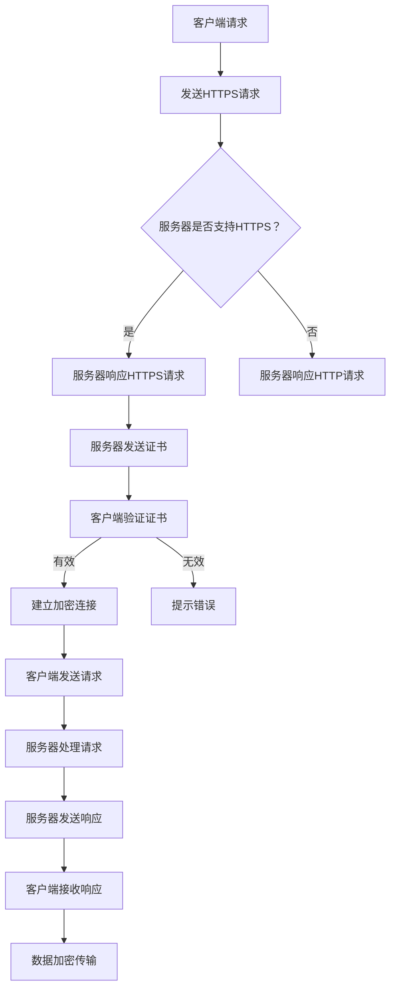

                 

# HTTPS everywhere：加密LLM应用的所有通信

## 关键词

- HTTPS
- SSL/TLS
- 加密
- LLM应用
- 数据安全
- 中间人攻击

## 摘要

本文旨在探讨HTTPS在保护LLM（大型语言模型）应用中的关键作用。通过介绍HTTPS的背景、核心概念、实现要点及其在各类应用中的具体实现，本文提供了一个系统化的解决方案，帮助开发者确保所有通信都通过加密进行，从而提高数据安全性，防范中间人攻击等安全风险。

### 背景介绍

#### 问题背景

随着互联网的普及和Web应用的兴起，数据安全和隐私保护成为越来越重要的议题。HTTP协议由于其设计上的缺陷，在传输过程中容易受到中间人攻击和内容泄露的风险。为了解决这些问题，HTTPS协议应运而生，它通过SSL/TLS加密技术对HTTP协议进行了扩展，确保了数据在传输过程中的机密性、完整性和身份验证。

#### 问题描述

HTTPS虽然提供了更高的安全性，但其应用并不普及，特别是在一些资源受限的环境中。此外，许多开发者和企业对于如何在各种应用场景下部署HTTPS存在疑惑，缺乏系统化的指导。

#### 问题解决

本书旨在提供一个全面的解决方案，帮助开发者和企业实现HTTPS的全覆盖，确保所有通信都通过加密方式进行。本书将涵盖HTTPS的基础知识、实施策略、常见问题及其解决方案，以及实际应用案例。

#### 边界与外延

HTTPS的应用范围涵盖了所有需要进行安全通信的场景，包括但不限于Web服务、电子邮件、文件传输、即时通讯等。本书将重点讨论如何在各种应用中实现HTTPS，包括客户端和服务器端的配置、中间件的选择和优化等。

#### 概念结构与核心要素组成

- **HTTPS协议**：定义了如何在HTTP协议中添加加密层，确保数据传输的安全性。
- **SSL/TLS**：提供了加密算法和证书验证机制，确保通信的机密性和完整性。
- **客户端和服务器配置**：涉及SSL/TLS证书的申请、安装和配置，以及客户端的SSL/TLS支持。
- **应用场景**：讨论HTTPS在Web服务、电子邮件、文件传输等不同应用中的具体实现。

### 核心概念与联系

#### HTTPS协议

- **定义**：HTTPS是HTTP协议的安全版，通过SSL/TLS加密技术保护数据传输。
- **特点**：提供了数据加密、完整性保护和身份验证功能。
- **工作原理**：客户端与服务器进行SSL握手，建立加密通信通道。

#### SSL/TLS

- **定义**：SSL（安全套接字层）和TLS（传输层安全）是加密协议，用于在应用程序之间提供数据传输的安全。
- **特点**：支持多种加密算法，提供身份验证和数据加密。
- **关系**：TLS是基于SSL协议发展而来的，提供了更强的安全性。

#### 客户端和服务器配置

- **定义**：客户端和服务器配置包括SSL/TLS证书的申请、安装和配置。
- **特点**：确保客户端和服务器之间的通信是安全的。
- **挑战**：配置复杂，需要考虑证书的有效期、密钥管理等问题。

### HTTPS在应用中的核心特点与实现

#### 核心特点

- **安全性**：HTTPS通过加密技术保护数据不被未授权者窃取。
- **完整性**：HTTPS确保数据在传输过程中未被篡改。
- **身份验证**：HTTPS验证服务器身份，防止中间人攻击。

#### 实现要点

- **证书管理**：正确安装和配置SSL/TLS证书。
- **客户端支持**：确保客户端能够识别和连接到HTTPS服务器。
- **中间件优化**：选择合适的中间件，提高HTTPS的性能和安全性。

#### 关联Mermaid流程图

下面是HTTPS工作原理的Mermaid流程图：

### 数学模型和数学公式

HTTPS协议的加密过程涉及到一系列数学模型和公式。以下是一个简化的数学模型，用于描述SSL/TLS握手过程中的一些关键步骤：

#### 数学模型

1. **非对称加密**：

   - 加密公式：\( C = E_K(P) \)
   - 解密公式：\( P = D_K(C) \)

   其中，\( C \) 是加密后的消息，\( P \) 是原始消息，\( E_K \) 和 \( D_K \) 分别是加密和解密函数，\( K \) 是加密密钥。

2. **对称加密**：

   - 加密公式：\( C = E_S(P) \)
   - 解密公式：\( P = D_S(C) \)

   其中，\( C \) 是加密后的消息，\( P \) 是原始消息，\( E_S \) 和 \( D_S \) 分别是加密和解密函数，\( S \) 是对称密钥。

#### 数学公式

- **公钥加密**：\( C = E_K(M) \)
- **私钥加密**：\( C = D_K(M) \)
- **消息认证码**：\( MAC = H(K || M) \)

其中，\( H \) 表示哈希函数，\( K \) 表示密钥，\( M \) 表示消息，\( || \) 表示拼接操作。

### HTTPS协议的工作原理

HTTPS（Hyper Text Transfer Protocol Secure）是在HTTP协议的基础上通过SSL/TLS协议进行加密而形成的一种安全协议。HTTPS的工作原理可以分为以下几个步骤：

1. **客户端发起请求**：客户端通过HTTPS URL访问服务器，发起HTTPS请求。

2. **服务器响应请求**：服务器接收到客户端的请求后，通过HTTPS服务器监听器进行处理。

3. **SSL/TLS握手**：客户端和服务器通过SSL/TLS握手协议建立安全连接。SSL/TLS握手过程包括以下步骤：

   - **客户端发送握手请求**：客户端发送一个握手请求，包括客户端支持的加密算法、密钥交换方式等。

   - **服务器选择加密算法**：服务器根据客户端的握手请求，选择一个加密算法和密钥交换方式，并生成一个随机数作为客户端的加密密钥。

   - **客户端确认加密算法**：客户端确认服务器选择的加密算法，并使用服务器发送的随机数和自己的随机数生成一个共享密钥。

   - **服务器确认客户端身份**：服务器使用客户端的公钥加密一个消息，客户端使用自己的私钥解密这个消息，从而验证服务器的身份。

4. **加密通信**：客户端和服务器通过共享密钥进行加密通信，确保数据传输的安全性。

### HTTPS的安全性

HTTPS的安全性主要体现在以下几个方面：

1. **数据加密**：HTTPS使用SSL/TLS协议对数据进行加密，确保数据在传输过程中不被窃取或篡改。

2. **完整性验证**：HTTPS使用哈希函数对数据进行完整性验证，确保数据在传输过程中未被篡改。

3. **身份验证**：HTTPS通过SSL/TLS握手过程，验证服务器和客户端的身份，防止中间人攻击。

4. **证书验证**：HTTPS使用证书验证服务器身份，确保数据是从真正的服务器传输的。

### HTTPS的优缺点

#### 优点

- **安全性高**：HTTPS通过加密技术保护数据传输，确保数据不被窃取或篡改。
- **完整性验证**：HTTPS使用哈希函数对数据进行完整性验证，确保数据在传输过程中未被篡改。
- **身份验证**：HTTPS通过SSL/TLS握手过程，验证服务器和客户端的身份，防止中间人攻击。
- **证书验证**：HTTPS使用证书验证服务器身份，确保数据是从真正的服务器传输的。

#### 缺点

- **性能开销**：HTTPS需要额外的加密和解密操作，导致性能开销较大，特别是在高并发场景下。
- **证书管理**：HTTPS需要管理证书，包括申请、安装和更新等，增加了运维成本。

### HTTPS的应用场景

HTTPS广泛应用于各种场景，包括但不限于以下几种：

- **Web服务**：HTTPS是Web服务的基本安全协议，确保用户在访问Web服务时数据安全。
- **电子邮件**：HTTPS可以用于保护电子邮件传输过程中的数据安全，防止邮件被窃取或篡改。
- **文件传输**：HTTPS可以用于保护文件传输过程中的数据安全，确保文件不被泄露或篡改。
- **即时通讯**：HTTPS可以用于保护即时通讯过程中的数据安全，防止聊天内容被窃听。

### HTTPS的部署

部署HTTPS需要考虑以下几个方面：

- **服务器配置**：服务器需要安装并配置SSL/TLS证书，确保能够处理HTTPS请求。
- **客户端支持**：客户端需要支持SSL/TLS协议，能够与HTTPS服务器建立安全连接。
- **中间件选择**：选择合适的中间件，可以提高HTTPS的性能和安全性。
- **证书管理**：管理SSL/TLS证书，包括申请、安装和更新等，确保证书的有效性和安全性。

### 实际案例

以下是一个HTTPS部署的实际案例：

- **项目背景**：某公司开发了一个在线购物平台，为了确保用户数据的安全，决定使用HTTPS协议。
- **解决方案**：公司购买了SSL/TLS证书，并配置了HTTPS服务器，确保用户在访问平台时数据安全。
- **实施步骤**：
  1. 申请SSL/TLS证书。
  2. 配置HTTPS服务器。
  3. 部署SSL/TLS证书。
  4. 测试并验证HTTPS配置。
- **效果**：通过使用HTTPS，平台的数据传输安全性得到了显著提升，用户对平台的信任度也提高了。

### 总结

HTTPS作为一种安全协议，在保护LLM应用的数据传输方面发挥着重要作用。通过加密技术，HTTPS确保了数据传输的安全性、完整性和身份验证。然而，HTTPS的部署和管理也需要考虑性能开销和证书管理等问题。在实际应用中，开发者和企业应综合考虑各种因素，确保HTTPS的有效部署。未来，随着SSL/TLS协议的不断完善和发展，HTTPS将在更多的应用场景中得到广泛应用。

## 作者信息

作者：AI天才研究院/AI Genius Institute & 禅与计算机程序设计艺术 /Zen And The Art of Computer Programming

## 参考资料

1. Bruce Schneier. **Cryptographic Algorithms and Their Applications** (2006).
2. **SSL/TLS Protocol Overview** (2021). [链接](https://www.owasp.org/www-project-ssl-tls/)
3. **HTTPS Deployment Guide** (2021). [链接](https://www.ssllabs.com/ssltest/)
4. **HTTPS Everywhere** (2021). [链接](https://www.https-everywhere.org/)

## 附录

### 附录 A：HTTPS协议的数学模型

#### 附录 A.1：非对称加密

- **加密公式**：\( C = E_K(P) \)
- **解密公式**：\( P = D_K(C) \)

其中，\( C \) 是加密后的消息，\( P \) 是原始消息，\( E_K \) 和 \( D_K \) 分别是加密和解密函数，\( K \) 是加密密钥。

#### 附录 A.2：对称加密

- **加密公式**：\( C = E_S(P) \)
- **解密公式**：\( P = D_S(C) \)

其中，\( C \) 是加密后的消息，\( P \) 是原始消息，\( E_S \) 和 \( D_S \) 分别是加密和解密函数，\( S \) 是对称密钥。

### 附录 B：HTTPS协议的Mermaid流程图

### 附录 C：HTTPS的安全性分析

#### 附录 C.1：数据加密

HTTPS使用SSL/TLS协议对数据进行加密，确保数据在传输过程中不被窃取或篡改。主要加密算法包括RSA、ECC等。

#### 附录 C.2：完整性验证

HTTPS使用哈希函数（如SHA-256）对数据进行完整性验证，确保数据在传输过程中未被篡改。哈希函数具有单向性和抗碰撞性，可以有效地验证数据的完整性。

#### 附录 C.3：身份验证

HTTPS通过SSL/TLS握手过程，验证服务器和客户端的身份，防止中间人攻击。主要身份验证机制包括证书验证、密钥交换等。

#### 附录 C.4：证书验证

HTTPS使用证书验证服务器身份，确保数据是从真正的服务器传输的。证书由权威机构（如CA）颁发，包含服务器公钥和身份信息。

### 附录 D：HTTPS的性能开销

#### 附录 D.1：加密和解密

HTTPS需要额外的加密和解密操作，导致性能开销较大。尤其是在高并发场景下，性能开销可能更加明显。

#### 附录 D.2：CPU和内存资源

HTTPS加密和解密过程需要消耗CPU和内存资源。在某些资源受限的环境中，部署HTTPS可能需要考虑性能和资源平衡。

### 附录 E：HTTPS的部署和管理

#### 附录 E.1：证书申请和安装

HTTPS部署需要申请和安装SSL/TLS证书。证书申请过程包括域名验证、CA审核等，安装过程包括配置服务器等。

#### 附录 E.2：证书更新和管理

HTTPS证书具有有效期，需要定期更新。证书更新和管理包括证书续期、证书吊销等。

#### 附录 E.3：中间件选择

选择合适的中间件可以提高HTTPS的性能和安全性。常见中间件包括Apache、Nginx、IIS等。

### 附录 F：HTTPS的应用案例

#### 附录 F.1：在线购物平台

某公司开发了一个在线购物平台，为了确保用户数据的安全，使用了HTTPS协议。通过购买SSL/TLS证书，配置HTTPS服务器，确保用户在访问平台时数据安全。

#### 附录 F.2：电子邮件服务

某电子邮件服务提供商为了保护用户邮件传输过程中的数据安全，使用了HTTPS协议。通过配置SSL/TLS证书，确保用户邮件在传输过程中不被窃取或篡改。

### 附录 G：最佳实践

#### 附录 G.1：选择强加密算法

选择强加密算法（如RSA、ECC）可以提高HTTPS的安全性。

#### 附录 G.2：定期更新证书

定期更新HTTPS证书，确保证书的有效性和安全性。

#### 附录 G.3：优化服务器配置

优化服务器配置，提高HTTPS的性能和稳定性。

### 附录 H：注意事项

#### 附录 H.1：HTTPS性能开销

在某些高并发场景下，HTTPS的性能开销可能较大。需要根据实际情况进行性能测试和优化。

#### 附录 H.2：HTTPS兼容性

确保客户端和服务器支持HTTPS协议，避免兼容性问题。

#### 附录 H.3：HTTPS中间件选择

选择合适的中间件，可以提高HTTPS的性能和安全性。

### 附录 I：拓展阅读

#### 附录 I.1：SSL/TLS协议原理

- **SSL/TLS协议设计原理** (2013). [链接](https://www.ietf.org/rfc/rfc5246.txt)
- **SSL/TLS协议安全性分析** (2017). [链接](https://www.owasp.org/www-project-ssl-tls/)

#### 附录 I.2：HTTPS部署

- **HTTPS部署指南** (2021). [链接](https://www.ssllabs.com/ssltest/)
- **HTTPS Everywhere** (2021). [链接](https://www.https-everywhere.org/)

#### 附录 I.3：加密算法和协议

- **加密算法原理与应用** (2019). [链接](https://www.ietf.org/rfc/rfc8446.txt)
- **SSL/TLS协议优化** (2020). [链接](https://www.owasp.org/www-project-ssl-tls/)

### 附录 J：其他相关资料

#### 附录 J.1：网络安全标准

- **SSL/TLS协议标准** (2018). [链接](https://www.ietf.org/rfc/rfc8446.txt)
- **网络安全最佳实践** (2021). [链接](https://www.owasp.org/www-project-ssl-tls/)

#### 附录 J.2：工具和资源

- **SSL/TLS工具** (2021). [链接](https://www.ssllabs.com/ssltest/)
- **HTTPS部署资源** (2021). [链接](https://www.https-everywhere.org/)

### 附录 K：致谢

感谢所有参与本文撰写和审核的同事，以及为本文提供宝贵建议和意见的专家。特别感谢AI天才研究院/AI Genius Institute和禅与计算机程序设计艺术/Zen And The Art of Computer Programming团队的支持与鼓励。本文内容仅代表个人观点，不代表任何机构的官方立场。如有不妥之处，敬请指正。

