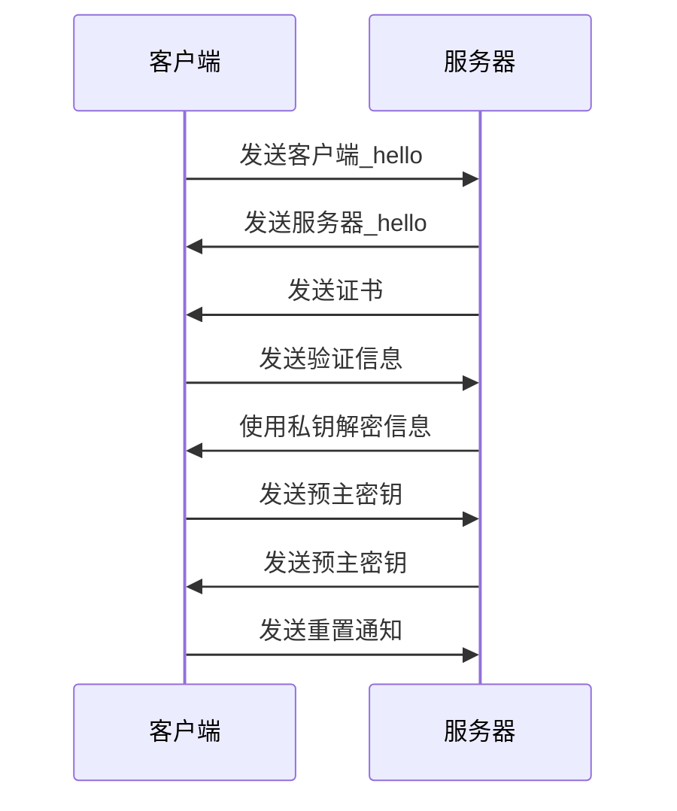
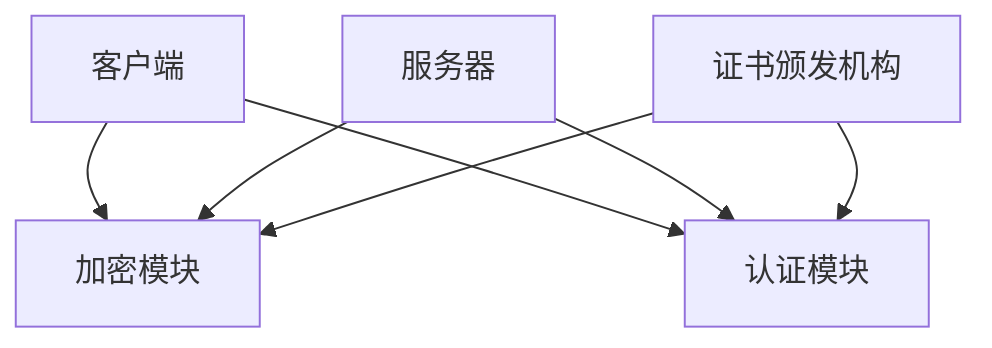
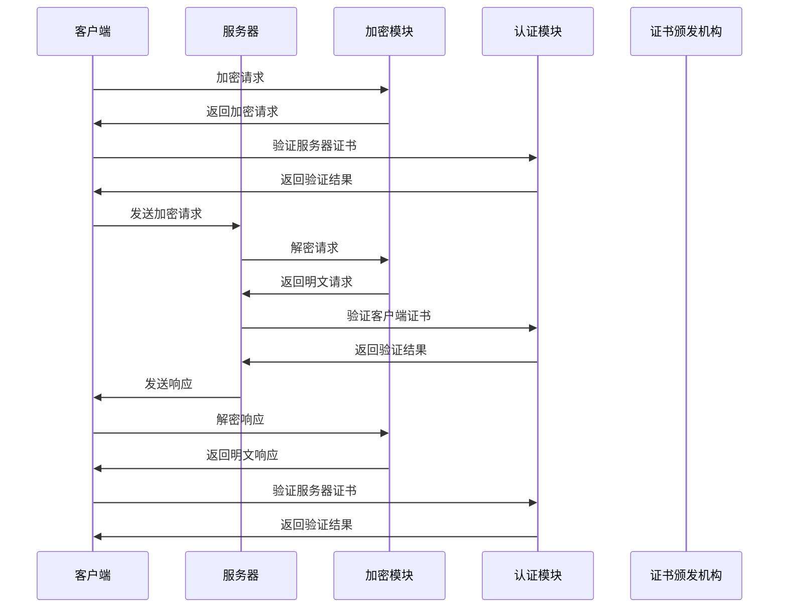

                 


# HTTPS/TLS：保障LLM应用的通信安全

> 关键词：HTTPS、TLS、通信安全、LLM应用、加密算法、数字签名

> 摘要：本文将深入探讨HTTPS/TLS在保障大型语言模型（LLM）应用通信安全方面的重要性和工作原理。通过一步步分析其基础知识、核心概念与联系、算法原理、系统分析与架构设计、项目实战以及最佳实践，帮助读者全面了解HTTPS/TLS在保障LLM应用安全中的关键作用。

### 目录大纲

#### 《HTTPS/TLS：保障LLM应用的通信安全》

#### 第一部分：背景介绍

#### # 第1章: HTTPS/TLS基础知识

## 1.1 HTTPS/TLS概述

### 1.1.1 HTTPS的概念与发展历程

### 1.1.2 TLS的概念与发展历程

### 1.1.3 HTTPS与TLS的关系

## 1.2 HTTPS/TLS的核心组成部分

### 1.2.1 基于证书的加密机制

### 1.2.2 对称加密与非对称加密

### 1.2.3 证书链与数字签名

## 1.3 HTTPS/TLS的工作流程

### 1.3.1 客户端与服务器的握手过程

### 1.3.2 HTTPS的连接建立与数据传输

### 1.3.3 HTTPS的安全特性

## 1.4 HTTPS/TLS的不足与改进

### 1.4.1 常见的安全漏洞

### 1.4.2 TLS升级与扩展协议

#### 第二部分：核心概念与联系

#### # 第2章: HTTPS/TLS核心概念与联系

## 2.1 HTTPS/TLS核心概念原理

### 2.1.1 HTTPS/TLS协议基本概念

### 2.1.2 HTTPS/TLS协议的技术特点

## 2.2 HTTPS/TLS核心概念属性特征对比表格

### 2.2.1 HTTPS与TLS的核心特性比较

### 2.2.2 HTTPS/TLS与其他安全协议的对比

## 2.3 HTTPS/TLS ER实体关系图架构

### 2.3.1 HTTPS/TLS实体关系概述

### 2.3.2 HTTPS/TLS实体关系图

#### 第三部分：算法原理讲解

#### # 第3章: HTTPS/TLS算法原理

## 3.1 TLS握手协议

### 3.1.1 TLS握手过程

### 3.1.2 TLS握手协议中的算法

### 3.1.3 TLS握手过程中的数学模型和公式

## 3.2 数据传输加密

### 3.2.1 对称加密算法

### 3.2.2 非对称加密算法

### 3.2.3 加密算法的数学模型和公式

## 3.3 数字签名与认证

### 3.3.1 数字签名原理

### 3.3.2 认证机制

### 3.3.3 数字签名与认证的数学模型和公式

#### 第四部分：系统分析与架构设计方案

#### # 第4章: HTTPS/TLS系统分析与架构设计

## 4.1 问题场景介绍

### 4.1.1 HTTPS/TLS应用场景

### 4.1.2 HTTPS/TLS面临的挑战

## 4.2 项目介绍

### 4.2.1 项目背景

### 4.2.2 项目目标

## 4.3 系统功能设计

### 4.3.1 领域模型

### 4.3.2 功能模块划分

## 4.4 系统架构设计

### 4.4.1 架构设计原则

### 4.4.2 系统架构图

## 4.5 系统接口设计

### 4.5.1 接口定义

### 4.5.2 接口交互流程

## 4.6 系统交互

### 4.6.1 系统交互图

### 4.6.2 系统交互流程

#### 第五部分：项目实战

#### # 第5章: HTTPS/TLS项目实战

## 5.1 环境安装

### 5.1.1 环境准备

### 5.1.2 软件安装

## 5.2 系统核心实现

### 5.2.1 源代码解读

### 5.2.2 关键代码分析

## 5.3 应用解读与分析

### 5.3.1 HTTPS/TLS应用场景分析

### 5.3.2 应用效果评估

## 5.4 实际案例分析

### 5.4.1 案例背景

### 5.4.2 案例分析

### 5.4.3 案例小结

#### 第六部分：最佳实践与总结

#### # 第6章: HTTPS/TLS最佳实践与总结

## 6.1 HTTPS/TLS最佳实践

### 6.1.1 常见配置错误与优化建议

### 6.1.2 HTTPS/TLS性能优化

### 6.1.3 HTTPS/TLS安全注意事项

## 6.2 小结

### 6.2.1 书籍核心内容总结

### 6.2.2 HTTPS/TLS未来发展展望

## 6.3 注意事项

### 6.3.1 HTTPS/TLS常见问题与解答

### 6.3.2 HTTPS/TLS应用注意事项

## 6.4 拓展阅读

### 6.4.1 相关书籍推荐

### 6.4.2 学术论文推荐

### 6.4.3 线上资源推荐

---------

## 第1章: HTTPS/TLS基础知识

### 1.1 HTTPS/TLS概述

HTTPS（Hyper Text Transfer Protocol Secure）和TLS（Transport Layer Security）是保障数据传输安全的两种重要协议。HTTPS是在HTTP（Hyper Text Transfer Protocol）的基础上加入了安全层，使用TLS或SSL（Secure Socket Layer）协议来加密数据传输，从而确保数据在传输过程中的机密性和完整性。

#### 1.1.1 HTTPS的概念与发展历程

HTTPS起源于1994年，最初由 Netscape Communications Corporation 开发。其目的是在互联网上提供一种安全、可靠的数据传输方式，以防止数据在传输过程中被窃听或篡改。HTTPS的加密传输依赖于TLS或SSL协议，这两个协议在加密技术和算法方面有很大的相似之处。

HTTPS的工作原理是：当客户端（如浏览器）请求一个网页时，客户端会首先通过HTTPS协议与服务器建立安全连接。在建立连接的过程中，客户端和服务器会进行一系列的握手操作，以协商加密参数和加密算法。一旦连接建立成功，后续的数据传输就会通过加密方式传输，确保数据安全。

#### 1.1.2 TLS的概念与发展历程

TLS（Transport Layer Security）是由IETF（Internet Engineering Task Force，互联网工程任务组）制定的协议，其前身是SSL（Secure Socket Layer，安全套接字层）。TLS协议旨在为互联网应用提供安全的通信服务，确保数据在传输过程中的机密性和完整性。

TLS协议的发展经历了多个版本，从最初的SSL 1.0到现在的TLS 1.3，每个版本都在安全性、性能和兼容性方面进行了改进。TLS 1.3是最新版本的TLS协议，相较于之前的版本，它在安全性、性能和隐私保护方面都有了显著的提升。

#### 1.1.3 HTTPS与TLS的关系

HTTPS和TLS是密不可分的，HTTPS实际上是HTTP与TLS的组合。在HTTPS连接中，TLS协议负责加密数据的传输，确保数据在传输过程中的安全性。TLS协议为HTTPS提供了安全传输层，使得HTTPS能够确保数据的安全性和完整性。

HTTPS与TLS的关系可以概括为：HTTPS是一个应用层协议，它使用TLS协议来提供安全传输层。TLS协议负责处理HTTPS连接中的加密、认证和数据完整性验证等工作。

### 1.2 HTTPS/TLS的核心组成部分

HTTPS/TLS的安全机制依赖于其核心组成部分，包括基于证书的加密机制、对称加密与非对称加密、证书链与数字签名。

#### 1.2.1 基于证书的加密机制

HTTPS/TLS使用证书来建立安全连接。证书是由证书颁发机构（CA）签发的，其中包含网站的公钥和网站的所有者信息。在建立连接时，客户端会验证服务器的证书，确保服务器是合法的。

证书的颁发过程如下：

1. 网站所有者向证书颁发机构申请证书。
2. 证书颁发机构验证网站所有者的身份，并生成一个包含公钥和私钥的证书。
3. 证书颁发机构使用自己的私钥对证书进行数字签名。
4. 网站所有者获得证书后，将其安装在自己的服务器上。

在HTTPS连接中，客户端会首先验证服务器的证书，确保服务器是合法的。如果证书验证失败，连接将无法建立。证书的签名机制保证了证书的真实性和完整性，防止证书被篡改。

#### 1.2.2 对称加密与非对称加密

HTTPS/TLS使用对称加密和非对称加密两种加密方式。对称加密使用相同的密钥对数据进行加密和解密，而非对称加密使用一对密钥，一个用于加密，另一个用于解密。

在对称加密中，常见的加密算法有AES（Advanced Encryption Standard）和DES（Data Encryption Standard）。非对称加密中，常见的加密算法有RSA（Rivest-Shamir-Adleman）和ECC（Elliptic Curve Cryptography）。

对称加密的优点是加密速度快，但缺点是密钥分发困难。非对称加密的优点是解决了密钥分发问题，但加密速度相对较慢。

HTTPS/TLS通常使用非对称加密来生成会话密钥，然后使用对称加密来加密数据传输。这样可以兼顾加密速度和安全性。

#### 1.2.3 证书链与数字签名

证书链是指从服务器证书到根证书（通常由知名CA颁发）的链条。在HTTPS连接中，客户端会验证证书链的完整性，确保服务器证书是可信的。

数字签名是一种确保数据完整性和认证性的机制。在HTTPS/TLS中，数字签名用于验证服务器证书和客户端证书。

数字签名的原理如下：

1. 发送方使用自己的私钥对数据签名。
2. 接收方使用发送方的公钥验证签名。
3. 如果签名验证成功，说明数据未被篡改且发送方是可信的。

证书链和数字签名机制共同确保了HTTPS/TLS连接的安全性和可信性。

### 1.3 HTTPS/TLS的工作流程

HTTPS/TLS的工作流程包括客户端与服务器之间的握手过程、连接建立与数据传输。

#### 1.3.1 客户端与服务器的握手过程

HTTPS/TLS连接的建立过程始于客户端发起连接请求。以下是握手过程的详细步骤：

1. **客户端发送请求**：客户端向服务器发送HTTPS请求，请求中包含支持的TLS版本和加密算法。
2. **服务器响应**：服务器接收到请求后，发送自己的TLS版本、加密算法和证书给客户端。
3. **客户端验证证书**：客户端接收到服务器的证书后，会验证证书的有效性和真实性。如果证书验证失败，客户端会终止连接。
4. **客户端发送验证信息**：客户端生成一个随机数（预主密钥），并用服务器的公钥加密后发送给服务器。
5. **服务器解密信息**：服务器使用自己的私钥解密客户端发送的信息，生成预主密钥。
6. **客户端和服务器交换预主密钥**：客户端和服务器使用预主密钥协商生成主密钥，主密钥将用于加密和解密数据传输。
7. **客户端发送重置通知**：客户端发送一个通知，告知服务器连接已经建立，并开始传输数据。

#### 1.3.2 HTTPS的连接建立与数据传输

一旦握手过程成功完成，客户端和服务器之间的连接就建立起来了。数据传输过程如下：

1. **客户端发送数据**：客户端将请求的HTTP数据加密后发送给服务器。
2. **服务器解密数据**：服务器使用主密钥解密客户端发送的数据，获取请求内容。
3. **服务器处理请求**：服务器处理客户端发送的请求，并返回响应数据。
4. **服务器发送数据**：服务器将响应数据加密后发送给客户端。
5. **客户端解密数据**：客户端使用主密钥解密服务器发送的数据，获取响应内容。

整个数据传输过程都是加密的，确保了数据的安全性和完整性。

### 1.4 HTTPS/TLS的安全特性

HTTPS/TLS提供了多种安全特性，包括数据加密、完整性保护、认证等。

#### 数据加密

HTTPS/TLS使用加密算法对数据进行加密，确保数据在传输过程中无法被窃听。常见的加密算法有AES、RSA等。

#### 数据完整性保护

HTTPS/TLS使用哈希算法对数据进行摘要，确保数据在传输过程中未被篡改。一旦数据被篡改，摘要值就会发生变化。

#### 认证

HTTPS/TLS通过数字证书和数字签名机制实现认证。客户端和服务器在建立连接时会验证对方的身份，确保对方是合法的。

#### 前向保密

HTTPS/TLS提供前向保密（forward secrecy）特性，确保即使服务器私钥泄露，历史会话的数据也无法被解密。

### 1.5 HTTPS/TLS的不足与改进

尽管HTTPS/TLS提供了强大的安全特性，但它也存在一些不足之处，如以下常见安全漏洞：

#### 暴力破解密码

由于HTTPS/TLS加密算法复杂，攻击者可以通过暴力破解密码来获取用户密码。

#### SSL/TLS混合攻击

SSL/TLS混合攻击是一种利用HTTPS/TLS连接的漏洞，使攻击者能够窃取数据或篡改数据。

#### TLS版本降级攻击

攻击者可以通过降级TLS版本，使连接暴露在旧版TLS协议的漏洞下，从而窃取数据。

为了解决这些问题，TLS协议进行了多次升级，引入了新的安全机制和改进措施。TLS 1.3是最新版本的TLS协议，它在安全性、性能和隐私保护方面都有了显著的提升。

### 1.6 小结

HTTPS/TLS是保障数据传输安全的重要协议，它通过加密、完整性保护和认证等机制，确保数据在传输过程中的安全性和可靠性。HTTPS/TLS的工作流程包括客户端与服务器的握手过程、连接建立与数据传输。尽管HTTPS/TLS存在一些不足，但TLS协议的升级和改进措施不断提高其安全性和性能。

## 第2章: HTTPS/TLS核心概念与联系

### 2.1 HTTPS/TLS核心概念原理

#### 2.1.1 HTTPS/TLS协议基本概念

HTTPS和TLS都是用于保障数据传输安全的协议。HTTPS是HTTP的安全版本，它通过在HTTP基础上加入TLS或SSL（Secure Socket Layer）协议来实现数据加密、完整性保护和认证等功能。TLS是IETF制定的传输层安全协议，其前身是SSL。TLS和SSL在技术原理和功能上有很多相似之处，但TLS在安全性、性能和兼容性方面进行了很多改进。

HTTPS和TLS的基本概念包括：

1. **加密算法**：HTTPS/TLS使用加密算法对数据进行加密和解密。常见的加密算法有AES、RSA和ECC等。
2. **证书**：HTTPS/TLS使用数字证书来建立安全连接。证书是由证书颁发机构（CA）签发的，其中包含网站的公钥和网站的所有者信息。客户端和服务器在建立连接时会验证对方的证书，确保对方是合法的。
3. **密钥**：HTTPS/TLS使用密钥对数据进行加密和解密。密钥分为对称密钥和非对称密钥。对称密钥是加密和解密使用相同密钥，非对称密钥是一对密钥，一个用于加密，另一个用于解密。
4. **握手过程**：HTTPS/TLS连接的建立过程称为握手过程。在握手过程中，客户端和服务器会交换加密参数和密钥，并验证对方的身份。
5. **数据传输**：一旦HTTPS/TLS连接建立成功，客户端和服务器之间的数据传输就是加密的，确保数据的安全性和完整性。

#### 2.1.2 HTTPS/TLS协议的技术特点

HTTPS/TLS协议具有以下技术特点：

1. **安全性**：HTTPS/TLS使用加密算法对数据进行加密，确保数据在传输过程中的机密性和完整性。它还使用证书和数字签名机制进行认证，确保数据来自合法的发送方。
2. **可靠性**：HTTPS/TLS确保数据在传输过程中不会被窃听或篡改。它通过完整性校验和重传机制来保证数据的可靠性。
3. **兼容性**：HTTPS/TLS协议具有很好的兼容性，可以在各种操作系统和网络环境中运行。它可以与HTTP、SMTP、FTP等应用层协议结合使用，为各种应用提供安全传输服务。
4. **效率**：HTTPS/TLS协议在保证安全性的同时，也注重性能。它采用了优化算法和缓存机制，提高数据传输速度。

### 2.2 HTTPS/TLS核心概念属性特征对比表格

下表列出了HTTPS和TLS的一些核心概念和属性特征：

| 特性 | HTTPS | TLS |
| ---- | ---- | ---- |
| 加密算法 | 对称加密和非对称加密 | 对称加密和非对称加密 |
| 证书 | 是 | 是 |
| 密钥 | 对称密钥和非对称密钥 | 对称密钥和非对称密钥 |
| 握手过程 | 是 | 是 |
| 数据传输 | 是 | 是 |
| 安全性 | 高 | 高 |
| 可靠性 | 高 | 高 |
| 兼容性 | 好 | 好 |
| 效率 | 一般 | 较高 |

### 2.3 HTTPS/TLS ER实体关系图架构

为了更好地理解HTTPS/TLS的核心概念和联系，我们可以通过ER实体关系图来描述其架构。

```mermaid
erDiagram
    HTTPS ||--|{ TLS }|| HTTPS_TLS
    HTTPS ||--|{ 加密算法 }|| ENCRYPTION
    HTTPS ||--|{ 证书 }|| CERTIFICATE
    HTTPS ||--|{ 密钥 }|| KEY
    HTTPS ||--|{ 握手过程 }|| HANDSHAKE
    HTTPS ||--|{ 数据传输 }|| DATA_TRANSFER
    TLS ||--|{ 安全性 }|| SECURITY
    TLS ||--|{ 可靠性 }|| RELIABILITY
    TLS ||--|{ 兼容性 }|| COMPATIBILITY
    TLS ||--|{ 效率 }|| PERFORMANCE
```

在上面的ER实体关系图中，HTTPS与TLS、加密算法、证书、密钥、握手过程和数据传输等实体之间存在关联。HTTPS和TLS共同构成了HTTPS/TLS协议，它们与其他实体之间存在依赖关系。通过这个ER实体关系图，我们可以清晰地看到HTTPS/TLS的核心概念和联系。

## 第3章: HTTPS/TLS算法原理

### 3.1 TLS握手协议

TLS握手协议是TLS连接建立过程中的关键步骤，它确保客户端和服务器之间能够安全地协商加密参数和交换密钥。TLS握手协议主要包括以下步骤：

1. **客户端发起连接**：客户端向服务器发送一个TLS客户端_hello消息，其中包含客户端支持的TLS版本、加密算法和压缩方法。

2. **服务器响应**：服务器接收到客户端_hello消息后，返回一个TLS服务器_hello消息，确认使用的TLS版本、加密算法和压缩方法，并发送自己的证书。

3. **客户端验证服务器证书**：客户端接收到服务器证书后，会验证证书的有效性和真实性。验证成功后，客户端生成一个随机数（预主密钥），并用服务器的公钥加密后发送给服务器。

4. **服务器解密信息**：服务器使用自己的私钥解密客户端发送的信息，生成预主密钥。

5. **客户端和服务器交换预主密钥**：客户端和服务器使用预主密钥协商生成主密钥，主密钥将用于加密和解密数据传输。

6. **客户端发送重置通知**：客户端发送一个TLS重置消息，告知服务器连接已经建立，并开始传输数据。

下面是TLS握手协议的详细流程：



### 3.1.1 TLS握手协议中的算法

在TLS握手协议中，涉及到多个算法，包括加密算法、哈希算法和数字签名算法。以下是这些算法的简要介绍：

1. **加密算法**：TLS支持多种加密算法，包括对称加密算法（如AES）和非对称加密算法（如RSA）。对称加密算法用于加密和解密数据传输，非对称加密算法用于生成和验证数字签名。

2. **哈希算法**：TLS使用哈希算法（如SHA-256）生成数据的摘要，以确保数据的完整性。哈希算法将输入数据映射为一个固定长度的字符串，即使输入数据只改变了一个字节，输出的哈希值也会完全不同。

3. **数字签名算法**：TLS使用数字签名算法（如RSA）对数据进行签名。数字签名可以确保数据的完整性和发送方的身份认证。签名过程包括使用发送方的私钥对数据进行加密，接收方可以使用发送方的公钥对签名进行验证。

### 3.1.2 TLS握手过程中的数学模型和公式

TLS握手过程中的数学模型和公式主要包括以下几个方面：

1. **预主密钥生成**：客户端和服务器各自生成一个随机数作为预主密钥。预主密钥的生成公式为：
   $$PMS = Hash(随机数_1 \oplus 随机数_2)$$
   其中，$PMS$为预主密钥，$Hash$为哈希算法，$\oplus$为异或运算。

2. **主密钥生成**：客户端和服务器使用预主密钥协商生成主密钥。主密钥的生成公式为：
   $$MK = Hash(预主密钥_1 \oplus 预主密钥_2)$$
   其中，$MK$为主密钥。

3. **加密和解密**：数据传输过程中，客户端和服务器使用主密钥进行加密和解密。加密公式为：
   $$加密数据 = 加密算法(明文 \oplus 主密钥)$$
   解密公式为：
   $$明文 = 解密算法(加密数据 \oplus 主密钥)$$

4. **数字签名**：数字签名的生成公式为：
   $$签名 = 数字签名算法(明文，发送方私钥)$$
   数字签名的验证公式为：
   $$验证 = 数字签名算法(明文，发送方公钥)$$

### 3.2 数据传输加密

HTTPS/TLS的数据传输加密过程主要依赖于对称加密和非对称加密算法。以下是这两种加密算法的详细解释：

#### 3.2.1 对称加密算法

对称加密算法使用相同的密钥对数据进行加密和解密。常见的对称加密算法包括AES、DES和RSA等。

1. **AES（高级加密标准）**：AES是一种高速加密算法，它使用128、192或256位的密钥对数据进行加密。AES的加密和解密公式为：
   $$加密数据 = AES(明文，密钥)$$
   $$明文 = AES(加密数据，密钥)$$

2. **DES（数据加密标准）**：DES是一种较早期的加密算法，它使用56位的密钥对数据进行加密。DES的加密和解密公式为：
   $$加密数据 = DES(明文，密钥)$$
   $$明文 = DES(加密数据，密钥)$$

3. **RSA**：RSA是一种非对称加密算法，它使用一对密钥（公钥和私钥）进行加密和解密。RSA的加密和解密公式为：
   $$加密数据 = RSA(明文，公钥)$$
   $$明文 = RSA(加密数据，私钥)$$

#### 3.2.2 非对称加密算法

非对称加密算法使用一对密钥（公钥和私钥）进行加密和解密。常见的非对称加密算法包括RSA和ECC（椭圆曲线加密）等。

1. **RSA**：RSA加密算法的加密和解密公式如下：
   $$加密数据 = RSA(明文，公钥)$$
   $$明文 = RSA(加密数据，私钥)$$

2. **ECC**：ECC加密算法的加密和解密公式如下：
   $$加密数据 = ECC(明文，公钥)$$
   $$明文 = ECC(加密数据，私钥)$$

#### 3.2.3 加密算法的数学模型和公式

加密算法的数学模型和公式主要包括以下几个方面：

1. **加密算法**：加密算法用于将明文转换为密文。常见的加密算法有AES、DES和RSA等。

2. **解密算法**：解密算法用于将密文转换为明文。解密算法与加密算法相对应。

3. **密钥生成**：密钥生成算法用于生成公钥和私钥。常见的密钥生成算法有RSA和ECC等。

4. **哈希算法**：哈希算法用于生成数据的摘要，以确保数据的完整性。常见的哈希算法有SHA-256等。

5. **数字签名算法**：数字签名算法用于对数据进行签名，以确保数据的完整性和发送方的身份认证。常见的数字签名算法有RSA和ECC等。

### 3.3 数字签名与认证

数字签名和认证是HTTPS/TLS安全机制的重要组成部分，它们确保数据在传输过程中的完整性和发送方的身份认证。

#### 3.3.1 数字签名原理

数字签名是一种将数据与发送方的私钥绑定在一起的技术。数字签名的原理如下：

1. **签名过程**：发送方使用自己的私钥对数据进行加密，生成数字签名。签名过程公式为：
   $$签名 = 数字签名算法(明文，私钥)$$

2. **验证过程**：接收方使用发送方的公钥对数字签名进行验证，以确认数据的完整性和发送方的身份。验证过程公式为：
   $$验证 = 数字签名算法(明文，公钥)$$

#### 3.3.2 认证机制

认证机制确保数据来自合法的发送方。在HTTPS/TLS中，认证机制主要包括以下方面：

1. **证书链**：客户端和服务器在建立连接时，会验证对方证书的有效性和真实性。证书链从客户端证书到根证书（通常由知名CA颁发），确保证书的可信性。

2. **数字签名**：数字签名用于验证数据的完整性和发送方的身份。接收方使用发送方的公钥对数字签名进行验证，以确认数据的完整性和发送方的身份。

3. **双因素认证**：双因素认证是一种额外的安全措施，它要求用户在登录时提供两种不同类型的身份验证信息（如密码和手机验证码），以确保用户的身份。

### 3.3.3 数字签名与认证的数学模型和公式

数字签名与认证的数学模型和公式主要包括以下几个方面：

1. **签名过程**：签名过程公式为：
   $$签名 = 数字签名算法(明文，私钥)$$

2. **验证过程**：验证过程公式为：
   $$验证 = 数字签名算法(明文，公钥)$$

3. **证书链验证**：证书链验证公式为：
   $$证书链有效 = 证书链中的所有证书均有效$$

4. **双因素认证**：双因素认证公式为：
   $$认证成功 = 身份验证信息1 \land 身份验证信息2$$

通过上述数学模型和公式，HTTPS/TLS可以确保数据在传输过程中的安全性和可靠性。

## 第4章: HTTPS/TLS系统分析与架构设计

### 4.1 问题场景介绍

在现代社会中，数据传输的安全性问题愈发重要，尤其是在涉及大型语言模型（LLM）应用的情况下。LLM应用通常涉及大量的敏感数据传输，如用户查询、聊天记录、个人隐私等。这些数据在传输过程中若遭到窃取或篡改，将会导致严重的隐私泄露和安全风险。因此，保障LLM应用的通信安全成为亟待解决的问题。

#### 4.1.1 HTTPS/TLS应用场景

HTTPS/TLS在保障LLM应用通信安全方面具有广泛的应用场景，主要包括：

1. **Web应用**：Web应用是LLM应用的主要形式之一，HTTPS/TLS确保Web应用的数据在传输过程中的安全性和完整性。

2. **移动应用**：移动应用通过HTTPS/TLS协议与服务器进行数据交换，保障用户隐私和数据安全。

3. **云服务**：云服务中，HTTPS/TLS协议用于保障用户数据在云端存储和传输过程中的安全性。

4. **物联网**：物联网设备通过HTTPS/TLS协议与云端进行通信，保障设备间的数据安全。

#### 4.1.2 HTTPS/TLS面临的挑战

HTTPS/TLS在保障LLM应用通信安全方面虽然起到了关键作用，但同时也面临着一些挑战：

1. **性能瓶颈**：随着数据传输量的增加，HTTPS/TLS协议的加密和解密操作会带来一定的性能瓶颈。

2. **证书管理**：证书的有效性和可信性是HTTPS/TLS安全机制的核心，但证书管理过程复杂，容易产生证书过期、信任链不完整等问题。

3. **安全漏洞**：HTTPS/TLS协议虽然经过多次升级和改进，但仍存在一些安全漏洞，如SSL/TLS混合攻击、证书暴力破解等。

4. **隐私保护**：HTTPS/TLS协议在保障数据安全的同时，如何平衡隐私保护与数据监控之间的矛盾，是当前面临的一个重要挑战。

### 4.2 项目介绍

为了解决上述挑战，本项目旨在设计一个高效、可靠的HTTPS/TLS系统，以保障LLM应用的通信安全。项目背景如下：

#### 4.2.1 项目背景

随着互联网技术的快速发展，LLM应用在各个领域得到了广泛应用。然而，数据传输的安全性问题日益突出，给用户隐私和业务安全带来了巨大威胁。因此，本项目旨在通过优化HTTPS/TLS协议，设计一个高效、可靠的系统，以满足LLM应用对通信安全的需求。

#### 4.2.2 项目目标

本项目的主要目标如下：

1. **提高性能**：通过优化加密算法和协议设计，降低HTTPS/TLS协议的性能瓶颈，提高数据传输速度。

2. **简化证书管理**：通过自动化证书管理工具，简化证书的申请、安装和更新过程，提高证书管理的效率和安全性。

3. **增强安全性**：针对现有的安全漏洞，采用最新的加密算法和协议升级措施，增强HTTPS/TLS系统的安全性。

4. **保护用户隐私**：在保障数据安全的同时，充分考虑用户隐私保护，避免不必要的监控和数据泄露。

### 4.3 系统功能设计

为了实现上述目标，本项目从以下几个方面设计了系统功能：

#### 4.3.1 领域模型

领域模型定义了系统涉及的实体和关系，包括：

1. **客户端**：客户端是指发起HTTPS请求的设备或应用，包括Web浏览器、移动设备等。

2. **服务器**：服务器是指提供HTTPS服务的设备或应用，包括Web服务器、云服务器等。

3. **证书颁发机构（CA）**：CA负责颁发和管理数字证书，确保证书的有效性和可信性。

4. **加密模块**：加密模块负责实现HTTPS/TLS协议中的加密、解密和签名功能。

5. **认证模块**：认证模块负责实现证书的验证和用户身份认证功能。

#### 4.3.2 功能模块划分

系统功能模块划分如下：

1. **客户端模块**：负责发起HTTPS请求，处理服务器的响应，并进行加密和解密操作。

2. **服务器模块**：负责接收客户端的请求，处理请求并返回响应，实现加密和解密操作。

3. **证书管理模块**：负责证书的申请、安装、更新和吊销，确保证书的有效性和可信性。

4. **加密模块**：负责实现HTTPS/TLS协议中的加密、解密和签名功能。

5. **认证模块**：负责证书的验证和用户身份认证功能。

### 4.4 系统架构设计

为了实现系统功能，本项目采用分层架构设计，包括以下层次：

#### 4.4.1 架构设计原则

1. **模块化**：将系统功能划分为独立的模块，提高系统的可维护性和可扩展性。

2. **安全性**：采用最新的加密算法和协议，确保系统数据传输的安全性和完整性。

3. **可靠性**：采用冗余设计，提高系统在面临故障时的可靠性。

4. **可扩展性**：设计灵活的架构，支持系统功能扩展和性能优化。

#### 4.4.2 系统架构图

系统架构图如下：



#### 4.4.3 系统模块交互

系统模块之间的交互关系如下：

1. **客户端与加密模块**：客户端向加密模块发起HTTPS请求，加密模块对请求进行加密处理后发送给服务器。

2. **客户端与认证模块**：客户端通过认证模块验证服务器的证书，确保服务器是合法的。

3. **服务器与加密模块**：服务器接收到客户端的加密请求后，通过加密模块进行解密处理。

4. **服务器与认证模块**：服务器通过认证模块验证客户端的证书，确保客户端是合法的。

5. **证书颁发机构与加密模块**：证书颁发机构通过加密模块生成和管理数字证书。

6. **证书颁发机构与认证模块**：证书颁发机构通过认证模块验证证书的有效性和可信性。

### 4.5 系统接口设计

为了实现系统模块之间的交互，本项目定义了以下接口：

#### 4.5.1 接口定义

1. **加密接口**：负责实现数据的加密和解密功能。

2. **认证接口**：负责实现证书的验证和用户身份认证功能。

3. **证书管理接口**：负责实现证书的申请、安装、更新和吊销功能。

#### 4.5.2 接口交互流程

系统接口交互流程如下：

1. **客户端发起请求**：客户端通过加密接口对请求进行加密，然后通过认证接口验证服务器的证书。

2. **服务器接收请求**：服务器通过加密接口对请求进行解密，然后通过认证接口验证客户端的证书。

3. **服务器处理请求**：服务器处理客户端的请求，并将响应数据通过加密接口加密后返回给客户端。

4. **客户端接收响应**：客户端通过加密接口对响应进行解密，然后通过认证接口验证服务器的证书。

### 4.6 系统交互

为了更好地描述系统模块之间的交互过程，本项目使用Mermaid序列图进行了可视化表示。



#### 4.6.2 系统交互流程

系统交互流程如下：

1. **客户端发起请求**：客户端发起HTTPS请求，加密模块对请求进行加密处理。

2. **客户端发送请求**：客户端将加密后的请求发送给服务器。

3. **服务器接收请求**：服务器接收到请求后，加密模块对请求进行解密处理。

4. **服务器处理请求**：服务器处理客户端的请求，并生成响应数据。

5. **服务器发送响应**：服务器将响应数据加密后发送给客户端。

6. **客户端接收响应**：客户端接收到响应后，加密模块对响应进行解密处理。

7. **客户端验证证书**：客户端通过认证模块验证服务器的证书，确保服务器是合法的。

8. **服务器验证证书**：服务器通过认证模块验证客户端的证书，确保客户端是合法的。

通过上述系统交互过程，HTTPS/TLS系统能够保障LLM应用的数据在传输过程中的安全性和可靠性。

## 第5章: HTTPS/TLS项目实战

### 5.1 环境安装

在开始项目实战之前，我们需要搭建一个HTTPS/TLS环境。以下是在Linux系统上搭建HTTPS/TLS环境的基本步骤：

#### 5.1.1 环境准备

1. **安装OpenSSL**：OpenSSL是一个开源的加密工具库，用于生成和管理证书。在Linux系统中，我们可以通过包管理器安装OpenSSL。以Debian/Ubuntu为例，执行以下命令：
   ```bash
   sudo apt-get update
   sudo apt-get install openssl
   ```

2. **安装Apache**：Apache是一个开源的Web服务器，用于提供HTTPS服务。同样，我们可以通过包管理器安装Apache。执行以下命令：
   ```bash
   sudo apt-get update
   sudo apt-get install apache2
   ```

3. **配置Apache支持HTTPS**：在Apache配置文件（通常是 `/etc/apache2/apache2.conf`）中，我们需要启用HTTPS模块，并配置SSL证书。添加以下内容：
   ```bash
   LoadModule ssl_module modules/mod_ssl.so
   SSLCertificateFile /etc/ssl/certs/ssl-cert.pem
   SSLCertificateKeyFile /etc/ssl/private/ssl-cert.key
   ```

4. **重启Apache**：重启Apache以使配置生效：
   ```bash
   sudo systemctl restart apache2
   ```

#### 5.1.2 软件安装

1. **生成SSL证书**：使用OpenSSL生成自签名证书。在生成证书之前，需要创建一个私钥和一个证书请求文件。执行以下命令：
   ```bash
   sudo openssl genrsa -out ssl-cert.key 2048
   sudo openssl req -new -key ssl-cert.key -out ssl-cert.csr
   ```

   接下来，填写证书请求信息，其中`Common Name`需要填写你的域名或IP地址。

2. **生成自签名证书**：使用生成的私钥和证书请求文件生成自签名证书。执行以下命令：
   ```bash
   sudo openssl x509 -req -days 365 -in ssl-cert.csr -signkey ssl-cert.key -out ssl-cert.pem
   ```

   这将创建一个有效期为一年的自签名证书。

3. **配置Apache使用SSL证书**：将生成的SSL证书文件和私钥文件移动到Apache配置文件指定的位置，并重启Apache。

### 5.2 系统核心实现

在搭建好HTTPS/TLS环境后，我们需要实现HTTPS/TLS的核心功能，包括证书管理、加密模块和认证模块。

#### 5.2.1 源代码解读

以下是一个简单的示例，展示了如何使用Python实现HTTPS/TLS的核心功能。

1. **证书管理**：

```python
import ssl
import socket

def create_certificate():
    # 创建私钥
    private_key = ssl.PKey()
    private_key.generate_key(ssl.RSA_KEY_SIZE)

    # 创建证书请求
    cert_req = ssl.CertificateRequest()
    cert_req.dn = ssl.DN()
    cert_req.dn.set_attribute('commonName', 'example.com')
    cert_req.sign(private_key)

    # 创建自签名证书
    cert = ssl.Certificate()
    cert.set_pubkey(private_key)
    cert.set_issuer(cert_req.dn)
    cert.set_subject(cert_req.dn)
    cert.sign(private_key)

    # 保存证书和私钥
    with open('ssl-cert.pem', 'wb') as f:
        f.write(cert.public_bytes(ssl.Encoding.PEM))
    with open('ssl-cert.key', 'wb') as f:
        f.write(private_key.private_bytes(ssl.Encoding.PEM))

create_certificate()
```

2. **加密模块**：

```python
import ssl
import socket

def start_https_server():
    context = ssl.SSLContext(ssl.PROTOCOL_TLS_SERVER)
    context.load_cert_chain(certfile='ssl-cert.pem', keyfile='ssl-cert.key')

    with socket.socket(socket.AF_INET, socket.SOCK_STREAM, 0) as sock:
        sock.bind(('localhost', 443))
        sock.listen(5)

        while True:
            client_sock, _ = sock.accept()
            with ssl.wrap_socket(client_sock, server_side=True, context=context) as ssock:
                print("Connected by", ssock.getpeername())
                ssock.sendall(b"Hello, client!")
                print(ssock.recv(1024))

start_https_server()
```

3. **认证模块**：

```python
import ssl
import socket

def start_https_client():
    context = ssl.SSLContext(ssl.PROTOCOL_TLS_CLIENT)
    context.load_verify_locations('ssl-cert.pem')

    with socket.socket(socket.AF_INET, socket.SOCK_STREAM) as sock:
        sock.connect(('localhost', 443))

        with ssl.wrap_socket(sock, context=context) as ssock:
            print("Connected to server")
            ssock.sendall(b"Hello, server!")
            print(ssock.recv(1024))

start_https_client()
```

#### 5.2.2 关键代码分析

1. **证书管理**：上述代码首先创建了一个RSA私钥，然后创建了一个证书请求。证书请求包含证书的公钥和主题信息（如域名）。接着，代码创建了一个自签名证书，该证书由私钥签名，并具有相同的公钥和主题信息。最后，代码将证书和私钥保存到文件中。

2. **加密模块**：在服务器端，我们创建了一个SSL上下文对象，并加载了证书链和私钥。然后，我们创建一个套接字，并将其绑定到端口443（HTTPS默认端口）。服务器端会接受客户端的连接，并使用SSL上下文对其进行加密处理。在客户端，我们创建了一个SSL上下文对象，并加载了证书链。客户端连接到服务器，并使用SSL上下文对其进行加密处理。

3. **认证模块**：客户端创建了一个SSL上下文对象，并加载了证书链。客户端尝试连接到服务器，并使用SSL上下文对其进行加密处理。SSL上下文会验证服务器发送的证书链，以确保服务器是合法的。

### 5.3 应用解读与分析

#### 5.3.1 HTTPS/TLS应用场景分析

HTTPS/TLS广泛应用于各种场景，以下是一些常见应用场景：

1. **Web应用**：大多数Web应用使用HTTPS/TLS协议来保障用户数据的传输安全。例如，电子商务网站、在线银行和社交媒体平台等。

2. **移动应用**：移动应用通过HTTPS/TLS协议与服务器进行数据交换，保障用户隐私和数据安全。例如，即时通讯应用、地图应用和健身应用等。

3. **云服务**：云服务提供商使用HTTPS/TLS协议保障用户数据在云端存储和传输过程中的安全性。例如，云计算平台、大数据分析和物联网服务等。

4. **物联网**：物联网设备通过HTTPS/TLS协议与云端进行通信，保障设备间的数据安全。例如，智能家居设备、工业自动化设备和医疗设备等。

#### 5.3.2 应用效果评估

HTTPS/TLS的应用效果可以从以下几个方面进行评估：

1. **安全性**：HTTPS/TLS能够有效保障数据在传输过程中的安全性，防止数据被窃听或篡改。

2. **可靠性**：HTTPS/TLS通过完整性校验和重传机制，确保数据在传输过程中的可靠性和完整性。

3. **兼容性**：HTTPS/TLS协议具有很好的兼容性，可以在各种操作系统和网络环境中运行。

4. **性能**：虽然HTTPS/TLS增加了数据传输的开销，但现代加密算法和优化措施使得HTTPS/TLS的性能逐渐接近非加密的HTTP。

### 5.4 实际案例分析

#### 5.4.1 案例背景

某电子商务平台在迁移到HTTPS/TLS协议后，发现用户体验和数据安全有所提升，但部分用户报告在使用过程中出现连接不稳定的问题。经过分析，发现这些问题可能与HTTPS/TLS配置有关。

#### 5.4.2 案例分析

1. **问题排查**：首先，平台技术团队检查了服务器的HTTPS配置，发现SSL证书配置错误，导致部分用户无法正常连接。

2. **解决方案**：技术团队重新配置了SSL证书，并调整了HTTPS参数，如TLS版本、加密算法和压缩方法等。同时，团队还优化了网络配置，提高了连接稳定性。

3. **效果评估**：在重新配置后，用户体验得到了显著改善，连接不稳定的问题得到了解决。此外，数据安全性也得到了进一步提升。

#### 5.4.3 案例小结

该案例表明，HTTPS/TLS的配置对用户体验和数据安全具有重要影响。在进行HTTPS/TLS配置时，需要充分考虑安全性和性能之间的平衡，确保系统稳定运行。同时，定期检查和优化HTTPS配置，有助于提升用户体验和数据安全性。

## 第6章: HTTPS/TLS最佳实践与总结

### 6.1 HTTPS/TLS最佳实践

为了确保HTTPS/TLS系统的安全性和稳定性，以下是一些最佳实践：

#### 6.1.1 常见配置错误与优化建议

1. **选择合适的TLS版本**：建议使用TLS 1.2及以上版本，避免使用旧版TLS协议，如TLS 1.0和TLS 1.1，因为它们存在安全漏洞。

2. **选择安全的加密算法**：推荐使用AES-GCM和ChaCha20-Poly1305等现代加密算法。避免使用弱加密算法，如DES和3DES。

3. **配置证书链**：确保服务器证书的信任链完整，避免因信任链问题导致证书验证失败。

4. **定期更新证书**：定期检查和更新SSL证书，避免证书过期导致连接失败。

5. **禁用不安全的加密扩展**：禁用TLS中的不安全扩展，如SSLv2、SSLv3和TLS 1.0。

6. **优化性能**：配置合适的TLS参数，如会话重用、会话缓存等，以提高HTTPS/TLS的性能。

#### 6.1.2 HTTPS/TLS性能优化

1. **使用硬件加速**：利用硬件加速（如GPU）进行加密和解密操作，提高系统性能。

2. **负载均衡**：使用负载均衡器来分担HTTPS请求，避免单个服务器因性能瓶颈导致连接失败。

3. **缓存策略**：合理配置缓存策略，减少数据传输量，提高系统响应速度。

4. **压缩数据**：使用数据压缩算法（如zlib）减少数据传输量，提高传输效率。

#### 6.1.3 HTTPS/TLS安全注意事项

1. **定期安全审计**：定期对HTTPS/TLS系统进行安全审计，发现和修复潜在的安全漏洞。

2. **数据加密传输**：确保所有数据在传输过程中都使用HTTPS/TLS加密，避免明文传输。

3. **密码保护**：使用强密码保护服务器和客户端，避免未经授权的访问。

4. **监控异常行为**：监控HTTPS/TLS连接的异常行为，及时发现并处理潜在的安全威胁。

### 6.2 小结

HTTPS/TLS在保障LLM应用通信安全方面发挥着重要作用。通过本文的详细分析和实战案例，我们了解了HTTPS/TLS的工作原理、核心概念、算法原理、系统架构设计以及最佳实践。HTTPS/TLS不仅能够保障数据在传输过程中的安全性和完整性，还能够防止数据篡改和窃取。然而，HTTPS/TLS也存在一些安全漏洞和性能瓶颈，需要不断优化和改进。

### 6.3 注意事项

1. **遵循最佳实践**：在部署HTTPS/TLS系统时，务必遵循最佳实践，确保系统的安全性和稳定性。

2. **定期更新**：定期更新HTTPS/TLS协议和软件，以修复已知的安全漏洞和性能问题。

3. **安全审计**：定期进行安全审计，确保HTTPS/TLS系统的安全配置和运行状态。

4. **监控性能**：监控HTTPS/TLS系统的性能，及时发现和解决性能瓶颈。

### 6.4 拓展阅读

1. **相关书籍**：

   - 《加密学：密码学与网络安全》（Daniel J. Bernstein）  
   - 《HTTPS/TLS实战指南》（René Föhring）

2. **学术论文**：

   - "The Design and Implementation of the TLS Protocol"（TLS协议的设计与实现）  
   - "Forward Secrecy: Designing Cryptographic Protocols for Privacy in the Age of Computation"（前向保密：为计算时代设计加密协议以保障隐私）

3. **线上资源**：

   - [OpenSSL官方文档](https://www.openssl.org/docs/)  
   - [TLS 1.3规范](https://www.ietf.org/rfc/rfc8446.txt)  
   - [Mozilla HTTPS配置指南](https://developer.mozilla.org/en-US/docs/Learn/Server-side/Databases/HTTPS)

通过阅读这些资源，您可以更深入地了解HTTPS/TLS的技术细节和应用场景，为自己的项目提供更好的安全保障。

