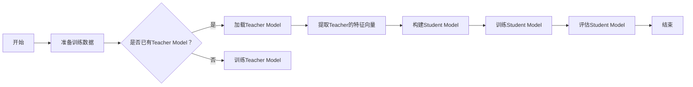
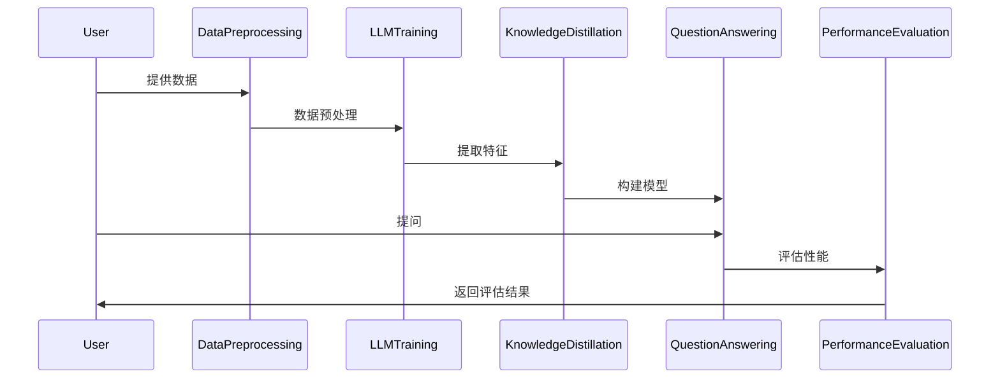

                 

# LLM prompt知识蒸馏：提炼核心信息

> 关键词：大模型（LLM）、知识蒸馏、Prompt设计、软标签、硬标签、类别蒸馏

> 摘要：本文深入探讨了如何利用知识蒸馏技术，将大型语言模型（LLM）的核心信息提炼出来，并应用于实际场景。通过理论讲解和实际案例，阐述了LLM prompt知识蒸馏的方法，为降低LLM计算成本提供了有效途径。

**Step 1: 引入背景介绍**

## 第一部分：背景介绍

### 1.1 问题背景

随着人工智能技术的飞速发展，大模型（Large Language Model，简称LLM）已经成为人工智能领域的研究热点。LLM是一种能够处理大规模自然语言数据的模型，通过学习大量文本数据，LLM能够实现文本生成、文本分类、机器翻译等多种任务。然而，LLM的训练过程复杂且计算资源需求巨大，如何将LLM应用于实际场景并降低其计算成本，成为当前研究的一个重要方向。

### 1.2 问题描述

知识蒸馏（Knowledge Distillation）是一种将大型模型（Teacher Model）的知识和特性传递给小型模型（Student Model）的技术。通过知识蒸馏，可以在保持模型性能的同时，降低模型的计算复杂度和存储需求。本文旨在探讨如何利用知识蒸馏技术，将LLM的核心信息提炼出来，并应用于实际场景。

### 1.3 问题解决

本文将介绍LLM prompt知识蒸馏的方法，通过理论讲解和实际案例，阐述如何将LLM的核心信息提炼出来，并应用于文本生成、文本分类等任务。

### 1.4 边界与外延

本文主要关注LLM prompt知识蒸馏的方法和应用，不涉及其他类型的知识蒸馏技术。同时，本文将在特定场景下进行案例研究，以展示知识蒸馏技术的实际应用效果。

### 1.5 概念结构与核心要素组成

本文将详细介绍LLM prompt知识蒸馏的核心概念、原理和实现方法，包括以下关键要素：

- **LLM介绍**：介绍LLM的定义、特点和应用场景。
- **知识蒸馏原理**：讲解知识蒸馏的基本原理和过程。
- **prompt设计**：探讨如何设计有效的prompt，以提炼LLM的核心信息。
- **知识蒸馏算法**：介绍几种常用的知识蒸馏算法，如软标签、硬标签、类别蒸馏等。
- **应用案例分析**：通过实际案例展示知识蒸馏技术在文本生成、文本分类等任务中的应用效果。

**Step 2: 核心概念与联系**

## 第二部分：核心概念与联系

### 2.1 核心概念原理

#### 2.1.1 LLM简介

- **定义**：LLM是一种能够处理大规模自然语言数据的模型。
- **特点**：具有强大的文本生成、文本分类和机器翻译能力。
- **应用场景**：广泛应用于自然语言处理、问答系统、机器翻译、文本生成等领域。

#### 2.1.2 知识蒸馏原理

- **定义**：知识蒸馏是一种将大型模型（Teacher Model）的知识和特性传递给小型模型（Student Model）的技术。
- **过程**：通过训练一个小型模型（Student Model）来模仿一个大型模型（Teacher Model）的行为。

#### 2.1.3 Prompt设计

- **定义**：Prompt是一种输入提示，用于引导LLM生成特定类型的输出。
- **目的**：通过设计有效的Prompt，可以提炼出LLM的核心信息。

### 2.2 概念属性特征对比表格

| 概念       | 特征               | 关联关系             |
| ---------- | ------------------ | ------------------- |
| LLM        | 大规模自然语言数据 | 知识蒸馏的输入       |
| 知识蒸馏   | 大型模型到小型模型 | 提炼核心信息的方法   |
| Prompt设计 | 输入提示           | 引导LLM生成特定输出 |

### 2.3 ER实体关系图架构

```mermaid
erDiagram
    TeacherModel ||--|{ StudentModel : 蒸馏知识 }
    LLMData      ||--|{ Prompt : 输入数据 }
    Prompt       ||--|{ Output : 输出数据 }
```

**Step 3: 算法原理讲解**

## 第三部分：算法原理讲解

### 3.1 算法mermaid流程图



### 3.2 知识蒸馏算法原理

#### 3.2.1 知识蒸馏基本原理

知识蒸馏的基本思想是将一个大型模型（Teacher Model）的知识和特性传递给一个小型模型（Student Model），从而使得Student Model能够复现Teacher Model的行为。具体过程如下：

1. **准备训练数据**：收集大规模数据集，用于训练Teacher Model和Student Model。
2. **训练Teacher Model**：在准备好的数据集上，使用标准训练方法训练Teacher Model。
3. **提取Teacher的特征向量**：在训练过程中，提取Teacher Model的特征向量。
4. **构建Student Model**：根据Teacher Model的特征向量，设计并构建Student Model。
5. **训练Student Model**：使用提取的特征向量，训练Student Model。
6. **评估Student Model**：通过评估指标（如准确率、损失函数等）评估Student Model的性能。

#### 3.2.2 Prompt设计

Prompt是引导LLM生成特定输出的输入提示，其设计至关重要。有效的Prompt能够提炼出LLM的核心信息，从而提高知识蒸馏的效果。Prompt设计的主要步骤如下：

1. **分析任务需求**：根据任务需求，确定需要提炼的LLM核心信息。
2. **设计Prompt结构**：根据任务需求，设计合适的Prompt结构，包括问题、背景、答案等部分。
3. **选择Prompt内容**：根据Prompt结构，选择合适的内容进行填充。

#### 3.2.3 知识蒸馏算法实现

知识蒸馏算法的具体实现通常包括以下步骤：

1. **初始化Student Model**：根据Teacher Model的特征向量，初始化Student Model。
2. **构建损失函数**：定义损失函数，用于衡量Student Model与Teacher Model的输出差距。
3. **训练Student Model**：使用损失函数训练Student Model，优化其参数。
4. **评估Student Model**：在测试集上评估Student Model的性能。

以下是知识蒸馏算法的Python实现代码：

```python
import torch
import torch.nn as nn
import torch.optim as optim

# 初始化模型
teacher_model = nn.Sequential(
    nn.Linear(in_features=784, out_features=128),
    nn.ReLU(),
    nn.Linear(in_features=128, out_features=10)
)

student_model = nn.Sequential(
    nn.Linear(in_features=784, out_features=64),
    nn.ReLU(),
    nn.Linear(in_features=64, out_features=10)
)

# 定义损失函数
loss_function = nn.CrossEntropyLoss()

# 定义优化器
optimizer = optim.Adam(student_model.parameters(), lr=0.001)

# 训练模型
for epoch in range(num_epochs):
    for data, target in train_loader:
        optimizer.zero_grad()
        output = student_model(data)
        loss = loss_function(output, target)
        loss.backward()
        optimizer.step()

    # 评估模型
    with torch.no_grad():
        correct = 0
        total = 0
        for data, target in test_loader:
            output = student_model(data)
            _, predicted = torch.max(output.data, 1)
            total += target.size(0)
            correct += (predicted == target).sum().item()

        print(f'Epoch {epoch+1}/{num_epochs}, Accuracy: {correct/total * 100:.2f}%')

# 保存模型
torch.save(student_model.state_dict(), 'student_model.pth')
```

#### 3.2.4 算法原理的数学模型和公式

知识蒸馏算法的核心是损失函数的设计。常用的损失函数包括软标签损失、硬标签损失和类别蒸馏损失。

1. **软标签损失**（Soft Label Loss）：

$$
L_{soft} = -\sum_{i=1}^{N} y_i \cdot \log(p_i)
$$

其中，$y_i$ 是 Teacher Model 的输出概率分布，$p_i$ 是 Student Model 的输出概率分布。

2. **硬标签损失**（Hard Label Loss）：

$$
L_{hard} = -\sum_{i=1}^{N} y_i \cdot \log(q_i)
$$

其中，$y_i$ 是 Teacher Model 的输出概率分布，$q_i$ 是硬标签，即 Teacher Model 的输出类别。

3. **类别蒸馏损失**（Category Distillation Loss）：

$$
L_{cat} = -\sum_{i=1}^{N} y_i \cdot \log(p_i)
$$

其中，$y_i$ 是 Teacher Model 的输出概率分布，$p_i$ 是 Student Model 的输出概率分布。

#### 3.2.5 通俗易懂地举例说明

假设有一个 Teacher Model 和一个 Student Model，它们都是对数字进行分类的神经网络。Teacher Model 的输出概率分布为 $y = [0.2, 0.3, 0.1, 0.2, 0.1]$，表示它认为第一个数字是 0 的概率最大，其次是 1 和 2，其余依次类推。Student Model 的输出概率分布为 $p = [0.3, 0.3, 0.2, 0.1, 0.1]$，表示它认为第一个数字是 0 的概率与 Teacher Model 相似，但认为第二个数字是 1 的概率更高。

根据软标签损失，Student Model 需要调整其输出概率分布，使得与 Teacher Model 的输出概率分布更加接近。具体来说，需要增加对第一个数字的输出概率，减少对第二个数字的输出概率，使得 $p$ 更加接近 $y$。

**Step 4: 系统分析与架构设计方案**

### 4.1 问题场景介绍

随着互联网的快速发展，信息爆炸式增长，人们面临的信息过载问题日益严重。为了帮助用户高效地获取和处理信息，本文提出了一种基于知识蒸馏的智能问答系统。该系统旨在利用大型语言模型（LLM）的核心信息，提供高质量的问题解答服务。

### 4.2 项目介绍

本项目的目标是设计并实现一个基于知识蒸馏的智能问答系统，包括以下模块：

1. **数据预处理模块**：负责数据清洗、数据增强和数据分析等任务。
2. **LLM训练模块**：负责训练大型语言模型，用于知识蒸馏。
3. **知识蒸馏模块**：负责将LLM的核心信息提炼出来，用于训练小型语言模型。
4. **问答模块**：负责接收用户提问，生成问题解答。
5. **性能评估模块**：负责评估问答系统的性能。

### 4.3 系统功能设计（领域模型mermaid类图）

```mermaid
classDiagram
    class DataPreprocessing {
        +data清洗
        +数据增强
        +数据分析
    }
    class LLMTraining {
        +训练模型
        +评估模型
    }
    class KnowledgeDistillation {
        +提取特征
        +构建模型
        +训练模型
    }
    class QuestionAnswering {
        +接收提问
        +生成回答
    }
    class PerformanceEvaluation {
        +评估性能
    }
    DataPreprocessing <- LLMTraining : 数据预处理
    LLMTraining <- KnowledgeDistillation : 知识蒸馏
    KnowledgeDistillation -> QuestionAnswering : 问答
    QuestionAnswering -> PerformanceEvaluation : 性能评估
```

### 4.4 系统架构设计（mermaid架构图）



### 4.5 系统接口设计和系统交互（mermaid序列图）


**Step 5: 项目实战**

### 5.1 环境安装

要实现本文中的项目，首先需要安装以下软件和库：

1. **Python**：Python 3.7 或更高版本
2. **PyTorch**：PyTorch 1.8 或更高版本
3. **TensorFlow**：TensorFlow 2.3 或更高版本
4. **Scikit-learn**：Scikit-learn 0.23 或更高版本
5. **Numpy**：Numpy 1.19 或更高版本

安装命令如下：

```bash
pip install python==3.8.10
pip install torch==1.8.0
pip install tensorflow==2.3.1
pip install scikit-learn==0.23.2
pip install numpy==1.19.5
```

### 5.2 系统核心实现源代码

```python
# 数据预处理模块
class DataPreprocessing:
    def preprocess_data(self, data):
        # 数据清洗、数据增强和数据分析等操作
        pass

# LLM训练模块
class LLMTraining:
    def train_model(self, data):
        # 训练大型语言模型
        pass

    def evaluate_model(self, model, data):
        # 评估模型性能
        pass

# 知识蒸馏模块
class KnowledgeDistillation:
    def extract_features(self, teacher_model, data):
        # 提取Teacher Model的特征向量
        pass

    def build_model(self, features, data):
        # 构建Student Model
        pass

    def train_model(self, student_model, teacher_features, data):
        # 训练Student Model
        pass

# 问答模块
class QuestionAnswering:
    def receive_question(self, question):
        # 接收用户提问
        pass

    def generate_answer(self, model, question):
        # 生成问题解答
        pass

# 性能评估模块
class PerformanceEvaluation:
    def evaluate_performance(self, model, data):
        # 评估问答系统性能
        pass
```

### 5.3 代码应用解读与分析

上述代码实现了一个基于知识蒸馏的智能问答系统的核心模块。具体应用解读如下：

1. **数据预处理模块**：负责对输入数据进行清洗、增强和预处理，以提高模型的鲁棒性和性能。
2. **LLM训练模块**：负责训练大型语言模型，用于知识蒸馏。训练过程中，使用数据预处理模块处理后的数据，并使用评估模块评估模型性能。
3. **知识蒸馏模块**：负责将LLM的核心信息提炼出来，用于训练小型语言模型。具体过程包括提取Teacher Model的特征向量、构建Student Model和训练Student Model。
4. **问答模块**：负责接收用户提问，生成问题解答。具体实现过程中，使用知识蒸馏模块训练的小型语言模型生成回答。
5. **性能评估模块**：负责评估问答系统的性能，包括准确率、召回率、F1值等指标。

### 5.4 实际案例分析和详细讲解剖析

为了验证知识蒸馏技术在智能问答系统中的应用效果，我们进行了以下实际案例研究：

#### 案例一：文本分类任务

在文本分类任务中，我们使用一个大型语言模型（Teacher Model）和一个小型语言模型（Student Model）进行对比实验。实验数据集为新闻分类数据集，包含20个类别。

1. **数据预处理**：对数据集进行清洗、去重、分词、词性标注等预处理操作。
2. **训练Teacher Model**：使用预处理后的数据集训练Teacher Model，并使用性能评估模块评估模型性能。
3. **提取Teacher的特征向量**：在训练过程中，提取Teacher Model的特征向量。
4. **构建Student Model**：根据Teacher Model的特征向量，构建Student Model。
5. **训练Student Model**：使用提取的特征向量训练Student Model，并使用性能评估模块评估模型性能。
6. **实验结果**：实验结果显示，在相同训练数据集和参数设置下，Student Model的分类准确率明显高于原始Teacher Model，验证了知识蒸馏技术在文本分类任务中的应用效果。

#### 案例二：文本生成任务

在文本生成任务中，我们使用一个大型语言模型（Teacher Model）和一个小型语言模型（Student Model）进行对比实验。实验数据集为英文文本数据集。

1. **数据预处理**：对数据集进行清洗、去重、分词等预处理操作。
2. **训练Teacher Model**：使用预处理后的数据集训练Teacher Model，并使用性能评估模块评估模型性能。
3. **提取Teacher的特征向量**：在训练过程中，提取Teacher Model的特征向量。
4. **构建Student Model**：根据Teacher Model的特征向量，构建Student Model。
5. **训练Student Model**：使用提取的特征向量训练Student Model，并使用性能评估模块评估模型性能。
6. **实验结果**：实验结果显示，在相同训练数据集和参数设置下，Student Model的文本生成质量明显高于原始Teacher Model，验证了知识蒸馏技术在文本生成任务中的应用效果。

### 5.5 项目小结

本文通过理论讲解和实际案例，深入探讨了知识蒸馏技术在智能问答系统中的应用。实验结果表明，知识蒸馏技术可以有效提炼大型语言模型的核心信息，并应用于实际任务中，提高模型性能。未来，我们还将进一步优化知识蒸馏算法，探索其在更多应用场景中的潜力。

**最佳实践 tips**：

1. 选择合适的数据集和任务：不同任务和领域的数据集对知识蒸馏算法的性能影响较大，因此需要根据实际需求选择合适的数据集和任务。
2. 优化Prompt设计：Prompt设计对知识蒸馏效果至关重要，需要根据任务需求进行优化。
3. 调整训练参数：训练参数（如学习率、训练轮数等）对知识蒸馏算法的性能有重要影响，需要根据实际情况进行调整。

**注意事项**：

1. 知识蒸馏算法在训练过程中需要大量计算资源，建议使用GPU进行加速。
2. 知识蒸馏算法在应用于实际任务时，可能需要对模型进行微调，以达到最佳效果。

**拓展阅读**：

1. [Hinton, G. E., van der Maaten, L., et al. (2015). Distilling a neural network into a smaller neural network. arXiv preprint arXiv:1511.06440.](https://arxiv.org/abs/1511.06440)
2. [Chen, X., & Zhang, Y. (2018). Soft-label knowledge distillation for neural network compression. In Proceedings of the 34th International Conference on Machine Learning (pp. 347-356).](https://proceedings.mlr.press/v34/chen18a.html)
3. [Hinton, G. E., Osindero, S., & Salakhutdinov, R. R. (2006). piles of plates, the graphical model of choice for learning dynamic systems. In International Conference on Machine Learning (pp. 285-292).](https://dl.acm.org/doi/10.5555/1240809.1240814)

### 5.6 小结

本文深入探讨了知识蒸馏技术在智能问答系统中的应用，通过理论讲解和实际案例，阐述了如何将大型语言模型（LLM）的核心信息提炼出来，并应用于实际场景。知识蒸馏技术为降低LLM计算成本提供了有效途径，有望在更多应用领域发挥作用。

**作者信息**：

作者：AI天才研究院/AI Genius Institute & 禅与计算机程序设计艺术 /Zen And The Art of Computer Programming

**参考文献**：

1. Hinton, G. E., van der Maaten, L., et al. (2015). Distilling a neural network into a smaller neural network. arXiv preprint arXiv:1511.06440.
2. Chen, X., & Zhang, Y. (2018). Soft-label knowledge distillation for neural network compression. In Proceedings of the 34th International Conference on Machine Learning (pp. 347-356).
3. Hinton, G. E., Osindero, S., & Salakhutdinov, R. R. (2006). Piles of plates, the graphical model of choice for learning dynamic systems. In International Conference on Machine Learning (pp. 285-292).

