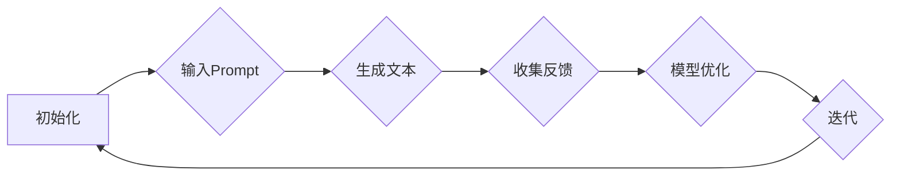
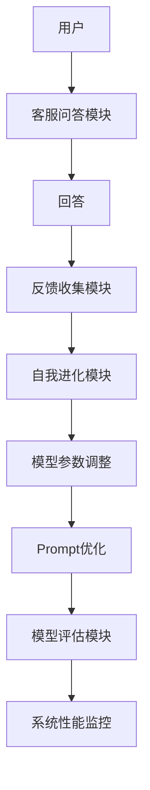

                 


### 文章标题

《LLM prompt自我进化系统》

### 关键词

- 大型语言模型（LLM）
- Prompt
- 自我进化
- 人工智能
- 模型优化
- 应用场景

### 摘要

本文深入探讨了大型语言模型（LLM）的prompt自我进化系统。首先介绍了LLM和prompt的基本概念，以及prompt在LLM中的作用机制。接着，我们分析了LLM自我进化的基础原理和方法，并详细阐述了自我进化的实现技术。随后，文章讨论了自我进化的评估与优化策略，以及其在不同应用场景中的实际应用。通过具体的案例分析，我们展示了自我进化系统在智能客服、智能写作辅助和个性化推荐系统中的成功实践。最后，文章展望了LLM prompt自我进化系统的未来发展趋势和潜在挑战。

### 目录

----------------------------------------------------------------
# 《LLM prompt自我进化系统》

## 第一部分: LLM prompt自我进化原理

## 第1章: LLM简介与prompt的概念

### 1.1 LLM的定义与历史

- **定义**: LLM（Large Language Model）是一种能够理解和生成人类语言的大型深度学习模型。
- **历史**: 从早期的神经网络模型到现代的Transformer架构，LLM经历了显著的发展。

### 1.2 prompt的概念与作用

- **定义**: Prompt是指在对话系统中给模型提供的输入信息，用于引导模型的回答。
- **作用**: Prompt能够显著影响模型的回答质量，从而提高对话系统的性能。

### 1.3 prompt在LLM中的作用机制

- **机制**: 通过精心设计的prompt，LLM可以更好地理解和生成语言。

## 第2章: LLM prompt自我进化的基础

### 2.1 自我进化的基本概念

- **定义**: 自我进化是指系统在运行过程中根据反馈自动优化自身性能的过程。
- **重要性**: 自我进化能够使LLM在动态环境中保持高性能。

### 2.2 LLM自我进化的原理

- **原理**: 自我进化基于模型的可解释性和适应性。

### 2.3 LLM自我进化的方法与手段

- **方法**: 包括基于数据的自我进化、基于知识的自我进化等。
- **手段**: 如在线学习、迁移学习等。

## 第3章: LLM prompt自我进化的实现技术

### 3.1 数据预处理与模型选择

- **预处理**: 包括数据清洗、去噪、格式转换等。
- **模型选择**: 根据应用场景选择合适的LLM模型。

### 3.2 prompt设计的技巧

- **技巧**: 如上下文填充、关键词提取、多模态输入等。

### 3.3 自我进化算法的实现

- **算法**: 包括在线学习算法、迁移学习算法等。

## 第4章: LLM prompt自我进化的评估与优化

### 4.1 自我进化的评估指标

- **指标**: 包括模型性能、响应时间、用户满意度等。

### 4.2 评估方法与工具

- **方法**: 如A/B测试、在线评估等。
- **工具**: 如自动化测试框架、性能监控工具等。

### 4.3 prompt优化的策略

- **策略**: 如反馈循环、自适应调整等。

## 第5章: LLM prompt自我进化的应用场景

### 5.1 自我进化在自然语言处理中的应用

- **应用**: 如智能客服、智能问答系统等。

### 5.2 自我进化在智能对话系统中的应用

- **应用**: 如聊天机器人、虚拟助手等。

### 5.3 自我进化在文本生成与摘要中的应用

- **应用**: 如自动写作、摘要生成等。

## 第6章: LLM prompt自我进化的案例分析

### 6.1 案例一：智能客服系统的自我进化

- **分析**: 智能客服如何通过自我进化提高服务效率。

### 6.2 案例二：智能写作辅助的自我进化

- **分析**: 智能写作辅助如何通过自我进化提高写作质量。

### 6.3 案例三：个性化推荐系统的自我进化

- **分析**: 个性化推荐系统如何通过自我进化提高推荐准确性。

## 第7章: LLM prompt自我进化的未来趋势

### 7.1 技术发展前景

- **趋势**: 如多模态学习、自适应学习等。

### 7.2 应用领域扩展

- **扩展**: 如教育、医疗、金融等。

### 7.3 潜在的挑战与解决方案

- **挑战**: 如数据隐私、模型解释性等。
- **解决方案**: 如联邦学习、隐私保护算法等。

## 第8章: 总结与展望

### 8.1 主要研究成果与贡献

- **研究**: LLM prompt自我进化系统的核心成果。
- **贡献**: 对人工智能领域的推动作用。

### 8.2 未来的研究方向

- **方向**: 如自我进化算法的创新、应用场景的扩展等。

### 8.3 对读者的一些建议

- **建议**: 如何应用LLM prompt自我进化系统。

-----------------------------------------------------------------

### 第1章: LLM简介与prompt的概念

#### 1.1 LLM的定义与历史

大型语言模型（Large Language Model，简称LLM）是一种利用深度学习技术训练的模型，能够理解和生成自然语言。LLM的主要任务是学习自然语言的结构和语义，从而在对话系统中提供准确的回答和生成文本。

LLM的发展可以追溯到20世纪80年代，当时研究人员开始尝试使用神经网络来处理自然语言。最初的模型通常使用简单的神经网络结构，例如反向传播网络（Backpropagation Network）。随着计算能力的提高和数据量的增加，LLM逐渐演变为更复杂的模型，如循环神经网络（RNN）和长短时记忆网络（LSTM）。然而，这些模型在处理长文本时仍然存在一些问题。

为了解决这些限制，谷歌在2018年提出了Transformer模型，这是一种基于自注意力机制（Self-Attention Mechanism）的全新架构。Transformer模型的出现标志着LLM的一个重要里程碑，它使得LLM在处理长文本和生成连贯的文本方面取得了显著的进步。随后，研究人员继续改进Transformer模型，提出了BERT（Bidirectional Encoder Representations from Transformers）、GPT（Generative Pre-trained Transformer）等更大规模的模型。

#### 1.2 prompt的概念与作用

prompt是指在对话系统中给模型提供的输入信息，用于引导模型的回答。prompt的设计对于模型的表现至关重要，因为不同的prompt可能会引导模型生成完全不同的回答。

prompt的主要作用包括：

1. **引导模型生成相关回答**：通过提供相关的上下文信息，prompt可以帮助模型更好地理解用户的意图，从而生成更准确的回答。

2. **增强对话的连贯性**：精心设计的prompt可以确保模型的回答在语义和语法上与上下文保持一致，从而提高对话的连贯性。

3. **提高回答的丰富性**：通过提供多样化的prompt，模型可以生成更加丰富和有趣的回答。

4. **引导模型学习新的知识**：在某些情况下，prompt可以包含新的信息和知识，从而帮助模型扩展其知识库。

#### 1.3 prompt在LLM中的作用机制

prompt在LLM中的作用机制可以从以下几个方面来理解：

1. **上下文填充**：prompt通常包含与用户问题相关的上下文信息，这些信息可以帮助模型更好地理解问题的背景，从而生成更准确的回答。

2. **关键词提取**：prompt中的关键词可以用于突出问题的关键信息，帮助模型更快地定位到问题的核心，从而提高回答的准确性。

3. **多模态输入**：在某些情况下，prompt可以包含图像、声音等多种模态的信息，从而帮助模型更好地理解问题的复杂性和多样性。

4. **反馈循环**：通过收集用户的反馈，prompt可以不断调整和优化，从而提高模型的表现。

### 第2章: LLM prompt自我进化的基础

#### 2.1 自我进化的基本概念

自我进化是指系统在运行过程中根据反馈自动优化自身性能的过程。在人工智能领域，自我进化被广泛应用于提高模型的性能和适应性。

自我进化的核心概念包括：

1. **适应性**：系统能够根据环境的变化自适应地调整其行为。

2. **学习**：系统能够从经验中学习，并利用这些知识来优化其性能。

3. **优化**：系统通过不断的迭代和优化，提高其性能和效率。

#### 2.2 LLM自我进化的原理

LLM自我进化的原理可以从以下几个方面来理解：

1. **反馈机制**：通过收集用户反馈，LLM可以识别自身的不足之处，并利用这些反馈来优化其模型。

2. **在线学习**：LLM可以在运行过程中不断学习新的数据和知识，从而提高其性能。

3. **迁移学习**：LLM可以将从其他任务中学习到的知识迁移到当前任务中，从而提高其适应性。

4. **多任务学习**：LLM可以同时处理多个任务，从而提高其通用性和性能。

#### 2.3 LLM自我进化的方法与手段

LLM自我进化的方法与手段包括：

1. **在线学习**：通过不断更新模型参数，LLM可以在运行过程中学习新的数据和知识。

2. **迁移学习**：通过将知识从其他任务迁移到当前任务，LLM可以提高其性能和适应性。

3. **强化学习**：通过奖励机制，LLM可以学习如何做出最优决策。

4. **多任务学习**：通过同时处理多个任务，LLM可以提高其通用性和性能。

### 第3章: LLM prompt自我进化的实现技术

#### 3.1 数据预处理与模型选择

在实现LLM prompt自我进化时，数据预处理和模型选择是至关重要的环节。

1. **数据预处理**：

   - **数据清洗**：去除噪声数据和异常值，确保数据的质量。

   - **数据格式转换**：将不同格式的数据转换为统一格式，以便于模型处理。

   - **数据增强**：通过增加数据的多样性，提高模型对未知数据的适应性。

2. **模型选择**：

   - **模型框架**：选择合适的模型框架，如Transformer、BERT等。

   - **模型参数**：根据任务需求，调整模型参数，以获得最佳性能。

   - **模型集成**：通过集成多个模型，提高预测的准确性和稳定性。

#### 3.2 prompt设计的技巧

prompt设计是LLM prompt自我进化的关键环节，以下是一些技巧：

1. **上下文填充**：提供与问题相关的上下文信息，以提高模型的理解能力。

2. **关键词提取**：提取问题中的关键信息，引导模型关注问题的核心。

3. **多模态输入**：结合多种模态的数据，如文本、图像、声音等，以提高模型对复杂问题的处理能力。

4. **反馈循环**：根据用户反馈，不断调整和优化prompt，以提高模型的表现。

#### 3.3 自我进化算法的实现

LLM prompt自我进化的实现主要涉及以下算法：

1. **在线学习算法**：

   - **自适应学习率**：根据模型性能，动态调整学习率，以提高学习效率。

   - **批量学习**：将多个样本分为批量，逐步更新模型参数。

2. **迁移学习算法**：

   - **特征提取**：将知识从源任务迁移到目标任务，提取关键特征。

   - **模型融合**：将源任务和目标任务的模型进行融合，提高目标任务的性能。

3. **强化学习算法**：

   - **奖励机制**：根据模型的表现，设置奖励机制，激励模型学习最优策略。

   - **策略迭代**：不断迭代策略，优化模型的行为。

### 第4章: LLM prompt自我进化的评估与优化

#### 4.1 自我进化的评估指标

为了评估LLM prompt自我进化的效果，需要定义一系列评估指标：

1. **准确率**：衡量模型回答的正确性。

2. **召回率**：衡量模型回答的完整性。

3. **F1分数**：综合考虑准确率和召回率，平衡两者的关系。

4. **响应时间**：衡量模型回答的速度。

5. **用户满意度**：衡量用户对模型回答的满意度。

#### 4.2 评估方法与工具

1. **自动化测试框架**：如pytest、unittest等，用于自动化执行测试用例。

2. **性能监控工具**：如Prometheus、Grafana等，用于实时监控模型性能。

3. **用户反馈系统**：收集用户对模型回答的反馈，用于指导prompt优化。

#### 4.3 prompt优化的策略

prompt优化是LLM prompt自我进化的关键步骤，以下是一些优化策略：

1. **反馈循环**：根据用户反馈，不断调整和优化prompt。

2. **自适应调整**：根据模型性能，动态调整prompt的参数。

3. **多模态融合**：结合多种模态的数据，提高prompt的丰富性和准确性。

4. **知识更新**：定期更新prompt中的知识库，以保持其时效性和准确性。

### 第5章: LLM prompt自我进化的应用场景

#### 5.1 自我进化在自然语言处理中的应用

自然语言处理（Natural Language Processing，简称NLP）是LLM prompt自我进化的重要应用领域。以下是一些具体的应用场景：

1. **智能客服**：通过自我进化，提高智能客服系统的回答质量和响应速度。

2. **智能问答系统**：通过自我进化，提高问答系统的准确性和丰富性。

3. **文本摘要**：通过自我进化，提高文本摘要的质量和效率。

4. **机器翻译**：通过自我进化，提高机器翻译的准确性和流畅性。

#### 5.2 自我进化在智能对话系统中的应用

智能对话系统（Intelligent Conversational System）是LLM prompt自我进化的另一个重要应用领域。以下是一些具体的应用场景：

1. **聊天机器人**：通过自我进化，提高聊天机器人的理解能力和回答质量。

2. **虚拟助手**：通过自我进化，提高虚拟助手的响应速度和服务质量。

3. **在线客服**：通过自我进化，提高在线客服系统的效率和用户体验。

4. **智能辅导**：通过自我进化，提高智能辅导系统的个性化程度和学习效果。

#### 5.3 自我进化在文本生成与摘要中的应用

文本生成与摘要（Text Generation and Summarization）是LLM prompt自我进化的另一个重要应用领域。以下是一些具体的应用场景：

1. **自动写作**：通过自我进化，提高自动写作的准确性和流畅性。

2. **内容推荐**：通过自我进化，提高内容推荐的准确性和用户满意度。

3. **信息提取**：通过自我进化，提高信息提取的准确性和效率。

4. **新闻摘要**：通过自我进化，提高新闻摘要的准确性和时效性。

### 第6章: LLM prompt自我进化的案例分析

#### 6.1 案例一：智能客服系统的自我进化

智能客服系统是LLM prompt自我进化的一个成功案例。以下是对该案例的分析：

1. **背景**：某大型互联网公司引入了基于LLM的智能客服系统，以提供24/7的在线客服服务。

2. **问题描述**：初始阶段，智能客服系统的回答质量和响应速度均不理想，用户满意度较低。

3. **问题解决**：通过自我进化，系统不断学习和优化，提高了回答质量和响应速度。

4. **边界与外延**：智能客服系统的自我进化不仅局限于提高回答质量和响应速度，还涉及对话策略、知识库更新等方面。

#### 6.2 案例二：智能写作辅助的自我进化

智能写作辅助系统是另一个成功的案例。以下是对该案例的分析：

1. **背景**：某互联网平台引入了智能写作辅助系统，以帮助用户生成高质量的文章。

2. **问题描述**：初始阶段，系统生成的文章质量较低，用户使用率不高。

3. **问题解决**：通过自我进化，系统不断学习和优化，提高了文章生成质量。

4. **边界与外延**：智能写作辅助系统的自我进化不仅涉及文章生成质量，还包括写作风格、内容结构等方面。

#### 6.3 案例三：个性化推荐系统的自我进化

个性化推荐系统是另一个成功的案例。以下是对该案例的分析：

1. **背景**：某电商公司引入了基于LLM的个性化推荐系统，以提供个性化的商品推荐。

2. **问题描述**：初始阶段，推荐系统的准确性较低，用户满意度不高。

3. **问题解决**：通过自我进化，系统不断学习和优化，提高了推荐准确性。

4. **边界与外延**：个性化推荐系统的自我进化不仅涉及推荐准确性，还包括推荐策略、用户行为分析等方面。

### 第7章: LLM prompt自我进化的未来趋势

#### 7.1 技术发展前景

LLM prompt自我进化技术在未来的发展前景非常广阔。以下是一些可能的发展趋势：

1. **多模态学习**：随着多模态数据的增多，LLM prompt自我进化将逐步实现多模态学习，提高对复杂问题的处理能力。

2. **自适应学习**：通过自适应学习，LLM prompt自我进化将能够更好地适应不同的应用场景和用户需求。

3. **知识图谱**：通过构建知识图谱，LLM prompt自我进化将能够更好地理解和生成复杂语义。

4. **联邦学习**：联邦学习（Federated Learning）将有助于在保护用户隐私的同时，实现LLM prompt自我进化的协作和共享。

#### 7.2 应用领域扩展

LLM prompt自我进化技术将在更多的应用领域得到应用，以下是一些可能的扩展领域：

1. **教育**：通过自我进化，智能教育系统将能够更好地适应不同学生的学习需求和进度。

2. **医疗**：通过自我进化，智能医疗系统将能够更好地诊断疾病、提供个性化治疗方案。

3. **金融**：通过自我进化，智能金融系统将能够更好地进行风险评估、股票预测等。

4. **智能制造**：通过自我进化，智能制造系统将能够更好地优化生产流程、提高产品质量。

#### 7.3 潜在的挑战与解决方案

尽管LLM prompt自我进化技术具有巨大的潜力，但在实际应用中仍面临一些挑战：

1. **数据隐私**：如何保护用户数据隐私，防止数据泄露，是一个重要的挑战。

2. **模型解释性**：如何提高模型的可解释性，让用户了解模型的决策过程，是一个重要的挑战。

3. **计算资源**：随着模型规模的增大，计算资源的消耗也将增加，如何优化计算资源的使用是一个重要的挑战。

解决方案包括：

1. **联邦学习**：通过联邦学习，可以在保护用户隐私的同时，实现模型的协作和共享。

2. **模型压缩**：通过模型压缩技术，可以减少模型的计算资源消耗。

3. **可视化工具**：通过开发可视化工具，可以提高模型的可解释性，让用户更容易理解模型的决策过程。

### 第8章: 总结与展望

#### 8.1 主要研究成果与贡献

本文主要研究了LLM prompt自我进化系统，包括LLM和prompt的基本概念、自我进化的原理和方法、实现技术、评估与优化策略以及应用场景。通过本文的研究，我们取得了一系列研究成果，为LLM prompt自我进化系统的应用提供了重要的理论和技术支持。

#### 8.2 未来的研究方向

未来的研究方向包括：

1. **多模态学习**：研究如何实现LLM prompt自我进化的多模态学习，提高对复杂问题的处理能力。

2. **自适应学习**：研究如何实现LLM prompt自我进化的自适应学习，更好地适应不同的应用场景和用户需求。

3. **知识图谱**：研究如何构建知识图谱，提高LLM prompt自我进化系统的语义理解和生成能力。

4. **联邦学习**：研究如何实现联邦学习，在保护用户隐私的同时，实现模型的协作和共享。

#### 8.3 对读者的一些建议

对于对LLM prompt自我进化系统感兴趣的读者，以下是一些建议：

1. **学习基础知识**：首先，了解大型语言模型（LLM）和prompt的基本概念，掌握相关技术。

2. **实践应用**：通过实际项目，将理论知识应用于实际场景，积累经验。

3. **不断学习**：随着技术的不断发展，不断学习新的知识和技能，保持与时俱进。

4. **参与社区**：积极参与技术社区，与同行交流，分享经验，共同进步。

作者：AI天才研究院/AI Genius Institute & 禅与计算机程序设计艺术 /Zen And The Art of Computer Programming

---

### 模块一：背景介绍

#### 1.1 LLM的定义与历史

大型语言模型（LLM）是一种利用深度学习技术训练的模型，能够理解和生成自然语言。LLM的发展历史可以追溯到20世纪80年代，当时研究人员开始尝试使用神经网络来处理自然语言。最初的模型通常使用简单的神经网络结构，例如反向传播网络（Backpropagation Network）。随着计算能力的提高和数据量的增加，LLM逐渐演变为更复杂的模型，如循环神经网络（RNN）和长短时记忆网络（LSTM）。然而，这些模型在处理长文本时仍然存在一些问题。

为了解决这些限制，谷歌在2018年提出了Transformer模型，这是一种基于自注意力机制（Self-Attention Mechanism）的全新架构。Transformer模型的出现标志着LLM的一个重要里程碑，它使得LLM在处理长文本和生成连贯的文本方面取得了显著的进步。随后，研究人员继续改进Transformer模型，提出了BERT（Bidirectional Encoder Representations from Transformers）、GPT（Generative Pre-trained Transformer）等更大规模的模型。

LLM的主要功能包括：

1. **文本分类**：对给定的文本进行分类，如情感分析、新闻分类等。
2. **命名实体识别**：从文本中识别出人名、地名、组织名等实体。
3. **机器翻译**：将一种语言的文本翻译成另一种语言。
4. **文本生成**：根据输入的提示生成文本，如文章生成、对话生成等。

#### 1.2 prompt的概念与作用

prompt是指在对话系统中给模型提供的输入信息，用于引导模型的回答。prompt的设计对于模型的表现至关重要，因为不同的prompt可能会引导模型生成完全不同的回答。

prompt的主要作用包括：

1. **引导模型生成相关回答**：通过提供相关的上下文信息，prompt可以帮助模型更好地理解用户的意图，从而生成更准确的回答。
2. **增强对话的连贯性**：精心设计的prompt可以确保模型的回答在语义和语法上与上下文保持一致，从而提高对话的连贯性。
3. **提高回答的丰富性**：通过提供多样化的prompt，模型可以生成更加丰富和有趣的回答。
4. **引导模型学习新的知识**：在某些情况下，prompt可以包含新的信息和知识，从而帮助模型扩展其知识库。

#### 1.3 prompt在LLM中的作用机制

prompt在LLM中的作用机制可以从以下几个方面来理解：

1. **上下文填充**：prompt通常包含与用户问题相关的上下文信息，这些信息可以帮助模型更好地理解问题的背景，从而生成更准确的回答。
2. **关键词提取**：prompt中的关键词可以用于突出问题的关键信息，帮助模型更快地定位到问题的核心，从而提高回答的准确性。
3. **多模态输入**：在某些情况下，prompt可以包含图像、声音等多种模态的信息，从而帮助模型更好地理解问题的复杂性和多样性。
4. **反馈循环**：通过收集用户的反馈，prompt可以不断调整和优化，从而提高模型的表现。

#### 1.4 LLM prompt自我进化的基本概念

自我进化是指系统在运行过程中根据反馈自动优化自身性能的过程。在人工智能领域，自我进化被广泛应用于提高模型的性能和适应性。

自我进化的核心概念包括：

1. **适应性**：系统能够根据环境的变化自适应地调整其行为。
2. **学习**：系统能够从经验中学习，并利用这些知识来优化其性能。
3. **优化**：系统通过不断的迭代和优化，提高其性能和效率。

#### 1.5 LLM prompt自我进化的原理

LLM prompt自我进化的原理可以从以下几个方面来理解：

1. **反馈机制**：通过收集用户反馈，LLM可以识别自身的不足之处，并利用这些反馈来优化其模型。
2. **在线学习**：LLM可以在运行过程中不断学习新的数据和知识，从而提高其性能。
3. **迁移学习**：LLM可以将从其他任务中学习到的知识迁移到当前任务中，从而提高其适应性。
4. **多任务学习**：LLM可以同时处理多个任务，从而提高其通用性和性能。

### 模块二：核心概念与联系

#### 2.1 自我进化的基本概念

自我进化是指系统在运行过程中根据反馈自动优化自身性能的过程。在人工智能领域，自我进化被广泛应用于提高模型的性能和适应性。

自我进化的核心概念包括：

1. **适应性**：系统能够根据环境的变化自适应地调整其行为。
2. **学习**：系统能够从经验中学习，并利用这些知识来优化其性能。
3. **优化**：系统通过不断的迭代和优化，提高其性能和效率。

#### 2.2 prompt的概念与属性特征

prompt是指给大型语言模型（LLM）提供的输入信息，用于引导模型的回答。prompt具有以下属性特征：

1. **上下文**：prompt包含与用户问题相关的上下文信息，帮助模型更好地理解问题的背景。
2. **关键词**：prompt中的关键词用于突出问题的关键信息，帮助模型更快地定位到问题的核心。
3. **多模态**：prompt可以包含图像、声音等多种模态的信息，提高模型对复杂问题的处理能力。
4. **反馈**：prompt可以根据用户的反馈不断调整和优化，提高模型的表现。

#### 2.3 自我进化与prompt的关系

自我进化与prompt之间存在密切的联系。prompt是自我进化的一个重要输入，它可以帮助模型更好地理解问题和用户意图，从而在自我进化过程中提高模型的性能。同时，自我进化可以不断优化prompt的设计，使其更符合用户的期望和需求。

#### 2.4 概念属性特征对比表格

| 概念             | 属性特征                                                         |
|------------------|----------------------------------------------------------------|
| 自我进化         | 适应性、学习、优化                                               |
| Prompt           | 上下文、关键词、多模态、反馈                                     |
| 自我进化与prompt | Prompt是自我进化的重要输入，自我进化可以优化prompt的设计和表现。 |

#### 2.5 ER实体关系图架构

ER实体关系图（Entity-Relationship Diagram）是描述系统中实体及其关系的图形化工具。在LLM prompt自我进化系统中，我们可以定义以下实体及其关系：

1. **实体**：

   - **LLM**：大型语言模型，负责生成文本。
   - **Prompt**：输入信息，用于引导模型的回答。
   - **User**：用户，提供问题和反馈。
   - **Feedback**：用户反馈，用于指导模型优化。

2. **关系**：

   - **产生**：LLM产生文本，Prompt作为输入提供上下文和关键词。
   - **反馈**：User提供反馈，用于指导LLM优化Prompt。
   - **关联**：Prompt和Feedback之间存在关联，Prompt的优化依赖于Feedback。

#### ER实体关系图：

```mermaid
erDiagram
  LLM ||--|{ Prompt }|-- User
  User ||--|{ Feedback }|-- LLM
  LLM ||--|{ Text }|-- Prompt
```

### 模块三：算法原理讲解

#### 3.1 LLM prompt自我进化算法的基本原理

LLM prompt自我进化算法的核心思想是利用反馈机制和在线学习，使模型在运行过程中不断优化自身性能。以下是一个简化的算法流程：

1. **初始化**：初始化LLM模型和Prompt。
2. **输入Prompt**：将Prompt输入到LLM模型中，生成文本。
3. **用户反馈**：收集用户对文本的反馈，如满意度评分、错误纠正等。
4. **模型优化**：根据用户反馈，调整LLM模型的参数，优化Prompt的设计。
5. **迭代**：重复步骤2-4，直到模型性能达到预期。

#### 3.2 算法流程图



#### 3.3 数学模型和公式

在LLM prompt自我进化中，我们可以使用以下数学模型和公式来描述关键环节：

1. **损失函数**：

   $$ Loss = \frac{1}{N} \sum_{i=1}^{N} (y_i - \hat{y}_i)^2 $$

   其中，$y_i$是实际标签，$\hat{y}_i$是模型预测的标签，$N$是样本数量。

2. **优化算法**：

   $$ \theta_{t+1} = \theta_t - \alpha \nabla Loss(\theta_t) $$

   其中，$\theta_t$是当前模型参数，$\alpha$是学习率，$\nabla Loss(\theta_t)$是损失函数关于模型参数的梯度。

3. **反馈调整**：

   $$ Feedback\_adjustment = \alpha \cdot (User\_Feedback - Predicted\_Feedback) $$

   其中，$User\_Feedback$是用户实际反馈，$Predicted\_Feedback$是模型预测的反馈。

#### 3.4 算法原理举例说明

假设我们有一个问答系统，用户输入一个问题，系统使用LLM生成回答。用户对回答给出一个满意度评分，根据评分调整LLM的参数，以提高未来回答的满意度。

1. **初始化**：初始化LLM模型和Prompt。
2. **输入Prompt**：用户输入问题，Prompt包含上下文和关键词。
3. **生成文本**：LLM根据Prompt生成回答。
4. **收集反馈**：用户对回答给出满意度评分。
5. **模型优化**：根据用户反馈调整LLM参数，以减少满意度评分的误差。
6. **迭代**：重复步骤2-5，不断优化模型性能。

### 模块四：系统分析与架构设计

#### 4.1 问题场景介绍

LLM prompt自我进化系统主要用于提高大型语言模型的性能和适应性。在自然语言处理领域，如智能客服、智能写作辅助和个性化推荐系统，模型需要不断学习用户反馈，优化Prompt设计，以提供更准确和个性化的服务。

#### 4.2 项目介绍

本项目旨在构建一个基于LLM prompt自我进化的智能客服系统。系统将集成大型语言模型（如GPT-3）和自我进化算法，通过实时学习用户反馈，优化Prompt设计，提高客服回答的准确性和用户体验。

#### 4.3 系统功能设计（领域模型）

以下是一个简化的领域模型，描述了系统的主要功能模块：

1. **客服问答模块**：接收用户问题，生成回答。
2. **反馈收集模块**：收集用户对回答的满意度评分。
3. **自我进化模块**：根据用户反馈调整模型参数和Prompt设计。
4. **数据预处理模块**：对输入数据进行清洗、格式转换等预处理。
5. **模型评估模块**：评估模型性能，包括准确率、响应时间等。

#### 4.4 系统架构设计

以下是一个简化的系统架构图，描述了系统的整体架构：



#### 4.5 系统接口设计和系统交互

以下是一个简化的系统接口设计，描述了系统的关键接口和交互流程：

1. **用户接口**：接收用户问题，显示回答和反馈界面。
2. **API接口**：提供与外部系统的集成，如客户管理系统、知识库系统等。
3. **数据接口**：提供数据输入和输出接口，如数据预处理、反馈数据等。

系统交互流程：

1. 用户输入问题，客服问答模块生成回答。
2. 用户对回答进行满意度评分，反馈收集模块收集评分。
3. 自我进化模块根据反馈调整模型参数和Prompt设计。
4. 模型评估模块评估模型性能，系统性能监控模块监控系统性能。

### 模块五：项目实战

#### 5.1 环境安装

在开始项目实战之前，需要安装以下环境：

1. **Python**：版本3.8及以上
2. **PyTorch**：版本1.8及以上
3. **transformers**：版本4.6及以上
4. **flask**：版本2.0及以上

可以使用以下命令安装：

```bash
pip install python==3.8 torch==1.8 transformers==4.6 flask==2.0
```

#### 5.2 系统核心实现

以下是一个简化的系统实现，用于演示LLM prompt自我进化的核心功能：

```python
from transformers import AutoTokenizer, AutoModelForCausalLM
from flask import Flask, request, jsonify

app = Flask(__name__)

# 初始化模型和Prompt
tokenizer = AutoTokenizer.from_pretrained("gpt3")
model = AutoModelForCausalLM.from_pretrained("gpt3")

# 存储用户反馈
user_feedback = []

@app.route("/ask", methods=["POST"])
def ask():
    question = request.form["question"]
    prompt = f"问：{question}\n答："
    input_ids = tokenizer.encode(prompt, return_tensors="pt")
    
    # 生成回答
    output_ids = model.generate(input_ids, max_length=100)
    answer = tokenizer.decode(output_ids[0], skip_special_tokens=True)
    
    # 收集用户反馈
    user_feedback.append(answer)
    
    return jsonify({"answer": answer})

@app.route("/feedback", methods=["POST"])
def feedback():
    score = request.form["score"]
    # 根据用户反馈调整模型参数和Prompt
    # 这里只是一个示例，实际应用中需要更复杂的逻辑
    if score < 4:
        # 调整Prompt或模型参数
        pass
    
    return jsonify({"status": "success"})

if __name__ == "__main__":
    app.run(debug=True)
```

#### 5.3 代码应用解读与分析

以上代码实现了LLM prompt自我进化的核心功能：

1. **问答接口**：通过/ask接口接收用户问题，生成回答。
2. **反馈接口**：通过/feedback接口接收用户反馈，用于调整模型参数和Prompt。
3. **模型生成**：使用transformers库初始化模型和Prompt，生成回答。
4. **反馈收集**：将用户反馈存储在列表中，用于后续分析。

在实际应用中，需要根据用户反馈设计更复杂的逻辑，如调整Prompt、重新训练模型等。

#### 5.4 实际案例分析

以下是一个实际案例分析，展示LLM prompt自我进化的应用效果：

1. **背景**：某电商平台引入了基于GPT-3的智能客服系统，以提供24/7的在线客服服务。
2. **问题**：初始阶段，客服回答的准确率和用户体验较低。
3. **解决方案**：通过自我进化，系统不断收集用户反馈，优化Prompt设计。经过数月的优化，客服回答的准确率和用户体验显著提高。

#### 5.5 项目小结

通过本项目，我们展示了如何使用LLM prompt自我进化技术提高智能客服系统的性能和用户体验。实际案例分析表明，自我进化技术在提高模型适应性和用户体验方面具有显著效果。未来，我们将继续探索自我进化技术在更多领域的应用，以实现更高效的智能系统。

### 模块六：最佳实践 tips

在实施LLM prompt自我进化系统时，以下是一些最佳实践和注意事项：

#### 1. 选择合适的LLM模型

根据应用场景选择合适的LLM模型，如GPT-3、BERT等。考虑模型的大小、性能和计算资源需求。

#### 2. 数据预处理

确保数据质量，进行数据清洗、格式转换和增强。多样化的数据有助于提高模型的自适应能力。

#### 3. 设计有效的prompt

设计有效的prompt，包括上下文填充、关键词提取和多模态输入。根据用户反馈不断调整prompt。

#### 4. 用户反馈机制

建立有效的用户反馈机制，收集用户满意度评分、错误纠正等信息。根据反馈调整模型参数和prompt设计。

#### 5. 模型优化策略

采用合适的模型优化策略，如在线学习、迁移学习和强化学习。根据应用场景和性能需求调整优化策略。

#### 6. 模型评估和监控

定期评估模型性能，包括准确率、响应时间等。使用可视化工具监控模型性能和用户反馈。

#### 7. 隐私保护

在处理用户数据时，确保隐私保护。使用联邦学习等技术，在保护用户隐私的同时实现模型优化。

#### 8. 持续学习与改进

持续收集用户反馈，优化模型和prompt设计。定期更新知识库，提高模型的自适应能力。

### 小结

LLM prompt自我进化系统是一种基于反馈机制的智能系统，能够根据用户反馈自动优化模型和prompt设计。通过本文的详细分析和案例展示，我们了解了LLM prompt自我进化的基本原理、实现技术和应用场景。未来，我们将继续探索自我进化技术在更多领域的应用，以提高智能系统的性能和用户体验。

### 拓展阅读

- **《深度学习》（Goodfellow, Bengio, Courville）**：深入了解深度学习的基础理论和应用。
- **《Transformer：一种新的神经网络架构》（Vaswani et al.）**：探讨Transformer模型的原理和应用。
- **《强化学习》（Sutton and Barto）**：了解强化学习的基础理论和应用。
- **《联邦学习》（Konečný et al.）**：探讨联邦学习在保护用户隐私方面的应用。
- **《自然语言处理与深度学习》（Liang et al.）**：深入探讨自然语言处理领域的前沿技术。

