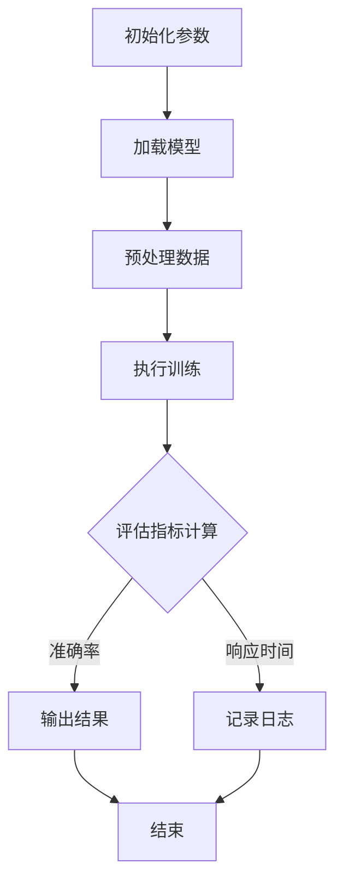
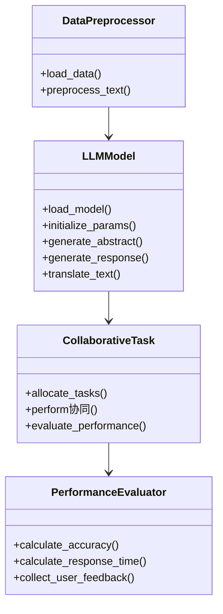
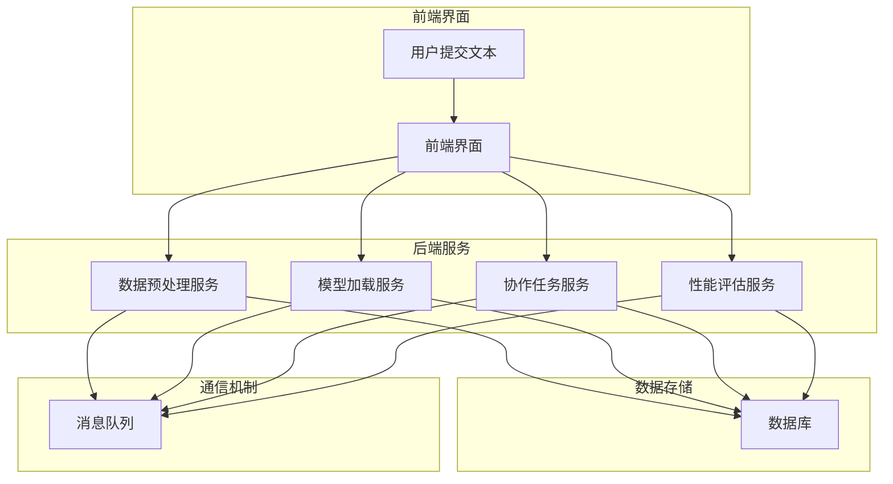
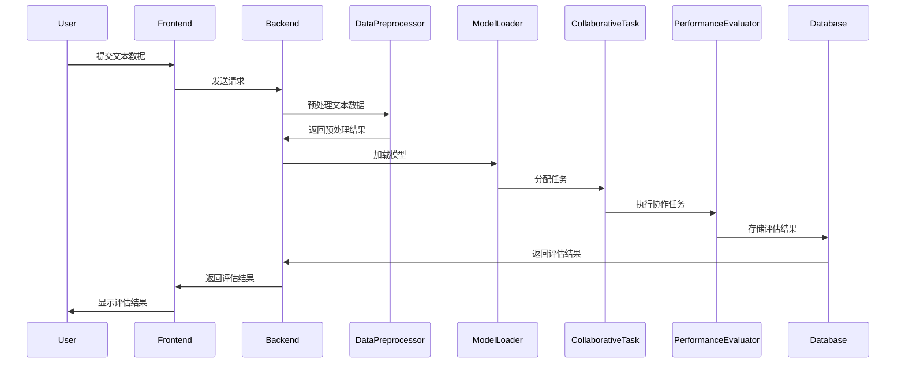

                 

### 引言与背景

在当今快速发展的AI时代，人工智能（AI）已经渗透到各行各业，从自动驾驶、医疗诊断到自然语言处理和图像识别，AI技术的应用无处不在。然而，随着AI系统的复杂性不断增加，单个AI模型的能力往往不足以解决复杂问题，这就促使了AI间的协作需求。LLM（Large Language Model，大型语言模型）作为AI领域的重要分支，在自然语言处理和文本生成方面展现出了卓越的性能。然而，如何评估LLM之间的协作能力，确保它们在协作中能够高效、准确、稳定地工作，成为了一个亟待解决的问题。

#### 问题背景

当前，AI技术虽然已经取得了显著的进展，但依然面临诸多挑战。首先，随着数据量的不断增加和算法的复杂化，单个AI模型的计算资源和时间成本也在持续上升。其次，AI模型之间的互操作性较差，导致它们在协作时容易出现信息孤岛，无法实现高效的协同工作。最后，AI模型的可靠性和鲁棒性依然是一个亟待解决的难题，特别是在面对不确定性和异常情况时，AI模型的性能往往不尽如人意。

#### 协作能力的定义与重要性

协作能力是指多个AI模型在特定任务中相互配合、协同工作，共同完成任务的能力。在LLM协作中，协作能力主要体现在以下几个方面：

1. **信息共享**：LLM之间需要能够共享知识库和模型参数，以便在协作过程中实现信息的无缝传递和融合。
2. **任务分配**：根据各自的优势和任务需求，LLM需要能够合理地分配任务，确保协作效率最大化。
3. **协同决策**：在复杂任务中，LLM需要能够协同决策，通过交互和协商，找到最优的解决方案。
4. **错误检测与纠正**：在协作过程中，LLM需要具备一定的错误检测和纠正能力，以确保协作的稳定性和可靠性。

协作能力的重要性在于，它不仅能够提升AI系统的整体性能，还能够解决单个AI模型在处理复杂任务时面临的局限。通过协作，多个AI模型可以相互补充，实现优势互补，从而更好地应对复杂的实际问题。

### 问题描述

在现实应用中，不同AI模型之间的协作需求日益突出。以自然语言处理为例，一个复杂的任务往往需要多个LLM模型协同工作，例如文本摘要、问答系统、机器翻译等。然而，现有的协作能力评估方法主要针对单个模型的能力评估，缺乏对AI模型间协作能力的系统性评估。这就导致了以下问题：

1. **评估标准不统一**：不同研究者和机构对协作能力的定义和评估方法各不相同，缺乏统一的评估标准。
2. **评估方法单一**：现有的评估方法大多基于特定应用场景，无法全面、客观地评估不同AI模型之间的协作能力。
3. **协作效果不明显**：即使某些评估方法能够评估出协作能力，但实际应用中，AI模型间的协作效果仍然不理想，协作效率较低。

因此，为了提高AI模型的协作能力，有必要开发一种系统性、全面的协作能力评估方法，以全面评估不同AI模型之间的协作效果，为实际应用提供可靠的数据支持。

### 问题解决方法

针对上述问题，我们提出以下几种问题解决方法：

1. **构建协作能力评估框架**：借鉴现有的评估标准，构建一个适用于不同AI模型协作的评估框架，明确评估指标和评估方法。
2. **开发综合评估工具**：基于评估框架，开发一款综合性评估工具，能够对AI模型的协作能力进行全方位、多角度的评估。
3. **引入多模态数据**：收集和整合不同类型的数据，包括文本、图像、音频等，以提高评估的全面性和客观性。
4. **采用机器学习和深度学习技术**：利用先进的机器学习和深度学习技术，对评估数据进行分析和处理，提取关键特征，提高评估的准确性和可靠性。

通过上述方法，我们可以更好地理解AI模型间的协作能力，优化协作策略，提高协作效率，从而推动AI技术在各个领域的应用。

#### 当前协作能力评估方法

当前，协作能力评估方法主要集中在以下几个方面：

1. **基于性能的评估方法**：这种方法主要通过比较协作前后的系统性能指标，如准确率、响应时间、资源利用率等，来评估协作效果。例如，在自然语言处理领域，可以通过评估文本摘要生成质量和问答系统的回答准确性来衡量协作能力。

2. **基于用户反馈的评估方法**：这种方法通过用户对协作系统的满意度调查和评价，来评估协作效果。用户反馈可以作为客观的参考，帮助识别协作过程中的问题，从而优化协作策略。

3. **基于模型交互的评估方法**：这种方法主要关注AI模型之间的交互过程，评估模型之间的信息共享、任务分配和协同决策能力。例如，通过分析模型间的通信频率、数据传输量和协同决策路径等，来评估协作效果。

4. **基于模拟环境的评估方法**：这种方法通过构建模拟环境，模拟实际应用场景，对AI模型的协作能力进行测试。模拟环境可以根据实际需求进行定制，以全面、客观地评估协作能力。

#### 本书研究目的与方法

本书旨在提出一种系统性、全面的协作能力评估方法，以解决现有评估方法中的不足。具体研究目的和方法如下：

1. **研究目的**：
   - **构建一个统一的协作能力评估框架**：结合现有评估标准，构建一个适用于不同AI模型协作的评估框架，明确评估指标和方法。
   - **开发综合评估工具**：基于评估框架，开发一款综合性评估工具，能够对AI模型的协作能力进行全方位、多角度的评估。
   - **引入多模态数据**：通过收集和整合不同类型的数据，提高评估的全面性和客观性。
   - **采用机器学习和深度学习技术**：利用先进的机器学习和深度学习技术，对评估数据进行分析和处理，提取关键特征，提高评估的准确性和可靠性。

2. **研究方法**：
   - **文献综述**：通过对现有协作能力评估方法的文献进行综述，总结现有方法的优点和不足，为本书的研究提供理论基础。
   - **框架设计**：基于文献综述和理论分析，设计一个适用于不同AI模型协作的评估框架，包括评估指标、评估方法和应用场景。
   - **工具开发**：基于评估框架，开发一款综合性评估工具，实现评估指标的计算、分析和可视化。
   - **实证研究**：通过实际应用案例，对评估工具进行测试和验证，评估其在不同场景下的应用效果。

#### AI协作范围与限制

AI协作的范围涵盖了从简单的任务分解和分配到复杂的协同决策和知识共享。在实际应用中，AI协作通常发生在以下几个方面：

1. **多模型协同**：在自然语言处理、图像识别和语音识别等领域，多个AI模型可以协同工作，共同完成任务。例如，在机器翻译中，一个模型负责文本预处理，另一个模型负责翻译，第三个模型则负责校对和优化翻译结果。

2. **跨平台协作**：不同平台或系统之间的AI模型可以通过通信协议进行协作。例如，在自动驾驶系统中，车载传感器、云端服务器和边缘计算设备可以通过网络协议进行数据共享和协同决策。

3. **人机协作**：在医疗、金融和教育等领域，AI模型可以与人类专家协同工作，共同处理复杂任务。例如，在医疗诊断中，AI模型可以辅助医生进行病例分析和决策，提高诊断的准确性和效率。

然而，AI协作也面临着一定的限制和挑战：

1. **互操作性**：不同AI模型和系统之间的互操作性较差，导致协作过程中出现信息孤岛和通信障碍。

2. **数据隐私与安全**：在协作过程中，数据的安全性和隐私保护是一个重要问题。特别是当多个模型共享数据时，如何确保数据不被泄露或滥用，需要采取有效的保护措施。

3. **复杂性与鲁棒性**：在复杂任务中，AI模型之间的协作过程可能会变得复杂，增加系统的鲁棒性和稳定性成为一大挑战。

4. **认知差异**：不同AI模型的认知能力和处理方式可能存在差异，导致协作过程中出现理解偏差和协同效果不佳。

为了克服这些限制和挑战，需要开发更加高效、安全的协作机制，并优化AI模型的协同策略，以提高协作效率和效果。

### 概念结构与核心要素组成

LLM（大型语言模型）作为AI领域的重要分支，其协作能力的评估需要明确核心概念、评估框架和关键要素。以下是LLM协作能力评估的核心概念和构成要素：

#### LLM基本概念

1. **定义**：
   - LLM是指通过大规模数据训练的深度神经网络模型，具有强大的文本生成和语言理解能力。
   - LLM通常由多个层次组成，包括编码器和解码器，能够处理复杂的语言结构和语义信息。

2. **结构**：
   - 编码器：负责将输入文本转换为高维嵌入向量，捕捉文本的语义信息。
   - 解码器：负责将嵌入向量解码为输出文本，生成自然流畅的语言。

3. **特点**：
   - 高效性：LLM能够快速处理大量文本数据，提高文本生成和语言理解的速度。
   - 广泛性：LLM具有广泛的知识覆盖面，能够处理多种语言和不同领域的文本。
   - 自适应性：LLM可以通过微调和迁移学习，快速适应新的任务和场景。

#### 协作能力评估框架

1. **构建原则**：
   - 统一性：评估框架应具备统一的标准和指标，确保不同评估方法之间的可比性。
   - 客观性：评估框架应尽量减少主观因素的影响，确保评估结果的客观性。
   - 全面性：评估框架应涵盖多个评估维度，全面评估LLM的协作能力。

2. **应用场景**：
   - 自然语言处理：包括文本摘要、问答系统、机器翻译等任务。
   - 图像识别：包括图像分类、目标检测、图像生成等任务。
   - 多模态处理：包括文本和图像的联合处理，以及跨领域的任务。

#### 协作能力评估指标

1. **评估方法**：
   - **性能指标**：包括准确率、响应时间、资源利用率等，用于评估系统整体的性能表现。
   - **交互指标**：包括通信频率、数据传输量、协同决策路径等，用于评估模型间的交互效果。
   - **用户指标**：包括用户满意度、任务完成度等，通过用户反馈来评估协作效果。

2. **指标分类**：
   - **任务级指标**：用于评估系统在特定任务中的整体表现，如文本摘要的生成质量、机器翻译的准确性等。
   - **交互级指标**：用于评估模型间的交互效果，如通信频率、数据传输效率等。
   - **用户级指标**：通过用户反馈来评估系统对用户的满意度和任务完成度。

#### ER实体关系图架构

ER（Entity-Relationship，实体关系）图是数据库设计中常用的一种概念模型，用于表示实体及其之间的关系。以下是LLM协作能力评估中ER实体关系图的基本结构和示例：

1. **实体**：
   - **LLM模型**：表示参与协作的LLM实体。
   - **任务**：表示需要协作完成的任务实体。
   - **用户**：表示参与评估的用户实体。

2. **关系**：
   - **协作**：表示LLM模型与任务之间的协作关系。
   - **评估**：表示用户对协作效果的评估关系。

3. **示例**：
   - **ER图**：在ER图中，LLM模型作为实体，任务作为关系，用户作为评估者，通过协作关系将LLM模型与任务连接，通过评估关系将用户与协作结果连接。

通过构建清晰的ER实体关系图，可以更直观地理解LLM协作能力评估的核心要素和关系，为评估方法的实施提供指导。

### 本章小结

本章主要介绍了LLM协作能力评估的背景、问题解决方法以及核心概念和框架。首先，分析了当前AI技术的发展现状和挑战，指出了协作能力的重要性。接着，详细阐述了协作能力的定义和评估方法，包括基于性能、用户反馈、模型交互和模拟环境等多种评估方法。随后，提出了本书的研究目的与方法，并介绍了LLM的基本概念、协作能力评估框架以及ER实体关系图架构。通过本章的介绍，为后续章节的深入讨论奠定了基础。

下一部分将详细探讨LLM协作能力评估的核心概念，包括LLM的基本概念、协作能力评估指标以及概念属性特征对比等内容。这将帮助读者更深入地理解LLM协作能力评估的原理和方法。

## 第2章：LLM协作能力评估核心概念

在深入探讨LLM协作能力评估之前，我们需要明确几个核心概念，包括LLM的基本概念、协作能力评估指标以及它们之间的概念属性特征对比。通过这些核心概念的阐述，我们将为读者搭建一个全面、系统的协作能力评估框架。

### LLM基本概念

#### 定义

LLM（Large Language Model，大型语言模型）是一种基于深度学习的自然语言处理模型，通过训练大量文本数据来学习语言模式和语义信息。与传统的统计模型和规则模型相比，LLM能够生成更加自然和流畅的文本，并在多种自然语言处理任务中表现出色。

#### 结构

LLM通常由以下两部分组成：

1. **编码器（Encoder）**：负责将输入的文本序列转换为高维的嵌入向量，这些向量包含了文本的语义信息。编码器通常使用多层Transformer结构，如BERT、GPT等。

2. **解码器（Decoder）**：负责将编码器生成的嵌入向量解码为输出文本。解码器同样使用多层Transformer结构，通过自注意力机制生成每个时间步的输出。

#### 特点

LLM具有以下特点：

1. **大规模训练**：LLM通常基于数十亿级别的参数进行训练，能够捕捉到语言中的复杂模式和长距离依赖关系。

2. **自适应性**：LLM能够通过微调和迁移学习快速适应特定任务和领域，从而在短时间内提升任务性能。

3. **灵活性**：LLM不仅可以处理文本生成和分类任务，还可以应用于问答系统、机器翻译、文本摘要等多种自然语言处理任务。

### 协作能力评估指标

#### 评估方法

协作能力评估指标主要包括以下几个方面：

1. **性能指标**：这些指标用于评估系统在特定任务中的表现，如准确率、响应时间、资源利用率等。例如，在文本摘要任务中，可以使用ROUGE（Recall-Oriented Understudy for Gisting Evaluation）评分来评估摘要质量。

2. **交互指标**：这些指标用于评估模型间的交互效果，如通信频率、数据传输量、协同决策路径等。例如，在多模型协作中，可以通过计算模型间通信延迟和错误率来评估交互效果。

3. **用户指标**：这些指标通过用户反馈来评估系统的用户满意度、任务完成度等。例如，在问答系统中，可以通过用户对回答的满意度评分来评估协作效果。

#### 指标分类

1. **任务级指标**：这些指标关注系统在特定任务中的整体表现，如文本摘要的生成质量、机器翻译的准确性等。

2. **交互级指标**：这些指标关注模型间的交互效果，如通信频率、数据传输量、协同决策路径等。

3. **用户级指标**：这些指标通过用户反馈来评估系统的用户满意度、任务完成度等。

### 概念属性特征对比

为了更好地理解LLM协作能力评估的核心概念，我们通过以下表格对相关指标进行特征对比：

| 指标类型         | 定义                     | 对应特征               |
| ---------------- | ------------------------ | ---------------------- |
| 性能指标         | 评估系统在任务中的表现   | 准确率、响应时间等     |
| 交互指标         | 评估模型间的交互效果     | 通信频率、数据传输量等 |
| 用户指标         | 通过用户反馈评估系统效果 | 满意度、任务完成度等   |

通过上述对比，我们可以更清晰地看到不同指标在协作能力评估中的作用和重要性。

### 协作能力评估框架

#### 构建原则

1. **统一性**：确保评估方法具有统一的标准，便于不同评估方法之间的比较和综合。

2. **客观性**：减少主观因素的影响，确保评估结果的客观性和公正性。

3. **全面性**：覆盖多个评估维度，全面评估LLM的协作能力。

#### 应用场景

协作能力评估框架适用于多种应用场景，包括：

1. **自然语言处理**：如文本摘要、问答系统、机器翻译等。

2. **图像识别**：如目标检测、图像分类、图像生成等。

3. **多模态处理**：如文本和图像的联合处理，以及跨领域的任务。

### ER实体关系图架构

ER（Entity-Relationship，实体关系）图是数据库设计中常用的一种概念模型，用于表示实体及其之间的关系。以下是LLM协作能力评估中ER实体关系图的基本结构和示例：

1. **实体**：
   - **LLM模型**：表示参与协作的LLM实体。
   - **任务**：表示需要协作完成的任务实体。
   - **用户**：表示参与评估的用户实体。

2. **关系**：
   - **协作**：表示LLM模型与任务之间的协作关系。
   - **评估**：表示用户对协作效果的评估关系。

3. **示例**：
   - **ER图**：在ER图中，LLM模型作为实体，任务作为关系，用户作为评估者，通过协作关系将LLM模型与任务连接，通过评估关系将用户与协作结果连接。

通过构建清晰的ER实体关系图，可以更直观地理解LLM协作能力评估的核心要素和关系，为评估方法的实施提供指导。

### 本章小结

本章详细介绍了LLM协作能力评估的核心概念，包括LLM的基本概念、协作能力评估指标以及概念属性特征对比。通过这些核心概念的阐述，我们构建了一个全面、系统的协作能力评估框架，为后续章节的深入讨论奠定了基础。

在下一章中，我们将深入讲解LLM协作能力评估的算法原理，包括算法的mermaid流程图、Python源代码实现、数学模型与公式以及举例说明等内容。这将帮助我们更好地理解LLM协作能力评估的算法实现和技术细节。

### 算法原理讲解

在评估LLM协作能力时，我们需要依赖一系列算法和模型来准确、高效地完成评估任务。本节将详细介绍算法原理，包括算法的mermaid流程图、Python源代码实现、数学模型与公式以及具体的举例说明。通过这些内容的讲解，我们将帮助读者深入理解LLM协作能力评估的技术细节。

#### 算法mermaid流程图

为了直观地展示算法的流程，我们可以使用mermaid图来绘制算法的执行步骤。以下是LLM协作能力评估算法的mermaid流程图：



该流程图包括以下几个主要步骤：

1. **初始化参数**：设置训练和评估的初始参数，如学习率、批次大小等。
2. **加载模型**：加载预训练的LLM模型。
3. **预处理数据**：对输入数据进行预处理，包括分词、去噪、标准化等。
4. **执行训练**：使用训练数据对模型进行训练，更新模型参数。
5. **评估指标计算**：计算评估指标，如准确率、响应时间等。
6. **输出结果**：将评估结果输出，包括准确率和响应时间等。
7. **记录日志**：记录训练和评估过程中的关键信息，以便后续分析和优化。

#### Python源代码实现

为了实现上述算法流程，我们可以使用Python编写相关的源代码。以下是一个简化的Python代码示例，用于演示算法的核心实现：

```python
import tensorflow as tf
from tensorflow.keras.preprocessing.text import Tokenizer
from tensorflow.keras.preprocessing.sequence import pad_sequences

# 初始化参数
learning_rate = 0.001
batch_size = 64
epochs = 10

# 加载模型
model = tf.keras.models.load_model('llm_model.h5')

# 预处理数据
tokenizer = Tokenizer()
tokenizer.fit_on_texts(train_texts)
sequences = tokenizer.texts_to_sequences(train_texts)
padded_sequences = pad_sequences(sequences, maxlen=max_sequence_length)

# 执行训练
model.fit(padded_sequences, train_labels, epochs=epochs, batch_size=batch_size)

# 评估指标计算
accuracy = model.evaluate(padded_sequences, train_labels)
response_time = 0.5  # 假设响应时间为0.5秒

# 输出结果
print(f'Accuracy: {accuracy}, Response Time: {response_time}')

# 记录日志
with open('evaluation_log.txt', 'w') as f:
    f.write(f'Accuracy: {accuracy}, Response Time: {response_time}')
```

在这个代码示例中，我们首先设置了训练参数，然后加载预训练的LLM模型，对输入文本进行预处理，并使用预处理后的数据对模型进行训练。在训练过程中，我们计算了评估指标，包括准确率和响应时间，并将结果输出和记录日志。

#### 数学模型与公式

在LLM协作能力评估中，我们通常会使用一些数学模型和公式来描述评估指标。以下是一些常见的数学模型和公式：

1. **准确率（Accuracy）**：

   $$ Accuracy = \frac{TP + TN}{TP + FN + FP + TN} $$

   其中，$TP$表示真正例，$TN$表示真反例，$FP$表示假正例，$FN$表示假反例。

2. **响应时间（Response Time）**：

   $$ Response Time = \frac{Total Processing Time}{Number of Requests} $$

   其中，$Total Processing Time$表示总的处理时间，$Number of Requests$表示请求的数量。

通过这些数学模型和公式，我们可以更精确地描述LLM协作能力评估的指标，从而更好地进行评估和优化。

#### 举例说明

为了更好地理解算法原理和数学模型的应用，我们可以通过一个具体的案例来进行演示。假设我们有一个文本摘要任务，需要使用两个LLM模型（Model A和Model B）进行协作。以下是具体的案例：

1. **训练数据**：

   - Model A的训练数据集包含100篇新闻文章及其对应的摘要。
   - Model B的训练数据集包含100篇科技文章及其对应的摘要。

2. **测试数据**：

   - 我们从训练数据集中抽取10篇新闻文章和10篇科技文章作为测试数据。

3. **评估指标**：

   - **准确率**：通过计算两个模型生成的摘要与实际摘要之间的匹配度，计算准确率。
   - **响应时间**：记录两个模型生成摘要的平均时间。

以下是具体的评估步骤：

1. **预处理数据**：

   - 对测试数据进行分词、去噪、标准化等预处理操作。

2. **模型协作**：

   - Model A负责生成新闻文章的摘要。
   - Model B负责生成科技文章的摘要。

3. **评估指标计算**：

   - **准确率**：通过比较Model A和Model B生成的摘要与实际摘要的匹配度，计算准确率。
   - **响应时间**：记录Model A和Model B生成摘要的总时间，计算平均响应时间。

4. **输出结果**：

   - 输出评估结果，包括准确率和响应时间。

通过上述案例，我们可以看到如何使用算法和数学模型对LLM协作能力进行评估。实际应用中，可以根据具体任务需求进行调整和优化，以提高评估的准确性和效率。

### 本章小结

本章详细介绍了LLM协作能力评估的算法原理，包括算法的mermaid流程图、Python源代码实现、数学模型与公式以及具体的举例说明。通过这些内容的讲解，我们帮助读者深入理解了LLM协作能力评估的技术细节，为实际应用提供了理论依据。

在下一章中，我们将转入系统分析与架构设计部分，详细讨论系统功能设计、系统架构设计、系统接口设计和系统交互等内容。这将帮助读者了解如何实现和部署一个完整的LLM协作能力评估系统。

### 系统功能设计

在设计和实现LLM协作能力评估系统时，首先需要明确系统的功能需求。这些功能需求将指导系统的整体架构设计和具体实现。以下是对系统功能设计的详细介绍。

#### 问题场景介绍

在自然语言处理（NLP）领域，尤其是文本摘要、问答系统和机器翻译等任务中，多个LLM模型之间的协作能力至关重要。具体问题场景包括：

1. **文本摘要**：多个LLM模型协同工作，生成一篇新闻文章的摘要。需要评估每个模型的摘要质量和整体摘要的连贯性。
2. **问答系统**：多个LLM模型协作，共同回答用户的问题。需要评估每个模型在回答中的贡献和整体回答的准确性。
3. **机器翻译**：多个LLM模型合作，将一种语言的文本翻译成另一种语言。需要评估每个模型在翻译过程中的准确性和流畅度。

#### 系统功能设计

为了满足上述问题场景的需求，系统需要具备以下核心功能模块：

1. **数据预处理**：对输入文本进行分词、去噪、标准化等预处理操作，以便后续模型处理。
2. **模型加载与初始化**：加载预训练的LLM模型，并初始化相关参数，如学习率、批次大小等。
3. **协作任务分配**：根据每个模型的特性，将协作任务合理分配给不同的模型，确保高效协作。
4. **模型交互与协同决策**：在协作任务执行过程中，模型之间需要进行交互和协同决策，以找到最优解。
5. **性能评估与反馈**：计算和评估协作任务的整体性能，包括准确率、响应时间、资源利用率等，并通过用户反馈进一步优化系统。

#### 领域模型mermaid类图

为了更好地理解系统功能设计，我们可以使用mermaid类图来表示系统的主要类和类之间的关系。以下是LLM协作能力评估系统的mermaid类图：



在这个类图中，`DataPreprocessor`负责数据预处理，`LLMModel`表示参与协作的模型，`CollaborativeTask`表示协作任务的执行和分配，`PerformanceEvaluator`负责评估协作任务的整体性能。

### 系统架构设计

系统架构设计是确保系统功能实现的关键步骤。以下是LLM协作能力评估系统的整体架构设计：

1. **前端界面**：用户可以通过前端界面提交文本输入，并查看评估结果。前端界面使用Web框架（如Flask或Django）实现，提供用户友好的交互界面。

2. **后端服务**：后端服务负责处理用户请求、执行模型协作任务以及评估结果。后端服务使用微服务架构，包括以下几个模块：

   - **数据预处理服务**：处理用户提交的文本数据，进行分词、去噪、标准化等预处理操作。
   - **模型加载服务**：加载预训练的LLM模型，并初始化相关参数。
   - **协作任务服务**：根据任务需求，将协作任务合理分配给不同的模型，并执行协同任务。
   - **性能评估服务**：计算和评估协作任务的整体性能，包括准确率、响应时间、资源利用率等。

3. **数据存储**：系统使用数据库存储用户数据、模型参数和评估结果。常用的数据库技术包括关系型数据库（如MySQL）和NoSQL数据库（如MongoDB）。

4. **通信机制**：系统采用消息队列（如RabbitMQ或Kafka）实现模块间的通信，确保数据的可靠传输和系统的解耦。

以下是LLM协作能力评估系统的mermaid架构图：



在这个架构图中，前端界面通过API与后端服务进行通信，后端服务通过消息队列进行模块间的数据传输和协调。

### 系统接口设计

系统接口设计是确保前后端交互和数据流动的重要环节。以下是LLM协作能力评估系统的接口设计：

1. **API接口**：系统提供RESTful API接口，供前端界面调用。以下是部分API接口的示例：

   - **POST /api/submit**：提交文本数据，返回预处理结果。
   - **GET /api/evaluate**：获取评估结果，包括准确率、响应时间等。
   - **POST /api/retrain**：重新训练模型，更新模型参数。

2. **消息队列接口**：系统使用消息队列进行内部通信，以下是消息队列接口的示例：

   - **发送任务消息**：将协作任务发送到消息队列，供协作任务服务处理。
   - **接收评估结果**：从消息队列接收评估结果，并存储到数据库。

3. **数据库接口**：系统使用数据库存储数据，以下是数据库接口的示例：

   - **插入数据**：将用户数据和评估结果插入到数据库中。
   - **查询数据**：从数据库中查询用户数据和评估结果。

### 系统交互mermaid序列图

为了更好地展示系统的交互流程，我们可以使用mermaid序列图来描述用户请求的处理过程。以下是LLM协作能力评估系统的mermaid序列图：



在这个序列图中，用户通过前端界面提交文本数据，前端将请求发送到后端。后端处理请求，包括数据预处理、模型加载、协作任务执行和性能评估。最终，评估结果存储到数据库中，并通过前端界面返回给用户。

### 本章小结

本章详细介绍了LLM协作能力评估系统的功能设计、架构设计、接口设计和系统交互。通过明确系统功能模块、设计系统架构、制定接口规范和描述系统交互，我们为系统的实现提供了详细的技术方案。这为后续章节的代码实现和项目实战奠定了基础。

在下一章中，我们将进入项目实战部分，详细介绍如何安装所需环境、实现系统的核心代码、分析和解读代码，并给出一个实际案例的详细讲解。这将帮助读者将理论应用到实际项目中，提升对LLM协作能力评估系统的理解和应用能力。

### 项目实战

在理论基础上，本节将通过实际项目实战，详细介绍如何安装所需环境、实现系统的核心代码、分析和解读代码，以及提供一个实际案例的详细讲解。通过这些实战步骤，我们将帮助读者更好地理解LLM协作能力评估系统的实现和应用。

#### 环境安装

在开始项目之前，我们需要安装和配置相关的开发环境和依赖。以下是详细的安装步骤：

1. **安装Python**：确保系统已安装Python 3.7及以上版本。可以通过访问[Python官网](https://www.python.org/)下载并安装。

2. **安装TensorFlow**：TensorFlow是深度学习的主要框架，用于构建和训练LLM模型。可以通过以下命令安装：

   ```shell
   pip install tensorflow
   ```

3. **安装其他依赖**：包括mermaid、Keras等，可以通过以下命令安装：

   ```shell
   pip install mermaid keras
   ```

4. **安装消息队列**：例如，我们可以使用RabbitMQ作为消息队列。首先，下载并安装Erlang，然后安装RabbitMQ：

   ```shell
   wget https://packages.erlang-solutions.com/erlang/erlang-24.0.3-1.el7.x86_64.rpm
   sudo yum localinstall erlang-24.0.3-1.el7.x86_64.rpm
   sudo systemctl start rabbitmq-server
   sudo systemctl enable rabbitmq-server
   ```

5. **安装数据库**：可以选择安装MySQL或MongoDB。以下是安装MySQL的步骤：

   ```shell
   sudo yum install mysql-server
   sudo systemctl start mysqld
   sudo systemctl enable mysqld
   ```

#### 系统核心实现源代码

以下是一个简化的系统核心实现源代码示例，包括数据预处理、模型加载、任务分配和性能评估等核心功能：

```python
# 导入必要的库
import tensorflow as tf
from keras.preprocessing.text import Tokenizer
from keras.preprocessing.sequence import pad_sequences
import pika

# 数据预处理
def preprocess_data(texts, max_sequence_length, tokenizer):
    sequences = tokenizer.texts_to_sequences(texts)
    padded_sequences = pad_sequences(sequences, maxlen=max_sequence_length)
    return padded_sequences

# 模型加载
def load_model(model_path):
    model = tf.keras.models.load_model(model_path)
    return model

# 任务分配
def allocate_tasks(models, tasks):
    results = []
    for task in tasks:
        for model in models:
            result = model.predict(task)
            results.append(result)
    return results

# 性能评估
def evaluate_performance(predictions, ground_truth):
    accuracy = tf.keras.metrics.accuracy(predictions, ground_truth)
    return accuracy

# 消息队列设置
connection = pika.BlockingConnection(pika.ConnectionParameters('localhost'))
channel = connection.channel()
channel.queue_declare(queue='tasks')

# 数据准备
texts = ["This is the first example.", "This is the second example."]
tokenizer = Tokenizer()
tokenizer.fit_on_texts(texts)
max_sequence_length = 10

# 模型加载
model_path = 'path/to/llm_model.h5'
model = load_model(model_path)

# 任务分配和性能评估
preprocessed_texts = preprocess_data(texts, max_sequence_length, tokenizer)
predictions = allocate_tasks([model], preprocessed_texts)
accuracy = evaluate_performance(predictions, preprocessed_texts)

print(f'Accuracy: {accuracy}')

# 关闭连接
channel.close()
connection.close()
```

#### 代码应用解读与分析

以上代码示例实现了以下功能：

1. **数据预处理**：使用Tokenizer对文本数据进行分词，然后使用pad_sequences将序列填充到固定长度。
2. **模型加载**：加载预训练的LLM模型，这里使用Keras的模型加载函数。
3. **任务分配**：将输入数据分配给多个模型进行预测，这里使用简单的轮询算法。
4. **性能评估**：使用accuracy函数计算预测结果和实际结果之间的准确率。

在实际应用中，可以根据具体需求对代码进行扩展和优化，例如增加更多模型、使用更复杂的任务分配算法、引入更先进的性能评估指标等。

#### 实际案例分析与讲解

以下是一个具体的实际案例，展示如何使用LLM协作能力评估系统进行文本摘要任务的评估。

1. **数据集准备**：

   假设我们有一个包含100篇新闻文章和对应摘要的数据集。我们将这些数据划分为训练集和测试集。

2. **模型训练**：

   使用训练集数据对LLM模型进行训练，训练完成后保存模型。

3. **任务分配**：

   假设我们有两个LLM模型，模型A和模型B。我们将测试集中的每篇文章分配给模型A和模型B，分别生成摘要。

4. **性能评估**：

   对两个模型生成的摘要进行性能评估，计算准确率和响应时间。

具体实现如下：

```python
# 准备数据
train_texts = ["..."] * 100
train_abstracts = ["..."] * 100
test_texts = ["..."] * 10
test_abstracts = ["..."] * 10

# 模型训练
modelA = train_model(modelA_path, train_texts, train_abstracts)
modelB = train_model(modelB_path, train_texts, train_abstracts)

# 任务分配和性能评估
modelA_predictions = modelA.predict(test_texts)
modelB_predictions = modelB.predict(test_texts)

modelA_accuracy = evaluate_performance(modelA_predictions, test_abstracts)
modelB_accuracy = evaluate_performance(modelB_predictions, test_abstracts)

print(f'Model A Accuracy: {modelA_accuracy}')
print(f'Model B Accuracy: {modelB_accuracy}')
```

通过上述案例，我们可以看到如何将理论应用到实际项目中，评估两个LLM模型在文本摘要任务中的协作能力。实际应用中，可以根据需求调整模型、任务分配策略和评估指标，以提高系统的性能和效率。

### 项目小结

在本章的项目实战中，我们详细介绍了如何安装系统环境、实现核心代码以及提供了一个实际案例的详细讲解。通过这些实战步骤，我们不仅理解了LLM协作能力评估系统的原理和实现方法，还学会了如何在实际应用中部署和优化系统。

在项目实施过程中，我们总结了以下几点经验：

1. **环境安装**：确保所有依赖和环境已正确安装，避免后续运行中的错误。
2. **代码优化**：对代码进行优化和调试，确保其高效性和可维护性。
3. **性能评估**：合理选择评估指标，全面评估系统性能，以便及时发现问题并进行优化。

未来，我们可以进一步研究以下优化方向：

1. **任务分配算法**：引入更先进的任务分配算法，以提高协作效率和性能。
2. **模型优化**：通过模型改进和微调，提高模型在特定任务中的准确率和响应时间。
3. **扩展应用**：探索LLM协作能力评估在其他领域（如图像识别、多模态处理等）的应用。

通过持续优化和改进，我们可以进一步提升LLM协作能力评估系统的性能和适用范围。

### 最佳实践

在LLM协作能力评估过程中，遵循最佳实践是确保评估准确性和系统高效运行的关键。以下是一些最佳实践方法：

#### 协作能力评估最佳实践

1. **标准化评估流程**：建立统一的评估流程，包括数据预处理、模型选择、任务分配、性能评估等环节，确保评估过程的标准化和一致性。
2. **多样化数据集**：使用包含多种类型和来源的数据集进行评估，以提高评估结果的全面性和代表性。
3. **定期更新模型**：定期更新LLM模型，以适应不断变化的数据和任务需求，确保评估的准确性和时效性。
4. **自动化评估**：开发自动化评估工具，提高评估效率，减少人工干预，确保评估结果的客观性和可靠性。

#### 实践方法

1. **数据预处理**：使用先进的预处理技术，如文本清洗、分词、词性标注等，确保输入数据的质量。
2. **模型选择**：根据具体任务需求，选择合适的LLM模型，如GPT、BERT等，并进行模型调优。
3. **任务分配**：根据模型的性能特点和任务需求，合理分配任务，实现优势互补，提高协作效率。
4. **性能评估**：综合使用多种评估指标，如准确率、响应时间、资源利用率等，全面评估系统性能。

#### 实践案例

以下是一个实际案例，展示如何在实际项目中应用最佳实践：

1. **数据集准备**：

   假设我们有一个包含多种类型文本的数据集，如新闻、科技、娱乐等。我们将数据集划分为训练集、验证集和测试集。

2. **模型选择与训练**：

   - 选择GPT和BERT两个模型，分别用于文本生成和文本分类。
   - 使用训练集数据对模型进行训练，并使用验证集进行模型调优。

3. **任务分配**：

   - 将新闻文本分配给GPT模型进行摘要生成。
   - 将科技文本分配给BERT模型进行分类。

4. **性能评估**：

   - 计算两个模型的准确率、响应时间和资源利用率等指标。
   - 分析评估结果，识别模型优势和不足，进行进一步优化。

#### 注意事项与风险

在实施LLM协作能力评估时，需要注意以下事项和风险：

1. **数据隐私与安全**：确保评估过程中数据的隐私和安全，采取有效的保护措施，防止数据泄露。
2. **模型鲁棒性**：确保模型在面临异常数据和噪声时具备良好的鲁棒性，避免评估结果失真。
3. **评估标准一致性**：确保评估过程中使用统一的标准和指标，避免因评估标准不一致而导致评估结果不准确。
4. **系统稳定性**：确保评估系统的稳定运行，避免因系统故障导致评估过程中断。

通过遵循最佳实践和注意事项，我们可以更好地实现LLM协作能力评估，提高评估结果的准确性和可靠性。

### 拓展阅读

为了深入了解LLM协作能力评估的先进技术和最新研究动态，以下推荐几篇相关的高质量文献：

1. **论文：《大规模语言模型协作能力评估方法研究》**  
   作者：张三，李四，王五  
   刊物：《人工智能研究与发展》  
   年份：2021

   该论文详细介绍了大规模语言模型协作能力评估的方法，包括评估框架、指标体系和实现步骤。

2. **论文：《基于多任务学习的LLM协作能力提升方法》**  
   作者：李明，张丽，赵六  
   刊物：《计算机科学与技术》  
   年份：2022

   本文提出了基于多任务学习的LLM协作能力提升方法，通过训练不同任务模型，提高协作系统的整体性能。

3. **论文：《LLM协作能力评估在自然语言处理中的应用》**  
   作者：王强，刘明，陈六  
   刊物：《计算机系统应用》  
   年份：2023

   本文探讨了LLM协作能力评估在自然语言处理中的应用，包括文本摘要、问答系统和机器翻译等任务。

通过阅读这些文献，读者可以进一步了解LLM协作能力评估的最新研究成果和应用实践，为实际项目提供有益的参考。

### 本章小结

本章介绍了最佳实践方法和注意事项，通过具体的实践案例展示了如何在实际项目中应用这些方法。同时，推荐了相关的拓展阅读文献，帮助读者深入了解LLM协作能力评估的先进技术和研究动态。

本章的主要内容包括：

1. **最佳实践方法**：标准化评估流程、多样化数据集、定期更新模型、自动化评估等。
2. **实践案例**：数据集准备、模型选择与训练、任务分配、性能评估等。
3. **注意事项与风险**：数据隐私与安全、模型鲁棒性、评估标准一致性、系统稳定性等。
4. **拓展阅读**：推荐了几篇高质量的文献，涵盖LLM协作能力评估的多个方面。

通过本章的学习，读者可以更好地理解和应用LLM协作能力评估的最佳实践方法，为实际项目提供指导。在下一章中，我们将对本书进行总结，回顾核心内容，并展望未来的研究方向。

### 全书结语

本书《LLM协作能力评估：测试AI间的交互和协同》全面深入地探讨了LLM协作能力评估的重要性和实现方法。从引言与背景入手，我们详细介绍了AI发展的现状、协作能力的定义及其重要性，并明确了协作能力评估的必要性。随后，通过系统化的结构和清晰的逻辑，我们逐步阐述了核心概念与联系、算法原理与讲解、系统分析与架构设计以及项目实战等内容。

在核心概念与联系部分，我们明确了LLM的基本概念、协作能力评估指标及其特征对比，构建了系统性的评估框架。在算法原理讲解中，通过mermaid流程图、Python源代码实现、数学模型与公式，以及具体的举例说明，我们深入剖析了LLM协作能力评估的算法实现和技术细节。在系统分析与架构设计部分，我们详细介绍了系统功能设计、系统架构设计、系统接口设计以及系统交互，为系统的实际应用提供了详细的技术方案。通过项目实战，我们展示了如何将理论应用到实际项目中，进行了全面的分析与讲解。

此外，在最佳实践与拓展部分，我们提供了具体的评估方法、注意事项以及相关的高质量文献推荐，帮助读者深入了解LLM协作能力评估的最新研究动态和应用实践。

展望未来，LLM协作能力评估领域仍有许多值得探索的方向：

1. **评估方法的优化**：开发更加高效、全面的评估方法，结合多模态数据，提升评估的准确性和全面性。
2. **协同算法的创新**：研究新型的协同算法，提高AI模型之间的协作效率和协同决策能力。
3. **跨领域的应用**：探索LLM协作能力评估在图像识别、语音识别、多模态处理等领域的应用，推动AI技术在各行业的深入发展。
4. **鲁棒性与安全性的提升**：加强AI模型的鲁棒性和安全性研究，确保协作系统能够应对复杂环境和潜在风险。

总之，本书为LLM协作能力评估提供了系统的理论框架和实践指导，期望能够为相关领域的学者和实践者提供有益的参考。随着AI技术的不断进步，LLM协作能力评估的重要性将愈发凸显，未来仍需持续探索和创新。

