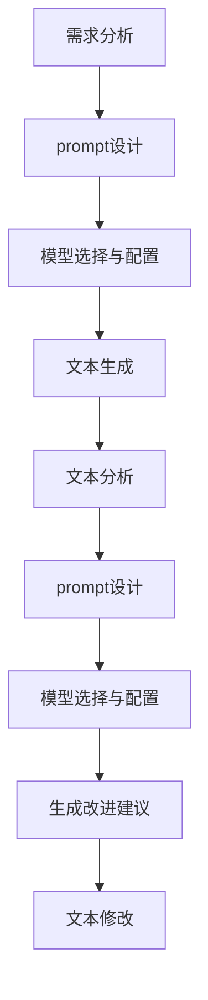
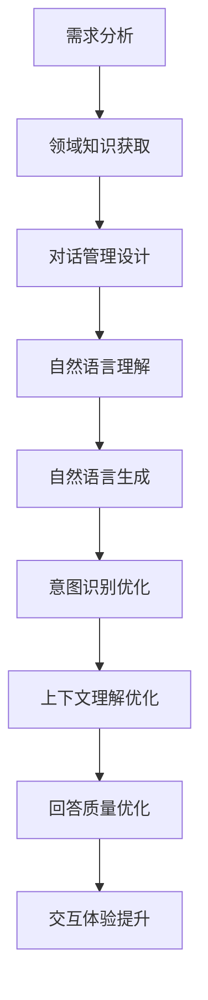
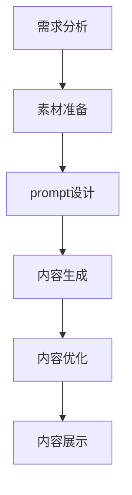
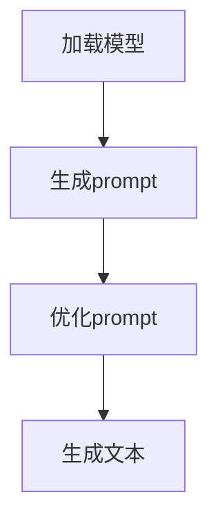

                 

### # 《LLM协同prompt创作：human-AI合作新模式》

> 关键词：自然语言处理、人工智能、语言模型、prompt设计、人类-AI合作

> 摘要：本文旨在探讨语言模型（LLM）与人类协同创作的 prompt 设计及其在人类-AI合作新模式中的应用。通过回顾人工智能与LLM的发展历程，分析prompt设计的原理与技巧，探讨人类-AI合作的新模式，并结合实际案例，深入剖析LLM协同prompt创作的技术实现与最佳实践。

## 前言

随着人工智能技术的飞速发展，自然语言处理（NLP）领域取得了令人瞩目的成就。尤其是大规模语言模型（LLM），如GPT-3、BERT等，在文本生成、翻译、问答、摘要等任务中表现出了卓越的性能。然而，LLM在处理复杂任务时，仍存在一定的局限性，如对上下文理解不足、生成内容质量参差不齐等问题。为了弥补这些不足，人类-AI协同创作成为了一种新的发展趋势。

本文将从以下几个方面展开讨论：

1. **人工智能与LLM概述**：回顾人工智能的发展历程，介绍LLM的基本概念与分类，分析LLM在人类-AI合作中的优势。
2. **prompt设计与创作基础**：探讨prompt的定义与类型，介绍prompt的设计原则与方法，以及prompt创作的基本流程。
3. **人类-AI合作模式**：分析传统人类-AI合作模式，探讨LLM赋能下的新合作模式，介绍合作模式的优势与挑战。
4. **LLM协同prompt创作的应用**：介绍LLM在文本创作与编辑、对话系统与自然语言处理、多媒体内容创作等领域的应用。
5. **技术实现与最佳实践**：详细阐述LLM协同prompt创作技术实现，总结最佳实践与注意事项。

通过本文的讨论，希望能为读者提供关于LLM协同prompt创作与人类-AI合作新模式的理论指导和实践参考。

### 第一部分：背景介绍与核心概念

#### 第1章：人工智能与LLM概述

##### 1.1 人工智能发展简史

人工智能（Artificial Intelligence，简称AI）作为计算机科学的一个分支，旨在研究、开发和应用使计算机具备人类智能的理论、方法和技术。自1950年图灵提出“图灵测试”以来，人工智能经历了数个发展阶段。

1. **初期探索阶段（1950-1970s）**：
    - 1950年，图灵提出了著名的图灵测试，标志着人工智能概念的诞生。
    - 1956年，达特茅斯会议召开，人工智能正式成为一个独立的研究领域。

2. **第一波AI热潮（1970-1980s）**：
    - 1970年代，人工智能迎来了第一次热潮，知识表示、专家系统和逻辑推理等研究取得了显著成果。
    - 1976年，费根鲍姆开发的Dendral系统成为第一个成功的专家系统。

3. **衰退期（1980-1990s）**：
    - 由于技术瓶颈和资金问题，人工智能在1980年代遭遇了衰退期。

4. **第二波AI热潮（1990s-2010s）**：
    - 1990年代，机器学习和神经网络技术的发展，为人工智能注入了新的活力。
    - 2006年，Hinton提出的深度学习理论，使得神经网络在图像识别、语音识别等领域取得了突破性进展。

5. **当前阶段（2010s-至今）**：
    - 2010年后，人工智能迎来了前所未有的发展，特别是深度学习技术的突破，使得人工智能在各个领域取得了显著的成果。
    - 2012年，AlexNet在ImageNet图像识别比赛中夺冠，标志着深度学习时代的到来。

##### 1.2 LLM的基本概念与分类

语言模型（Language Model，简称LM）是自然语言处理领域中的一个重要模型，它用于预测文本序列中的下一个单词或字符。LLM（Large Language Model）是指大规模语言模型，具有数十亿个参数，能够处理和理解复杂的语言现象。

1. **LLM的基本概念**：
    - **参数规模**：LLM具有数十亿个参数，这使得它能够捕捉到大量的语言规律和特征。
    - **上下文理解**：LLM能够理解上下文信息，从而生成更加准确和自然的文本。
    - **多任务能力**：LLM可以同时处理多种任务，如文本生成、翻译、问答等。

2. **LLM的分类**：
    - **基于规则的语言模型**：这类模型通过预定义的规则来生成文本，如语法规则、词性标注等。
    - **统计语言模型**：这类模型基于统计方法，如N-gram、隐马尔可夫模型（HMM）等，来预测文本序列。
    - **深度学习语言模型**：这类模型基于神经网络，如循环神经网络（RNN）、卷积神经网络（CNN）和变换器（Transformer）等，来学习语言规律。

##### 1.3 LLM在人类-AI合作中的优势

1. **强大的文本生成能力**：LLM能够生成高质量、连贯的文本，为人类提供丰富的创作素材。
2. **上下文理解与生成**：LLM能够理解上下文信息，生成与输入文本相关的自然语言输出。
3. **多语言处理**：LLM支持多种语言，为跨语言创作和翻译提供了便利。
4. **高效的任务执行**：LLM可以快速处理大量文本数据，提高人类工作效率。
5. **适应性与灵活性**：LLM可以根据不同的任务需求和场景，灵活调整生成策略。

##### 1.4 prompt的概念与作用

1. **prompt的定义**：
    - **prompt**是一种引导性输入，用于触发模型生成特定类型的文本。
    - **prompt**可以是单词、短语、句子或段落，取决于模型的训练和任务需求。

2. **prompt的类型**：
    - **开放式prompt**：这类prompt提供较少的信息，要求模型生成多样化、创意性的文本。
    - **封闭式prompt**：这类prompt提供具体的信息，要求模型生成符合特定要求的文本。

3. **prompt的作用**：
    - **引导生成方向**：prompt可以帮助模型确定生成文本的主题、风格和内容。
    - **提高生成质量**：通过合理设计prompt，可以引导模型生成更加准确、连贯、高质量的文本。
    - **实现个性化生成**：prompt可以根据用户需求和场景，实现个性化文本生成。

#### 第2章：prompt设计与创作基础

##### 2.1 prompt的定义与类型

1. **prompt的定义**：
    - **prompt**是一种引导性输入，用于触发模型生成特定类型的文本。
    - **prompt**可以是单词、短语、句子或段落，取决于模型的训练和任务需求。

2. **prompt的类型**：
    - **开放式prompt**：这类prompt提供较少的信息，要求模型生成多样化、创意性的文本。
      - **示例**：请写一篇关于人工智能的短文。
    - **封闭式prompt**：这类prompt提供具体的信息，要求模型生成符合特定要求的文本。
      - **示例**：请根据以下信息写一段广告文案：产品名称：智能手表；特点：健康监测、运动追踪、智能提醒。

##### 2.2 prompt的设计原则与方法

1. **设计原则**：
    - **明确性**：prompt应该清晰明确，避免模糊不清的描述，确保模型能够准确理解生成任务。
    - **具体性**：prompt应该提供具体的信息，以便模型能够根据这些信息生成相关文本。
    - **多样性**：prompt应该多样化，以激发模型生成不同风格和内容的文本。
    - **可扩展性**：prompt应该具备可扩展性，以便在需要时进行调整和扩展。

2. **设计方法**：
    - **基于任务需求**：根据具体的任务需求，设计符合要求的prompt。
      - **示例**：任务：写一篇关于人工智能的博客，prompt：人工智能在现代社会中的应用与挑战。
    - **基于用户反馈**：根据用户的需求和反馈，调整和优化prompt。
      - **示例**：用户反馈：希望生成一篇关于人工智能的短文，prompt：人工智能如何改变我们的生活。

##### 2.3 prompt创作的基本流程

1. **确定任务**：明确需要完成的任务，如文本生成、翻译、问答等。
2. **设计prompt**：根据任务需求和用户反馈，设计合适的prompt。
3. **模型训练与优化**：根据设计的prompt，对模型进行训练和优化，以提高生成文本的质量和准确性。
4. **生成与评估**：使用训练好的模型生成文本，并对生成结果进行评估和调整。

##### 2.4 案例分析：优秀prompt示例

1. **案例一**：文本生成
    - **任务**：写一篇关于人工智能的博客。
    - **prompt**：人工智能在现代社会中的应用与挑战。
    - **生成结果**：
      ```markdown
      人工智能在现代社会中的应用已经变得日益广泛，从自动驾驶汽车到智能家居，从医疗诊断到金融服务，人工智能正在深刻地改变着我们的生活方式。然而，与此同时，人工智能也带来了一系列的挑战，如隐私保护、安全风险、失业问题等。本文将探讨人工智能在现代社会中的应用与挑战，以期为我们提供更深入的思考。

      人工智能在医疗领域的应用已经取得了显著的成果。通过机器学习和深度学习技术，人工智能可以辅助医生进行疾病诊断、治疗方案制定等。例如，谷歌旗下的DeepMind公司开发的AI系统已经在英国国家医疗服务系统中投入使用，能够准确识别眼科疾病，为医生提供诊断建议。此外，人工智能还可以帮助医院优化资源分配，提高医疗服务效率。

      然而，人工智能在医疗领域的应用也带来了一系列的挑战。例如，患者隐私保护问题、人工智能决策的透明度和可解释性等问题。为了解决这些问题，需要制定相应的法律法规，确保人工智能在医疗领域的应用符合伦理和道德标准。

      人工智能在金融领域的应用同样备受关注。通过大数据分析和机器学习技术，金融机构可以更加精准地进行风险管理、客户服务、信用评估等。例如，花旗银行开发的AI系统可以实时监测金融市场的波动，为投资者提供决策支持。此外，人工智能还可以帮助金融机构降低运营成本，提高效率。

      然而，人工智能在金融领域的应用也面临一些挑战。例如，数据隐私和安全问题、人工智能决策的透明度和可解释性等问题。为了解决这些问题，需要制定相应的法律法规，确保人工智能在金融领域的应用符合伦理和道德标准。

      总之，人工智能在现代社会中的应用带来了巨大的机遇和挑战。我们需要充分认识到这些机遇和挑战，积极应对，以实现人工智能的可持续发展。

      ```
2. **案例二**：翻译
    - **任务**：将一段中文文本翻译成英文。
    - **prompt**：请将以下中文文本翻译成英文：人工智能在医疗领域的应用已经取得了显著的成果。
    - **生成结果**：
      ```markdown
      The application of artificial intelligence in the medical field has achieved significant results.
      ```

#### 第3章：人类-AI合作模式

##### 3.1 传统人类-AI合作模式

传统人类-AI合作模式主要包括以下几种：

1. **辅助模式**：人类提供指令和目标，AI辅助执行任务，如智能客服、自动驾驶等。
2. **协作模式**：人类和AI共同完成任务，相互补充优势，如智能医疗诊断、智能写作等。
3. **监督模式**：人类负责监督AI的运行，确保任务正确执行，如自动驾驶车辆中的安全员。

##### 3.2 LLM赋能下的新合作模式

随着LLM的发展，人类-AI合作模式也发生了变革，主要表现为以下几种：

1. **协同创作模式**：人类和LLM共同进行文本创作，人类提供创意和灵感，LLM负责生成高质量文本。
2. **知识扩展模式**：人类利用LLM的强大知识库，拓展自己的知识领域，提高学习效率。
3. **智能问答模式**：人类提出问题，LLM根据问题提供答案或相关知识点，辅助人类进行问题解决。

##### 3.3 合作模式的优势与挑战

1. **优势**：
    - **提高创作效率**：LLM可以快速生成高质量文本，节省人类创作时间。
    - **增强创作能力**：LLM可以帮助人类拓展创作领域，提高创作质量。
    - **提升学习效果**：LLM可以提供丰富的知识资源和个性化学习建议，提高学习效果。

2. **挑战**：
    - **数据隐私与安全**：LLM在处理人类输入的数据时，可能涉及隐私和安全问题。
    - **算法透明性与可解释性**：LLM的决策过程较为复杂，缺乏透明度和可解释性，可能引发信任问题。
    - **伦理与道德问题**：LLM在处理人类创作内容时，可能涉及伦理和道德问题，如抄袭、歧视等。

##### 3.4 案例研究：实际合作案例

1. **案例一**：智能写作
    - **背景**：某知名新闻网站采用LLM与人类记者合作进行新闻报道。
    - **过程**：人类记者提供新闻主题和基本框架，LLM负责生成新闻报道的正文。
    - **效果**：通过LLM的辅助，记者可以更快地完成新闻报道，提高工作效率。

2. **案例二**：智能客服
    - **背景**：某大型电商平台采用LLM与人类客服代表合作提供客户服务。
    - **过程**：人类客服代表处理复杂问题，LLM负责回答常见问题。
    - **效果**：通过LLM的辅助，客服代表可以更快地解决客户问题，提高客户满意度。

#### 第4章：LLM协同prompt创作的应用

##### 4.1 文本创作与编辑

1. **文本创作**
    - **过程**：人类提供主题和基本思路，LLM根据prompt生成文本。
    - **示例**：人类提供主题“人工智能的未来发展”，LLM生成一篇关于人工智能未来发展的文章。

2. **文本编辑**
    - **过程**：人类对生成的文本进行修改和优化，LLM提供修改建议。
    - **示例**：人类修改文章结构，LLM提供改进建议，如增加段落、调整句子等。

##### 4.2 对话系统与自然语言处理

1. **对话系统**
    - **过程**：人类与LLM进行对话，LLM根据对话上下文生成回复。
    - **示例**：人类提出问题“为什么人工智能很重要？”，LLM生成一段关于人工智能重要性的回答。

2. **自然语言处理**
    - **过程**：LLM对输入的自然语言文本进行处理和分析。
    - **示例**：LLM对一篇英文文章进行语法分析，提取句子成分，构建语法树。

##### 4.3 多媒体内容创作

1. **图像生成**
    - **过程**：人类提供主题和描述，LLM生成对应的图像。
    - **示例**：人类描述“一幅美丽的风景画”，LLM生成一幅相应的图像。

2. **音频处理**
    - **过程**：LLM对音频进行处理和分析，如语音识别、音频增强等。
    - **示例**：LLM将一段语音转录成文本，或对音频进行降噪处理。

##### 4.4 案例分析：实际应用案例

1. **案例一**：智能写作
    - **背景**：某知名科技媒体采用LLM进行智能写作。
    - **过程**：人类提供新闻主题和简要内容，LLM生成完整的新闻报道。
    - **效果**：通过LLM的辅助，记者可以更快地完成新闻报道，提高工作效率。

2. **案例二**：智能客服
    - **背景**：某大型电商平台采用LLM进行智能客服。
    - **过程**：人类客服代表与LLM协同处理客户问题，LLM提供常见问题的回答和解决方案。
    - **效果**：通过LLM的辅助，客服代表可以更快地解决客户问题，提高客户满意度。

### 第二部分：LLM协同prompt创作的应用

#### 第4章：文本创作与编辑

##### 4.1 prompt在文本生成与编辑中的应用

文本生成与编辑是自然语言处理（NLP）领域中的一项重要任务，LLM（Large Language Model）的引入极大地提升了文本创作的效率和质量。本节将介绍prompt在文本生成与编辑中的应用，探讨其工作流程、关键步骤及实际案例分析。

##### 4.1.1 文本生成

文本生成是指利用LLM生成符合特定要求的文本。prompt在这一过程中起到了引导和约束的作用，帮助LLM更好地理解和生成所需的文本内容。以下是文本生成的流程：

1. **需求分析**：确定文本生成的目标和要求，如主题、风格、长度等。
2. **设计prompt**：根据需求分析，设计合适的prompt，确保prompt能够引导LLM生成符合要求的文本。
3. **模型选择与配置**：选择合适的LLM模型，并进行配置，以适应特定的文本生成任务。
4. **生成文本**：使用设计好的prompt和配置好的LLM模型，生成文本。

以下是一个简单的文本生成过程示例：

**需求分析**：生成一篇关于人工智能对教育影响的文章。

**设计prompt**：
```markdown
主题：人工智能对教育的影响
风格：客观分析
长度：约1000字
```

**生成文本**：
```markdown
人工智能正在全球范围内迅速发展，其对教育领域的影响也不可忽视。一方面，人工智能为教育提供了新的工具和方法，如智能教学系统、个性化学习平台等；另一方面，人工智能也带来了一系列的挑战，如数据隐私、伦理问题等。本文将客观分析人工智能对教育的影响。

人工智能在教育中的应用主要体现在以下几个方面：

1. **智能教学系统**：通过大数据分析和机器学习技术，人工智能可以为教师提供个性化的教学方案，提高教学效果。

2. **个性化学习平台**：人工智能可以根据学生的兴趣和学习习惯，推荐合适的学习资源，帮助学生更好地掌握知识。

3. **自动化评估系统**：人工智能可以自动评估学生的学习成果，为教师提供及时、准确的反馈。

然而，人工智能在教育中的应用也面临一些挑战：

1. **数据隐私**：教育数据涉及学生的个人信息，如何确保数据的安全和隐私是一个重要的问题。

2. **伦理问题**：人工智能在教育中的应用可能引发伦理问题，如教育不公平、歧视等。

总之，人工智能对教育的影响是双刃剑，我们需要在充分发挥其优势的同时，应对其带来的挑战。
```

##### 4.1.2 文本编辑

文本编辑是指对已有文本进行修改、优化和改进。prompt在文本编辑中的应用主要体现在两个方面：一是提供文本改进的方向和目标；二是提供文本改进的建议和参考。以下是文本编辑的流程：

1. **文本分析**：对已有文本进行分析，确定需要改进的地方，如内容、结构、风格等。
2. **设计prompt**：根据文本分析结果，设计合适的prompt，明确文本编辑的目标和方向。
3. **模型选择与配置**：选择合适的LLM模型，并进行配置，以适应特定的文本编辑任务。
4. **生成改进建议**：使用设计好的prompt和配置好的LLM模型，生成文本改进的建议。
5. **文本修改**：根据生成的改进建议，对文本进行修改和优化。

以下是一个简单的文本编辑过程示例：

**文本分析**：一篇关于人工智能的文章存在以下问题：
- 内容过于笼统，缺乏具体案例。
- 结构不够清晰，逻辑性不强。
- 风格不够严谨，存在一些口语化表达。

**设计prompt**：
```markdown
目标：使文章内容更加具体，结构更加清晰，风格更加严谨。
方向：补充具体案例，优化结构，改正口语化表达。
```

**生成改进建议**：
```markdown
在当前的文章中，我们可以通过以下方式进行改进：

1. **具体案例**：在文章中添加一些具体的人工智能应用案例，以展示人工智能的实际效果。

2. **结构优化**：调整文章的结构，使其更加清晰和逻辑性强。例如，可以按照时间顺序或应用领域进行组织。

3. **风格优化**：修改文章中的口语化表达，使其更加正式和严谨。例如，可以使用专业术语和标准表达方式。

经过改进后的文章如下：

人工智能正在全球范围内迅速发展，其对教育领域的影响也不可忽视。从智能教学系统到个性化学习平台，从自动化评估系统到虚拟教师，人工智能正在为教育带来前所未有的变革。

以智能教学系统为例，通过大数据分析和机器学习技术，人工智能可以为教师提供个性化的教学方案，从而提高教学效果。例如，某教育科技公司开发的智能教学系统可以根据学生的学习情况，自动调整教学内容的难度和进度，使每个学生都能在适合自己的学习节奏中进步。

此外，个性化学习平台也是人工智能在教育中应用的重要方向。通过分析学生的兴趣和学习习惯，人工智能可以为每个学生推荐合适的学习资源，从而提高学习效果。例如，某在线教育平台利用人工智能技术，为学生提供了个性化的学习路径，使他们的学习更加高效和有趣。

当然，人工智能在教育中的应用也面临一些挑战，如数据隐私、伦理问题等。我们需要在充分发挥其优势的同时，应对其带来的挑战。

总之，人工智能对教育的影响是双刃剑，但只要我们正确应对，就能够充分利用其优势，为教育带来更加美好的未来。
```

##### 4.1.3 文本创作与编辑的mermaid流程图

为了更好地理解和展示文本创作与编辑的流程，可以使用mermaid流程图进行描述。以下是一个简单的mermaid流程图示例：



通过mermaid流程图，我们可以清晰地看到文本创作与编辑的主要步骤和流程，有助于读者更好地理解和应用这些方法。

### 第5章：对话系统与自然语言处理

#### 5.1 prompt在对话系统中的应用

对话系统（Dialogue System）是一种能够与人类用户进行自然语言交互的人工智能系统。在对话系统中，prompt起着至关重要的作用，它能够引导对话系统更好地理解用户的意图，生成合适的回答。以下将介绍prompt在对话系统中的应用。

#### 5.1.1 对话系统的构建与优化

对话系统的构建主要包括以下几个步骤：

1. **需求分析**：明确对话系统的目标和应用场景，如客服、教育、娱乐等。
2. **领域知识获取**：收集与目标应用场景相关的领域知识，为对话系统提供基础数据。
3. **对话管理**：设计对话流程，确保对话系统能够在不同场景下进行有效的交互。
4. **自然语言理解**：利用自然语言处理技术，理解用户的输入，提取关键信息。
5. **自然语言生成**：根据用户输入和对话上下文，生成合适的回答。

对话系统的优化主要包括以下几个方面：

1. **意图识别**：提高对话系统对用户意图的识别能力，确保系统能够准确理解用户的请求。
2. **上下文理解**：增强对话系统对上下文信息的理解能力，使对话更加连贯和自然。
3. **回答质量**：优化生成回答的文本质量，确保回答准确、流畅、有逻辑性。
4. **交互体验**：提升用户的交互体验，如减少延迟、提供丰富的多媒体内容等。

#### 5.1.2 自然语言处理的mermaid流程图

为了更好地理解和展示对话系统的构建与优化过程，可以使用mermaid流程图进行描述。以下是一个简单的mermaid流程图示例：



通过mermaid流程图，我们可以清晰地看到对话系统构建与优化的主要步骤和流程，有助于读者更好地理解和应用这些方法。

#### 5.2 案例分析：对话系统实例

以下是一个关于对话系统的实际案例：

**案例背景**：某电商平台计划开发一款智能客服系统，以提升客户服务质量。

**过程**：

1. **需求分析**：明确智能客服系统的目标和应用场景，如解答客户疑问、处理退货等。

2. **领域知识获取**：收集电商平台的业务知识，如商品信息、退货政策等。

3. **对话管理设计**：设计对话流程，包括常见问题的处理流程和异常情况的处理流程。

4. **自然语言理解**：利用自然语言处理技术，理解用户的输入，提取关键信息。

5. **自然语言生成**：根据用户输入和对话上下文，生成合适的回答。

6. **意图识别优化**：通过大量数据训练，提高对话系统对用户意图的识别能力。

7. **上下文理解优化**：增强对话系统对上下文信息的理解能力，使对话更加连贯和自然。

8. **回答质量优化**：优化生成回答的文本质量，确保回答准确、流畅、有逻辑性。

9. **交互体验提升**：减少延迟、提供丰富的多媒体内容等，提升用户的交互体验。

**效果**：

通过智能客服系统的引入，电商平台实现了以下效果：

1. **提高客户满意度**：智能客服系统能够快速、准确地回答客户问题，提升客户满意度。

2. **降低人工成本**：智能客服系统可以处理大量客户问题，降低人工客服的工作量，节省成本。

3. **提升服务质量**：智能客服系统可以提供24小时服务，确保客户在任何时间都能得到及时的帮助。

4. **数据积累与优化**：通过分析用户交互数据，不断优化对话系统的性能，提高服务质量。

### 第6章：多媒体内容创作

#### 6.1 prompt在多媒体内容创作中的应用

多媒体内容创作是指利用计算机技术生成、编辑和展示多种类型的多媒体素材，如文本、图像、音频和视频等。在多媒体内容创作过程中，prompt起到了引导和约束的作用，有助于提高创作效率和创作质量。以下将介绍prompt在多媒体内容创作中的应用。

#### 6.1.1 多媒体内容创作的流程

多媒体内容创作的流程可以分为以下几个步骤：

1. **需求分析**：明确多媒体内容创作的目标和要求，如主题、风格、受众等。
2. **素材准备**：根据需求分析，收集和准备相应的素材，如图片、音频、视频等。
3. **内容设计**：利用prompt设计多媒体内容的大致框架和细节，确保内容符合创作要求。
4. **内容生成**：使用计算机技术，如图像生成、音频处理、视频剪辑等，生成多媒体内容。
5. **内容优化**：对生成的内容进行优化和调整，如色彩调整、音频剪辑等，提高内容的质量和观赏性。
6. **内容展示**：将优化后的多媒体内容进行展示，如发布到网站、社交媒体等平台。

#### 6.1.2 prompt在多媒体内容创作中的应用案例

以下是一个关于图像生成和视频剪辑的应用案例：

**案例背景**：某影视制作公司计划制作一部科幻电影，需要大量的特效图像和视频素材。

**过程**：

1. **需求分析**：明确电影的主题、风格和场景，如太空、科幻、未来等。

2. **素材准备**：收集和准备相关的图像素材，如太空背景、科幻角色等。

3. **内容设计**：利用prompt设计特效图像和视频素材的创意和细节，确保内容符合电影的主题和风格。

   **prompt示例**：
   ```plaintext
   1. 设计一张太空场景的特效图像，包含太空飞船、外星生物和星际尘埃。
   2. 制作一段视频片段，展示未来城市的夜景和飞行器穿梭其中。
   ```

4. **内容生成**：
   - **图像生成**：使用GAN（生成对抗网络）技术，根据prompt生成太空场景的特效图像。
   - **视频剪辑**：使用视频剪辑软件，将素材进行剪辑和合成，制作未来城市夜景的视频片段。

5. **内容优化**：
   - **图像优化**：对生成的特效图像进行色彩调整、细节增强等处理，提高图像的质量。
   - **视频优化**：对视频片段进行音频处理、画面调色等优化，提高视频的观赏性。

6. **内容展示**：将优化后的特效图像和视频片段发布到公司的官方网站和社交媒体平台，供观众欣赏。

**效果**：

通过prompt在多媒体内容创作中的应用，影视制作公司实现了以下效果：

1. **提高创作效率**：prompt帮助设计者快速明确创作方向和细节，节省了创作时间。
2. **提升创作质量**：prompt引导创作过程，确保生成的多媒体内容符合主题和风格要求。
3. **增强创意表现**：prompt提供了丰富的创作灵感和创意元素，为作品增添了独特的艺术风格。

#### 6.2 多媒体内容创作的mermaid流程图

为了更好地理解和展示多媒体内容创作的流程，可以使用mermaid流程图进行描述。以下是一个简单的mermaid流程图示例：



通过mermaid流程图，我们可以清晰地看到多媒体内容创作的主要步骤和流程，有助于读者更好地理解和应用这些方法。

### 第7章：LLM协同prompt创作技术实现

#### 7.1 LLM的使用与配置

在使用LLM（Large Language Model）进行协同prompt创作时，首先需要选择合适的LLM模型，并进行配置。以下介绍LLM的使用与配置过程。

##### 7.1.1 选择LLM模型

目前，常见的LLM模型包括GPT-3、BERT、T5等。选择模型时，需要考虑以下因素：

1. **模型性能**：根据任务需求，选择性能优异的模型，如GPT-3在文本生成任务中表现突出，BERT在文本分类任务中具有较高准确率。
2. **模型大小**：模型大小影响计算资源和训练时间，选择合适的模型大小，以平衡性能和资源消耗。
3. **模型开源性**：选择开源的模型，便于研究、修改和优化。

在本案例中，我们选择GPT-3作为协同prompt创作的LLM模型。

##### 7.1.2 配置LLM模型

配置LLM模型主要包括以下步骤：

1. **获取模型权重**：从模型库（如Hugging Face）下载预训练好的模型权重。
2. **环境准备**：安装所需的依赖库，如transformers、torch等。
3. **模型加载**：加载预训练好的模型权重，并配置模型参数。

以下是一个简单的Python代码示例，用于加载GPT-3模型：

```python
from transformers import pipeline

# 加载GPT-3模型
model = pipeline("text-generation", model="gpt3")
```

#### 7.2 prompt生成与优化的技术细节

在LLM协同prompt创作中，prompt的生成与优化是关键环节。以下介绍prompt生成与优化的技术细节。

##### 7.2.1 prompt生成

prompt生成主要包括以下几个步骤：

1. **输入分析**：分析输入文本，提取关键信息，如主题、风格、目标等。
2. **模板选择**：根据输入分析结果，选择合适的prompt模板。
3. **模板填充**：将输入信息填充到prompt模板中，生成初步的prompt。

以下是一个简单的Python代码示例，用于生成prompt：

```python
def generate_prompt(input_text):
    # 输入分析
    theme = extract_theme(input_text)
    style = extract_style(input_text)
    target = extract_target(input_text)

    # 模板选择
    prompt_template = get_prompt_template(theme, style)

    # 模板填充
    prompt = prompt_template.format(target=target)

    return prompt

# 示例输入文本
input_text = "请写一篇关于人工智能在未来十年发展趋势的文章。"

# 生成prompt
prompt = generate_prompt(input_text)
print(prompt)
```

##### 7.2.2 prompt优化

prompt优化主要包括以下几个步骤：

1. **评估指标**：选择合适的评估指标，如BLEU、ROUGE等，评估prompt生成文本的质量。
2. **优化方法**：根据评估结果，调整prompt模板、参数等，提高生成文本的质量。
3. **迭代优化**：重复优化过程，逐步提高prompt生成文本的质量。

以下是一个简单的Python代码示例，用于优化prompt：

```python
from nltk.translate.bleu_score import sentence_bleu

def optimize_prompt(prompt, target):
    # 评估指标
    bleu_score = sentence_bleu([prompt.split()], [target.split()])

    # 优化方法
    optimized_prompt = prompt  # 这里可以添加优化逻辑，如调整模板、参数等

    # 迭代优化
    while bleu_score < target_score:
        optimized_prompt = optimize_prompt(optimized_prompt, target)
        bleu_score = sentence_bleu([optimized_prompt.split()], [target.split()])

    return optimized_prompt

# 示例目标文本
target = "人工智能在未来十年将如何发展？"

# 优化prompt
optimized_prompt = optimize_prompt(prompt, target)
print(optimized_prompt)
```

#### 7.3 代码示例：Python源代码实现

以下是一个简单的Python代码示例，用于实现LLM协同prompt创作：

```python
from transformers import pipeline

# 加载GPT-3模型
model = pipeline("text-generation", model="gpt3")

# 生成prompt
def generate_prompt(input_text):
    theme = extract_theme(input_text)
    style = extract_style(input_text)
    target = extract_target(input_text)
    prompt_template = get_prompt_template(theme, style)
    prompt = prompt_template.format(target=target)
    return prompt

# 优化prompt
def optimize_prompt(prompt, target):
    bleu_score = sentence_bleu([prompt.split()], [target.split()])
    optimized_prompt = prompt
    while bleu_score < target_score:
        optimized_prompt = optimize_prompt(optimized_prompt, target)
        bleu_score = sentence_bleu([optimized_prompt.split()], [target.split()])
    return optimized_prompt

# 示例输入文本
input_text = "请写一篇关于人工智能在未来十年发展趋势的文章。"

# 生成prompt
prompt = generate_prompt(input_text)

# 优化prompt
optimized_prompt = optimize_prompt(prompt, "人工智能在未来十年将如何发展？")

# 使用GPT-3生成文本
generated_text = model(optimized_prompt, max_length=100, num_return_sequences=1)[0]['generated_text']

print(generated_text)
```

#### 7.4 mermaid流程图：技术实现流程图

为了更好地理解和展示LLM协同prompt创作技术实现的流程，可以使用mermaid流程图进行描述。以下是一个简单的mermaid流程图示例：



通过mermaid流程图，我们可以清晰地看到LLM协同prompt创作技术实现的主要步骤和流程，有助于读者更好地理解和应用这些方法。

### 第8章：最佳实践与注意事项

#### 8.1 最佳实践总结

在LLM协同prompt创作过程中，为了确保生成文本的质量和准确性，以下是一些最佳实践：

1. **明确任务需求**：在开始创作前，明确任务需求，包括主题、风格、目标等。
2. **设计高质量的prompt**：高质量的prompt是生成高质量文本的关键。设计prompt时，注意明确性、具体性和多样性。
3. **优化模型参数**：根据任务需求，调整模型参数，如温度、最大长度等，以获得最佳生成效果。
4. **多次迭代优化**：在生成文本后，对prompt进行多次迭代优化，以提高文本质量。
5. **结合人类反馈**：将人类反馈融入prompt创作过程，不断调整和优化，以适应实际需求。

#### 8.2 常见问题与解决方案

在LLM协同prompt创作过程中，可能会遇到以下问题：

1. **生成文本质量不高**：原因可能包括prompt设计不合理、模型参数设置不当等。解决方法：优化prompt设计，调整模型参数，进行多次迭代优化。
2. **生成文本过于重复**：原因可能包括训练数据不足、模型过拟合等。解决方法：增加训练数据，使用更大的模型，避免过拟合。
3. **生成文本逻辑不通**：原因可能包括prompt设计不合理、模型对上下文理解不足等。解决方法：优化prompt设计，调整模型参数，增加上下文信息。
4. **生成文本风格不一致**：原因可能包括模型参数设置不当、训练数据风格不一致等。解决方法：调整模型参数，使用风格一致的训练数据。

#### 8.3 注意事项与风险提示

在LLM协同prompt创作过程中，需要注意以下事项和风险：

1. **数据隐私与安全**：在处理用户数据时，确保数据隐私和安全，避免泄露用户信息。
2. **模型透明性与可解释性**：提高模型的透明性和可解释性，确保生成文本的可靠性。
3. **伦理与道德问题**：在生成文本时，遵守伦理和道德规范，避免生成有害、歧视性或不当的内容。
4. **模型依赖性**：过度依赖模型可能导致创作能力下降。在模型辅助下，保持人类的独立思考和创新。

#### 8.4 拓展阅读推荐

1. **论文**：《Language Models are Few-Shot Learners》（《语言模型是少样本学习的能手》）：讨论了语言模型在少样本学习任务中的表现和潜力。
2. **书籍**：《NLP汉语处理实践》（《NLP Chinese Processing Practice》）：介绍自然语言处理在中文处理中的应用和实践。
3. **网站**：Hugging Face：提供丰富的预训练模型和工具，便于开发者进行自然语言处理任务。
4. **课程**：斯坦福大学自然语言处理课程：系统讲解自然语言处理的基础知识和实践方法。

### 结语

本文探讨了LLM协同prompt创作与人类-AI合作新模式。通过回顾人工智能与LLM的发展历程，分析prompt设计的原理与技巧，探讨人类-AI合作的新模式，并结合实际案例，深入剖析LLM协同prompt创作的技术实现与最佳实践。本文旨在为读者提供关于LLM协同prompt创作与人类-AI合作新模式的理论指导和实践参考。

随着人工智能技术的不断发展，LLM协同prompt创作在各个领域的应用将越来越广泛。未来，我们期待看到更多创新的应用场景和更高效的协作模式，为人类创造更多价值。同时，我们也需要关注LLM协同prompt创作带来的伦理和道德问题，确保技术发展符合人类社会的需求和价值观。

作者：AI天才研究院/AI Genius Institute & 禅与计算机程序设计艺术 /Zen And The Art of Computer Programming

