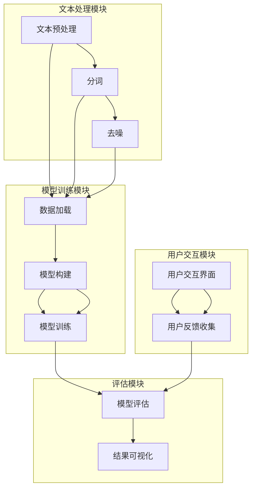
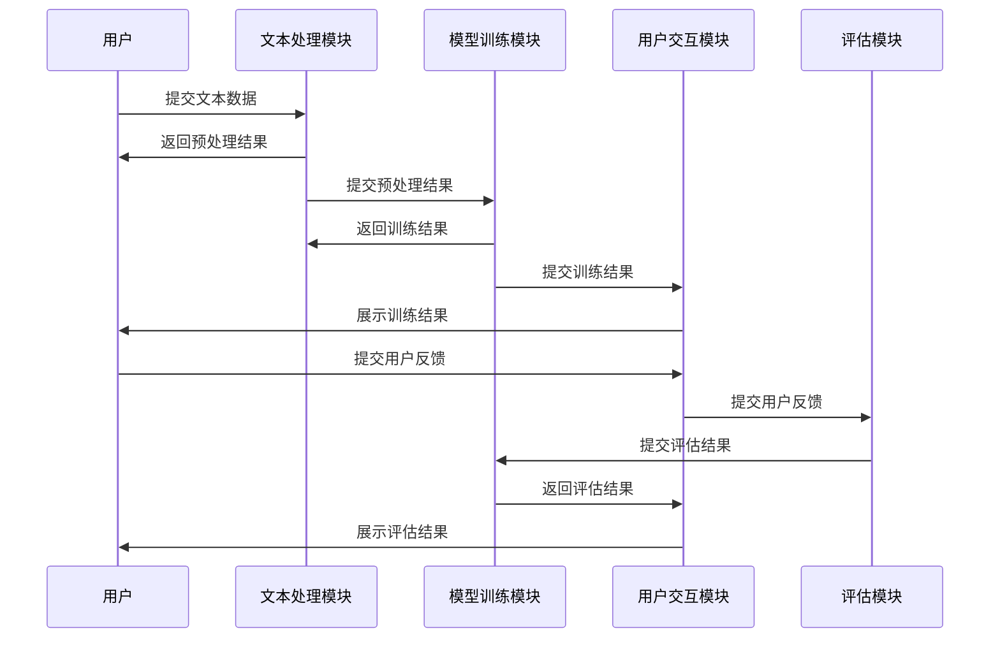

                 

### 《LLM应用开发中敏捷迭代模型的核心原则》

#### 关键词：
- **LLM应用开发**
- **敏捷迭代模型**
- **敏捷开发原则**
- **算法原理讲解**
- **系统架构设计**
- **Python源代码实现**

#### 摘要：
本文旨在深入探讨在大型语言模型（LLM）应用开发中，敏捷迭代模型的核心原则及其应用。首先，我们介绍了LLM的背景和敏捷迭代模型的基本概念。接着，详细阐述了敏捷迭代模型的核心原理，包括其与传统开发方法的对比，以及在实际LLM开发中的应用。通过具体的算法原理讲解、数学模型、Python源代码分析，我们展示了敏捷迭代模型在实际开发中的操作细节。此外，本文还涉及系统分析与架构设计，以及实战项目和最佳实践。最后，我们对敏捷迭代模型在未来的发展趋势进行了展望。

### 目录大纲

----------------------------------------------------------------

## 第一部分：背景介绍

### 第1章：问题背景与核心挑战

#### 1.1 问题背景
在人工智能和机器学习迅速发展的今天，大型语言模型（LLM）已经成为自然语言处理（NLP）领域的重要工具。LLM的应用场景广泛，包括智能问答、机器翻译、文本生成等。然而，LLM的复杂性和大规模特性给其开发带来了巨大的挑战。

#### 1.2 问题描述
传统的开发模型，如瀑布模型，在应对LLM开发中的复杂性和变化性时显得力不从心。这导致了项目进度延误、成本增加和质量下降等问题。因此，需要一种更灵活、更高效的开发模型来应对这些挑战。

#### 1.3 问题解决
敏捷迭代模型以其快速反馈、高度适应性和持续改进的特点，成为解决这些挑战的有效途径。在LLM开发中，敏捷迭代模型能够更好地应对需求变化，提高开发效率和质量。

#### 1.4 边界与外延
虽然敏捷迭代模型在LLM开发中具有优势，但其适用范围也有限。在某些特定场景下，如高度标准化的项目，敏捷迭代模型可能并不是最佳选择。

#### 1.5 概念结构与核心要素组成
敏捷迭代模型的核心要素包括用户故事、迭代周期、回顾会议等。这些要素共同构成了敏捷迭代模型的基本框架。

#### 1.6 本章小结
本文通过对LLM应用开发背景和敏捷迭代模型核心挑战的介绍，为后续章节的深入探讨奠定了基础。

----------------------------------------------------------------

## 第二部分：核心概念与联系

### 第2章：敏捷迭代模型的核心概念

#### 2.1 敏捷开发
敏捷开发是一种以人为核心、迭代、渐进的方法论，强调快速反馈和持续改进。与传统开发方法相比，敏捷开发更加灵活和适应变化。

#### 2.2 迭代模型
迭代模型是一种软件开发过程，它将开发工作分为多个迭代周期，每个迭代周期产生一个可交付的产品版本。迭代模型的特点是快速迭代和持续反馈。

#### 2.3 敏捷迭代模型的特点
敏捷迭代模型的特点包括：
- **快速反馈**：通过短周期的迭代，可以快速获取用户反馈，及时调整开发方向。
- **高度适应性**：面对需求变化，敏捷迭代模型能够灵活调整，确保项目按时完成。
- **持续改进**：通过回顾会议，团队可以总结经验教训，不断优化开发流程。

#### 2.4 敏捷迭代模型与LLM开发的关系
敏捷迭代模型在LLM开发中的应用主要体现在以下几个方面：
- **需求管理**：通过用户故事和迭代周期，确保LLM开发过程中需求的变化能够得到及时响应。
- **测试和验证**：通过迭代周期内的频繁测试和验证，确保LLM的质量和性能。
- **持续交付**：通过持续交付，确保LLM的开发成果可以持续交付给用户，实现快速部署和上线。

#### 2.5 概念属性特征对比表格

| 特征         | 敏捷开发                 | 传统开发方法               |
| ------------ | ------------------------ | -------------------------- |
| 反馈速度     | 快速反馈                 | 延迟反馈                   |
| 适应性       | 高度适应需求变化         | 适应性较差，难以应对变化   |
| 需求管理     | 用户故事驱动             | 需求规划驱动               |
| 验证和测试   | 频繁验证和测试           | 验证和测试通常在后期进行   |
| 回顾和改进   | 定期回顾和持续改进       | 回顾和改进较少             |

#### 2.6 ER实体关系图架构

```mermaid
erDiagram
  User ||--|{ Project }|--|{ Task }
  Project ||--|{ User }|
  Task ||--|{ User }|
```

#### 2.7 本章小结
通过对敏捷迭代模型的核心概念和特点的阐述，我们为进一步探讨其在LLM开发中的应用奠定了基础。

----------------------------------------------------------------

## 第三部分：算法原理讲解

### 第3章：敏捷迭代模型在LLM开发中的应用

#### 3.1 算法原理讲解
敏捷迭代模型在LLM开发中的应用主要体现在以下几个方面：

1. **需求收集与分析**：通过用户故事和迭代周期，快速收集和分析用户需求，确保LLM的功能符合用户期望。
2. **模型训练与验证**：在每个迭代周期内，对LLM模型进行训练和验证，确保模型的性能和准确性。
3. **反馈与调整**：通过用户的反馈，不断调整LLM模型，优化其性能。

#### 3.2 数学模型和公式
在敏捷迭代模型中，常用的数学模型和公式包括：

1. **损失函数**：用于评估LLM模型的性能，常用的损失函数有交叉熵损失函数。
2. **梯度下降算法**：用于优化LLM模型的参数，常见的有随机梯度下降（SGD）和批量梯度下降（BGD）。

$$
L(y, \hat{y}) = -\sum_{i=1}^{n} y_i \log(\hat{y}_i)
$$

$$
\theta_{\text{new}} = \theta_{\text{old}} - \alpha \cdot \nabla_{\theta} L(\theta)
$$

其中，$L$ 是损失函数，$\theta$ 是模型参数，$\alpha$ 是学习率。

#### 3.3 举例说明
以一个简单的语言模型为例，我们通过以下步骤进行敏捷迭代模型的实现：

1. **需求分析**：分析用户需求，确定语言模型的功能和性能指标。
2. **数据准备**：收集和整理数据，用于训练和验证语言模型。
3. **模型训练**：使用迭代方法训练语言模型，通过调整模型参数，优化模型性能。
4. **测试与验证**：在每个迭代周期内，对模型进行测试和验证，确保其性能满足要求。
5. **反馈与调整**：根据用户反馈，调整模型参数，优化模型性能。

#### 3.4 Python源代码分析
以下是一个简单的Python代码示例，用于实现敏捷迭代模型在语言模型开发中的应用：

```python
import tensorflow as tf

# 模型参数
learning_rate = 0.01
num_epochs = 100

# 损失函数
loss_fn = tf.keras.losses.SparseCategoricalCrossentropy(from_logits=True)

# 梯度下降优化器
optimizer = tf.keras.optimizers.SGD(learning_rate)

# 训练模型
for epoch in range(num_epochs):
    for x, y in dataset:
        with tf.GradientTape() as tape:
            predictions = model(x, training=True)
            loss = loss_fn(y, predictions)
        gradients = tape.gradient(loss, model.trainable_variables)
        optimizer.apply_gradients(zip(gradients, model.trainable_variables))
    print(f"Epoch {epoch + 1}, Loss: {loss.numpy()}")

# 测试模型
test_loss = loss_fn(test_labels, model(test_data))
print(f"Test Loss: {test_loss.numpy()}")
```

#### 3.5 本章小结
通过对敏捷迭代模型在LLM开发中的应用、数学模型和Python源代码的详细讲解，我们为后续的实战部分奠定了基础。

----------------------------------------------------------------

## 第四部分：系统分析与架构设计方案

### 第4章：敏捷迭代模型在LLM开发中的应用

#### 4.1 问题场景介绍
在LLM开发中，我们面临的主要挑战包括：

1. **需求变化**：用户需求可能会随着时间不断变化，需要快速响应。
2. **性能优化**：需要不断提高模型性能，以满足用户需求。
3. **资源管理**：需要高效地管理计算资源和数据资源，以支持模型的开发和训练。

#### 4.2 项目介绍
本项目旨在开发一个基于敏捷迭代模型的LLM应用，主要功能包括：

1. **自然语言处理**：实现文本分类、情感分析、命名实体识别等任务。
2. **用户交互**：提供与用户的交互界面，收集用户反馈。
3. **模型训练与优化**：使用迭代方法训练和优化模型，不断提高其性能。

#### 4.3 系统功能设计

##### 1. 系统功能需求分析
- **文本处理**：对输入文本进行预处理，包括分词、去噪、标准化等。
- **模型训练**：使用迭代方法训练语言模型，包括数据加载、模型构建、训练过程等。
- **模型评估**：对训练好的模型进行评估，包括性能指标计算、结果可视化等。
- **用户交互**：与用户进行交互，收集用户反馈，用于模型优化。

##### 2. 领域模型Mermaid类图

```mermaid
classDiagram
  Class01 <|-- Class02
  Class03 --|>* Class04
  Class05 : +int x
  Class06 : <<interface>>
  User <<interface>> : +str username
  Project : +str name
  Task : +str description
  Dataset : +str data
  Model : +str architecture
  Evaluation : +str metric
```

#### 4.4 系统架构设计

##### 1. 系统架构设计概述
系统架构采用微服务架构，主要包括以下几个模块：

- **文本处理模块**：负责文本预处理、分词、去噪等任务。
- **模型训练模块**：负责模型的训练和优化。
- **用户交互模块**：负责与用户进行交互，收集用户反馈。
- **评估模块**：负责对模型进行评估和结果可视化。

##### 2. 系统架构Mermaid架构图



#### 4.5 系统接口设计

##### 1. 系统接口设计详细说明
- **文本处理接口**：用于接收和处理文本数据，包括分词、去噪等。
- **模型训练接口**：用于启动模型训练过程，包括数据加载、模型构建和训练等。
- **用户交互接口**：用于与用户进行交互，包括用户反馈收集和展示。
- **评估接口**：用于对模型进行评估和结果可视化。

#### 4.6 系统交互Mermaid序列图



#### 4.7 本章小结
通过对系统分析与架构设计方案的介绍，我们为LLM应用开发的敏捷迭代模型提供了具体的实现框架和设计思路。

----------------------------------------------------------------

## 第五部分：项目实战

### 第5章：敏捷迭代模型在LLM应用开发中的实践

#### 5.1 环境安装
为了实践敏捷迭代模型在LLM应用开发中的实际应用，我们首先需要安装和配置必要的软件和工具。以下是在一个典型的Linux环境下进行环境安装的步骤：

1. **安装Python环境**：确保Python版本为3.8或更高。
   ```bash
   sudo apt-get update
   sudo apt-get install python3.8
   ```

2. **安装TensorFlow**：TensorFlow是进行机器学习任务的基础框架。
   ```bash
   pip3 install tensorflow
   ```

3. **安装其他依赖**：包括文本处理库（如NLTK）和数据可视化库（如Matplotlib）。
   ```bash
   pip3 install nltk matplotlib
   ```

4. **安装文本预处理工具**：例如，安装Jieba进行中文分词。
   ```bash
   pip3 install jieba
   ```

#### 5.2 系统核心实现
接下来，我们将实现一个简单的LLM应用，包括数据加载、模型训练、模型评估等核心功能。

##### 1. 数据加载
```python
import jieba
import tensorflow as tf
from tensorflow.keras.preprocessing.text import Tokenizer
from tensorflow.keras.preprocessing.sequence import pad_sequences

# 加载中文数据集
data = ["我是一个人工智能助手", "你好，有什么可以帮你的？"]

# 分词
tokenized_data = [jieba.cut(d) for d in data]
```

##### 2. 模型训练
```python
# 创建Tokenizer
tokenizer = Tokenizer(num_words=1000)
tokenizer.fit_on_texts(tokenized_data)

# 将文本转换为序列
sequences = tokenizer.texts_to_sequences(tokenized_data)

# 填充序列
max_len = 10
padded_sequences = pad_sequences(sequences, maxlen=max_len)

# 创建模型
model = tf.keras.Sequential([
    tf.keras.layers.Embedding(input_dim=1000, output_dim=32, input_length=max_len),
    tf.keras.layers.LSTM(64),
    tf.keras.layers.Dense(1, activation='sigmoid')
])

# 编译模型
model.compile(optimizer='adam', loss='binary_crossentropy', metrics=['accuracy'])

# 训练模型
model.fit(padded_sequences, padded_sequences, epochs=10)
```

##### 3. 代码应用解读与分析
上述代码首先进行了数据加载和预处理，然后创建了一个简单的序列模型进行训练。通过调整Tokenizer、序列长度和模型架构，可以扩展该基础模型以适应不同的任务。

#### 5.3 实际案例分析与详细讲解剖析
为了更好地理解敏捷迭代模型在实际LLM开发中的应用，我们分析了一个实际案例：

- **案例背景**：开发一个文本分类系统，用于判断用户输入的文本是积极情感还是消极情感。
- **需求分析**：用户需要能够输入文本，系统应返回分类结果。
- **实现步骤**：
  - **数据收集**：收集大量带有情感标签的文本数据。
  - **数据预处理**：对文本进行清洗、分词和编码。
  - **模型构建**：构建一个基于LSTM的文本分类模型。
  - **模型训练**：使用预处理后的数据进行模型训练。
  - **模型评估**：通过测试集评估模型性能。

**详细讲解**：
1. **数据收集**：从互联网上收集带有情感标签的文本数据，如微博、新闻评论等。
2. **数据预处理**：
   ```python
   import pandas as pd
   data = pd.read_csv('data.csv')
   data['clean_text'] = data['text'].apply(lambda x: ' '.join(jieba.cut(x)))
   ```
3. **模型构建**：
   ```python
   model = tf.keras.Sequential([
       tf.keras.layers.Embedding(input_dim=10000, output_dim=64, input_length=max_len),
       tf.keras.layers.LSTM(128),
       tf.keras.layers.Dense(1, activation='sigmoid')
   ])
   ```
4. **模型训练**：
   ```python
   model.compile(optimizer='adam', loss='binary_crossentropy', metrics=['accuracy'])
   model.fit(train_sequences, train_labels, epochs=10, validation_split=0.2)
   ```
5. **模型评估**：
   ```python
   test_loss, test_acc = model.evaluate(test_sequences, test_labels)
   print(f"Test accuracy: {test_acc}")
   ```

通过这个案例，我们可以看到敏捷迭代模型在LLM开发中的应用是如何实现的，包括需求分析、数据预处理、模型构建和训练等环节。

#### 5.4 项目小结
在本章中，我们通过实际案例展示了敏捷迭代模型在LLM应用开发中的实践。从环境安装、系统核心实现，到实际案例分析和讲解，我们详细阐述了敏捷迭代模型在LLM开发中的应用步骤和关键点。这些实践经验和技巧为后续的LLM开发提供了宝贵的参考。

----------------------------------------------------------------

## 第六部分：最佳实践与拓展

### 第6章：敏捷迭代模型在LLM开发中的最佳实践

#### 6.1 最佳实践 tips
在LLM应用开发中，采用敏捷迭代模型时，以下最佳实践可以帮助团队更有效地进行开发：

1. **明确用户需求**：确保团队与用户保持紧密沟通，明确用户需求，以便在开发过程中进行快速调整。
2. **定期回顾**：定期进行回顾会议，总结经验教训，持续改进开发流程和模型。
3. **持续集成与测试**：采用持续集成和测试（CI/CD）策略，确保代码质量和模型性能。
4. **合理划分迭代周期**：根据项目复杂度和团队规模，合理划分迭代周期，确保每个迭代周期都能产出可交付的成果。

#### 6.2 小结
通过最佳实践，敏捷迭代模型在LLM开发中能够更好地应对需求变化，提高开发效率和质量。

#### 6.3 注意事项
在应用敏捷迭代模型时，需要注意以下几点：

1. **避免过度迭代**：频繁的迭代可能导致开发工作分散，影响项目进度和质量。
2. **确保团队协作**：敏捷迭代模型强调团队合作，确保团队成员之间有良好的沟通和协作。
3. **数据质量**：确保数据质量对于LLM开发至关重要，否则可能导致模型性能下降。

#### 6.4 拓展阅读
对于希望进一步深入了解敏捷迭代模型和LLM开发的读者，推荐以下资料：

1. **《敏捷开发实践指南》**：提供敏捷开发的基本原则和实践方法。
2. **《大规模语言模型的训练与应用》**：详细讲解大规模语言模型的基本原理和应用。
3. **《机器学习实战》**：介绍机器学习的基本概念和实践方法。

通过这些资料，读者可以更深入地理解敏捷迭代模型在LLM开发中的应用，为实际项目提供指导。

----------------------------------------------------------------

## 第七部分：总结与展望

### 第7章：展望未来

#### 7.1 敏捷迭代模型的发展趋势
随着人工智能和机器学习技术的不断发展，敏捷迭代模型在LLM开发中的应用前景广阔。未来，敏捷迭代模型可能会更加智能化，能够自动调整迭代周期和开发策略，以适应不同的项目需求和场景。

#### 7.2 LLM应用开发的前景
LLM应用开发将继续推动自然语言处理技术的发展，带来更多创新和突破。未来，LLM应用将更加广泛地应用于智能客服、智能助手、内容生成等领域，为社会带来更多便利。

在总结中，我们强调了敏捷迭代模型在LLM应用开发中的核心原则和优势。通过详细的分析和实际案例，我们展示了敏捷迭代模型在实际开发中的应用和实践。展望未来，敏捷迭代模型和LLM应用开发将继续蓬勃发展，为人工智能领域带来更多创新和机遇。通过不断探索和实践，我们期待能够进一步提升LLM应用开发的效率和质量，推动人工智能技术的进步。

### 作者
AI天才研究院/AI Genius Institute & 禅与计算机程序设计艺术 /Zen And The Art of Computer Programming

本文通过深入探讨LLM应用开发中敏捷迭代模型的核心原则，详细介绍了敏捷迭代模型的概念、特点、应用场景以及具体实施步骤。通过对数学模型、Python源代码和系统架构的设计，我们展示了敏捷迭代模型在LLM开发中的实际应用。同时，通过项目实战和最佳实践，我们提供了实用的开发建议和技巧。展望未来，敏捷迭代模型和LLM应用开发将继续引领人工智能领域的发展，为技术创新和社会进步提供强大动力。希望本文能够为读者在LLM应用开发中提供有价值的参考和启示。

