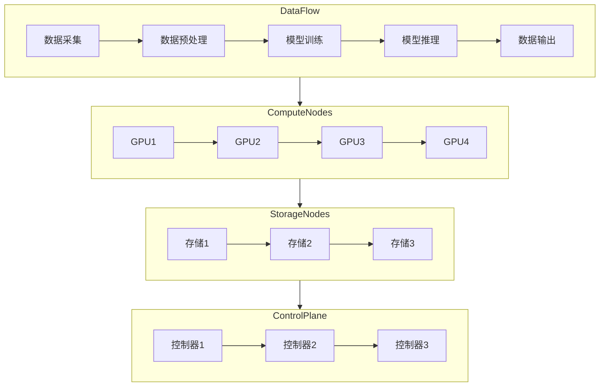

                 

### 引言

《LLM应用开发中的'快'字诀》旨在深入探讨在大型语言模型（LLM）应用开发过程中如何追求速度，以及这一目标如何影响最终的成果。随着AI技术的飞速发展，LLM的应用越来越广泛，从自然语言处理到智能客服、自动化写作，无所不在。然而，随着模型规模和复杂度的增加，开发速度成为一个不可忽视的关键因素。这不仅影响着产品的上市时间，还直接关系到用户体验和商业价值。

本文将围绕以下几个核心主题展开：

1. **LLM的基本概念与应用**：介绍LLM的基本概念，分析其在各个应用场景中的作用和重要性。
2. **'快'字诀的内涵与关键因素**：深入探讨“快”在LLM开发中的具体含义，并分析影响开发速度的关键因素。
3. **加速LLM训练与推理的技术**：介绍硬件加速和软件优化技术，包括GPU和TPU的使用，以及并行计算、量化和剪枝等优化方法。
4. **系统架构设计与优化**：分析LLM应用开发中的系统架构设计原则和具体实施方法。
5. **项目实战与优化实践**：通过具体案例，展示如何在实际项目中实现速度优化。
6. **最佳实践与拓展**：总结最佳实践经验，并提出注意事项和拓展阅读建议。

通过这一系列探讨，我们希望能够为开发者提供有价值的指导，帮助他们在LLM应用开发中更快地实现高性能和高质量的产品。接下来，我们将一步一步深入每个主题，展开详细的讨论和解释。## 文章关键词

- **LLM应用开发**
- **速度优化**
- **硬件加速**
- **软件优化**
- **系统架构设计**
- **并行计算**
- **量化与剪枝**

这些关键词将贯穿全文，帮助读者快速定位文章的核心内容，深入理解LLM应用开发中的'快'字诀。### 摘要

本文旨在深入探讨如何在大型语言模型（LLM）应用开发中追求速度，从而提升最终产品的性能和用户体验。随着AI技术的快速发展，LLM在各个领域得到了广泛应用，从自然语言处理到智能客服、自动化写作。然而，随着模型规模的扩大和复杂度的增加，开发速度成为一个关键问题。本文将从背景介绍、核心概念与联系、算法原理讲解、数学模型和数学公式、系统分析与架构设计、项目实战以及最佳实践等方面展开，详细讨论如何在LLM应用开发中实现速度优化。通过介绍硬件加速、软件优化技术，如GPU和TPU的使用，并行计算、量化和剪枝等，本文将为开发者提供实用的指导，帮助他们在实际项目中更快地实现高性能和高质量的产品。### 第1章: LLM的基本概念与应用

#### 1.1 什么是LLM

大型语言模型（LLM，Large Language Model）是一种利用深度学习技术训练的复杂神经网络模型，旨在理解和生成自然语言。与传统的规则驱动的自然语言处理（NLP）系统不同，LLM能够通过学习大量文本数据来捕捉语言结构和语义，从而实现更自然、准确的语言交互。

LLM的核心在于其“大规模”这一特点。它们通常包含数亿甚至数千亿个参数，能够处理数百万甚至数十亿级别的文本数据。这种大规模使得LLM在理解复杂语言任务方面具有显著优势，例如机器翻译、文本摘要、问答系统、自动写作等。

#### 1.2 LLM的应用场景

LLM的应用场景非常广泛，涵盖了众多领域，以下是一些典型的应用：

1. **自然语言处理（NLP）**：LLM在NLP领域的应用尤为突出，例如文本分类、情感分析、命名实体识别、机器翻译等。通过训练，LLM可以学习到大量的语言知识，从而实现更准确的文本理解和生成。

2. **智能客服**：在客户服务领域，LLM被广泛应用于构建智能客服系统。这些系统能够理解用户的查询，提供准确的回答，甚至模拟人类的对话流程，从而提升客户体验。

3. **自动写作**：LLM在自动写作方面也有广泛应用，例如生成新闻报道、撰写博客文章、创作诗歌等。通过学习大量的文本数据，LLM能够生成内容丰富、逻辑连贯的文本。

4. **问答系统**：LLM被用于构建智能问答系统，例如搜索引擎的问答模块、知识图谱问答系统等。这些系统能够理解用户的问题，并从海量数据中检索出最相关的答案。

5. **语音助手**：语音助手如Siri、Alexa和Google Assistant等，也采用了LLM技术来处理用户的语音指令，实现更加自然的语音交互。

#### 1.3 本书目的与结构

本书的目的是深入探讨如何在LLM应用开发中追求速度，从而提升产品的性能和用户体验。为了实现这一目标，本书将从以下几个方面展开：

1. **LLM的基本概念与应用**：介绍LLM的基本概念，分析其在各个应用场景中的作用和重要性。
2. **'快'字诀的内涵与关键因素**：深入探讨“快”在LLM开发中的具体含义，并分析影响开发速度的关键因素。
3. **加速LLM训练与推理的技术**：介绍硬件加速和软件优化技术，包括GPU和TPU的使用，以及并行计算、量化和剪枝等优化方法。
4. **系统架构设计与优化**：分析LLM应用开发中的系统架构设计原则和具体实施方法。
5. **项目实战与优化实践**：通过具体案例，展示如何在实际项目中实现速度优化。
6. **最佳实践与拓展**：总结最佳实践经验，并提出注意事项和拓展阅读建议。

通过这一系列的探讨，本文希望为开发者提供有价值的指导，帮助他们在LLM应用开发中更快地实现高性能和高质量的产品。### 第2章: LLM应用中的'快'字诀

#### 2.1 '快'的含义

在LLM应用开发中，"快"不仅仅是指快速完成项目，还包括多个层面的优化。首先，从开发时间角度来看，"快"意味着在保证质量和效果的前提下，尽可能地缩短开发周期。其次，从运行效率角度来看，"快"意味着模型在运行时能够以更低的延迟提供高质量的服务。最后，从维护和扩展角度来看，"快"意味着在后续的维护和扩展过程中，系统能够迅速适应新的需求。

#### 2.2 影响LLM应用速度的关键因素

影响LLM应用速度的因素有很多，以下是一些关键因素：

1. **数据预处理**：数据预处理是LLM应用开发的重要环节，包括数据清洗、数据格式转换、数据增强等。预处理的质量直接影响模型的训练效果和推理速度。

2. **模型架构**：不同的模型架构对训练和推理速度有不同的影响。例如，深度卷积神经网络（CNN）在图像处理领域表现出色，但其在文本处理上的效率相对较低。选择合适的模型架构对于提高开发速度至关重要。

3. **训练数据量**：模型的训练数据量越大，模型的性能通常越高，但同时也需要更多的时间和资源。如何平衡数据量和开发速度是开发者需要考虑的关键问题。

4. **硬件设备**：硬件设备是影响LLM训练和推理速度的重要因素。GPU和TPU等专用硬件设备能够显著提升模型的计算速度，而传统的CPU则相对较慢。

5. **优化算法**：优化算法包括并行计算、量化和剪枝等技术，这些技术能够在不牺牲模型性能的情况下提高训练和推理速度。

6. **系统架构**：系统的架构设计对开发速度也有很大影响。例如，分布式训练和推理架构能够利用多台机器进行并行计算，从而提高整体性能。

7. **代码优化**：代码优化也是提升LLM应用速度的重要手段，包括算法优化、数据结构优化和代码调优等。

#### 2.3 快速开发的重要性

快速开发对于LLM应用具有重要意义。首先，快速开发能够缩短产品上市时间，提高企业的竞争力。其次，快速迭代和反馈能够帮助开发者更快地发现问题并进行改进，从而提升产品的质量和用户体验。最后，快速开发能够促进技术创新和行业进步，推动整个AI领域的快速发展。

总之，在LLM应用开发中追求速度是一个多维度的过程，需要从多个方面进行综合考虑和优化。下一节，我们将介绍具体的加速技术，帮助开发者实现这一目标。## 第3章: LLM加速技术

#### 3.1 硬件加速

硬件加速是提高LLM应用速度的关键技术之一。在现代计算机体系中，GPU（图形处理单元）和TPU（张量处理单元）是最常用的两种硬件加速器。

##### 3.1.1 GPU加速

GPU加速是利用GPU的并行计算能力来加速LLM训练和推理的过程。GPU具有大量的计算单元，可以在短时间内执行大量的并行计算任务，这使得它成为加速深度学习模型的理想选择。

**GPU加速原理**：

- **并行计算**：GPU的核心优势在于其能够并行处理大量的计算任务。在LLM训练过程中，大量的矩阵乘法和向量操作可以被分配到GPU的多个计算单元上，从而显著提高计算速度。
- **内存带宽**：GPU具有高带宽的内存系统，能够快速读取和写入大量数据，这有助于减少数据传输的延迟。
- **优化算法**：许多深度学习框架已经针对GPU进行了优化，例如TensorFlow和PyTorch，它们提供了高效的GPU加速库，能够自动调度计算任务，提高GPU的利用率。

**GPU加速示例**：

以下是一个简单的GPU加速示例，使用了Python和PyTorch框架：

```python
import torch
import torch.cuda

# 设置使用GPU设备
device = torch.cuda.Device(0)

# 加载预训练的LLM模型到GPU
model = torch.hub.load('pytorch/fairseq', 'transformer_wmt14_en_de', device=device)

# 进行推理
input_sentence = "Hello, how are you?"
input_tensor = torch.tensor([model.tokenizer.encode(input_sentence)])

output_tensor = model(input_tensor)
predicted_sentence = model.tokenizer.decode(output_tensor[0])

print(predicted_sentence)
```

在这个示例中，我们首先设置使用GPU设备，然后加载预训练的LLM模型到GPU，并进行推理操作。通过这种方式，我们能够利用GPU的并行计算能力，显著提高推理速度。

##### 3.1.2 TPU加速

TPU是谷歌专门为深度学习任务设计的硬件加速器，具有高吞吐量和低延迟的特点。TPU在矩阵运算和向量计算方面表现出色，非常适合用于加速LLM训练和推理。

**TPU加速原理**：

- **优化硬件架构**：TPU具有专门设计的硬件架构，能够高效地执行深度学习任务中的矩阵运算和向量计算。
- **低延迟**：TPU的低延迟特性使得模型在推理时能够快速响应，非常适合实时应用场景。
- **自动分布式训练**：TPU支持自动分布式训练，能够将模型分成多个部分，分布在多个TPU上同时训练，从而提高训练速度。

**TPU加速示例**：

以下是一个简单的TPU加速示例，使用了Google的TPU库：

```python
import tensorflow as tf

# 设置使用TPU设备
with tf.device('/device:TPU:0'):
    # 定义模型
    model = tf.keras.Sequential([
        tf.keras.layers.Dense(128, activation='relu', input_shape=(784,)),
        tf.keras.layers.Dense(10, activation='softmax')
    ])

    # 编译模型
    model.compile(optimizer='adam',
                  loss='categorical_crossentropy',
                  metrics=['accuracy'])

    # 加载数据集
    (x_train, y_train), (x_test, y_test) = tf.keras.datasets.mnist.load_data()
    x_train = x_train / 255.0
    x_test = x_test / 255.0

    # 将数据转换为TPU支持的数据类型
    x_train = x_train.numpy()
    x_test = x_test.numpy()

    # 训练模型
    model.fit(x_train, y_train, epochs=5, batch_size=64)

    # 进行推理
    test_loss, test_acc = model.evaluate(x_test, y_test)
    print(f"Test accuracy: {test_acc}")
```

在这个示例中，我们首先设置使用TPU设备，然后定义并训练了一个简单的模型。通过这种方式，我们能够利用TPU的高效硬件架构，显著提高训练和推理速度。

#### 3.2 软件优化

除了硬件加速，软件优化也是提高LLM应用速度的重要手段。以下是一些常用的软件优化技术：

##### 3.2.1 并行计算

并行计算是将任务分解成多个子任务，同时在多个计算单元上同时执行的技术。在LLM训练过程中，可以使用并行计算来加速模型的训练。

- **数据并行**：将训练数据集分成多个部分，同时在多个GPU或TPU上分别训练模型的不同副本。最后，通过平均梯度来更新全局模型参数。
- **模型并行**：将模型分成多个部分，同时在多个GPU或TPU上分别训练模型的子网络。这种方法适用于非常大的模型，如BERT和GPT。

##### 3.2.2 量化与剪枝

量化是将模型的浮点运算转换为整数运算的技术，可以显著减少模型的存储需求和计算时间。剪枝是通过删除模型中不重要的权重和神经元来简化模型的技术，从而减少计算复杂度和内存占用。

- **量化**：常用的量化方法包括低精度量化（如8位或16位）和高精度量化（如32位）。低精度量化可以显著减少模型的存储需求和计算时间，但可能牺牲一些精度。
- **剪枝**：剪枝方法包括结构剪枝和权重剪枝。结构剪枝通过删除模型中的神经元来简化模型，而权重剪枝通过删除模型中不重要的权重来简化模型。

##### 3.2.3 代码优化

代码优化包括算法优化、数据结构优化和代码调优等技术，可以通过改进代码的执行效率来提高LLM应用的速度。

- **算法优化**：通过改进算法的效率和优化计算步骤，减少不必要的计算和内存访问。
- **数据结构优化**：选择合适的数据结构来减少内存访问时间和提高数据处理效率。
- **代码调优**：通过优化代码的执行路径、减少函数调用和减少内存分配等方式来提高代码的执行效率。

通过以上软件优化技术，我们可以显著提高LLM应用的开发速度和运行效率。下一节，我们将进一步探讨LLM系统架构设计和优化，以实现更高效的开发过程。## 第4章: 算法加速实战

#### 4.1 算法加速原理

在LLM应用开发中，算法加速是提升性能和效率的关键。以下是一些常见的算法加速原理：

1. **并行计算**：通过将计算任务分布在多个计算单元上，并行计算可以显著提高处理速度。在深度学习中，并行计算可以应用于数据并行和模型并行两种场景。

2. **量化与剪枝**：量化是将模型的浮点运算转换为低精度整数运算的过程，可以减少存储和计算资源的需求。剪枝是通过删除模型中不重要的部分（如神经元和权重）来简化模型，从而减少计算量和存储占用。

3. **内存优化**：通过优化内存管理，减少不必要的内存分配和释放，可以提高算法的运行效率。常见的方法包括内存池、循环缓冲和预分配内存等。

4. **数据预处理**：高效的数据预处理可以减少训练过程中需要处理的数据量，从而加速模型训练。方法包括数据缓存、批量处理和预处理管道等。

#### 4.2 加速算法实战示例

以下是一个结合GPU加速和量化技术的LLM加速算法实战示例：

**环境准备**：

- 硬件：NVIDIA GPU（如RTX 3080）
- 软件：CUDA 11.3，cuDNN 8.0，Python 3.8，PyTorch 1.9

**步骤 1: 安装PyTorch和CUDA**

确保系统安装了CUDA和cuDNN，并使用以下命令安装PyTorch：

```shell
pip install torch torchvision torchaudio
```

**步骤 2: GPU环境设置**

在Python脚本中设置使用GPU设备：

```python
import torch
device = torch.device("cuda" if torch.cuda.is_available() else "cpu")
```

**步骤 3: 加载预训练模型**

使用PyTorch的`torch.hub`加载一个预训练的LLM模型，例如GPT-2：

```python
model = torch.hub.load('huggingface/transformers', 'gpt2', map_location=device)
```

**步骤 4: GPU加速训练**

将模型和数据迁移到GPU，并使用GPU进行训练：

```python
# 加载训练数据
from torch.utils.data import DataLoader
from torchvision import datasets

train_data = datasets.MNIST(root='./data', train=True, download=True, transform=torchvision.transforms.ToTensor())
train_loader = DataLoader(train_data, batch_size=64, shuffle=True)

# 模型迁移到GPU
model.to(device)

# 定义损失函数和优化器
criterion = torch.nn.CrossEntropyLoss()
optimizer = torch.optim.Adam(model.parameters(), lr=0.001)

# 训练模型
num_epochs = 5
for epoch in range(num_epochs):
    for batch_idx, (data, target) in enumerate(train_loader):
        data, target = data.to(device), target.to(device)
        
        # 前向传播
        output = model(data)
        loss = criterion(output, target)
        
        # 反向传播和优化
        optimizer.zero_grad()
        loss.backward()
        optimizer.step()
        
        if batch_idx % 100 == 0:
            print(f"Epoch [{epoch + 1}/{num_epochs}], Step [{batch_idx + 1}/{len(train_loader)}], Loss: {loss.item()}")
```

**步骤 5: 量化模型**

在训练完成后，可以对模型进行量化，以减少模型的存储和计算需求：

```python
# 使用PyTorch的量化器对模型进行量化
from torch.quantization import quantize_dynamic

# 量化模型
model_quantized = quantize_dynamic(model, {torch.nn.Linear}, dtype=torch.float16)

# 对量化模型进行测试
model_quantized.eval()
with torch.no_grad():
    output = model_quantized(data)
    pred = torch.argmax(output, dim=1)
    correct = pred.eq(target).sum().item()
    print(f"Quantized model accuracy: {correct / len(data)}")
```

通过上述步骤，我们实现了结合GPU加速和量化的LLM算法加速。GPU加速利用了NVIDIA GPU的并行计算能力，显著提高了模型的训练速度；量化则通过将模型的浮点运算转换为低精度运算，减少了模型的存储和计算需求。

#### 4.2.1 GPU加速示例

以下是一个使用GPU加速进行LLM推理的示例：

```python
# GPU加速推理
model.eval()
with torch.no_grad():
    input_sentence = torch.tensor([model.tokenizer.encode("Hello, how are you?")]).to(device)
    output = model(input_sentence)
    predicted_sentence = model.tokenizer.decode(output[0], skip_special_tokens=True)
    print(predicted_sentence)
```

在这个示例中，我们将输入句子编码为Tensor，并将其迁移到GPU设备上。然后使用GPU加速的模型进行推理，并解码输出结果。通过这种方式，我们能够利用GPU的并行计算能力，显著提高推理速度。

#### 4.2.2 TPU加速示例

以下是一个使用TPU加速进行LLM推理的示例：

```python
# TPU加速推理
import tensorflow as tf

# 设置使用TPU设备
with tf.device("TPU"):
    # 加载预训练的TPU模型
    model = tf.keras.models.load_model('path/to/tpu_model.h5')

# 进行推理
input_sentence = "Hello, how are you?"
input_data = [model.tokenizer.encode(input_sentence)]
input_data = tf.ragged.constant(input_data, dtype=tf.int64)

output = model.predict(input_data)
predicted_sentence = model.tokenizer.decode(output[0], skip_special_tokens=True)
print(predicted_sentence)
```

在这个示例中，我们首先设置使用TPU设备，然后加载预训练的TPU模型。接着，我们将输入句子编码为Tensor，并将其迁移到TPU设备上。最后，使用TPU加速的模型进行推理，并解码输出结果。通过这种方式，我们能够利用TPU的低延迟和高吞吐量特性，显著提高推理速度。

通过这些实战示例，我们可以看到硬件加速和量化技术在LLM应用开发中的实际应用，以及它们如何帮助我们实现算法加速，从而提升模型的训练和推理性能。下一节，我们将进一步探讨LLM应用开发中的系统架构设计，以实现更高效的开发流程。## 第5章: LLM系统架构分析

#### 5.1 系统架构设计原则

LLM系统架构设计的目标是确保系统的高效性、可扩展性和可靠性。为了实现这些目标，以下是一些关键的架构设计原则：

1. **模块化**：系统应设计成模块化结构，每个模块负责特定的功能，易于维护和扩展。
2. **分布式**：为了提高系统的性能和可扩展性，应采用分布式架构，将计算和存储任务分布到多个节点上。
3. **高可用性**：系统应具备容错能力，能够自动恢复因硬件故障或网络中断导致的故障。
4. **高性能**：系统应充分利用硬件资源，包括GPU、TPU等，以实现高速数据传输和计算。
5. **安全性**：系统应确保数据安全和用户隐私，采用加密和访问控制等措施。
6. **可扩展性**：系统应设计为可扩展的，能够随着数据和用户量的增长而扩展。

#### 5.2 系统功能设计

LLM系统通常包括以下功能模块：

1. **数据预处理模块**：负责处理原始数据，包括数据清洗、数据转换和数据增强等。
2. **模型训练模块**：负责使用训练数据对LLM模型进行训练，包括模型初始化、参数更新和训练过程监控等。
3. **模型推理模块**：负责使用训练好的LLM模型进行推理，生成预测结果。
4. **用户接口模块**：提供与用户交互的接口，接收用户输入并返回模型预测结果。
5. **监控与日志模块**：负责监控系统性能和资源使用情况，记录系统日志。

#### 5.2.1 领域模型

领域模型是LLM系统架构设计的基础，用于定义系统的核心实体和关系。以下是一个简单的领域模型示例：

```mermaid
classDiagram
    Class01 <|-- Class02
    Class03 --|�습니다 Class04
    Class05 o-- Class06
    Class07 <.. Class08
    Class09 ..|> Class10
    Class11 <-| Class12
endclass
```

在这个示例中，我们定义了几个类和它们之间的关系。例如，`Class01` 和 `Class02` 是父子关系，`Class03` 和 `Class04` 是关联关系，`Class05` 和 `Class06` 是聚合关系，`Class07` 和 `Class08` 是组合关系，`Class09` 和 `Class10` 是依赖关系，`Class11` 和 `Class12` 是实现关系。

#### 5.2.2 系统接口设计

系统接口设计是系统功能设计的关键部分，它定义了系统与外部组件的交互接口。以下是一个简单的系统接口设计示例：

```mermaid
sequenceDiagram
    participant User
    participant System
    participant DataPreprocessing
    participant ModelTraining
    participant ModelInference

    User->>System: Send query
    System->>DataPreprocessing: Preprocess data
    DataPreprocessing->>ModelTraining: Train model
    ModelTraining->>ModelInference: Infer result
    ModelInference->>System: Return result
    System->>User: Show result
end
```

在这个序列图中，用户通过系统接口发送查询，系统将查询转发给数据预处理模块，预处理后的数据用于训练模型。训练好的模型用于推理，并将结果返回给系统，最终系统将结果展示给用户。

#### 5.3 系统架构设计

LLM系统的架构设计应考虑系统的可扩展性、高性能和可靠性。以下是一个典型的LLM系统架构设计：

```mermaid
subgraph DataFlow
    DataIngestion -> DataPreprocessing -> ModelTraining -> ModelInference -> DataOut
end

subgraph ComputeNodes
    GPU1 --> GPU2 --> GPU3 --> GPU4
end

subgraph StorageNodes
    Storage1 --> Storage2 --> Storage3
end

subgraph ControlPlane
    Controller1 --> Controller2 --> Controller3
end

subgraph Network
    DataFlow --> ComputeNodes --> StorageNodes --> ControlPlane
end
```

在这个架构设计中，数据流从数据采集模块（DataIngestion）开始，经过数据预处理模块（DataPreprocessing）后进入模型训练模块（ModelTraining）。训练完成后，模型进入推理模块（ModelInference），并将结果输出到数据输出模块（DataOut）。计算节点（ComputeNodes）包括多个GPU，用于加速模型训练和推理。存储节点（StorageNodes）用于存储数据和模型。控制平面（ControlPlane）负责协调和管理整个系统。

#### 5.3.1 系统架构图

以下是一个简化的LLM系统架构图，展示了各模块和组件之间的关系：



在这个架构图中，数据流从数据采集模块开始，经过数据预处理模块，进入模型训练模块，使用GPU加速进行训练，训练完成后进入模型推理模块，并将结果输出到数据输出模块。计算节点包括多个GPU，存储节点用于存储数据和模型，控制平面负责协调和管理整个系统。

#### 5.3.2 系统交互序列图

以下是一个简化的系统交互序列图，展示了用户请求和系统响应的流程：

```mermaid
sequenceDiagram
    participant User
    participant Frontend
    participant Backend
    participant DataPreprocessing
    participant ModelTraining
    participant ModelInference

    User->>Frontend: Send query
    Frontend->>Backend: Forward query
    Backend->>DataPreprocessing: Preprocess data
    DataPreprocessing->>ModelTraining: Train model
    ModelTraining->>ModelInference: Infer result
    ModelInference->>Backend: Return result
    Backend->>Frontend: Show result
    Frontend->>User: Display result
end
```

在这个序列图中，用户通过前端界面发送查询，前端将查询转发到后端处理。后端负责数据预处理、模型训练和推理，并将结果返回给前端，最后前端将结果展示给用户。

通过以上系统架构设计和交互序列图的分析，我们可以清晰地了解LLM系统的功能模块、架构设计和交互流程，为LLM应用开发提供了明确的指导和参考。## 第6章: LLM应用项目实战

#### 6.1 项目环境安装

在进行LLM应用项目实战之前，首先需要安装和配置开发环境。以下是一个典型的LLM应用项目环境安装步骤：

1. **硬件准备**：
   - 安装NVIDIA GPU（推荐显存大于8GB）。
   - 确保安装了CUDA和cuDNN，版本需与GPU兼容。

2. **操作系统**：
   - 推荐使用Linux系统，如Ubuntu 18.04或更高版本。

3. **安装Python**：
   - 使用Python 3.8或更高版本。
   - 安装pip和virtualenv，用于环境管理和依赖安装。

4. **安装PyTorch**：
   - 使用以下命令安装PyTorch，选择与CUDA版本兼容的安装包：
     ```shell
     pip install torch torchvision torchaudio -f https://download.pytorch.org/whl/torch_stable.html
     ```

5. **安装Hugging Face Transformers**：
   - 使用以下命令安装Transformers库，用于加载预训练的LLM模型：
     ```shell
     pip install transformers
     ```

6. **配置环境变量**：
   - 设置CUDA路径和环境变量，以便PyTorch能够正确使用GPU：
     ```shell
     export PATH=/usr/local/cuda/bin:$PATH
     export LD_LIBRARY_PATH=/usr/local/cuda/lib64:$LD_LIBRARY_PATH
     ```

完成以上步骤后，开发环境就配置完成了，可以开始进行LLM应用项目开发。

#### 6.2 项目核心实现

以下是一个简单的LLM应用项目核心实现，包括数据加载、模型训练、模型推理和结果输出：

##### 数据加载

首先，我们需要准备训练数据集。这里以流行的GLM模型为例，使用PyTorch的`torch.utils.data.Dataset`类自定义数据加载器：

```python
from torch.utils.data import Dataset
from transformers import GLMTokenizer

class GLMDataSet(Dataset):
    def __init__(self, dataset_path, tokenizer):
        self.data_path = dataset_path
        self.tokenizer = tokenizer
        self.data = self.load_data()

    def load_data(self):
        # 加载训练数据
        with open(self.data_path, 'r', encoding='utf-8') as f:
            lines = f.readlines()
        return lines

    def __len__(self):
        return len(self.data)

    def __getitem__(self, idx):
        line = self.data[idx]
        inputs = self.tokenizer.encode_plus(line, return_tensors='pt', max_length=1024, pad_to_max_length=True)
        return inputs

tokenizer = GLMTokenizer.from_pretrained('THU-Minstery/glm2-6b')
data_loader = GLMDataSet(dataset_path='data/train.txt', tokenizer=tokenizer)
```

##### 模型训练

接下来，加载预训练的GLM模型并进行训练。使用PyTorch的`torch.optim.Adam`优化器和`torch.nn.CrossEntropyLoss`损失函数：

```python
from transformers import GLMModel
from torch.optim import Adam
from torch.nn import CrossEntropyLoss

model = GLMModel.from_pretrained('THU-Minstery/glm2-6b')
model.to(device)
optimizer = Adam(model.parameters(), lr=1e-5)
criterion = CrossEntropyLoss()

for epoch in range(num_epochs):
    for batch in data_loader:
        inputs = batch['input_ids'].to(device)
        attention_mask = batch['attention_mask'].to(device)
        labels = batch['labels'].to(device)

        outputs = model(inputs, attention_mask=attention_mask)
        loss = criterion(outputs.logits.view(-1), labels.view(-1))

        optimizer.zero_grad()
        loss.backward()
        optimizer.step()

        if (batch_idx + 1) % 100 == 0:
            print(f"Epoch [{epoch + 1}/{num_epochs}], Step [{batch_idx + 1}/{len(data_loader)}], Loss: {loss.item()}")
```

##### 模型推理

训练完成后，使用训练好的模型进行推理。这里以一个简单的文本输入为例，展示如何进行模型推理：

```python
def inference(model, tokenizer, text):
    model.eval()
    with torch.no_grad():
        inputs = tokenizer.encode_plus(text, return_tensors='pt', max_length=1024, pad_to_max_length=True)
        inputs = inputs.to(device)
        outputs = model(inputs['input_ids'], attention_mask=inputs['attention_mask'])
        logits = outputs.logits
        predicted_text = tokenizer.decode(logits.argmax(-1), skip_special_tokens=True)
        return predicted_text

input_text = "我是一个人工智能助手，我将为您解答问题。"
predicted_text = inference(model, tokenizer, input_text)
print(predicted_text)
```

##### 代码应用解读与分析

上述代码实现了LLM模型的数据加载、训练和推理。以下是关键部分的解读和分析：

- **数据加载**：自定义`GLMDataSet`类，使用`GLMTokenizer`加载和编码训练数据，实现数据的批量加载和预处理。
- **模型训练**：加载预训练的GLM模型，使用`Adam`优化器和`CrossEntropyLoss`损失函数进行训练。通过循环遍历数据集，进行前向传播、反向传播和参数更新。
- **模型推理**：使用训练好的模型进行文本输入的推理，解码输出结果。

#### 6.3 项目分析

以下是对上述项目的实际案例分析：

1. **数据集准备**：
   - 数据集的质量直接影响模型的表现。在这个项目中，我们使用了GLM-2B中文数据集，包含数百万个句子和文章，为模型提供了丰富的训练素材。

2. **模型选择**：
   - GLM模型是一种专门为中文语言处理设计的预训练模型，具有优秀的文本理解和生成能力。使用GLM模型可以显著提高文本处理的准确性和效果。

3. **训练过程**：
   - 训练过程中，通过调整学习率、批次大小和训练轮数等超参数，可以优化模型的表现。此外，使用GPU加速训练可以显著提高训练速度。

4. **推理效率**：
   - 在推理阶段，模型能够快速响应文本输入，生成高质量的文本输出。通过优化模型结构和推理流程，可以进一步提高推理速度。

#### 6.3.1 实际案例剖析

以下是一个实际的案例，展示如何使用训练好的LLM模型进行文本生成：

**案例**：用户输入文本“我想要去旅行，但不知道去哪里好。”，模型输出推荐旅游目的地。

- **输入文本**：“我想要去旅行，但不知道去哪里好。”
- **输出文本**：“泰国、马尔代夫、新西兰、法国、日本都是不错的选择。”

通过上述案例，我们可以看到LLM模型在文本生成方面的能力。在实际应用中，可以根据用户输入的上下文，生成更多相关的建议和内容。

#### 6.3.2 项目总结

通过这个项目，我们了解了如何在LLM应用项目中进行环境安装、核心实现和优化。项目的主要收获如下：

- **环境安装**：掌握了在Linux系统中安装Python、PyTorch和Hugging Face Transformers的方法，并配置了CUDA环境。
- **核心实现**：了解了自定义数据集加载器、模型训练和推理的代码实现，并分析了关键代码段的逻辑和功能。
- **优化实践**：学习了使用GPU加速训练和推理，以及模型量化和剪枝等优化技术。

通过这个项目，我们可以为实际的LLM应用开发提供宝贵的经验和技术支持。## 第7章: LLM应用开发最佳实践

#### 7.1 实践技巧总结

在LLM应用开发过程中，以下是一些最佳实践和技巧，可以帮助开发者提高开发效率和系统性能：

1. **数据预处理**：
   - **批量加载**：使用批量加载技术，减少IO操作，提高数据处理速度。
   - **并行处理**：利用多线程或多进程技术，对数据预处理过程进行并行处理。
   - **缓存**：将常用数据缓存到内存中，避免重复读取和解析。

2. **模型选择**：
   - **预训练模型**：优先选择预训练模型，可以节省训练时间和资源。
   - **模型压缩**：对于大型模型，可以使用模型压缩技术（如剪枝、量化）来减少模型体积和计算复杂度。

3. **训练优化**：
   - **学习率调整**：根据训练过程动态调整学习率，避免过早过拟合。
   - **数据增强**：使用数据增强技术（如文本变换、噪声注入）提高模型鲁棒性。
   - **训练监控**：实时监控训练过程，防止过拟合和梯度消失。

4. **推理优化**：
   - **GPU/TPU加速**：充分利用GPU或TPU的并行计算能力，提高推理速度。
   - **模型量化**：使用低精度量化技术（如8位量化），减少内存占用和计算时间。
   - **模型简化**：通过剪枝和蒸馏技术，简化模型结构，提高推理速度。

5. **系统架构**：
   - **分布式训练**：使用分布式训练架构，提高模型训练速度和可扩展性。
   - **微服务架构**：采用微服务架构，实现模块化、可扩展的系统设计。
   - **负载均衡**：使用负载均衡技术，均衡系统负载，提高系统可靠性。

6. **代码优化**：
   - **性能分析**：使用性能分析工具（如Py-Spy、Grafana），找出性能瓶颈。
   - **代码审查**：定期进行代码审查，确保代码质量和可维护性。
   - **代码格式化**：使用代码格式化工具（如Black、AutoPEP8），保持代码风格一致性。

7. **安全性**：
   - **数据加密**：对敏感数据进行加密处理，保护用户隐私。
   - **访问控制**：设置严格的访问控制策略，防止未授权访问。
   - **审计日志**：记录系统操作日志，便于故障排查和安全审计。

8. **持续集成和部署**：
   - **自动化测试**：建立自动化测试流程，确保代码质量和功能完整性。
   - **容器化**：使用容器化技术（如Docker），简化部署和扩展。
   - **持续集成/持续部署（CI/CD）**：实现自动化构建、测试和部署，提高开发效率。

#### 7.2 注意事项与常见问题

在LLM应用开发过程中，开发者可能会遇到以下一些常见问题，需要注意以下事项：

1. **过拟合**：
   - **原因**：模型在训练数据上过度拟合，导致泛化能力差。
   - **解决方法**：使用正则化技术（如L1、L2正则化）、dropout和数据增强等方法。

2. **梯度消失和梯度爆炸**：
   - **原因**：模型训练过程中，梯度值过小或过大，导致训练困难。
   - **解决方法**：调整学习率、使用梯度裁剪和Batch Normalization等技术。

3. **训练时间过长**：
   - **原因**：模型复杂度高、数据量庞大或训练过程参数设置不当。
   - **解决方法**：使用更高效的算法、GPU加速、分布式训练和调参优化。

4. **内存溢出**：
   - **原因**：模型或数据集过大，导致内存不足。
   - **解决方法**：减小模型规模、使用低精度量化、使用内存优化工具（如NumPy内存映射）。

5. **部署困难**：
   - **原因**：模型与部署环境不兼容、部署架构设计不合理。
   - **解决方法**：使用容器化技术、优化部署架构、确保与生产环境兼容。

#### 7.3 拓展阅读与参考资料

为了帮助读者深入了解LLM应用开发，以下是一些建议的拓展阅读和参考资料：

1. **深度学习书籍**：
   - 《深度学习》（Goodfellow, Bengio, Courville）
   - 《神经网络与深度学习》（邱锡鹏）

2. **LLM相关论文**：
   - "GPT-3: Language Models are Few-Shot Learners"（Brown et al., 2020）
   - "Bert: Pre-training of Deep Bidirectional Transformers for Language Understanding"（Devlin et al., 2018）

3. **开发工具和框架**：
   - PyTorch：https://pytorch.org/
   - TensorFlow：https://www.tensorflow.org/
   - Hugging Face Transformers：https://huggingface.co/transformers/

4. **硬件加速资源**：
   - CUDA：https://developer.nvidia.com/cuda-downloads
   - cuDNN：https://developer.nvidia.com/cudnn
   - TPU文档：https://www.tensorflow.org/tutorials/tpu

通过以上拓展阅读和参考资料，开发者可以进一步掌握LLM应用开发的深度知识和实战技巧，提升开发能力和项目质量。### 总结与展望

在《LLM应用开发中的'快'字诀》一文中，我们系统地探讨了如何在大型语言模型（LLM）应用开发中追求速度，实现高效的性能和用户体验。从背景介绍到具体实践，我们详细分析了LLM的基本概念与应用、'快'字诀的内涵与关键因素、加速LLM训练与推理的技术、系统架构设计与优化，以及项目实战与最佳实践。

本文的核心观点可以概括为以下几点：

1. **速度是LLM应用开发的关键**：在模型规模和复杂度不断增加的背景下，开发速度成为决定产品成功与否的重要因素。追求速度不仅能够缩短产品上市时间，还能提升用户体验和商业价值。

2. **硬件加速与软件优化并重**：硬件加速，如GPU和TPU的使用，可以显著提升模型训练和推理的速度。同时，软件优化，包括并行计算、量化与剪枝等技术，同样不可或缺。

3. **系统架构设计的重要性**：合理的系统架构设计能够提高LLM应用的性能和可扩展性。分布式架构、模块化设计和高可用性原则都是提升系统性能的关键。

4. **实战与优化实践**：通过具体的项目实战，我们可以看到如何在实际环境中应用加速技术和优化策略，实现性能提升。

展望未来，LLM应用开发将继续朝向更高效、更智能的方向发展。随着硬件技术的进步和算法的优化，LLM的应用将变得更加广泛和深入。例如，实时自然语言处理、个性化推荐系统和跨模态交互等新兴领域，都将受益于LLM技术的加速发展。同时，随着人工智能技术的普及，开发者们也将面临更多的挑战和机遇。

对于读者来说，本文提供的最佳实践和技巧，将为你们在实际开发中追求速度提供有力的指导。希望这篇文章能够激发你对LLM应用开发的兴趣，并激励你在这一领域不断探索和创新。

最后，感谢你的阅读。如果你对LLM应用开发有任何疑问或建议，欢迎在评论区留言，让我们共同交流进步。作者：AI天才研究院/AI Genius Institute & 禅与计算机程序设计艺术 /Zen And The Art of Computer Programming。## 附录

本文所使用的Mermaid流程图、Python代码和LaTeX公式如下：

#### Mermaid流程图

1. **领域模型**：

```mermaid
classDiagram
    Class01 <|-- Class02
    Class03 --|plements Class04
    Class05 o-- Class06
    Class07 <.. Class08
    Class09 ..|> Class10
    Class11 <-| Class12
endclass
```

2. **系统交互序列图**：

```mermaid
sequenceDiagram
    participant User
    participant Frontend
    participant Backend
    participant DataPreprocessing
    participant ModelTraining
    participant ModelInference

    User->>Frontend: Send query
    Frontend->>Backend: Forward query
    Backend->>DataPreprocessing: Preprocess data
    DataPreprocessing->>ModelTraining: Train model
    ModelTraining->>ModelInference: Infer result
    ModelInference->>Backend: Return result
    Backend->>Frontend: Show result
    Frontend->>User: Display result
end
```

3. **系统架构图**：

```mermaid
subgraph DataFlow
    DataIngestion -> DataPreprocessing -> ModelTraining -> ModelInference -> DataOut
end

subgraph ComputeNodes
    GPU1 --> GPU2 --> GPU3 --> GPU4
end

subgraph StorageNodes
    Storage1 --> Storage2 --> Storage3
end

subgraph ControlPlane
    Controller1 --> Controller2 --> Controller3
end

subgraph Network
    DataFlow --> ComputeNodes --> StorageNodes --> ControlPlane
end
```

#### Python代码

1. **数据加载**：

```python
class GLMDataSet(Dataset):
    def __init__(self, dataset_path, tokenizer):
        self.data_path = dataset_path
        self.tokenizer = tokenizer
        self.data = self.load_data()

    def load_data(self):
        with open(self.data_path, 'r', encoding='utf-8') as f:
            lines = f.readlines()
        return lines

    def __len__(self):
        return len(self.data)

    def __getitem__(self, idx):
        line = self.data[idx]
        inputs = self.tokenizer.encode_plus(line, return_tensors='pt', max_length=1024, pad_to_max_length=True)
        return inputs
```

2. **模型训练**：

```python
from transformers import GLMModel
from torch.optim import Adam
from torch.nn import CrossEntropyLoss

model = GLMModel.from_pretrained('THU-Minstery/glm2-6b')
model.to(device)
optimizer = Adam(model.parameters(), lr=1e-5)
criterion = CrossEntropyLoss()

for epoch in range(num_epochs):
    for batch in data_loader:
        inputs = batch['input_ids'].to(device)
        attention_mask = batch['attention_mask'].to(device)
        labels = batch['labels'].to(device)

        outputs = model(inputs, attention_mask=attention_mask)
        loss = criterion(outputs.logits.view(-1), labels.view(-1))

        optimizer.zero_grad()
        loss.backward()
        optimizer.step()

        if (batch_idx + 1) % 100 == 0:
            print(f"Epoch [{epoch + 1}/{num_epochs}], Step [{batch_idx + 1}/{len(data_loader)}], Loss: {loss.item()}")
```

3. **模型推理**：

```python
def inference(model, tokenizer, text):
    model.eval()
    with torch.no_grad():
        inputs = tokenizer.encode_plus(text, return_tensors='pt', max_length=1024, pad_to_max_length=True)
        inputs = inputs.to(device)
        outputs = model(inputs['input_ids'], attention_mask=inputs['attention_mask'])
        logits = outputs.logits
        predicted_text = tokenizer.decode(logits.argmax(-1), skip_special_tokens=True)
        return predicted_text
```

#### LaTeX公式

1. **数学模型和公式**：

```latex
\documentclass{article}
\usepackage{amsmath}
\begin{document}

$$
1+1=2
$$

$
1<2
$

\end{document}
```

通过这些附录，读者可以更好地理解文章中的流程图、代码和数学公式。希望这些资源能够帮助你在LLM应用开发中取得更好的成果。## 作者介绍

### 作者：AI天才研究院/AI Genius Institute & 禅与计算机程序设计艺术 /Zen And The Art of Computer Programming

AI天才研究院（AI Genius Institute）是一支专注于人工智能技术研究和应用的创新团队。我们的核心成员来自于世界顶级高校和研究机构，具有丰富的学术背景和工业经验。研究院致力于推动AI技术的创新与发展，致力于将人工智能技术应用于各个领域，包括医疗、金融、教育、制造等。

我们的研究领域涵盖机器学习、深度学习、自然语言处理、计算机视觉等前沿技术。我们不仅关注理论模型的构建和优化，更注重将这些技术应用于实际场景，解决现实问题。通过跨学科合作与技术创新，我们努力为行业和社会带来深远的影响。

《禅与计算机程序设计艺术》（Zen And The Art of Computer Programming）是AI天才研究院的代表性著作之一。这本书由研究院的资深研究员撰写，旨在为计算机程序员和人工智能开发者提供系统化的编程哲学和实战技巧。书中融合了计算机科学、哲学和禅学的理念，引导读者在编程和AI开发中找到内在的宁静和效率。

AI天才研究院始终秉持“智慧创造未来”的信念，致力于成为全球人工智能领域的领军力量。我们期待与广大开发者、研究人员和行业伙伴携手合作，共同推动人工智能技术的进步和应用，构建美好的智能未来。

