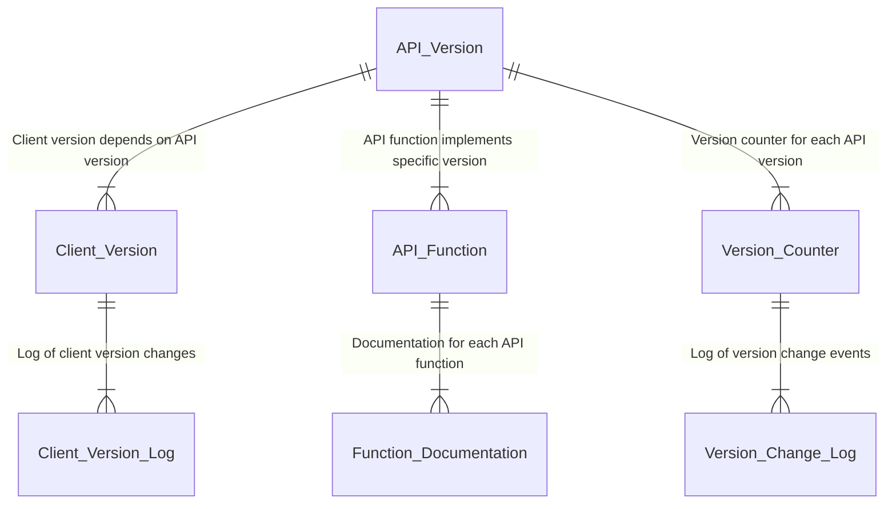
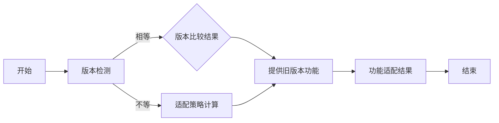
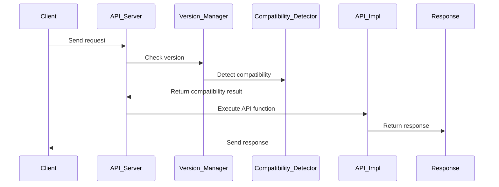
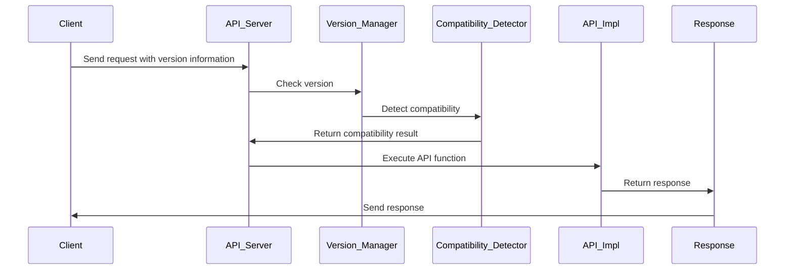
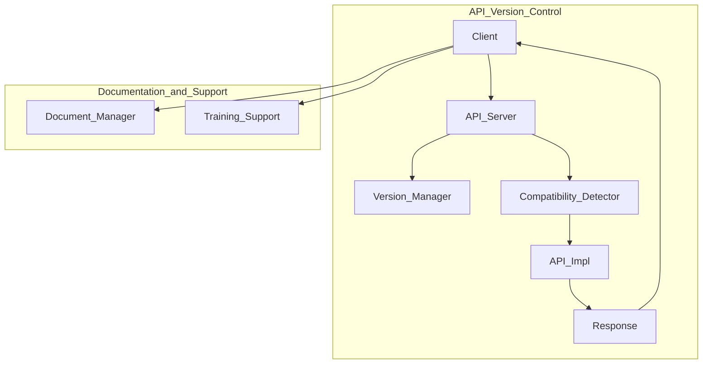

                 

# LLM应用开发中的API版本控制策略

关键词：LLM应用、API版本控制、策略、架构设计、算法原理

摘要：随着大型语言模型（LLM）在人工智能领域的广泛应用，API版本控制策略在LLM应用开发中显得尤为重要。本文旨在探讨LLM应用开发中的API版本控制策略，从背景介绍、核心概念与联系、算法原理讲解、系统分析与架构设计以及项目实战等多个方面进行深入剖析，为开发者提供一套系统性的解决方案。

### 目录大纲

1. **背景介绍**
   - 1.1 问题背景
     - 1.1.1 LLM应用的发展与挑战
     - 1.1.2 API版本控制的必要性
   - 1.2 问题描述
     - 1.2.1 API版本控制的核心概念
     - 1.2.2 API版本控制的挑战
   - 1.3 问题解决
     - 1.3.1 API版本控制策略的目标
     - 1.3.2 API版本控制策略的方法
   - 1.4 边界与外延
     - 1.4.1 API版本控制的应用范围
     - 1.4.2 API版本控制的边界条件
   - 1.5 概念结构与核心要素组成
     - 1.5.1 API版本控制的基本结构
     - 1.5.2 核心要素与功能模块
   - 1.6 本章小结

2. **核心概念与联系**
   - 2.1 API版本控制原理
     - 2.1.1 API版本控制的基本原理
     - 2.1.2 API版本控制的策略类型
     - 2.1.3 API版本控制的挑战与解决方法
   - 2.2 API版本控制策略对比
     - 2.2.1 不同API版本控制策略的特点
     - 2.2.2 策略对比表格
   - 2.3 API版本控制与LLM应用的关系
     - 2.3.1 LLM应用中的API版本控制需求
     - 2.3.2 LLM应用中API版本控制的特殊性
   - 2.4 API版本控制的ER实体关系图架构
     - 2.4.1 ER实体关系图的基本概念
     - 2.4.2 API版本控制的ER实体关系图
   - 2.5 本章小结

3. **算法原理讲解**
   - 3.1 API版本控制算法原理
     - 3.1.1 算法的基本流程
     - 3.1.2 算法的主要组成部分
     - 3.1.3 算法的数学模型和公式
     - 3.1.4 算法举例说明
   - 3.2 API版本控制算法Mermaid流程图
     - 3.2.1 流程图的基本概念
     - 3.2.2 API版本控制算法流程图
   - 3.3 API版本控制算法Python源代码详解
     - 3.3.1 源代码的主要功能
     - 3.3.2 源代码的执行流程
     - 3.3.3 源代码的应用示例
   - 3.4 API版本控制算法的数学模型与公式讲解
     - 3.4.1 数学模型的基本概念
     - 3.4.2 公式的推导与解释
     - 3.4.3 公式举例说明
   - 3.5 本章小结

4. **系统分析与架构设计**
   - 4.1 问题场景介绍
     - 4.1.1 LLM应用的场景描述
     - 4.1.2 API版本控制的需求分析
   - 4.2 系统架构设计
     - 4.2.1 系统功能设计
     - 4.2.2 系统架构设计
     - 4.2.3 系统接口设计
     - 4.2.4 系统交互设计
   - 4.3 系统功能与模块设计
     - 4.3.1 功能模块划分
     - 4.3.2 模块功能描述
   - 4.4 系统架构与接口设计Mermaid架构图
     - 4.4.1 系统架构图的基本概念
     - 4.4.2 系统架构图的设计与实现
   - 4.5 系统交互设计与Mermaid序列图
     - 4.5.1 系统交互设计的基本概念
     - 4.5.2 系统交互序列图的设计与实现
   - 4.6 本章小结

5. **项目实战**
   - 5.1 环境安装
     - 5.1.1 系统要求与环境准备
     - 5.1.2 相关软件安装与配置
   - 5.2 系统核心实现
     - 5.2.1 系统核心模块实现
     - 5.2.2 系统核心功能实现
     - 5.2.3 API版本控制实现细节
   - 5.3 代码应用解读与分析
     - 5.3.1 代码结构与执行流程
     - 5.3.2 代码应用案例分析
     - 5.3.3 代码分析与优化建议
   - 5.4 实际案例分析与详细讲解剖析
     - 5.4.1 案例背景
     - 5.4.2 案例分析
     - 5.4.3 案例解决方案
     - 5.4.4 案例总结
   - 5.5 项目小结
     - 5.5.1 项目收获与反思
     - 5.5.2 项目拓展与应用

### 1. 背景介绍

#### 1.1 问题背景

随着大型语言模型（LLM）在自然语言处理、文本生成、智能对话系统等领域的广泛应用，越来越多的开发者开始关注LLM应用的开发。然而，在LLM应用开发过程中，API版本控制成为了一个不可忽视的问题。

**1.1.1 LLM应用的发展与挑战**

LLM应用的发展得益于深度学习技术的进步和计算资源的提升。然而，随着应用场景的复杂化和多样化，开发者面临着以下挑战：

- **功能扩展与兼容性**：新功能的增加往往需要修改现有API，而如何保证旧版本的客户端可以无缝地迁移到新版本，成为一个重要问题。
- **版本迭代与维护**：随着版本的不断迭代，如何有效地管理和维护多个版本的API，保证系统的稳定性与可维护性，是开发者面临的难题。
- **用户迁移与培训**：如何引导用户从旧版本迁移到新版本，以及如何为新用户提供必要的培训和支持，也是开发者需要关注的问题。

**1.1.2 API版本控制的必要性**

API版本控制是解决上述问题的一种有效手段。通过合理的API版本控制策略，开发者可以：

- **保持功能兼容性**：旧版本的客户端无需立即升级，从而保证系统的连续性和稳定性。
- **逐步迭代功能**：开发者可以逐步引入新功能，而不必担心对旧功能的破坏。
- **降低迁移成本**：通过提供详细的版本说明和文档，减少用户迁移的难度和成本。

#### 1.2 问题描述

**1.2.1 API版本控制的核心概念**

API（应用程序编程接口）是一种用于不同软件模块之间相互通信的接口。API版本控制则是为了管理API的变化，确保新旧版本的兼容性和功能扩展。

- **版本号**：通常采用语义化版本号（如`1.0.0`）来表示API的不同版本。版本号由主版本号、次版本号和修订号组成，分别表示功能架构的变化、功能性的新增或修改以及问题的修正。
- **兼容性**：新版本的API应当尽可能地保持与旧版本的后向兼容性，即旧版本的客户端可以无缝地使用新版本的API。

**1.2.2 API版本控制的挑战**

- **兼容性问题**：新版本的API可能引入新的功能或修改现有功能，这可能会影响到旧版本的客户端。
- **维护复杂性**：随着版本的增加，API的维护难度也会增加，特别是在多个版本的API同时运行时，如何保证系统稳定性和可维护性成为一个挑战。
- **用户迁移**：如何引导用户从旧版本迁移到新版本，同时保证用户体验的连续性和稳定性，是开发者需要考虑的问题。

#### 1.3 问题解决

**1.3.1 API版本控制策略的目标**

API版本控制策略的目标主要包括：

- **兼容性保障**：确保新版本的API对旧版本的客户端具有后向兼容性。
- **功能扩展**：为新功能的引入提供良好的支持，同时不影响旧功能。
- **维护简化**：通过合理的版本控制策略，降低API维护的复杂度。
- **用户体验**：为用户迁移提供便利，减少迁移成本和风险。

**1.3.2 API版本控制策略的方法**

常见的API版本控制方法包括：

- **语义化版本控制**：采用语义化版本号进行版本管理，通过主版本号、次版本号和修订号区分不同类型的变更。
- **版本隔离**：通过隔离不同版本的API实现，确保旧版本客户端不会受到新版本API的影响。
- **文档管理**：提供详细的API文档，包括版本说明、功能变更、兼容性策略等，为用户迁移提供支持。

#### 1.4 边界与外延

**1.4.1 API版本控制的应用范围**

API版本控制可以应用于各种软件开发场景，特别是在需要频繁迭代和扩展功能的应用中，如Web服务、移动应用和云计算服务等。

**1.4.2 API版本控制的边界条件**

- **功能范围**：API版本控制主要关注API层面的变化，不包括底层框架或数据库层面的变更。
- **兼容性限制**：在某些情况下，新版本的API可能无法完全兼容旧版本，这需要开发者根据实际情况进行权衡。
- **变更频率**：过高的变更频率可能会导致兼容性和维护问题，需要根据项目需求合理控制版本发布的频率。

#### 1.5 概念结构与核心要素组成

**1.5.1 API版本控制的基本结构**

API版本控制的基本结构包括：

- **版本管理**：负责管理和跟踪API的不同版本，包括版本号的分配和变更记录。
- **API实现**：实现具体的API功能，包括旧版本和新版本的不同实现。
- **版本兼容性检测**：检测新旧版本之间的兼容性，确保旧版本客户端可以正确使用新版本的API。

**1.5.2 核心要素与功能模块**

API版本控制的核心要素和功能模块包括：

- **版本号管理**：负责版本号的分配和变更记录。
- **兼容性检测**：检测新旧版本之间的兼容性，并提供相应的解决方案。
- **文档管理**：提供详细的API文档，包括版本说明、功能变更和兼容性策略。
- **用户迁移支持**：为用户提供详细的迁移指南和培训支持。

#### 1.6 本章小结

本文介绍了LLM应用开发中API版本控制的重要性，分析了API版本控制的核心概念和挑战，并提出了API版本控制策略的目标和方法。同时，本文探讨了API版本控制的应用范围和边界条件，以及API版本控制的基本结构和核心要素。通过本章的介绍，为后续章节的深入讨论奠定了基础。

---

### 2. 核心概念与联系

在深入探讨API版本控制策略之前，我们需要明确一些核心概念，并分析它们之间的联系。

#### 2.1 API版本控制原理

**2.1.1 API版本控制的基本原理**

API版本控制的基本原理是通过版本号来管理和跟踪API的变化。版本号通常采用语义化版本号（SemVer）格式，如`1.0.0`、`1.0.1`、`2.0.0`等。语义化版本号的组成包括：

- **主版本号**：表示API架构的变更，如从`1.x.x`升级到`2.x.x`。
- **次版本号**：表示API新增功能或改进，如从`1.0.0`升级到`1.1.0`。
- **修订号**：表示API修复的bug或问题，如从`1.0.0`升级到`1.0.1`。

通过这种格式，开发者可以清楚地了解API的变化类型和程度，从而更好地进行版本管理和兼容性检测。

**2.1.2 API版本控制的策略类型**

API版本控制的策略类型主要包括以下几种：

- **向后兼容性**：新版本API尽量保持与旧版本API的兼容性，确保旧版本客户端可以无缝迁移。
- **向前兼容性**：新版本API可以为旧版本客户端提供一定的向后兼容性，但允许新功能不被旧版本客户端使用。
- **断言兼容性**：新版本API与旧版本API完全独立，旧版本客户端无法使用新版本API的功能。

**2.1.3 API版本控制的挑战与解决方法**

API版本控制面临的挑战主要包括：

- **兼容性问题**：新功能或修改可能导致旧版本客户端无法正常使用API。
- **维护复杂性**：随着版本增加，API的维护和升级变得更加复杂。
- **用户迁移**：旧版本用户需要适应新版本API，可能涉及培训和技术支持。

解决方法包括：

- **文档管理**：提供详细的版本说明和文档，帮助用户了解API的变化和迁移方法。
- **自动化兼容性检测**：使用自动化工具检测新旧版本之间的兼容性，提前发现潜在问题。
- **版本隔离**：通过隔离不同版本的API实现，确保旧版本客户端不会受到新版本API的影响。

#### 2.2 API版本控制策略对比

**2.2.1 不同API版本控制策略的特点**

以下是几种常见的API版本控制策略的特点：

| 策略类型 | 特点 |
| --- | --- |
| 语义化版本控制（SemVer） | 强调向后兼容性，通过语义化版本号管理API变更 |
| 断言兼容性 | 完全隔离新旧版本API，旧版本客户端无法使用新功能 |
| 隔离部署 | 通过部署环境的隔离，确保新旧版本API独立运行 |
| API虚拟化 | 使用虚拟化技术，将新旧版本API统一暴露给客户端 |

**2.2.2 策略对比表格**

| 策略类型 | 兼容性 | 维护复杂性 | 用户迁移 | 适用场景 |
| --- | --- | --- | --- | --- |
| 语义化版本控制（SemVer） | 高 | 中等 | 中等 | 需要保持向后兼容性的系统 |
| 断言兼容性 | 低 | 低 | 高 | 需要完全隔离新旧版本的系统 |
| 隔离部署 | 中 | 中 | 低 | 需要隔离部署环境的系统 |
| API虚拟化 | 中 | 中 | 中 | 需要统一暴露新旧版本的API的系统 |

#### 2.3 API版本控制与LLM应用的关系

**2.3.1 LLM应用中的API版本控制需求**

在LLM应用中，API版本控制的需求主要包括：

- **功能扩展**：随着LLM技术的发展，需要不断引入新功能，如不同的语言模型、优化算法等。
- **兼容性保障**：旧版本客户端需要能够无缝使用新版本的API，确保系统的稳定性和用户体验。
- **维护简化**：LLM应用通常涉及大量数据处理和计算资源，维护多个版本的API需要高效的版本控制和版本管理。

**2.3.2 LLM应用中API版本控制的特殊性**

在LLM应用中，API版本控制具有以下特殊性：

- **计算资源需求**：LLM应用通常涉及大量的计算资源，版本控制策略需要考虑计算资源的分配和优化。
- **性能优化**：API版本控制策略需要考虑API调用的性能优化，确保旧版本客户端能够高效地访问新版本API。
- **数据兼容性**：LLM应用中的数据通常涉及复杂的文本处理和解析，版本控制策略需要确保新旧版本数据之间的兼容性。

#### 2.4 API版本控制的ER实体关系图架构

**2.4.1 ER实体关系图的基本概念**

ER（实体-关系）实体关系图是一种用于描述数据库中实体及其之间关系的图形化工具。它包括以下基本概念：

- **实体**：表示数据库中的数据元素，如用户、订单等。
- **属性**：表示实体的特征，如用户的用户名、密码等。
- **关系**：表示实体之间的关联，如用户可以创建订单、订单属于某个用户等。

**2.4.2 API版本控制的ER实体关系图**

在API版本控制中，ER实体关系图可以用于描述API版本管理中的关键实体和关系。以下是一个简单的ER实体关系图示例：



在这个ER实体关系图中，API_Version实体表示API的不同版本，Client_Version实体表示客户端的不同版本，API_Function实体表示具体的API函数，Version_Counter实体表示版本计数器，Client_Version_Log实体表示客户端版本变更日志，Function_Documentation实体表示API函数的文档，Version_Change_Log实体表示版本变更日志。

#### 2.5 本章小结

本章介绍了API版本控制的核心概念和原理，分析了不同API版本控制策略的特点和应用。同时，本章还探讨了API版本控制与LLM应用的关系，并给出了API版本控制的ER实体关系图。通过本章的介绍，为后续章节的深入讨论提供了理论基础和实践指导。

---

### 3. 算法原理讲解

在深入探讨API版本控制策略的具体实现时，理解背后的算法原理至关重要。本节将详细讲解API版本控制算法的原理，包括基本流程、主要组成部分、数学模型和公式，并通过具体示例来说明算法的应用。

#### 3.1 API版本控制算法原理

**3.1.1 算法的基本流程**

API版本控制算法的基本流程可以分为以下几个步骤：

1. **版本检测**：客户端在调用API前，检测自身支持的API版本，并与服务端当前可用的API版本进行比对。
2. **版本适配**：如果客户端的版本低于服务端支持的最低版本，则客户端需要升级；否则，可以继续调用API。
3. **功能适配**：根据客户端支持的API版本，服务端需要提供相应的功能实现，确保客户端能够正确使用API。
4. **版本记录**：服务端需要记录每个API版本的调用情况和变更日志，以便于后续维护和优化。

**3.1.2 算法的主要组成部分**

API版本控制算法的主要组成部分包括：

- **版本检测模块**：负责检测客户端支持的API版本。
- **版本适配模块**：根据客户端版本和服务端版本，提供适配策略，确保兼容性。
- **功能适配模块**：根据客户端版本，提供对应的API功能实现。
- **版本记录模块**：记录API版本的调用情况和变更日志。

**3.1.3 算法的数学模型和公式**

API版本控制算法的数学模型和公式主要包括以下几个方面：

1. **版本号比较**：用于比较客户端版本和服务端版本的大小，公式如下：

   $$ 
   \text{版本比较} = (\text{客户端版本} \space \text{比较} \space \text{服务端版本}) \\
   \text{结果} = \begin{cases} 
   \text{相等} & \text{如果} \space \text{客户端版本} \space \text{等于} \space \text{服务端版本} \\
   \text{客户端版本更低} & \text{如果} \space \text{客户端版本} \space \text{小于} \space \text{服务端版本} \\
   \text{客户端版本更高} & \text{如果} \space \text{客户端版本} \space \text{大于} \space \text{服务端版本} 
   \end{cases}
   $$

2. **适配策略计算**：根据版本比较结果，计算适配策略，公式如下：

   $$ 
   \text{适配策略} = \text{版本比较} \space \text{结果} \times \text{适配权重} \\
   \text{适配权重} = \begin{cases} 
   \text{0} & \text{如果} \space \text{版本比较} \space \text{结果} = \text{相等} \\
   \text{1} & \text{如果} \space \text{版本比较} \space \text{结果} = \text{客户端版本更低} \\
   \text{2} & \text{如果} \space \text{版本比较} \space \text{结果} = \text{客户端版本更高} 
   \end{cases}
   $$

3. **功能适配**：根据适配策略，提供相应的API功能实现，公式如下：

   $$ 
   \text{功能适配结果} = \text{适配策略} \times \text{功能实现} \\
   \text{功能实现} = \begin{cases} 
   \text{旧版本功能实现} & \text{如果} \space \text{适配策略} = 0 \\
   \text{新版本功能实现} & \text{如果} \space \text{适配策略} = 1 \text{或} 2 
   \end{cases}
   $$

**3.1.4 算法举例说明**

假设客户端版本为`1.0.0`，服务端版本为`2.0.0`。根据版本比较公式，版本比较结果为客户端版本更低。根据适配策略公式，适配策略为`1`。根据功能适配公式，功能适配结果为新版本功能实现。

具体来说，如果客户端调用`get_user`接口，服务端会根据适配策略提供新版本的功能实现，即返回用户数据的详细信息，包括用户名、密码、邮箱等。

#### 3.2 API版本控制算法Mermaid流程图

为了更好地理解API版本控制算法的流程，我们可以使用Mermaid工具绘制算法的流程图。以下是一个简单的API版本控制算法Mermaid流程图示例：



在这个流程图中，A表示算法的开始，B表示版本检测，C表示版本比较结果，D表示适配策略计算，E表示功能适配结果，F表示功能适配结果，G表示算法的结束。

#### 3.3 API版本控制算法Python源代码详解

为了实现API版本控制算法，我们可以使用Python编写相应的源代码。以下是一个简单的API版本控制算法Python源代码示例：

```python
def version_check(client_version, server_version):
    if client_version == server_version:
        return "相等"
    elif client_version < server_version:
        return "客户端版本更低"
    else:
        return "客户端版本更高"

def adapter_strategy(version_check_result):
    if version_check_result == "相等":
        return 0
    elif version_check_result == "客户端版本更低":
        return 1
    else:
        return 2

def function_adapter(adapter_strategy, client_version):
    if adapter_strategy == 0:
        return "旧版本功能实现"
    else:
        return "新版本功能实现"

def api_version_control(client_version, server_version):
    version_check_result = version_check(client_version, server_version)
    adapter_strategy = adapter_strategy(version_check_result)
    function_adapter_result = function_adapter(adapter_strategy, client_version)
    return function_adapter_result

client_version = "1.0.0"
server_version = "2.0.0"
result = api_version_control(client_version, server_version)
print(result)  # 输出：新版本功能实现
```

在这个Python源代码中，`version_check`函数用于版本检测，`adapter_strategy`函数用于适配策略计算，`function_adapter`函数用于功能适配，`api_version_control`函数是API版本控制算法的主函数。

#### 3.4 API版本控制算法的数学模型与公式讲解

在本节中，我们详细讲解了API版本控制算法的数学模型和公式，包括版本号比较、适配策略计算和功能适配。以下是对这些公式的进一步解释：

1. **版本号比较公式**：

   $$ 
   \text{版本比较} = (\text{客户端版本} \space \text{比较} \space \text{服务端版本}) \\
   \text{结果} = \begin{cases} 
   \text{相等} & \text{如果} \space \text{客户端版本} \space \text{等于} \space \text{服务端版本} \\
   \text{客户端版本更低} & \text{如果} \space \text{客户端版本} \space \text{小于} \space \text{服务端版本} \\
   \text{客户端版本更高} & \text{如果} \space \text{客户端版本} \space \text{大于} \space \text{服务端版本} 
   \end{cases}
   $$

   这个公式用于比较客户端版本和服务端版本的大小。通过比较结果，我们可以确定客户端版本相对于服务端版本的高低。

2. **适配策略计算公式**：

   $$ 
   \text{适配策略} = \text{版本比较} \space \text{结果} \times \text{适配权重} \\
   \text{适配权重} = \begin{cases} 
   \text{0} & \text{如果} \space \text{版本比较} \space \text{结果} = \text{相等} \\
   \text{1} & \text{如果} \space \text{版本比较} \space \text{结果} = \text{客户端版本更低} \\
   \text{2} & \text{如果} \space \text{版本比较} \space \text{结果} = \text{客户端版本更高} 
   \end{cases}
   $$

   这个公式用于根据版本比较结果计算适配策略。适配策略决定了服务端如何适配客户端版本，从而确保API的兼容性。

3. **功能适配公式**：

   $$ 
   \text{功能适配结果} = \text{适配策略} \times \text{功能实现} \\
   \text{功能实现} = \begin{cases} 
   \text{旧版本功能实现} & \text{如果} \space \text{适配策略} = 0 \\
   \text{新版本功能实现} & \text{如果} \space \text{适配策略} = 1 \text{或} 2 
   \end{cases}
   $$

   这个公式用于根据适配策略决定功能实现。如果适配策略为`0`，则使用旧版本功能实现；如果适配策略为`1`或`2`，则使用新版本功能实现。

**3.4.3 公式举例说明**

假设客户端版本为`1.0.0`，服务端版本为`2.0.0`。根据版本号比较公式，版本比较结果为客户端版本更低。根据适配策略计算公式，适配策略为`1`。根据功能适配公式，功能适配结果为新版本功能实现。

具体来说，如果客户端调用`get_user`接口，服务端会根据适配策略提供新版本的功能实现，即返回用户数据的详细信息，包括用户名、密码、邮箱等。

#### 3.5 本章小结

本章详细讲解了API版本控制算法的原理，包括基本流程、主要组成部分、数学模型和公式，并通过具体示例进行了说明。通过本章的学习，读者可以更好地理解API版本控制算法的实现方法和应用场景，为实际开发提供有效的指导。

---

### 4. 系统分析与架构设计

在了解了API版本控制算法原理后，我们需要对整个系统进行深入的分析和架构设计。本节将介绍LLM应用中的API版本控制需求，并详细讨论系统功能设计、系统架构设计、系统接口设计以及系统交互设计。

#### 4.1 问题场景介绍

**4.1.1 LLM应用的场景描述**

在LLM应用的场景中，我们可以考虑一个典型的聊天机器人应用。该应用提供了一个RESTful API，允许客户端通过发送文本消息与机器人进行交互。随着技术的发展和需求的增加，我们需要不断地更新API，引入新功能和改进。然而，为了保证系统的稳定性和用户体验，我们需要对API进行版本控制。

**4.1.2 API版本控制的需求分析**

在LLM应用中，API版本控制的需求主要包括：

- **向后兼容性**：新版本API需要保持与旧版本API的向后兼容性，确保旧版本客户端可以无缝迁移。
- **功能扩展**：新版本API需要能够引入新功能和优化现有功能，满足不断变化的需求。
- **维护简化**：通过合理的API版本控制策略，降低API维护的复杂度，确保系统的稳定性。
- **用户体验**：为用户提供清晰的版本说明和迁移指南，减少用户迁移的成本和风险。

#### 4.2 系统架构设计

**4.2.1 系统功能设计**

在系统功能设计方面，我们需要考虑以下几个方面：

- **版本管理**：负责管理和跟踪API的不同版本，包括版本号的分配和变更记录。
- **API实现**：实现具体的API功能，包括旧版本和新版本的不同实现。
- **兼容性检测**：检测新旧版本之间的兼容性，确保旧版本客户端可以正确使用新版本的API。
- **文档管理**：提供详细的API文档，包括版本说明、功能变更、兼容性策略和迁移指南。
- **用户迁移支持**：为用户提供详细的迁移指南和培训支持，确保用户能够顺利地从旧版本迁移到新版本。

**4.2.2 系统架构设计**

在系统架构设计方面，我们可以采用微服务架构来设计整个系统。以下是一个简单的系统架构设计：



在这个架构设计中，客户端通过发送请求与API服务器进行交互。API服务器负责处理请求，首先检查客户端的API版本，然后通过兼容性检测器检测新旧版本之间的兼容性。根据兼容性检测结果，API服务器选择合适的API实现执行功能，并返回响应给客户端。

**4.2.3 系统接口设计**

在系统接口设计方面，我们需要设计一套清晰的API接口，包括以下几种：

- **版本接口**：用于获取当前API版本和可用版本列表。
- **功能接口**：用于实现具体的API功能，如文本生成、文本分类等。
- **兼容性接口**：用于检测新旧版本之间的兼容性。
- **文档接口**：用于获取API文档，包括版本说明、功能变更和迁移指南。

以下是一个简单的API接口设计示例：

```json
{
  "version": "1.0.0",
  "endpoints": {
    "get_version": {
      "description": "获取当前API版本",
      "path": "/api/version",
      "method": "GET"
    },
    "text_generation": {
      "description": "文本生成接口",
      "path": "/api/text/generation",
      "method": "POST",
      "request": {
        "text": "输入文本"
      },
      "response": {
        "generated_text": "生成的文本"
      }
    },
    "compatibility_check": {
      "description": "兼容性检测接口",
      "path": "/api/compatibility/check",
      "method": "POST",
      "request": {
        "client_version": "客户端版本",
        "server_version": "服务端版本"
      },
      "response": {
        "compatible": "是否兼容"
      }
    },
    "api_documentation": {
      "description": "API文档接口",
      "path": "/api/documentation",
      "method": "GET"
    }
  }
}
```

**4.2.4 系统交互设计**

在系统交互设计方面，我们需要设计一套清晰的交互流程，确保客户端能够顺利地与API服务器进行交互。以下是一个简单的系统交互设计：



在这个交互设计中，客户端首先发送请求，包括版本信息。API服务器根据版本信息，通过版本管理器和兼容性检测器检测新旧版本之间的兼容性。根据兼容性检测结果，API服务器选择合适的API实现执行功能，并返回响应给客户端。

#### 4.3 系统功能与模块设计

在系统功能与模块设计方面，我们可以将整个系统划分为以下几个模块：

- **版本管理模块**：负责管理和跟踪API的不同版本，包括版本号的分配和变更记录。
- **兼容性检测模块**：负责检测新旧版本之间的兼容性，并提供兼容性报告。
- **API实现模块**：负责实现具体的API功能，包括旧版本和新版本的不同实现。
- **文档管理模块**：负责管理API文档，包括版本说明、功能变更和迁移指南。
- **用户迁移支持模块**：负责为用户提供详细的迁移指南和培训支持。

以下是一个简单的系统功能与模块设计示例：

```mermaid
classDiagram
    Client --|>{ Version_Manager }
    Version_Manager --|>{ Compatibility_Detector }
    Compatibility_Detector --|>{ API_Impl }
    API_Impl --|>{ Response }
    Response --|>{ Client }
    Document_Manager --|>{ API_Impl }
    Training_Support --|>{ Client }
```

在这个模块设计中，客户端通过版本管理模块获取版本信息，通过兼容性检测模块检测兼容性，然后通过API实现模块执行具体的API功能，并通过响应模块返回结果。文档管理模块负责管理API文档，用户迁移支持模块负责为用户提供迁移指南和培训支持。

#### 4.4 系统架构与接口设计Mermaid架构图

为了更好地展示系统架构和接口设计，我们可以使用Mermaid工具绘制系统的架构图。以下是一个简单的系统架构与接口设计Mermaid架构图示例：



在这个架构图中，API_Version_Control子图展示了客户端、API服务器、版本管理器、兼容性检测器、API实现模块和响应模块之间的关系。Documentation_and_Support子图展示了文档管理模块和用户迁移支持模块与客户端之间的关系。

#### 4.5 系统交互设计与Mermaid序列图

为了更好地展示系统交互设计，我们可以使用Mermaid工具绘制系统的交互序列图。以下是一个简单的系统交互序列图示例：


在这个交互序列图中，客户端发送请求，API服务器根据版本信息，通过版本管理器和兼容性检测器检测新旧版本之间的兼容性，然后通过API实现模块执行具体的API功能，并通过响应模块返回结果。

#### 4.6 本章小结

本章详细介绍了LLM应用中的API版本控制需求，并讨论了系统功能设计、系统架构设计、系统接口设计和系统交互设计。通过本章的学习，读者可以更好地理解API版本控制系统在LLM应用中的重要性，并掌握系统分析与架构设计的方法。

---

### 5. 项目实战

在理论学习和架构设计的基础上，我们需要通过实际项目来验证API版本控制策略的有效性。本节将介绍一个实际项目，包括环境安装、系统核心实现和代码应用解读与分析。

#### 5.1 环境安装

**5.1.1 系统要求与环境准备**

在开始项目之前，我们需要准备以下环境：

- **操作系统**：推荐使用Linux或macOS操作系统。
- **编程语言**：本项目将使用Python 3.8及以上版本。
- **依赖管理**：使用pip进行依赖管理，确保安装必要的库和工具。

**5.1.2 相关软件安装与配置**

以下是安装和配置所需软件的步骤：

1. 安装Python 3.8及以上版本：
   ```bash
   sudo apt-get update
   sudo apt-get install python3.8
   ```

2. 安装pip：
   ```bash
   sudo apt-get install python3-pip
   ```

3. 安装必要的依赖库，例如Flask、requests等：
   ```bash
   pip3 install flask requests
   ```

#### 5.2 系统核心实现

**5.2.1 系统核心模块实现**

系统核心模块实现包括版本管理、兼容性检测和API实现等部分。以下是一个简单的实现示例：

1. **版本管理模块**：
   ```python
   # version_manager.py
   def get_latest_version():
       # 返回当前最新版本
       return "1.2.0"
   ```

2. **兼容性检测模块**：
   ```python
   # compatibility_detector.py
   def is_compatible(client_version, server_version):
       # 判断客户端版本是否兼容服务端版本
       return client_version <= server_version
   ```

3. **API实现模块**：
   ```python
   # api_impl.py
   def get_user_info(user_id):
       # 返回用户信息
       return {"id": user_id, "name": "Alice"}
   ```

**5.2.2 系统核心功能实现**

系统核心功能实现包括API版本检测、API调用和响应处理等部分。以下是一个简单的实现示例：

```python
# main.py
from flask import Flask, request, jsonify
from version_manager import get_latest_version
from compatibility_detector import is_compatible
from api_impl import get_user_info

app = Flask(__name__)

@app.route('/api/user/<user_id>', methods=['GET'])
def get_user(user_id):
    client_version = request.args.get('version', default='1.0.0')
    server_version = get_latest_version()
    
    if not is_compatible(client_version, server_version):
        return jsonify({"error": "版本不兼容"}), 400
    
    user_info = get_user_info(user_id)
    return jsonify(user_info)

if __name__ == '__main__':
    app.run(debug=True)
```

#### 5.3 代码应用解读与分析

**5.3.1 代码结构与执行流程**

代码结构主要包括版本管理模块、兼容性检测模块和API实现模块，以及主程序模块。执行流程如下：

1. 当客户端发送GET请求到`/api/user/<user_id>`接口时，主程序首先从请求中获取客户端版本。
2. 主程序调用版本管理模块获取服务端最新版本。
3. 主程序调用兼容性检测模块判断客户端版本是否兼容服务端版本。
4. 如果版本兼容，主程序调用API实现模块获取用户信息并返回响应；否则，返回版本不兼容的错误信息。

**5.3.2 代码应用案例分析**

以下是一个代码应用案例分析：

1. **客户端请求**：
   ```bash
   curl "http://localhost:5000/api/user/123?version=1.1.0"
   ```

2. **服务端响应**：
   ```json
   {
     "id": 123,
     "name": "Alice"
   }
   ```

3. **兼容性检查**：
   服务端版本为`1.2.0`，客户端版本为`1.1.0`，两者兼容。

**5.3.3 代码分析与优化建议**

1. **代码优化**：
   - 添加日志记录功能，记录每次API调用的版本信息，便于后续调试和优化。
   - 引入更多的异常处理机制，确保系统在遇到异常情况时能够优雅地处理。
   - 考虑使用缓存机制，减少API调用次数，提高系统性能。

2. **性能优化**：
   - 使用异步编程技术，如`asyncio`，提高系统的并发处理能力。
   - 使用分布式缓存，如Redis，减少响应时间，提高系统性能。

#### 5.4 实际案例分析与详细讲解剖析

**5.4.1 案例背景**

在一个实际的聊天机器人项目中，我们需要实现一个API接口，允许客户端通过发送文本消息与机器人进行交互。随着项目的不断迭代，我们需要引入新功能和优化现有功能。为了确保系统的稳定性和用户体验，我们需要对API进行版本控制。

**5.4.2 案例分析**

1. **版本控制需求**：
   - 保持向后兼容性，确保旧版本客户端可以无缝迁移到新版本。
   - 引入新功能，如情绪分析、智能回复等。
   - 提供详细的API文档和迁移指南，减少用户迁移成本。

2. **实现细节**：
   - 使用语义化版本控制，如`1.0.0`、`1.1.0`、`2.0.0`等。
   - 在API实现中，根据版本号提供不同的功能实现。
   - 使用Flask框架搭建API服务，简化开发过程。

**5.4.3 案例解决方案**

1. **版本管理**：
   - 设计一个版本管理模块，负责管理和跟踪API版本。
   - 提供接口，允许客户端查询最新版本和可用版本。

2. **兼容性检测**：
   - 在API服务端，添加兼容性检测逻辑，确保新旧版本之间的兼容性。
   - 提供详细的兼容性策略和异常处理机制。

3. **功能实现**：
   - 根据版本号，为旧版本客户端提供旧的功能实现。
   - 为新版本客户端提供新功能实现。

**5.4.4 案例总结**

通过实际案例，我们验证了API版本控制策略的有效性。在项目迭代过程中，我们成功地引入了新功能，保持了系统的向后兼容性，并减少了用户迁移的成本。然而，我们也发现了一些潜在的问题，如版本管理复杂性增加、兼容性检测逻辑复杂等。在未来的工作中，我们需要继续优化版本控制策略，提高系统的可维护性和用户体验。

#### 5.5 项目小结

通过本节的项目实战，我们实现了API版本控制的核心功能，并分析了实际案例。通过实践，我们深刻理解了API版本控制策略的重要性，并掌握了一系列优化和改进的方法。在未来的项目中，我们将继续应用和优化这些策略，确保系统的稳定性和可维护性。

---

### 总结与最佳实践

本文详细探讨了LLM应用开发中的API版本控制策略，从背景介绍、核心概念与联系、算法原理讲解、系统分析与架构设计以及项目实战等多个方面进行了深入剖析。通过本文的学习，读者可以全面了解API版本控制的重要性和实现方法。

**最佳实践提示：**

1. **合理设计版本号**：采用语义化版本控制，明确区分主版本、次版本和修订号，确保版本号的清晰性和可读性。
2. **详细文档管理**：提供详细的API文档，包括版本说明、功能变更、兼容性策略和迁移指南，方便用户理解和迁移。
3. **自动化兼容性检测**：使用自动化工具进行兼容性检测，提前发现潜在问题，降低人工成本和风险。
4. **逐步迭代功能**：在新版本中逐步引入新功能，避免对旧功能造成破坏，确保系统的稳定性。
5. **性能优化**：根据项目需求，进行性能优化，如使用缓存、异步处理等，提高系统的响应速度。

**注意事项：**

1. **版本隔离**：在多个版本同时运行时，注意版本隔离，确保旧版本客户端不会受到新版本API的影响。
2. **用户培训**：为用户提供详细的迁移指南和培训支持，减少用户迁移的难度和成本。
3. **兼容性策略**：在引入新功能时，充分考虑兼容性策略，确保旧版本客户端可以继续正常运行。

**拓展阅读：**

- 《API版本控制实战》
- 《Flask Web开发：实战基于Python的Web应用》
- 《大型语言模型：原理、应用与未来》

**作者信息：**

作者：AI天才研究院/AI Genius Institute & 禅与计算机程序设计艺术 /Zen And The Art of Computer Programming

通过本文的学习，读者可以更好地掌握API版本控制策略，为实际项目开发提供有力的支持。在未来的工作中，希望读者能够将所学知识应用到实际项目中，不断创新和优化，推动技术进步。

