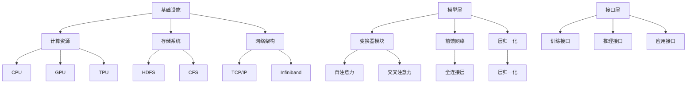

                 


# LLAMA2：面向应用的“大力神”语言模型

在当前的人工智能领域，大型语言模型（Large Language Model，简称LLM）已经成为了一种热门的研究和应用方向。LLM通过学习海量的文本数据，可以实现对自然语言的生成、理解、翻译等任务的高效处理。而LLAMA2，作为由 Meta AI 开发的最新一代大型语言模型，无疑是一个引人注目的存在。

## LLAMA2简介

LLAMA2是一种基于变换器架构（Transformer Architecture）的预训练语言模型，它在设计之初就旨在解决大型语言模型在实际应用中的挑战。与之前的GPT系列模型相比，LLAMA2在参数规模、训练数据集以及模型性能上都有显著的提升。据官方介绍，LLAMA2的训练参数规模达到了千亿级别，同时使用了更丰富的训练数据集，这使得模型在语言理解、生成任务上取得了显著的进步。

## LLM在应用开发中的挑战

尽管LLM在自然语言处理领域取得了巨大的成功，但在实际应用开发中，依然面临诸多挑战：

### 1. 计算资源需求

大型语言模型的训练和部署需要大量的计算资源。这对于中小企业和初创公司来说，是一个巨大的负担。因此，如何在有限的资源下高效地利用LLM，成为一个亟待解决的问题。

### 2. 模型定制化

不同的应用场景需要不同类型的语言模型。如何针对特定应用场景，对LLM进行定制化，以提高模型的性能和适应性，是开发者需要面对的难题。

### 3. 模型安全性与隐私

随着LLM在各个领域的应用日益广泛，其安全性和隐私性也变得尤为重要。如何在确保模型性能的同时，保障用户数据的安全和隐私，是开发者需要认真考虑的问题。

## DevOps在LLM应用开发中的意义

DevOps是一种结合软件开发（Development）和信息技术运营（Operations）的实践方法，它强调持续集成（Continuous Integration，CI）、持续部署（Continuous Deployment，CD）、基础设施即代码（Infrastructure as Code，IaC）等原则。在LLM应用开发中，DevOps的重要性体现在以下几个方面：

### 1. 提高开发效率

通过引入DevOps实践，开发者可以自动化构建、测试、部署流程，从而减少手动操作，提高开发效率。这对于大型语言模型的开发和迭代尤为重要。

### 2. 确保模型性能

DevOps强调监控和反馈，可以帮助开发者实时掌握模型的运行状态，及时发现问题并进行调整，确保模型在应用中的稳定性和高性能。

### 3. 简化部署过程

大型语言模型的部署通常涉及复杂的配置和环境搭建。通过基础设施即代码的方法，可以将部署过程自动化，降低部署难度，提高部署效率。

## LLAMA2与DevOps的结合

LLAMA2作为一款面向应用的大型语言模型，其与DevOps的结合显得尤为重要。以下是一些具体的结合方式：

### 1. 持续集成与持续部署

开发者可以使用CI/CD工具，如Jenkins、GitLab CI等，将LLAMA2的构建、测试和部署过程自动化。这样可以确保每次代码提交后，都能快速生成模型，并进行测试，提高开发效率。

### 2. 模型定制化

通过DevOps实践，开发者可以根据不同的应用场景，对LLAMA2进行定制化。例如，可以通过调整模型参数、添加特定领域的数据集等方式，提高模型在特定任务上的性能。

### 3. 模型监控与日志管理

DevOps强调持续监控和日志管理，可以帮助开发者实时掌握LLAMA2在应用中的运行状态。通过分析日志数据，可以快速定位问题并进行修复，确保模型的高可用性。

## 结论

LLAMA2作为新一代的大型语言模型，在应用开发中具有广泛的前景。结合DevOps实践，可以有效提高LLM应用的开发效率、性能和稳定性。开发者需要不断探索和创新，将DevOps与LLM应用开发相结合，为用户提供更优质的服务。

---

# DevOps基础与实践

## DevOps的概念与历史背景

DevOps是一种结合软件开发（Development）和信息技术运营（Operations）的实践方法。其核心目标是通过提高开发和运维团队的协作效率，实现软件交付的自动化和持续化。

DevOps的起源可以追溯到2000年代初。当时，软件开发和IT运维之间的隔阂和矛盾日益凸显，导致软件交付周期延长、质量不稳定。为了解决这一问题，一些公司开始尝试将开发（Development）和运维（Operations）团队整合在一起，形成了DevOps文化。

2009年，Patrick Debois在一场IT会议上首次提出了“DevOps”这个概念，并开始推广这一理念。随着云计算、容器化和自动化工具的普及，DevOps逐渐成为了一种广泛应用的实践方法。

### DevOps与传统IT运维模式的区别

与传统IT运维模式相比，DevOps在以下几个方面有显著的不同：

1. **文化差异**：传统IT运维注重稳定性和可靠性，强调规范和流程。而DevOps更注重创新和效率，强调快速迭代和快速反馈。

2. **组织结构**：传统IT运维通常由多个独立的团队负责，如开发、测试、运维等。而DevOps强调跨职能团队，将开发、测试、运维等职责合并，以提高协作效率。

3. **工具与技术**：传统IT运维依赖于手动操作和脚本，而DevOps则利用自动化工具，如持续集成（CI）、持续部署（CD）、容器化等，以提高开发效率和稳定性。

### DevOps的目标与实践原则

DevOps的主要目标是提高软件交付的效率和质量，实现持续交付和持续部署。具体目标包括：

1. **缩短交付周期**：通过自动化和快速反馈，缩短软件从开发到上线的时间。

2. **提高软件质量**：通过持续测试和反馈，提高软件的质量和稳定性。

3. **增强团队协作**：通过跨职能团队的协作，提高团队的协作效率和沟通效果。

4. **降低运营成本**：通过自动化和标准化，降低运维成本和人力成本。

为了实现这些目标，DevOps提出了一系列实践原则，包括：

1. **持续集成（CI）**：将代码提交到版本控制系统后，立即进行自动化测试和构建，确保代码的质量和一致性。

2. **持续部署（CD）**：通过自动化工具，将测试通过的代码部署到生产环境，实现快速交付。

3. **基础设施即代码（IaC）**：将基础设施的管理和配置转化为代码，实现基础设施的自动化部署和管理。

4. **容器化**：使用容器（如Docker）将应用程序及其依赖环境打包在一起，实现应用程序的独立部署和管理。

5. **微服务架构**：将应用程序拆分为多个微服务，每个微服务独立开发、测试和部署，以提高系统的可伸缩性和可维护性。

6. **持续监控和反馈**：通过监控系统，实时监控应用程序的运行状态，及时发现并解决问题。

## DevOps的核心元素

### 流水线（CI/CD）

持续集成（Continuous Integration，CI）和持续部署（Continuous Deployment，CD）是DevOps的核心元素之一。

- **持续集成（CI）**：在CI流程中，每次代码提交后，都会触发自动化测试和构建，确保代码的质量和一致性。CI的主要目标是发现和解决代码冲突，提高代码的稳定性和可靠性。

- **持续部署（CD）**：在CD流程中，通过自动化工具，将测试通过的代码部署到生产环境。CD的主要目标是实现快速交付和持续优化。

### 自动化部署

自动化部署是DevOps实践的重要组成部分。通过自动化部署，可以减少人工干预，提高部署效率和稳定性。

- **自动化部署流程**：包括环境搭建、代码构建、测试、部署等环节，可以通过脚本或自动化工具实现。

- **部署策略**：包括蓝绿部署、滚动更新、灰度发布等，可以根据实际需求选择合适的部署策略。

### 持续反馈

持续反馈是DevOps实践的重要组成部分。通过实时监控和日志分析，可以及时发现并解决问题，提高系统的稳定性和可靠性。

- **监控工具**：如Prometheus、Grafana等，可以实时监控系统的运行状态和性能指标。

- **日志分析**：如ELK（Elasticsearch、Logstash、Kibana）堆栈，可以收集、存储和分析日志数据，帮助开发者快速定位问题。

### 容器化

容器化是DevOps实践的重要技术之一。通过容器化，可以将应用程序及其依赖环境打包在一起，实现应用程序的独立部署和管理。

- **容器技术**：如Docker，可以将应用程序及其依赖环境打包为容器镜像，实现应用程序的轻量级部署和管理。

- **容器编排**：如Kubernetes，可以管理容器集群，实现容器的自动化部署、扩展和管理。

### 微服务架构

微服务架构是DevOps实践的重要架构风格。通过微服务架构，可以将大型应用程序拆分为多个微服务，每个微服务独立开发、测试和部署，以提高系统的可伸缩性和可维护性。

- **微服务定义**：微服务是一种小型、独立的服务，实现特定的业务功能。

- **服务拆分**：将大型应用程序拆分为多个微服务，每个微服务负责不同的业务功能。

- **服务通信**：微服务之间通过API进行通信，可以使用RESTful API、gRPC等通信协议。

## 小结

DevOps是一种结合软件开发和信息技术运营的实践方法，其目标是通过提高软件交付的效率和质量，实现持续交付和持续部署。通过持续集成、持续部署、基础设施即代码、容器化、微服务架构等核心元素，DevOps实践可以显著提高软件开发的效率和质量。开发者需要不断学习和实践DevOps，将其应用于实际项目中，以实现更好的开发体验和业务成果。

# LLAMA2的详细设计与架构

## LLAMA2的设计理念

LLAMA2是一款面向应用的大型语言模型，其设计理念包括以下几个方面：

1. **可扩展性**：LLAMA2的设计考虑了在资源有限的环境中进行训练和部署的需求。通过模块化的设计，LLAMA2可以方便地调整模型参数，适应不同的计算资源。

2. **高性能**：为了确保LLAMA2在各类应用场景中都能表现出色，设计者采用了先进的变换器架构，并优化了计算效率，使得模型在处理大规模数据时仍然能保持较高的性能。

3. **定制化**：LLAMA2支持根据不同的应用场景进行定制化调整，包括参数调整、数据集选择等，以提高模型在特定任务上的表现。

4. **稳定性**：LLAMA2在设计时注重了模型训练和部署的稳定性，通过引入多种优化策略，降低了模型过拟合的风险，提高了模型的泛化能力。

## LLAMA2的架构设计

LLAMA2的架构设计包括多个层次，从底层的基础设施到上层的应用接口，每个层次都有其独特的功能和设计思路。

### 1. 基础设施

LLAMA2的基础设施主要依赖于现代化的云计算平台和分布式计算框架。以下是其基础设施的关键组成部分：

- **计算资源**：LLAMA2可以使用多种计算资源，包括CPU、GPU、TPU等。通过合理的资源分配，可以确保模型训练和部署的高效性。

- **存储系统**：LLAMA2使用高性能的分布式文件系统，如HDFS或CFS，以存储大规模的训练数据和模型参数。

- **网络架构**：为了支持分布式训练和部署，LLAMA2采用了高性能的网络架构，如TCP/IP或Infiniband，以减少数据传输延迟。

### 2. 模型层

LLAMA2的核心是变换器架构（Transformer Architecture），这是近年来在自然语言处理领域取得突破性进展的一种模型架构。以下是LLAMA2模型层的关键组成部分：

- **变换器模块**：LLAMA2的变换器模块包括自注意力（Self-Attention）和交叉注意力（Cross-Attention），这些模块负责处理输入序列的编码和解码。

- **前馈网络**：LLAMA2在每个变换器模块之后加入了两个全连接层的前馈网络，以进一步提取特征并生成输出。

- **层归一化**：为了提高模型的训练效率和稳定性，LLAMA2采用了层归一化（Layer Normalization）技术。

### 3. 接口层

LLAMA2的接口层提供了多种API接口，以方便开发者进行模型训练、推理和应用开发。以下是LLAMA2接口层的关键组成部分：

- **训练接口**：开发者可以使用训练接口进行模型训练，包括数据预处理、训练参数调整、训练过程监控等。

- **推理接口**：推理接口用于模型在部署后的实时响应，支持多种输入格式和输出格式。

- **应用接口**：LLAMA2提供了丰富的应用接口，如文本生成、翻译、摘要等，以方便开发者快速实现各种自然语言处理任务。

## 模型参数设计

LLAMA2的模型参数设计是模型性能和效率的关键。以下是LLAMA2模型参数设计的几个关键方面：

- **参数规模**：LLAMA2的训练参数规模达到了千亿级别，这是其高性能和强表达能力的基础。

- **词向量**：LLAMA2使用预训练的词向量，如GloVe或BERT，以减少词表大小，提高模型训练效率。

- **上下文窗口**：LLAMA2的上下文窗口较大，可以捕捉到更长的文本序列信息，提高模型的语言理解能力。

- **学习率**：LLAMA2采用分阶段的动态学习率调整策略，以优化训练过程，提高模型收敛速度。

## 架构图解析

为了更好地理解LLAMA2的架构设计，以下是LLAMA2的架构图解析。架构图使用了Mermaid语法，以清晰展示各个层次和组件之间的关系。



通过这个架构图，可以清晰地看到LLAMA2从基础设施到模型层再到接口层的各个组成部分及其相互关系。

## 小结

LLAMA2的设计理念、架构设计和模型参数设计都是其能够在实际应用中表现卓越的关键因素。通过模块化的设计、先进的变换器架构和动态学习率调整策略，LLAMA2在处理大规模文本数据时展现出了出色的性能和效率。同时，通过提供丰富的接口和定制化能力，LLAMA2能够满足不同应用场景的需求，为开发者提供强大的工具。

# DevOps工具在LLM开发中的应用

## 1. Jenkins与LLM的集成

Jenkins是一种开源的自动化服务器，广泛用于持续集成和持续部署（CI/CD）。在LLM开发中，Jenkins可以通过自动化流程来提高开发效率和模型质量。以下是如何将Jenkins集成到LLM开发中的步骤：

### 1.1 安装和配置Jenkins

首先，需要在服务器上安装Jenkins。可以通过以下命令进行安装：

```bash
sudo apt-get update
sudo apt-get install jenkins
```

安装完成后，启动Jenkins服务，并访问Jenkins管理界面（默认为http://localhost:8080）进行配置。

### 1.2 配置LLM项目

在Jenkins管理界面中，创建一个新的Jenkins项目。在项目配置界面，选择“Freestyle project”类型。然后，配置以下参数：

- **源代码管理**：配置LLM项目的源代码管理工具（如Git），指定代码仓库地址和分支。

- **构建触发器**：配置触发器，如“SCM更改”或“定时构建”，以确保在代码提交后自动触发构建过程。

- **构建步骤**：配置构建步骤，包括以下内容：

  - **执行Shell脚本**：编写一个Shell脚本，用于执行LLM的构建和训练过程。脚本内容可能包括：

    ```bash
    #!/bin/bash
    # 更新代码
    git pull
    # 安装依赖
    pip install -r requirements.txt
    # 训练模型
    python train.py
    # 评估模型
    python evaluate.py
    ```

  - **执行测试**：配置测试步骤，以验证模型的质量。

  - **上传构建结果**：将构建结果上传到远程存储或共享文件夹，以便后续分析和部署。

### 1.3 持续集成与持续部署

通过Jenkins，可以实现LLM项目的持续集成和持续部署。在每次代码提交后，Jenkins会自动触发构建和测试流程，确保模型的质量和一致性。

- **持续集成**：Jenkins会在每次代码提交后自动执行构建和测试，确保代码质量。

- **持续部署**：通过配置部署脚本，Jenkins可以将测试通过的代码部署到生产环境，实现快速交付。

## 2. Docker与容器化

Docker是一种开源的应用容器引擎，可以将应用程序及其依赖环境打包为一个独立的容器镜像，实现应用程序的轻量级部署和管理。以下是如何在LLM开发中使用Docker进行容器化的步骤：

### 2.1 安装和配置Docker

首先，需要在服务器上安装Docker。可以通过以下命令进行安装：

```bash
sudo apt-get update
sudo apt-get install docker.io
```

安装完成后，启动Docker服务，并使用以下命令验证安装：

```bash
sudo systemctl start docker
docker --version
```

### 2.2 创建Dockerfile

Dockerfile是一个文本文件，用于定义容器镜像的构建过程。以下是创建Dockerfile的步骤：

- **基础镜像**：选择一个基础镜像，如Python基础镜像。

- **安装依赖**：在容器中安装LLM项目所需的依赖库和工具。

- **复制代码**：将LLM项目的源代码复制到容器中。

- **设置环境变量**：配置LLM项目的环境变量，如模型参数、训练数据路径等。

以下是一个简单的Dockerfile示例：

```Dockerfile
# 使用Python基础镜像
FROM python:3.8

# 安装依赖
RUN pip install torch torchvision

# 设置工作目录
WORKDIR /app

# 复制代码
COPY . /app

# 设置环境变量
ENV PYTHONUNBUFFERED=True

# 运行应用
CMD ["python", "train.py"]
```

### 2.3 构建和运行容器镜像

使用以下命令构建容器镜像：

```bash
docker build -t llama2:latest .
```

使用以下命令运行容器镜像：

```bash
docker run -itd --name llama2-container llama2:latest
```

### 2.4 容器编排

对于大规模的LLM部署，可以使用容器编排工具，如Kubernetes，来实现容器的自动化部署和管理。以下是如何在Kubernetes中部署LLM容器的步骤：

- **配置Kubernetes集群**：确保Kubernetes集群已配置并运行。

- **编写Kubernetes配置文件**：编写Kubernetes配置文件（如YAML文件），定义Pod、Service、Deployment等资源。

- **部署到Kubernetes集群**：使用kubectl命令将配置文件部署到Kubernetes集群。

```bash
kubectl apply -f llama2-deployment.yaml
```

## 3. Kubernetes与LLM集群管理

Kubernetes是一种开源的容器编排平台，用于自动化容器化应用程序的部署、扩展和管理。以下是如何在Kubernetes中管理LLM集群的步骤：

### 3.1 配置Kubernetes集群

首先，确保Kubernetes集群已配置并运行。可以通过以下命令检查集群状态：

```bash
kubectl get nodes
kubectl get pods
```

### 3.2 创建Kubernetes配置文件

创建一个Kubernetes配置文件（如YAML文件），定义LLM集群的部署、服务、容器等资源。以下是一个简单的示例：

```yaml
apiVersion: apps/v1
kind: Deployment
metadata:
  name: llama2-deployment
spec:
  replicas: 3
  selector:
    matchLabels:
      app: llama2
  template:
    metadata:
      labels:
        app: llama2
    spec:
      containers:
      - name: llama2
        image: llama2:latest
        ports:
        - containerPort: 8080
```

### 3.3 部署到Kubernetes集群

使用kubectl命令将配置文件部署到Kubernetes集群：

```bash
kubectl apply -f llama2-deployment.yaml
```

### 3.4 监控和管理

通过Kubernetes提供的监控和管理工具，如Prometheus、Grafana等，可以实时监控LLM集群的运行状态和性能指标。以下是如何使用Prometheus和Grafana监控LLM集群的步骤：

- **安装Prometheus**：在Kubernetes集群中安装Prometheus，配置其监控Kubernetes集群和LLM服务。

- **安装Grafana**：在Kubernetes集群中安装Grafana，配置数据源和仪表板。

- **创建监控仪表板**：在Grafana中创建一个监控仪表板，展示LLM集群的CPU、内存、网络流量等指标。

通过这些步骤，可以有效地利用DevOps工具（如Jenkins、Docker、Kubernetes等）进行LLM开发和应用部署，提高开发效率、稳定性和可扩展性。

# LLM应用的性能优化

## 1. 性能调优方法

在LLM应用开发中，性能优化是确保模型在实际应用中高效运行的关键。以下是一些常见的性能调优方法：

### 1.1 模型压缩

模型压缩是一种通过减少模型参数数量和降低模型复杂度来优化性能的技术。常见的方法包括：

- **权重剪枝（Weight Pruning）**：通过减少不重要的权重参数，降低模型的复杂度。

- **量化（Quantization）**：将浮点数参数转换为较低精度的整数表示，减少存储和计算需求。

- **知识蒸馏（Knowledge Distillation）**：通过将大型模型（教师模型）的知识转移到较小模型（学生模型）中，以保留性能。

### 1.2 并行计算

并行计算是一种通过同时处理多个任务来提高性能的方法。在LLM应用中，可以通过以下方式实现并行计算：

- **数据并行**：将训练数据集分割成多个部分，同时训练多个模型副本。

- **模型并行**：将大型模型分割成多个部分，每个部分在一个处理器上独立训练。

- **计算图并行**：将计算图分割成多个子图，在不同处理器上并行计算。

### 1.3 缓存和预取

缓存和预取是一种通过预先加载和处理数据来减少延迟和提高性能的方法。在LLM应用中，可以使用以下策略：

- **数据缓存**：将常用数据缓存到内存中，减少磁盘访问时间。

- **模型缓存**：将训练好的模型缓存到内存或分布式存储中，加快模型加载速度。

- **预取数据**：在模型运行前预取下一批数据，减少数据传输和处理时间。

## 2. 高可用性与容错性

在高可用性（High Availability，HA）和容错性（Fault Tolerance）方面，确保LLM应用能够在出现故障时快速恢复是至关重要的。以下是一些关键策略：

### 2.1 基于Kubernetes的HA架构

Kubernetes是一种强大的容器编排工具，可以确保服务的HA。以下是基于Kubernetes的HA架构的关键组件：

- **Pod**：Kubernetes的最小部署单位，包含一个或多个容器。

- **ReplicaSet**：确保Pod副本数满足指定的最小数量。

- **StatefulSet**：适用于具有状态持久性的服务，如数据库。

- **Horizontal Pod Autoscaler（HPA）**：自动调整Pod副本数以应对负载变化。

- **负载均衡器**：如Nginx Ingress，实现外部流量到内部服务的分发。

### 2.2 容错机制

为了实现容错性，可以采取以下措施：

- **故障转移**：将故障节点上的服务迁移到健康节点。

- **自动恢复**：在容器崩溃时，自动重启容器。

- **服务发现和注册**：确保服务能够在故障发生时重新注册和发现。

- **冗余部署**：在同一集群中部署多个实例，确保服务的可用性。

## 3. 可伸缩性与弹性

可伸缩性（Scalability）和弹性（Resiliency）是确保LLM应用能够在不同负载情况下稳定运行的关键。以下是一些策略：

### 3.1 自动伸缩

使用自动伸缩策略，可以根据实际负载自动调整资源分配。以下是一些自动伸缩的方法：

- **水平伸缩**：增加或减少服务实例的数量，以应对负载变化。

- **垂直伸缩**：增加或减少单个实例的硬件资源（如CPU、内存），以应对负载变化。

- **分布式架构**：通过分布式架构，将负载分散到多个节点上，提高系统的整体性能。

### 3.2 弹性伸缩

弹性伸缩（Elastic Scaling）是一种动态调整资源的方法，以应对突发负载。以下是一些实现弹性伸缩的方法：

- **云服务**：使用云服务提供商的弹性云服务，如AWS EC2 Auto Scaling，根据实际负载动态调整实例数量。

- **容器编排**：使用容器编排工具（如Kubernetes），根据负载指标自动调整Pod副本数。

- **负载均衡**：使用负载均衡器（如Nginx、HAProxy），根据负载情况动态分发流量。

## 4. 监控与日志分析

有效的监控和日志分析是确保LLM应用稳定运行的关键。以下是一些关键的监控和日志分析工具：

### 4.1 Prometheus

Prometheus是一种开源的监控解决方案，可以收集和存储指标数据，并提供实时监控和报警功能。以下是如何使用Prometheus监控LLM应用的关键步骤：

- **安装和配置Prometheus**：在Kubernetes集群中安装Prometheus，并配置其监控目标。

- **创建Exporter**：为LLM应用添加Exporter，以收集和暴露指标数据。

- **设置报警规则**：根据指标阈值设置报警规则，以及时发现异常。

### 4.2 Grafana

Grafana是一种开源的数据可视化工具，可以与Prometheus集成，提供丰富的仪表板和图表。以下是如何使用Grafana监控LLM应用的关键步骤：

- **安装和配置Grafana**：在Kubernetes集群中安装Grafana，并配置其数据源。

- **创建仪表板**：创建一个仪表板，展示LLM应用的CPU、内存、网络流量等指标。

- **设置告警**：根据指标阈值设置告警，以快速响应异常。

### 4.3 日志分析

有效的日志分析可以帮助开发者快速定位和解决问题。以下是一些日志分析工具：

- **ELK堆栈**：Elasticsearch、Logstash、Kibana堆栈，用于收集、存储和分析日志数据。

- **Fluentd**：用于收集和转发日志数据。

- **Logz.io**：一个基于ELK堆栈的日志分析平台，提供直观的日志分析和监控功能。

## 小结

通过性能优化、高可用性与容错性、可伸缩性与弹性，以及有效的监控与日志分析，可以确保LLM应用在实际应用中高效、稳定和可靠地运行。开发者需要根据实际需求和场景，灵活应用这些策略，以最大化LLM应用的价值。

# 安全性与合规性

## DevOps安全策略

在LLM应用开发中，安全性和合规性是至关重要的。DevOps安全策略通过一系列措施来保护数据和确保系统的安全性。

### 1. 数据加密

数据加密是保护敏感数据的重要手段。在DevOps实践中，可以使用以下加密方法：

- **传输层加密**：使用SSL/TLS协议对传输中的数据进行加密，确保数据在传输过程中不被窃取或篡改。

- **存储加密**：对存储在数据库或文件系统中的敏感数据进行加密，如使用AES算法。

- **密钥管理**：使用安全的密钥管理服务（KMS）来存储和管理加密密钥，确保密钥的安全性。

### 2. 访问控制

访问控制是防止未经授权访问数据和系统的重要措施。以下是一些访问控制策略：

- **身份验证**：使用强密码或多因素认证（MFA）来确保用户身份的合法性。

- **权限管理**：根据用户角色和职责，设置适当的权限，确保用户只能访问其权限范围内的资源和功能。

- **审计和日志记录**：记录所有访问操作，包括用户身份、操作时间和内容，以便在发生安全事件时进行追踪和调查。

### 3. 网络安全

网络安全是保护系统和数据免受网络攻击的关键。以下是一些网络安全策略：

- **防火墙和入侵检测系统**：部署防火墙和入侵检测系统（IDS）来监控网络流量，防止未经授权的访问和恶意攻击。

- **网络分段**：通过网络分段，将系统划分为多个子网络，限制不同网络区域之间的访问，减少攻击面。

- **更新和补丁管理**：定期更新系统和应用程序，修补已知的安全漏洞，确保系统的安全性。

## 数据安全与隐私保护

数据安全和隐私保护是DevOps安全策略的重要组成部分。以下是一些关键措施：

### 1. 数据分类

根据数据的重要性、敏感性和合规要求，对数据进行分类，采取不同的保护措施。例如，敏感数据（如个人信息）需要采取更高的加密和访问控制措施。

### 2. 数据备份

定期备份数据，以确保在数据丢失或损坏时能够迅速恢复。备份应存储在安全的存储介质上，并定期进行验证，确保备份的有效性。

### 3. 数据脱敏

在开发和测试环境中，使用数据脱敏技术，如掩码、伪随机生成等，保护实际数据的安全和隐私。

### 4. 数据使用限制

确保数据只能用于授权的目的，限制数据的使用范围和方式，防止数据滥用。

## 合规性要求与实施

在LLM应用开发中，遵守相关法律法规和行业标准是必须的。以下是一些常见的合规性要求和实施措施：

### 1. GDPR（通用数据保护条例）

GDPR是欧盟的一项数据保护法规，要求企业对个人数据进行严格保护。在DevOps实践中，应采取以下措施：

- **数据最小化**：仅收集和使用必要的数据。

- **用户同意**：确保用户明确同意其数据的收集和使用。

- **数据访问权限**：限制对个人数据的访问，确保只有授权人员可以访问。

### 2. CCPA（加州消费者隐私法案）

CCPA是美国的消费者隐私法规，要求企业保护加州消费者的个人数据。实施措施包括：

- **数据透明度**：向消费者提供关于其数据收集、使用和共享的详细信息。

- **消费者权利**：提供消费者访问、删除和拒绝销售其个人数据的权利。

### 3. 安全审计与合规认证

定期进行安全审计，确保系统符合相关法律法规和行业标准。如ISO 27001、NIST等。

### 4. 合规性培训

为开发人员和运维人员提供合规性培训，确保他们了解相关法律法规和最佳实践。

## 小结

通过实施有效的DevOps安全策略，包括数据加密、访问控制、网络安全和数据备份等措施，可以确保LLM应用的安全性和隐私保护。同时，遵守相关法律法规和行业标准，进行安全审计和合规性培训，是确保系统合规性的关键。开发者需要将安全性和合规性融入整个开发和运维流程，以确保系统的长期稳定和安全。

# LLM应用开发案例研究

## 1. 案例介绍

本案例研究以一个面向客户的智能客服系统为例，该系统使用LLAMA2作为核心的语言模型，以实现高效的自然语言处理和交互功能。该系统的目标是为企业提供一种自动化、智能的客服解决方案，以提升客户服务质量和运营效率。

## 2. 开发流程与DevOps实践

在开发过程中，团队采用了DevOps实践，确保从开发到部署的整个过程高效、稳定。以下是开发流程的关键步骤：

### 2.1 需求分析与系统设计

首先，团队与客户进行了深入的需求分析，明确了系统需要实现的各项功能，如问答交互、多轮对话、个性化推荐等。接着，根据需求进行了系统架构设计，包括前端界面、后端服务、数据库等组件。

### 2.2 环境搭建与代码管理

在开发环境搭建方面，团队使用了Docker容器化技术，将所有依赖环境打包为容器镜像，确保在不同的开发、测试和生产环境中具有一致性。代码管理方面，团队采用了Git进行版本控制，并在GitLab上实现了代码的自动化构建和测试。

### 2.3 持续集成与持续部署

通过GitLab CI/CD工具，团队实现了持续集成和持续部署。每次代码提交后，GitLab会自动触发构建、测试和部署流程。具体步骤如下：

- **构建**：构建过程包括安装依赖、编译代码、构建模型等。

- **测试**：测试过程包括单元测试、集成测试等，确保代码质量和模型性能。

- **部署**：测试通过后，代码会被部署到预生产环境进行进一步测试，最终部署到生产环境。

### 2.4 监控与日志管理

为了确保系统的稳定性和性能，团队使用了Prometheus和Grafana进行实时监控。监控系统会记录系统的CPU、内存、网络流量等关键指标，并通过Grafana仪表板进行可视化展示。此外，团队还使用了ELK堆栈进行日志管理，确保能够快速定位和分析系统异常。

## 3. 结果分析与反思

### 3.1 结果分析

通过实施DevOps实践，团队取得了以下成果：

- **开发效率**：持续集成和持续部署显著提高了开发效率，缩短了开发周期。

- **系统稳定性**：实时监控和日志分析帮助团队快速发现并解决问题，提高了系统的稳定性。

- **性能优化**：通过对LLAMA2模型进行性能调优，系统在处理大量客户请求时仍然能够保持高效响应。

### 3.2 反思与改进

在开发过程中，团队也遇到了一些挑战和问题，以下是一些反思和改进措施：

- **资源管理**：在资源有限的情况下，如何合理分配和利用资源是一个挑战。团队通过优化容器配置和负载均衡，提高了资源利用率。

- **模型定制化**：针对不同客户的需求，如何快速定制化LLAMA2模型是一个难题。团队引入了模块化设计和参数调整策略，提高了模型的定制化能力。

- **安全与合规性**：在确保模型性能的同时，如何保证系统的安全性和合规性是一个重要的课题。团队通过实施数据加密、访问控制和合规性培训等措施，提升了系统的安全性和合规性。

## 4. 项目小结

通过本案例研究，团队成功开发了一个智能客服系统，并在实际应用中取得了良好的效果。DevOps实践在其中发挥了关键作用，通过持续集成和持续部署、实时监控和日志管理，提高了开发效率和系统稳定性。同时，团队也通过不断反思和改进，解决了在开发过程中遇到的各种问题，为未来的项目积累了宝贵经验。这一案例充分展示了DevOps在LLM应用开发中的价值，为其他开发者提供了有益的借鉴。

# 未来展望与趋势

## 1. DevOps在LLM领域的未来趋势

随着LLM技术的不断发展和应用场景的扩展，DevOps在LLM领域的应用也将呈现出以下趋势：

### 1.1 模型定制化与自动化

随着LLM模型在各个领域的应用需求日益多样，如何快速定制化模型并自动化其训练和部署过程将成为重要趋势。未来，开发者可能看到更多基于DevOps的自动化工具和平台，如自动化的模型压缩、量化工具，以及支持自定义数据流的平台。

### 1.2 增强型监控与智能反馈

DevOps在LLM领域的监控将不仅仅限于性能指标，还将扩展到模型行为和用户反馈。通过智能反馈系统，开发者可以实时分析用户交互数据，优化模型表现，提高用户体验。此外，利用机器学习技术，系统可以自动识别异常模式和潜在问题，提供更精准的监控和预测。

### 1.3 安全与合规性强化

随着LLM技术的应用日益广泛，安全性和合规性问题将变得愈加重要。未来，DevOps在LLM领域的安全性和合规性将更加注重，包括数据加密、访问控制、审计日志等，以确保模型和应用的安全性。

## 2. 挑战与机遇

### 2.1 挑战

尽管DevOps在LLM领域具有巨大潜力，但开发者仍面临一些挑战：

- **计算资源需求**：大型LLM模型的训练和部署需要大量计算资源，这对于资源有限的团队和企业来说是一个巨大的挑战。

- **模型定制化难度**：不同应用场景对LLM模型的要求各异，如何快速、高效地定制化模型是一个难题。

- **安全与合规性**：随着模型应用范围的扩大，确保数据和用户隐私的安全，遵守相关法律法规的要求将变得更加复杂。

### 2.2 机遇

面对挑战，开发者也看到了诸多机遇：

- **创新工具与平台**：随着DevOps技术的发展，将出现更多专为LLM应用设计的工具和平台，提高开发效率和模型性能。

- **行业合作与生态系统**：LLM领域的快速发展将促进跨行业合作，形成更加完善的生态系统，为开发者提供丰富的资源和机会。

- **数据与算法优化**：通过DevOps实践，开发者可以更好地收集和分析模型性能数据，优化算法，提高模型的准确性和效率。

## 3. 开发者指南

为了充分利用DevOps在LLM开发中的优势，开发者可以采取以下措施：

### 3.1 学习与掌握DevOps工具

开发者需要不断学习和掌握DevOps工具，如Jenkins、Docker、Kubernetes等，以构建高效的开发和部署流程。

### 3.2 提高自动化程度

通过自动化构建、测试和部署过程，减少手动操作，提高开发效率。此外，引入持续集成和持续部署（CI/CD）流程，确保代码质量和模型性能。

### 3.3 确保安全性与合规性

在开发过程中，重视数据安全和用户隐私保护，遵守相关法律法规。实施加密、访问控制和安全审计等措施，确保系统的安全性。

### 3.4 优化模型与算法

利用监控和分析工具，收集模型性能数据，优化模型和算法。通过数据驱动的方法，不断提高模型的表现和效率。

### 3.5 建立良好的团队协作

DevOps强调跨职能团队的协作，开发者需要积极参与团队协作，提高沟通效率，共同推动项目进展。

## 4. 未来展望

未来，随着LLM技术的不断进步和DevOps实践的深入应用，LLM应用将变得更加智能、高效和安全。开发者需要紧跟技术发展趋势，灵活应用DevOps工具和方法，不断创新和优化，为用户提供更优质的服务和体验。同时，随着行业的不断发展和生态系统的完善，开发者将迎来更多的机遇和挑战，共同推动LLM领域的繁荣发展。

# 附录：参考资源与进一步阅读

## 1. 相关书籍

- 《Effective DevOps》作者：J. Paul Reed
- 《Continuous Delivery: Reliable Software Releases through Build, Test, and Deployment Automation》作者：Jez Humble 和 David Farley
- 《Docker Deep Dive》作者：Michael Hausenblas 和 Sven Daws
- 《Kubernetes Up & Running》作者：Kelsey Hightower、 Brendan Burns 和 Joe Beda
- 《Large Language Models in Practice》作者：Thomas Mikolov 和 Ilya Sutskever

## 2. 论文与研究报告

- "Bert: Pre-training of Deep Bidirectional Transformers for Language Understanding" 作者：Jacob Devlin、Ming-Wei Chang、Kyuhyun Kim、Kevinpedo、Leonard Zhou 和 Mitchell Seltzer
- "GPT-3: Language Models are Few-Shot Learners" 作者：Tom B. Brown、Benjamin Mann、Nicholas Ryder、Melanie Subbiah、Julia Kaplan、Jimmy Dalal、Christopher H. Chen、Eric Corrado、Devin Amodei 和 Daniel Ziegler
- "DevOps and Security: The Perfect Storm" 作者：Mike Kavis
- "Principles of Secure Coding" 作者：Mark Dowd、John McDonald 和 Jacques Little
- "Data Privacy and Security in DevOps" 作者：Seth Clohessy

## 3. 在线课程与培训

- Coursera - "DevOps: Introduction to DevOps, Docker, Kubernetes, and Terraform"
- Udemy - "DevOps Engineer Certification: The Complete Guide to Kubernetes and Docker"
- edX - "DevOps: Modern Infrastructure for the Cloud"
- Pluralsight - "Docker Essential Training: Build, Ship, and Run Anywhere"
- AWS Training and Certification - "AWS DevOps Engineering on AWS"

这些资源和课程将为读者提供深入了解DevOps实践以及LLM应用开发的宝贵知识和技能，是进一步学习和实践的有力支持。

