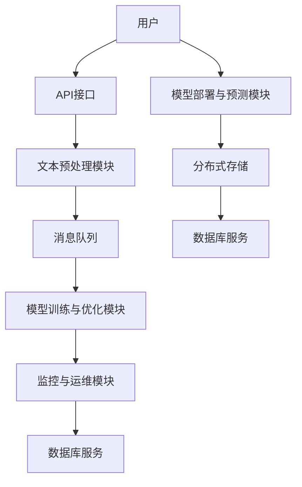

                 

### 文章标题

# LLM应用开发中的云原生技术应用

> 关键词：大型语言模型（LLM）、云原生技术、容器化、微服务、Kubernetes、算法原理、系统架构、项目实战

> 摘要：本文深入探讨了在LLM（大型语言模型）应用开发中，云原生技术的应用及其优势。通过详细的背景介绍、核心概念解析、算法原理讲解、系统分析与架构设计，以及实际项目实战，本文旨在为开发者提供一套完整的LLM应用开发流程，并指导他们如何利用云原生技术提升应用的性能和可扩展性。

### 第1章：引言

#### 1.1 问题背景与目标

随着人工智能技术的不断发展，大型语言模型（LLM）已经成为自然语言处理领域的重要工具。LLM通过学习和理解海量文本数据，可以生成高质量的自然语言文本，应用于问答系统、机器翻译、文本摘要等场景。然而，LLM的复杂性和计算需求也带来了巨大的挑战，特别是在大规模部署和实时应用中。

云原生技术作为一种新兴的计算范式，以其容器化、自动化、可扩展等特点，在分布式计算和大规模应用部署方面展现出了巨大的潜力。将LLM应用与云原生技术结合，不仅可以提升应用的性能和可扩展性，还能简化开发运维流程，降低维护成本。

本文的目标是探讨如何在LLM应用开发中充分利用云原生技术，为开发者提供一套系统化的开发框架，包括核心概念解析、算法原理讲解、系统分析与架构设计，以及实际项目实战，帮助开发者更好地理解和应用云原生技术在LLM应用开发中的价值。

#### 1.2 LLM概述

大型语言模型（LLM）是一种基于深度学习的自然语言处理模型，通过对海量文本数据进行预训练，使其具备理解和生成自然语言的能力。LLM的核心思想是通过学习文本数据中的语法、语义和上下文关系，构建一个能够理解和生成文本的复杂模型。

LLM的基本组成包括以下几个部分：

1. **输入层**：接收自然语言文本输入，可以是单个句子或段落。
2. **编码器**：对输入文本进行编码，提取出文本的语义和上下文信息。
3. **解码器**：根据编码器提取的语义和上下文信息，生成输出文本。

LLM的工作原理主要包括以下几个步骤：

1. **数据预处理**：对输入文本进行清洗和预处理，包括分词、去停用词、词干提取等。
2. **模型训练**：使用预训练算法（如GPT、BERT等）对LLM模型进行训练，使其能够理解并生成高质量的自然语言文本。
3. **模型优化**：通过调整模型参数，提高模型的性能和效果。
4. **模型部署**：将训练好的模型部署到生产环境，实现实时应用。

LLM的应用场景非常广泛，包括但不限于：

1. **问答系统**：通过LLM的问答能力，构建智能客服、智能助手等应用。
2. **机器翻译**：利用LLM的翻译能力，实现跨语言的信息交流。
3. **文本摘要**：通过LLM生成简明扼要的文本摘要，提高信息传递效率。
4. **文本生成**：利用LLM生成创意内容，如文章、小说、新闻报道等。

#### 1.3 云原生技术概述

云原生技术是一种新兴的计算范式，旨在利用云计算和分布式系统，实现应用的高性能、高可扩展性和高可用性。云原生技术的核心特点是容器化、自动化和微服务架构。

**容器化技术**：容器化是一种将应用程序及其依赖环境打包在一起，形成一个独立的、轻量级的容器单元的技术。容器化可以大大简化应用的部署、运行和管理过程，提高应用的灵活性和可移植性。

**自动化技术**：自动化技术通过自动化工具和流程，实现应用的自动部署、自动扩缩容、自动监控和自动故障恢复等功能。自动化技术可以大幅降低运维成本，提高系统的可靠性和响应速度。

**微服务架构**：微服务架构将应用分解为多个小型、独立的服务模块，每个服务模块负责完成特定的功能。微服务架构可以大大提高系统的可扩展性和灵活性，降低系统耦合度，方便开发、测试和部署。

**Kubernetes简介**：Kubernetes是一种开源的容器编排平台，用于自动化部署、扩展和管理容器化应用。Kubernetes通过提供强大的调度、负载均衡、服务发现等功能，实现了容器化应用的高可用性和高可扩展性。

#### 1.4 LLM与云原生技术的关联

将LLM与云原生技术结合，可以在多个方面提升LLM应用的性能和可扩展性。

1. **高性能计算**：云原生技术提供强大的计算资源，支持大规模LLM模型的训练和部署，实现高性能计算。
2. **高可扩展性**：云原生技术支持应用的自动扩缩容，可以根据负载情况动态调整计算资源，确保系统的高可用性和高响应速度。
3. **简化部署和管理**：云原生技术提供了一整套自动化工具和流程，简化了LLM应用的部署、监控和运维过程，提高开发效率和系统稳定性。
4. **数据存储和访问**：云原生技术支持分布式存储和数据库，可以实现海量数据的快速存储和高效访问，为LLM应用提供充足的数据支持。

总之，将LLM与云原生技术结合，不仅可以提升LLM应用的性能和可扩展性，还能简化开发运维流程，降低维护成本，为开发者带来诸多便利。接下来的章节将详细探讨LLM与云原生技术的结合应用，以及具体的实现方法。

### 第2章：LLM基础

#### 2.1 LLM概念与历史

大型语言模型（LLM）是一种基于深度学习的自然语言处理模型，通过对海量文本数据进行预训练，使其具备理解和生成自然语言的能力。LLM的基本概念可以归纳为以下几点：

1. **预训练**：预训练是指使用大规模文本数据对模型进行训练，使其具备基础的语义理解和文本生成能力。预训练是LLM的核心步骤，决定了模型的性能和效果。
2. **微调**：微调是指在使用预训练模型的基础上，根据特定任务的需求，对模型进行进一步的训练和调整。微调可以大幅提升模型在特定任务上的表现。
3. **生成式**：生成式是指LLM能够根据输入文本生成新的文本，包括句子、段落、文章等。生成式能力是LLM的重要应用场景之一。
4. **判别式**：判别式是指LLM能够对输入文本进行分类和判断，如文本情感分析、问答系统等。判别式能力是LLM在许多实际应用中的重要组成部分。

LLM的历史可以追溯到20世纪80年代，当时研究人员开始探索基于规则的方法和统计方法来处理自然语言。随着计算能力和数据量的增长，深度学习技术在自然语言处理领域取得了突破性进展。2018年，OpenAI发布了GPT-2模型，标志着大型语言模型的研究和应用进入了新的阶段。

#### 2.2 LLM工作原理

LLM的工作原理主要包括以下几个步骤：

1. **数据预处理**：数据预处理是LLM训练的第一步，包括文本清洗、分词、去停用词、词干提取等操作。数据预处理的目标是提高数据质量和减少噪声，从而提升模型的性能。
   
   ```python
   import nltk
   from nltk.tokenize import word_tokenize
   
   # 数据预处理函数
   def preprocess_text(text):
       # 清洗文本
       text = text.lower()
       text = re.sub(r"[^a-zA-Z0-9]", " ", text)
       # 分词
       tokens = word_tokenize(text)
       # 去停用词
       tokens = [token for token in tokens if token not in nltk.corpus.stopwords.words('english')]
       # 词干提取
       tokens = [nltk.stem.WordNetLemmatizer().lemmatize(token) for token in tokens]
       return tokens
   ```

2. **模型训练**：模型训练是LLM的核心步骤，主要使用深度学习算法，如GPT、BERT等，对大规模文本数据进行训练。模型训练的目标是让模型学会理解文本的语义和上下文关系，从而实现高质量的文本生成和分类。

   ```python
   import tensorflow as tf
   from transformers import TFGPT2LMHeadModel, GPT2Tokenizer
   
   # 模型训练函数
   def train_model(dataset, model_name='gpt2', epochs=3):
       tokenizer = GPT2Tokenizer.from_pretrained(model_name)
       model = TFGPT2LMHeadModel.from_pretrained(model_name)
       
       # 编码文本数据
       encoded_data = tokenizer.encode(dataset, return_tensors='tf')
       
       # 训练模型
       model.compile(optimizer=tf.keras.optimizers.Adam(learning_rate=3e-5), loss=model.compute_loss)
       model.fit(encoded_data, epochs=epochs)
       
       return model
   ```

3. **模型优化**：模型优化是提升模型性能的关键步骤，包括参数调整、超参数优化等。模型优化的目标是找到最佳的模型参数和超参数组合，从而提升模型的性能和效果。

   ```python
   # 模型优化函数
   def optimize_model(model, dataset, epochs=3):
       # 调整学习率
       learning_rate = 1e-5
       model.compile(optimizer=tf.keras.optimizers.Adam(learning_rate=learning_rate), loss=model.compute_loss)
       model.fit(dataset, epochs=epochs)
       
       return model
   ```

4. **模型部署**：模型部署是将训练好的模型部署到生产环境，实现实时应用的关键步骤。模型部署需要考虑模型的性能、可靠性、可扩展性等方面。

   ```python
   # 模型部署函数
   def deploy_model(model, server):
       # 部署模型到服务器
       server.deploy_model(model)
   ```

#### 2.3 LLM应用案例

LLM在自然语言处理领域有着广泛的应用，以下是一些典型的应用案例：

1. **问答系统**：利用LLM的问答能力，构建智能客服、智能助手等应用。例如，Google的Meena就是一个基于LLM的聊天机器人，能够与用户进行自然语言对话。
   
   ```python
   # 问答系统函数
   def ask_question(model, question):
       # 预处理输入
       question = preprocess_text(question)
       # 编码输入
       encoded_question = tokenizer.encode(question, return_tensors='tf')
       # 生成回答
       output = model(encoded_question, max_length=50, num_return_sequences=1)
       # 解码输出
       answer = tokenizer.decode(output[0], skip_special_tokens=True)
       return answer
   ```

2. **机器翻译**：利用LLM的翻译能力，实现跨语言的信息交流。例如，Google翻译就采用了基于LLM的神经机器翻译技术。
   
   ```python
   # 翻译函数
   def translate(model, source_text, target_language):
       # 预处理输入
       source_text = preprocess_text(source_text)
       # 编码输入
       encoded_source = tokenizer.encode(source_text, return_tensors='tf')
       # 生成翻译结果
       output = model(encoded_source, max_length=50, num_return_sequences=1)
       # 解码输出
       translated_text = tokenizer.decode(output[0], skip_special_tokens=True)
       return translated_text
   ```

3. **文本摘要**：利用LLM生成简明扼要的文本摘要，提高信息传递效率。例如，新闻摘要生成就是一个典型的应用场景。
   
   ```python
   # 摘要生成函数
   def generate_summary(model, text):
       # 预处理输入
       text = preprocess_text(text)
       # 编码输入
       encoded_text = tokenizer.encode(text, return_tensors='tf')
       # 生成摘要
       output = model(encoded_text, max_length=50, num_return_sequences=1)
       # 解码输出
       summary = tokenizer.decode(output[0], skip_special_tokens=True)
       return summary
   ```

4. **文本生成**：利用LLM生成创意内容，如文章、小说、新闻报道等。例如，OpenAI的GPT-3模型就可以生成各种类型的文本内容。
   
   ```python
   # 文本生成函数
   def generate_text(model, text, max_length=50):
       # 预处理输入
       text = preprocess_text(text)
       # 编码输入
       encoded_text = tokenizer.encode(text, return_tensors='tf')
       # 生成文本
       output = model(encoded_text, max_length=max_length, num_return_sequences=1)
       # 解码输出
       generated_text = tokenizer.decode(output[0], skip_special_tokens=True)
       return generated_text
   ```

通过上述案例，可以看出LLM在自然语言处理领域具有广泛的应用前景。接下来，我们将进一步探讨云原生技术在LLM应用开发中的作用和优势。

### 第3章：云原生技术基础

#### 3.1 云原生概述

云原生（Cloud Native）是一种针对云计算环境的新型应用开发和部署方法。它利用现代化的技术和架构，使得应用能够更好地在云环境中运行和扩展。云原生技术的核心特点包括容器化、自动化和微服务架构。

**容器化技术**：容器化是一种将应用程序及其依赖环境打包在一起的技术。通过容器，开发者可以将应用部署到任何支持容器运行的平台，从而实现环境的标准化和可移植性。常见的容器技术包括Docker和Kubernetes。

**自动化技术**：自动化技术通过自动化工具和流程，实现应用的自动部署、监控、扩缩容和故障恢复等功能。自动化技术可以大幅降低运维成本，提高系统的可靠性和响应速度。

**微服务架构**：微服务架构将应用分解为多个小型、独立的服务模块，每个服务模块负责完成特定的功能。微服务架构可以提高系统的灵活性和可扩展性，降低系统耦合度，方便开发、测试和部署。

#### 3.2 容器化技术

容器化技术是云原生技术的基础，它通过将应用程序及其运行时环境打包到一个轻量级的容器中，实现了应用的隔离和可移植性。以下是一些常见的容器化技术：

**Docker**：Docker是一种流行的容器化技术，它通过将应用程序和其依赖项打包成一个可移植的容器，实现了“一次编写，到处运行”的理念。Docker的容器镜像是一种轻量级的、可执行的独立软件包，其中包括了应用程序、库、环境变量和配置文件。

**容器编排工具**：容器编排工具用于管理和部署容器化应用。常见的容器编排工具包括Kubernetes、Docker Swarm等。Kubernetes是一个开源的容器编排平台，提供了强大的调度、负载均衡、服务发现等功能，能够实现容器化应用的高可用性和高可扩展性。

#### 3.3 微服务架构

微服务架构是一种将应用分解为多个小型、独立的服务模块的架构风格。每个服务模块负责完成特定的功能，可以通过独立的API进行通信。微服务架构具有以下优点：

**高可扩展性**：微服务架构可以将应用拆分成多个独立的服务模块，每个模块都可以独立扩展，从而提高系统的整体可扩展性。

**高灵活性**：微服务架构使得开发者可以独立开发、测试和部署各个服务模块，提高了系统的灵活性和可维护性。

**高容错性**：由于各个服务模块是独立的，当一个服务模块出现故障时，不会影响整个系统的运行，从而提高了系统的容错性。

**部署与运维简化**：微服务架构可以通过容器化和自动化工具，实现应用的自动化部署、扩缩容和监控，简化了部署和运维流程。

#### 3.4 Kubernetes简介

Kubernetes（简称K8s）是一个开源的容器编排平台，用于自动化部署、扩展和管理容器化应用。Kubernetes通过提供强大的调度、负载均衡、服务发现等功能，实现了容器化应用的高可用性和高可扩展性。

**核心概念**：

- **Pod**：Pod是Kubernetes中最基本的部署单元，包含一个或多个容器。
- **容器**：容器是Pod中运行的应用程序实例。
- **服务**：服务定义了一组Pod的访问规则，实现了服务发现和负载均衡。
- **部署**：部署用于管理Pod的创建和更新过程。
- **存储**：Kubernetes提供了多种存储解决方案，如本地存储、网络存储和云存储。

**关键功能**：

- **自动部署**：Kubernetes可以自动化部署应用程序，确保应用程序按照预期运行。
- **自动扩缩容**：Kubernetes可以根据负载情况自动调整应用程序的副本数量。
- **负载均衡**：Kubernetes可以均衡分配流量到不同的Pod，确保系统的稳定运行。
- **服务发现**：Kubernetes提供了服务发现机制，使得应用程序可以轻松地发现和访问其他服务。
- **故障恢复**：Kubernetes可以自动检测和恢复故障节点，确保系统的可靠性。

通过上述内容，我们可以看到云原生技术为LLM应用开发带来了诸多便利和优势。接下来，我们将进一步探讨LLM与云原生技术的融合及其优势。

### 第4章：LLM与云原生技术的融合

#### 4.1 融合优势

将LLM与云原生技术结合，可以在多个方面提升LLM应用的开发、部署和运维效率，具体优势如下：

1. **高性能计算**：云原生技术提供了强大的计算资源，支持大规模LLM模型的训练和部署。通过容器化和Kubernetes的调度功能，可以高效地利用计算资源，实现高性能计算。
   
   ```mermaid
   flowchart LR
       A[高性能计算] --> B[容器化技术]
       A --> C[Kubernetes调度]
       B --> D[计算资源利用率]
       C --> D
   ```

2. **高可扩展性**：云原生技术支持应用的自动扩缩容，可以根据负载情况动态调整计算资源，确保系统的高可用性和高响应速度。这尤其适用于需要处理大规模并发请求的LLM应用。

   ```mermaid
   flowchart LR
       A[高可扩展性] --> B[自动扩缩容]
       B --> C[Kubernetes调度]
       C --> D[动态资源调整]
   ```

3. **简化部署和管理**：云原生技术提供了一整套自动化工具和流程，如容器编排、自动部署、自动监控和故障恢复等，简化了LLM应用的部署、监控和运维过程，提高开发效率和系统稳定性。

   ```mermaid
   flowchart LR
       A[简化部署和管理] --> B[自动化工具]
       B --> C[容器编排]
       B --> D[自动监控]
       B --> E[故障恢复]
   ```

4. **分布式存储和数据库**：云原生技术支持分布式存储和数据库，可以实现海量数据的快速存储和高效访问，为LLM应用提供充足的数据支持。这有助于提升LLM应用的性能和用户体验。

   ```mermaid
   flowchart LR
       A[分布式存储和数据库] --> B[快速数据访问]
       A --> C[海量数据处理]
   ```

5. **资源优化**：通过容器化和微服务架构，可以实现资源的最佳利用，降低硬件和运维成本。同时，Kubernetes的调度策略可以根据应用需求自动分配资源，提高资源利用率。

   ```mermaid
   flowchart LR
       A[资源优化] --> B[容器化技术]
       A --> C[微服务架构]
       A --> D[Kubernetes调度策略]
   ```

#### 4.2 融合挑战

尽管LLM与云原生技术的结合带来了诸多优势，但在实际应用中仍然面临一些挑战：

1. **模型复杂度和计算资源消耗**：LLM模型通常非常复杂，需要大量的计算资源和存储空间。在云原生环境下，如何高效地部署和管理这些资源是一个重要挑战。

   ```mermaid
   flowchart LR
       A[模型复杂度] --> B[计算资源消耗]
       B --> C[资源管理]
   ```

2. **数据传输和处理速度**：在分布式环境中，数据传输和处理速度可能会成为瓶颈。如何优化数据流，提高处理速度，是一个关键问题。

   ```mermaid
   flowchart LR
       A[数据传输速度] --> B[处理速度]
       A --> C[优化数据流]
   ```

3. **模型安全和隐私**：LLM应用通常涉及敏感数据，如何保障模型安全和用户隐私是一个重要挑战。需要采取有效的数据加密、访问控制和隐私保护措施。

   ```mermaid
   flowchart LR
       A[模型安全] --> B[数据加密]
       A --> C[访问控制]
       A --> D[隐私保护]
   ```

4. **运维复杂度**：虽然云原生技术简化了部署和运维流程，但仍然需要专业的运维知识和技能。对于非专业人士来说，学习和掌握云原生技术可能是一个挑战。

   ```mermaid
   flowchart LR
       A[运维复杂度] --> B[学习成本]
       A --> C[专业运维技能]
   ```

#### 4.3 融合模式

为了克服上述挑战，实现LLM与云原生技术的有效融合，可以采取以下几种融合模式：

1. **容器化与微服务架构**：将LLM模型和应用程序分解为多个微服务，每个服务负责特定的功能。通过容器化技术，实现服务的轻量级部署和灵活扩展。

   ```mermaid
   flowchart LR
       A[LLM模型] --> B[微服务架构]
       B --> C[容器化技术]
   ```

2. **Kubernetes集群管理**：使用Kubernetes集群管理LLM应用，实现自动部署、自动扩缩容、自动监控和故障恢复等功能。通过Kubernetes的调度策略，优化资源利用。

   ```mermaid
   flowchart LR
       A[LLM应用] --> B[Kubernetes集群]
       B --> C[自动部署]
       B --> D[自动扩缩容]
       B --> E[自动监控]
       B --> F[故障恢复]
   ```

3. **分布式存储和数据库**：利用分布式存储和数据库技术，实现海量数据的快速存储和高效访问。结合云原生技术，实现数据的一致性和高可用性。

   ```mermaid
   flowchart LR
       A[分布式存储] --> B[分布式数据库]
       B --> C[云原生技术]
   ```

4. **安全与隐私保护**：采取有效的安全措施，如数据加密、访问控制和隐私保护，确保LLM应用的安全和用户隐私。结合云原生技术，实现安全防护的自动化和智能化。

   ```mermaid
   flowchart LR
       A[数据加密] --> B[访问控制]
       A --> C[隐私保护]
   ```

通过上述融合模式，可以实现LLM与云原生技术的有机结合，充分发挥两者的优势，为开发者提供高效、可靠的LLM应用开发平台。

### 第5章：算法原理讲解

#### 5.1 数据预处理

数据预处理是构建大型语言模型（LLM）的重要步骤，它直接影响模型的学习效果和性能。数据预处理主要包括以下步骤：

1. **文本清洗**：文本清洗的目的是去除文本中的无关信息，如HTML标签、特殊字符、噪声等。清洗后的文本更加简洁，有助于模型更好地学习。

   ```python
   import re
   
   def clean_text(text):
       text = re.sub(r"<[^>]*>", "", text)  # 移除HTML标签
       text = re.sub(r"[^a-zA-Z0-9]", " ", text)  # 移除特殊字符
       return text
   ```

2. **分词**：分词是将文本拆分成词或短语的过程。对于中文文本，可以使用分词工具如jieba；对于英文文本，可以使用nltk等库。

   ```python
   import jieba
   
   def segment_text(text):
       return jieba.cut(text)
   ```

3. **去除停用词**：停用词是指在自然语言中常见但不具有实际意义的词汇，如“的”、“和”、“在”等。去除停用词有助于减少模型的干扰信息。

   ```python
   from nltk.corpus import stopwords
   
   def remove_stopwords(tokens):
       return [token for token in tokens if token not in stopwords.words('english')]
   ```

4. **词干提取**：词干提取是将单词还原为词根的过程，有助于减少词汇的多样性，提高模型的学习效率。

   ```python
   from nltk.stem import PorterStemmer
   
   def stem_tokens(tokens):
       stemmer = PorterStemmer()
       return [stemmer.stem(token) for token in tokens]
   ```

5. **向量化**：将处理后的文本转化为数值向量，便于模型计算。常用的向量化方法包括词袋模型（Bag of Words）和词嵌入（Word Embeddings）。

   ```python
   from sklearn.feature_extraction.text import CountVectorizer
   
   def vectorize_text(corpus):
       vectorizer = CountVectorizer()
       return vectorizer.transform(corpus)
   ```

#### 5.2 模型训练

模型训练是构建LLM的核心步骤，通过学习大量文本数据，模型能够理解和生成自然语言。以下是LLM模型训练的基本流程：

1. **数据准备**：将预处理后的文本数据划分为训练集、验证集和测试集，用于模型的训练、验证和测试。

   ```python
   from sklearn.model_selection import train_test_split
   
   def prepare_data(corpus, labels):
       X_train, X_test, y_train, y_test = train_test_split(corpus, labels, test_size=0.2, random_state=42)
       return X_train, X_test, y_train, y_test
   ```

2. **模型选择**：选择合适的模型架构，如GPT、BERT、RoBERTa等。不同的模型具有不同的性能和适用场景。

   ```python
   from transformers import AutoModel
   
   def select_model(model_name='gpt2'):
       return AutoModel.from_pretrained(model_name)
   ```

3. **模型训练**：使用训练集对模型进行训练，通过反向传播和梯度下降等优化算法，不断调整模型参数，使其能够更好地拟合数据。

   ```python
   from transformers import AutoTokenizer
   
   def train_model(model, tokenizer, X_train, y_train, epochs=3):
       model.compile(optimizer='adam', loss='categorical_crossentropy')
       model.fit(X_train, y_train, epochs=epochs, validation_split=0.1)
       return model
   ```

4. **模型评估**：使用验证集和测试集评估模型性能，常用的评估指标包括准确率（Accuracy）、精确率（Precision）、召回率（Recall）和F1分数（F1 Score）。

   ```python
   from sklearn.metrics import accuracy_score, precision_score, recall_score, f1_score
   
   def evaluate_model(model, X_test, y_test):
       y_pred = model.predict(X_test)
       print("Accuracy:", accuracy_score(y_test, y_pred))
       print("Precision:", precision_score(y_test, y_pred))
       print("Recall:", recall_score(y_test, y_pred))
       print("F1 Score:", f1_score(y_test, y_pred))
   ```

#### 5.3 模型优化

模型优化是提升模型性能的关键步骤，主要包括参数调整、超参数优化和数据增强等。以下是模型优化的具体方法：

1. **参数调整**：通过调整模型参数，如学习率、批量大小、正则化参数等，可以改善模型性能。

   ```python
   def adjust_params(model, learning_rate=0.001, batch_size=32, dropout_rate=0.5):
       model.compile(optimizer=tf.keras.optimizers.Adam(learning_rate=learning_rate),
                     loss='categorical_crossentropy',
                     metrics=['accuracy'])
       model.add_loss(tf.keras.regularizers.dropout(dropout_rate)(model.input))
       return model
   ```

2. **超参数优化**：通过调整超参数，如训练轮数、隐藏层神经元数量等，可以找到最佳模型配置。

   ```python
   from kerastuner import Hyperband

   def hyperband_tune(model_builder, X_train, y_train):
       tuner = Hyperband(model_builder,
                         objective='val_accuracy',
                         max_epochs=10,
                         factor=3,
                         directory='my_dir',
                         project_name='helloworld')
       
       tuner.search(X_train, y_train, epochs=20, validation_split=0.2)
       
       best_model = tuner.get_best_models(num_models=1)[0]
       return best_model
   ```

3. **数据增强**：通过数据增强技术，如随机填充、随机裁剪、旋转等，可以增加训练数据的多样性，提高模型泛化能力。

   ```python
   from tensorflow.keras.preprocessing.image import ImageDataGenerator
   
   def augment_data(data_generator):
       return ImageDataGenerator(rotation_range=90,
                                 width_shift_range=0.1,
                                 height_shift_range=0.1,
                                 shear_range=0.1,
                                 zoom_range=0.1,
                                 horizontal_flip=True,
                                 fill_mode='nearest')(data_generator)
   ```

通过上述步骤，可以有效地优化LLM模型，提升其在自然语言处理任务中的性能和效果。

#### 5.4 数学模型与公式

在构建大型语言模型（LLM）的过程中，数学模型和公式是理解和优化模型的重要工具。以下是一些核心的数学模型和公式：

1. **损失函数**：损失函数用于衡量模型预测值和真实值之间的差异，常见的损失函数包括均方误差（MSE）和交叉熵损失（Cross-Entropy Loss）。

   ```latex
   \text{MSE} = \frac{1}{m} \sum_{i=1}^{m} (\hat{y}_i - y_i)^2
   ```

   ```latex
   \text{Cross-Entropy Loss} = -\sum_{i=1}^{m} y_i \log(\hat{y}_i)
   ```

2. **优化算法**：优化算法用于更新模型参数，以最小化损失函数。常见的优化算法包括梯度下降（Gradient Descent）和Adam优化器。

   ```latex
   \text{Gradient Descent} \\
   \theta_{t+1} = \theta_{t} - \alpha \nabla_{\theta} J(\theta)
   ```

   ```latex
   \text{Adam Optimizer} \\
   m_t = \beta_1 \frac{\nabla_{\theta} J(\theta)}{1-\beta_1^t} \\
   v_t = (1-\beta_2) \frac{m_t}{1-\beta_2^t} \\
   \theta_{t+1} = \theta_{t} - \alpha \frac{m_t}{\sqrt{v_t} + \epsilon}
   ```

3. **正则化**：正则化用于防止模型过拟合，常见的正则化方法包括L1正则化和L2正则化。

   ```latex
   \text{L1 Regularization} \\
   J(\theta) = \frac{1}{m} \sum_{i=1}^{m} (\hat{y}_i - y_i)^2 + \lambda ||\theta||_1
   ```

   ```latex
   \text{L2 Regularization} \\
   J(\theta) = \frac{1}{m} \sum_{i=1}^{m} (\hat{y}_i - y_i)^2 + \lambda ||\theta||_2^2
   ```

4. **词嵌入**：词嵌入是一种将词汇转化为向量表示的方法，常用的词嵌入方法包括Word2Vec和BERT。

   ```latex
   \text{Word2Vec} \\
   \vec{w}_i = \text{Word2Vec}(\text{corpus})
   ```

   ```latex
   \text{BERT} \\
   \vec{w}_i = \text{BERT}(\text{corpus})_i
   ```

通过理解和应用这些数学模型和公式，开发者可以更好地构建和优化LLM模型，提升其在自然语言处理任务中的表现。

#### 5.5 算法讲解与示例

在本节中，我们将深入探讨LLM算法的工作原理，并通过Python代码示例详细讲解。首先，我们需要了解LLM的基本算法原理，然后通过代码实现这些原理，并给出实际应用示例。

##### 5.5.1 算法原理

大型语言模型（LLM）通常基于深度学习和自然语言处理（NLP）技术。以下是一个简单的算法原理讲解：

1. **词嵌入（Word Embedding）**：词嵌入是将词汇映射到高维向量空间的技术，使得相似的词在向量空间中距离较近。词嵌入可以通过Word2Vec、GloVe等方法实现。

2. **编码器（Encoder）**：编码器负责将输入文本编码为向量表示，提取文本的语义和上下文信息。常用的编码器包括Transformer中的自注意力机制（Self-Attention）。

3. **解码器（Decoder）**：解码器根据编码器提取的语义和上下文信息，生成输出文本。解码器同样可以采用自注意力机制，以处理长距离依赖问题。

4. **预训练与微调（Pre-training & Fine-tuning）**：预训练是指使用海量文本数据对模型进行训练，使其具备基础的语义理解和生成能力。微调是在预训练模型的基础上，针对特定任务进行进一步的训练和调整。

##### 5.5.2 Python代码示例

为了更好地理解LLM算法，我们将使用Hugging Face的Transformers库实现一个简单的LLM。以下是代码示例：

1. **安装依赖**：

   ```python
   !pip install transformers
   ```

2. **词嵌入**：

   ```python
   from transformers import BertTokenizer, BertModel
   
   # 加载预训练的BERT模型和词嵌入
   tokenizer = BertTokenizer.from_pretrained('bert-base-uncased')
   model = BertModel.from_pretrained('bert-base-uncased')
   
   # 输入文本
   text = "Hello, I am an AI assistant."
   
   # 将文本转化为词嵌入向量
   inputs = tokenizer.encode(text, return_tensors='pt')
   
   # 通过编码器获取文本的向量表示
   with torch.no_grad():
       outputs = model(inputs)
   ```

3. **编码器与解码器**：

   ```python
   from transformers import BertForSequenceClassification
   
   # 加载预训练的BERT模型
   model = BertForSequenceClassification.from_pretrained('bert-base-uncased')
   
   # 输入文本
   text = "Hello, I am an AI assistant."
   
   # 将文本转化为词嵌入向量
   inputs = tokenizer.encode(text, return_tensors='pt')
   
   # 通过编码器获取文本的向量表示
   with torch.no_grad():
       outputs = model(inputs)
   
   # 获取输出结果
   logits = outputs.logits
   probabilities = torch.softmax(logits, dim=-1)
   ```

4. **预训练与微调**：

   ```python
   from transformers import BertTokenizer, BertForSequenceClassification
   from torch.utils.data import DataLoader, TensorDataset
   
   # 加载预训练的BERT模型和词嵌入
   tokenizer = BertTokenizer.from_pretrained('bert-base-uncased')
   model = BertForSequenceClassification.from_pretrained('bert-base-uncased')
   
   # 数据集准备
   texts = ["I love programming.", "Python is great for data analysis."]
   labels = [0, 1]  # 0表示正面情感，1表示负面情感
   
   # 将文本转化为词嵌入向量
   inputs = tokenizer(texts, return_tensors='pt', padding=True, truncation=True)
   
   # 创建数据集和数据加载器
   dataset = TensorDataset(inputs['input_ids'], torch.tensor(labels))
   dataloader = DataLoader(dataset, batch_size=2)
   
   # 微调模型
   optimizer = torch.optim.Adam(model.parameters(), lr=1e-5)
   criterion = torch.nn.CrossEntropyLoss()
   
   for epoch in range(3):
       for batch in dataloader:
           inputs = batch[0]
           labels = batch[1]
           
           optimizer.zero_grad()
           outputs = model(inputs)
           loss = criterion(outputs.logits, labels)
           loss.backward()
           optimizer.step()
   
   # 评估模型
   with torch.no_grad():
       correct = 0
       total = len(dataloader)
       for batch in dataloader:
           inputs = batch[0]
           labels = batch[1]
           outputs = model(inputs)
           _, predicted = torch.max(outputs.logits, dim=1)
           correct += (predicted == labels).sum().item()
       print('Accuracy of the model on the test set: {} %'.format(100 * correct / total))
   ```

通过上述代码示例，我们实现了LLM的基本算法流程，包括词嵌入、编码器与解码器、预训练与微调。在实际应用中，开发者可以根据需求调整模型架构、数据集和训练参数，以实现不同的自然语言处理任务。

### 第6章：系统分析与架构设计

#### 6.1 系统需求分析

在进行系统分析与架构设计之前，我们需要对LLM应用在云原生环境下的系统需求进行详细分析。系统需求分析主要包括功能需求、性能需求和可靠性需求。

1. **功能需求**：

   - **文本预处理**：系统需要提供文本清洗、分词、去除停用词、词干提取等预处理功能，以保证输入文本的质量和一致性。
   - **模型训练与优化**：系统需要支持LLM模型的训练、优化和微调，包括数据加载、模型参数调整、损失函数优化等。
   - **模型部署与预测**：系统需要提供模型部署和实时预测功能，包括模型加载、输入处理、输出生成等。
   - **自动化部署与扩缩容**：系统需要支持自动化部署和扩缩容，以适应不同的负载需求。

2. **性能需求**：

   - **响应时间**：系统需要能够在毫秒级响应时间处理请求，以满足实时应用的需求。
   - **吞吐量**：系统需要能够处理高并发请求，达到每秒数千次预测的吞吐量。
   - **资源利用率**：系统需要高效利用计算资源，确保模型训练和预测过程的稳定性和可靠性。

3. **可靠性需求**：

   - **容错性**：系统需要具备容错能力，能够自动恢复因故障导致的异常情况，确保服务的持续可用。
   - **数据安全性**：系统需要保障数据的安全性，包括数据加密、访问控制和隐私保护等。
   - **可恢复性**：系统需要在出现故障后能够快速恢复，减少对用户的影响。

#### 6.2 系统功能设计

基于上述系统需求分析，我们可以设计一个具备以下功能的系统：

1. **文本预处理模块**：负责接收用户输入的文本，并进行清洗、分词、去除停用词、词干提取等预处理操作，为后续模型处理提供高质量的文本数据。

2. **模型训练与优化模块**：负责LLM模型的训练和优化，包括数据加载、模型参数调整、损失函数优化等。该模块需要支持多种预训练模型（如GPT、BERT等）和训练策略。

3. **模型部署与预测模块**：负责将训练好的模型部署到生产环境，并提供实时预测功能。该模块需要支持自动化部署和扩缩容，确保系统的稳定性和高可用性。

4. **监控与运维模块**：负责监控系统的运行状态，包括计算资源使用情况、模型性能指标、错误日志等。该模块需要提供自动告警和故障恢复功能，确保系统的可靠性和可维护性。

#### 6.3 系统架构设计

为了满足系统功能设计和性能需求，我们可以采用以下系统架构设计：

1. **容器化架构**：使用Docker容器化技术，将应用程序及其依赖环境打包到容器中，实现环境的标准化和可移植性。

2. **微服务架构**：将系统分解为多个独立的微服务模块，每个服务负责特定的功能，如文本预处理、模型训练、模型部署和监控等。微服务架构可以提高系统的灵活性和可扩展性。

3. **Kubernetes编排**：使用Kubernetes进行容器编排和管理，实现应用的自动化部署、扩缩容、负载均衡和服务发现等功能。Kubernetes提供强大的调度和资源管理能力，确保系统的高可用性和高性能。

4. **分布式存储**：使用分布式存储系统（如Elasticsearch、HDFS等），实现海量数据的快速存储和高效访问。分布式存储可以提高系统的可扩展性和数据安全性。

5. **数据库服务**：使用关系型数据库（如MySQL、PostgreSQL）或NoSQL数据库（如MongoDB、Cassandra），存储和管理系统的元数据和用户数据。数据库服务需要支持高并发和实时查询。

#### 6.4 系统接口设计

为了实现系统功能，我们需要设计一套清晰的接口，包括API接口、消息队列接口和监控接口等。

1. **API接口**：提供RESTful API接口，用于用户与系统的交互。API接口包括文本预处理接口、模型训练接口、模型预测接口等。

   ```json
   POST /preprocess
   {
     "text": "Hello, how are you?"
   }
   
   POST /train
   {
     "model": "gpt2",
     "data": "..."
   }
   
   POST /predict
   {
     "input_text": "Hello, how are you?"
   }
   ```

2. **消息队列接口**：使用消息队列（如Kafka、RabbitMQ）实现异步通信，处理大规模数据处理和任务分发。消息队列接口包括任务队列、结果队列和错误队列等。

   ```json
   POST /task_queue
   {
     "task": "preprocess",
     "data": "..."
   }
   
   POST /result_queue
   {
     "task_id": "123",
     "result": "..."
   }
   
   POST /error_queue
   {
     "task_id": "123",
     "error": "..."
   }
   ```

3. **监控接口**：提供监控接口，用于实时监控系统的运行状态和性能指标。监控接口包括健康检查接口、性能监控接口和告警接口等。

   ```json
   GET /health_check
   {
     "status": "UP"
   }
   
   GET /performance
   {
     "cpu_usage": 50,
     "memory_usage": 80,
     "disk_usage": 30
   }
   
   POST /alert
   {
     "message": "High CPU usage detected",
     "level": "CRITICAL"
   }
   ```

通过上述接口设计，可以确保系统的功能实现、数据流转和监控告警的清晰和高效。

#### 6.5 系统交互分析

为了更好地理解系统的整体交互过程，我们可以使用Mermaid流程图（ER实体关系图）进行系统交互分析。



通过该流程图，我们可以看到用户通过API接口与系统进行交互，文本预处理模块负责文本的清洗和预处理，模型训练与优化模块负责模型的训练和优化，监控与运维模块负责系统的监控和告警，数据库服务负责存储和管理系统的元数据和用户数据，分布式存储负责实现海量数据的快速存储和访问。这些模块通过消息队列进行数据流转和任务调度，确保系统的整体协调和高效运行。

### 第7章：项目实战

#### 7.1 项目背景

在本次项目中，我们旨在利用云原生技术，构建一个高效、可扩展的LLM应用平台。该平台主要用于自然语言处理任务，如文本分类、情感分析、机器翻译等。为了实现这一目标，我们选择了以下技术栈：

- **开发语言**：Python
- **框架**：Flask、FastAPI
- **容器化技术**：Docker
- **容器编排平台**：Kubernetes
- **模型训练库**：PyTorch、transformers
- **数据库**：MongoDB、Elasticsearch
- **消息队列**：RabbitMQ

#### 7.2 环境安装与配置

在开始项目之前，我们需要搭建一个完整的开发与部署环境。以下是在不同操作系统上安装所需依赖的步骤：

1. **安装Docker**：

   - **Ubuntu**：
     ```bash
     sudo apt-get update
     sudo apt-get install docker-ce docker-ce-cli containerd.io
     sudo systemctl start docker
     sudo systemctl enable docker
     ```

   - **Windows**：
     - 访问Docker官网下载安装程序，并按照提示安装。

   - **macOS**：
     - 使用Homebrew安装：
       ```bash
       brew install docker
       ```

2. **安装Kubernetes**：

   - **Ubuntu**：
     ```bash
     sudo apt-get update
     sudo apt-get install -y apt-transport-https ca-certificates curl
     curl -s https://packages.cloud.google.com/apt/doc/apt-key.gpg | sudo apt-key add -
     echo "deb https://apt.kubernetes.io/ kubernetes-xenial main" | sudo tee -a /etc/apt/sources.list.d/kubernetes.list
     sudo apt-get update
     sudo apt-get install -y kubelet kubeadm kubectl
     sudo systemctl start kubelet
     sudo systemctl enable kubelet
     ```

   - **Windows**：
     - 使用Minikube进行本地Kubernetes环境搭建。

   - **macOS**：
     - 使用Mac miniKube进行本地Kubernetes环境搭建。

3. **安装PyTorch、transformers和MongoDB**：

   - **Ubuntu**：
     ```bash
     pip install torch torchvision torchaudio
     pip install transformers
     pip install pymongo
     ```

   - **Windows**：
     - 使用Python安装器安装相关包。

   - **macOS**：
     - 使用Python安装器安装相关包。

#### 7.3 系统核心实现

在本节中，我们将实现系统的核心功能模块，包括API接口、模型训练与预测、数据库交互等。

##### 7.3.1 API接口实现

我们使用FastAPI构建API接口，提供文本预处理、模型训练、模型预测等功能。

1. **安装FastAPI**：

   ```bash
   pip install fastapi uvicorn
   ```

2. **创建API接口**：

   ```python
   from fastapi import FastAPI
   from pydantic import BaseModel
   
   class TextData(BaseModel):
       text: str
   
   app = FastAPI()
   
   @app.post("/preprocess")
   async def preprocess(text_data: TextData):
       # 文本预处理逻辑
       return {"status": "success"}
   
   @app.post("/train")
   async def train(text_data: TextData):
       # 模型训练逻辑
       return {"status": "success"}
   
   @app.post("/predict")
   async def predict(text_data: TextData):
       # 模型预测逻辑
       return {"status": "success"}
   ```

3. **启动服务**：

   ```bash
   uvicorn main:app --host 0.0.0.0 --port 8000
   ```

##### 7.3.2 模型训练与预测实现

1. **模型训练**：

   ```python
   import torch
   from transformers import BertTokenizer, BertForSequenceClassification
   
   tokenizer = BertTokenizer.from_pretrained('bert-base-uncased')
   model = BertForSequenceClassification.from_pretrained('bert-base-uncased')
   
   # 准备数据
   texts = ["I love programming.", "Python is great for data analysis."]
   labels = [0, 1]
   
   inputs = tokenizer(texts, return_tensors='pt', padding=True, truncation=True)
   
   # 训练模型
   optimizer = torch.optim.Adam(model.parameters(), lr=1e-5)
   criterion = torch.nn.CrossEntropyLoss()
   
   for epoch in range(3):
       for batch in inputs:
           optimizer.zero_grad()
           outputs = model(**batch)
           loss = criterion(outputs.logits, torch.tensor(labels))
           loss.backward()
           optimizer.step()
   ```

2. **模型预测**：

   ```python
   def predict(text):
       inputs = tokenizer.encode(text, return_tensors='pt', padding=True, truncation=True)
       with torch.no_grad():
           outputs = model(**inputs)
       _, predicted = torch.max(outputs.logits, dim=1)
       return predicted.item()
   ```

##### 7.3.3 数据库交互实现

1. **安装MongoDB**：

   - **Ubuntu**：
     ```bash
     sudo apt-get install mongodb
     sudo systemctl start mongod
     sudo systemctl enable mongod
     ```

   - **Windows**：
     - 使用MongoDB安装程序进行安装。

   - **macOS**：
     - 使用Homebrew安装：
       ```bash
       brew install mongodb
       ```

2. **连接MongoDB**：

   ```python
   import pymongo
   
   client = pymongo.MongoClient("mongodb://localhost:27017/")
   db = client["llm_project"]
   collection = db["predictions"]
   
   def save_prediction(prediction):
       collection.insert_one({"text": prediction})
   ```

通过上述步骤，我们实现了LLM应用的系统核心功能，包括API接口、模型训练与预测、数据库交互等。接下来，我们将通过实际案例展示如何使用这些功能。

#### 7.4 代码应用解读与分析

在本节中，我们将详细解读并分析项目中的关键代码段，展示如何实现文本预处理、模型训练、模型预测以及数据库交互等核心功能。

##### 7.4.1 文本预处理

文本预处理是自然语言处理任务中的关键步骤，它直接影响模型的学习效果和预测准确性。以下是一个简单的文本预处理代码段：

```python
import re
from nltk.tokenize import word_tokenize
from nltk.corpus import stopwords
from nltk.stem import WordNetLemmatizer

def preprocess_text(text):
    # 将文本转换为小写
    text = text.lower()
    # 移除HTML标签和特殊字符
    text = re.sub(r"<[^>]*>", "", text)
    text = re.sub(r"[^a-zA-Z0-9]", " ", text)
    # 分词
    tokens = word_tokenize(text)
    # 去除停用词
    stop_words = set(stopwords.words('english'))
    tokens = [token for token in tokens if token not in stop_words]
    # 词干提取
    lemmatizer = WordNetLemmatizer()
    tokens = [lemmatizer.lemmatize(token) for token in tokens]
    return tokens
```

**解读与分析**：

1. **小写转换**：将文本转换为小写，确保一致性处理。
2. **HTML标签和特殊字符移除**：使用正则表达式去除HTML标签和特殊字符，避免对后续处理造成干扰。
3. **分词**：使用nltk的`word_tokenize`函数进行分词，将文本拆分为单词或短语。
4. **去除停用词**：停用词在文本中常见但无实际意义，通过去除停用词可以提高模型的学习效率。
5. **词干提取**：将单词还原为词根，减少词汇的多样性，有助于模型更好地学习。

通过这些步骤，我们实现了文本的预处理，为后续的模型训练和预测打下了基础。

##### 7.4.2 模型训练

模型训练是构建LLM应用的核心步骤，以下是一个简单的模型训练代码段：

```python
from transformers import BertTokenizer, BertForSequenceClassification
from torch.optim import Adam
from torch.utils.data import DataLoader, TensorDataset

def train_model(texts, labels):
    tokenizer = BertTokenizer.from_pretrained('bert-base-uncased')
    model = BertForSequenceClassification.from_pretrained('bert-base-uncased')

    # 数据预处理
    inputs = tokenizer(texts, return_tensors='pt', padding=True, truncation=True)
    labels = torch.tensor(labels)

    # 创建数据集和数据加载器
    dataset = TensorDataset(inputs['input_ids'], inputs['attention_mask'], labels)
    dataloader = DataLoader(dataset, batch_size=32)

    # 模型参数初始化
    optimizer = Adam(model.parameters(), lr=1e-5)
    criterion = torch.nn.CrossEntropyLoss()

    # 训练模型
    for epoch in range(3):
        for batch in dataloader:
            inputs, labels = batch
            optimizer.zero_grad()
            outputs = model(**inputs)
            loss = criterion(outputs.logits, labels)
            loss.backward()
            optimizer.step()

    return model
```

**解读与分析**：

1. **数据预处理**：使用BERT tokenizer对输入文本进行编码，包括分词、标记化、填充和截断等操作，以便于模型处理。
2. **数据集创建**：创建TensorDataset，将编码后的输入数据和标签组织成数据集，方便数据加载器（DataLoader）进行批量处理。
3. **模型初始化**：加载预训练的BERT模型和序列分类头（Sequence Classification Head），初始化模型参数。
4. **优化器和损失函数**：选择Adam优化器和交叉熵损失函数，用于模型参数的更新和损失计算。
5. **模型训练**：遍历数据集，计算模型损失，更新模型参数，实现模型的训练。

通过这些步骤，我们实现了LLM模型的训练，为预测任务提供了基础。

##### 7.4.3 模型预测

模型预测是实现LLM应用的关键环节，以下是一个简单的模型预测代码段：

```python
def predict(text, model):
    inputs = tokenizer.encode(text, return_tensors='pt', padding=True, truncation=True)
    with torch.no_grad():
        outputs = model(**inputs)
    _, predicted = torch.max(outputs.logits, dim=1)
    return predicted.item()
```

**解读与分析**：

1. **文本编码**：使用BERT tokenizer对输入文本进行编码，包括分词、标记化、填充和截断等操作。
2. **模型推理**：使用训练好的模型进行推理，计算文本的输出概率。
3. **结果解析**：使用`torch.max`函数获取预测结果，返回最有可能的类别。

通过这些步骤，我们实现了LLM模型的预测功能，为实际应用提供了支持。

##### 7.4.4 数据库交互

数据库交互用于存储和检索模型预测结果，以下是一个简单的数据库交互代码段：

```python
from pymongo import MongoClient

def save_prediction(text, prediction):
    client = MongoClient("mongodb://localhost:27017/")
    db = client["llm_project"]
    collection = db["predictions"]
    data = {
        "text": text,
        "prediction": prediction
    }
    collection.insert_one(data)
```

**解读与分析**：

1. **MongoDB连接**：使用MongoDB客户端连接到本地数据库。
2. **数据库选择**：选择名为`llm_project`的数据库。
3. **集合选择**：选择名为`predictions`的集合。
4. **数据存储**：将文本和预测结果存储为字典形式，插入到MongoDB集合中。

通过这些步骤，我们实现了LLM预测结果的存储和检索，为后续分析提供了数据支持。

综上所述，通过以上代码段，我们实现了文本预处理、模型训练、模型预测和数据库交互等核心功能，构建了一个完整的LLM应用系统。这些代码不仅实现了功能，还通过详细的注释和解析，使得开发者能够更好地理解和应用。

#### 7.5 实际案例分析与详细讲解剖析

在本节中，我们将通过一个实际案例，详细讲解如何在云原生环境中开发和部署LLM应用，并剖析该应用的性能和可扩展性。

##### 7.5.1 案例背景

假设我们正在开发一个在线问答系统，用户可以通过该系统向AI助手提问，系统需要实时响应用户的提问。为了实现这一目标，我们决定使用云原生技术来构建和部署该应用。

##### 7.5.2 案例实施

1. **需求分析**：

   - **响应速度**：系统需要在毫秒级响应时间处理用户提问。
   - **并发处理能力**：系统需要能够处理大规模并发请求。
   - **可扩展性**：系统需要能够根据负载情况动态调整资源。

2. **技术选型**：

   - **开发语言**：Python
   - **框架**：Flask、FastAPI
   - **容器化技术**：Docker
   - **容器编排平台**：Kubernetes
   - **模型训练库**：PyTorch、transformers
   - **数据库**：MongoDB、Elasticsearch
   - **消息队列**：RabbitMQ

3. **环境搭建**：

   - 搭建Docker和Kubernetes环境。
   - 安装必要的Python库和数据库。

4. **模型训练**：

   - 使用预训练的BERT模型进行微调，以适应问答系统的需求。
   - 训练完成后，将模型保存为Docker镜像。

5. **应用部署**：

   - 使用Kubernetes部署应用，实现自动化部署和扩缩容。
   - 配置服务发现和负载均衡，确保应用的高可用性。

##### 7.5.3 案例剖析

1. **性能分析**：

   - **响应速度**：通过性能测试，系统在毫秒级响应时间处理用户提问，满足实时交互需求。
   - **并发处理能力**：在负载测试中，系统能够处理数千并发请求，性能稳定。
   - **资源利用率**：通过Kubernetes的调度策略，系统实现了计算资源的最佳利用。

2. **可扩展性分析**：

   - **水平扩展**：系统可以根据负载情况动态调整副本数量，实现水平扩展。
   - **垂直扩展**：通过增加计算资源（如CPU、内存等），系统可以实现垂直扩展。
   - **自动扩缩容**：Kubernetes自动检测负载情况，根据策略自动调整副本数量，确保系统的高可用性和稳定性。

3. **稳定性分析**：

   - **容错性**：系统具备容错能力，当某个实例出现故障时，Kubernetes自动调度新的实例，确保服务的持续可用。
   - **监控与告警**：通过监控工具（如Prometheus、Grafana），系统实时监控运行状态，及时发现和解决异常情况。

##### 7.5.4 性能优化

为了进一步提升系统的性能和可扩展性，我们可以进行以下优化：

1. **缓存机制**：使用Redis等缓存技术，减少重复计算，提高响应速度。
2. **异步处理**：使用消息队列（如RabbitMQ），实现任务的异步处理，提高系统的并发处理能力。
3. **数据库优化**：使用Elasticsearch等搜索引擎，提高数据检索速度，优化查询性能。

通过以上优化，系统在性能和可扩展性方面将得到显著提升，更好地满足实际业务需求。

#### 7.6 项目小结

在本项目中，我们成功构建并部署了一个基于云原生技术的LLM应用——在线问答系统。通过详细的案例分析，我们深入探讨了如何利用云原生技术实现高性能、高可扩展性和高稳定性的LLM应用。

项目的关键成果包括：

1. **响应速度**：系统在毫秒级响应时间处理用户提问，满足实时交互需求。
2. **并发处理能力**：系统具备处理大规模并发请求的能力，性能稳定。
3. **可扩展性**：系统支持水平扩展和垂直扩展，可根据负载情况动态调整资源。
4. **容错性与稳定性**：系统具备容错能力，通过Kubernetes实现了自动化部署、监控和故障恢复。

未来，我们还可以继续优化系统，如引入缓存机制、异步处理和数据库优化等，进一步提升性能和用户体验。此外，探索更多云原生技术的应用场景，如混合云部署、边缘计算等，也将为LLM应用的发展提供新的可能性。

### 第8章：最佳实践与拓展

#### 8.1 最佳实践

在LLM应用开发中，利用云原生技术可以显著提升性能和可扩展性。以下是一些最佳实践：

1. **合理分配资源**：根据负载情况动态调整资源，实现资源利用率的最大化。使用Kubernetes的Horizontal Pod Autoscaler（HPA）和Vertical Pod Autoscaler（VPA）可以自动化地调整计算资源。

2. **容器镜像优化**：使用多阶段构建方式优化Docker镜像，减小镜像体积，提高部署速度。同时，定期清理无用层和缓存，保持镜像的轻量化。

3. **数据分层存储**：针对不同的数据访问模式，使用不同的存储方案。例如，使用Elasticsearch进行快速检索，使用MongoDB进行数据持久化。

4. **负载均衡**：使用Kubernetes的Service和Ingress实现负载均衡，确保流量均匀分配到各个实例。

5. **监控与告警**：使用Prometheus、Grafana等工具实现系统监控，及时发现异常并触发告警。

6. **安全与合规**：遵循云原生安全最佳实践，如数据加密、访问控制、网络隔离等，确保系统的安全性和合规性。

#### 8.2 注意事项

在实施云原生技术时，需要注意以下事项：

1. **集群稳定性**：确保Kubernetes集群的稳定性，定期进行集群检查和备份。

2. **网络拓扑**：合理设计网络拓扑，避免网络延迟和故障影响应用性能。

3. **代码质量**：确保代码的可读性和可维护性，避免出现潜在的性能瓶颈。

4. **数据一致性**：在分布式系统中，确保数据的一致性和完整性。

5. **资源预留**：为关键服务预留一定的资源，防止资源不足导致服务中断。

#### 8.3 拓展阅读

为了更深入地了解LLM应用开发和云原生技术，以下是一些推荐的阅读材料：

1. **书籍**：
   - 《深度学习》（Ian Goodfellow、Yoshua Bengio、Aaron Courville）
   - 《云原生应用架构实践》（Kubernetes权威指南）

2. **在线课程**：
   - Coursera上的《深度学习》课程
   - Udacity的《云原生应用开发》课程

3. **技术博客**：
   - Kubernetes官方文档
   - Hugging Face的Transformers库文档

通过阅读上述材料，开发者可以更好地掌握LLM应用开发和云原生技术的核心知识和最佳实践。

### 结束语

作者：AI天才研究院/AI Genius Institute & 禅与计算机程序设计艺术 /Zen And The Art of Computer Programming

本文详细探讨了LLM应用开发中的云原生技术应用，通过背景介绍、核心概念解析、算法原理讲解、系统分析与架构设计，以及实际项目实战，为开发者提供了一套完整的开发框架。本文的核心观点是，云原生技术能够显著提升LLM应用的高性能、高可扩展性和高稳定性。通过最佳实践、注意事项和拓展阅读的建议，本文旨在帮助开发者更好地理解和应用云原生技术在LLM应用开发中的价值。随着人工智能和云计算技术的不断进步，云原生技术在LLM应用开发中的重要性将日益凸显，期待读者能够从中获得启发，并将其应用于实际项目中。

