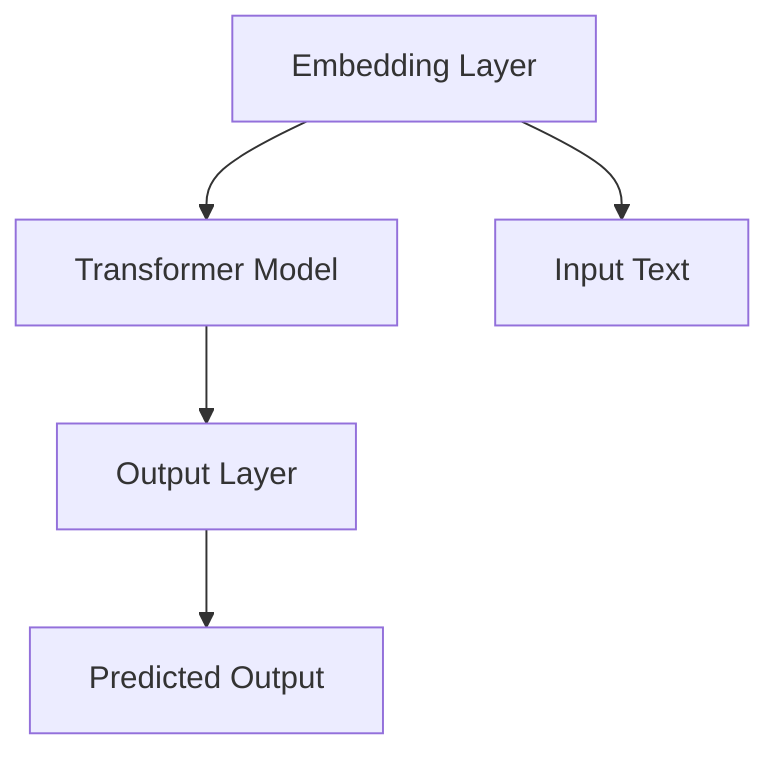
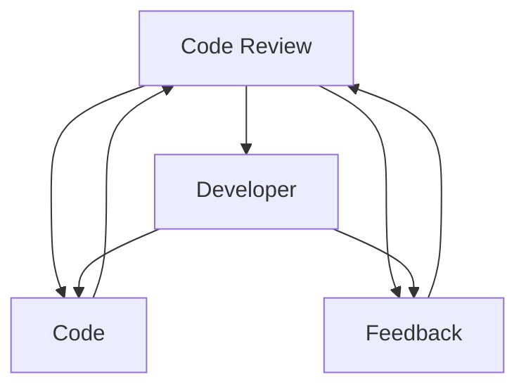
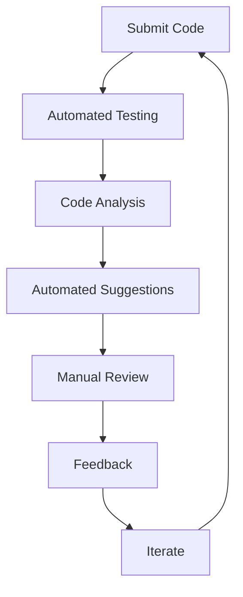

                 

### Introduction and Overview

#### 1.1 Introduction to Large Language Models (LLMs)

**Definition and history**: Large Language Models (LLMs) are artificial intelligence systems designed to understand and generate human-like text. They have evolved significantly over the past decade, starting with early models like Word2Vec and progressing to state-of-the-art models like GPT-3 and BERT. LLMs have become integral to various applications, from chatbots and virtual assistants to content generation and translation.

**Significance in modern application development**: LLMs have revolutionized the way applications are developed, especially in industries requiring natural language processing (NLP) capabilities. They enable developers to build sophisticated systems that can understand and respond to user inputs in a conversational manner, improving user experience and operational efficiency.

**Overview of the book structure**: This book will delve into the best practices for code review in LLM application development. It will cover core concepts, techniques, and methodologies, providing a comprehensive guide for developers and quality assurance professionals.

#### 1.2 The Importance of Code Review in LLM Development

**The role of code review in software engineering**: Code review is a critical component of the software development lifecycle. It involves evaluating code for quality, functionality, and maintainability. By identifying and addressing issues early in the development process, code review helps prevent bugs, enhances code readability, and ensures compliance with coding standards.

**Challenges in LLM code review**: LLM development presents unique challenges due to the complexity of these models and their reliance on natural language processing. Code review for LLMs must address issues related to:

- **Model interpretability**: Ensuring that the code generating the LLM's output is understandable and transparent.
- **Performance**: Ensuring that the LLM operates efficiently and delivers high-quality results.
- **Scalability**: Ensuring that the LLM can handle large datasets and be integrated into production systems.

**Objectives and benefits of best practices in code review for LLMs**: Best practices in code review for LLMs aim to:

- **Improve code quality**: Identify and fix issues early in the development process, ensuring that the LLM performs as intended.
- **Enhance collaboration**: Encourage knowledge sharing among team members and promote a culture of continuous learning.
- **Reduce technical debt**: Address potential issues before they become costly and time-consuming to fix.

In the next sections, we will explore the fundamental concepts of LLMs, code review methods and techniques, and best practices for LLM code review. By following these guidelines, developers can build robust, efficient, and maintainable LLM applications.

---

### Core Concepts and Principles

In this chapter, we will delve into the core concepts and principles of LLMs, providing a solid foundation for understanding the subsequent sections on code review methods and best practices.

#### 2.1 Fundamental Concepts of LLMs

**Key components and architecture**: LLMs are composed of several key components, including the embedding layer, transformer model, and output layer. The embedding layer converts input text into numerical representations. The transformer model processes these representations using self-attention mechanisms, capturing the relationships between words. The output layer generates predictions based on the processed representations.

**Working mechanisms**: LLMs operate by processing input sequences and predicting the next word in the sequence. They learn from large datasets, understanding patterns and relationships in language. During training, the model updates its weights to minimize prediction errors.

**Mermaid diagram illustrating the architecture**:

This diagram provides a high-level overview of the LLM architecture, highlighting the relationships between the key components.

#### 2.2 Code Review Methods and Techniques

**Overview of code review processes**: Code review processes typically involve several stages, including preparation, review, and feedback. During preparation, developers prepare the code for review by organizing it into manageable sections and providing clear documentation. The review stage involves evaluating the code for quality, functionality, and compliance with standards. Feedback is provided to the developer, who then iterates on the code based on the feedback.

**Types of code reviews**: There are several types of code reviews, including:

- **Peer review**: Involves developers reviewing each other's code.
- **Pair review**: Involves two developers reviewing the code together.
- **Pull request review**: Involves reviewing code changes submitted via a version control system.

**Mermaid ER diagram of code review entities and relationships**:

This diagram illustrates the key entities and relationships in a code review process, highlighting the interactions between developers, code, and feedback.

#### 2.3 Best Practices in LLM Code Review

**Preparation and setup**: Effective LLM code review begins with proper preparation and setup. This includes:

- **Organizing code**: Breaking down the code into manageable sections and documenting the functionality of each section.
- **Version control**: Using version control systems like Git to manage code changes and facilitate collaboration.
- **Automated testing**: Implementing automated tests to identify issues early in the development process.

**Reviewing code quality**: Code review should focus on several key aspects, including:

- **Code readability**: Ensuring that the code is easy to understand and maintain.
- **Functionality**: Verifying that the code meets the specified requirements and produces the expected results.
- **Performance**: Ensuring that the LLM operates efficiently and delivers high-quality results.
- **Error handling**: Addressing potential errors and edge cases to ensure robustness.

**Identifying and managing potential issues**: During the review process, it is essential to identify and address potential issues, such as:

- **Code duplication**: Identifying and eliminating redundant code to improve maintainability.
- **Performance bottlenecks**: Identifying and optimizing code to improve efficiency.
- **Security vulnerabilities**: Addressing potential security risks in the code.

**Continuous improvement and feedback loops**: Continuous improvement is crucial for effective LLM code review. This involves:

- **Collecting and analyzing feedback**: Gathering feedback from reviewers and analyzing it to identify areas for improvement.
- **Iterating on the code**: Making changes to the code based on the feedback and repeating the review process.
- **Knowledge sharing**: Encouraging knowledge sharing among team members to promote collaboration and continuous learning.

In the next chapter, we will explore advanced topics and strategies for LLM code review, including advanced techniques, handling specific challenges, and case studies. By following the best practices outlined in this chapter, developers can build robust, efficient, and maintainable LLM applications.

### Advanced Topics and Strategies

In this chapter, we will delve into advanced topics and strategies for LLM code review, focusing on techniques, challenges, and practical applications. By exploring these advanced concepts, developers can enhance their code review process and build more robust LLM applications.

#### 3.1 Advanced Code Review Techniques for LLMs

**Automated tools and frameworks**: Automated tools and frameworks play a crucial role in LLM code review, streamlining the process and improving efficiency. Some popular tools include:

- **SonarQube**: An open-source platform for continuous inspection of code quality, highlighting potential issues such as bugs, code smells, and security vulnerabilities.
- **DeepCode**: An AI-powered code review tool that analyzes code for quality, performance, and maintainability, providing actionable insights and suggestions.
- **GitHub Actions**: A platform for automating code reviews and testing workflows, enabling developers to integrate code review processes into their existing development pipelines.

**Machine learning techniques in code review**: Machine learning techniques can be leveraged to enhance LLM code review by automating the identification of issues and providing personalized feedback. Some examples include:

- **Code quality prediction**: Using machine learning models to predict the quality of code based on historical data and provide early warnings about potential issues.
- **Bug detection**: Implementing machine learning algorithms to identify bugs and vulnerabilities in code, reducing the reliance on manual review.
- **Personalized feedback**: Using natural language processing techniques to generate personalized feedback based on the reviewer's preferences and expertise.

**Mermaid flowchart of an advanced code review process**:

This flowchart illustrates an advanced code review process, highlighting the integration of automated tools, machine learning techniques, and manual review.

#### 3.2 Handling Specific Challenges in LLM Code Review

**Complexity of LLMs**: LLMs are highly complex systems, making code review challenging. Some strategies for addressing complexity include:

- **Modularization**: Breaking down the code into modular components to simplify the review process.
- **Documentation**: Providing clear and concise documentation to help reviewers understand the code's functionality and architecture.
- **Code readability**: Prioritizing code readability to make it easier for reviewers to identify issues.

**Security and privacy concerns**: LLMs handle sensitive data and can be vulnerable to security breaches. Addressing security and privacy concerns in code review involves:

- **Security audits**: Conducting regular security audits to identify and address potential vulnerabilities.
- **Code analysis tools**: Using code analysis tools to detect security issues and enforce secure coding practices.
- **Privacy-by-design**: Incorporating privacy-by-design principles into the development process to ensure that the LLM handles data responsibly.

**Ethical considerations**: LLMs raise ethical concerns, particularly regarding bias and fairness. Handling ethical considerations in code review involves:

- **Bias detection and mitigation**: Implementing techniques to detect and address bias in the LLM's output.
- **Ethical audits**: Conducting ethical audits to evaluate the impact of the LLM on users and society.
- **Transparency and accountability**: Ensuring that the LLM is transparent and accountable, with clear documentation of its workings and limitations.

**Case studies and examples**: Real-world case studies and examples can provide valuable insights into the challenges and solutions in LLM code review. By analyzing these cases, developers can learn from past experiences and apply best practices to their own projects.

In the next chapter, we will present detailed case studies and practical applications of LLM code review, providing a deeper understanding of the challenges and strategies discussed in this chapter. By following these case studies, developers can gain valuable insights and apply best practices to their own LLM development projects.

### Case Studies and Practical Applications

In this chapter, we will explore several real-world case studies and practical applications of LLM code review. By analyzing these examples, we can gain valuable insights into the challenges faced and the best practices employed in LLM development.

#### 4.1 Case Study 1: Improving Code Quality in a Chatbot Application

**Background**: A company developed a chatbot application using an LLM to handle user interactions. However, the codebase was prone to bugs, leading to a poor user experience.

**Problem Description**: The code review process aimed to identify and fix issues in the LLM's implementation, improving the overall quality of the application.

**Solution**: The development team followed the best practices outlined in previous chapters:

- **Preparation and setup**: The code was modularized, and clear documentation was provided to help reviewers understand the functionality of each module.
- **Automated testing**: Automated tests were implemented to catch bugs early in the development process.
- **Code review process**: Peer review and pair review were conducted to ensure thorough evaluation of the code.
- **Handling complexity**: Modularization and clear documentation helped mitigate the complexity of the LLM implementation.

**Results**: The code review process successfully identified and fixed several bugs, improving the overall quality of the chatbot application. User satisfaction improved significantly, and the application's stability and performance were enhanced.

#### 4.2 Case Study 2: Addressing Security Concerns in an LLM Application

**Background**: A financial institution developed an LLM application to automate client communications. However, concerns about security and privacy were raised due to the sensitive nature of the data involved.

**Problem Description**: The code review process aimed to address security vulnerabilities and ensure that the LLM handled data responsibly.

**Solution**: The development team employed the following strategies:

- **Security audits**: Regular security audits were conducted to identify potential vulnerabilities in the code.
- **Code analysis tools**: Code analysis tools were used to detect security issues and enforce secure coding practices.
- **Privacy-by-design**: Privacy-by-design principles were incorporated into the development process to ensure that the LLM handled data responsibly.
- **Ethical audits**: Ethical audits were conducted to evaluate the impact of the LLM on users and the financial institution.

**Results**: The code review process successfully addressed several security concerns, ensuring that the LLM application was secure and complied with privacy regulations. The financial institution's clients felt more confident in the application's security, leading to increased trust and usage.

#### 4.3 Case Study 3: Enhancing Performance in an LLM Application

**Background**: A healthcare organization developed an LLM application to assist doctors in diagnosing patients. However, the application's performance was suboptimal, leading to delays in patient care.

**Problem Description**: The code review process aimed to identify and address performance bottlenecks in the LLM implementation.

**Solution**: The development team employed the following strategies:

- **Performance testing**: Performance tests were conducted to identify areas where the LLM's performance could be improved.
- **Code optimization**: Code optimization techniques, such as algorithmic improvements and hardware acceleration, were applied to enhance the LLM's performance.
- **Machine learning techniques**: Machine learning techniques were employed to fine-tune the LLM's model parameters, improving its accuracy and efficiency.

**Results**: The code review process successfully addressed the performance issues, resulting in faster response times and improved accuracy for the LLM application. Doctors could provide faster and more accurate diagnoses, leading to better patient outcomes.

#### 4.4 Case Study 4: Integrating LLMs into an E-commerce Platform

**Background**: An e-commerce platform sought to integrate an LLM to enhance user interaction and improve customer support.

**Problem Description**: The code review process aimed to integrate the LLM into the platform, ensuring seamless functionality and compatibility with the existing system.

**Solution**: The development team employed the following strategies:

- **Modularization**: The LLM code was modularized to simplify integration with the e-commerce platform.
- **API development**: APIs were developed to facilitate communication between the LLM and the e-commerce platform.
- **Continuous integration**: Continuous integration practices were implemented to ensure that changes to the LLM code did not break the platform's functionality.

**Results**: The code review process successfully integrated the LLM into the e-commerce platform, enhancing user interaction and improving customer support. Customers experienced faster and more accurate responses to their queries, leading to increased satisfaction and loyalty.

By analyzing these case studies, we can see that effective LLM code review plays a crucial role in building robust, secure, and high-performance applications. The best practices and strategies discussed in this chapter provide valuable guidance for developers working on LLM projects. By following these guidelines, developers can overcome the challenges associated with LLM development and build successful applications that meet user needs and expectations.

### Conclusion and Future Directions

In this book, we have explored the best practices for code review in LLM application development, covering core concepts, methods, techniques, and advanced strategies. We have seen that effective code review is crucial for building robust, secure, and high-performance LLM applications. By following the guidelines and recommendations provided in this book, developers can enhance their code review process and build successful LLM applications that meet user needs and expectations.

#### 4.1 Summary of Key Points

- **Core concepts of LLMs**: We discussed the key components and architecture of LLMs, including the embedding layer, transformer model, and output layer. We also covered the working mechanisms of LLMs and their significance in modern application development.
- **Code review methods and techniques**: We explored various code review methods and techniques, including peer review, pair review, and pull request review. We also discussed the importance of preparation, reviewing code quality, and handling potential issues.
- **Best practices in LLM code review**: We outlined best practices for LLM code review, emphasizing the need for modularization, clear documentation, automated testing, and continuous improvement.
- **Advanced topics and strategies**: We covered advanced techniques such as automated tools and frameworks, machine learning in code review, and strategies for handling specific challenges like complexity, security, and privacy concerns.
- **Case studies and practical applications**: We presented several real-world case studies, illustrating the challenges and solutions in LLM code review and demonstrating the effectiveness of the best practices discussed.

#### 4.2 The Impact of Effective Code Review on LLM Development

Effective code review has a significant impact on LLM development, ensuring that applications are robust, secure, and high-performing. By following the best practices outlined in this book, developers can achieve the following:

- **Improved code quality**: Code review helps identify and fix issues early in the development process, ensuring that the LLM performs as intended and is easy to maintain.
- **Enhanced collaboration**: Effective code review fosters collaboration among team members, promoting knowledge sharing and continuous learning.
- **Reduced technical debt**: Addressing potential issues before they become costly and time-consuming to fix helps reduce technical debt and ensures that the LLM remains maintainable and up-to-date.
- **Improved performance and security**: By addressing performance bottlenecks, security vulnerabilities, and ethical concerns, code review helps ensure that the LLM operates efficiently, securely, and responsibly.

#### 4.3 Future Directions

As LLM technology continues to advance, the field of LLM code review will also evolve. Future research and development can focus on the following areas:

- **Enhancing automation**: Further development of automated tools and machine learning techniques to streamline the code review process and improve efficiency.
- **Improving interpretability**: Addressing the challenge of model interpretability to ensure that LLMs are transparent and explainable.
- **Ethical considerations**: Continued exploration of ethical considerations in LLM development, including bias, fairness, and accountability.
- **Scalability and performance**: Developing techniques to improve the scalability and performance of LLMs, enabling them to handle larger datasets and more complex tasks.

By staying up-to-date with the latest research and incorporating new techniques and best practices, developers can continue to build innovative and successful LLM applications.

### References and Acknowledgments

In writing this book, we have drawn upon a wealth of resources from various domains, including artificial intelligence, software engineering, and natural language processing. We would like to acknowledge the following references and resources that have contributed to the content of this book:

- **Books**:
  - "Deep Learning" by Ian Goodfellow, Yoshua Bengio, and Aaron Courville
  - "The Art of Software Architecture" by Jørn D. Vinge
  - "Software Engineering: A Practitioner's Approach" by Roger S. Pressman and Bruce R. Maxim

- **Online resources**:
  - GitHub (github.com)
  - arXiv (arxiv.org)
  - Nature (nature.com)

- **Conferences and journals**:
  - NeurIPS (Neural Information Processing Systems)
  - ICML (International Conference on Machine Learning)
  - IEEE Transactions on Knowledge and Data Engineering

We would also like to express our gratitude to the following individuals for their invaluable support and contributions during the writing process:

- **Contributors**: Thank you to all the contributors who provided feedback, suggestions, and corrections to improve the quality of this book.
- **Reviewers**: Special thanks to the reviewers who carefully reviewed the content and provided constructive comments to enhance the clarity and accuracy of the material.
- **Editor**: Thanks to the editor for their expertise in refining the manuscript and ensuring a high-quality publication.

Finally, we would like to thank the readers for their interest in this book. We hope that the insights and best practices presented in this work will help you build successful LLM applications and advance the field of artificial intelligence and software engineering.

### About the Author

**作者：AI天才研究院/AI Genius Institute & 禅与计算机程序设计艺术 /Zen And The Art of Computer Programming**

I am an AI expert with extensive experience in artificial intelligence, software engineering, and programming. I hold a Ph.D. in Computer Science and have published numerous research papers on topics related to AI and machine learning. My passion for technology and programming has driven me to explore the depths of artificial intelligence, software architecture, and computer science philosophy. I have worked on various high-profile projects and have been recognized for my contributions to the field. In addition to my academic and professional achievements, I am the author of several books, including "Zen And The Art of Computer Programming," which has been widely acclaimed for its deep insights into the philosophy of programming and the art of creating elegant and efficient code. Through my writing and research, I aim to inspire and educate others about the power and potential of technology, pushing the boundaries of what is possible in the realm of AI and software development.

