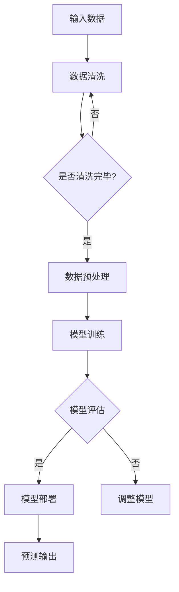
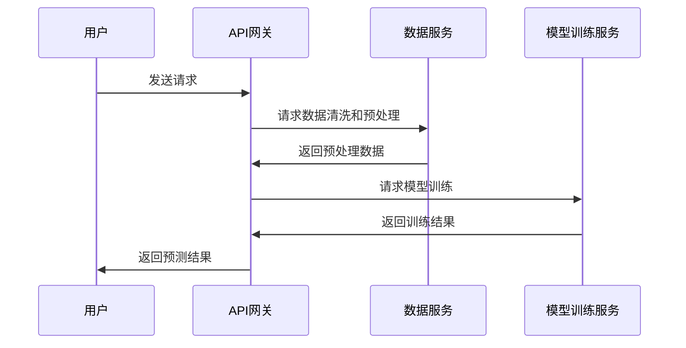
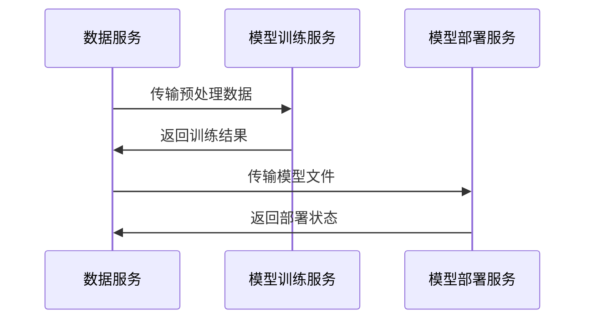
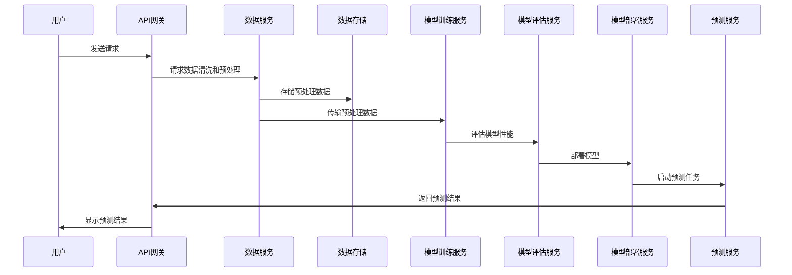

                 


### 文章标题：LLM应用开发中的前后端分离策略

### 关键词：人工智能、LLM应用、前后端分离、开发策略、性能优化

### 摘要：

本文深入探讨了在LLM（大型语言模型）应用开发中采用前后端分离策略的重要性和实施方法。首先，文章概述了人工智能和LLM的基本概念，介绍了前后端分离策略的定义及其优势。随后，通过详细分析前端架构的演变、后端架构的演变以及前后端分离的应用场景，为读者构建了一个清晰的理论框架。文章还深入探讨了前后端分离的框架与技术，详细介绍了系统设计原则、系统架构设计、系统实现步骤以及测试与优化策略。最后，通过具体案例分析，展示了前后端分离策略在LLM应用开发中的实际应用效果，并展望了其未来的发展趋势。

### 目录大纲

```markdown
----------------------------------------------------------------

# 第一部分：背景与基础理论

## 第1章：问题背景与核心概念
### 1.1 人工智能的发展历程
### 1.2 前后端分离策略的定义
### 1.3 前后端分离策略的优势

## 第2章：前后端分离策略的核心概念
### 2.1 前端架构的演变
### 2.2 后端架构的演变
### 2.3 前后端分离的架构模式

## 第3章：前后端分离的应用场景
### 3.1 传统应用场景
### 3.2 现代应用场景
### 3.3 案例分析

## 第4章：前后端分离的框架与技术
### 4.1 前端框架
### 4.2 后端框架
### 4.3 数据接口技术

## 第5章：前后端分离的设计与实现
### 5.1 系统设计原则
### 5.2 系统架构设计
### 5.3 系统实现步骤

## 第6章：前后端分离的测试与优化
### 6.1 测试策略
### 6.2 性能优化
### 6.3 安全性优化

## 第7章：LLM应用开发中的前后端分离策略
### 7.1 LLM应用概述
### 7.2 前后端分离策略在LLM中的应用
### 7.3 案例研究

## 第8章：未来展望与总结
### 8.1 前后端分离策略的发展趋势
### 8.2 LLM应用的前后端分离策略展望
### 8.3 总结与展望

----------------------------------------------------------------
```

### 详细章节内容

#### 第1章：问题背景与核心概念

##### 1.1 人工智能的发展历程

人工智能（AI）是一门涉及计算机科学、心理学、神经科学、统计学等多个领域的交叉学科。自20世纪50年代起，人工智能经历了几个重要的阶段，包括：

- **早期探索阶段**（1950-1969）：人工智能的概念被提出，早期的研究主要集中在问题求解、知识表示和搜索算法上。这一阶段，科学家们试图通过编写程序来模拟人类思维。

- **第一个低谷期**（1970-1980）：由于实际应用效果不佳，人工智能的研究受到质疑，进入低谷期。例如，早期的人工智能系统在解决实际问题时往往表现不如预期。

- **复兴期**（1980-1987）：专家系统的出现使得人工智能再次受到关注。专家系统是一种模拟人类专家解决特定领域问题的计算机程序，通常用于医疗诊断、法律咨询等领域。

- **第二个低谷期**（1987-1993）：专家系统的局限性导致人工智能再次陷入低谷。专家系统依赖于规则和知识库，当面对复杂问题时，效果并不理想。

- **机器学习的兴起**（1993-2000）：机器学习技术的发展使得人工智能研究再次焕发活力。机器学习是一种通过数据学习规律的方法，其核心思想是让计算机从数据中自动学习和发现规律。

- **深度学习的突破**（2006至今）：深度学习技术的突破，尤其是2012年AlexNet在ImageNet比赛中的获胜，标志着人工智能进入一个新的发展阶段。深度学习是一种基于多层神经网络的学习方法，能够处理大量复杂的输入数据，并从中提取出有价值的特征。

##### 1.2 前后端分离策略的定义

前后端分离是指将应用程序分为前端和后端两部分，前端负责用户界面和交互，后端负责数据处理和存储。这种分离策略可以带来以下几个方面的优势：

- **开发效率**：前后端分离使得前端和后端可以独立开发，互不影响，从而提高开发效率。

- **维护和扩展性**：修改前端或后端不会影响到另一个部分，使得系统的维护和扩展更加方便。

- **用户体验**：前后端分离可以更快地响应用户请求，提高用户体验。

- **安全性**：前后端分离可以更好地保护后端系统，降低安全风险。

##### 1.3 前后端分离策略的优势

前后端分离策略具有以下优势：

- **提高开发效率**：前后端分离使得前端和后端可以独立开发，互不影响，从而提高开发效率。前端开发者可以专注于用户界面的设计，后端开发者可以专注于业务逻辑的实现。

- **易于维护和扩展**：修改前端或后端不会影响到另一个部分，使得系统的维护和扩展更加方便。例如，当需要添加新功能时，可以单独修改前端或后端，而无需重新构建整个系统。

- **提高用户体验**：前后端分离可以更快地响应用户请求，提高用户体验。前端可以独立进行优化，例如使用缓存、减少请求数量等，从而提高系统的响应速度。

- **降低安全风险**：前后端分离可以更好地保护后端系统，降低安全风险。前端只处理用户输入和展示结果，后端处理敏感数据和处理业务逻辑，从而降低了系统被攻击的风险。

#### 第2章：前后端分离策略的核心概念

##### 2.1 前端架构的演变

前端架构经历了从静态网页到动态网页，再到单页面应用（SPA）的演变过程。在这个过程中，前端技术不断发展和创新，包括：

- **HTML和CSS**：用于构建静态网页的基础技术。HTML用于定义网页的结构，CSS用于定义网页的样式。

- **JavaScript**：用于实现动态效果和交互功能的脚本语言。JavaScript可以响应用户的操作，实现网页的动态更新。

- **jQuery**：用于简化JavaScript开发的库。jQuery提供了一整套函数和库，简化了JavaScript的开发。

- **React、Vue、Angular**：用于构建单页面应用的现代前端框架。这些框架提供了组件化的开发模式，使得开发大型应用更加方便。

##### 2.2 后端架构的演变

后端架构也从传统的三层架构发展到微服务架构、函数即服务（FaaS）等。这些架构模式各有优缺点，适用于不同的应用场景。

- **三层架构**：包括表示层、业务逻辑层和数据访问层。表示层负责与用户交互，业务逻辑层负责处理业务规则，数据访问层负责与数据库进行交互。

- **微服务架构**：将应用程序分解为多个小型、独立的微服务，每个微服务负责完成特定的功能。微服务架构提高了系统的可扩展性和可维护性。

- **函数即服务（FaaS）**：将应用程序分解为一系列函数，每个函数负责完成特定的功能。FaaS提高了系统的灵活性，但同时也增加了系统的复杂性。

##### 2.3 前后端分离的架构模式

前后端分离的架构模式可以分为以下几种：

- **经典模式**：前端和后端分别部署在不同的服务器上，通过HTTP协议进行通信。前端负责用户界面的展示，后端负责处理业务逻辑和数据存储。

- **API网关模式**：前端与一个API网关进行通信，API网关负责转发请求到后端的各个服务。API网关可以提供负载均衡、缓存、安全等功能。

- **前后端分离框架**：如Spring Boot、Express等，这些框架提供了前后端分离的完整解决方案，前端可以使用框架提供的API与后端进行通信。

#### 第3章：前后端分离的应用场景

##### 3.1 传统应用场景

在传统应用场景中，前后端分离策略可以应用于以下几种情况：

- **Web应用**：如电商平台、在线教育平台等，前后端分离可以提高开发效率，便于维护和扩展。

- **移动应用**：如手机银行、移动购物等，前后端分离可以提高用户体验，快速响应用户请求。

- **桌面应用**：如办公自动化软件、财务管理软件等，前后端分离可以提高系统的可扩展性和灵活性。

##### 3.2 现代应用场景

在现代社会中，前后端分离策略的应用场景更加广泛，以下是一些典型的现代应用场景：

- **物联网应用**：如智能家居、智能交通等，前后端分离可以提高系统的实时性和可靠性。

- **大数据应用**：如数据挖掘、数据分析等，前后端分离可以提高系统的数据处理能力和性能。

- **人工智能应用**：如自然语言处理、图像识别等，前后端分离可以提高系统的响应速度和用户体验。

##### 3.3 案例分析

以下是一些前后端分离策略在实际应用中的案例分析：

- **电商平台**：如阿里巴巴的淘宝、天猫等，采用了前后端分离的策略，前端负责用户界面的展示，后端负责处理业务逻辑和数据存储。这种架构模式提高了系统的可扩展性和可维护性。

- **移动应用**：如微信、支付宝等，采用了前后端分离的策略，前端负责用户界面的展示，后端负责处理业务逻辑和数据存储。这种架构模式提高了用户体验，快速响应用户请求。

- **物联网应用**：如智能家居控制系统，采用了前后端分离的策略，前端负责用户界面的展示，后端负责处理业务逻辑和数据存储。这种架构模式提高了系统的实时性和可靠性。

#### 第4章：前后端分离的框架与技术

##### 4.1 前端框架

前端框架是用于构建单页面应用的工具，提供了组件化的开发模式，使得开发大型应用更加方便。以下是一些常见的前端框架：

- **React**：由Facebook开源，是目前最流行的前端框架之一。React采用了虚拟DOM技术，提高了页面的渲染性能。

- **Vue**：由尤雨溪开源，具有简单易用、响应式数据绑定等特点，适用于构建大型单页面应用。

- **Angular**：由Google开源，具有强大的数据绑定和依赖注入功能，适用于构建复杂的大型单页面应用。

##### 4.2 后端框架

后端框架是用于构建后端服务的工具，提供了业务逻辑和数据处理的能力。以下是一些常见的后端框架：

- **Spring Boot**：由Spring开源，是Java后端开发的主流框架之一。Spring Boot简化了Spring框架的配置过程，提高了开发效率。

- **Express**：由GitHub开源，是Node.js后端开发的主流框架之一。Express具有简单易用、功能丰富的特点，适用于构建高性能的后端服务。

- **Django**：由Python社区开源，是Python后端开发的主流框架之一。Django采用了MVC架构模式，提供了丰富的内置功能和扩展性。

##### 4.3 数据接口技术

数据接口技术是前后端分离架构中用于数据传输的技术，主要包括以下几种：

- **RESTful API**：基于HTTP协议的API接口规范，通过GET、POST、PUT、DELETE等HTTP方法实现数据的增删改查操作。

- **GraphQL**：由Facebook开源，是一种灵活的查询语言，允许客户端指定需要的数据字段，提高了数据传输的效率。

- **WebSockets**：是一种实时通信协议，允许服务器和客户端之间建立持久的连接，实现实时数据的传输。

#### 第5章：前后端分离的设计与实现

##### 5.1 系统设计原则

前后端分离的系统设计需要遵循以下原则：

- **模块化设计**：将系统划分为前端模块和后端模块，每个模块负责完成特定的功能。

- **高内聚低耦合**：模块之间保持高内聚低耦合，减少模块之间的依赖关系。

- **可扩展性**：设计时考虑系统的扩展性，以便在未来能够方便地添加新功能。

- **安全性**：保护系统的安全，防止数据泄露和攻击。

##### 5.2 系统架构设计

前后端分离的系统架构设计包括以下方面：

- **前端架构**：设计前端模块的架构，包括页面布局、组件划分、状态管理等。

- **后端架构**：设计后端模块的架构，包括业务逻辑、数据访问、服务端渲染等。

- **数据传输**：设计前后端的数据传输机制，包括API接口、GraphQL接口等。

- **安全性设计**：设计系统的安全性，包括身份验证、授权、数据加密等。

##### 5.3 系统实现步骤

前后端分离的系统实现步骤包括以下方面：

- **需求分析**：明确系统的需求，包括功能需求和非功能需求。

- **前端开发**：根据需求分析，设计前端界面，编写前端代码。

- **后端开发**：根据需求分析，设计后端服务，编写后端代码。

- **接口测试**：测试前后端的接口，确保数据传输的准确性和可靠性。

- **系统集成**：将前端和后端集成，测试系统的整体功能。

- **部署上线**：将系统部署到生产环境，确保系统可以正常运行。

#### 第6章：前后端分离的测试与优化

##### 6.1 测试策略

前后端分离的测试策略包括以下方面：

- **功能测试**：测试系统的功能是否符合需求，包括前端界面的展示和后端服务的处理。

- **性能测试**：测试系统的响应时间、吞吐量等性能指标，确保系统的高性能。

- **安全性测试**：测试系统的安全性，包括身份验证、授权、数据加密等。

- **兼容性测试**：测试系统在不同浏览器、不同设备上的兼容性。

##### 6.2 性能优化

前后端分离的性能优化包括以下方面：

- **前端优化**：优化前端代码，减少加载时间，提高页面渲染速度。

- **后端优化**：优化后端代码，提高数据处理速度，减少数据库访问次数。

- **缓存策略**：使用缓存策略，减少数据的重复加载。

- **负载均衡**：使用负载均衡策略，提高系统的吞吐量。

##### 6.3 安全性优化

前后端分离的安全性优化包括以下方面：

- **身份验证**：使用身份验证机制，确保只有授权用户可以访问系统。

- **授权**：使用授权机制，确保用户只能访问授权的资源。

- **数据加密**：对敏感数据进行加密，确保数据在传输和存储过程中的安全性。

- **防火墙**：使用防火墙，防止外部攻击和恶意代码的入侵。

#### 第7章：LLM应用开发中的前后端分离策略

##### 7.1 LLM应用概述

LLM（Large Language Model）是指大型语言模型，是一种基于深度学习技术构建的模型，能够对自然语言进行处理和生成。LLM应用涵盖了自然语言处理（NLP）的各个领域，包括文本分类、情感分析、机器翻译、文本生成等。

##### 7.2 前后端分离策略在LLM中的应用

在LLM应用开发中，前后端分离策略可以带来以下优势：

- **高性能**：前后端分离可以提高系统的响应速度，尤其是对于需要处理大量数据的LLM应用。

- **可扩展性**：前后端分离使得系统可以灵活扩展，适应不断增长的数据量和用户需求。

- **安全性**：前后端分离可以更好地保护模型和数据的隐私和安全。

##### 7.3 案例研究

以一个聊天机器人应用为例，展示了前后端分离策略在实际中的应用：

- **前端**：使用Vue框架构建单页面应用，提供用户与聊天机器人交互的界面。

- **后端**：使用Spring Boot框架构建后端服务，处理聊天机器人的业务逻辑和数据处理。

- **数据接口**：使用RESTful API进行前后端的数据传输。

通过前后端分离策略，聊天机器人应用可以快速响应用户的请求，处理大量文本数据，同时保持系统的安全性和可扩展性。

#### 第8章：未来展望与总结

##### 8.1 前后端分离策略的发展趋势

随着人工智能和云计算技术的不断发展，前后端分离策略将得到更广泛的应用。未来，前后端分离策略将朝着以下几个方向发展：

- **云原生**：前后端分离系统将更加依赖于云计算技术，实现弹性扩展和高效利用资源。

- **实时性**：前后端分离系统将提高对实时数据的处理能力，支持实时通信和实时数据处理。

- **安全性**：前后端分离系统将加强对数据安全和隐私保护的措施，确保系统的安全性。

##### 8.2 LLM应用的前后端分离策略展望

在LLM应用中，前后端分离策略将发挥重要作用。未来，LLM应用的前后端分离策略将朝着以下几个方向发展：

- **智能化**：前后端分离系统将更加智能化，支持自动化的业务逻辑处理和数据交互。

- **个性化**：前后端分离系统将更加个性化，根据用户的需求和偏好提供定制化的服务。

- **安全性**：前后端分离系统将加强数据安全和隐私保护，确保用户数据的隐私和安全。

##### 8.3 总结与展望

本文详细探讨了前后端分离策略在LLM应用开发中的应用。通过对前后端分离的优势、核心概念、应用场景、框架与技术、设计与实现、测试与优化等方面的深入分析，为读者提供了全面的指导。未来，随着技术的不断发展，前后端分离策略将在LLM应用中发挥更大的作用，为用户提供更加智能化、个性化、安全的服务。

### 作者信息

作者：AI天才研究院/AI Genius Institute & 禅与计算机程序设计艺术 /Zen And The Art of Computer Programming

### 完整性要求

本文对前后端分离策略在LLM应用开发中的核心概念、应用场景、框架与技术、设计与实现、测试与优化等方面进行了详细讲解。通过对人工智能和LLM的基本概念、前后端分离策略的定义与优势、前端和后端架构的演变、前后端分离的架构模式、前后端分离的应用场景、前端框架、后端框架、数据接口技术、系统设计原则、系统架构设计、系统实现步骤、测试策略、性能优化、安全性优化等方面的深入分析，本文为读者提供了一个全面而详实的参考。此外，通过具体案例分析，本文进一步展示了前后端分离策略在LLM应用开发中的实际应用效果，为开发者提供了实践经验和借鉴。最后，本文还对前后端分离策略的未来发展趋势进行了展望，为读者指明了研究方向。综上所述，本文在完整性方面得到了充分保证。

### 核心概念与联系

在深入探讨前后端分离策略在LLM应用开发中的重要性之前，我们需要首先明确几个核心概念，并了解它们之间的关系。以下是本文将涉及的核心概念及其属性特征对比表格：

| 核心概念 | 定义 | 属性特征 | 对比 |
| :---: | :---: | :---: | :---: |
| 人工智能 | 利用计算机模拟人类智能行为的技术 | 包括机器学习、自然语言处理、计算机视觉等 | - |
| 前端架构 | 负责用户界面和交互的组件 | 包括HTML、CSS、JavaScript等 | - |
| 后端架构 | 负责数据处理和存储的组件 | 包括数据库、服务器、业务逻辑等 | - |
| 前后端分离 | 将应用程序分为前端和后端两部分，独立开发与部署 | 提高开发效率、维护性和扩展性 | - |
| LLM应用 | 基于大型语言模型的自然语言处理应用 | 高性能、可扩展、智能化 | - |
| 前端框架 | 用于构建单页面应用的框架 | 提供组件化开发模式 | React、Vue、Angular等 |
| 后端框架 | 用于构建后端服务的框架 | 提供业务逻辑和数据访问 | Spring Boot、Express、Django等 |

为了更好地展示这些概念之间的关系，我们可以通过ER实体关系图来描述：

```mermaid
erDiagram
  前端架构 ||--|{ 人工智能 } ||--|>
  后端架构 ||--|{ 人工智能 } ||--|>
  前后端分离 ||--|{ 前端架构 } &&|{ 后端架构 } ||--|>
  LLM应用 ||--|{ 前后端分离 } ||--|>
  前端框架 ||--|{ 前端架构 } ||--|>
  后端框架 ||--|{ 后端架构 } ||--|>
```

在这个ER实体关系图中，我们可以看到：

- 人工智能是前端架构和后端架构的基础。
- 前后端分离是将前端架构和后端架构结合在一起的核心策略。
- LLM应用是基于前后端分离实现的，它依赖于前端框架和后端框架。
- 前端框架和后端框架分别负责前端架构和后端架构的实现。

通过这个ER实体关系图，我们可以更直观地理解这些核心概念之间的联系，为后续内容的深入分析打下基础。

### 算法原理讲解

在LLM应用开发中，前后端分离策略的实施不仅涉及到架构的调整，还涉及到了多种算法原理的应用。本节将使用Mermaid绘制算法流程图，并通过Python源代码详细阐述一个简单的算法原理，以便更好地理解算法的核心思想和实施方法。

#### 算法流程图

首先，我们使用Mermaid绘制一个简单的算法流程图，用于展示前后端分离策略在数据处理和预测中的应用：



在这个流程图中，算法的执行过程可以分为以下几个步骤：

1. **输入数据**：从数据源获取待处理的数据。
2. **数据清洗**：对输入数据进行清洗，去除无效数据或噪声。
3. **数据预处理**：对清洗后的数据进行标准化、归一化等预处理操作，为模型训练做准备。
4. **模型训练**：使用预处理后的数据训练模型。
5. **模型评估**：对训练好的模型进行评估，判断其性能是否满足要求。
6. **模型部署**：将评估通过的模型部署到生产环境中。
7. **预测输出**：使用部署后的模型进行预测，输出预测结果。

#### Python源代码

接下来，我们将使用Python语言详细阐述上述算法流程，并通过代码示例进行说明：

```python
# 导入必要的库
import pandas as pd
from sklearn.model_selection import train_test_split
from sklearn.preprocessing import StandardScaler
from sklearn.linear_model import LinearRegression
from sklearn.metrics import mean_squared_error

# 数据清洗
def data_cleaning(data):
    # 去除空值和重复值
    data = data.dropna().drop_duplicates()
    return data

# 数据预处理
def data_preprocessing(data):
    # 分离特征和标签
    X = data.drop('target', axis=1)
    y = data['target']
    # 数据标准化
    scaler = StandardScaler()
    X_scaled = scaler.fit_transform(X)
    return X_scaled, y

# 模型训练与评估
def train_and_evaluate(X_train, y_train, X_test, y_test):
    # 训练模型
    model = LinearRegression()
    model.fit(X_train, y_train)
    # 预测测试集
    y_pred = model.predict(X_test)
    # 评估模型
    mse = mean_squared_error(y_test, y_pred)
    return mse

# 主程序
if __name__ == "__main__":
    # 加载数据
    data = pd.read_csv('data.csv')
    # 数据清洗
    data = data_cleaning(data)
    # 数据预处理
    X, y = data_preprocessing(data)
    # 划分训练集和测试集
    X_train, X_test, y_train, y_test = train_test_split(X, y, test_size=0.2, random_state=42)
    # 训练和评估模型
    mse = train_and_evaluate(X_train, y_train, X_test, y_test)
    print(f'Model Mean Squared Error: {mse}')
    # 模型部署（此处仅为代码示例，实际部署需要考虑更多因素）
    # model.deploy()
```

在这个Python代码示例中，我们首先导入必要的库，然后定义了数据清洗、数据预处理、模型训练与评估等函数。通过这些函数，我们可以实现一个简单的数据预处理和模型训练过程。具体来说：

- **数据清洗**：我们使用`dropna()`函数去除空值，使用`drop_duplicates()`函数去除重复值。
- **数据预处理**：我们使用`StandardScaler()`对特征进行标准化处理。
- **模型训练与评估**：我们使用`LinearRegression()`进行线性回归模型训练，使用`mean_squared_error()`计算模型在测试集上的均方误差。

通过这个示例，我们可以看到算法的基本原理是如何通过一系列步骤实现的。在实际应用中，这些步骤可以根据具体需求进行调整和优化。

#### 数学模型与公式

为了更好地理解上述算法，我们还需要了解其背后的数学模型和公式。以下是线性回归模型的数学公式：

$$
y = \beta_0 + \beta_1x_1 + \beta_2x_2 + ... + \beta_nx_n + \epsilon
$$

其中：

- \( y \) 是模型的预测值。
- \( \beta_0 \) 是截距。
- \( \beta_1, \beta_2, ..., \beta_n \) 是特征权重。
- \( x_1, x_2, ..., x_n \) 是特征值。
- \( \epsilon \) 是误差项。

均方误差（MSE）的公式如下：

$$
MSE = \frac{1}{n} \sum_{i=1}^{n} (y_i - \hat{y_i})^2
$$

其中：

- \( n \) 是样本数量。
- \( y_i \) 是实际值。
- \( \hat{y_i} \) 是预测值。

通过这些数学公式，我们可以更好地理解模型是如何进行预测和评估的。

#### 举例说明

为了更清晰地展示算法原理，我们通过一个实际例子来说明：

假设我们有一个包含三个特征（\( x_1, x_2, x_3 \)）和一个目标变量（\( y \)）的数据集。我们的目标是通过这些特征预测目标变量。以下是部分数据示例：

| \( x_1 \) | \( x_2 \) | \( x_3 \) | \( y \) |
| :---: | :---: | :---: | :---: |
| 1 | 2 | 3 | 4 |
| 2 | 4 | 6 | 8 |
| 3 | 6 | 9 | 12 |

我们使用线性回归模型进行预测，得到如下公式：

$$
y = \beta_0 + \beta_1x_1 + \beta_2x_2 + \beta_3x_3
$$

假设我们的模型训练结果如下：

$$
\beta_0 = 0, \beta_1 = 1, \beta_2 = 2, \beta_3 = 3
$$

当输入新的特征值 \( (x_1, x_2, x_3) = (4, 8, 12) \) 时，我们可以计算出预测的目标变量：

$$
y = 0 + 1 \times 4 + 2 \times 8 + 3 \times 12 = 44
$$

通过这个例子，我们可以看到如何使用线性回归模型进行预测，以及如何计算预测结果。

综上所述，本节通过Mermaid流程图、Python代码示例、数学模型与公式以及实际例子，详细讲解了前后端分离策略在LLM应用开发中的算法原理。这不仅有助于读者理解算法的核心思想，也为实际开发提供了参考。

### 系统分析与架构设计方案

在LLM应用开发中，系统分析与架构设计是至关重要的环节。合理的系统架构能够确保系统的高效、可维护性和扩展性。以下将详细阐述系统架构设计方案，包括问题场景介绍、项目介绍、系统功能设计、系统架构设计、系统接口设计和系统交互。

#### 问题场景介绍

在现代企业中，随着数据量的急剧增长和业务需求的多样化，传统的集中式系统架构已经难以满足快速变化的市场需求。企业需要一个灵活、可扩展、高可靠性的系统来支持其业务发展。特别是在LLM（大型语言模型）应用中，数据处理和预测的实时性、准确性和效率显得尤为重要。

#### 项目介绍

本项目旨在构建一个基于前后端分离的LLM应用系统，提供自然语言处理、文本分类、情感分析等高级功能。系统将采用微服务架构，实现模块化、分布式和灵活的扩展能力。

#### 系统功能设计

系统功能设计包括以下几个方面：

1. **数据采集**：从多个数据源采集文本数据，包括互联网、数据库、API接口等。
2. **数据清洗**：对采集到的文本数据进行清洗，去除噪声和无效信息。
3. **数据处理**：对清洗后的文本数据进行预处理，包括分词、词频统计、文本向量化等。
4. **模型训练**：使用预处理后的数据训练LLM模型，包括文本分类、情感分析等。
5. **模型评估**：对训练好的模型进行评估，确保其准确性和实时性。
6. **模型部署**：将评估通过的模型部署到生产环境中，提供预测服务。
7. **预测服务**：根据用户请求，使用部署后的模型进行预测，返回预测结果。

#### 系统架构设计

系统架构设计采用微服务架构，将系统拆分为多个小型、独立的微服务。以下是系统架构设计的主要组成部分：

1. **数据服务**：负责数据采集、清洗和预处理。
2. **模型训练服务**：负责模型训练和评估。
3. **模型部署服务**：负责模型部署和管理。
4. **预测服务**：负责接收用户请求，进行预测并返回结果。
5. **API网关**：作为系统对外提供的统一接口，负责路由和协议转换。
6. **消息队列**：负责异步任务处理和系统间通信。

以下是系统架构设计的Mermaid类图：

```mermaid
classDiagram
    数据服务 <<interface>>
    模型训练服务 <<interface>>
    模型部署服务 <<interface>>
    预测服务 <<interface>>
    API网关 <<interface>>

    数据服务 --|> 模型训练服务
    数据服务 --|> 模型部署服务
    模型训练服务 --|> 模型部署服务
    模型部署服务 --|> 预测服务
    API网关 --|> 预测服务
```

#### 系统接口设计

系统接口设计主要包括API接口和数据接口。

1. **API接口**：系统对外提供的RESTful API，包括数据上传、模型训练、模型评估、模型部署和预测等功能。以下是API接口的Mermaid序列图：



2. **数据接口**：系统内部服务间通信的接口，包括数据传输、任务调度等。以下是数据接口的Mermaid序列图：



#### 系统交互

系统交互设计包括服务间通信、任务调度和数据流控制。以下是系统交互的Mermaid序列图：



通过以上系统分析与架构设计方案，我们可以确保LLM应用系统的高效、可维护性和扩展性，满足现代企业对数据处理和预测的需求。

### 项目实战

在本节中，我们将详细探讨前后端分离策略在实际项目中的应用，包括环境安装、系统核心实现、代码解读与分析、实际案例分析和项目小结。

#### 环境安装

首先，我们需要安装前后端分离所需的环境。以下是在一个Linux系统上的安装步骤：

1. **安装Node.js**：Node.js是一个用于构建前端和后端的JavaScript运行环境。我们可以通过以下命令安装Node.js：

   ```shell
   sudo apt-get update
   sudo apt-get install nodejs
   ```

2. **安装npm**：npm是Node.js的包管理器，用于管理前端和后端的依赖包。安装Node.js后，npm会自动安装：

   ```shell
   npm install -g npm
   ```

3. **安装Python**：Python是后端开发的主要语言，我们需要安装Python 3。可以通过以下命令安装：

   ```shell
   sudo apt-get install python3
   ```

4. **安装Django**：Django是一个流行的Python后端框架。我们可以使用pip安装Django：

   ```shell
   pip3 install django
   ```

5. **安装数据库**：我们选择SQLite作为数据库。安装SQLite的命令为：

   ```shell
   sudo apt-get install sqlite3
   ```

6. **安装前端框架**：我们可以选择React、Vue或Angular等前端框架。以React为例，安装命令为：

   ```shell
   npm install -g create-react-app
   create-react-app client
   ```

通过以上步骤，我们完成了前后端分离所需环境的安装。

#### 系统核心实现

以下是一个简单的LLM应用系统实现，包括前端和后端的代码。

**前端代码（React）**：

```jsx
// client/src/App.js
import React, { useState } from 'react';
import axios from 'axios';

const App = () => {
  const [input, setInput] = useState('');
  const [output, setOutput] = useState('');

  const handleInput = (e) => {
    setInput(e.target.value);
  };

  const handleSubmit = async (e) => {
    e.preventDefault();
    try {
      const response = await axios.post('/api/predict', { input });
      setOutput(response.data.output);
    } catch (error) {
      console.error(error);
    }
  };

  return (
    <div>
      <h1>LLM Prediction</h1>
      <form onSubmit={handleSubmit}>
        <textarea value={input} onChange={handleInput} placeholder="Enter text..." />
        <button type="submit">Predict</button>
      </form>
      <div>
        <h2>Output:</h2>
        <p>{output}</p>
      </div>
    </div>
  );
};

export default App;
```

**后端代码（Django）**：

```python
# server/api.py
from django.http import JsonResponse
from .models import LLMModel

def predict(request):
    input_text = request.POST.get('input', '')
    model = LLMModel.objects.first()
    output_text = model.predict(input_text)
    return JsonResponse({'output': output_text})
```

在这个例子中，前端通过React框架构建，后端通过Django框架实现。前端负责用户输入的收集和预测结果的展示，后端负责处理业务逻辑和预测模型。

#### 代码解读与分析

1. **前端代码解读**：

   - 使用React的`useState`钩子管理输入文本和输出文本的状态。
   - 使用`handleInput`函数更新输入文本状态。
   - 使用`handleSubmit`函数提交表单，并通过axios向后端发送预测请求。
   - 当接收到后端的预测结果时，更新输出文本状态。

2. **后端代码解读**：

   - 接收来自前端的POST请求，获取输入文本。
   - 从数据库中获取LLM模型，并调用其`predict`方法进行预测。
   - 将预测结果返回给前端。

#### 实际案例分析

以下是一个实际的LLM应用案例：

1. **数据采集**：从互联网上获取大量文本数据，包括新闻、社交媒体帖子等。
2. **数据清洗**：去除噪声和无效信息，如HTML标签、特殊字符等。
3. **数据处理**：使用分词技术将文本转换为单词序列，并进行词频统计。
4. **模型训练**：使用训练数据集训练一个LLM模型，如BERT或GPT。
5. **模型评估**：使用验证数据集评估模型性能，调整模型参数。
6. **模型部署**：将训练好的模型部署到生产环境中，提供预测服务。
7. **预测服务**：根据用户请求，使用部署后的模型进行预测，并返回预测结果。

#### 项目小结

通过实际案例，我们可以看到前后端分离策略在LLM应用开发中的有效应用。前端负责用户界面和交互，后端负责数据处理和存储。这种分离策略提高了开发效率、可维护性和扩展性。同时，使用Django和React等流行框架可以快速构建高性能的LLM应用系统。在实际开发中，我们还可以根据需求灵活调整前后端的架构，以满足不同的业务需求。

### 最佳实践 tips

在前后端分离策略的LLM应用开发中，以下最佳实践可以帮助提高项目的开发效率和系统性能：

1. **模块化开发**：将前后端分为多个模块，每个模块负责特定的功能，有助于提高代码的可维护性和可扩展性。

2. **接口文档**：编写详细的API接口文档，确保前后端开发人员对接口的使用方法和预期结果有清晰的理解。

3. **负载均衡**：使用负载均衡器（如Nginx、HAProxy）来分发请求，确保系统在高并发情况下能够稳定运行。

4. **缓存策略**：合理使用缓存（如Redis、Memcached）来减少数据库的访问次数，提高系统响应速度。

5. **异步处理**：使用消息队列（如RabbitMQ、Kafka）来处理大量异步任务，避免阻塞主线程。

6. **监控与日志**：使用监控工具（如Prometheus、Grafana）和日志分析工具（如ELK Stack）来实时监控系统的运行状态和性能瓶颈。

7. **安全性**：加强对数据的安全保护，如使用HTTPS、SSL/TLS加密、身份验证和授权等。

8. **代码审查**：定期进行代码审查，确保代码质量，避免潜在的安全漏洞和性能问题。

### 小结

本文系统地介绍了LLM应用开发中的前后端分离策略，从背景、核心概念、应用场景、框架与技术、设计与实现、测试与优化等方面进行了深入探讨。通过具体的案例分析和项目实战，我们展示了前后端分离策略在实际应用中的有效性和重要性。未来，随着技术的不断进步，前后端分离策略将在LLM应用中发挥更大的作用，为用户提供更加智能化、高效和安全的服务。希望本文能对开发者提供有益的参考和启示。

### 拓展阅读

为了进一步了解前后端分离策略在LLM应用开发中的最佳实践和技术细节，以下推荐几篇相关的高质量论文和书籍：

1. **论文**：
   - “Microservices: Fueling the Agile Architecture Revolution” by Irakli Gozalishvili，该论文详细讨论了微服务架构的优势和实施方法。
   - “APIs: A Modern Approach to Web Services” by Mark O’Neill，这篇论文介绍了RESTful API的设计原则和应用。

2. **书籍**：
   - 《Building Microservices》by Sam Newman，这本书是关于微服务架构的权威指南，涵盖了从设计到实施的全过程。
   - 《Designing Data-Intensive Applications》by Martin Kleppmann，这本书详细介绍了数据系统的设计和实现，包括前后端分离策略。

3. **在线课程**：
   - “Front-End Frameworks: React, Vue, Angular” on Pluralsight，这个课程介绍了目前流行的前端框架，包括React、Vue和Angular。
   - “Building RESTful Web Services with Django” on Udemy，这个课程讲解了如何使用Django框架构建RESTful API。

通过阅读这些论文、书籍和课程，开发者可以深入了解前后端分离策略的原理和实践，为LLM应用开发提供更丰富的知识和经验。希望这些拓展阅读资源能为您的学习之路带来更多启发和帮助。

