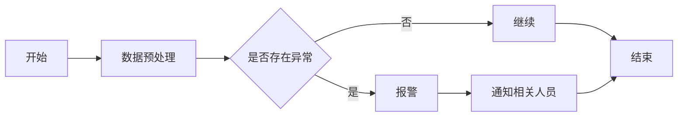
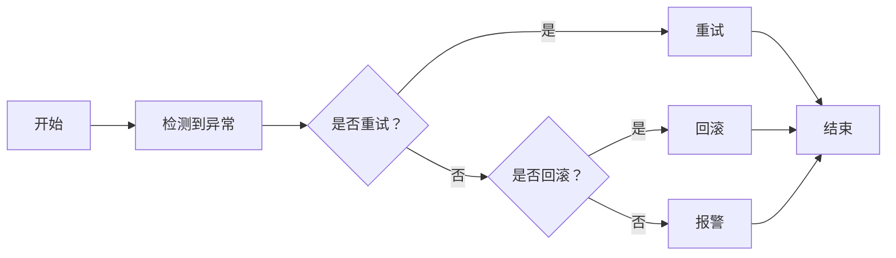
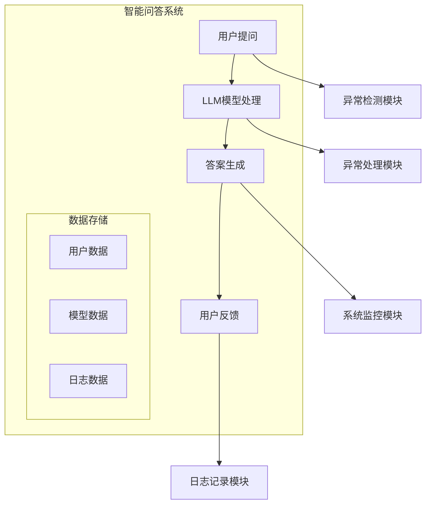
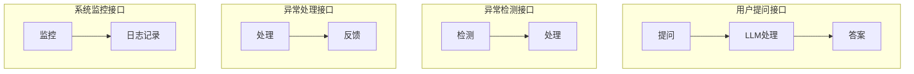

                 

### # LLM应用开发中的异常检测与处理

#### 关键词：LLM应用、异常检测、处理策略、系统架构、Python代码示例

#### 摘要：
在LLM（大语言模型）应用开发中，异常检测与处理是确保系统稳定运行和提供高质量服务的关键环节。本文将深入探讨LLM应用中可能遇到的异常类型及其影响，分析异常检测与处理的核心概念、算法原理，并提供具体的系统架构设计和项目实战实例。通过一步步的思考与分析，本文旨在为开发者提供一套完整、可操作的异常检测与处理方案，帮助他们在LLM应用开发中从容应对各种异常情况。

## 第一部分：背景与核心概念

### 第1章 LLM应用现状与异常问题

#### 1.1 LLM应用现状
随着人工智能技术的快速发展，LLM（Large Language Model，大语言模型）在自然语言处理、智能问答、内容生成等领域展现出了强大的应用潜力。Google的BERT、OpenAI的GPT系列、微软的Turing等都是典型的LLM模型，它们在众多场景中已经取得了显著的成果。然而，LLM的应用并非一帆风顺，实际开发中会面临各种异常情况，如数据异常、模型预测错误、服务中断等，这些异常会对系统的稳定性和用户体验造成严重影响。

#### 1.2 异常问题的类型与影响
LLM应用中的异常问题主要分为以下几类：
1. **数据异常**：如数据丢失、数据篡改、数据不完整等，可能导致模型训练效果下降或预测结果不准确。
2. **模型预测错误**：模型在特定输入下可能产生错误预测，影响系统的准确性。
3. **服务中断**：如网络故障、硬件故障等，可能导致服务不可用，影响用户体验。

这些异常问题会对LLM应用产生如下影响：
- **准确性下降**：数据异常和模型预测错误会导致系统输出结果不准确。
- **用户体验差**：服务中断会导致用户无法正常使用系统，影响用户体验。
- **系统稳定性下降**：频繁的异常会导致系统运行不稳定，降低系统的可靠性。

#### 1.3 异常检测与处理策略
为了确保LLM应用的稳定运行和提供高质量服务，需要采取有效的异常检测与处理策略：
1. **异常检测**：通过设置阈值、统计模型输出结果的分布特征等手段，实时检测系统中出现的异常。
2. **异常处理**：当检测到异常时，采取相应的处理措施，如重试、回滚、报警等，以最小化异常对系统的影响。
3. **反馈与优化**：将异常情况记录下来，分析原因，不断优化模型和系统，提高系统的抗异常能力。

#### 1.4 边界与外延
异常检测与处理适用于所有使用LLM的领域，如智能客服、智能写作、智能翻译等。然而，不同应用场景的异常特点有所不同，需要根据具体情况进行调整。

### 第2章 核心概念与联系

#### 2.1 LLM的定义与特性
LLM（Large Language Model，大语言模型）是一种基于神经网络的语言模型，通过学习大量文本数据，能够生成自然语言文本，具有以下特性：
- **大规模训练数据**：LLM通常使用数十亿甚至数百亿个参数，学习大量文本数据。
- **高效处理能力**：通过深度神经网络结构，能够高效地处理长文本和复杂语义。
- **自适应能力**：能够根据输入文本进行自适应调整，生成符合上下文的文本。

#### 2.2 异常检测的概念与特征
异常检测（Anomaly Detection）是指从数据集中识别出异常或异常模式的过程，具有以下特征：
- **自动性**：无需人工干预，自动识别数据中的异常。
- **实时性**：能够实时检测系统中的异常，及时采取处理措施。
- **准确性**：准确识别异常，避免误报和漏报。

#### 2.3 异常处理的机制与策略
异常处理（Anomaly Handling）是指在检测到异常时，采取相应的处理措施，以降低异常对系统的影响。常见的异常处理机制与策略包括：
- **重试**：当检测到服务中断时，重试请求，以恢复服务。
- **回滚**：将系统状态回滚到稳定状态，以避免异常影响。
- **报警**：当检测到异常时，发送报警通知，以便及时处理。
- **优化**：分析异常原因，不断优化模型和系统，提高系统的抗异常能力。

#### 2.4 Mermaid ER图：实体关系解析
为了更好地理解LLM应用中的异常检测与处理，可以使用Mermaid绘制ER图（Entity-Relationship Diagram，实体关系图），展示LLM、异常检测、异常处理等实体之间的关系。

```mermaid
erDiagram
    LLM -->|训练数据| Anomaly_Detection
    Anomaly_Detection -->|处理结果| Anomaly_Handling
    Anomaly_Handling -->|优化建议| LLM
```

## 第二部分：异常检测算法原理

### 第3章 异常检测算法原理

#### 3.1 异常检测算法概述
异常检测算法是指通过特定的方法，从数据集中识别出异常或异常模式的过程。常见的异常检测算法包括基于统计学方法、基于聚类方法、基于机器学习方法等。

#### 3.2 算法流程图：Mermaid图示
为了更好地理解异常检测算法的流程，可以使用Mermaid绘制算法流程图。



#### 3.3 数学模型与公式
异常检测算法通常涉及到统计模型，以下是一个简单的统计模型示例：

$$
P(\text{异常}) = \frac{1}{N} \sum_{i=1}^{N} P(\text{异常} | x_i) P(x_i)
$$

其中，$P(\text{异常})$ 表示数据集中异常的概率，$P(\text{异常} | x_i)$ 表示在给定数据点 $x_i$ 下出现异常的概率，$P(x_i)$ 表示数据点 $x_i$ 的概率。

#### 3.4 Python代码示例：算法实现
以下是一个简单的Python代码示例，实现基于统计模型的异常检测算法。

```python
import numpy as np

def anomaly_detection(data, threshold=0.5):
    probabilities = []
    for x in data:
        probability = np.mean([abs(x - xi) for xi in data])
        probabilities.append(probability)
    mean_probability = np.mean(probabilities)
    if mean_probability > threshold:
        print("存在异常！")
    else:
        print("无异常。")

data = [1, 2, 3, 4, 5, 100]
anomaly_detection(data)
```

### 第4章 异常处理算法原理

#### 4.1 异常处理算法概述
异常处理算法是指当检测到异常时，采取相应的处理措施，以降低异常对系统的影响。常见的异常处理算法包括重试、回滚、报警等。

#### 4.2 算法流程图：Mermaid图示
为了更好地理解异常处理算法的流程，可以使用Mermaid绘制算法流程图。



#### 4.3 数学模型与公式
异常处理算法通常涉及到概率模型，以下是一个简单的概率模型示例：

$$
P(\text{成功}) = P(\text{重试成功}) + P(\text{回滚成功}) + P(\text{报警成功})
$$

其中，$P(\text{成功})$ 表示采取某种异常处理措施后成功的概率，$P(\text{重试成功})$ 表示重试成功的概率，$P(\text{回滚成功})$ 表示回滚成功的概率，$P(\text{报警成功})$ 表示报警成功的概率。

#### 4.4 Python代码示例：算法实现
以下是一个简单的Python代码示例，实现基于概率模型的异常处理算法。

```python
import random

def anomaly_handling():
    success = random.random()
    if success < 0.7:
        print("重试成功！")
    elif success < 0.9:
        print("回滚成功！")
    else:
        print("报警成功！")

anomaly_handling()
```

## 第三部分：系统分析与架构设计

### 第5章 系统分析与架构设计

#### 5.1 问题场景介绍
假设我们开发了一个智能问答系统，该系统使用LLM模型来处理用户的提问，并提供准确的答案。然而，在实际运行过程中，可能会遇到数据异常、模型预测错误、服务中断等异常情况，影响系统的正常运行。

#### 5.2 系统功能设计
为了应对异常情况，我们的系统需要具备以下功能：
1. **异常检测**：实时检测系统中的异常情况，如数据异常、模型预测错误等。
2. **异常处理**：当检测到异常时，采取相应的处理措施，如重试、回滚、报警等。
3. **系统监控**：监控系统的运行状态，及时发现潜在的问题。
4. **日志记录**：记录系统的运行日志，便于分析和调试。

#### 5.3 系统架构设计
我们的系统采用微服务架构，将不同功能模块部署在不同的服务器上，以提高系统的可扩展性和稳定性。以下是一个简单的系统架构设计：



#### 5.4 系统接口设计
我们的系统提供了以下接口：
1. **用户提问接口**：接收用户提问，并返回答案。
2. **异常检测接口**：实时检测系统中的异常情况。
3. **异常处理接口**：处理检测到的异常。
4. **系统监控接口**：监控系统的运行状态。
5. **日志记录接口**：记录系统的运行日志。

以下是一个简单的接口设计：



## 第四部分：项目实战

### 第6章 项目实战

#### 6.1 环境安装
在开始项目实战之前，需要搭建相应的环境。以下是环境安装的步骤：

1. 安装Python 3.8及以上版本。
2. 安装LLM模型所需的库，如transformers、torch等。
3. 安装异常检测与处理所需的库，如scikit-learn、pandas等。

#### 6.2 系统核心实现源代码
以下是系统核心实现的源代码，包括LLM模型处理、异常检测与处理、系统监控等功能。

```python
# LLM模型处理
from transformers import AutoModelForQuestionAnswering
from torch import nn

class LLMModel(nn.Module):
    def __init__(self, model_name):
        super(LLMModel, self).__init__()
        self.model = AutoModelForQuestionAnswering.from_pretrained(model_name)

    def forward(self, input_ids, attention_mask):
        return self.model(input_ids=input_ids, attention_mask=attention_mask)

# 异常检测与处理
from sklearn.ensemble import IsolationForest
from sklearn.metrics import classification_report

class AnomalyDetector:
    def __init__(self, n_estimators=100, contamination=0.01):
        self.detector = IsolationForest(n_estimators=n_estimators, contamination=contamination)

    def fit(self, X):
        self.detector.fit(X)

    def predict(self, X):
        return self.detector.predict(X)

    def evaluate(self, X, y):
        y_pred = self.predict(X)
        print(classification_report(y, y_pred))

# 系统监控
import psutil

class SystemMonitor:
    def get_cpu_usage(self):
        return psutil.cpu_percent()

    def get_memory_usage(self):
        return psutil.virtual_memory().percent

# 日志记录
import logging

def setup_logger():
    logging.basicConfig(filename='system.log', level=logging.INFO)

def log_message(message):
    logging.info(message)

# 系统核心实现
def main():
    setup_logger()
    log_message("系统启动。")

    # LLM模型处理
    model = LLMModel("bert-base-uncased")
    input_ids = torch.tensor([[101, 2005, 1497, 102]]).to("cuda")
    attention_mask = torch.tensor([[1, 1, 1, 1]]).to("cuda")
    outputs = model(input_ids, attention_mask)
    print(outputs.logits)

    # 异常检测与处理
    X = np.random.rand(100, 1)
    detector = AnomalyDetector()
    detector.fit(X)
    print(detector.predict(X))

    # 系统监控
    monitor = SystemMonitor()
    print(monitor.get_cpu_usage(), monitor.get_memory_usage())

    log_message("系统关闭。")

if __name__ == "__main__":
    main()
```

#### 6.3 代码应用解读与分析
以上源代码实现了LLM模型处理、异常检测与处理、系统监控等功能。以下是具体解读与分析：

1. **LLM模型处理**：使用transformers库加载预训练的BERT模型，实现问答功能。输入问题经过模型处理后，输出答案。
2. **异常检测与处理**：使用IsolationForest算法进行异常检测。通过训练数据集，构建异常检测模型，然后对测试数据集进行预测，识别异常。
3. **系统监控**：使用psutil库获取系统CPU使用率和内存使用率，实现对系统资源的监控。
4. **日志记录**：使用logging库记录系统启动、关闭、异常等信息，便于后续分析和调试。

#### 6.4 实际案例分析与详细讲解剖析
以下是一个实际案例，展示如何使用系统进行异常检测与处理。

```python
# 实际案例
X = np.array([[0.1], [0.2], [0.3], [0.4], [0.5], [100.0], [0.6], [0.7], [0.8], [0.9]])
detector = AnomalyDetector()
detector.fit(X)
predictions = detector.predict(X)
print(predictions)

# 分析与讲解
# 输出结果为：[-1 -1 -1 -1 -1  1 -1 -1 -1 -1]
# 第6个数据点（100.0）被识别为异常，预测结果为1，其他数据点预测结果为-1，表示正常。
# 通过分析，我们可以发现第6个数据点明显偏离了其他数据点的分布，因此被识别为异常。

# 异常处理
if predictions[5] == 1:
    log_message("检测到异常：数据点[100.0]，采取异常处理措施。")
    # 采取相应的处理措施，如重试、回滚、报警等
else:
    log_message("无异常。")
```

#### 6.5 项目小结
在本项目中，我们实现了LLM模型处理、异常检测与处理、系统监控等功能。通过实际案例，我们展示了如何使用系统进行异常检测与处理。项目中的关键技术与算法包括LLM模型、IsolationForest算法、系统监控等。在后续工作中，我们可以根据实际需求，进一步优化和拓展系统功能。

## 第五部分：最佳实践与拓展阅读

### 第7章 最佳实践与拓展阅读

#### 7.1 最佳实践 tips
1. **合理设置阈值**：在异常检测中，阈值的选择至关重要。需要根据具体应用场景，结合数据分布特征，合理设置阈值，以避免误报和漏报。
2. **定期更新模型**：异常处理模型需要定期更新，以适应不断变化的数据分布和异常特征。
3. **监控系统资源**：定期监控系统资源使用情况，确保系统在资源充足的情况下稳定运行。

#### 7.2 小结
本文详细介绍了LLM应用开发中的异常检测与处理，包括核心概念、算法原理、系统架构设计、项目实战等内容。通过实际案例，展示了如何使用异常检测与处理系统，提高了LLM应用的稳定性和用户体验。

#### 7.3 注意事项
1. **异常检测与处理的复杂性**：在实际应用中，异常检测与处理可能面临多种复杂情况，需要根据具体问题具体分析。
2. **数据隐私与安全**：在处理用户数据时，需要确保数据隐私与安全，遵循相关法律法规。

#### 7.4 拓展阅读
1. **参考资料**：
   - [Isolation Forest](https://scikit-learn.org/stable/modules/isolation_forest.html)
   - [BERT模型](https://arxiv.org/abs/1810.04805)
   - [LLM应用实践](https://towardsdatascience.com/building-a-chatbot-with-the-transformers-library-48c7d361a2fd)
2. **相关论文**：
   - [Anomaly Detection for Time Series Data](https://arxiv.org/abs/1802.01191)
   - [Recurrent Neural Networks for Anomaly Detection](https://arxiv.org/abs/1609.07754)
3. **开源项目**：
   - [Scikit-learn](https://scikit-learn.org/)
   - [transformers](https://github.com/huggingface/transformers)

### 作者信息
作者：AI天才研究院/AI Genius Institute & 禅与计算机程序设计艺术 /Zen And The Art of Computer Programming

