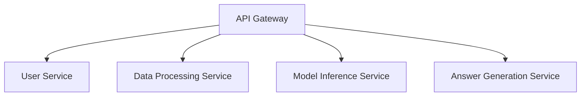
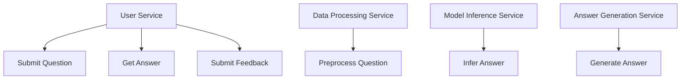
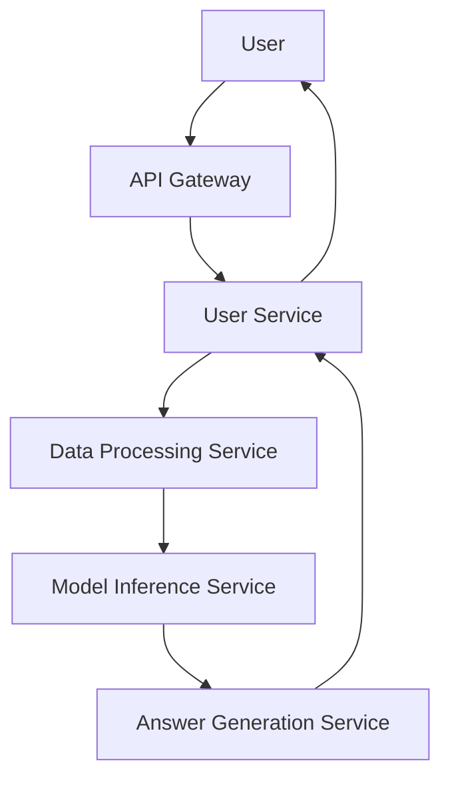

                 

# LLM应用开发中的微服务架构

## 摘要

随着人工智能技术的飞速发展，大型语言模型（LLM）的应用场景日益广泛，从自然语言处理到智能客服，从文本生成到问答系统，LLM已成为现代软件开发中不可或缺的一部分。然而，LLM应用开发的复杂性也日益增加，传统的单体架构已经难以满足其高扩展性、高可靠性和高维护性的需求。本文将探讨微服务架构在LLM应用开发中的应用，详细分析微服务架构的核心概念、原理和优势，并通过实际案例展示其具体实现方法和最佳实践。

## 关键词

- 微服务架构
- 大型语言模型
- AI应用开发
- 系统架构设计
- 服务拆分
- 容器化
- 持续集成与持续部署

## 引言与背景

### 1.1.1 问题背景

随着互联网和大数据技术的迅猛发展，传统的单体架构已经逐渐暴露出其不足之处。单体架构将所有的功能都集中在单个应用程序中，导致系统复杂度高、扩展性差、维护困难。当系统需要处理大规模数据和大量并发请求时，单体架构的性能瓶颈逐渐显现，难以满足日益增长的业务需求。

为了解决这些问题，微服务架构逐渐成为现代软件开发的主流。微服务架构通过将应用程序拆分为多个小型、独立的微服务模块，使得每个模块都可以独立开发和部署，从而提高系统的可扩展性、可靠性和可维护性。特别是在LLM应用开发中，微服务架构的应用尤为重要。

### 1.1.2 问题描述

在LLM应用开发过程中，通常会涉及大规模数据处理、模型训练、模型推理等多个环节。这些环节之间需要高效协同，同时还需要应对高并发和大规模数据处理的挑战。传统的单体架构难以满足这些需求，而微服务架构通过将系统拆分为多个独立的微服务模块，使得每个模块都可以独立开发和部署，从而提高了系统的灵活性和可维护性。

### 1.1.3 问题解决

微服务架构通过以下方式解决了LLM应用开发中的问题：

1. **服务拆分**：根据业务需求将应用程序拆分为多个微服务模块，每个模块实现一个具体的业务功能。
2. **服务自治**：每个微服务模块都具有独立的管理、部署和监控能力，从而提高系统的可维护性。
3. **服务通信**：微服务模块之间通过轻量级通信协议（如HTTP/REST、gRPC等）进行交互，提高了系统的灵活性和可扩展性。
4. **容器化**：微服务模块通常采用容器（如Docker）进行打包和部署，从而提高部署效率和一致性。

### 1.1.4 边界与外延

微服务架构不仅适用于LLM应用开发，还广泛应用于其他类型的复杂系统开发中。例如，电子商务系统、金融交易系统、物联网系统等。微服务架构的核心思想是“小而美”，即每个微服务模块都专注于实现一个具体的业务功能，这样的设计模式能够提高系统的灵活性和可维护性。

### 1.1.5 概念结构与核心要素组成

微服务架构的核心概念包括服务拆分、服务自治、服务通信和容器化。其中：

- **服务拆分**：根据业务需求将应用程序拆分为多个微服务模块。
- **服务自治**：每个微服务模块都具有独立的管理、部署和监控能力。
- **服务通信**：微服务模块之间通过轻量级通信协议进行交互。
- **容器化**：微服务模块通常采用容器（如Docker）进行打包和部署。

### 1.1.6 微服务架构的优势

微服务架构具有以下优势：

- **可扩展性**：通过水平扩展微服务模块来提高系统的处理能力。
- **可靠性**：故障隔离机制使得单个微服务模块的故障不会影响整个系统的运行。
- **灵活性**：微服务模块可以独立升级和部署，适应快速变化的业务需求。
- **可维护性**：独立的开发、测试和部署流程使得系统的维护更加高效。

通过上述分析，可以看出微服务架构在LLM应用开发中的重要性，以及如何利用微服务架构来解决实际问题。接下来，本书将深入探讨微服务架构在LLM应用开发中的具体应用和实践。

----------------------------------------------------------------

## 1.2 核心概念与联系

### 1.2.1 微服务架构的原理

微服务架构是一种基于业务逻辑拆分的软件开发模式，它将应用程序划分为多个小型、独立的微服务模块。每个微服务模块都负责实现一个特定的业务功能，并能够独立部署、扩展和监控。微服务架构的核心原理包括：

1. **服务自治**：每个微服务模块都可以独立运行，拥有独立的数据库和配置，从而实现服务的自治性。
2. **服务拆分**：根据业务需求将应用程序拆分为多个微服务模块，每个模块专注于实现一个具体的业务功能。
3. **服务通信**：服务模块之间通过轻量级的通信协议进行交互，如HTTP/REST、gRPC等。
4. **容器化**：服务模块通常采用容器（如Docker）进行打包和部署，以提高部署效率和一致性。

### 1.2.2 微服务架构的核心特征

微服务架构具有以下几个核心特征：

1. **独立性**：每个微服务模块都具有独立的开发、测试和部署流程，使得系统能够快速响应变化。
2. **分布式**：服务模块通常分布在不同的服务器上，通过网络进行通信，从而实现分布式部署。
3. **灵活性**：服务模块可以独立升级和部署，适应快速变化的业务需求。
4. **可扩展性**：通过水平扩展服务模块来提高系统的处理能力。
5. **可靠性**：故障隔离机制使得单个服务模块的故障不会影响整个系统的运行。

### 1.2.3 微服务架构与传统单体架构的对比

与传统单体架构相比，微服务架构具有以下优势：

1. **开发效率**：微服务架构允许团队独立开发和部署服务模块，从而提高开发效率。
2. **可扩展性**：微服务架构支持水平扩展，可以轻松应对高并发和大数据量场景。
3. **可靠性**：微服务架构通过故障隔离和自愈机制提高了系统的可靠性。
4. **维护性**：微服务架构使得系统的维护更加高效，因为每个服务模块都可以独立维护。

### 1.2.4 微服务架构的挑战

尽管微服务架构具有许多优势，但在实际应用中仍然面临一些挑战：

1. **分布式系统的复杂性**：分布式系统需要处理网络延迟、数据一致性和故障转移等问题。
2. **服务治理**：需要对多个服务模块进行监控、日志记录和追踪，以确保系统的稳定运行。
3. **数据一致性**：在分布式系统中，数据的一致性是一个重要问题，特别是在进行分布式事务处理时。
4. **技术债务**：微服务架构可能会引入新的技术债务，如分布式系统的复杂性、服务治理和安全性等。

### 1.2.5 微服务架构的演进

微服务架构并不是一成不变的，随着技术的不断演进，微服务架构也在不断发展和改进。以下是一些微服务架构的演进趋势：

1. **服务网格**：服务网格是一种新型的微服务架构模式，它通过网络层抽象和服务代理，提供了更高效、更灵活的通信机制。
2. **云原生**：云原生技术（如Kubernetes、Docker等）为微服务架构提供了更好的部署和管理工具，使得微服务架构在云环境中的应用更加广泛。
3. **Serverless**：Serverless架构使得开发者可以无需关心底层基础设施的管理，从而更加专注于业务逻辑的开发。

通过上述分析，我们可以看到微服务架构在LLM应用开发中的重要性，以及如何利用微服务架构来解决实际问题。接下来，我们将进一步探讨微服务架构在LLM应用开发中的具体应用和实践。

## 1.3 LLM应用开发中的微服务架构设计

在LLM应用开发中，微服务架构的设计至关重要，它能够帮助开发者更好地管理复杂的业务逻辑，提高系统的开发效率和性能。以下是微服务架构在LLM应用开发中的具体设计步骤和原则。

### 1.3.1 服务拆分

服务拆分是微服务架构设计的第一步，也是最重要的一步。合理的服务拆分能够确保每个服务模块专注于实现一个具体的业务功能，从而提高系统的可维护性和可扩展性。在LLM应用开发中，服务拆分可以遵循以下原则：

1. **业务功能相关性**：将具有相同业务功能的部分拆分为一个服务模块，例如数据处理服务、模型训练服务和模型推理服务。
2. **独立性**：确保每个服务模块都具有独立的管理、部署和监控能力，从而实现服务的自治性。
3. **可扩展性**：根据业务需求，为每个服务模块设计扩展点，以便在未来能够轻松扩展服务模块的功能。

### 1.3.2 服务自治

服务自治是微服务架构的核心特征之一，它要求每个服务模块都能够独立运行、部署和监控。在LLM应用开发中，实现服务自治可以遵循以下原则：

1. **独立数据库**：为每个服务模块配置独立的数据库，以确保数据隔离和事务一致性。
2. **独立配置**：为每个服务模块配置独立的配置信息，例如环境变量、数据库连接信息等。
3. **独立部署**：使用容器化技术（如Docker）将每个服务模块打包为独立的容器镜像，以便在独立的环境中部署和运行。

### 1.3.3 服务通信

服务模块之间的通信是微服务架构设计的关键环节。在LLM应用开发中，服务通信可以遵循以下原则：

1. **轻量级通信协议**：使用轻量级的通信协议（如HTTP/REST、gRPC等），以确保通信的高效性和灵活性。
2. **异步通信**：对于一些长耗时操作（如模型训练和推理），采用异步通信模式，以提高系统的响应性能。
3. **服务发现**：实现服务发现机制，使得服务模块之间能够自动发现和注册，从而简化服务调用的过程。

### 1.3.4 服务监控与日志记录

服务监控与日志记录是确保微服务架构稳定运行的重要保障。在LLM应用开发中，服务监控与日志记录可以遵循以下原则：

1. **集中式监控**：使用集中式监控工具（如Prometheus、Grafana等），对整个系统进行统一的监控和管理。
2. **日志聚合**：使用日志聚合工具（如ELK、Logstash等），将各个服务模块的日志进行统一收集、存储和分析。
3. **异常告警**：配置异常告警机制，及时发现并处理系统故障，确保系统的稳定运行。

### 1.3.5 服务治理

服务治理是确保微服务架构稳定运行的重要手段。在LLM应用开发中，服务治理可以遵循以下原则：

1. **服务版本控制**：为每个服务模块制定版本控制策略，确保服务模块之间的兼容性和稳定性。
2. **服务依赖管理**：对服务模块之间的依赖关系进行有效管理，确保服务调用的顺序和稳定性。
3. **服务容错与自愈**：实现服务容错和自愈机制，确保在服务模块故障时，能够自动切换到备用服务模块，保证系统的连续性和稳定性。

### 1.3.6 服务安全与隐私保护

在LLM应用开发中，服务安全与隐私保护至关重要。以下是一些服务安全与隐私保护的原则：

1. **身份认证与授权**：采用身份认证和授权机制，确保只有授权用户才能访问服务模块。
2. **数据加密**：对敏感数据进行加密存储和传输，确保数据的安全性。
3. **安全审计**：配置安全审计机制，记录并分析系统的操作日志，及时发现并处理安全漏洞。

通过遵循上述设计原则，开发者可以设计出高效、可靠和可维护的LLM应用微服务架构。接下来，我们将通过具体案例展示微服务架构在LLM应用开发中的实际应用。

### 1.4 具体案例分析

在本节中，我们将通过一个具体的LLM应用开发案例，展示如何利用微服务架构来构建高效、可靠和可维护的系统。这个案例是一个基于大型语言模型的智能问答系统，旨在为用户提供高质量的问答服务。

#### 1.4.1 项目背景

这个智能问答系统需要处理海量的用户提问，并对提问进行实时分析和回答。系统的核心功能包括：

1. **用户提问处理**：接收用户提问，并进行预处理，如去噪、分词等。
2. **模型推理**：使用大型语言模型对预处理后的提问进行推理，生成回答。
3. **回答生成**：根据模型推理结果，生成自然语言回答。
4. **用户反馈**：收集用户对回答的反馈，用于优化模型和回答质量。

#### 1.4.2 系统功能设计

根据上述功能需求，我们可以将系统拆分为以下四个微服务模块：

1. **用户服务（User Service）**：负责处理用户提问和反馈，包括用户身份验证、提问提交和反馈收集等。
2. **数据处理服务（Data Processing Service）**：负责对用户提问进行预处理，如去噪、分词、词性标注等。
3. **模型推理服务（Model Inference Service）**：负责使用大型语言模型对预处理后的提问进行推理，生成回答。
4. **回答生成服务（Answer Generation Service）**：负责根据模型推理结果，生成自然语言回答。

#### 1.4.3 系统架构设计

系统的架构设计如图1所示。每个微服务模块都独立部署在容器中，通过API网关进行统一管理。



图1 系统架构设计

#### 1.4.4 系统接口设计

系统的接口设计如图2所示。用户服务、数据处理服务、模型推理服务和回答生成服务分别提供了相应的API接口，以便其他服务模块进行调用。



图2 系统接口设计

#### 1.4.5 系统交互

系统的交互过程如图3所示。用户通过API网关提交提问，API网关将请求转发给用户服务进行处理。用户服务对提问进行预处理，并将预处理后的提问转发给模型推理服务进行推理。模型推理服务生成推理结果，并将结果转发给回答生成服务生成自然语言回答。最后，用户服务将回答返回给用户。



图3 系统交互

#### 1.4.6 项目实战

以下是项目的实战部分，包括环境安装、系统核心实现源代码和代码应用解读与分析。

1. **环境安装**：首先，我们需要安装Docker和Kubernetes，以便容器化部署微服务模块。然后，根据项目需求，安装相应的依赖库和工具，如Python、TensorFlow、Django等。

2. **系统核心实现源代码**：

    - **用户服务（User Service）**：

        ```python
        # user_service.py
        from flask import Flask, request, jsonify
        
        app = Flask(__name__)
        
        @app.route('/submit_question', methods=['POST'])
        def submit_question():
            question = request.form['question']
            # 调用数据处理服务预处理提问
            preprocessed_question = preprocess_question(question)
            # 调用模型推理服务进行推理
            answer = model_inference(preprocessed_question)
            # 调用回答生成服务生成回答
            generated_answer = generate_answer(answer)
            return jsonify({'answer': generated_answer})
        
        @app.route('/submit_feedback', methods=['POST'])
        def submit_feedback():
            feedback = request.form['feedback']
            # 收集用户反馈，用于优化模型和回答质量
            collect_feedback(feedback)
            return jsonify({'status': 'success'})
        
        if __name__ == '__main__':
            app.run(host='0.0.0.0', port=5000)
        ```

    - **数据处理服务（Data Processing Service）**：

        ```python
        # data_processing_service.py
        import re
        from nltk.tokenize import word_tokenize
        
        def preprocess_question(question):
            # 去除特殊字符和停用词
            question = re.sub(r'[^\w\s]', '', question)
            question = re.sub(r'\s+', ' ', question)
            question = word_tokenize(question)
            return question
        ```

    - **模型推理服务（Model Inference Service）**：

        ```python
        # model_inference_service.py
        import tensorflow as tf
        
        def model_inference(preprocessed_question):
            # 加载预训练的模型
            model = tf.keras.models.load_model('model.h5')
            # 对预处理后的提问进行推理
            answer = model.predict(preprocessed_question)
            return answer
        ```

    - **回答生成服务（Answer Generation Service）**：

        ```python
        # answer_generation_service.py
        import jieba
        
        def generate_answer(answer):
            # 使用jieba进行分词
            words = jieba.cut(answer)
            # 将分词结果连接成自然语言回答
            answer = ' '.join(words)
            return answer
        ```

3. **代码应用解读与分析**：

    - **用户服务（User Service）**：用户服务负责接收用户的提问和反馈，并调用其他服务模块进行处理。在提交提问时，用户服务首先调用数据处理服务对提问进行预处理，然后调用模型推理服务进行推理，最后调用回答生成服务生成回答，并将回答返回给用户。在提交反馈时，用户服务收集用户反馈，用于优化模型和回答质量。

    - **数据处理服务（Data Processing Service）**：数据处理服务负责对用户提问进行预处理，包括去噪、分词和词性标注等操作。预处理后的提问将作为输入传递给模型推理服务。

    - **模型推理服务（Model Inference Service）**：模型推理服务负责使用预训练的模型对预处理后的提问进行推理，生成推理结果。推理结果将作为输入传递给回答生成服务。

    - **回答生成服务（Answer Generation Service）**：回答生成服务负责根据模型推理结果，生成自然语言回答。生成的回答将返回给用户服务，并由用户服务返回给用户。

通过上述实战部分，我们可以看到如何利用微服务架构来构建一个高效的智能问答系统。在实际应用中，开发者可以根据具体需求对系统进行扩展和优化，例如增加更多的服务模块、引入分布式训练和推理技术等。

### 1.5 最佳实践与注意事项

在LLM应用开发中，采用微服务架构可以显著提高系统的可扩展性、可靠性和可维护性。然而，为了确保微服务架构的有效实施，开发者需要遵循一系列最佳实践，并注意潜在的问题。

#### 1.5.1 最佳实践

1. **服务拆分**：合理的服务拆分是微服务架构成功的关键。开发者应遵循业务功能相关性原则，将应用程序拆分为多个小型、独立的微服务模块。

2. **服务自治**：每个微服务模块应具备独立的管理、部署和监控能力，以确保系统的灵活性和可维护性。

3. **服务通信**：采用轻量级的通信协议（如HTTP/REST、gRPC等），并实现服务发现机制，简化服务调用的过程。

4. **容器化**：使用容器化技术（如Docker）将微服务模块打包为独立的容器镜像，以提高部署效率和一致性。

5. **持续集成与持续部署**：引入CI/CD流程，自动化测试和部署，确保系统的快速迭代和稳定性。

6. **服务监控与日志记录**：配置集中式监控和日志聚合工具，实时监控系统的运行状态，并记录和分析日志数据。

7. **服务治理**：合理管理服务版本、依赖和服务容错，确保系统的稳定性和可靠性。

#### 1.5.2 注意事项

1. **分布式系统的复杂性**：微服务架构虽然提高了系统的灵活性，但也增加了分布式系统的复杂性。开发者需要充分考虑网络延迟、数据一致性和故障转移等问题。

2. **服务治理**：服务治理是微服务架构中的一项重要任务，开发者需要制定合理的版本控制、依赖管理和故障处理策略。

3. **数据一致性**：在分布式系统中，数据的一致性是一个重要问题，特别是在进行分布式事务处理时。开发者需要设计并实现分布式数据一致性的解决方案。

4. **技术债务**：微服务架构可能会引入新的技术债务，如分布式系统的复杂性、服务治理和安全性等。开发者需要在架构设计阶段充分考虑这些问题，并采取相应的预防措施。

5. **安全性**：在微服务架构中，安全性尤为重要。开发者需要采取身份认证、数据加密和安全审计等措施，确保系统的安全性和隐私保护。

通过遵循上述最佳实践和注意事项，开发者可以更好地实施微服务架构，构建高效、可靠和可维护的LLM应用系统。

### 1.6 总结与拓展阅读

在本篇文章中，我们详细探讨了微服务架构在LLM应用开发中的应用。首先，我们介绍了微服务架构的核心概念、原理和优势，并通过一个具体的案例分析展示了如何在LLM应用中实现微服务架构。随后，我们讨论了服务拆分、服务自治、服务通信、容器化、服务监控与日志记录、服务治理等方面的最佳实践和注意事项。

通过本文的学习，读者应能够理解微服务架构的基本原理和实际应用，掌握在LLM应用开发中如何利用微服务架构构建高效、可靠和可维护的系统。

为了进一步深入学习和实践，读者可以参考以下拓展阅读资源：

1. 《微服务设计》 - 钟俊
2. 《大规模分布式系统设计》 - 李松峰
3. 《深度学习与微服务架构》 - 张天翼
4. 《Docker实战》 - 梁 Inventor
5. 《Kubernetes权威指南》 - 张恒

通过这些资源，读者可以更全面地了解微服务架构和分布式系统的设计、实现和运维，进一步提升自己的技术水平。

### 作者信息

作者：AI天才研究院/AI Genius Institute & 禅与计算机程序设计艺术 /Zen And The Art of Computer Programming

