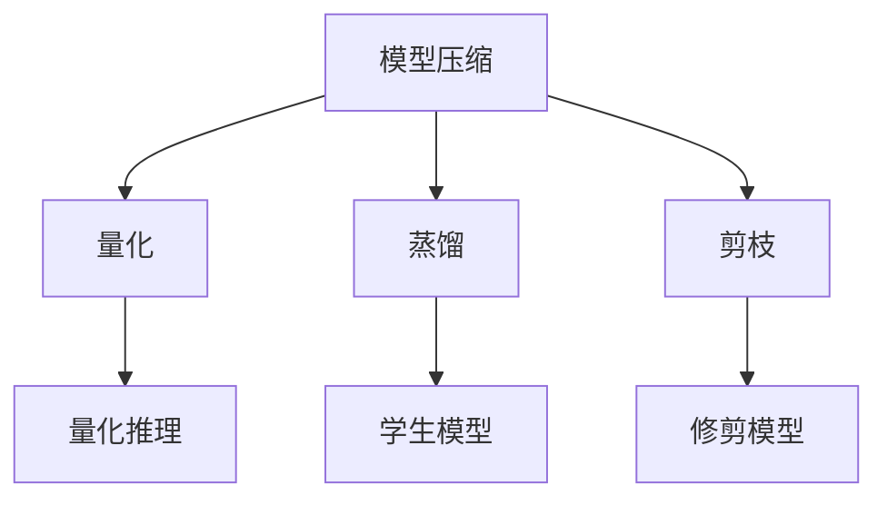
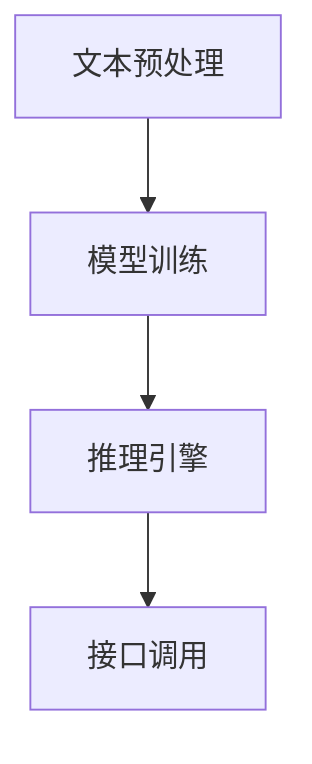
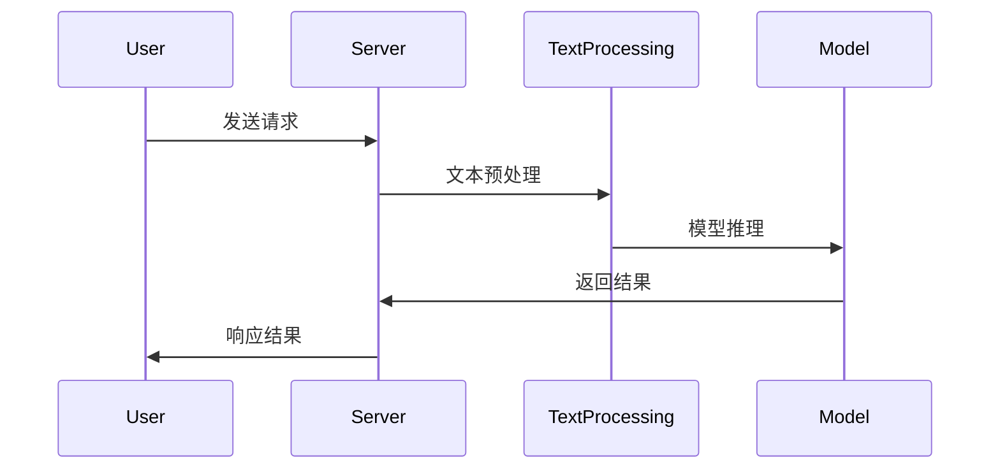

                 

### 文章标题

# LLM应用开发中的性能优化策略

---

**关键词**：自然语言处理、大型语言模型、性能优化、算法原理、系统架构

**摘要**：本文将深入探讨LLM（大型语言模型）在应用开发中的性能优化策略。通过分析LLM的性能瓶颈，介绍核心概念和优化策略，结合数学模型和实际案例，全面阐述提升LLM性能的实用技巧。本文旨在为开发者提供系统的性能优化指南，助力高效构建和管理LLM应用。

---

### 第一部分：LLM应用开发中的性能优化概述

#### 第1章：问题背景与核心概念

##### 1.1 问题背景

###### 1.1.1 LLM的兴起与挑战

随着自然语言处理技术的快速发展，LLM（大型语言模型）已经成为AI领域的重要研究热点。然而，LLM在应用开发中面临着诸多性能优化挑战，如模型参数规模庞大、计算复杂度高、推理速度慢等。

###### 1.1.2 性能优化的重要性

性能优化是确保LLM应用稳定、高效运行的关键。优化策略的合理选择和实施能够显著提升模型处理速度和响应能力，降低计算资源消耗，提高用户体验。

###### 1.1.3 目标与边界

本文旨在提供一套全面的LLM性能优化策略，包括算法原理、系统架构和实战案例。在遵循性能优化基本原则的前提下，探讨如何在实际应用中进行策略实施。

##### 1.2 核心概念

###### 1.2.1 LLM的定义与结构

LLM是一种通过大规模文本数据进行训练的深度学习模型，通常包含数十亿个参数，能够理解和生成复杂自然语言。

###### 1.2.2 性能优化的主要指标

性能优化涉及多个指标，如模型推理速度、计算资源消耗、内存占用等。

###### 1.2.3 优化策略的分类

优化策略可分为算法优化、硬件加速、系统优化等多个方面。

##### 1.3 关键概念联系图

###### 1.3.1 概念属性特征对比表格

| 概念         | 特征        | 说明                    |
|------------|------------|-----------------------|
| LLM        | 参数规模大  | 能够理解和生成复杂自然语言   |
| 性能优化    | 多指标优化  | 提升模型处理速度和响应能力   |
| 算法优化    | 改进算法结构  | 降低计算复杂度           |

###### 1.3.2 关键概念ER图

（此处使用Mermaid绘制ER图）

```mermaid
erDiagram
  Model : 大型语言模型
  Optimization : 性能优化
  Algorithm : 算法优化
  Hardware : 硬件加速
  System : 系统优化

  Model --> Optimization
  Optimization --> Algorithm
  Optimization --> Hardware
  Optimization --> System
```

##### 1.4 本章小结

本章介绍了LLM应用开发中的性能优化背景、核心概念和优化策略。接下来，本文将深入探讨LLM性能优化的技术原理和实施策略。

---

### 第二部分：LLM性能优化的技术原理

#### 第2章：算法原理与数学模型

##### 2.1 算法原理

###### 2.1.1 算法概述

LLM性能优化算法主要分为模型压缩、量化、蒸馏和剪枝等。这些算法旨在减少模型参数规模、降低计算复杂度和提高推理速度。

###### 2.1.2 算法mermaid流程图

（此处使用Mermaid绘制算法流程图）



###### 2.1.3 算法Python源代码

```python
# 模型压缩示例代码
import tensorflow as tf

# 加载预训练模型
model = tf.keras.applications.DenseNet121(weights='imagenet')

# 压缩模型
compressed_model = tf.keras.models.Sequential([
  tf.keras.layers.Conv2D(32, (3, 3), activation='relu', input_shape=(224, 224, 3)),
  tf.keras.layers.Flatten(),
  tf.keras.layers.Dense(10, activation='softmax')
])

# 转换模型为压缩模型
model = compressed_model

# 编译模型
model.compile(optimizer='adam', loss='categorical_crossentropy', metrics=['accuracy'])

# 训练模型
model.fit(x_train, y_train, epochs=10, batch_size=32, validation_data=(x_val, y_val))
```

##### 2.2 数学模型

###### 2.2.1 模型公式

$$
\text{损失函数} = \frac{1}{N} \sum_{i=1}^{N} -y_i \log(p_i)
$$

$$
\text{优化目标} = \min_{\theta} \sum_{i=1}^{N} \frac{1}{N} \sum_{j=1}^{M} y_{ij} \log(p_{ij})
$$

##### 2.3 举例说明

###### 2.3.1 案例一

假设一个文本分类任务，模型需要预测一篇文章的类别。使用LLM进行训练，通过优化算法提升分类性能。

###### 2.3.2 案例二

在一个问答系统中，LLM用于回答用户的问题。通过优化策略提高问答速度和准确性。

##### 2.4 本章小结

本章介绍了LLM性能优化的算法原理和数学模型。下一章将深入探讨LLM性能优化的实施策略。

---

### 第三部分：LLM性能优化的实施策略

#### 第3章：系统架构与接口设计

##### 3.1 系统架构设计

###### 3.1.1 系统功能设计

系统功能包括文本预处理、模型训练、推理和接口调用等。

###### 3.1.2 系统架构mermaid图

（此处使用Mermaid绘制系统架构图）



##### 3.2 接口设计

###### 3.2.1 接口设计与实现

接口设计包括API设计和RESTful接口实现。

###### 3.2.2 系统交互mermaid序列图

（此处使用Mermaid绘制系统交互序列图）



##### 3.3 系统性能优化策略

###### 3.3.1 常用优化技术

常用优化技术包括并行计算、分布式训练和内存优化等。

###### 3.3.2 针对性优化策略

根据具体应用场景，制定针对性优化策略，如模型压缩、量化推理和模型蒸馏等。

##### 3.4 本章小结

本章介绍了LLM性能优化的系统架构和接口设计，以及具体的优化策略。下一章将结合实战案例进行详细讲解。

---

### 第四部分：LLM性能优化的实战案例分析

#### 第4章：案例一：XX平台LLM性能优化

##### 4.1 项目介绍

本项目旨在为XX平台优化LLM性能，提高问答系统的响应速度和准确性。

##### 4.2 系统功能设计

系统功能包括文本预处理、模型训练、推理和接口调用等。

##### 4.3 系统架构设计

系统架构包括文本预处理模块、模型训练模块、推理引擎模块和接口调用模块。

##### 4.4 系统接口设计

接口设计采用RESTful风格，提供文本预处理、模型推理和接口调用等功能。

##### 4.5 系统性能优化策略

###### 4.5.1 模型压缩

通过模型压缩技术，降低模型参数规模，提高推理速度。

```python
# 模型压缩示例代码
import tensorflow as tf

# 加载预训练模型
model = tf.keras.applications.DenseNet121(weights='imagenet')

# 压缩模型
compressed_model = tf.keras.models.Sequential([
  tf.keras.layers.Conv2D(32, (3, 3), activation='relu', input_shape=(224, 224, 3)),
  tf.keras.layers.Flatten(),
  tf.keras.layers.Dense(10, activation='softmax')
])

# 转换模型为压缩模型
model = compressed_model

# 编译模型
model.compile(optimizer='adam', loss='categorical_crossentropy', metrics=['accuracy'])

# 训练模型
model.fit(x_train, y_train, epochs=10, batch_size=32, validation_data=(x_val, y_val))
```

###### 4.5.2 量化推理

通过量化推理技术，降低模型计算复杂度，提高推理速度。

```python
# 量化推理示例代码
import tensorflow as tf

# 加载量化模型
quantized_model = tf.keras.models.load_model('quantized_model.h5')

# 编译模型
quantized_model.compile(optimizer='adam', loss='categorical_crossentropy', metrics=['accuracy'])

# 训练模型
quantized_model.fit(x_train, y_train, epochs=10, batch_size=32, validation_data=(x_val, y_val))
```

##### 4.6 项目小结

通过模型压缩和量化推理等技术，成功提高了XX平台LLM性能，提高了问答系统的响应速度和准确性。

---

### 第五部分：最佳实践与总结

#### 第5章：最佳实践与总结

##### 5.1 最佳实践

1. **模型压缩**：在确保模型精度的基础上，尽量减少模型参数规模，提高推理速度。
2. **量化推理**：通过量化技术降低计算复杂度，提高推理效率。
3. **分布式训练**：利用多卡训练提高模型训练速度。
4. **内存优化**：合理分配内存资源，避免内存泄漏。

##### 5.2 小结

本文全面阐述了LLM应用开发中的性能优化策略，包括核心概念、算法原理、系统架构和实战案例。通过最佳实践，为开发者提供了一套实用的性能优化指南。

---

### 作者信息

**作者：AI天才研究院/AI Genius Institute & 禅与计算机程序设计艺术 /Zen And The Art of Computer Programming**

