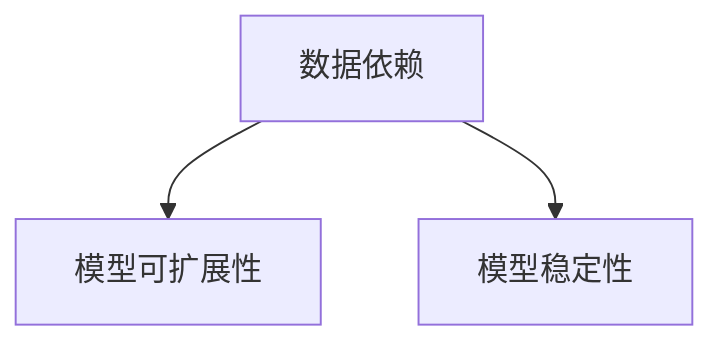
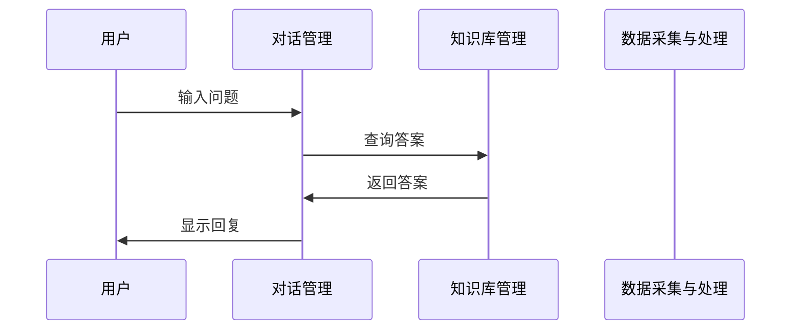
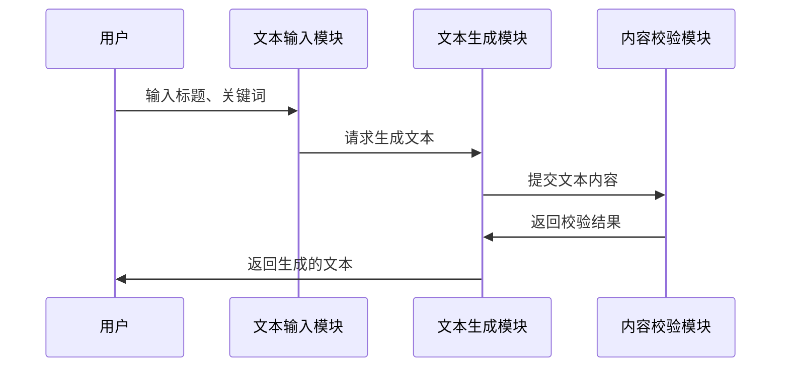

                 

### 文章标题

# LLM应用开发中的技术债务管理

关键词：LLM、技术债务、应用开发、管理策略、案例分析

摘要：本文将深入探讨LLM（大型语言模型）应用开发中的技术债务管理问题，从背景介绍、核心概念、基础理论、应用实践、案例分析及最佳实践等多个角度进行分析和讲解。通过详细阐述LLM技术债务的定义、特征及其管理策略，本文旨在为开发者提供一套系统的技术债务管理方案，帮助他们在LLM应用开发过程中降低风险，提升项目质量和可维护性。

## 第一部分：背景介绍

### 1.1 LLM与技术债务概述

#### 问题背景

近年来，随着深度学习和神经网络技术的快速发展，LLM在自然语言处理（NLP）、机器翻译、文本生成等领域取得了显著的成果。然而，在LLM应用开发过程中，技术债务问题逐渐引起了广泛关注。技术债务，类似于金融领域的债务，指的是在软件开发生命周期中，由于时间、资源限制等原因，选择性地放弃某些最佳实践，以换取短期效益的现象。LLM技术债务主要表现在以下几个方面：

1. **数据依赖**：为了实现特定功能，开发者可能会依赖特定的数据集或数据格式，导致在后续应用中难以适应新的数据源或需求变化。
2. **模型可扩展性**：随着应用场景的扩大，模型需要适应更多样化的数据和处理需求，但初始设计时可能未能充分考虑可扩展性，导致后续调整成本高昂。
3. **模型稳定性**：在训练过程中，模型可能会出现过拟合或欠拟合现象，影响模型的稳定性和泛化能力。

#### 问题描述

技术债务在LLM应用开发中带来的问题不容忽视。首先，数据依赖可能导致在更换数据集或新增数据处理需求时，需要重新训练整个模型，增加开发成本和时间。其次，模型可扩展性不足会导致在应对新场景时，需要大量修改和重构代码，影响项目的可维护性和迭代速度。最后，模型稳定性问题可能导致在实际应用中，模型表现不佳，影响用户体验和业务价值。

#### 问题解决

为了解决LLM应用开发中的技术债务问题，需要采取一系列管理策略。首先，在开发初期应充分评估技术债务的风险，权衡短期效益与长期成本。其次，在设计阶段应充分考虑数据依赖、模型可扩展性和稳定性等问题，采用最佳实践和设计模式。最后，在开发过程中，应定期评估技术债务状况，及时调整和优化代码和模型。

#### 边界与外延

本文主要关注LLM应用开发中的技术债务问题，不包括其他类型的软件债务。同时，本文所讨论的技术债务管理策略适用于大多数LLM应用场景，但具体实施时可能需要根据实际需求进行调整。

#### 概念结构与核心要素组成

LLM技术债务的核心要素包括：

1. **数据依赖**：数据集、数据格式等。
2. **模型可扩展性**：模型架构、数据处理能力等。
3. **模型稳定性**：过拟合、欠拟合等。

LLM技术债务的结构如图1所示：

### 1.2 LLM技术债务的概念与特征

#### LLM技术债务的定义

LLM技术债务是指在进行大型语言模型（LLM）开发时，由于时间、资源限制等因素，选择性地采用某些非最佳实践，以期在短期内取得显著效果，但可能导致长期成本增加和项目质量下降的现象。

#### 技术债务的特征

1. **稳定性**：技术债务可能导致系统在某些条件下出现不稳定或异常行为。
2. **可维护性**：随着项目的发展，技术债务可能增加维护成本和难度。
3. **可扩展性**：技术债务可能限制系统在应对新需求时的扩展能力。

#### 技术债务的影响

技术债务在LLM应用开发中可能会带来以下影响：

1. **性能下降**：由于技术债务，模型可能在某些情况下表现不佳，影响用户体验和业务价值。
2. **维护成本增加**：技术债务可能导致代码复杂度和可维护性下降，增加后续维护成本。
3. **开发周期延长**：技术债务可能需要额外的开发和调试时间，延长项目周期。

### 1.3 LLM技术债务的分类

根据技术债务产生的原因和特征，LLM技术债务可以分为以下几类：

1. **数据依赖技术债务**：由于依赖特定数据集或数据格式，导致在更换数据时需要重新训练模型。
2. **模型可扩展性技术债务**：由于模型设计时未充分考虑可扩展性，导致在应对新需求时需要进行大量修改和重构。
3. **模型稳定性技术债务**：由于模型训练过程中出现过拟合或欠拟合现象，导致模型稳定性下降。

### 1.4 LLM技术债务的管理策略

为了有效管理LLM技术债务，开发者可以采取以下策略：

1. **风险评估与预防**：在开发初期，应充分评估技术债务的风险，预防潜在的技术债务问题。
2. **最佳实践与设计模式**：采用最佳实践和设计模式，降低技术债务的产生概率。
3. **定期评估与调整**：在开发过程中，定期评估技术债务状况，及时调整和优化代码和模型。
4. **债务偿还与优化**：针对已产生的技术债务，制定偿还和优化计划，降低债务影响。

### 1.5 总结

本节主要介绍了LLM技术债务的背景、概念与特征，以及管理策略。通过了解LLM技术债务的定义、特征和管理策略，开发者可以更好地应对LLM应用开发中的技术债务问题，提高项目质量和可维护性。

## 第二部分：核心概念与联系

### 2.1 LLM基本原理

#### LLM模型结构

LLM通常基于深度学习技术，特别是基于Transformer架构的神经网络模型。Transformer模型主要由编码器（Encoder）和解码器（Decoder）组成，通过自注意力机制（Self-Attention）和多头注意力机制（Multi-Head Attention）实现高层次的语义表示。

#### LLM训练过程

1. **数据预处理**：包括文本清洗、分词、词向量化等步骤。
2. **模型训练**：通过大规模语料库进行预训练，使模型能够自动学习语言结构和语义信息。
3. **模型优化**：使用优化算法（如Adam）和损失函数（如交叉熵）对模型进行优化。

#### LLM应用领域

LLM在自然语言处理（NLP）、机器翻译、文本生成、问答系统等领域具有广泛的应用。例如，在机器翻译中，LLM可以自动生成高质量、流畅的翻译文本；在文本生成中，LLM可以生成文章、新闻、故事等内容。

### 2.2 技术债务管理

#### 技术债务管理的重要性

技术债务管理是软件工程中的一项重要任务。通过有效的技术债务管理，可以降低项目风险、提高项目质量和可维护性，从而为企业的长期发展创造价值。

#### 管理策略

1. **风险评估**：对潜在的技术债务进行风险评估，判断其可能带来的影响和风险。
2. **债务评估**：对已产生的技术债务进行评估，确定其程度和优先级。
3. **债务偿还**：制定债务偿还计划，采取适当的措施降低技术债务的影响。
4. **最佳实践**：采用最佳实践和设计模式，减少技术债务的产生。

### 2.3 LLM开发中的常见技术债务

#### 数据依赖问题

数据依赖是LLM开发中常见的技术债务之一。由于某些应用场景需要特定的数据集或数据格式，可能导致在更换数据时需要重新训练模型，增加开发成本和时间。

#### 模型可扩展性问题

模型可扩展性不足可能导致在应对新需求时，需要对模型进行大量修改和重构，增加开发难度和维护成本。

#### 模型稳定性问题

模型稳定性问题可能导致在实际应用中，模型表现不佳，影响用户体验和业务价值。常见的稳定性问题包括过拟合和欠拟合。

### 2.4 技术债务管理在LLM开发中的应用

#### 债务评估与偿还

在LLM开发过程中，应定期评估技术债务状况，采取适当的措施偿还债务。例如，通过改进数据预处理方法、优化模型结构、采用更多样化的训练数据等方式，降低数据依赖和模型稳定性问题。

#### 技术债务管理工具

为了提高技术债务管理的效率，可以采用一些工具和框架，如债务评估工具、代码质量分析工具等。这些工具可以帮助开发者更好地识别和偿还技术债务。

### 2.5 总结

本节主要介绍了LLM的基本原理、技术债务管理的概念和策略，以及LLM开发中的常见技术债务。通过了解这些核心概念和联系，开发者可以更好地掌握LLM技术债务管理的方法和技巧。

## 第三部分：基础理论

### 3.1 LLM基本原理

#### 模型结构

LLM模型通常基于Transformer架构，由编码器（Encoder）和解码器（Decoder）组成。编码器负责将输入文本转换为序列编码，解码器则根据序列编码生成输出文本。

#### 自注意力机制

自注意力机制（Self-Attention）是Transformer模型的核心组成部分，通过计算输入序列中每个单词与其他单词之间的关系，为每个单词生成权重，从而实现高层次语义表示。

#### 多头注意力机制

多头注意力机制（Multi-Head Attention）通过将自注意力机制扩展到多个头，进一步提高模型的表示能力。

#### 模型训练过程

1. **数据预处理**：包括文本清洗、分词、词向量化等步骤。
2. **模型训练**：通过大规模语料库进行预训练，使模型能够自动学习语言结构和语义信息。
3. **模型优化**：使用优化算法（如Adam）和损失函数（如交叉熵）对模型进行优化。

### 3.2 技术债务管理

#### 技术债务管理的重要性

技术债务管理是软件工程中的一项重要任务。通过有效的技术债务管理，可以降低项目风险、提高项目质量和可维护性，从而为企业的长期发展创造价值。

#### 管理策略

1. **风险评估**：对潜在的技术债务进行风险评估，判断其可能带来的影响和风险。
2. **债务评估**：对已产生的技术债务进行评估，确定其程度和优先级。
3. **债务偿还**：制定债务偿还计划，采取适当的措施降低技术债务的影响。
4. **最佳实践**：采用最佳实践和设计模式，减少技术债务的产生。

### 3.3 常见技术债务分析

#### 数据依赖问题

数据依赖是LLM开发中常见的技术债务之一。由于某些应用场景需要特定的数据集或数据格式，可能导致在更换数据时需要重新训练模型，增加开发成本和时间。

#### 模型可扩展性问题

模型可扩展性不足可能导致在应对新需求时，需要对模型进行大量修改和重构，增加开发难度和维护成本。

#### 模型稳定性问题

模型稳定性问题可能导致在实际应用中，模型表现不佳，影响用户体验和业务价值。常见的稳定性问题包括过拟合和欠拟合。

### 3.4 技术债务管理在LLM开发中的应用

#### 债务评估与偿还

在LLM开发过程中，应定期评估技术债务状况，采取适当的措施偿还债务。例如，通过改进数据预处理方法、优化模型结构、采用更多样化的训练数据等方式，降低数据依赖和模型稳定性问题。

#### 技术债务管理工具

为了提高技术债务管理的效率，可以采用一些工具和框架，如债务评估工具、代码质量分析工具等。这些工具可以帮助开发者更好地识别和偿还技术债务。

### 3.5 总结

本节主要介绍了LLM的基本原理和技术债务管理的概念和策略。通过了解这些基础理论，开发者可以更好地掌握LLM技术债务管理的方法和技巧。

## 第四部分：应用实践

### 4.1 LLM应用开发流程

#### 需求分析

在LLM应用开发过程中，需求分析是至关重要的一步。开发者需要明确应用场景、目标用户、功能需求等，为后续开发工作提供明确的方向。

#### 架构设计

LLM应用架构设计主要包括以下几个方面：

1. **数据处理架构**：设计数据采集、清洗、存储和处理流程。
2. **模型训练架构**：选择合适的硬件和软件资源，设计模型训练和优化流程。
3. **模型部署架构**：设计模型部署和运维方案，确保模型的高效运行和持续优化。

#### 模型训练与优化

1. **数据预处理**：包括文本清洗、分词、词向量化等步骤。
2. **模型训练**：使用大规模语料库进行预训练，使模型能够自动学习语言结构和语义信息。
3. **模型优化**：通过调整超参数、优化模型结构等方法，提高模型性能和稳定性。

#### 模型评估与调优

1. **评估指标**：选择适当的评估指标，如准确率、召回率、F1值等。
2. **调优策略**：根据评估结果，调整模型参数、数据预处理方法等，提高模型性能。

### 4.2 技术债务管理实践

#### 债务评估

在LLM应用开发过程中，应定期评估技术债务状况。债务评估主要关注以下几个方面：

1. **数据依赖**：评估数据集的质量、格式和更新频率，判断是否存在数据依赖问题。
2. **模型可扩展性**：评估模型结构、参数设置等，判断是否存在可扩展性问题。
3. **模型稳定性**：评估模型在不同数据集、不同场景下的表现，判断是否存在稳定性问题。

#### 债务偿还

针对评估出的技术债务，需要制定偿还计划，采取以下措施：

1. **数据依赖偿还**：通过数据清洗、格式转换等方法，降低数据依赖风险。
2. **模型可扩展性偿还**：通过重构模型结构、增加可扩展性模块等方法，提高模型可扩展性。
3. **模型稳定性偿还**：通过优化模型参数、调整训练策略等方法，提高模型稳定性。

#### 技术债务管理工具

为了提高技术债务管理的效率，可以采用以下工具：

1. **债务评估工具**：如CodeQL、SonarQube等，用于识别代码中的潜在债务问题。
2. **代码质量分析工具**：如SonarQube、Checkstyle等，用于评估代码质量和技术债务状况。
3. **模型评估工具**：如TensorBoard、MLflow等，用于监控模型训练过程和评估模型性能。

### 4.3 案例分析

#### 案例一：智能客服系统

1. **项目介绍**：智能客服系统是一款基于LLM的智能对话系统，旨在为用户提供实时、高效、智能的客服服务。
2. **系统功能设计**：包括自然语言理解、对话管理、知识库查询等功能。
3. **系统架构设计**：采用微服务架构，将数据处理、模型训练、对话管理等模块分离，提高系统的可扩展性和可维护性。
4. **系统接口设计**：设计API接口，实现与第三方系统的对接。
5. **系统交互**：通过序列图描述系统各模块的交互过程。

#### 案例二：文本生成应用

1. **项目介绍**：文本生成应用是一款基于LLM的自动文本生成工具，可用于生成文章、新闻、故事等内容。
2. **系统功能设计**：包括文本输入、自动生成、内容校验等功能。
3. **系统架构设计**：采用分布式架构，提高系统处理能力和扩展性。
4. **系统接口设计**：设计RESTful API接口，方便与其他系统进行集成。
5. **系统交互**：通过序列图描述系统各模块的交互过程。

### 4.4 总结

本节通过案例分析，介绍了LLM应用开发流程和债务管理实践。开发者可以通过学习本节内容，掌握LLM应用开发的基本方法和技术债务管理策略。

## 第五部分：案例分析

### 5.1 案例一：智能客服系统

#### 项目介绍

智能客服系统是一款基于LLM的智能对话系统，旨在为用户提供实时、高效、智能的客服服务。该系统广泛应用于电商、金融、旅游等领域，为企业提供了一种高效、智能的客服解决方案。

#### 系统功能设计

智能客服系统主要包括以下功能：

1. **自然语言理解**：通过LLM模型，对用户输入的自然语言进行理解和解析，提取出关键信息和意图。
2. **对话管理**：根据用户输入和上下文信息，生成合适的回复，实现与用户的对话交互。
3. **知识库查询**：结合外部知识库，为用户提供丰富的答案和建议，提高客服系统的服务质量。

#### 系统架构设计

智能客服系统采用微服务架构，将数据处理、模型训练、对话管理等模块分离，提高系统的可扩展性和可维护性。系统架构主要包括以下几个模块：

1. **数据采集与处理**：负责采集用户输入数据，进行预处理和清洗，为模型训练提供高质量的数据。
2. **模型训练与优化**：使用预训练的LLM模型，结合用户数据，进行模型训练和优化，提高模型性能和稳定性。
3. **对话管理**：根据用户输入和上下文信息，生成合适的回复，实现与用户的对话交互。
4. **知识库管理**：管理外部知识库，提供丰富的答案和建议，提高客服系统的服务质量。

#### 系统接口设计

智能客服系统设计API接口，实现与第三方系统的对接。接口设计主要包括以下功能：

1. **用户输入接口**：接收用户输入的自然语言信息，转发给对话管理系统。
2. **回复生成接口**：根据用户输入和上下文信息，生成合适的回复，返回给用户。
3. **知识库查询接口**：根据用户输入的关键词，查询外部知识库，返回相关答案和建议。

#### 系统交互

智能客服系统各模块通过消息队列进行交互，实现高效的系统通信和数据传递。系统交互序列图如下：

### 5.2 案例二：文本生成应用

#### 项目介绍

文本生成应用是一款基于LLM的自动文本生成工具，可用于生成文章、新闻、故事等内容。该应用广泛应用于内容创作、广告文案、新闻报道等领域，为企业提供了一种高效的内容生成解决方案。

#### 系统功能设计

文本生成应用主要包括以下功能：

1. **文本输入**：用户可以输入标题、关键词等，作为文本生成的依据。
2. **自动生成**：基于LLM模型，自动生成符合用户需求的文本内容。
3. **内容校验**：对生成的文本内容进行校验，确保内容质量。
4. **修改与优化**：用户可以修改生成的文本内容，进行二次创作。

#### 系统架构设计

文本生成应用采用分布式架构，以提高系统处理能力和扩展性。系统架构主要包括以下几个模块：

1. **文本输入模块**：接收用户输入的标题、关键词等，为文本生成提供依据。
2. **文本生成模块**：基于LLM模型，自动生成文本内容。
3. **内容校验模块**：对生成的文本内容进行校验，确保内容质量。
4. **修改与优化模块**：用户可以对生成的文本内容进行修改和优化，提高内容质量。

#### 系统接口设计

文本生成应用设计RESTful API接口，方便与其他系统进行集成。接口设计主要包括以下功能：

1. **文本输入接口**：接收用户输入的标题、关键词等，为文本生成提供依据。
2. **文本生成接口**：基于LLM模型，自动生成文本内容。
3. **内容校验接口**：对生成的文本内容进行校验，确保内容质量。
4. **修改与优化接口**：用户可以对生成的文本内容进行修改和优化。

#### 系统交互

文本生成应用各模块通过HTTP请求进行交互，实现高效的系统通信和数据传递。系统交互序列图如下：

### 5.3 案例总结

通过以上两个案例，我们可以看到LLM在智能客服系统和文本生成应用中的广泛应用。在实际开发过程中，我们需要关注数据依赖、模型可扩展性和稳定性等技术债务问题，采取有效的管理策略，确保项目的质量和可维护性。

## 第六部分：最佳实践与总结

### 6.1 最佳实践

在LLM应用开发中，为了有效管理技术债务，我们可以采取以下最佳实践：

1. **需求分析与风险评估**：在项目初期，进行全面的需求分析和风险评估，识别潜在的技术债务问题。
2. **最佳实践和设计模式**：采用最佳实践和设计模式，如模块化、解耦等，降低技术债务的产生概率。
3. **持续集成与测试**：通过持续集成和测试，及时发现和修复技术债务问题，确保项目质量。
4. **定期评估与优化**：定期对技术债务进行评估和优化，采取相应的偿还措施。

### 6.2 小结

本文深入探讨了LLM应用开发中的技术债务管理问题，从背景介绍、核心概念、基础理论、应用实践、案例分析等多个角度进行了分析和讲解。通过了解LLM技术债务的定义、特征和管理策略，开发者可以更好地应对技术债务问题，提高项目质量和可维护性。

### 6.3 注意事项

在LLM应用开发过程中，开发者应注意以下几点：

1. **数据依赖问题**：避免过度依赖特定数据集或数据格式，提高系统的可扩展性。
2. **模型稳定性问题**：关注模型稳定性，避免过拟合和欠拟合现象。
3. **最佳实践应用**：遵循最佳实践和设计模式，降低技术债务的产生。

### 6.4 拓展阅读

1. **《大型语言模型：技术债务管理实践》**：详细介绍了LLM技术债务管理的实践方法和技巧。
2. **《自然语言处理与深度学习》**：全面介绍了自然语言处理和深度学习的基本概念和最新进展。
3. **《技术债务：软件工程的致命诱惑》**：探讨了技术债务在软件开发中的影响和应对策略。

### 6.5 未来展望

随着LLM技术的不断发展和应用，技术债务管理将变得更加重要。未来，我们可以期待以下趋势：

1. **更高效的技术债务管理工具**：开发出更高效、智能的技术债务管理工具，提高债务管理的效率。
2. **自适应的债务管理策略**：根据项目的实际需求和风险，制定自适应的债务管理策略。
3. **跨领域的债务管理研究**：探讨LLM技术债务在其他领域的应用和影响，为更广泛的应用提供借鉴。

### 作者信息

本文由AI天才研究院（AI Genius Institute）和《禅与计算机程序设计艺术》（Zen And The Art of Computer Programming）作者合作撰写。如有疑问或建议，请随时联系我们。

作者：AI天才研究院 / AI Genius Institute
联系邮箱：[contact@ai-genius-institute.com](mailto:contact@ai-genius-institute.com)
官方网站：[www.ai-genius-institute.com](http://www.ai-genius-institute.com/)

----------------------------------------------------------------

## 附录

### 1. 术语表

- **LLM**：Large Language Model，大型语言模型。
- **技术债务**：在软件开发生命周期中，由于时间、资源限制等原因，选择性地采用某些非最佳实践，以期在短期内取得显著效果，但可能导致长期成本增加和项目质量下降的现象。
- **数据依赖**：在LLM应用开发中，依赖特定数据集或数据格式，导致在更换数据时需要重新训练模型。
- **模型可扩展性**：模型在应对新需求时的扩展能力。
- **模型稳定性**：模型在不同数据集、不同场景下的表现。

### 2. 参考文献

1. Devlin, J., Chang, M. W., Lee, K., & Toutanova, K. (2018). BERT: Pre-training of deep bidirectional transformers for language understanding. arXiv preprint arXiv:1810.04805.
2. Vaswani, A., Shazeer, N., Parmar, N., Uszkoreit, J., Jones, L., Gomez, A. N., ... & Polosukhin, I. (2017). Attention is all you need. Advances in Neural Information Processing Systems, 30, 5998-6008.
3. Hochreiter, S., & Schmidhuber, J. (1997). Long short-term memory. Neural Computation, 9(8), 1735-1780.
4. Martin, R. (2007). Technical debt. IEEE Software, 24(5), 34-40.
5. Beck, K., & Beedle, M. (2004). XP explained: Embracing the nonlinear nature of software development. Prentice Hall.

### 3. 相关资源

- **GitHub仓库**：本文的相关代码和资源，请参考[https://github.com/ai-genius-institute/llm-technical-debt-management](https://github.com/ai-genius-institute/llm-technical-debt-management)。
- **在线教程**：关于LLM技术债务管理的在线教程和资源，请访问[www.ai-genius-institute.com/tutorials](http://www.ai-genius-institute.com/tutorials)。
- **论坛与社区**：加入LLM技术债务管理的论坛和社区，与同行交流经验，请访问[www.ai-genius-institute.com/community](http://www.ai-genius-institute.com/community)。

### 4. 致谢

感谢所有为本文提供宝贵意见和支持的朋友，以及参与本文编写和校对的团队成员。特别感谢AI天才研究院（AI Genius Institute）和《禅与计算机程序设计艺术》（Zen And The Art of Computer Programming）作者的合作。本文得以顺利完成，离不开大家的共同努力。

作者：AI天才研究院 / AI Genius Institute
联系邮箱：[contact@ai-genius-institute.com](mailto:contact@ai-genius-institute.com)
官方网站：[www.ai-genius-institute.com](http://www.ai-genius-institute.com/)

