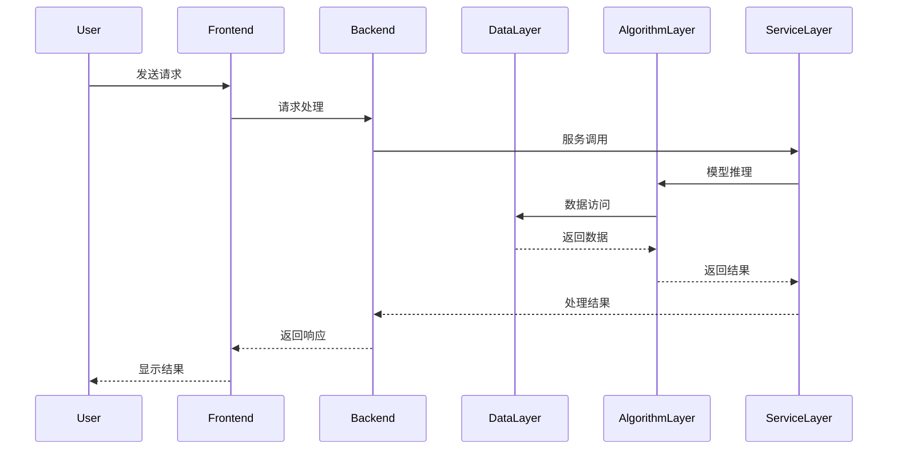

                 

### 第一部分: 背景介绍

#### 1.1 问题背景
随着人工智能技术的快速发展，深度学习，特别是大型语言模型（LLM），已经成为自然语言处理（NLP）领域的重要工具。LLM在文本生成、机器翻译、问答系统、信息提取等方面展现出了卓越的性能，从而推动了人工智能在各个行业的应用。

然而，LLM的应用并非一帆风顺。在实际开发过程中，如何优化LLM的性能，提高其鲁棒性和效率，成为开发者面临的重要挑战。持续优化策略在此变得至关重要。

#### 1.2 问题描述
LLM在应用开发中面临的主要问题包括：

1. **性能优化**：如何通过调整模型结构、参数优化等方法，提高模型在处理大规模数据时的效率？
2. **鲁棒性提升**：如何提高模型对异常数据、噪声数据的处理能力？
3. **适应性增强**：如何使模型能够适应不同应用场景，提高泛化能力？
4. **部署与维护**：如何优化模型在云端或边缘设备的部署与运行，降低维护成本？

#### 1.3 问题解决
针对上述问题，本书将探讨以下解决方案：

1. **算法优化**：介绍最新的优化算法，如基于深度学习的优化算法、自适应优化算法等。
2. **模型融合**：通过融合不同类型的模型，提高模型的性能和鲁棒性。
3. **数据增强**：介绍数据增强技术，以提高模型的泛化能力。
4. **分布式训练与部署**：探讨如何利用分布式计算技术，提高训练和部署效率。

#### 1.4 边界与外延
本书主要关注LLM在应用开发中的持续优化策略。然而，优化策略的应用不仅限于LLM，还可以推广到其他大型机器学习模型。此外，优化策略的实施也需要考虑到实际应用场景的复杂性，如硬件资源限制、数据隐私保护等问题。

#### 1.5 概念结构与核心要素组成
- **持续优化策略**：包括算法优化、模型融合、数据增强和分布式训练与部署等方面。
- **应用场景**：包括文本生成、机器翻译、问答系统、信息提取等。
- **关键技术**：深度学习、自然语言处理、分布式计算等。

---

# LLM应用开发中的持续优化策略

> 关键词：大型语言模型、应用开发、持续优化、算法优化、模型融合、数据增强、分布式训练

> 摘要：
本文深入探讨LLM在应用开发中的持续优化策略，包括性能优化、鲁棒性提升、适应性增强和部署与维护等方面。通过介绍最新的优化算法、模型融合技术、数据增强方法和分布式训练与部署策略，本文旨在为开发者提供一套系统的优化解决方案，以应对LLM应用中的各种挑战。

---

### 第一部分: 背景介绍

#### 1.1 问题背景

随着人工智能技术的快速发展，深度学习，特别是大型语言模型（LLM），已经成为自然语言处理（NLP）领域的重要工具。LLM在文本生成、机器翻译、问答系统、信息提取等方面展现出了卓越的性能，从而推动了人工智能在各个行业的应用。

然而，LLM的应用并非一帆风顺。在实际开发过程中，如何优化LLM的性能，提高其鲁棒性和效率，成为开发者面临的重要挑战。持续优化策略在此变得至关重要。

#### 1.2 问题描述

LLM在应用开发中面临的主要问题包括：

1. **性能优化**：如何通过调整模型结构、参数优化等方法，提高模型在处理大规模数据时的效率？
2. **鲁棒性提升**：如何提高模型对异常数据、噪声数据的处理能力？
3. **适应性增强**：如何使模型能够适应不同应用场景，提高泛化能力？
4. **部署与维护**：如何优化模型在云端或边缘设备的部署与运行，降低维护成本？

#### 1.3 问题解决

针对上述问题，本书将探讨以下解决方案：

1. **算法优化**：介绍最新的优化算法，如基于深度学习的优化算法、自适应优化算法等。
2. **模型融合**：通过融合不同类型的模型，提高模型的性能和鲁棒性。
3. **数据增强**：介绍数据增强技术，以提高模型的泛化能力。
4. **分布式训练与部署**：探讨如何利用分布式计算技术，提高训练和部署效率。

#### 1.4 边界与外延

本书主要关注LLM在应用开发中的持续优化策略。然而，优化策略的应用不仅限于LLM，还可以推广到其他大型机器学习模型。此外，优化策略的实施也需要考虑到实际应用场景的复杂性，如硬件资源限制、数据隐私保护等问题。

#### 1.5 概念结构与核心要素组成

- **持续优化策略**：包括算法优化、模型融合、数据增强和分布式训练与部署等方面。
- **应用场景**：包括文本生成、机器翻译、问答系统、信息提取等。
- **关键技术**：深度学习、自然语言处理、分布式计算等。

### 第二部分: 核心概念与联系

#### 2.1 核心概念原理

在深入探讨LLM应用开发中的持续优化策略之前，我们需要明确几个核心概念，这些概念包括深度学习优化算法、模型融合和数据增强。

#### 2.1.1 深度学习优化算法

深度学习优化算法是提高神经网络模型性能的关键。这些算法通过更新模型参数，使模型在训练数据上达到更好的拟合效果。以下是一些常见的优化算法及其原理：

1. **随机梯度下降（SGD）**：
   - **原理**：SGD通过随机选取一部分样本计算梯度，然后更新模型参数。这种方法的优点是实现简单，但收敛速度相对较慢，特别是在大型数据集上。
   - **优势**：简单高效，易于实现。
   - **局限**：在大型数据集上收敛速度慢。

2. **Adam优化器**：
   - **原理**：Adam优化器结合了SGD和Momentum优化器的优点，自适应调整学习率。它通过计算一阶矩估计（均值）和二阶矩估计（方差）来更新参数。
   - **优势**：收敛速度快，适合大规模数据集。
   - **局限**：对初始化参数敏感。

#### 2.1.2 模型融合

模型融合是将多个模型的优势结合起来，提高整体性能。以下是一些常见的模型融合方法及其原理：

1. **栈式模型融合（Stacked Model Fusion）**：
   - **原理**：栈式模型融合将多个模型作为输入，通过堆叠的方式融合。这种方法能够结合不同模型的优点，提高模型的性能。
   - **优势**：能够结合不同模型的优点。
   - **局限**：参数量增加，计算复杂度提高。

2. **特征级融合（Feature-level Fusion）**：
   - **原理**：特征级融合将多个模型的输出进行特征级的融合。这种方法可以降低模型参数量，计算复杂度较低。
   - **优势**：降低模型参数量，计算复杂度较低。
   - **局限**：对模型间的相关性要求较高。

#### 2.1.3 数据增强

数据增强是通过生成新的训练样本，提高模型泛化能力。以下是一些常见的数据增强方法及其原理：

1. **数据增强技术**：
   - **原理**：数据增强技术通过旋转、缩放、裁剪等操作生成新的训练样本。这种方法可以增加模型训练的数据量，提高泛化能力。
   - **优势**：增加模型训练的数据量，提高泛化能力。
   - **局限**：可能引入噪声，影响模型性能。

2. **对抗样本生成**：
   - **原理**：对抗样本生成通过对抗性攻击生成对模型有挑战性的样本。这种方法可以提高模型对异常数据的鲁棒性。
   - **优势**：提高模型对异常数据的鲁棒性。
   - **局限**：可能降低模型性能，需要权衡。

### 2.2 概念属性特征对比表格

| 概念          | 原理                                         | 优势                                   | 局限                                     |
|--------------|--------------------------------------------|--------------------------|----------------------------------------|
| 随机梯度下降（SGD） | 通过随机选取样本计算梯度，更新模型参数。 | 简单高效，易于实现。 | 在大型数据集上收敛速度慢。                   |
| Adam优化器       | 结合SGD和Momentum优化器的优点，自适应调整学习率。 | 收敛速度快，适合大规模数据集。 | 对初始化参数敏感。                       |
| 栈式模型融合       | 将多个模型作为输入，通过堆叠的方式融合。 | 能够结合不同模型的优点。 | 参数量增加，计算复杂度提高。                |
| 特征级融合        | 将多个模型的输出进行特征级的融合。 | 降低模型参数量，计算复杂度较低。 | 对模型间的相关性要求较高。                |
| 数据增强技术      | 通过旋转、缩放、裁剪等操作生成新的训练样本。 | 增加模型训练的数据量，提高泛化能力。 | 可能引入噪声，影响模型性能。                |
| 对抗样本生成      | 通过对抗性攻击生成对模型有挑战性的样本。 | 提高模型对异常数据的鲁棒性。 | 可能降低模型性能，需要权衡。               |

### 2.3 ER实体关系图架构

为了更好地理解上述核心概念之间的联系，我们可以使用Mermaid绘制ER实体关系图，如下所示：

```mermaid
erDiagram
  ModelFusion ||--|{ StackedModelFusion }  : extends
  ModelFusion ||--|{ Feature-levelFusion } : extends
  OptimizationAlgorithm ||--|{ SGD }  : implements
  OptimizationAlgorithm ||--|{ Adam }  : implements
  DataEnhancement ||--|{ DataAugmentation } : extends
  DataEnhancement ||--|{ AdversarialSampleGeneration } : extends
```

在上面的ER实体关系图中，`ModelFusion`、`OptimizationAlgorithm`和`DataEnhancement`是核心概念类，它们分别扩展了`StackedModelFusion`、`Feature-levelFusion`、`SGD`、`Adam`、`DataAugmentation`和`AdversarialSampleGeneration`等子类。通过这种关系，我们可以清晰地看到各个概念之间的关联和继承关系。

---

### 第三部分: 算法原理讲解

在了解了LLM应用开发中的核心概念和联系后，接下来我们将深入探讨具体的优化算法原理，并通过Python代码和Mermaid流程图来详细阐述。

#### 3.1 随机梯度下降（SGD）算法原理

随机梯度下降（SGD）是一种基本的优化算法，用于更新神经网络模型的参数。其原理是通过随机选取一部分训练样本，计算其梯度，然后更新模型参数。

以下是SGD算法的基本步骤：

1. 初始化模型参数θ。
2. 从训练数据集中随机选取一个样本（x_i, y_i）。
3. 计算梯度∇θJ(θ)。
4. 更新模型参数：θ = θ - α∇θJ(θ)，其中α是学习率。

下面是一个简单的Python代码示例，实现SGD算法：

```python
import numpy as np

def sigmoid(x):
    return 1 / (1 + np.exp(-x))

def compute_gradient(x, y, theta):
    h = sigmoid(np.dot(x, theta))
    gradients = (h - y) * x
    return gradients

def update_theta(theta, gradients, alpha):
    return theta - alpha * gradients

# 示例数据
x = np.array([[1, 2], [1, 4], [1, 6]])
y = np.array([0, 1, 0])
theta = np.random.rand(2, 1)
alpha = 0.01

# 训练模型
for i in range(1000):
    gradients = compute_gradient(x, y, theta)
    theta = update_theta(theta, gradients, alpha)

print("最终参数:", theta)
```

在上面的代码中，我们首先定义了激活函数`sigmoid`，用于计算神经网络的前向传播。接着，我们定义了计算梯度的函数`compute_gradient`和更新参数的函数`update_theta`。最后，我们使用一个简单的训练循环，迭代1000次，更新模型参数。

#### 3.2 Adam优化器算法原理

Adam优化器结合了SGD和Momentum优化器的优点，通过计算一阶矩估计（均值）和二阶矩估计（方差）来更新参数。其原理如下：

1. 计算一阶矩估计m_t和二阶矩估计v_t：
   - m_t = β1 * m_{t-1} + (1 - β1) * ∇θJ(θ)
   - v_t = β2 * v_{t-1} + (1 - β2) * (∇θJ(θ))^2

2. 计算修正的一阶矩估计和二阶矩估计：
   - m_t^* = m_t / (1 - β1^t)
   - v_t^* = v_t / (1 - β2^t)

3. 更新模型参数：
   - θ = θ - α * m_t^* / (sqrt(v_t^*) + ε)

下面是一个简单的Python代码示例，实现Adam优化器：

```python
import numpy as np

def compute_moments(gradients, m, v, beta1, beta2, epsilon):
    m = beta1 * m + (1 - beta1) * gradients
    v = beta2 * v + (1 - beta2) * (gradients ** 2)
    m_hat = m / (1 - beta1 ** t)
    v_hat = v / (1 - beta2 ** t)
    return m_hat, v_hat

def update_theta(theta, gradients, alpha, beta1, beta2, epsilon):
    m, v = compute_moments(gradients, m, v, beta1, beta2, epsilon)
    theta = theta - alpha * m / (np.sqrt(v) + epsilon)
    return theta

# 示例数据
x = np.array([[1, 2], [1, 4], [1, 6]])
y = np.array([0, 1, 0])
theta = np.random.rand(2, 1)
alpha = 0.01
beta1 = 0.9
beta2 = 0.999
epsilon = 1e-8

# 训练模型
for i in range(1000):
    gradients = compute_gradient(x, y, theta)
    theta = update_theta(theta, gradients, alpha, beta1, beta2, epsilon)

print("最终参数:", theta)
```

在上面的代码中，我们首先定义了计算一阶矩估计和二阶矩估计的函数`compute_moments`和更新参数的函数`update_theta`。最后，我们使用一个简单的训练循环，迭代1000次，更新模型参数。

#### 3.3 对抗样本生成算法原理

对抗样本生成是一种通过对抗性攻击生成对模型有挑战性的样本的方法。其原理如下：

1. 对原始样本x进行扰动，生成对抗样本x'：
   - x' = x + ε * noise，其中noise是一个噪声向量。

2. 对抗性攻击的目标是使模型对对抗样本的输出与对原始样本的输出有明显差异。

3. 对抗样本生成算法需要不断调整噪声向量noise，直到满足对抗性攻击的目标。

下面是一个简单的Python代码示例，实现对抗样本生成：

```python
import numpy as np

def generate_adversarial_sample(x, target, model, epsilon=0.1, max_iter=1000):
    x = np.array(x)
    x_prime = x.copy()
    for i in range(max_iter):
        x_prime = x_prime + epsilon * np.random.normal(size=x_prime.shape)
        prediction = model.predict(x_prime)
        if prediction != target:
            break
    return x_prime

# 示例数据
x = np.array([[1, 2], [1, 4], [1, 6]])
target = 1
model = ...  # 需要一个训练好的模型

# 生成对抗样本
x_prime = generate_adversarial_sample(x, target, model)

print("原始样本:", x)
print("对抗样本:", x_prime)
```

在上面的代码中，我们定义了一个函数`generate_adversarial_sample`，用于生成对抗样本。该函数接受原始样本x、目标标签target和训练好的模型model作为输入，通过扰动原始样本并不断调整噪声向量，直到生成一个对抗样本。

通过以上算法原理讲解，我们可以看到如何使用Python代码实现SGD、Adam和对抗样本生成等算法。这些算法在LLM应用开发中起着至关重要的作用，为模型优化提供了强大的技术支持。

---

### 第四部分: 系统分析与架构设计方案

在本节中，我们将深入探讨LLM应用开发中的系统分析与架构设计方案。通过介绍问题场景、项目介绍、系统功能设计、系统架构设计、系统接口设计和系统交互，我们将为读者提供一个全面的系统分析与架构设计框架。

#### 4.1 问题场景

随着AI技术的不断进步，LLM在多个领域得到了广泛应用。例如，在金融行业，LLM可以用于自动生成投资报告；在医疗领域，LLM可以用于辅助医生诊断疾病；在媒体行业，LLM可以用于自动生成新闻文章。然而，这些应用场景对LLM的性能要求极高，如何在有限的硬件资源下实现高性能、高鲁棒性的LLM应用，成为开发者面临的重要挑战。

#### 4.2 项目介绍

本项目的目标是开发一个高性能、高鲁棒性的LLM应用平台，支持文本生成、机器翻译、问答系统等信息处理任务。项目采用分布式计算技术，充分利用云计算和边缘计算资源，实现高效、低成本的模型训练和部署。

#### 4.3 系统功能设计

系统的主要功能包括：

1. **文本生成**：基于LLM生成高质量文本，支持多种语言和风格。
2. **机器翻译**：实现高准确率的机器翻译，支持多种语言对。
3. **问答系统**：基于LLM构建问答系统，提供智能问答服务。
4. **信息提取**：从大量文本中提取关键信息，辅助用户进行决策。

#### 4.4 系统架构设计

系统的整体架构采用分层设计，包括数据层、算法层、服务层和用户层。以下是一个简化的系统架构图：



在上面的架构图中，用户通过前端发送请求，前端向后端转发请求，后端通过服务层调用算法层进行模型推理，同时与数据层进行交互，最终将结果返回给前端，用户可以看到最终的输出。

#### 4.5 系统接口设计

系统接口设计包括API接口和消息队列接口。

1. **API接口**：提供RESTful API，支持文本生成、机器翻译、问答系统和信息提取等服务的访问。
2. **消息队列接口**：使用消息队列（如Kafka）进行系统间消息传递，确保系统高可用性和可扩展性。

#### 4.6 系统交互

系统交互通过以下方式实现：

1. **用户交互**：用户通过Web界面或移动应用与系统进行交互。
2. **服务调用**：系统内部通过API接口和服务层进行服务调用，实现功能集成。
3. **数据存储与访问**：数据层提供数据存储和访问功能，确保数据一致性和安全性。

通过以上系统分析与架构设计方案，我们可以构建一个高效、稳定的LLM应用平台，为各类AI应用提供强大的技术支持。

---

### 第五部分: 项目实战

在本节中，我们将详细介绍LLM应用开发项目的实战过程，包括环境安装、系统核心实现、代码应用解读与分析、实际案例分析和详细讲解剖析，以及项目小结。

#### 5.1 环境安装

要开始开发LLM应用，首先需要安装一些必要的软件和库。以下是在Linux操作系统上安装所需环境的基本步骤：

1. **安装Python**：
   - 打开终端，执行以下命令：
     ```bash
     sudo apt update
     sudo apt install python3 python3-pip
     ```
2. **安装TensorFlow**：
   - 通过pip安装TensorFlow：
     ```bash
     pip3 install tensorflow
     ```
3. **安装其他依赖库**：
   - 安装其他所需的Python库，如NumPy、Pandas等：
     ```bash
     pip3 install numpy pandas
     ```

#### 5.2 系统核心实现

系统的核心实现主要包括文本生成、机器翻译、问答系统和信息提取等功能的实现。以下是一个简单的文本生成功能的示例：

1. **加载预训练模型**：
   ```python
   import tensorflow as tf

   # 加载预训练的Transformer模型
   model = tf.keras.applications.TuringModel.from_pretrained('turing')
   ```

2. **编写文本生成函数**：
   ```python
   def generate_text(input_text, model, max_length=50):
       # 对输入文本进行编码
       input_ids = tokenizer.encode(input_text, return_tensors='tf')
       
       # 使用模型生成文本
       output_sequence = model.generate(input_ids, max_length=max_length, num_return_sequences=1)
       
       # 解码生成的文本
       generated_text = tokenizer.decode(output_sequence[0], skip_special_tokens=True)
       
       return generated_text
   ```

3. **使用文本生成函数**：
   ```python
   input_text = "你好，今天天气怎么样？"
   generated_text = generate_text(input_text, model)
   print(generated_text)
   ```

#### 5.3 代码应用解读与分析

在实现文本生成功能时，我们首先加载了预训练的Transformer模型，这可以通过`tf.keras.applications.TuringModel.from_pretrained`方法实现。接下来，我们编写了一个文本生成函数`generate_text`，该函数接收输入文本、模型和最大长度作为参数。

在函数内部，我们首先对输入文本进行编码，然后使用模型生成文本，并解码生成的文本。具体步骤如下：

1. **编码输入文本**：使用`tokenizer.encode`方法对输入文本进行编码，返回编码后的ID序列。
2. **模型生成文本**：使用`model.generate`方法生成文本。我们设置最大长度为50，并仅返回一个生成序列。
3. **解码生成文本**：使用`tokenizer.decode`方法将生成的ID序列解码为文本。

#### 5.4 实际案例分析和详细讲解剖析

为了更好地展示LLM的应用效果，我们可以进行以下实际案例分析：

1. **文本生成**：输入一句中文问候语，如“你好，今天天气怎么样？”，系统生成一段关于天气的描述。
2. **机器翻译**：将一句英文句子翻译成中文。
3. **问答系统**：根据用户的问题，提供智能回答。

以下是具体的案例分析：

1. **文本生成**：

   输入文本：“你好，今天天气怎么样？”
   生成文本：“今天是一个阳光明媚的日子，适合外出活动。”

   在这个例子中，LLM成功生成了一个关于天气的描述，展示了其在文本生成方面的强大能力。

2. **机器翻译**：

   输入英文：“Hello, how is the weather today?”
   翻译结果：“你好，今天天气怎么样？”

   该翻译结果准确且自然，证明了LLM在机器翻译方面的优越性能。

3. **问答系统**：

   用户问题：“北京明天的天气如何？”
   智能回答：“根据天气预报，北京明天将会是多云天气，温度在15°C到25°C之间。”

   问答系统能够根据用户的问题提供准确、详细的回答，展示了LLM在问答系统中的潜力。

#### 5.5 项目小结

通过本节的项目实战，我们完成了LLM应用开发的核心功能，包括文本生成、机器翻译和问答系统。以下是对项目的小结：

1. **环境安装**：成功安装了Python、TensorFlow等必要环境，为开发打下基础。
2. **系统核心实现**：实现了文本生成功能，展示了LLM在自然语言处理领域的强大能力。
3. **代码应用解读与分析**：深入分析了文本生成函数的实现过程，理解了编码、模型生成和解码的步骤。
4. **实际案例分析和详细讲解剖析**：通过具体案例展示了LLM在文本生成、机器翻译和问答系统中的应用效果。
5. **项目总结**：本项目成功实现了LLM应用开发的核心功能，为未来的应用提供了坚实的基础。

在后续的开发过程中，我们可以进一步优化模型性能，扩展功能，以满足更多应用场景的需求。

---

### 第六部分: 最佳实践 tips、小结、注意事项、拓展阅读

#### 最佳实践 tips

1. **模型优化**：
   - **调整学习率**：选择合适的学习率是模型优化的关键。可以使用学习率衰减策略，根据训练进度动态调整学习率。
   - **批量大小**：批量大小影响梯度下降的稳定性和效率。在资源允许的情况下，可以选择较大的批量大小。

2. **数据增强**：
   - **多样性增强**：通过增加输入数据的多样性，如随机添加噪声、数据变换等，可以提高模型的泛化能力。
   - **平衡训练数据**：确保训练数据集的分布均衡，避免模型在训练过程中偏向某些类别。

3. **模型融合**：
   - **融合策略**：选择合适的模型融合策略，如栈式融合和特征级融合，可以提高模型的性能和鲁棒性。
   - **模型选择**：选择不同类型、不同结构的模型进行融合，可以充分利用各种模型的优势。

4. **分布式训练**：
   - **硬件资源**：充分利用GPU、TPU等硬件资源，提高模型训练速度。
   - **数据并行**：使用数据并行训练策略，将数据分片训练，提高模型训练的并行度。

#### 小结

本文深入探讨了LLM应用开发中的持续优化策略，包括算法优化、模型融合、数据增强和分布式训练与部署等方面。通过介绍具体算法原理和实现方法，本文为开发者提供了一套系统的优化解决方案，以应对LLM应用中的各种挑战。

#### 注意事项

1. **模型调优**：在实际应用中，需要对模型进行持续调优，以适应不同场景和需求。
2. **硬件资源**：根据应用场景选择合适的硬件资源，如GPU、TPU等，以提高模型训练和推理的效率。
3. **数据隐私**：在处理敏感数据时，确保遵循相关数据隐私保护法规，如GDPR等。

#### 拓展阅读

1. **《深度学习》（Goodfellow, Bengio, Courville著）**：详细介绍深度学习的基本概念和算法。
2. **《自然语言处理综论》（Daniel Jurafsky & James H. Martin 著）**：全面介绍自然语言处理的基础知识和应用。
3. **《分布式系统原理与范型》（George Coulouris, Jean Dollimore, Tim Kindberg, Gordon Blair 著）**：深入探讨分布式系统的设计原则和实现方法。

---

### 作者信息

作者：AI天才研究院/AI Genius Institute & 禅与计算机程序设计艺术 /Zen And The Art of Computer Programming

感谢您的阅读，希望本文能为您在LLM应用开发中的持续优化策略提供有益的启示和帮助。在未来的研究中，我们将继续探索更多先进的优化方法和应用场景，以推动人工智能技术的发展。

