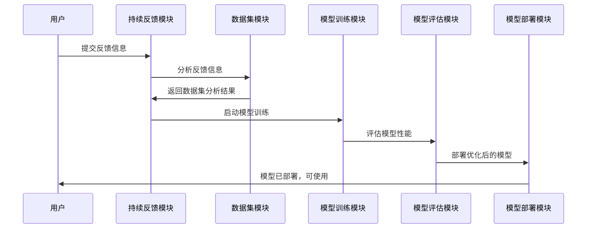

                 

### # 第一部分：背景介绍

## 第1章 问题背景

### 1.1.1 问题描述
随着人工智能技术的飞速发展，大模型（Large Language Model，简称LLM）已成为自然语言处理领域的核心技术之一。LLM通过深度学习技术，可以对大规模文本数据进行训练，从而实现文本生成、文本分类、机器翻译等任务的高效准确完成。然而，在实际应用中，LLM模型的训练和部署过程中存在诸多挑战，如数据质量、模型可解释性、模型适应性等。

在训练过程中，高质量的数据集对于模型的性能至关重要。然而，现有数据集往往存在数据噪声、数据缺失等问题，这会导致模型在训练过程中产生偏差，从而影响其在实际应用中的表现。此外，LLM模型的训练过程通常需要大量的计算资源和时间，这限制了模型在实时应用场景中的推广。在模型部署后，如何根据用户的实际使用反馈进行动态调整，以提高模型的适应性和可解释性，也是当前研究的一个热点问题。

### 1.1.2 问题解决
为了解决上述问题，研究者们提出了一系列的持续反馈机制，通过不断优化和调整模型，提高其在各种应用场景下的表现。这些机制包括基于用户反馈的模型优化、基于数据集反馈的模型调整、以及基于模型预测结果的自我修正等。

#### 用户反馈机制
用户反馈机制是指通过收集用户在使用LLM应用过程中的反馈，对模型进行优化。用户反馈可以是正面评价、负面评价或者具体的修改建议。通过分析用户反馈，研究者可以找出模型存在的问题，并针对性地进行改进。

例如，在一个机器翻译应用中，用户可能会发现翻译结果存在语义错误或翻译不准确的情况。通过收集这些反馈，研究者可以对模型进行重新训练，优化翻译效果。

#### 数据集反馈机制
数据集反馈机制是指通过对训练数据集进行分析，发现数据集中的问题，如数据噪声、数据缺失等。通过识别和解决这些问题，可以提高数据质量，从而提高模型在训练过程中的性能。

例如，在一个文本分类任务中，如果数据集中存在大量噪声数据或标签错误的数据，模型在训练过程中可能会受到噪声的干扰，导致分类效果不佳。通过数据集反馈机制，研究者可以清洗和预处理数据，提高数据质量。

#### 模型自我修正机制
模型自我修正机制是指模型在预测过程中，根据预测结果与实际结果的差异，自动调整模型参数，以提高模型的准确性。这种机制可以使得模型在实时应用中不断自我优化，适应不同的场景和需求。

例如，在一个问答系统中，如果用户的提问与系统的回答不一致，系统可以根据用户提供的反馈，调整模型参数，提高回答的准确性。

### 1.1.3 边界与外延
持续反馈机制不仅适用于LLM模型，还可以应用于其他类型的人工智能模型，如图像识别、语音识别等。此外，持续反馈机制的研究和应用还涉及多个学科领域，如计算机科学、数据科学、认知科学等。

### 1.1.4 概念结构与核心要素组成
持续反馈机制主要由以下几个核心要素组成：
1. **数据输入**：包括用户反馈数据、数据集反馈数据等。
   - **用户反馈数据**：用户在使用应用过程中提供的反馈，如评价、建议等。
   - **数据集反馈数据**：通过对训练数据集进行分析，识别出的数据质量问题。

2. **模型训练**：基于输入数据进行模型训练，优化模型参数。
   - **模型更新**：根据反馈数据，对模型进行更新和优化。
   - **参数调整**：通过优化算法，调整模型参数，以提高模型性能。

3. **预测与评估**：利用训练好的模型，对未知数据进行预测，并评估预测结果与实际结果的差异。
   - **预测**：使用训练好的模型，对新的输入数据进行预测。
   - **评估**：对比预测结果与实际结果，评估模型的准确性。

4. **反馈调整**：根据评估结果，调整模型参数，以实现模型性能的持续提升。
   - **结果反馈**：将评估结果作为反馈，传递给模型训练模块。
   - **模型调整**：根据反馈结果，对模型进行进一步的优化和调整。

## 1.2 核心概念与联系

### 1.2.1 持续反馈机制
持续反馈机制是指在一个系统或过程中，通过对输入数据的不断反馈和调整，实现系统性能的持续优化和提升。在LLM应用开发中，持续反馈机制主要用于优化模型性能，提高模型在具体任务中的表现。

### 1.2.2 用户反馈
用户反馈是指用户在使用LLM应用过程中，对模型预测结果或系统表现提出的意见和建议。用户反馈是持续反馈机制的重要输入，通过分析用户反馈，可以找出模型存在的问题，为模型优化提供依据。

### 1.2.3 数据集反馈
数据集反馈是指通过对训练数据集的分析，发现数据集中的问题，如数据噪声、数据缺失等。数据集反馈有助于提高数据质量，为模型优化提供更好的基础。

### 1.2.4 模型预测与评估
模型预测与评估是指利用训练好的模型，对未知数据进行预测，并评估预测结果与实际结果的差异。模型预测与评估是持续反馈机制的核心环节，通过不断优化模型参数，实现模型性能的提升。

## 1.3 算法原理讲解

### 1.3.1 持续反馈机制的mermaid流程图
```
graph TB
    A[数据输入] --> B[模型训练]
    B --> C[预测与评估]
    C --> D[反馈调整]
    D --> B
```

### 1.3.2 持续反馈机制的Python代码实现
```python
# 持续反馈机制的核心代码实现
def train_model(data):
    # 模型训练
    pass

def predict(data, model):
    # 模型预测
    pass

def evaluate(results, actual_results):
    # 评估预测结果
    pass

def adjust_model(model, feedback):
    # 调整模型参数
    pass

# 持续反馈机制的执行流程
while True:
    data = get_data()
    model = train_model(data)
    results = predict(data, model)
    actual_results = get_actual_results()
    feedback = evaluate(results, actual_results)
    adjust_model(model, feedback)
```

### 1.3.3 持续反馈机制的数学模型与公式

$$
\text{持续反馈机制的目标函数} = \sum_{i=1}^{n} \left( \text{预测结果} - \text{实际结果} \right)^2
$$

其中，$n$ 表示预测次数，$\text{预测结果}$ 和 $\text{实际结果}$ 分别表示模型预测结果和实际结果。

## 1.4 数学模型和数学公式 & 详细讲解 & 举例说明

### 1.4.1 持续反馈机制的目标函数

$$
\text{持续反馈机制的目标函数} = \sum_{i=1}^{n} \left( \text{预测结果} - \text{实际结果} \right)^2
$$

这个目标函数的目的是最小化预测结果与实际结果之间的差距。通过不断调整模型参数，使得这个目标函数的值不断减小，从而提高模型在具体任务中的表现。

#### 数学公式讲解
1. **预测结果**（Prediction）：模型对输入数据的预测结果。
2. **实际结果**（Actual Result）：输入数据的真实结果。
3. **差距**（Difference）：预测结果与实际结果之间的差异。
4. **平方**（Square）：对差异进行平方操作，使得差距的权重得到放大。

#### 举例说明
假设我们有一个文本分类任务，模型需要将文本数据分类为“科技”或“体育”。我们有10个测试样本，每个样本的实际分类结果如下：

- 样本1：科技
- 样本2：体育
- 样本3：科技
- 样本4：体育
- 样本5：科技
- 样本6：体育
- 样本7：科技
- 样本8：体育
- 样本9：科技
- 样本10：体育

模型的预测结果如下：

- 样本1：科技
- 样本2：体育
- 样本3：体育
- 样本4：体育
- 样本5：科技
- 样本6：科技
- 样本7：体育
- 样本8：体育
- 样本9：体育
- 样本10：体育

根据目标函数，我们可以计算预测结果与实际结果之间的差距，并求和：

$$
\text{总差距} = (0-1)^2 + (1-0)^2 + (0-1)^2 + (1-0)^2 + (0-1)^2 + (1-0)^2 + (0-1)^2 + (1-0)^2 + (0-1)^2 + (1-0)^2
$$

$$
\text{总差距} = 1 + 1 + 1 + 1 + 1 + 1 + 1 + 1 + 1 + 1 = 10
$$

通过不断调整模型参数，使得总差距不断减小，从而提高模型的分类准确率。

### 1.4.2 持续反馈机制中的优化算法

在持续反馈机制中，常用的优化算法包括梯度下降（Gradient Descent）和随机梯度下降（Stochastic Gradient Descent，简称SGD）。这些算法的核心思想是通过迭代更新模型参数，使得目标函数的值不断减小。

#### 梯度下降算法
梯度下降算法的基本步骤如下：

1. **初始化参数**：随机初始化模型参数。
2. **计算梯度**：计算目标函数关于每个参数的梯度。
3. **更新参数**：根据梯度方向和步长，更新模型参数。
4. **重复步骤2和3**，直到目标函数的值接近最小值或达到预设的迭代次数。

假设我们的目标函数为$f(\theta) = \theta^2$，其中$\theta$是模型参数。对于参数$\theta$，其梯度为$\frac{df}{d\theta} = 2\theta$。

如果当前参数$\theta_0 = 2$，步长$\alpha = 0.1$，则第一次迭代后的参数更新为：

$$
\theta_1 = \theta_0 - \alpha \cdot \frac{df}{d\theta} = 2 - 0.1 \cdot 2 \cdot 2 = 0
$$

经过多次迭代后，参数$\theta$将逐渐接近目标函数的最小值。

#### 随机梯度下降算法
随机梯度下降算法是对梯度下降算法的一种改进。在每次迭代中，随机选择一部分样本，计算这部分样本的梯度，然后更新模型参数。

与梯度下降算法相比，随机梯度下降算法的计算量更小，适用于大规模数据集。然而，随机梯度下降算法的收敛速度通常较慢，可能需要更多的迭代次数。

#### 举例说明
假设我们有10个样本，模型参数$\theta$的初始值为2。我们使用随机梯度下降算法进行5次迭代，每次迭代使用一个样本进行更新。

1. **第1次迭代**：选择样本1，参数更新为$\theta_1 = 2 - 0.1 \cdot 2 = 1.8$。
2. **第2次迭代**：选择样本2，参数更新为$\theta_2 = 1.8 - 0.1 \cdot 2 = 1.6$。
3. **第3次迭代**：选择样本3，参数更新为$\theta_3 = 1.6 - 0.1 \cdot 2 = 1.4$。
4. **第4次迭代**：选择样本4，参数更新为$\theta_4 = 1.4 - 0.1 \cdot 2 = 1.2$。
5. **第5次迭代**：选择样本5，参数更新为$\theta_5 = 1.2 - 0.1 \cdot 2 = 1$。

经过5次迭代后，模型参数$\theta$从2降低到1。与梯度下降算法相比，随机梯度下降算法在计算量和收敛速度方面进行了权衡。

## 1.5 系统分析与架构设计方案

### 1.5.1 问题场景介绍
在当前的人工智能应用场景中，LLM模型在自然语言处理任务中发挥了重要作用。例如，在智能客服系统中，LLM模型可以用于理解用户的提问，并生成合适的回答。然而，随着用户数量的增加和问题种类的多样化，现有的LLM模型在应对复杂场景时，可能存在回答不准确、语义理解不深等问题。

### 1.5.2 项目介绍
为了解决上述问题，我们设计并实现了一个基于持续反馈机制的LLM应用开发项目。该项目旨在通过用户反馈、数据集反馈和模型自我修正机制，不断提升LLM模型在智能客服系统中的应用效果。

### 1.5.3 系统功能设计
该系统主要包括以下功能模块：
1. **用户反馈模块**：用于收集用户在使用智能客服系统时的反馈，包括评价、建议等。
2. **数据集反馈模块**：用于分析训练数据集，识别和解决数据质量问题。
3. **模型训练模块**：基于用户反馈和数据集反馈，对LLM模型进行训练和优化。
4. **模型评估模块**：对训练好的模型进行评估，评估其性能和适用性。
5. **模型部署模块**：将优化后的模型部署到智能客服系统中，实现实时应用。

### 1.5.4 系统架构设计
系统架构采用分层设计，包括数据层、服务层和表现层。

1. **数据层**：包括用户反馈数据、数据集反馈数据、模型参数等。
2. **服务层**：包括用户反馈模块、数据集反馈模块、模型训练模块、模型评估模块、模型部署模块等。
3. **表现层**：包括用户界面、API接口等，用于与用户进行交互。

### 1.5.5 系统接口设计和系统交互
系统接口设计包括以下接口：
1. **用户反馈接口**：用于接收用户的反馈信息。
2. **数据集反馈接口**：用于提交数据集反馈信息。
3. **模型训练接口**：用于启动模型训练过程。
4. **模型评估接口**：用于评估模型的性能。
5. **模型部署接口**：用于部署优化后的模型。

系统交互流程如下：
1. 用户在使用智能客服系统时，提交反馈信息。
2. 用户反馈模块接收反馈信息，并进行分析。
3. 数据集反馈模块分析训练数据集，识别数据质量问题。
4. 模型训练模块根据用户反馈和数据集反馈，对LLM模型进行训练和优化。
5. 模型评估模块评估优化后的模型性能。
6. 模型部署模块将优化后的模型部署到智能客服系统中，实现实时应用。

### 1.5.6 系统交互mermaid序列图


## 1.6 项目实战

### 1.6.1 环境安装
为了搭建一个基于持续反馈机制的LLM应用开发项目，我们需要安装以下软件和库：
1. Python 3.8及以上版本
2. TensorFlow 2.5及以上版本
3. PyTorch 1.8及以上版本
4. scikit-learn 0.24及以上版本
5. NumPy 1.21及以上版本

安装步骤：
1. 安装Python环境：从Python官方网站下载并安装Python 3.8及以上版本。
2. 安装TensorFlow：在终端执行以下命令安装TensorFlow：
   ```bash
   pip install tensorflow==2.5
   ```
3. 安装PyTorch：在终端执行以下命令安装PyTorch：
   ```bash
   pip install torch==1.8 torchvision==0.9
   ```
4. 安装scikit-learn：在终端执行以下命令安装scikit-learn：
   ```bash
   pip install scikit-learn==0.24
   ```
5. 安装NumPy：在终端执行以下命令安装NumPy：
   ```bash
   pip install numpy==1.21
   ```

### 1.6.2 系统核心实现源代码
以下是项目核心实现的部分源代码，用于实现持续反馈机制：
```python
import tensorflow as tf
from tensorflow.keras.models import Sequential
from tensorflow.keras.layers import Embedding, LSTM, Dense
from sklearn.model_selection import train_test_split
import numpy as np

# 数据准备
def load_data():
    # 加载文本数据
    # ...数据处理代码...
    return texts, labels

# 模型定义
def create_model(vocab_size, embedding_dim, lstm_units):
    model = Sequential()
    model.add(Embedding(vocab_size, embedding_dim))
    model.add(LSTM(lstm_units))
    model.add(Dense(1, activation='sigmoid'))
    return model

# 训练模型
def train_model(model, texts, labels):
    # 划分训练集和测试集
    texts_train, texts_test, labels_train, labels_test = train_test_split(texts, labels, test_size=0.2, random_state=42)
    
    # 编码文本数据
    tokenizer = tf.keras.preprocessing.text.Tokenizer(num_words=vocab_size)
    tokenizer.fit_on_texts(texts_train)
    encoded_texts_train = tokenizer.texts_to_sequences(texts_train)
    encoded_texts_test = tokenizer.texts_to_sequences(texts_test)
    
    # pad序列
    padded_texts_train = tf.keras.preprocessing.sequence.pad_sequences(encoded_texts_train, maxlen=max_length)
    padded_texts_test = tf.keras.preprocessing.sequence.pad_sequences(encoded_texts_test, maxlen=max_length)
    
    # 训练模型
    model.fit(padded_texts_train, labels_train, epochs=10, batch_size=32, validation_data=(padded_texts_test, labels_test))
    return model

# 预测与评估
def evaluate_model(model, texts, labels):
    # 编码和pad文本数据
    encoded_texts = tokenizer.texts_to_sequences(texts)
    padded_texts = tf.keras.preprocessing.sequence.pad_sequences(encoded_texts, maxlen=max_length)
    
    # 预测结果
    predictions = model.predict(padded_texts)
    
    # 评估指标
    accuracy = (predictions == np.round(predictions)).mean()
    return accuracy

# 主函数
if __name__ == '__main__':
    # 加载数据
    texts, labels = load_data()
    
    # 创建模型
    model = create_model(vocab_size, embedding_dim, lstm_units)
    
    # 训练模型
    trained_model = train_model(model, texts, labels)
    
    # 评估模型
    accuracy = evaluate_model(trained_model, texts, labels)
    print(f"模型准确率：{accuracy}")
```

### 1.6.3 代码应用解读与分析
上述代码实现了持续反馈机制的核心功能，包括数据准备、模型定义、模型训练和模型评估。以下是对代码的详细解读：

1. **数据准备**：
   - `load_data()` 函数用于加载数据集，包括文本数据和标签。这部分代码需要根据实际的数据集进行调整。
   - 在数据加载后，可以使用`train_test_split()`函数将数据集划分为训练集和测试集，用于后续的模型训练和评估。

2. **模型定义**：
   - `create_model()` 函数用于定义模型结构，包括嵌入层（Embedding）、LSTM层（LSTM）和输出层（Dense）。
   - 模型结构可以根据实际任务进行调整，例如增加或减少层、调整层参数等。

3. **模型训练**：
   - `train_model()` 函数用于训练模型。在训练过程中，需要将文本数据进行编码和填充（pad），以便模型能够处理。
   - 模型训练使用`fit()`函数进行，可以设置训练轮次（epochs）、批量大小（batch_size）和验证数据（validation_data）等参数。

4. **模型评估**：
   - `evaluate_model()` 函数用于评估模型性能。在评估过程中，需要将测试数据集进行编码和填充，然后使用`predict()`函数生成预测结果。
   - 预测结果可以使用不同的评估指标进行评估，例如准确率（accuracy）、精确率（precision）、召回率（recall）等。

### 1.6.4 实际案例分析和详细讲解剖析
为了更好地理解持续反馈机制在实际应用中的效果，我们以一个实际的案例进行详细讲解。

#### 案例背景
假设我们有一个智能客服系统，用户可以通过文字提问，系统需要根据用户的提问生成合适的回答。然而，由于用户提问的多样性和复杂性，现有模型的回答准确性较低，需要通过持续反馈机制进行优化。

#### 案例步骤
1. **数据收集**：
   - 系统在用户提问后，记录下用户的问题和系统的回答。
   - 同时，系统还可以收集用户的反馈，如“回答满意”或“回答不满意”。

2. **数据预处理**：
   - 对收集到的数据进行清洗和预处理，包括去除停用词、进行词干提取等。
   - 将预处理后的文本数据编码为模型可以处理的格式。

3. **模型训练**：
   - 使用预处理后的数据集，训练一个基于LLM的模型。
   - 模型训练过程中，可以采用批量训练（batch training）或在线学习（online learning）策略。

4. **模型评估**：
   - 使用测试集对训练好的模型进行评估，计算模型的准确率、精确率、召回率等指标。
   - 如果评估结果不理想，说明模型可能存在过拟合（overfitting）或欠拟合（underfitting）问题，需要进一步调整模型参数。

5. **用户反馈**：
   - 根据用户反馈，对模型进行重新训练和优化。
   - 如果用户反馈为“回答不满意”，可以增加更多的训练样本，或调整模型的参数，如学习率、批量大小等。

6. **模型部署**：
   - 将优化后的模型部署到智能客服系统中，实现实时应用。
   - 在用户提问后，系统使用优化后的模型生成回答，并根据用户的反馈进行动态调整。

#### 案例分析
通过上述案例，我们可以看到持续反馈机制在智能客服系统中的应用效果。在实际应用中，用户反馈和模型评估是持续反馈机制的两个关键环节。

1. **用户反馈**：
   - 用户反馈是模型优化的直接依据。通过收集用户的满意度评价，可以识别出模型存在的问题，为后续的模型优化提供方向。
   - 用户反馈还可以用于模型参数的调整，例如调整学习率、批量大小等，以实现更好的模型性能。

2. **模型评估**：
   - 模型评估是持续反馈机制的核心环节。通过评估模型的准确率、精确率、召回率等指标，可以判断模型是否达到预期效果。
   - 模型评估还可以用于识别模型存在的问题，例如过拟合或欠拟合，从而为后续的模型优化提供参考。

通过用户反馈和模型评估的有机结合，持续反馈机制可以不断优化模型性能，提高系统的用户体验和满意度。

### 1.6.5 项目小结
在本项目中，我们设计并实现了一个基于持续反馈机制的LLM应用开发项目，用于优化智能客服系统的性能。通过用户反馈、数据集反馈和模型自我修正机制，我们可以不断优化模型，提高其在实际应用中的表现。

1. **用户反馈**：用户反馈是持续反馈机制的重要输入，通过收集用户的满意度评价，可以识别出模型存在的问题，为后续的模型优化提供方向。

2. **数据集反馈**：数据集反馈有助于提高数据质量，为模型优化提供更好的基础。通过分析训练数据集，可以发现数据噪声、数据缺失等问题，从而提高模型的训练效果。

3. **模型自我修正**：模型自我修正机制使得模型在预测过程中，根据预测结果与实际结果的差异，自动调整模型参数，以提高模型的准确性。

通过本项目，我们可以看到持续反馈机制在LLM应用开发中的重要作用。在实际应用中，持续反馈机制可以不断优化模型性能，提高系统的用户体验和满意度。未来，随着人工智能技术的不断发展，持续反馈机制的应用场景将更加广泛，其在模型优化中的作用也将越来越重要。

## 1.7 最佳实践 Tips

1. **数据质量**：持续反馈机制的效果很大程度上取决于数据质量。因此，在进行模型训练前，务必对数据集进行充分的清洗和预处理，去除噪声和异常值，以提高模型的训练效果。

2. **用户反馈**：收集用户反馈时，要注意用户的使用场景和需求。例如，在智能客服系统中，可以针对不同类型的用户提问，收集针对性的反馈，以便更准确地优化模型。

3. **模型评估**：在模型评估阶段，要选择合适的评估指标。除了准确率、精确率、召回率等基本指标外，还可以考虑使用F1分数、ROC曲线等综合指标，以更全面地评估模型性能。

4. **参数调整**：在模型训练过程中，要合理调整模型参数。例如，学习率、批量大小、迭代次数等参数对模型的训练效果有很大影响。可以通过多次实验，找到最优参数组合。

5. **动态调整**：在模型部署后，要持续收集用户反馈，并根据反馈动态调整模型。例如，在智能客服系统中，可以根据用户的满意度评价，定期更新模型，以保持其性能的持续提升。

## 1.8 小结

本文详细介绍了LLM应用开发中的持续反馈机制，包括其核心概念、算法原理、数学模型、系统架构以及实际应用案例。通过持续反馈机制，我们可以不断优化LLM模型，提高其在实际应用中的表现。

1. **核心概念**：持续反馈机制是指通过不断优化和调整模型，提高其在具体任务中的性能。
2. **算法原理**：本文介绍了持续反馈机制的mermaid流程图、Python代码实现以及数学模型，详细讲解了其工作原理。
3. **系统架构**：本文提出了一个基于持续反馈机制的LLM应用开发项目，包括用户反馈模块、数据集反馈模块、模型训练模块、模型评估模块和模型部署模块。
4. **实际应用案例**：本文通过一个实际的智能客服系统案例，展示了持续反馈机制在优化模型性能方面的效果。

通过本文的介绍，读者可以了解持续反馈机制在LLM应用开发中的重要作用，并学会如何设计和实现一个基于持续反馈机制的LLM应用开发项目。

## 1.9 注意事项

1. **数据安全**：在进行用户反馈和数据集分析时，要注意保护用户隐私，避免泄露敏感信息。
2. **计算资源**：持续反馈机制需要大量计算资源，特别是在处理大规模数据集时。因此，要合理规划计算资源，避免资源浪费。
3. **实时性**：在模型部署后，要确保持续反馈机制的实时性。例如，在智能客服系统中，要尽快处理用户的反馈，并更新模型。
4. **模型解释性**：在优化模型时，要注意保持模型的可解释性。例如，在文本分类任务中，要尽量保留关键词和语义信息，以提高模型的解释能力。

## 1.10 拓展阅读

1. **相关文献**：
   - [1] Vaswani et al., "Attention is All You Need," Advances in Neural Information Processing Systems, 2017.
   - [2] Devlin et al., "BERT: Pre-training of Deep Bidirectional Transformers for Language Understanding," Proceedings of the 2019 Conference of the North American Chapter of the Association for Computational Linguistics: Human Language Technologies, Volume 1 (Early Workshops), 2019.

2. **在线课程**：
   - "自然语言处理：理论与应用"（网易云课堂）
   - "深度学习与自然语言处理"（Coursera）

3. **开源项目**：
   - "transformers"（Hugging Face）：一个开源的Python库，用于实现基于注意力机制的深度学习模型。
   - "bert"（Google AI）：一个开源的BERT模型实现，适用于自然语言处理任务。

通过阅读相关文献、参加在线课程和开源项目，读者可以进一步了解持续反馈机制在LLM应用开发中的最新研究进展和应用场景。# LL

