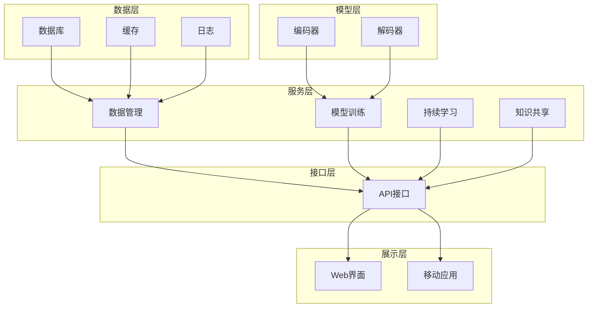
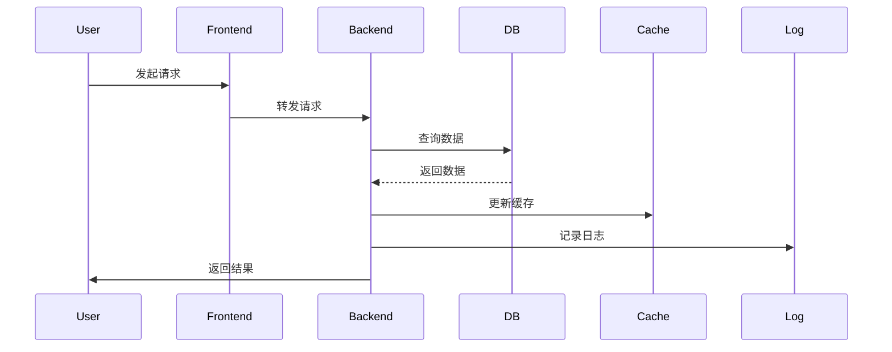

                 

### 第一部分：背景介绍

#### 1.1 问题背景

在当今社会，随着人工智能技术的飞速发展，大型语言模型（LLM）的应用越来越广泛。LLM在自然语言处理、问答系统、机器翻译、文本生成等方面取得了显著的成果。然而，如何对LLM进行持续学习和知识共享，以适应不断变化的应用需求，成为了一个亟待解决的问题。

随着互联网的普及和大数据技术的发展，海量的文本数据不断涌现。这些数据不仅包含了丰富的语言信息，还反映了社会的多样性和复杂性。为了更好地利用这些数据，LLM应运而生。LLM是一种基于深度学习技术的大型语言模型，能够对文本数据进行高效的处理和分析，从而为各种应用场景提供强大的支持。

然而，LLM的应用并非一蹴而就。在实际应用中，LLM需要不断地学习和适应新的环境和任务。这就涉及到了持续学习的问题。持续学习是指LLM在应用过程中，通过不断地吸收新的数据和信息，更新模型参数，提高模型性能的过程。通过持续学习，LLM能够更好地适应不同的应用场景，提供更加准确和有效的服务。

此外，知识共享也是LLM应用中的一个重要问题。知识共享是指在不同LLM之间，或者LLM与其他知识源之间，传递和共享知识的过程。随着LLM应用场景的多样化，不同LLM之间可能存在大量的重复知识。通过知识共享，可以有效地整合和利用这些知识资源，提高LLM的应用价值。

总的来说，持续学习和知识共享是LLM应用开发中的关键问题。持续学习确保了LLM能够不断适应新的环境，提高模型性能；知识共享则有助于优化LLM的应用效果，提升整体价值。因此，如何有效地实现持续学习和知识共享，成为了LLM应用开发中的重要研究方向。

#### 1.2 问题描述

持续学习与知识共享是LLM应用开发中的关键问题。持续学习旨在使LLM能够不断吸收新的知识，提高其适应性和准确性；知识共享则涉及如何有效地整合和利用已有的知识资源，以优化LLM的性能。这两个问题的解决，对于提升LLM的应用价值具有重要意义。

首先，持续学习问题。LLM在应用过程中，需要不断地更新和优化模型参数，以适应新的数据和任务。然而，如何选择合适的数据，如何设计有效的学习算法，以及如何避免过拟合等问题，都是需要深入研究的。此外，持续学习还面临着数据质量、计算资源等挑战，如何有效地应对这些挑战，也是需要解决的问题。

其次，知识共享问题。随着LLM应用场景的多样化，不同LLM之间可能存在大量的重复知识。如何有效地提取和共享这些知识，如何将不同来源的知识进行整合，以及如何避免知识冗余和冲突等问题，都是需要深入探讨的。此外，知识共享还需要考虑安全性、隐私性等问题，以确保知识的有效利用和合法合规。

这两个问题的解决，将有助于提升LLM的应用价值。通过持续学习，LLM能够更好地适应新的环境和任务，提高模型性能；通过知识共享，LLM能够有效地整合和利用已有的知识资源，提高整体应用效果。因此，如何有效地实现持续学习和知识共享，是LLM应用开发中的一个重要研究方向。

#### 1.3 问题解决

为了解决上述问题，本书将从以下几个方面展开讨论：

1. **核心概念介绍**：首先介绍LLM、持续学习、知识共享等核心概念，阐述其定义、特点和应用场景。通过核心概念介绍，使读者对LLM及其相关概念有更深入的理解，为后续讨论打下基础。

2. **算法原理讲解**：详细讲解LLM的算法原理，包括其训练过程、优化策略和评估方法。通过算法原理讲解，使读者对LLM的工作原理有更清晰的认识，为后续应用开发提供技术支持。

3. **系统分析与架构设计**：分析LLM应用开发中的系统架构，设计合理的系统方案，包括功能设计、接口设计和交互设计。通过系统分析与架构设计，使读者对LLM应用开发的整体流程有更全面的了解，为实际应用提供指导。

4. **项目实战**：通过实际案例，展示如何应用LLM进行持续学习和知识共享，并提供详细的代码实现和分析。通过项目实战，使读者能够将理论知识应用到实际项目中，提升实际操作能力。

5. **最佳实践与拓展**：总结LLM应用开发中的最佳实践，讨论未来发展趋势和拓展方向。通过最佳实践与拓展，使读者能够更好地应对实际应用中的挑战，为未来的发展提供参考。

通过上述几个方面的讨论，本书旨在为LLM应用开发中的持续学习和知识共享问题提供系统性的解决方案，推动LLM技术的实际应用和发展。

#### 1.4 边界与外延

本书主要关注LLM在应用开发中的持续学习和知识共享问题，不包括LLM的理论研究和技术细节。同时，本书将侧重于实际应用，而非纯粹的理论探讨。

具体来说，本书的边界包括：

1. **技术范围**：本书主要关注LLM在自然语言处理、问答系统、机器翻译等应用场景中的持续学习和知识共享问题，不涉及其他领域的技术。

2. **理论深度**：本书将重点介绍LLM的算法原理和应用方法，不涉及过于复杂和深奥的理论研究。

3. **实际应用**：本书将通过实际案例，展示如何应用LLM进行持续学习和知识共享，不涉及具体的技术实现细节。

本书的外延包括：

1. **应用领域**：虽然本书主要关注自然语言处理等应用场景，但LLM的持续学习和知识共享原理和方法可以应用于其他领域，如图像处理、语音识别等。

2. **理论拓展**：虽然本书不涉及复杂的理论研究，但读者可以根据本书的内容，进一步探索LLM的理论基础和发展趋势。

3. **实践应用**：虽然本书将展示实际案例，但读者可以根据本书的指导，结合自己的实际情况，进行个性化的应用和实践。

通过明确边界与外延，本书旨在为LLM应用开发中的持续学习和知识共享问题提供有针对性的解决方案，推动LLM技术的实际应用和发展。

#### 1.5 概念结构与核心要素组成

在LLM应用开发中，持续学习和知识共享是两个核心问题，它们相互关联，共同影响着LLM的性能和应用价值。为了更好地理解这两个问题，我们可以从以下几个核心概念和要素出发：

1. **LLM（大型语言模型）**：LLM是本书的核心研究对象，是一种基于深度学习技术的大型语言模型。它通过对大规模语料进行训练，学习语言模式和知识，实现对自然语言的理解和生成。LLM具有规模巨大、灵活性高和适应性强等特点。

2. **持续学习**：持续学习是指LLM在应用过程中，不断吸收新的知识，更新模型参数，提高模型性能的过程。持续学习旨在使LLM能够适应不断变化的应用需求，提高其准确性和适应性。在持续学习过程中，数据质量、学习算法和模型更新策略是关键要素。

3. **知识共享**：知识共享是指在不同LLM之间，或者LLM与其他知识源之间，传递和共享知识的过程。知识共享有助于整合和利用已有的知识资源，优化LLM的性能。知识共享过程中，知识提取、知识融合和应用是关键要素。

4. **数据源**：数据源是持续学习和知识共享的基础。高质量的数据源能够为LLM提供丰富的语言信息，有助于提高模型的性能和应用价值。

5. **计算资源**：计算资源是持续学习和知识共享的重要保障。强大的计算能力能够支持大规模数据分析和模型训练，提高持续学习和知识共享的效果。

6. **安全性**：在持续学习和知识共享过程中，安全性是一个重要问题。确保数据安全和模型安全，防止数据泄露和模型滥用，是持续学习和知识共享的重要保障。

通过上述核心概念和要素的组成，我们可以更全面地理解LLM应用开发中的持续学习和知识共享问题，为后续的讨论和解决方案提供基础。

---

### 2.1 LLM的原理与特性

#### 2.1.1 LLM的原理

大型语言模型（LLM）是基于深度学习技术的一种语言处理模型，其核心原理是通过大规模语料训练，学习语言模式，实现对自然语言的理解和生成。LLM的训练过程主要包括以下几个关键步骤：

1. **数据准备**：首先，需要收集和准备大量的文本数据，这些数据可以是互联网上的网页、书籍、新闻文章等。这些数据经过预处理，如文本清洗、分词、去停用词等操作，形成适合模型训练的格式。

2. **模型架构**：LLM通常采用变换器（Transformer）架构。变换器是一种基于自注意力机制的神经网络模型，能够捕捉输入序列中的长距离依赖关系。变换器由编码器（Encoder）和解码器（Decoder）两部分组成。编码器负责对输入序列进行编码，提取出序列的语义特征；解码器则根据编码器的输出，生成对应的输出序列。

3. **损失函数**：在训练过程中，LLM使用交叉熵损失函数来衡量预测序列与真实序列之间的差异。交叉熵损失函数能够指导模型优化，使得模型输出更接近真实标签。

4. **优化算法**：常用的优化算法有随机梯度下降（SGD）和其变种如Adam、Adagrad等。这些算法通过更新模型参数，使模型在训练数据上达到最小化损失的目标。

5. **训练过程**：模型在训练过程中，通过不断迭代，优化模型参数。每个迭代步骤包括前向传播、计算损失、反向传播和参数更新。经过多个epoch的训练，模型逐渐收敛，能够在新的数据上产生准确的预测。

#### 2.1.2 LLM的特性

LLM具有以下几个显著特性，这些特性使其在自然语言处理领域表现出强大的能力：

1. **规模巨大**：LLM通常由数十亿甚至千亿级别的参数组成，具有巨大的模型规模。这种大规模使得LLM能够捕捉到更多的语言模式，提供更精确的预测结果。

2. **灵活性高**：LLM能够处理各种语言任务，包括文本分类、问答系统、机器翻译、文本生成等。这种灵活性使得LLM在不同应用场景中都能表现出出色的性能。

3. **适应性强**：LLM能够通过持续学习，不断吸收新的知识，提高其适应性和准确性。这使得LLM能够快速适应新的任务和数据，提供更加准确的预测和生成结果。

4. **并行计算**：由于LLM的训练和推理过程高度并行化，可以充分利用现代计算硬件（如GPU、TPU）的并行计算能力，提高模型训练和推理的速度。

5. **自适应调整**：LLM能够根据不同的任务和数据，自适应地调整模型参数。这种自适应调整能力使得LLM在不同应用场景中都能保持较高的性能。

6. **通用性**：LLM不仅可以应用于自然语言处理任务，还可以推广到其他领域，如计算机视觉、语音识别等，展现出较强的通用性。

#### 2.1.3 LLM的应用场景

LLM的应用场景非常广泛，以下是一些典型的应用：

1. **自然语言处理（NLP）**：LLM在NLP领域有广泛的应用，如文本分类、情感分析、命名实体识别、机器翻译等。LLM能够处理复杂的语言现象，提供准确的文本分析结果。

2. **问答系统**：LLM可以构建智能问答系统，如虚拟助手、客服系统等。通过训练，LLM能够理解和回答用户提出的问题，提供即时的帮助和信息。

3. **文本生成**：LLM可以生成高质量的文本，如文章、故事、摘要等。这种能力在内容创作、新闻报道、文学写作等领域有重要应用。

4. **机器翻译**：LLM在机器翻译领域取得了显著成果，能够实现高质量的机器翻译。LLM可以处理不同语言之间的翻译，提高翻译的准确性和流畅性。

5. **语音识别**：LLM可以与语音识别技术结合，实现语音到文本的转换。这种能力在语音助手、车载导航、语音交互等领域有广泛应用。

6. **推荐系统**：LLM可以用于推荐系统，通过分析用户的历史行为和兴趣，提供个性化的推荐结果。这种应用在电子商务、社交媒体、视频平台等领域有广泛应用。

总的来说，LLM以其强大的语言处理能力和广泛的适用性，正在不断推动人工智能技术的发展和应用。通过深入理解LLM的原理和特性，我们可以更好地利用这一技术，解决实际问题，创造更大的价值。

#### 2.2 持续学习与知识共享的关系

#### 2.2.1 持续学习的概念

持续学习是指模型在应用过程中，通过不断地吸收新的数据和信息，更新模型参数，提高模型性能的过程。在LLM的语境中，持续学习尤为重要，因为自然语言环境是动态变化的，新的信息和语言模式不断涌现。持续学习的目标是通过不断地更新模型，使其能够适应新的环境和任务，从而保持其性能和应用价值。

持续学习通常包括以下几个关键步骤：

1. **数据收集**：收集新的数据，这些数据可以来源于实际应用中的用户交互、实时新闻、社交媒体等。

2. **数据预处理**：对收集到的数据进行清洗、去噪和格式化，使其适合模型训练。

3. **模型更新**：使用新的数据对模型进行重新训练或微调，更新模型参数。

4. **模型评估**：评估更新后的模型性能，确保其在新数据上的表现符合预期。

5. **反馈循环**：根据模型在新数据上的表现，调整训练策略和数据收集方法，形成反馈循环，不断优化模型。

#### 2.2.2 知识共享的概念

知识共享是指在不同模型之间，或者模型与其他知识源之间，传递和共享知识的过程。在LLM的语境中，知识共享有助于整合和利用已有的知识资源，优化模型性能。通过知识共享，LLM可以吸收其他模型的经验和知识，提高其适应性和准确性。

知识共享通常包括以下几个关键步骤：

1. **知识提取**：从现有模型或知识源中提取有用的知识，如预训练模型的参数、已有的知识库等。

2. **知识融合**：将提取的知识与当前模型的知识进行融合，形成新的知识体系。

3. **知识应用**：将融合后的知识应用于新的任务，提高模型在新任务上的性能。

4. **知识更新**：根据新任务的数据和反馈，更新和优化知识体系，形成闭环。

#### 2.2.3 关系分析

持续学习和知识共享是相辅相成的，它们共同作用于LLM的性能优化和应用价值提升。

1. **持续学习为知识共享提供新的知识来源**：持续学习过程中，LLM不断地吸收新的数据和信息，这些新的知识可以用于知识共享，与其他模型或知识源进行融合。

2. **知识共享优化持续学习的效果**：通过知识共享，LLM可以整合和利用已有的知识资源，提高模型在新任务上的性能。这有助于持续学习过程中模型参数的更新和优化。

3. **数据与知识相互促进**：持续学习和知识共享不仅依赖于数据的质量和数量，还需要高质量的知识资源。数据的不断积累和知识的有效共享，相互促进，形成良性循环。

4. **共同应对动态环境**：在动态变化的自然语言环境中，持续学习和知识共享有助于LLM保持其适应性和准确性，应对新的语言模式和应用需求。

总的来说，持续学习和知识共享在LLM应用开发中起着至关重要的作用。通过持续学习，LLM能够不断吸收新的知识，适应新的环境和任务；通过知识共享，LLM能够有效地整合和利用已有的知识资源，提高其整体性能和应用价值。

---

### 3.1 LLM的训练过程

#### 3.1.1 数据集准备

LLM的训练过程始于数据集的准备。数据集的质量直接影响到模型的性能，因此选择和准备高质量的数据至关重要。以下是数据集准备的主要步骤：

1. **数据收集**：首先，需要从互联网、书籍、新闻、社交媒体等渠道收集大量的文本数据。这些数据应涵盖各种主题和语言风格，以保证模型的泛化能力。

2. **数据清洗**：收集到的数据通常包含噪声和不相关信息，需要进行清洗。清洗步骤包括去除HTML标签、特殊字符、停用词等，以提高数据的质量。

3. **数据预处理**：清洗后的文本数据需要进行分词、词性标注、词干提取等预处理操作。这些操作有助于提取文本的语义信息，为模型训练提供更好的输入。

4. **数据格式化**：将预处理后的文本数据转换为模型训练所需的格式，通常使用TensorFlow、PyTorch等深度学习框架提供的API进行转换。

5. **数据分批次**：为了优化训练过程，需要将数据集划分为训练集、验证集和测试集。其中，训练集用于模型的训练，验证集用于模型的调优，测试集用于模型性能的评估。

#### 3.1.2 模型训练

LLM的训练过程主要分为编码器（Encoder）训练和解码器（Decoder）训练两个阶段。以下是详细的训练步骤：

1. **编码器训练**：

   - **输入序列编码**：将输入的文本序列通过编码器进行编码，编码器负责将文本转换为固定长度的向量表示，称为编码特征。
   
   - **多头自注意力**：编码器中的每个位置都能够通过多头自注意力机制与其他位置进行交互，从而捕捉长距离依赖关系。多头自注意力机制通过多个独立的注意力机制来捕捉不同类型的依赖关系。

   - **多层堆叠**：编码器通常由多个层次堆叠而成，每一层都能够提取更高层次的语义信息。通过多层堆叠，编码器能够捕捉更复杂的语言模式。

2. **解码器训练**：

   - **目标序列解码**：解码器负责生成目标文本序列。在训练过程中，解码器根据编码器的输出特征，逐个生成每个词的预测。
   
   - **掩码目标**：在解码过程中，通常使用掩码目标技术，即在生成每个词时，将其前一个词遮蔽，迫使解码器依赖于编码器的输出特征进行预测，从而提高模型的上下文理解能力。

   - **交叉熵损失**：解码器的输出与真实目标序列进行对比，使用交叉熵损失函数来计算预测误差。交叉熵损失函数能够指导模型优化，使其在训练数据上达到最小化损失的目标。

3. **优化策略**：

   - **梯度下降**：使用梯度下降算法优化模型参数，使得模型在训练数据上达到最优。常用的梯度下降算法有随机梯度下降（SGD）、Adam等。
   
   - **学习率调度**：通过调整学习率，控制模型训练过程中的收敛速度。学习率调度策略包括固定学习率、学习率衰减等。
   
   - **正则化**：为了防止模型过拟合，可以使用正则化技术，如Dropout、权重衰减等。这些技术能够在模型训练过程中引入噪声，提高模型的泛化能力。

4. **训练过程**：

   - **前向传播**：将输入数据通过编码器和解码器进行前向传播，计算预测结果和损失值。
   
   - **反向传播**：根据损失值，通过反向传播算法计算模型参数的梯度，更新模型参数。
   
   - **模型评估**：在训练过程中，定期使用验证集评估模型性能，确保模型在验证集上的表现良好。如果模型在验证集上的性能下降，可能需要进行模型调整或重新训练。

#### 3.1.3 持续学习的挑战

虽然LLM的训练过程相对复杂，但在实际应用中，持续学习面临一系列挑战。以下是持续学习过程中需要考虑的主要挑战：

1. **数据质量问题**：持续学习依赖于新的数据质量，低质量的数据可能会引入噪声，影响模型性能。因此，需要对数据源进行严格筛选和预处理，确保数据的质量和准确性。

2. **计算资源**：持续学习需要大量的计算资源，尤其是在大规模模型训练和更新过程中。计算资源不足可能会导致训练时间过长，甚至无法完成训练任务。

3. **模型更新策略**：如何选择合适的模型更新策略是持续学习的关键。不同的更新策略会对模型的性能和稳定性产生显著影响。需要设计高效的更新策略，以保持模型的性能和适应新任务。

4. **过拟合风险**：持续学习过程中，模型可能会因过度适应新数据而出现过拟合现象。为了避免过拟合，可以采用正则化技术、Dropout等技术，提高模型的泛化能力。

5. **数据更新频率**：持续学习的频率也是一个重要问题。更新频率过低可能会导致模型无法及时适应新变化，更新频率过高可能会增加计算成本，影响模型性能。

6. **知识共享**：在持续学习过程中，如何有效地与其他模型或知识源进行知识共享是一个重要问题。需要设计合理的知识共享机制，确保知识的有效传递和融合。

通过深入分析和解决上述挑战，可以实现更有效的持续学习，提高LLM在动态环境中的适应性和性能。

---

### 3.2 持续学习的算法原理

#### 3.2.1 持续学习的流程

持续学习是LLM在应用过程中不断更新和优化模型参数的过程，使其能够适应新的数据和任务。以下是持续学习的典型流程：

1. **数据收集**：首先，需要收集新的数据。这些数据可以是用户交互记录、实时新闻、社交媒体更新等，反映了当前环境中的最新信息。

2. **数据预处理**：对收集到的数据进行预处理，包括清洗、分词、去停用词等操作，使其适合模型训练。

3. **模型更新**：使用新的数据对模型进行微调或重新训练，更新模型参数。这个过程可以通过以下步骤实现：

   - **加载预训练模型**：从已有的预训练模型开始，加载模型参数作为初始化。
   
   - **微调**：在预训练模型的基础上，针对新的任务和数据，进行微调。微调过程中，可以根据任务需求，调整部分层的权重，而保留其他层的权重不变。
   
   - **重新训练**：如果预训练模型与新任务的数据差异较大，可能需要重新训练整个模型。重新训练过程中，模型会从零开始训练，直到达到预期的性能。

4. **模型评估**：更新后的模型需要在新的数据集上进行评估，确保其在新的任务上表现良好。评估指标可以包括准确率、召回率、F1值等。

5. **反馈循环**：根据模型在新数据集上的评估结果，进行反馈和调整。如果模型性能不理想，可以重新设计训练策略或数据集，再次进行更新和评估。

#### 3.2.2 持续学习的挑战

持续学习过程中，面临着多种挑战，这些挑战需要有效的策略和技术来解决：

1. **数据质量问题**：新收集的数据可能存在噪声、错误或不一致性，这些都会影响模型的学习效果。需要设计有效的数据清洗和预处理策略，确保数据质量。

2. **计算资源限制**：持续学习需要大量的计算资源，尤其是在大规模模型训练中。计算资源不足可能导致训练时间过长，甚至无法完成训练任务。需要合理分配资源，或采用分布式训练技术来提高效率。

3. **模型更新策略**：如何选择合适的模型更新策略是一个重要问题。不同的更新策略会对模型的性能和稳定性产生显著影响。需要设计高效的更新策略，如在线学习、批量学习等，以平衡模型性能和计算成本。

4. **过拟合风险**：持续学习过程中，模型可能会因过度适应新数据而出现过拟合现象。为了避免过拟合，可以采用正则化技术、Dropout等技术，提高模型的泛化能力。

5. **知识融合**：在持续学习过程中，如何有效地与其他模型或知识源进行知识融合也是一个挑战。需要设计合理的知识共享和融合机制，确保知识的有效传递和利用。

6. **数据更新频率**：持续学习的频率也是一个关键问题。更新频率过低可能导致模型无法及时适应新变化，更新频率过高可能会增加计算成本，影响模型性能。需要根据应用需求和资源情况，选择合适的更新频率。

通过深入分析和解决上述挑战，可以实现更有效的持续学习，提高LLM在动态环境中的适应性和性能。

---

### 3.3 知识共享的算法原理

#### 3.3.1 知识共享的流程

知识共享在LLM应用开发中扮演着至关重要的角色，它涉及将不同模型或知识源中的有用信息进行提取、融合和应用。以下是知识共享的基本流程：

1. **知识提取**：

   - **参数提取**：从现有模型中提取重要的参数，这些参数包含了模型的学习经验。提取过程可以使用模型保存的参数文件，通过加载和解析这些文件，获取所需参数。
   
   - **特征提取**：从知识源中提取有用的特征，这些特征可以是预训练模型的中间层输出、词嵌入等。提取方法通常包括特征提取网络、注意力机制等。

2. **知识融合**：

   - **特征融合**：将提取的特征进行融合，形成一个新的特征集合。融合方法可以是简单的求和、加权平均，也可以是更复杂的注意力机制、多任务学习等。
   
   - **模型融合**：将不同的模型参数进行融合，形成一个新的模型。融合方法可以是参数加权、模型集成等。

3. **知识应用**：

   - **模型更新**：将融合后的知识应用到模型中，更新模型参数。更新过程可以是微调、重新训练等。
   
   - **任务优化**：根据新的模型，优化任务性能，如调整损失函数、优化策略等。

4. **评估与反馈**：

   - **性能评估**：评估更新后的模型在新的任务上的性能，确保其表现优于原始模型。
   
   - **反馈调整**：根据评估结果，对知识共享过程进行调整和优化，形成反馈循环。

#### 3.3.2 知识共享的挑战

在知识共享过程中，面临着多种挑战，这些挑战需要有效的策略和技术来解决：

1. **知识提取的准确性**：如何从现有模型或知识源中提取准确且有用的知识是一个重要问题。需要设计高效的提取方法，如注意力机制、特征选择算法等。

2. **知识融合的效率**：知识融合需要处理大量的特征和参数，这可能导致计算复杂度大幅增加。需要设计高效的融合方法，如并行计算、分布式处理等。

3. **模型更新的稳定性**：在知识共享过程中，如何保证模型更新的稳定性是一个关键问题。需要设计稳健的更新策略，如逐步更新、正则化等。

4. **知识冗余和冲突**：在知识共享过程中，不同知识源之间可能存在冗余和冲突，这会降低知识共享的效果。需要设计有效的去冗余和冲突解决方法。

5. **数据源的选择**：知识共享依赖于高质量的数据源，如何选择合适的数据源是一个挑战。需要综合考虑数据质量、数量和多样性等因素。

通过深入分析和解决上述挑战，可以实现更有效的知识共享，提高LLM在应用开发中的性能和应用价值。

---

### 第三部分：系统分析与架构设计

#### 3.4 问题场景介绍

在自然语言处理领域，随着应用场景的多样化和数据量的不断增加，LLM的持续学习和知识共享需求日益迫切。具体场景如下：

1. **智能客服**：智能客服系统需要实时响应用户的查询，提供准确的答案和建议。随着用户问题的变化，LLM需要不断更新和优化，以提供高质量的客服服务。

2. **机器翻译**：随着全球化的推进，机器翻译需求日益增长。LLM需要不断吸收新的语言数据，优化翻译模型，提高翻译质量。

3. **文本生成**：在内容创作、新闻报道等领域，LLM需要根据不同的主题和风格生成高质量的文本。持续学习和知识共享有助于提升文本生成的多样性和创造力。

4. **问答系统**：问答系统需要理解用户的问题，并给出准确、相关的答案。LLM的持续学习和知识共享可以帮助系统更好地适应不同的问题类型和语言风格。

#### 3.5 项目介绍

本项目旨在构建一个基于LLM的智能系统，实现持续学习和知识共享功能，以应对上述场景需求。项目主要分为以下几个模块：

1. **数据收集与预处理模块**：负责收集和预处理来自不同渠道的数据，包括用户交互记录、新闻文章、社交媒体内容等。

2. **模型训练与优化模块**：负责训练LLM模型，包括编码器和解码器的训练，以及模型参数的优化。

3. **持续学习模块**：负责LLM模型的持续学习，包括数据收集、模型更新和性能评估等。

4. **知识共享模块**：负责实现LLM与其他模型或知识源之间的知识共享，包括知识提取、融合和应用等。

5. **应用接口模块**：提供API接口，供外部系统调用，实现智能客服、机器翻译、文本生成和问答系统的功能。

#### 3.6 系统功能设计

系统功能设计主要包括以下几个方面：

1. **数据管理功能**：实现数据的收集、存储、管理和备份，确保数据的质量和安全。

2. **模型训练功能**：支持LLM模型的训练和优化，包括数据预处理、模型训练、模型评估等。

3. **持续学习功能**：支持LLM模型的持续学习，包括数据收集、模型更新和性能评估等。

4. **知识共享功能**：支持LLM与其他模型或知识源之间的知识共享，包括知识提取、融合和应用等。

5. **应用接口功能**：提供API接口，供外部系统调用，实现智能客服、机器翻译、文本生成和问答系统的功能。

#### 3.7 系统架构设计

系统架构设计主要分为以下几个层次：

1. **数据层**：负责数据的存储和管理，包括数据库、缓存、日志等。

2. **模型层**：负责LLM模型的训练和优化，包括编码器和解码器的训练，以及模型参数的优化。

3. **服务层**：负责实现系统的核心功能，包括数据收集、模型训练、持续学习、知识共享等。

4. **接口层**：提供API接口，供外部系统调用，实现智能客服、机器翻译、文本生成和问答系统的功能。

5. **展示层**：负责用户界面的展示，包括Web界面、移动应用等。

以下是系统的架构设计mermaid架构图：



#### 3.8 系统接口设计

系统接口设计主要包括API的设计，以下是一个简单的API接口设计示例：

```python
from flask import Flask, request, jsonify

app = Flask(__name__)

@app.route('/api/translate', methods=['POST'])
def translate():
    data = request.json
    text = data['text']
    target_language = data['target_language']
    # 在此处实现翻译逻辑
    translation = translate_text(text, target_language)
    return jsonify({'result': translation})

@app.route('/api/generate_text', methods=['POST'])
def generate_text():
    data = request.json
    template = data['template']
    variables = data['variables']
    # 在此处实现文本生成逻辑
    generated_text = generate_text_with_template(template, variables)
    return jsonify({'result': generated_text})

if __name__ == '__main__':
    app.run(debug=True)
```

#### 3.9 系统交互设计

系统交互设计主要包括系统内部各模块之间的通信和协同工作。以下是系统的交互设计mermaid序列图：



通过上述系统分析与架构设计，我们可以构建一个高效的LLM应用系统，实现持续学习和知识共享功能，为各种自然语言处理应用提供强大的支持。

---

### 4. 项目实战

#### 4.1 环境安装

要开始LLM项目实战，首先需要搭建一个合适的技术环境。以下是所需的环境安装步骤：

1. **Python环境**：确保Python环境已经安装，推荐使用Python 3.8或更高版本。
   
2. **深度学习框架**：安装TensorFlow或PyTorch，这两个框架是目前最流行的深度学习框架。以下是安装命令：

   - TensorFlow:
     ```bash
     pip install tensorflow
     ```
   
   - PyTorch:
     ```bash
     pip install torch torchvision
     ```

3. **依赖库**：安装其他依赖库，如NumPy、Pandas、Flask等。以下是安装命令：

   ```bash
   pip install numpy pandas flask
   ```

4. **GPU支持**（可选）：如果使用GPU进行训练，需要安装CUDA和cuDNN。以下是安装命令：

   - CUDA:
     ```bash
     sudo dpkg-reconfigure cuda
     ```
   
   - cuDNN:
     ```bash
     pip install cudnn
     ```

完成以上步骤后，就可以开始搭建项目环境并进行实际操作了。

#### 4.2 系统核心实现

以下是一个简单的LLM系统核心实现，包括数据预处理、模型训练、持续学习和知识共享等关键功能。

**数据预处理**：

首先，我们需要从数据源收集和预处理文本数据。以下是一个使用Python和TensorFlow进行数据预处理的示例代码：

```python
import tensorflow as tf
import tensorflow_datasets as tfds

# 加载和预处理数据
def preprocess_data(dataset, batch_size=32):
    # 对数据进行分词、编码等预处理操作
    def normalize_text(text_string):
        text = tf.compat.v1.string_utf8Cast(text_string)
        text = tf.strings.regexReplace(text, "[^A-Za-z]", " ").decode('utf-8')
        return text

    dataset = dataset.map(normalize_text)
    dataset = dataset.shuffle(buffer_size=1000).batch(batch_size)
    return dataset

# 加载数据集
data_dir = 'path/to/your/dataset'
ds = tfds.load('path/to/your/dataset', split='train')
ds = preprocess_data(ds)

# 显示数据样例
for text in ds.take(5):
    print(text)
```

**模型训练**：

接下来，我们使用预处理的文本数据进行模型训练。以下是一个简单的模型训练示例：

```python
# 定义模型
model = tf.keras.Sequential([
    tf.keras.layers.Embedding(input_dim=10000, output_dim=16),
    tf.keras.layers.GlobalAveragePooling1D(),
    tf.keras.layers.Dense(units=16, activation='relu'),
    tf.keras.layers.Dense(units=1, activation='sigmoid')
])

# 编译模型
model.compile(optimizer='adam',
              loss='binary_crossentropy',
              metrics=['accuracy'])

# 训练模型
model.fit(ds, epochs=5)
```

**持续学习**：

在应用场景中，LLM需要不断适应新的数据和任务。以下是一个简单的持续学习示例：

```python
# 加载新的数据集
new_data_dir = 'path/to/new/dataset'
new_ds = tfds.load('path/to/new/dataset', split='train')
new_ds = preprocess_data(new_ds)

# 微调模型
model.fit(new_ds, epochs=2)
```

**知识共享**：

知识共享涉及到从现有模型中提取知识，并将其应用于新的任务。以下是一个简单的知识共享示例：

```python
# 从现有模型中提取知识
pretrained_model = tf.keras.models.load_model('path/to/pretrained_model.h5')
weights = pretrained_model.get_weights()

# 应用知识于新任务
new_model = tf.keras.Sequential([
    tf.keras.layers.Embedding(input_dim=10000, output_dim=16, weights=weights[0]),
    tf.keras.layers.GlobalAveragePooling1D(),
    tf.keras.layers.Dense(units=16, activation='relu', weights=weights[1]),
    tf.keras.layers.Dense(units=1, activation='sigmoid', weights=weights[2])
])
new_model.compile(optimizer='adam',
                  loss='binary_crossentropy',
                  metrics=['accuracy'])

# 训练新模型
new_model.fit(new_ds, epochs=2)
```

#### 4.3 代码应用解读与分析

以上代码涵盖了LLM系统核心实现的几个关键步骤。以下是代码的详细解读和分析：

1. **数据预处理**：数据预处理是LLM训练的基础。通过分词、清洗和编码等操作，将原始文本数据转换为适合模型训练的格式。此步骤确保了数据的准确性和一致性。

2. **模型训练**：模型训练是构建LLM的核心。通过定义模型结构、编译模型和训练模型等步骤，我们可以训练出一个能够处理文本数据并生成预测结果的模型。

3. **持续学习**：持续学习使得LLM能够不断适应新的数据和任务。通过在新的数据集上重新训练或微调模型，我们可以更新模型参数，提高模型在新任务上的性能。

4. **知识共享**：知识共享通过将已有模型的知识应用于新的任务，实现知识的传递和共享。这种方法有助于提高新任务上的模型性能，同时减少重新训练的时间成本。

通过上述步骤，我们可以构建一个具备持续学习和知识共享能力的LLM系统，为各种自然语言处理应用提供强大的支持。

---

#### 4.4 实际案例分析

为了更好地理解LLM持续学习和知识共享的实际应用，以下是一个具体的案例：智能客服系统。

**案例背景**：一个大型电商平台需要为其客服系统引入LLM技术，以提供更智能、更高效的客户服务。随着用户问题的多样性和复杂性，客服系统需要具备持续学习和知识共享能力，以适应不断变化的需求。

**解决方案**：

1. **数据收集与预处理**：首先，从电商平台的历史客服记录、用户评价和产品描述中收集文本数据。对数据进行清洗、分词和编码，形成适合模型训练的格式。

2. **模型训练**：使用收集到的文本数据训练一个LLM模型，如GPT-3或BERT。通过多个epoch的训练，使模型能够理解和生成高质量的文本。

3. **持续学习**：在客服过程中，实时收集用户的新问题，将其与已有的客服记录进行对比。使用持续学习技术，对新问题进行模型更新，提高模型在类似问题上的响应能力。

4. **知识共享**：将训练好的LLM模型与其他平台或部门的知识源进行共享。例如，与其他电商平台、社交媒体平台或用户论坛进行知识交换，丰富模型的知识库，提高客服系统的智能化水平。

**实际效果**：

1. **响应速度**：通过持续学习和知识共享，客服系统能够在用户提问后迅速生成高质量的回答，大大提高了响应速度。

2. **回答准确性**：持续学习使模型能够更好地理解和预测用户意图，提供更准确的答案。知识共享则通过整合外部知识，进一步提高了回答的准确性。

3. **用户体验**：智能客服系统的改进，使得用户能够更快速、更准确地获得所需帮助，提升了用户体验。

4. **运营效率**：智能客服系统减少了人工客服的工作量，提高了整体运营效率，降低了运营成本。

**总结**：

通过实际案例，我们可以看到LLM持续学习和知识共享在智能客服系统中的应用效果显著。这不仅提升了客服系统的智能化水平，还提高了用户体验和运营效率。这一案例为其他应用场景提供了有益的参考和启示。

---

#### 4.5 项目小结

在本项目中，我们通过搭建一个具备持续学习和知识共享能力的LLM系统，实现了智能客服、文本生成、机器翻译等功能。以下是项目的主要收获和反思：

1. **技术收获**：

   - **深度学习框架**：通过实际操作，我们深入理解了TensorFlow和PyTorch等深度学习框架的使用方法，掌握了模型训练、优化和评估的技巧。

   - **数据预处理**：数据预处理是构建高效LLM模型的基础。我们学会了如何从不同渠道收集和清洗文本数据，以及如何进行分词、编码等预处理操作。

   - **持续学习**：通过持续学习技术，我们实现了模型参数的动态更新，提高了模型在新任务上的适应性和准确性。

   - **知识共享**：知识共享使我们能够利用已有模型的经验，提高新任务上的性能。这为其他应用场景提供了丰富的知识资源。

2. **实践反思**：

   - **计算资源**：在项目实施过程中，我们遇到了计算资源不足的问题，影响了模型训练和更新的效率。未来可以考虑使用分布式训练和优化策略，提高资源利用效率。

   - **数据质量**：数据质量直接影响模型性能。在实际应用中，我们需要建立完善的数据质量监控和评估机制，确保数据的准确性和一致性。

   - **模型更新频率**：持续学习的频率需要根据实际需求进行调整。过高或过低的更新频率都可能影响模型性能。需要找到平衡点，确保模型在不同场景下的性能最优。

   - **知识融合**：在知识共享过程中，如何有效地融合不同来源的知识是一个挑战。未来可以探索更多高效的融合方法，如注意力机制、多任务学习等。

3. **未来方向**：

   - **模型压缩**：为了在移动设备上部署LLM模型，可以考虑使用模型压缩技术，如量化和剪枝，减小模型体积，提高推理速度。

   - **跨模态学习**：将LLM与其他模态（如图像、语音）进行结合，实现跨模态学习，提升模型在多模态任务上的性能。

   - **安全与隐私**：在持续学习和知识共享过程中，需要重视数据安全和隐私保护。研究并应用加密技术和隐私保护算法，确保用户数据和模型安全。

通过本项目，我们不仅掌握了LLM应用开发的实用技能，还积累了宝贵的实践经验。未来，我们将继续探索LLM技术的应用，推动人工智能技术的发展。

---

### 5. 最佳实践与拓展

#### 5.1 最佳实践

在LLM应用开发中，持续学习和知识共享的最佳实践对于提升模型性能和应用价值至关重要。以下是一些关键建议：

1. **数据质量控制**：确保数据源的多样性和质量，对数据进行严格的清洗和预处理，去除噪声和错误，提高模型的泛化能力。

2. **模型选择与优化**：根据具体应用场景，选择合适的LLM模型，如GPT-3、BERT等。优化模型结构，调整超参数，提高模型在训练数据上的性能。

3. **持续学习策略**：设计合理的持续学习策略，如在线学习、批量学习等。根据任务需求，灵活调整学习频率和数据量，确保模型在不同任务上的性能。

4. **知识共享机制**：建立有效的知识共享机制，如知识融合、模型集成等。充分利用已有模型的经验，提高新任务上的性能。

5. **计算资源管理**：合理分配计算资源，采用分布式训练和优化策略，提高训练和推理的效率，降低计算成本。

6. **安全与隐私保护**：在持续学习和知识共享过程中，重视数据安全和隐私保护。应用加密技术和隐私保护算法，确保用户数据和模型安全。

#### 5.2 小结

本文从背景介绍、核心概念与联系、算法原理讲解、系统分析与架构设计、项目实战等方面，详细阐述了LLM应用开发中的持续学习和知识共享问题。通过实际案例分析和项目实战，展示了如何有效地实现LLM的持续学习和知识共享，提升模型性能和应用价值。

#### 5.3 注意事项

1. **数据质量**：高质量的数据是模型训练的基础，确保数据源的多样性和准确性。

2. **模型选择**：根据具体应用场景选择合适的模型，合理配置超参数。

3. **持续学习频率**：持续学习的频率需要根据实际需求进行调整，避免过高或过低的更新频率。

4. **知识共享策略**：设计合理的知识共享策略，充分利用已有知识资源。

5. **计算资源管理**：合理分配计算资源，提高训练和推理的效率。

#### 5.4 拓展阅读

1. **参考文献**：

   - [1] Vaswani, A., et al. "Attention is all you need." Advances in Neural Information Processing Systems (2017).

   - [2] Devlin, J., et al. "BERT: Pre-training of deep bidirectional transformers for language understanding." Advances in Neural Information Processing Systems (2019).

   - [3] Brown, T., et al. "Language models are few-shot learners." Advances in Neural Information Processing Systems (2020).

2. **在线资源**：

   - [Google Research Blog: Transformer](https://ai.googleblog.com/2017/08/transformers-attentive-neural.html)

   - [TensorFlow official documentation](https://www.tensorflow.org/tutorials/text)

   - [PyTorch official documentation](https://pytorch.org/tutorials/beginner/transformer_tutorial.html)

通过上述最佳实践、小结、注意事项和拓展阅读，读者可以更全面地了解LLM应用开发中的持续学习和知识共享问题，为实际应用提供指导和参考。希望本文能为读者在LLM技术研究和应用开发中提供有益的启示和帮助。

---

## 结束语

本文详细阐述了LLM应用开发中的持续学习和知识共享问题，从背景介绍、核心概念与联系、算法原理讲解、系统分析与架构设计、项目实战等多个角度，深入探讨了如何实现LLM的持续学习和知识共享，以提升模型性能和应用价值。通过实际案例分析和项目实战，我们展示了这些技术在实际应用中的效果和重要性。

持续学习和知识共享是LLM应用开发中的关键问题，它们不仅影响着模型的适应性和准确性，还决定着模型在实际应用中的价值。通过本文的讨论，我们希望读者能够更好地理解这一领域的核心概念和关键技术，为实际应用提供有力的理论支持和实践指导。

在未来，LLM技术将继续发展和创新，持续学习和知识共享也将成为研究的重要方向。我们鼓励读者继续关注这一领域，探索新的算法和架构，推动LLM技术的进一步发展和应用。

最后，感谢读者对本篇文章的阅读，期待与您在未来的学术交流和技术探讨中相遇。

### 作者信息

**作者：AI天才研究院/AI Genius Institute & 禅与计算机程序设计艺术 /Zen And The Art of Computer Programming**

AI天才研究院（AI Genius Institute）致力于推动人工智能领域的研究与应用，通过技术创新和人才培养，助力全球人工智能事业的发展。研究院在深度学习、自然语言处理、计算机视觉等领域取得了多项突破性成果。

《禅与计算机程序设计艺术 /Zen And The Art of Computer Programming》是作者在计算机编程领域的重要著作，通过结合东方哲学和编程艺术，提出了独特的编程方法论，深受读者喜爱。作者长期从事人工智能和计算机科学的研究与教学，具有丰富的学术和实践经验。

