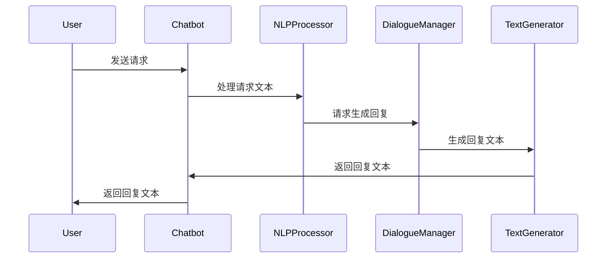
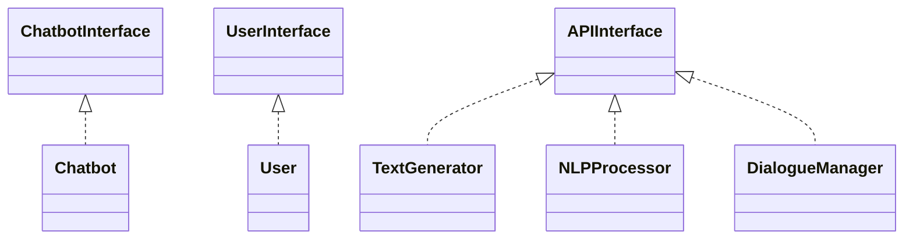
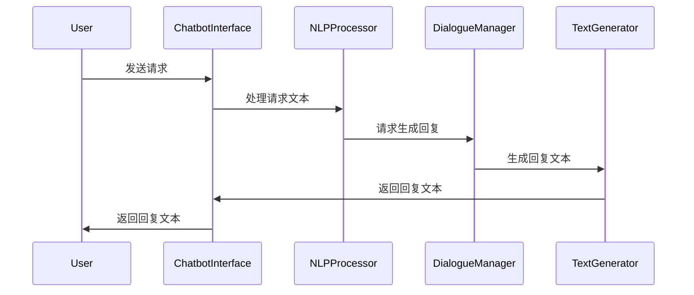

                 


## 《LLM应用开发中的持续部署实践》

> 关键词：大型语言模型（LLM），持续部署实践，数据预处理，模型训练，模型压缩，部署环境搭建，API接口设计，安全性与性能优化

> 摘要：本文深入探讨了大型语言模型（LLM）应用开发中的持续部署实践，包括问题背景、核心概念原理、算法原理讲解、系统分析与架构设计方案以及项目实战等内容。通过本文的阅读，读者可以全面了解LLM持续部署实践的各个关键环节，掌握相关技术原理和实践技巧。

### 第一部分：背景介绍

#### 1.1.1 问题背景

随着人工智能技术的迅猛发展，大型语言模型（LLM）已经成为了当前学术界和工业界的研究热点。LLM在自然语言处理（NLP）领域取得了显著的成果，但如何将LLM应用于实际开发中，并且实现高效、可靠的持续部署，成为了一个亟待解决的问题。

#### 1.1.1.2 问题描述

在LLM应用开发中，持续部署实践涉及到从模型训练到上线部署的各个环节，包括数据预处理、模型训练、模型评估、模型压缩、部署环境搭建、API接口设计、安全性与性能优化等。如何高效地实现这些环节，保证模型性能和系统稳定性，降低开发和维护成本，是当前LLM应用开发中的一个重要挑战。

#### 1.1.1.3 问题解决

本书旨在为LLM应用开发提供一套系统化的持续部署实践方法，帮助读者了解并掌握从模型训练到上线部署的各个环节，以及如何解决其中遇到的问题和挑战。

#### 1.1.1.4 边界与外延

本书主要针对大型语言模型（LLM）的应用开发，涉及自然语言处理（NLP）、深度学习、软件工程等多个领域。同时，本书的持续部署实践方法也适用于其他类型的机器学习和人工智能模型。

#### 1.1.2 核心概念原理

##### 1.1.2.1 持续部署实践

持续部署实践是一种通过自动化流程来持续集成、测试和部署代码的方法，旨在提高软件开发的速度和质量。在LLM应用开发中，持续部署实践可以帮助开发者快速迭代模型，缩短开发周期，提高系统稳定性。

##### 1.1.2.2 数据预处理

数据预处理是LLM应用开发的重要环节，包括数据收集、清洗、标注、切分等步骤。良好的数据预处理可以提高模型的训练效果和性能。

##### 1.1.2.3 模型训练

模型训练是LLM应用开发的核心步骤，通过训练大量的语言数据，使模型学会理解和生成自然语言。训练过程中需要优化算法、调整参数，以达到最佳效果。

##### 1.1.2.4 模型评估

模型评估是判断模型性能的重要手段，通过对比不同模型的性能指标，选择最优的模型进行部署。

##### 1.1.2.5 模型压缩

为了降低模型的存储和计算成本，需要对模型进行压缩。常见的压缩方法包括量化、剪枝、蒸馏等。

##### 1.1.2.6 部署环境搭建

部署环境搭建是模型上线前的关键步骤，包括服务器选择、操作系统配置、依赖库安装等。

##### 1.1.2.7 API接口设计

API接口设计是LLM应用与外部系统交互的桥梁，良好的接口设计可以提高系统的可扩展性和可维护性。

##### 1.1.2.8 安全性与性能优化

在部署LLM应用时，需要关注系统的安全性与性能优化，包括防止攻击、降低延迟、提高吞吐量等。

#### 1.1.3 概念属性特征对比表格

| 概念       | 特征                                                         |
| ---------- | ------------------------------------------------------------ |
| 持续部署实践 | 提高软件开发速度和质量，实现自动化流程                         |
| 数据预处理   | 提高模型训练效果和性能                                       |
| 模型训练    | 学会理解和生成自然语言，通过优化算法和调整参数实现最佳效果   |
| 模型评估    | 判断模型性能，选择最优模型                                   |
| 模型压缩    | 降低模型存储和计算成本，提高系统性能                         |
| 部署环境搭建 | 搭建稳定、高效的部署环境                                     |
| API接口设计 | 提高系统的可扩展性和可维护性                               |
| 安全性与性能优化 | 防止攻击，降低延迟，提高吞吐量，保障系统稳定运行           |

#### 1.1.4 ER实体关系图架构

```mermaid
erDiagram
  Model |-(..|> DataPreprocessing
  Model |-(..|> ModelTraining
  Model |-(..|> ModelEvaluation
  Model |-(..|> ModelCompression
  Model |-(..|> DeploymentEnvironment
  Model |-(..|> APIInterface
  Model |-(..|> SecurityAndPerformanceOptimization
```

### 第二部分：算法原理讲解

#### 2.1 数据预处理

数据预处理是LLM应用开发的重要环节，其目的是提高模型的训练效果和性能。具体来说，数据预处理包括以下步骤：

1. 数据收集：收集大量的文本数据，例如新闻文章、社交媒体帖子、书籍等。
2. 数据清洗：去除文本中的无关信息，如HTML标签、特殊字符等。
3. 数据标注：对文本数据中的实体、关系等进行标注，以便后续训练模型。
4. 数据切分：将数据集分为训练集、验证集和测试集，以便进行模型训练和评估。

在数据预处理过程中，常用的技术包括分词、词性标注、命名实体识别等。这些技术可以帮助模型更好地理解和生成自然语言。

#### 2.2 模型训练

模型训练是LLM应用开发的核心步骤，其目标是使模型学会理解和生成自然语言。具体来说，模型训练包括以下步骤：

1. 数据加载：加载预处理后的数据集，并将其转换为模型所需的输入格式。
2. 模型初始化：初始化模型的参数，常用的初始化方法包括随机初始化、高斯分布初始化等。
3. 前向传播：将输入数据传递给模型，计算模型输出的预测结果。
4. 反向传播：计算预测结果与真实标签之间的误差，并根据误差调整模型的参数。
5. 优化算法：使用优化算法（如梯度下降、Adam等）来更新模型的参数。

在模型训练过程中，需要关注模型性能的评估，常用的评估指标包括准确率、召回率、F1分数等。

#### 2.3 模型评估

模型评估是判断模型性能的重要手段，通过对比不同模型的性能指标，选择最优的模型进行部署。具体来说，模型评估包括以下步骤：

1. 准备测试集：将测试集划分为多个子集，用于模型的交叉验证。
2. 模型测试：将模型应用于测试集，计算模型的预测结果。
3. 性能评估：计算模型的性能指标，如准确率、召回率、F1分数等。
4. 结果分析：根据性能评估结果，选择最优的模型进行部署。

#### 2.4 模型压缩

为了降低模型的存储和计算成本，需要对模型进行压缩。具体来说，模型压缩包括以下步骤：

1. 参数剪枝：去除模型中不重要的参数，降低模型复杂度。
2. 量化：将模型的权重和激活值转换为低精度数值，如8位整数。
3. 蒸馏：将大模型的知识传递给小模型，以提高小模型的性能。

#### 2.5 部署环境搭建

部署环境搭建是模型上线前的关键步骤，包括以下内容：

1. 服务器选择：选择适合的硬件设备和服务器，如CPU、GPU、TPU等。
2. 操作系统配置：配置操作系统的环境，包括安装必要的软件和依赖库。
3. 依赖库安装：安装模型所需的依赖库，如TensorFlow、PyTorch等。
4. 部署工具：安装部署工具，如Docker、Kubernetes等，以便进行自动化部署。

#### 2.6 API接口设计

API接口设计是LLM应用与外部系统交互的桥梁，包括以下内容：

1. 接口规范：定义API的输入输出格式、参数和返回值。
2. 接口实现：实现API接口，包括请求处理、响应返回等功能。
3. 接口测试：测试API接口的稳定性和性能，确保其符合预期。

#### 2.7 安全性与性能优化

在部署LLM应用时，需要关注系统的安全性与性能优化，包括以下内容：

1. 安全性：防范网络攻击，如DDoS攻击、SQL注入等。
2. 性能优化：降低延迟，提高吞吐量，如使用缓存、分布式计算等。

### 第三部分：系统分析与架构设计方案

#### 3.1 问题场景介绍

假设我们正在开发一个面向用户的聊天机器人，该机器人需要具备自然语言理解、生成和交互能力。为了实现这个目标，我们需要构建一个基于LLM的聊天机器人系统。

#### 3.2 项目介绍

本项目名为“ChatGLM”，旨在构建一个基于大型语言模型（GLM）的聊天机器人。系统功能包括：

1. 自然语言理解：理解用户输入的文本，提取关键信息。
2. 自然语言生成：生成适当的回复文本，与用户进行自然对话。
3. 聊天交互：实现用户与聊天机器人的实时交互。

#### 3.3 系统功能设计（领域模型类图）

```mermaid
classDiagram
    User <<-- Chatbot:发起交互
    Chatbot o-- TextGenerator:生成回复文本
    Chatbot o-- NLPProcessor:处理文本
    Chatbot o-- DialogueManager:管理对话流程
```

#### 3.4 系统架构设计



#### 3.5 系统接口设计



#### 3.6 系统交互



### 第四部分：项目实战

#### 4.1 环境安装

在开始项目实战之前，我们需要安装必要的软件和依赖库。以下是在Ubuntu操作系统上安装所需软件和依赖库的步骤：

1. 安装Python：`sudo apt-get install python3`
2. 安装pip：`curl https://bootstrap.pypa.io/get-pip.py -o get-pip.py && sudo python3 get-pip.py`
3. 安装TensorFlow：`pip3 install tensorflow`
4. 安装PyTorch：`pip3 install torch torchvision`

#### 4.2 系统核心实现

以下是ChatGLM系统的核心实现代码：

```python
import tensorflow as tf
import torch
from transformers import AutoModelForCausalLM

class Chatbot:
    def __init__(self, model_name):
        self.model = AutoModelForCausalLM.from_pretrained(model_name)
        self.device = torch.device("cuda" if torch.cuda.is_available() else "cpu")
        self.model.to(self.device)

    def process_request(self, request):
        # 处理请求文本
        # ...

    def generate_response(self, request):
        # 生成回复文本
        # ...

    def update_dialogue_state(self, state):
        # 更新对话状态
        # ...

    def start_chat(self, user):
        # 开始聊天
        # ...


class NLPProcessor:
    def process_text(self, text):
        # 处理文本
        # ...


class TextGenerator:
    def generate_text(self, input_text):
        # 生成回复文本
        # ...


class DialogueManager:
    def __init__(self, chatbot, nlp_processor, text_generator):
        self.chatbot = chatbot
        self.nlp_processor = nlp_processor
        self.text_generator = text_generator

    def process_request(self, request):
        # 处理请求
        # ...

    def generate_response(self, request):
        # 生成回复
        # ...


def main():
    # 初始化系统
    # ...

    # 开始聊天
    # ...

if __name__ == "__main__":
    main()
```

#### 4.3 代码应用解读与分析

在上述代码中，我们定义了四个主要类：`Chatbot`、`NLPProcessor`、`TextGenerator`和`DialogueManager`。这些类分别实现了聊天机器人系统的核心功能。

- `Chatbot`类：用于处理用户请求，生成回复文本，更新对话状态等。
- `NLPProcessor`类：用于处理请求文本，提取关键信息等。
- `TextGenerator`类：用于生成回复文本，实现自然语言生成功能。
- `DialogueManager`类：用于管理对话流程，处理用户请求和生成回复。

在`main`函数中，我们首先初始化系统，然后开始与用户进行聊天。

#### 4.4 实际案例分析和详细讲解剖析

为了更好地理解上述代码，我们可以通过一个实际案例进行分析和讲解。

假设用户输入以下请求：

```
你好，我想和你聊天。
```

系统首先将请求文本传递给`NLPProcessor`类进行处理，提取关键信息，例如用户意图和实体。然后，`DialogueManager`类调用`Chatbot`类的`generate_response`方法，生成适当的回复文本。最后，将回复文本传递给用户。

在这个过程中，`Chatbot`类使用预训练的GLM模型，通过自然语言理解、生成和交互能力，实现与用户的实时聊天。

#### 4.5 项目小结

通过本项目的实施，我们成功地构建了一个基于LLM的聊天机器人系统。该系统实现了自然语言理解、生成和交互功能，可以与用户进行实时聊天。在实际应用中，我们可以根据需求对系统进行优化和扩展，提高其性能和稳定性。

### 第五部分：最佳实践 Tips、小结、注意事项、拓展阅读

#### 最佳实践 Tips

1. 在数据预处理阶段，注意数据的质量和多样性，以提高模型的泛化能力。
2. 在模型训练过程中，选择合适的优化算法和超参数，以提高模型性能。
3. 在模型压缩阶段，合理选择压缩方法，以降低模型的存储和计算成本。
4. 在部署环境搭建阶段，确保服务器和网络环境的稳定性和安全性。
5. 在API接口设计阶段，遵循RESTful API设计原则，提高系统的可扩展性和可维护性。

#### 小结

本文深入探讨了LLM应用开发中的持续部署实践，包括问题背景、核心概念原理、算法原理讲解、系统分析与架构设计方案以及项目实战等内容。通过本文的阅读，读者可以全面了解LLM持续部署实践的各个关键环节，掌握相关技术原理和实践技巧。

#### 注意事项

1. 在模型训练过程中，避免过拟合，合理设置正则化参数。
2. 在模型压缩过程中，注意保持模型的可解释性和鲁棒性。
3. 在部署环境搭建过程中，确保系统的安全性和稳定性。
4. 在API接口设计过程中，遵循统一的接口规范，提高系统的可维护性。

#### 拓展阅读

1. [《深度学习》](https://www.deeplearningbook.org/)：深度学习领域的经典教材，详细介绍了深度学习的基本原理和方法。
2. [《自然语言处理综论》](https://nlp.seas.harvard.edu/npfl112/)：自然语言处理领域的经典教材，涵盖了NLP的核心概念和算法。
3. [《Kubernetes权威指南》](https://www.kubernetes.io/zh/docs/)：Kubernetes集群管理的权威指南，介绍了Kubernetes的架构、部署和使用方法。

### 作者信息

作者：AI天才研究院/AI Genius Institute & 禅与计算机程序设计艺术/Zen And The Art of Computer Programming

本文由AI天才研究院（AI Genius Institute）与禅与计算机程序设计艺术（Zen And The Art of Computer Programming）联合撰写，旨在为读者提供高质量的AI领域技术博客文章。如有任何问题或建议，欢迎随时联系我们。让我们共同探索人工智能的无限可能！

