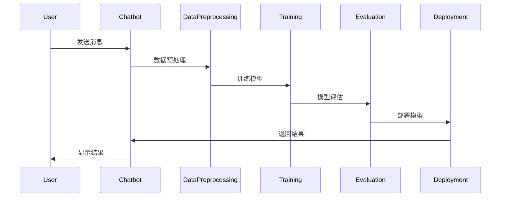
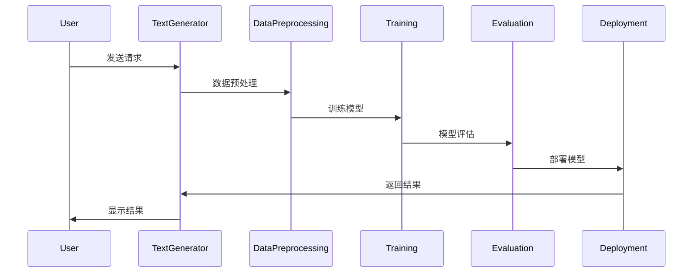

                 


# LLMAPI应用开发中的持续集成与持续部署

关键词：LLM、持续集成、持续部署、CI、CD、自动化测试、部署策略

摘要：随着人工智能技术的不断发展，大型语言模型（LLM）在自然语言处理领域取得了显著成就。然而，LLM的开发与应用过程中，持续集成（CI）与持续部署（CD）成为了一大挑战。本文将深入探讨LLM应用开发中的CI/CD实践，包括CI/CD的基本概念、LLM与CI/CD的关联、CI/CD工具与平台的选择、CI/CD流程设计、实践案例以及最佳实践与优化策略。

## 第一部分：背景介绍

### 1.1 问题背景

近年来，人工智能（AI）技术，特别是深度学习（DL），在自然语言处理（NLP）领域取得了重大突破。其中，大型语言模型（LLM，如GPT-3、BERT等）因其强大的文本生成和理解能力，成为了众多企业和研究机构的核心技术资产。LLM在语言理解、生成、翻译等任务上表现出色，已经在许多实际应用中取得了显著成效。

然而，LLM的开发与应用过程中，持续集成（CI）与持续部署（CD）成为了一大挑战。持续集成（Continuous Integration，简称CI）是一种软件开发实践，旨在通过自动化构建、测试和部署流程，确保代码库始终处于可集成状态。持续部署（Continuous Deployment，简称CD）则进一步将CI的理念应用于生产环境，通过自动化流程将经过CI测试的代码部署到生产环境。

### 1.2 问题描述

LLM由于其复杂的结构和庞大的数据需求，使得CI/CD的实施变得异常困难。首先，LLM的训练过程需要大量的计算资源和数据，这使得CI/CD流程中的构建和测试过程变得非常耗时。其次，LLM的模型参数和结构庞大，使得自动化测试和代码合并变得复杂。此外，LLM的应用场景多样，不同的应用场景可能需要不同的模型参数和部署策略，这也增加了CI/CD的复杂性。

### 1.3 问题解决

本文旨在解决LLM应用开发中的CI/CD问题，为开发者提供系统化的解决方案。首先，本文将介绍CI/CD的基本概念和原理，然后分析LLM的特性及其对CI/CD的需求。接下来，本文将介绍常用的CI/CD工具和平台，以及如何选择合适的工具。随后，本文将详细讲解CI/CD的流程设计，包括代码仓库管理、自动化测试、环境配置、部署策略等。最后，本文将通过实际案例展示如何实现LLM的CI/CD，并提供最佳实践与优化策略。

### 1.4 边界与外延

本文主要关注大型语言模型的CI/CD，但所涉及的原理和方法同样适用于其他复杂深度学习模型的开发。边界包括但不限于LLM的训练过程、模型评估与优化、部署策略等。外延则包括CI/CD在其他领域（如金融、医疗等）的应用和扩展。

### 1.5 概念结构与核心要素组成

本文的核心结构如下：

1. **CI/CD基本概念**：介绍CI/CD的定义、目的及其在软件工程中的重要性。
2. **LLM与CI/CD**：分析LLM的特性及其对CI/CD的需求。
3. **CI/CD工具与平台**：介绍常用的CI/CD工具和平台，以及如何选择合适的工具。
4. **CI/CD流程设计**：详细讲解CI/CD的流程设计，包括代码仓库管理、自动化测试、环境配置、部署策略等。
5. **实践案例**：通过实际案例展示如何实现LLM的CI/CD。
6. **最佳实践与优化**：分享CI/CD的最佳实践，并提供优化建议。
7. **总结与展望**：总结本文内容，展望LLM CI/CD的未来发展。

## 第二部分：核心概念与联系

### 2.1 持续集成（CI）与持续部署（CD）

#### 2.1.1 持续集成（CI）

**概念**：持续集成（Continuous Integration，简称CI）是一种软件开发实践，旨在通过自动化构建、测试和部署流程，确保代码库始终处于可集成状态。

**核心特征**：

- **自动化**：CI依赖于自动化工具和脚本，以确保每次代码变更后都能迅速发现潜在问题。
- **频繁**：CI要求频繁集成代码，以减少集成风险，确保代码质量。

**与LLM的联系**：

- **版本控制**：LLM的代码库需要使用版本控制系统，如Git，以确保代码的版本管理和协作开发。
- **自动化测试**：CI要求对LLM的代码和模型进行自动化测试，确保模型在不同版本下的稳定性和性能。

#### 2.1.2 持续部署（CD）

**概念**：持续部署（Continuous Deployment，简称CD）是一种软件开发实践，通过自动化流程，将经过CI测试的代码部署到生产环境，确保软件的快速、可靠发布。

**核心特征**：

- **自动化**：CD依赖于自动化部署脚本和工具，减少手动操作，提高部署效率。
- **可靠性**：CD要求部署过程高度可靠，确保软件在生产环境中的稳定运行。

**与LLM的联系**：

- **部署策略**：LLM的部署需要考虑模型的规模和复杂性，选择合适的部署策略，如容器化、服务器部署等。
- **性能监控**：CD要求对LLM部署后的性能进行监控，确保其在生产环境中的稳定运行。

#### 2.2 核心概念对比表格

| 概念     | 定义                         | 核心特征                           | 与LLM的联系                    |
|----------|------------------------------|-----------------------------------|--------------------------------|
| 持续集成 | 定期合并代码，运行测试       | 自动化、频繁集成                   | 版本控制、自动化测试            |
| 持续部署 | 将通过CI测试的代码部署到生产 | 自动化、可靠性                     | 部署策略、性能监控              |

#### 2.3 ER实体关系图架构

```mermaid
erDiagram
  CI --> Test : 执行
  CD --> Deploy : 执行
  Test ||--|{ Model }|| : 测试
  Deploy ||--|{ Model }|| : 部署
```

在这个ER实体关系图中，CI和CD是两个核心概念，分别表示持续集成和持续部署。Test和Deploy是CI和CD的执行过程，Model表示LLM模型，与CI和CD有直接的关联。Test实体负责对LLM模型进行自动化测试，Deploy实体负责将通过CI测试的LLM模型部署到生产环境。

### 第三部分：CI/CD在LLM应用开发中的重要性

#### 3.1 LLMAPI应用场景介绍

随着大型语言模型（LLM）的广泛应用，LLMAPI（如OpenAI的GPT-3、Google的BERT等）成为了许多开发者和服务提供商的核心技术资产。LLMAPI通过提供预训练的模型和API接口，使得开发者可以轻松地实现自然语言处理（NLP）任务，如文本生成、情感分析、命名实体识别等。LLMAPI的应用场景广泛，包括但不限于聊天机器人、智能客服、文本摘要、机器翻译等。

#### 3.2 CI/CD在LLM应用开发中的重要性

在LLM应用开发中，CI/CD的重要性不言而喻。首先，CI/CD可以提高开发效率。通过自动化构建、测试和部署流程，开发者可以快速发现和解决问题，减少人为干预，提高开发效率。其次，CI/CD可以提高软件质量。通过频繁的集成和自动化测试，CI/CD可以确保代码库始终处于可集成状态，减少集成风险，提高软件质量。

对于LLM应用开发，CI/CD的重要性更加显著。首先，LLM模型的复杂性和大规模特性使得手动管理代码和模型变得困难。通过CI/CD，开发者可以自动化管理代码和模型，确保代码和模型的一致性。其次，LLM应用场景多样，不同的应用场景可能需要不同的模型参数和部署策略。通过CI/CD，开发者可以快速调整模型参数和部署策略，以满足不同的应用需求。

### 第四部分：CI/CD工具与平台选择

#### 4.1 常见的CI/CD工具

在CI/CD实践中，有许多流行的工具和平台可供选择。以下是一些常见的CI/CD工具：

- **Jenkins**：Jenkins是一个开源的自动化服务器，支持各种插件，可以轻松地实现CI/CD流程。
- **GitLab CI/CD**：GitLab CI/CD是GitLab提供的一站式CI/CD解决方案，支持自动化构建、测试和部署。
- **CircleCI**：CircleCI是一个云原生的CI/CD平台，提供简单、可靠的CI/CD服务。
- **Travis CI**：Travis CI是一个流行的CI服务，特别适用于GitHub项目。
- **GitHub Actions**：GitHub Actions是GitHub提供的一站式CI/CD解决方案，支持自动化构建、测试和部署。

#### 4.2 选择合适的CI/CD工具

选择合适的CI/CD工具取决于项目的具体需求和特点。以下是一些选择CI/CD工具时需要考虑的因素：

- **项目规模**：对于大型项目，需要选择功能强大、扩展性好的工具，如Jenkins、GitLab CI/CD等。对于小型项目，可以选择简单的工具，如CircleCI、Travis CI等。
- **团队协作**：CI/CD工具需要支持团队协作，如代码仓库管理、分支管理、角色分配等。
- **成本**：开源工具如Jenkins、GitLab CI/CD等成本较低，但需要自行维护。商业工具如CircleCI、Travis CI等成本较高，但提供了更好的支持和维护。
- **扩展性**：选择具有良好扩展性的CI/CD工具，可以方便地添加新功能、集成第三方服务等。

### 第五部分：CI/CD流程设计

#### 5.1 代码仓库管理

在CI/CD流程中，代码仓库管理至关重要。以下是一些代码仓库管理的最佳实践：

- **使用版本控制系统**：如Git，确保代码的版本管理和协作开发。
- **分支策略**：采用稳定的分支策略，如Git Flow或GitHub Flow，确保代码库的整洁和可管理性。
- **代码审查**：实施代码审查机制，确保代码的质量和一致性。

#### 5.2 自动化测试

自动化测试是CI/CD流程的核心环节。以下是一些自动化测试的最佳实践：

- **单元测试**：编写单元测试，确保代码的每个模块都能正常运行。
- **集成测试**：编写集成测试，确保代码的不同模块能够协同工作。
- **性能测试**：进行性能测试，确保软件的响应速度和稳定性。
- **自动化测试框架**：使用自动化测试框架，如Selenium、JUnit等，提高测试的效率和准确性。

#### 5.3 环境配置

环境配置是CI/CD流程中的重要环节。以下是一些环境配置的最佳实践：

- **容器化**：使用容器化技术，如Docker，确保开发、测试和生产环境的一致性。
- **持续集成服务器**：使用持续集成服务器，如Jenkins、GitLab CI/CD等，自动化构建和测试代码。
- **配置管理**：使用配置管理工具，如Ansible、Chef等，自动化管理环境配置。

#### 5.4 部署策略

部署策略是CI/CD流程中的关键环节。以下是一些部署策略的最佳实践：

- **蓝绿部署**：将生产环境的流量逐渐转移到新版本，确保平稳升级。
- **灰度发布**：逐步将新版本部署到部分用户，确保稳定性和用户体验。
- **自动化部署**：使用自动化部署工具，如Kubernetes、Ansible等，确保部署的效率和准确性。

### 第六部分：实践案例

#### 6.1 案例一：基于Jenkins的CI/CD实践

**项目介绍**：这是一个基于Python的聊天机器人项目，使用TensorFlow训练了一个基于BERT的模型，用于处理自然语言交互。

**系统功能设计**：项目包括以下功能模块：

- **数据预处理**：清洗和准备训练数据。
- **模型训练**：基于BERT模型进行训练。
- **模型评估**：评估模型性能。
- **模型部署**：将训练好的模型部署到服务器。

**系统架构设计**：系统采用微服务架构，包括以下服务：

- **数据预处理服务**：负责数据清洗和准备。
- **训练服务**：负责模型训练。
- **评估服务**：负责模型评估。
- **部署服务**：负责模型部署。

**系统接口设计**：系统提供RESTful API接口，支持模型训练、评估和部署。

**系统交互序列图**：



#### 6.2 案例二：基于GitLab CI/CD的实践

**项目介绍**：这是一个基于TensorFlow的文本生成项目，使用GPT-3模型生成高质量文章。

**系统功能设计**：项目包括以下功能模块：

- **数据预处理**：清洗和准备训练数据。
- **模型训练**：基于GPT-3模型进行训练。
- **模型评估**：评估模型性能。
- **模型部署**：将训练好的模型部署到服务器。

**系统架构设计**：系统采用容器化架构，使用Docker和Kubernetes进行部署。

**系统接口设计**：系统提供RESTful API接口，支持模型训练、评估和部署。

**系统交互序列图**：



### 第七部分：最佳实践与优化

#### 7.1 最佳实践

1. **代码质量**：确保代码质量，遵循编码规范，进行代码审查。
2. **自动化测试**：编写全面的自动化测试，确保代码和模型的稳定性。
3. **环境一致性**：使用容器化技术，确保开发、测试和生产环境的一致性。
4. **监控与报警**：实施监控和报警机制，及时发现和处理问题。

#### 7.2 优化策略

1. **并行处理**：利用并行处理技术，加速构建和测试过程。
2. **缓存策略**：使用缓存策略，减少重复计算和I/O操作。
3. **资源优化**：优化计算资源和存储资源的使用，提高系统性能。
4. **持续优化**：定期回顾CI/CD流程，识别瓶颈和优化点，持续优化。

### 第八部分：总结与展望

本文深入探讨了LLM应用开发中的CI/CD实践，从CI/CD的基本概念、工具选择、流程设计到实践案例和最佳实践，全面介绍了如何在LLM应用开发中高效实施CI/CD。通过本文的介绍，开发者可以更好地理解和应用CI/CD，提高开发效率和质量。

展望未来，随着人工智能技术的不断发展，CI/CD在LLM应用开发中的重要性将越来越突出。未来的研究方向可能包括：

1. **自动化测试**：进一步研究自动化测试策略，提高测试效率和覆盖率。
2. **部署策略**：探索更高效、可靠的部署策略，满足不同应用场景的需求。
3. **持续学习**：将CI/CD与持续学习相结合，实现模型的持续优化和更新。
4. **跨平台兼容**：研究CI/CD在不同平台（如云平台、边缘计算等）的兼容性和优化策略。

### 作者信息

作者：AI天才研究院/AI Genius Institute & 禅与计算机程序设计艺术 /Zen And The Art of Computer Programming

### 参考文献

1. 《持续集成实践：敏捷开发之道》
2. 《持续交付：发布可靠软件的系统化方法》
3. 《Git Pro》
4. 《Jenkins：持续集成服务器实战》
5. 《Docker实战》
6. 《Kubernetes实战》
7. 《BERT：Pre-training of Deep Bidirectional Transformers for Language Understanding》
8. 《GPT-3：Language Models are few-shot learners》

