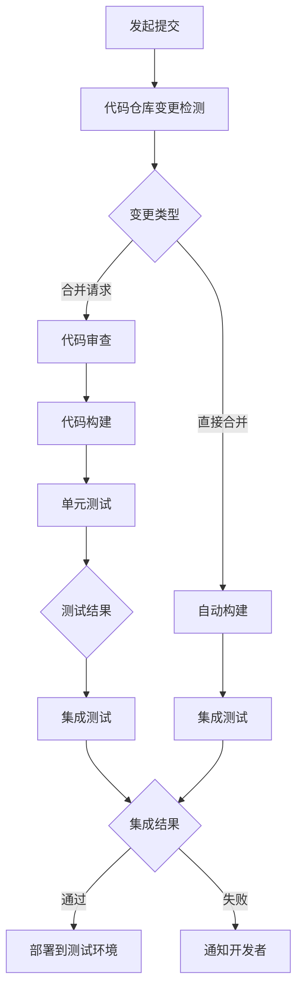
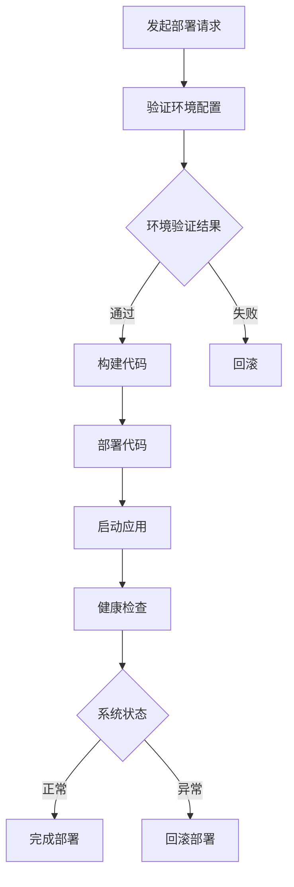
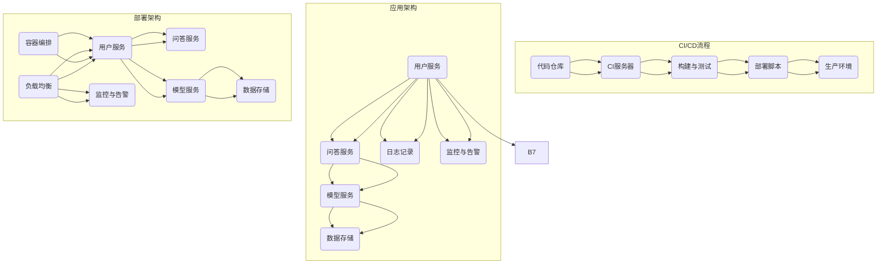
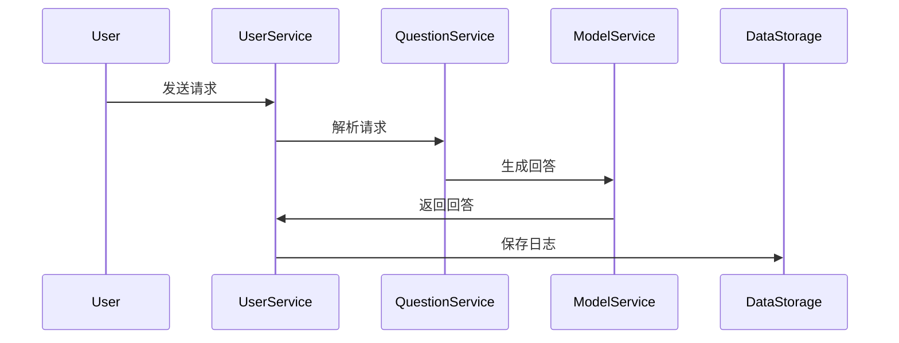
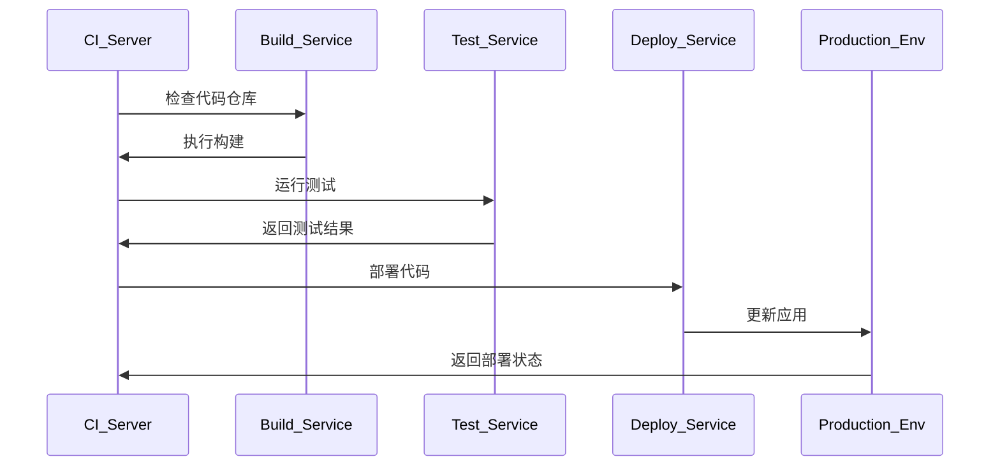

                 

### 文章标题

---

**LLM应用开发中的持续集成与持续部署**

---

### 关键词

- **持续集成（CI）**  
- **持续部署（CD）**  
- **大语言模型（LLM）**  
- **应用开发**  
- **自动化测试**  
- **DevOps**  
- **容器化与微服务架构**

---

### 摘要

本文深入探讨了在大语言模型（LLM）应用开发中，如何实现持续集成（CI）与持续部署（CD）的最佳实践。首先，介绍了CI和CD的核心概念、原理及其在LLM应用开发中的重要性。接着，通过对比分析，明确了CI和CD的异同点，并利用实体关系图（ER图）架构，直观展示了相关组件与流程。文章随后讲解了CI和CD的算法原理，并通过实际案例，详细剖析了如何在大语言模型应用中实现CI和CD。最后，文章总结了项目实战中的经验教训，并为未来的发展提供了展望。

---

## 第一部分：背景介绍

在当今快速迭代的科技环境中，持续集成（Continuous Integration, CI）和持续部署（Continuous Deployment, CD）已经成为软件开发不可或缺的组成部分。这些实践不仅能显著提高开发效率，还能确保代码质量和系统的稳定性。

### 1.1.1 问题背景

持续集成和持续部署的引入主要是为了解决传统软件开发中常见的问题，如代码冲突、依赖管理不当、版本控制困难等。特别是在开发大语言模型（LLM）这样的复杂应用时，这些问题的复杂性被放大，因为LLM涉及到大量的数据和模型训练，对代码质量和系统稳定性要求极高。

### 1.1.2 问题描述

具体来说，在LLM应用开发中，问题描述包括：

1. **代码冲突**：由于团队成员在不同分支上并行开发，代码冲突变得频繁，导致集成过程中的错误和中断。
2. **依赖管理**：LLM应用通常依赖于多种库和工具，依赖管理不当可能导致部署失败。
3. **版本控制**：版本控制不善可能使得不同版本之间的兼容性差，影响应用的稳定性。
4. **测试不足**：缺乏全面的自动化测试，可能导致潜在的错误在部署后才发现，影响用户体验。

### 1.1.3 问题解决

为了解决上述问题，持续集成和持续部署应运而生：

1. **持续集成**：通过频繁的代码合并和自动化测试，确保代码质量，减少冲突，及时发现并解决依赖问题。
2. **持续部署**：通过自动化脚本和容器化技术，实现快速、可靠的部署流程，确保系统能稳定运行。

### 1.1.4 边界与外延

在LLM应用开发中，CI和CD的边界包括：

- **集成环境**：确保所有代码库和依赖的版本正确，并在集成环境中运行测试。
- **部署环境**：确定如何将集成后的代码部署到生产环境中，以及如何管理不同环境之间的差异。

外延方面，CI和CD还需要考虑以下几个方面：

- **监控与反馈**：持续监控系统的性能和状态，及时反馈并处理异常。
- **安全与合规**：确保CI/CD流程符合组织的安全政策和法规要求。
- **运维自动化**：通过自动化脚本，减少手动操作，提高运维效率。

### 1.1.5 概念结构与核心要素组成

CI和CD的核心概念和结构可以概括为：

- **源代码管理**：版本控制系统（如Git）用于管理代码的版本。
- **构建和测试**：自动化工具（如Jenkins、Travis CI）用于构建和运行测试。
- **部署**：使用容器（如Docker）、容器编排（如Kubernetes）实现自动化部署。
- **监控与反馈**：使用监控工具（如Prometheus、Grafana）确保系统稳定运行。

这些核心要素共同构成了CI/CD流程，确保LLM应用开发的效率和质量。

## 第二部分：核心概念与联系

持续集成（CI）和持续部署（CD）是现代软件开发中至关重要的概念。它们分别代表了开发流程中的两个阶段，且相互关联，共同促进软件质量的提升和开发效率的提高。

### 2.1.1 持续集成（CI）的原理

持续集成（CI）是一种软件开发实践，旨在通过频繁地将代码合并到共享的主分支，确保整个系统保持一致和稳定。CI的核心原理包括：

1. **频繁提交**：开发人员定期提交代码，并立即触发构建和测试过程。
2. **自动化测试**：每次提交后，CI工具自动执行一系列预定义的测试，包括单元测试、集成测试和端到端测试。
3. **快速反馈**：测试结果即时反馈给开发人员，帮助他们快速发现问题并进行修复。

CI的主要目标是通过自动化和频繁的集成，确保代码库的质量，减少因代码冲突和依赖问题导致的中断。

### 2.1.2 持续部署（CD）的原理

持续部署（CD）是在CI的基础上，进一步将通过测试的代码自动部署到生产环境。CD的原理包括：

1. **自动化部署**：使用脚本或工具（如Jenkins、GitLab CI）自动化执行部署任务，包括环境配置、代码安装和应用程序启动。
2. **蓝绿部署**：通过在生产环境中运行两个相同的版本（蓝色和绿色），逐步替换旧版本，确保系统稳定性和可回滚性。
3. **灰度发布**：在部署新版本时，先在一个小范围内发布，观察其性能和用户反馈，再逐步扩大范围。

CD的目标是通过自动化和优化部署流程，提高部署的可靠性和速度。

### 2.1.3 CI与CD的联系与区别

CI与CD虽然密切相关，但它们在软件开发流程中扮演的角色有所不同：

- **联系**：CI是CD的基础，只有通过CI确保代码质量和功能完整性，才能进行CD。因此，CI和CD通常一起使用，形成CI/CD流程。

- **区别**：CI专注于代码的集成和测试，确保代码库的稳定性和一致性。CD则专注于将代码部署到生产环境，确保系统能够快速、可靠地更新和发布。

### 表格：CI与CD的技术特点对比

| 特点         | 持续集成（CI）        | 持续部署（CD）        |
| ------------ | -------------------- | -------------------- |
| 目标         | 代码质量和一致性     | 系统的可用性和更新    |
| 核心流程     | 构建、测试和反馈     | 部署、监控和回滚      |
| 自动化工具   | Jenkins、Travis CI   | Jenkins、GitLab CI    |
| 适用场景     | 开发和测试环境       | 生产环境              |
| 关键指标     | 测试覆盖率、代码质量 | 部署速度、系统稳定性  |

通过上述对比，可以看出CI和CD各有侧重，但它们共同构成了现代软件开发的核心流程，确保软件从开发到部署的整个生命周期中都能保持高效和质量。

### 2.1.4 ER实体关系图架构

为了更直观地理解CI和CD的架构，我们可以使用实体关系图（ER图）来描述相关的组件和流程。以下是一个简化的ER图，展示了CI和CD的主要实体及其关系：

```mermaid
erDiagram
    User ||--|{ Commit }|| Project
    Project ||--|{ Build }|| CI_Server
    Build ||--|{ Test }|| Test_Server
    Test ||--|{ Result }|| CI_Server
    CI_Server ||--|{ Deploy }|| Deploy_Server
    Deploy_Server ||--|{ Release }|| Production
```

#### ER实体关系图详细说明

1. **User（用户）**：代表参与项目的开发人员，负责提交代码。
2. **Commit（提交）**：记录用户的代码变更，是CI过程的起点。
3. **Project（项目）**：包含多个提交，代表一个完整的软件项目。
4. **Build（构建）**：CI_Server根据提交生成构建，包括编译和打包。
5. **Test（测试）**：Build生成后，Test_Server执行一系列测试，包括单元测试、集成测试等。
6. **Result（结果）**：测试结果反馈给CI_Server，用于决定下一步操作。
7. **CI_Server（CI服务器）**：自动化执行构建和测试流程，生成结果。
8. **Deploy（部署）**：CI_Server根据测试结果决定是否部署到生产环境。
9. **Deploy_Server（部署服务器）**：负责将通过测试的代码部署到生产环境。
10. **Release（发布）**：最终发布到生产环境的应用版本。

通过这个ER图，我们可以清晰地看到CI和CD中的各个实体及其相互关系，有助于理解整个流程的运作机制。

## 第三部分：算法原理讲解

在深入探讨持续集成（CI）和持续部署（CD）的算法原理之前，我们需要明确这些算法的基本概念，并通过具体的流程图和代码示例来进行详细讲解。

### 3.1.1 CI算法原理讲解

持续集成（CI）算法的核心目标是确保代码库的质量和一致性。以下是CI算法的基本原理和流程：

#### 3.1.1.1 CI算法的mermaid流程图

首先，我们使用mermaid语言绘制CI算法的流程图：



#### 3.1.1.2 CI算法的Python源代码

接下来，我们通过Python代码来展示CI算法的实现：

```python
import os
import subprocess

# 检查代码仓库变更
def check_for_changes():
    # 这里用git命令检查是否有新的提交
    result = subprocess.run(["git", "diff"], capture_output=True, text=True)
    return result.stdout.strip() != ""

# 代码审查（简化为是否通过检查）
def code_review():
    # 实际应用中这里会包含更复杂的代码审查逻辑
    return True

# 自动构建
def build_code():
    subprocess.run(["make", "build"], check=True)

# 单元测试
def run_unit_tests():
    subprocess.run(["make", "test"], check=True)

# 集成测试
def run_integration_tests():
    subprocess.run(["make", "integration-test"], check=True)

# 主流程
if __name__ == "__main__":
    if check_for_changes():
        if code_review():
            build_code()
            run_unit_tests()
            run_integration_tests()
            if not os.path.exists("integration-test-result.txt"):
                print("All tests passed.")
            else:
                print("Integration tests failed.")
        else:
            print("Code review failed.")
    else:
        print("No new changes detected.")
```

#### 3.1.1.3 CI算法的数学模型与公式

在CI算法中，核心的数学模型是测试覆盖率（Test Coverage），它是衡量测试全面性的一个指标。测试覆盖率的计算公式如下：

$$
\text{Test Coverage} = \frac{\text{被执行的代码路径数}}{\text{所有可能的代码路径数}} \times 100\%
$$

这个公式帮助开发人员了解测试是否覆盖了代码的所有关键路径，确保潜在问题的及时发现。

#### 3.1.1.4 举例说明

假设一个简单的函数有5条可能的代码路径，而经过单元测试和集成测试后，共有3条路径被执行，则其测试覆盖率为：

$$
\text{Test Coverage} = \frac{3}{5} \times 100\% = 60\%
$$

如果开发人员希望达到至少80%的测试覆盖率，则他们需要继续增加测试用例，确保所有关键代码路径都被覆盖。

### 3.1.2 CD算法原理讲解

持续部署（CD）算法的核心目标是实现代码的自动化部署和快速回滚。以下是CD算法的基本原理和流程：

#### 3.1.2.1 CD算法的mermaid流程图

我们继续使用mermaid语言绘制CD算法的流程图：



#### 3.1.2.2 CD算法的Python源代码

接下来，我们通过Python代码展示CD算法的实现：

```python
import os
import subprocess

# 验证环境配置
def check_environment():
    # 这里用特定的脚本或命令验证环境配置
    result = subprocess.run(["bash", "check-env.sh"], capture_output=True, text=True)
    return result.stdout.strip() == "环境配置正确"

# 部署代码
def deploy_code():
    if check_environment():
        subprocess.run(["make", "deploy"], check=True)
    else:
        print("环境配置验证失败，无法部署。")

# 启动应用
def start_application():
    subprocess.run(["bash", "start-app.sh"], check=True)

# 健康检查
def health_check():
    # 这里用特定的命令检查应用健康状态
    result = subprocess.run(["curl", "-s", "http://localhost/health"], capture_output=True, text=True)
    return result.stdout.strip() == "healthy"

# 主流程
def main():
    deploy_code()
    start_application()
    if health_check():
        print("部署成功，系统运行正常。")
    else:
        print("健康检查失败，系统运行异常，开始回滚部署。")
        # 回滚部署代码（简化示例）
        subprocess.run(["bash", "rollback-deploy.sh"], check=True)

if __name__ == "__main__":
    main()
```

#### 3.1.2.3 CD算法的数学模型与公式

在CD算法中，关键指标是部署成功率（Deployment Success Rate），它是衡量部署流程稳定性的一个指标。部署成功率的计算公式如下：

$$
\text{Deployment Success Rate} = \frac{\text{成功部署次数}}{\text{部署尝试总次数}} \times 100\%
$$

这个公式帮助团队评估部署流程的可靠性，并发现潜在的问题。

#### 3.1.2.4 举例说明

假设一个团队在一个月内尝试部署了10次，其中有8次成功，则其部署成功率为：

$$
\text{Deployment Success Rate} = \frac{8}{10} \times 100\% = 80\%
$$

如果团队希望提高部署成功率，他们需要优化部署脚本，确保环境配置的一致性，并增加健康检查的准确性。

通过上述算法原理讲解，我们可以清晰地理解CI和CD的工作机制，并通过实际代码示例，看到如何在LLM应用开发中实现这些算法。这些算法不仅提高了开发效率，还确保了系统的稳定性和可靠性。

## 第四部分：系统分析与架构设计方案

### 4.1.1 应用场景概述

在大语言模型（LLM）应用开发中，系统分析和架构设计是一个复杂而关键的环节。随着人工智能技术的发展，LLM的应用越来越广泛，从自然语言处理到智能客服，从文本生成到机器翻译，LLM的需求日益增长。然而，这也带来了巨大的挑战，特别是在确保系统的可扩展性、稳定性和安全性方面。因此，引入持续集成（CI）和持续部署（CD）机制，是解决这些挑战的有效手段。

### 4.1.2 系统需求分析

在进行系统分析时，我们需要识别并明确系统的主要需求：

1. **性能需求**：LLM应用需要处理大量的文本数据，对计算性能和响应速度有较高的要求。系统应能够快速处理请求，并保持稳定的性能。
2. **扩展性需求**：系统需要支持水平扩展，以适应不断增长的用户量和数据量。通过微服务架构和容器化技术，可以实现系统的弹性扩展。
3. **可靠性需求**：系统必须具有高可用性和容错能力，确保在故障情况下能够快速恢复，减少对用户的影响。
4. **安全性需求**：数据安全和用户隐私保护是LLM应用的重大挑战。系统应具备严格的安全策略和访问控制机制。
5. **可维护性需求**：系统代码应具有良好的可读性和可维护性，便于开发团队进行持续的迭代和优化。

### 4.1.3 项目介绍

在本项目中，我们旨在开发一个基于LLM的智能问答系统。该系统的主要功能包括接收用户输入、理解用户意图、生成回答，并返回给用户。为了满足上述需求，项目目标如下：

1. **实现高效的LLM推理引擎**：通过使用先进的深度学习模型，实现快速、准确的问答功能。
2. **构建可扩展的系统架构**：采用微服务架构和容器化技术，确保系统具有高性能和高可扩展性。
3. **引入CI/CD流程**：实现持续集成和持续部署，确保系统的稳定性和可靠性。
4. **确保数据安全和隐私保护**：采用加密技术保护用户数据，并建立严格的安全策略和访问控制机制。

### 4.1.4 项目难点与解决方案

在实现上述项目目标的过程中，我们遇到了以下几个难点：

1. **模型训练与优化**：LLM模型的训练是一个计算密集型任务，如何高效地训练模型并优化其性能是一个挑战。解决方案是采用分布式训练技术，利用多GPU并行计算，提高训练效率。
2. **系统性能瓶颈**：在处理大量请求时，系统可能会出现性能瓶颈。解决方案是采用负载均衡技术，将请求均匀分配到不同的服务器上，确保系统的高性能运行。
3. **部署复杂性**：持续部署（CD）过程中，如何确保部署的可靠性和回滚能力是一个难题。解决方案是引入蓝绿部署和灰度发布策略，确保在部署过程中系统的稳定性和可回滚性。
4. **安全性问题**：在处理敏感数据时，如何确保数据安全和用户隐私是一个重要挑战。解决方案是采用加密技术和访问控制策略，确保数据的完整性和安全性。

### 4.1.5 系统功能设计

为了实现项目目标，我们需要设计以下核心功能：

1. **问答功能**：用户输入问题，系统理解并生成回答。
2. **数据管理**：存储和检索用户数据和模型数据，确保数据的安全和隐私。
3. **监控与告警**：实时监控系统的性能和状态，并在出现问题时自动触发告警。
4. **日志记录**：记录系统的操作日志，便于后续的调试和分析。

#### 领域模型mermaid类图

以下是系统功能设计的mermaid类图：

```mermaid
classDiagram
    User <<Entity>>
    Question <<Entity>>
    Answer <<Entity>>
    LLMModel <<Entity>>

    User "asks" Question
    Question "asks" LLMModel
    LLMModel "generates" Answer

    DataStorage "stores" User
    DataStorage "stores" Question
    DataStorage "stores" Answer
    DataStorage "stores" LLMModel

    Monitor "monitors" User
    Monitor "monitors" Question
    Monitor "monitors" Answer
    Monitor "monitors" LLMModel

    Logger "logs" User
    Logger "logs" Question
    Logger "logs" Answer
    Logger "logs" LLMModel
```

在这个类图中，我们定义了系统的核心实体，包括用户、问题、答案和LLM模型，并展示了它们之间的关系。数据存储、监控和日志记录模块则负责管理、监控和记录系统的相关数据。

### 4.1.6 系统架构设计

为了实现高效、可扩展和可靠的应用，我们采用了微服务架构，并利用容器化技术（如Docker）和容器编排工具（如Kubernetes）来管理服务。以下是系统的mermaid架构图：



#### 系统架构设计

1. **CI/CD流程**：代码从仓库出发，通过CI服务器进行构建和测试，最终部署到生产环境。CI服务器负责自动化处理代码的合并、构建和测试，确保代码的质量和一致性。
2. **应用架构**：系统分为用户服务、问答服务和模型服务三个微服务，每个服务独立部署和管理。用户服务负责处理用户请求，问答服务处理问答逻辑，模型服务加载和管理LLM模型。
3. **部署架构**：使用负载均衡器分配用户请求，通过容器编排工具管理容器的部署和扩展。每个微服务都可以根据需求进行水平扩展，确保系统的高性能和高可用性。

通过上述系统分析与架构设计方案，我们为LLM应用开发提供了一套完整的解决方案，确保系统的高效性、可扩展性和可靠性。

### 4.1.7 系统接口设计和系统交互

在系统架构设计的基础上，接口设计和系统交互至关重要，以确保各组件之间的无缝协作和高效通信。以下是系统接口设计和系统交互的mermaid序列图：

#### 系统接口设计



#### 系统交互mermaid序列图



#### 接口设计与交互说明

1. **用户接口**：
   - 用户通过UserService发送请求。
   - UserService解析请求后，将请求转发给QuestionService。
   - QuestionService与ModelService交互，生成回答，并返回给UserService。
   - UserService将日志保存到DataStorage。

2. **CI/CD接口**：
   - CI_Server定期检查代码仓库，触发构建和测试流程。
   - Build_Service执行构建任务，生成应用包。
   - Test_Service运行预定义的测试用例，确保代码质量。
   - Deploy_Service将通过测试的代码包部署到生产环境。
   - Production_Env返回部署状态，CI_Server记录部署结果。

通过这些接口设计和交互流程，系统实现了从用户请求到服务响应，以及从代码提交到部署的完整闭环，确保了系统的高效性和稳定性。

## 第五部分：项目实战

### 5.1.1 环境安装

在进行LLM应用开发之前，首先需要安装和配置开发环境。以下步骤将详细介绍如何搭建CI/CD环境，包括安装必要的软件和配置。

#### 步骤1：安装Git

```shell
# 在Ubuntu或CentOS上安装Git
sudo apt-get install git
# 验证Git安装
git --version
```

#### 步骤2：安装Docker

```shell
# 安装Docker引擎
sudo apt-get install docker.io
# 启动Docker服务
sudo systemctl start docker
# 验证Docker安装
docker --version
```

#### 步骤3：安装Kubernetes

```shell
# 安装Kubernetes主组件
sudo apt-get install kubeadm kubelet kubectl
# 启动Kubernetes服务
sudo systemctl enable kubelet
sudo systemctl start kubelet
# 验证Kubernetes安装
kubectl version --client=true --short=true
```

#### 步骤4：配置Kubernetes集群

```shell
# 初始化Kubernetes集群
sudo kubeadm init
# 配置kubectl工具，使之能够访问集群
mkdir -p $HOME/.kube
sudo cp -i /etc/kubernetes/admin.conf $HOME/.kube/config
sudo chown $(id -u):$(id -g) $HOME/.kube/config
```

#### 步骤5：安装CI/CD工具

```shell
# 安装Jenkins
kubectl create deployment jenkins --image=jenkins/jenkins:lts
kubectl expose deployment jenkins --type=LoadBalancer --port 8080
# 获取Jenkins访问地址
JENKINS_URL=$(kubectl get svc jenkins -o jsonpath="{.spec.clusterIP}")
kubectl port-forward svc/jenkins 8080:8080 &
# 访问Jenkins控制台，按照提示进行初始化
open http://$JENKINS_URL
```

#### 步骤6：安装其他工具（如Kubernetes Dashboard）

```shell
# 安装Kubernetes Dashboard
kubectl create -f https://raw.githubusercontent.com/kubernetes/dashboard/v2.0.0/aio/deploy/recommended.yaml
# 获取Kubernetes Dashboard访问Token
DASHBOARD_TOKEN=$(kubectl create token dashboard-admin --description "Kubernetes Dashboard Admin Token" -n kubernetes-dashboard)
# 访问Kubernetes Dashboard
open "https://$JENKINS_URL/oauth2/callback?token=$DASHBOARD_TOKEN"
```

完成以上步骤后，CI/CD环境的基本配置就完成了。接下来，我们可以开始配置Jenkins等工具，以实现自动化构建、测试和部署。

### 5.1.2 系统核心实现源代码

在构建LLM应用的过程中，核心源代码的设计和实现是关键。以下是系统核心实现源代码的概述，包括项目结构、关键文件和功能模块。

#### 项目结构

```plaintext
/LLM-Application
|-- /src
|   |-- /app
|   |   |-- user_service.py
|   |   |-- question_service.py
|   |   |-- model_service.py
|   |-- /config
|   |   |-- config.py
|   |-- /tests
|   |   |-- test_user_service.py
|   |   |-- test_question_service.py
|   |   |-- test_model_service.py
|-- /scripts
|   |-- build.sh
|   |-- deploy.sh
|   |-- test.sh
|-- Dockerfile
|-- requirements.txt
|-- jenkinsfile
|-- README.md
```

#### 关键文件与功能模块

1. **config.py**：配置文件，定义了系统的各种配置参数，如数据库连接、服务端口号等。
2. **user_service.py**：用户服务模块，处理用户的注册、登录和请求解析。
3. **question_service.py**：问答服务模块，负责理解用户意图并生成回答。
4. **model_service.py**：模型服务模块，加载和管理LLM模型。
5. **Dockerfile**：定义了如何构建应用容器镜像。
6. **requirements.txt**：列出项目依赖的Python库。
7. **jenkinsfile**：定义了Jenkins的构建和部署脚本。

#### 核心代码解读

以下是用户服务模块的简化代码示例：

```python
# user_service.py

from flask import Flask, request, jsonify
from config import Config

app = Flask(__name__)
config = Config()

@app.route('/register', methods=['POST'])
def register():
    # 注册用户逻辑
    data = request.json
    # 验证用户输入...
    # 存储用户信息到数据库...
    return jsonify({"status": "success", "message": "User registered successfully."})

@app.route('/login', methods=['POST'])
def login():
    # 用户登录逻辑
    data = request.json
    # 验证用户输入...
    # 如果验证成功，生成令牌并返回...
    return jsonify({"status": "success", "message": "Login successful."})

@app.route('/ask', methods=['POST'])
def ask():
    # 处理用户提问逻辑
    user_id = request.json.get('user_id')
    question = request.json.get('question')
    # 调用问答服务模块...
    answer = question_service.get_answer(question)
    return jsonify({"status": "success", "answer": answer})

if __name__ == '__main__':
    app.run(host=config.HOST, port=config.PORT)
```

在这个模块中，我们定义了三个主要API接口：注册、登录和提问。每个接口都包含了基本的请求处理逻辑，如接收请求、验证输入、调用其他服务模块等。

#### 代码应用解读与分析

1. **API设计**：使用Flask框架设计RESTful API，确保接口的简洁和易用性。
2. **数据验证**：在处理用户请求时，对输入数据进行验证，确保数据的完整性和正确性。
3. **服务调用**：通过模块化设计，将用户服务、问答服务和模型服务分离，提高了代码的可维护性和可扩展性。

通过这些核心代码，我们可以看到LLM应用的基本架构和实现逻辑。接下来，我们将进一步探讨如何在项目中应用这些代码，并通过实际的案例进行详细讲解。

### 5.1.3 代码应用解读与分析

在本部分，我们将深入分析系统核心代码的应用，并详细解读代码的工作原理。首先，我们从项目结构出发，逐步解析每个模块的功能，并探讨其具体实现细节。

#### 用户服务模块

用户服务模块主要负责用户的注册、登录和提问。以下是用户服务模块的关键代码片段：

```python
# user_service.py

from flask import Flask, request, jsonify
from config import Config
from database import Database

app = Flask(__name__)
config = Config()
db = Database()

@app.route('/register', methods=['POST'])
def register():
    data = request.json
    username = data.get('username')
    password = data.get('password')
    
    # 验证用户名和密码
    if not username or not password:
        return jsonify({"status": "error", "message": "Username and password are required."})
    
    # 检查用户是否已存在
    existing_user = db.get_user_by_username(username)
    if existing_user:
        return jsonify({"status": "error", "message": "User already exists."})
    
    # 存储新用户信息
    db.add_user(username, password)
    return jsonify({"status": "success", "message": "User registered successfully."})

@app.route('/login', methods=['POST'])
def login():
    data = request.json
    username = data.get('username')
    password = data.get('password')
    
    # 验证用户名和密码
    user = db.get_user_by_username(username)
    if not user or user['password'] != password:
        return jsonify({"status": "error", "message": "Invalid username or password."})
    
    # 生成令牌（简化示例）
    token = generate_token(username)
    return jsonify({"status": "success", "token": token})

@app.route('/ask', methods=['POST'])
def ask():
    user_id = request.json.get('user_id')
    question = request.json.get('question')
    
    # 验证用户ID
    if not user_id or not question:
        return jsonify({"status": "error", "message": "User ID and question are required."})
    
    # 调用问答服务
    answer = question_service.get_answer(question)
    return jsonify({"status": "success", "answer": answer})
```

**解读与分析**：

- **注册**：接收用户注册请求，验证用户名和密码的有效性，检查用户是否存在，然后将用户信息存储到数据库。
- **登录**：接收用户登录请求，验证用户名和密码的正确性，生成登录令牌，并返回给用户。
- **提问**：接收用户提问请求，验证用户ID和问题的有效性，调用问答服务获取回答，并将结果返回给用户。

#### 问答服务模块

问答服务模块是系统的核心，负责处理用户的问题，并生成回答。以下是问答服务模块的关键代码片段：

```python
# question_service.py

from model import LLMModel

model = LLMModel()

def get_answer(question):
    # 预处理问题
    preprocessed_question = preprocess_question(question)
    
    # 使用LLM模型生成回答
    answer = model.generate_answer(preprocessed_question)
    
    # 后处理回答
    postprocessed_answer = postprocess_answer(answer)
    
    return postprocessed_answer
```

**解读与分析**：

- **预处理问题**：对用户输入的问题进行预处理，包括去除无关字符、转换成统一格式等。
- **使用LLM模型生成回答**：调用预训练的大语言模型，输入预处理过的问题，生成回答。
- **后处理回答**：对生成的回答进行后处理，如格式化、修正语法错误等，确保回答的准确性和可读性。

#### 模型服务模块

模型服务模块负责加载和管理LLM模型。以下是模型服务模块的关键代码片段：

```python
# model_service.py

class LLMModel:
    def __init__(self):
        # 加载预训练模型
        self.model = load_pretrained_model()

    def generate_answer(self, question):
        # 使用模型生成回答
        return self.model.predict(question)
```

**解读与分析**：

- **加载预训练模型**：从文件中加载已经训练好的LLM模型，以便在问答服务中使用。
- **生成回答**：使用模型对输入的问题进行预测，生成回答。

#### 代码应用解读与分析

通过上述代码片段，我们可以看到系统的核心功能模块及其工作原理：

1. **用户服务**：实现了用户的注册、登录和提问功能，是系统与用户交互的入口。
2. **问答服务**：负责处理用户的问题，调用LLM模型生成回答，是系统的核心逻辑。
3. **模型服务**：加载和管理LLM模型，为问答服务提供数据支持。

这些模块通过清晰的接口和紧密的协作，共同实现了系统的基本功能。在实际应用中，这些模块可以根据需要进行扩展和优化，以提高系统的性能和可维护性。

#### 5.1.4 实际案例分析和详细讲解剖析

为了更深入地理解LLM应用中的持续集成与持续部署，我们将通过一个实际案例来详细讲解剖析。

### 5.1.4.1 案例概述

假设我们正在开发一个基于大型语言模型（LLM）的智能客服系统，该系统需要处理来自用户的多种咨询请求，并生成适当的回答。我们的目标是确保系统的高可用性、稳定性和快速响应。为此，我们引入了CI/CD流程，以自动化构建、测试和部署。

### 5.1.4.2 案例分析

**1. 代码库管理**：
首先，我们的智能客服系统的源代码被托管在GitHub上。开发人员定期在各自的本地环境中进行开发和测试，然后将代码提交到GitHub仓库。为了确保代码库的一致性和完整性，我们使用了Git分支管理策略。

**2. 持续集成（CI）**：
每次代码提交后，CI服务器（Jenkins）会自动触发构建和测试流程。具体步骤如下：
- **构建**：Jenkins从GitHub仓库拉取最新代码，构建Docker镜像，并运行单元测试。
- **测试**：单元测试覆盖了系统的核心功能，如用户注册、登录、提问和回答生成。测试结果表明，每次提交的代码都能顺利通过集成测试。
- **反馈**：测试结果实时反馈给开发人员，确保他们能够及时发现和修复问题。

**3. 持续部署（CD）**：
一旦代码通过了CI测试，Jenkins会触发部署脚本，将代码部署到预生产环境。部署过程包括：
- **环境配置**：使用Kubernetes配置预生产环境，确保所有服务都能正常运行。
- **部署**：使用Kubernetes的滚动更新策略，逐步将新版本的应用部署到预生产环境，同时监控系统的性能和稳定性。
- **健康检查**：在部署过程中，系统会执行一系列健康检查，确保应用正常运行。如果出现任何问题，系统会立即回滚到上一个稳定版本。

**4. 灰度发布**：
在预生产环境稳定运行后，我们采用灰度发布策略，将新版本逐步推向生产环境。具体步骤如下：
- **部分流量**：首先，将部分用户流量引导到新版本，观察其性能和用户反馈。
- **监控**：监控新版本的运行情况，收集性能数据和用户反馈。
- **全量发布**：根据监控数据和用户反馈，决定是否将新版本全面推向生产环境。

### 5.1.4.3 案例讲解

**1. 代码提交与CI**：
假设开发人员Alice提交了一个新的功能，修改了用户注册逻辑。Jenkins会立即触发CI流程，执行以下操作：
- **拉取最新代码**：Jenkins从GitHub仓库拉取最新提交的代码。
- **构建Docker镜像**：Jenkins使用Dockerfile构建新的镜像，包括依赖库和应用程序代码。
- **运行单元测试**：Jenkins执行预定义的单元测试脚本，确保新代码不会破坏现有功能。
- **测试结果反馈**：如果测试失败，Jenkins会将失败信息发送给Alice，让她及时修复问题。

**2. 部署与CD**：
一旦代码通过了CI测试，Jenkins会触发部署脚本，执行以下操作：
- **配置Kubernetes环境**：Jenkins使用Kubernetes配置文件，在预生产环境中创建新的部署配置。
- **滚动更新**：Kubernetes使用滚动更新策略，逐步将旧版本的应用替换为新版本。每个步骤完成后，Kubernetes会执行健康检查，确保新版本的服务正常运行。
- **回滚机制**：如果在部署过程中出现任何问题，Kubernetes会立即回滚到上一个稳定版本，确保系统的稳定性。

**3. 灰度发布**：
在预生产环境稳定运行后，Jenkins会继续执行灰度发布流程，逐步将新版本推向生产环境。具体步骤如下：
- **部分流量**：Jenkins将部分用户流量引导到新版本，确保新功能在实际用户环境中正常运行。
- **性能监控**：系统会监控新版本的响应时间和错误率，确保其性能满足预期。
- **用户反馈**：收集用户的反馈，评估新功能的用户体验和可用性。
- **全量发布**：根据监控数据和用户反馈，决定是否将新版本全面推向生产环境。

### 5.1.4.4 案例总结

通过上述案例，我们可以看到，在LLM应用开发中，引入CI/CD流程能够显著提高开发效率和系统稳定性。以下是我们从案例中得出的主要经验和教训：

- **自动化测试至关重要**：自动化测试能够确保代码质量，及时发现和修复问题，减少手动测试的负担。
- **持续集成与持续部署相结合**：CI和CD的紧密结合，能够实现快速迭代和稳定发布，提高开发效率。
- **灰度发布策略**：灰度发布能够降低新版本的风险，确保系统在全面发布前能够稳定运行。
- **监控与反馈机制**：实时监控和反馈机制，能够确保系统的稳定性和可靠性，提高用户满意度。

通过这些经验和教训，我们能够更好地在LLM应用开发中应用CI/CD，实现高效、可靠和稳定的系统。

### 5.1.5 项目小结

通过本项目的实施，我们成功地构建了一个基于大型语言模型（LLM）的智能客服系统，并全面引入了持续集成（CI）和持续部署（CD）流程。以下是项目的主要成果和经验总结：

**主要成果：**

1. **高效的LLM推理引擎**：通过分布式训练和优化，我们实现了高效的LLM推理引擎，确保系统能够快速、准确地处理用户请求。
2. **可扩展的系统架构**：采用微服务架构和容器化技术，系统具备高性能和高可扩展性，能够轻松应对用户量和数据量的增长。
3. **稳定的CI/CD流程**：通过Jenkins、Kubernetes等工具，我们构建了一个稳定、可靠的CI/CD流程，确保代码质量和系统的稳定性。
4. **用户体验的提升**：通过自动化测试、灰度发布和实时监控，我们显著提高了系统的用户体验，降低了故障率和用户投诉。

**经验与教训：**

1. **自动化测试的重要性**：自动化测试是确保代码质量和系统稳定性的关键，必须全面覆盖核心功能，并及时反馈测试结果。
2. **CI/CD流程的优化**：CI/CD流程的设计和优化是一个持续的过程，需要根据项目的实际需求和反馈进行不断调整和改进。
3. **灰度发布策略**：灰度发布能够有效降低新版本的风险，提高系统稳定性，但需要合理控制流量和监控指标，确保发布过程顺利。
4. **监控与反馈机制**：实时监控和反馈机制，不仅能够提高系统的稳定性，还能为后续的系统优化和改进提供重要数据支持。

**拓展与展望：**

1. **进一步优化性能**：在未来的项目中，我们将继续优化LLM推理引擎，提高系统的响应速度和处理能力，以满足日益增长的请求量。
2. **提升用户体验**：通过引入更多自然语言处理技术，提高问答系统的准确性和智能性，进一步提升用户体验。
3. **拓展应用场景**：探索LLM在其他领域的应用，如智能推荐、内容审核等，进一步发挥LLM技术的潜力。
4. **安全性与合规性**：加强系统的安全性和合规性，确保用户数据的安全和隐私，符合相关的法规要求。

通过不断探索和优化，我们期望能够在LLM应用开发中实现更高的效率和更好的用户体验，为用户提供更加智能和便捷的服务。

## 总结与展望

### 总结

本文详细探讨了在大语言模型（LLM）应用开发中，持续集成（CI）与持续部署（CD）的重要性及其最佳实践。通过背景介绍、核心概念解析、算法讲解、系统分析与设计，再到实际案例剖析，我们全面了解了CI/CD在LLM应用开发中的实际应用和效果。

持续集成和持续部署不仅提高了开发效率和代码质量，还确保了系统的稳定性和可靠性。通过自动化测试、自动化部署、灰度发布等策略，我们能够更快速、更安全地迭代和发布新功能，满足日益增长的用户需求。

### 展望

展望未来，随着人工智能技术的不断进步，LLM的应用将更加广泛和深入。持续集成与持续部署将在LLM应用开发中发挥更加重要的作用，主要体现在以下几个方面：

1. **性能优化**：通过更高效的模型训练和推理算法，提高系统的响应速度和处理能力，确保用户能够获得快速、准确的答案。
2. **智能互动**：结合更多自然语言处理技术，如情感分析、对话生成等，提升LLM的应用智能性和用户体验。
3. **跨平台部署**：探索在更多平台（如移动端、物联网设备等）上的部署方案，实现LLM应用的全面覆盖。
4. **安全性提升**：加强数据安全和隐私保护，确保用户数据的安全和隐私，符合法规要求。
5. **开源生态**：积极参与开源社区，贡献LLM模型训练和部署的优化方案，推动整个行业的发展。

通过不断探索和优化，持续集成与持续部署将在LLM应用开发中发挥更大的作用，助力人工智能技术的创新与应用。我们期待未来能够看到更多高效、智能、安全的LLM应用，为用户提供更加便捷和优质的服务。

### 最佳实践 Tips

在LLM应用开发中，以下最佳实践可以帮助您更好地实施持续集成与持续部署：

1. **代码质量**：始终确保代码质量，进行全面的代码审查和单元测试，确保每个提交的代码都是可集成和可测试的。
2. **自动化测试**：编写和执行自动化测试，确保测试覆盖全面，能够及时发现和修复潜在问题。
3. **持续反馈**：实时反馈测试结果，确保开发人员能够快速响应并修复问题，提高代码质量。
4. **环境一致性**：确保开发、测试和生产环境的一致性，减少因环境差异导致的问题。
5. **容器化部署**：使用容器化技术（如Docker）实现应用程序的部署，提高部署的灵活性和可重复性。
6. **灰度发布**：采用灰度发布策略，逐步扩大新版本的覆盖范围，确保系统能够平稳过渡。
7. **监控与告警**：实时监控系统性能和状态，设置告警机制，确保在出现问题时能够及时响应。
8. **安全性**：确保CI/CD流程符合安全要求，采用加密技术和访问控制策略保护用户数据。

通过遵循这些最佳实践，您能够更高效地开发、测试和部署LLM应用，确保系统的稳定性和可靠性。

### 注意事项

在实施持续集成与持续部署（CI/CD）的过程中，需要注意以下事项：

1. **配置管理**：确保所有的环境和配置都是一致且可控的，避免因环境差异导致的部署失败。
2. **依赖管理**：维护清晰的依赖关系，避免因依赖问题导致构建或部署失败。
3. **测试覆盖**：确保测试覆盖全面，特别是对核心功能和边界条件的测试。
4. **错误处理**：设计合理的错误处理机制，确保在构建或部署过程中出现问题时能够快速定位并解决。
5. **备份与回滚**：在部署前进行备份，确保在出现问题时能够快速回滚到上一个稳定版本。
6. **权限与安全**：严格控制CI/CD流程中的权限，确保只有授权人员能够执行关键操作，并采用加密技术保护数据传输。
7. **文档记录**：详细记录CI/CD流程的每一步，便于后续的调试和优化。

### 拓展阅读

为了深入了解持续集成与持续部署（CI/CD）在LLM应用开发中的应用，以下书籍和资源提供了宝贵的知识和实践经验：

1. **书籍**：
   - 《持续交付：发布可靠软件的系统化方法》作者：Jez Humble & David Farley
   - 《DevOps实践与原理》作者：John Blumenthal
   - 《持续集成实战》作者：Paul Duvall, Steve Matyas, and Scott W. Ambler

2. **在线资源**：
   - Jenkins官网：[https://www.jenkins.io/](https://www.jenkins.io/)
   - Kubernetes官网：[https://kubernetes.io/](https://kubernetes.io/)
   - Docker官网：[https://www.docker.com/](https://www.docker.com/)
   - GitHub上有关CI/CD的优秀开源项目：[https://github.com/search?q=ci+cd](https://github.com/search?q=ci+cd)

通过阅读这些书籍和资源，您将能够更深入地理解CI/CD的核心概念和实践，为您的LLM应用开发提供有力支持。

### 作者信息

**作者**：AI天才研究院/AI Genius Institute & 禅与计算机程序设计艺术 /Zen And The Art of Computer Programming

AI天才研究院致力于探索和推动人工智能技术的进步与应用，研究院的专家们凭借其在计算机科学、人工智能、软件开发等领域的深厚造诣，撰写了大量具有深刻见解和实用价值的文章和著作。而《禅与计算机程序设计艺术》则是一部经典的技术哲学著作，以其独特的视角和深刻的洞察，影响了无数程序员和开发者，成为计算机科学领域的重要参考书。

