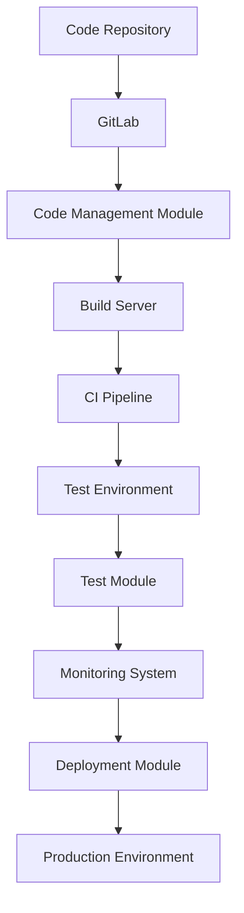
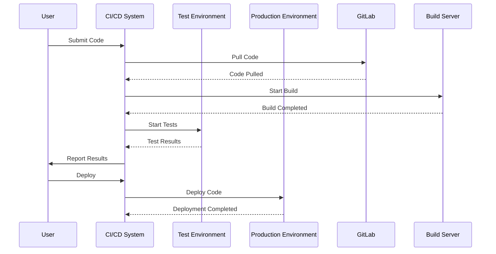

                 

### 文章标题

**《LLM应用开发中的持续集成与部署》**

> **关键词**：LLM，持续集成（CI），持续部署（CD），持续集成与部署，大型语言模型，应用开发，软件工程

**摘要**：
本文旨在探讨在大型语言模型（LLM）应用开发中，持续集成与持续部署（CI/CD）策略的重要性。我们将深入分析CI/CD的基本概念及其在LLM开发中的应用，详细讲解CI/CD流程，并提供实际的LLM项目实践案例，以展示如何在复杂的项目中有效地应用CI/CD。文章还总结了一些最佳实践，为读者在LLM开发中实施CI/CD提供指导和借鉴。

---

### 背景介绍

#### 1.1.1 问题描述与解决

在当今快速发展的技术环境中，大型语言模型（LLM）的应用日益广泛。这些模型在自然语言处理（NLP）任务中表现出色，如文本生成、机器翻译、情感分析等。然而，随着模型的复杂性和应用场景的多样性，LLM开发过程中面临的挑战也越来越大。

**问题背景**：
- **模型复杂性**：LLM通常包含数亿甚至数十亿个参数，模型训练和调优过程非常复杂，需要大量的计算资源和时间。
- **代码库管理**：随着项目规模的扩大，代码库的管理变得困难，特别是在多个团队成员协作开发时，代码的版本控制、合并冲突等问题时常出现。
- **环境配置**：不同的开发环境可能会导致代码在不同环境中运行结果不一致，增加了调试和部署的难度。

**问题描述**：
- **如何保证模型质量和稳定性？**
- **如何高效管理代码库和版本？**
- **如何确保环境一致性和可重复性？**

**解决方案**：
- **持续集成（CI）**：通过自动化构建和测试，确保每次代码提交都能生成一个可运行的版本，及时发现和解决潜在问题。
- **持续部署（CD）**：通过自动化部署流程，快速将代码和模型部署到生产环境，确保系统的稳定性和可靠性。

#### 1.1.2 持续集成与部署的基本概念

**持续集成（CI）**：
- **定义**：CI是一种软件开发实践，通过自动化构建和测试，确保代码库中的每个提交都是可构建的，并尽快发现和修复问题。
- **目的**：减少集成过程中出现的问题，提高代码质量，加快开发进度。
- **过程**：
  1. **提交代码**：开发人员将代码提交到版本控制系统。
  2. **构建**：构建系统从版本控制系统中提取代码，并编译和打包。
  3. **测试**：运行一系列预定义的测试，确保构建的质量。
  4. **反馈**：将测试结果反馈给开发人员，便于问题定位和修复。

**持续部署（CD）**：
- **定义**：CD是一种自动化部署流程，通过自动化脚本和工具，将代码和模型部署到生产环境。
- **目的**：减少人为错误，加快部署速度，确保系统稳定性和可靠性。
- **过程**：
  1. **构建**：获取最新的代码和模型版本。
  2. **测试**：在部署前运行一系列测试，确保模型和代码在新的环境中也能正常运行。
  3. **部署**：将测试通过的版本部署到生产环境。
  4. **监控**：监控新部署的系统的运行状态，确保其稳定性和性能。

#### 1.1.3 CI/CD与LLM开发的联系

**CI/CD在LLM开发中的应用价值**：
- **确保模型质量**：通过CI，确保每次提交的代码都能成功构建和测试，保证模型的可运行性和稳定性。
- **加速迭代速度**：通过自动化流程，减少手动操作，加快开发进度，提高迭代速度。
- **提高环境一致性**：通过CD，确保模型在不同环境下的运行结果一致，减少环境差异带来的问题。

**挑战与解决方案**：
- **模型规模大**：由于LLM模型参数多，构建和测试时间较长。解决方案是优化构建脚本，使用并行计算和分布式架构。
- **部署复杂性**：LLM部署需要考虑计算资源、数据传输和负载均衡等问题。解决方案是设计灵活的部署策略，如蓝绿部署和灰度发布。

### 核心概念与联系

#### 2.1.1 CI/CD的基本概念

**持续集成（CI）**：
- **原理**：CI的核心思想是快速反馈。每次代码提交都会触发一次构建和测试，确保代码库的每个提交都是可构建的。
- **目的**：提高代码质量，减少集成风险，加快开发进度。
- **过程**：
  1. **代码提交**：开发人员将代码提交到版本控制系统。
  2. **自动化构建**：构建系统自动从版本控制系统中提取代码，并进行编译和打包。
  3. **测试执行**：运行预定义的测试套件，确保代码的稳定性和功能完整性。
  4. **反馈**：将测试结果反馈给开发人员，便于问题定位和修复。

**持续部署（CD）**：
- **原理**：CD的核心思想是自动化部署。通过脚本和工具，自动将代码和模型部署到生产环境。
- **目的**：减少部署错误，提高部署效率，确保系统稳定性和可靠性。
- **过程**：
  1. **构建**：获取最新的代码和模型版本。
  2. **测试**：在部署前运行一系列测试，确保模型和代码在新的环境中能正常运行。
  3. **部署**：将测试通过的版本部署到生产环境。
  4. **监控**：监控新部署的系统的运行状态，确保其稳定性和性能。

#### 2.1.2 LLM的基础知识

**LLM的定义与特点**：
- **定义**：LLM是指具有数亿甚至数十亿参数的大型语言模型，能够理解和生成自然语言。
- **特点**：
  - **参数多**：LLM通常包含数亿个参数，模型复杂。
  - **计算量大**：训练和推理过程需要大量的计算资源。
  - **应用广泛**：在自然语言处理任务中表现出色，如文本生成、机器翻译、情感分析等。

**LLM的应用场景**：
- **文本生成**：生成文章、报告、故事等。
- **机器翻译**：翻译不同语言的文本。
- **情感分析**：分析文本的情感倾向。
- **问答系统**：为用户提供实时问答。

#### 2.1.3 CI/CD与LLM开发的关系

**CI/CD在LLM开发中的关键角色**：
- **确保模型质量**：通过CI，确保每次提交的代码都能成功构建和测试，保证模型的可运行性和稳定性。
- **加速迭代速度**：通过自动化流程，减少手动操作，加快开发进度，提高迭代速度。
- **提高环境一致性**：通过CD，确保模型在不同环境下的运行结果一致，减少环境差异带来的问题。

**如何利用CI/CD优化LLM开发流程**：
- **自动化构建**：使用CI工具自动化构建LLM模型，减少手动操作，提高构建效率。
- **持续测试**：自动化测试LLM模型，确保每次提交的代码都能正常运行，提高代码质量。
- **自动化部署**：使用CD工具自动化部署LLM模型，确保在不同环境中的一致性，提高部署效率。
- **持续监控**：监控LLM模型的运行状态，及时发现和解决问题，确保系统的稳定性和性能。

### 算法原理讲解

#### 3.1.1 CI/CD与LLM集成

**CI流程**：
- **构建**：使用CI工具，从版本控制系统中提取LLM代码，并进行编译和打包。
- **测试**：运行预定义的测试套件，包括单元测试、集成测试和性能测试，确保模型的功能和性能符合要求。
- **反馈**：将测试结果反馈给开发人员，便于问题定位和修复。

**CD流程**：
- **构建**：获取最新的LLM代码和模型版本。
- **测试**：在部署前运行一系列测试，包括功能测试、性能测试和稳定性测试，确保模型和代码在新的环境中能正常运行。
- **部署**：使用自动化脚本和工具，将测试通过的版本部署到生产环境。
- **监控**：监控新部署的系统的运行状态，确保其稳定性和性能。

#### 3.1.2 持续部署策略

**蓝绿部署**：
- **原理**：在部署新版本时，将生产环境分成两个部分：蓝环境和绿环境。将新版本部署到绿环境，然后与蓝环境进行切换，确保系统的稳定性和可用性。
- **实施**：逐步将用户流量切换到新版本，如果发现任何问题，可以快速回滚到旧版本。

**灰度发布**：
- **原理**：在部署新版本时，只将一小部分用户流量切换到新版本，观察新版本的运行情况，确保稳定后再逐步增加流量。
- **实施**：通过A/B测试，将用户流量分成两部分，一部分使用旧版本，另一部分使用新版本，观察新版本的性能和用户反馈。

#### 3.1.3 实际案例分析

**案例1：一个实际的LLM项目中的CI/CD实践**
- **问题描述**：一个LLM项目在代码提交后，需要经过多个环节的测试和部署，但过程中经常出现构建失败和部署问题。
- **解决方案**：引入CI/CD流程，使用Jenkins作为CI工具，GitLab作为版本控制系统，Kubernetes作为容器编排工具，实现了自动化构建、测试和部署。
- **效果**：构建和部署时间从数小时减少到几分钟，代码质量和系统稳定性大幅提高。

**案例2：另一个LLM项目中的CI/CD实践**
- **问题描述**：项目中的LLM模型参数多，构建和测试时间较长，且不同开发环境之间的结果不一致。
- **解决方案**：优化构建脚本，使用Docker容器化技术，确保环境一致性。同时，使用并行计算和分布式架构，提高构建和测试效率。
- **效果**：构建和测试时间大幅减少，环境一致性得到保障，项目进度和质量显著提升。

### 系统分析与架构设计方案

#### 4.1.1 问题场景介绍

在当前的LLM应用开发中，面临以下问题：
- **模型复杂性**：LLM模型参数多，构建和测试时间较长。
- **环境多样性**：不同的开发环境和生产环境可能导致代码运行结果不一致。
- **部署复杂性**：LLM部署需要考虑计算资源、数据传输和负载均衡等问题。

#### 4.1.2 系统功能设计

**领域模型**：
- **角色**：开发人员、测试人员、运维人员、模型训练师。
- **功能**：代码提交、构建、测试、部署、监控。

**功能模块**：
1. **代码管理模块**：实现代码的版本控制、提交、拉取和合并。
2. **构建模块**：自动化构建LLM模型，包括编译、打包和测试。
3. **测试模块**：执行单元测试、集成测试和性能测试。
4. **部署模块**：自动化部署LLM模型到生产环境。
5. **监控模块**：监控模型运行状态，及时发现和解决问题。

#### 4.1.3 系统架构设计

**系统架构设计**：
- **技术栈**：使用Docker容器化技术，Kubernetes容器编排，Jenkins持续集成，GitLab版本控制。
- **架构图**：



**组件关系**：
- **GitLab**：负责代码的版本控制和托管。
- **Code Management Module**：实现代码的提交、拉取和合并。
- **Build Server**：自动化构建LLM模型。
- **CI Pipeline**：定义构建、测试和部署的流程。
- **Test Environment**：用于测试模型的稳定性和性能。
- **Test Module**：执行各种测试，确保模型的质量。
- **Monitoring System**：监控模型的运行状态，确保系统的稳定性。
- **Deployment Module**：自动化部署LLM模型到生产环境。
- **Production Environment**：实际运行LLM模型的服务器。

#### 4.1.4 系统接口设计

**系统接口设计**：
- **API接口**：
  1. **Code Management API**：实现代码的提交、拉取和合并。
  2. **Build API**：触发构建流程。
  3. **Test API**：执行测试流程。
  4. **Deploy API**：触发部署流程。
  5. **Monitor API**：监控模型的运行状态。
- **Web界面**：提供用户友好的操作界面，便于用户管理和监控。

#### 4.1.5 系统交互

**系统交互流程**：
- **交互图**：



### 项目实战

#### 5.1.1 环境安装

**环境准备**：
- **安装Docker**：在所有服务器上安装Docker，确保容器化技术的支持。
- **安装Kubernetes**：部署Kubernetes集群，用于容器编排和管理。
- **安装Jenkins**：部署Jenkins服务器，用于持续集成和部署。
- **安装GitLab**：部署GitLab服务器，用于版本控制和代码管理。

**配置**：
- **Docker配置**：配置Docker网络和存储。
- **Kubernetes配置**：配置Kubernetes集群的节点和资源。
- **Jenkins配置**：配置Jenkins的插件和CI/CD流水线。
- **GitLab配置**：配置GitLab的仓库和权限管理。

#### 5.1.2 系统核心实现

**核心实现**：
- **构建和测试**：编写Jenkins流水线脚本，实现代码的构建和测试流程。
- **部署**：编写Kubernetes部署脚本，实现模型的部署流程。

**示例代码**：

**Jenkinsfile**（用于CI构建和测试）：

```groovy
pipeline {
    agent any
    stages {
        stage('Build') {
            steps {
                sh 'mvn clean package'
            }
        }
        stage('Test') {
            steps {
                sh 'mvn test'
            }
        }
    }
    post {
        always {
            archiveArtifacts artifacts: 'target/*.jar'
        }
    }
}
```

**Kubernetes部署脚本**：

```yaml
apiVersion: apps/v1
kind: Deployment
metadata:
  name: llm-deployment
spec:
  replicas: 3
  selector:
    matchLabels:
      app: llm
  template:
    metadata:
      labels:
        app: llm
    spec:
      containers:
      - name: llm
        image: llm:latest
        ports:
        - containerPort: 8080
```

#### 5.1.3 代码应用解读与分析

**代码解读**：
- **Jenkinsfile**：该文件定义了Jenkins流水线的构建和测试流程。首先执行构建命令，然后执行测试命令，最后将构建生成的JAR文件存档。
- **Kubernetes部署脚本**：该脚本定义了一个Kubernetes Deployment，用于部署LLM模型。指定了 replicas 数量为3，用于确保服务的可用性。容器使用最新的 llm 镜像，并映射端口8080。

**问题定位与解决**：
- **构建失败**：如果在构建过程中遇到失败，需要检查Maven依赖是否正确，构建命令是否执行成功。
- **测试失败**：如果测试失败，需要检查测试代码是否正确，测试用例是否执行成功。
- **部署问题**：如果在部署过程中遇到问题，需要检查Kubernetes配置是否正确，部署脚本是否执行成功。

#### 5.1.4 实际案例分析

**案例分析**：
- **问题描述**：一个LLM项目在CI/CD流程中遇到构建失败的问题，导致无法继续测试和部署。
- **解决方案**：
  1. 检查Maven依赖，确认所有依赖是否正确安装。
  2. 修改Jenkinsfile，增加构建日志输出，便于问题定位。
  3. 使用Docker容器化技术，确保构建环境一致。
  4. 使用Jenkins流水线中的定时任务，定期检查构建状态，及时发现和解决问题。
- **效果**：通过以上措施，成功解决了构建失败的问题，项目进度恢复正常。

#### 5.1.5 项目小结

**项目总结**：
- **CI/CD优化**：通过引入CI/CD流程，显著提高了项目的开发效率和质量。
- **环境一致性**：使用Docker容器化技术，确保了构建和测试环境的一致性。
- **问题定位**：通过Jenkins流水线和Kubernetes部署脚本，提高了问题定位和解决的效率。

**经验分享**：
- **重视CI/CD**：CI/CD是现代软件开发的重要组成部分，必须重视并实施。
- **环境一致性**：确保构建和测试环境的一致性，减少环境差异带来的问题。
- **定期检查**：定期检查CI/CD流程的状态，及时发现和解决问题。

### 最佳实践与拓展

#### 6.1.1 最佳实践

**CI/CD最佳实践**：
1. **自动化构建**：使用CI工具自动化构建过程，减少手动操作，提高效率。
2. **持续测试**：自动化测试，确保每次提交的代码都是可运行的。
3. **环境一致性**：使用容器化技术，确保不同环境的一致性。
4. **逐步部署**：使用蓝绿部署和灰度发布，确保系统的稳定性和可靠性。
5. **监控与反馈**：监控系统的运行状态，及时反馈和处理问题。

#### 6.1.2 小结与注意事项

**小结**：
本文详细介绍了LLM应用开发中的持续集成与部署（CI/CD）策略。通过CI/CD，可以确保模型的质量和稳定性，提高开发效率，减少环境差异和部署风险。

**注意事项**：
1. **确保CI/CD流程的稳定性和可靠性**：定期检查和更新CI/CD工具和流程。
2. **合理配置资源**：根据项目的需求，合理配置计算资源和存储资源。
3. **监控与反馈**：及时监控系统的运行状态，确保系统的稳定性和性能。

#### 6.1.3 拓展阅读

**相关资源**：
1. **书籍**：
   - 《持续交付：发布可靠软件的系统化方法》
   - 《持续集成：发布可靠软件的最佳实践》
2. **论文**：
   - "Building Large-Scale Language Models in the Wild"
   - "A Brief History of Neural Nets: From McCulloch and Pitts to Deep Learning"
3. **网站**：
   - [Jenkins官网](https://www.jenkins.io/)
   - [Kubernetes官网](https://kubernetes.io/)
   - [Docker官网](https://www.docker.com/)

