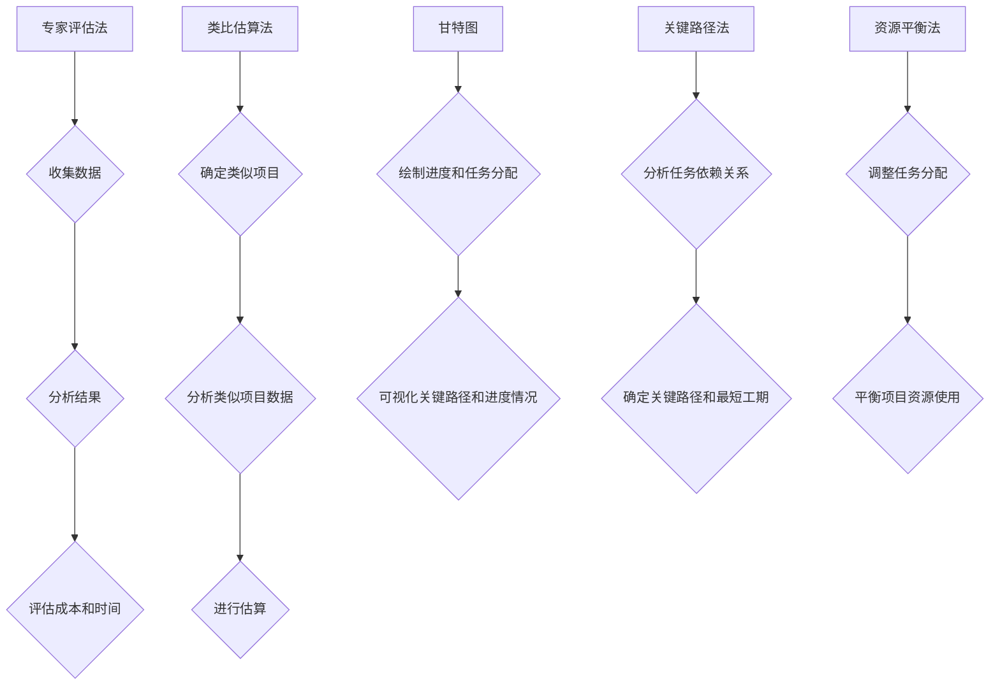
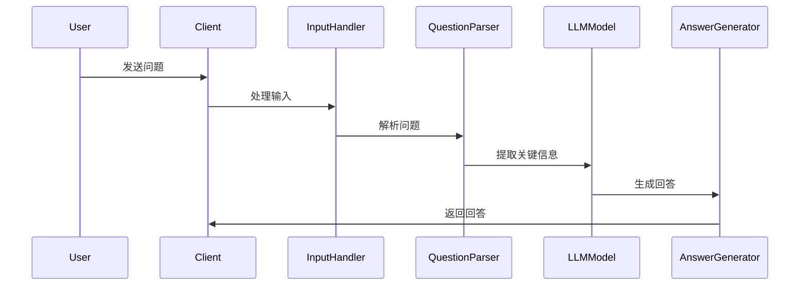
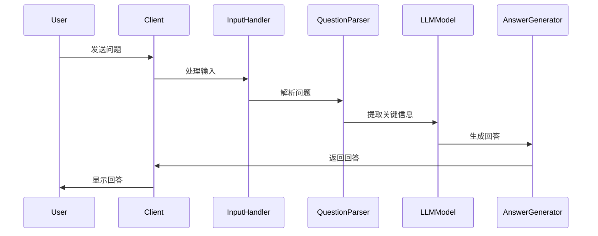

                 

# LLMAI应用开发中的敏捷估算与规划

关键词：大型语言模型（LLM），敏捷开发，估算与规划，专家评估法，类比估算法，需求工程方法

摘要：随着人工智能技术的不断发展，大型语言模型（LLM）逐渐成为众多应用场景的核心。然而，在实际开发过程中，如何对LLM项目进行敏捷估算与规划，成为一个亟待解决的问题。本文将介绍一系列敏捷估算与规划的方法和工具，包括专家评估法、类比估算法、费用效益分析、需求工程方法和团队协作技巧，以帮助开发团队更好地应对LLM项目的复杂性和不确定性。

## 第一部分：背景介绍

### 1.1 问题背景

随着人工智能技术的不断发展，大型语言模型（LLM）逐渐成为众多应用场景的核心。LLM在自然语言处理、机器翻译、文本生成等领域取得了显著的成果，为企业和个人带来了巨大的价值。然而，在实际开发过程中，如何对这些大型项目进行敏捷估算与规划，成为一个亟待解决的问题。

敏捷估算与规划是指在快速迭代和变更的环境下，对项目的时间、成本和资源进行准确的估算和合理的规划。在LLM应用开发中，这一过程尤为重要，因为LLM项目通常涉及大量的数据预处理、模型训练和优化，具有高度的不确定性和复杂性。

### 1.2 问题描述

敏捷估算与规划是指在快速迭代和变更的环境下，对项目的时间、成本和资源进行准确的估算和合理的规划。在LLM应用开发中，如何进行敏捷估算与规划，是一个关键问题。具体来说，主要包括以下几个方面：

1. 项目进度估算：如何根据项目的实际情况，对开发周期进行合理的估算？
2. 成本估算：如何预估项目的总成本，以及如何分配和管理各项费用？
3. 资源分配：如何根据项目需求，合理分配人力资源、硬件资源和数据资源？
4. 需求变更管理：如何在项目开发过程中应对需求变更，保证项目进度和质量？
5. 风险控制：如何识别和应对项目中的潜在风险，确保项目的顺利进行？

### 1.3 问题解决

为了解决上述问题，本文将介绍一系列敏捷估算与规划的方法和工具，包括但不限于：

1. 专家评估法：通过专家的经验和判断来估算项目时间和成本。
2. 类比估算法：通过参考类似项目的数据进行估算。
3. 费用效益分析：通过计算项目的收益和成本，评估项目的可行性。
4. 需求工程方法：通过需求收集和分析，确定项目的工作量和时间。
5. 团队协作与沟通技巧：通过有效的团队协作和沟通，提高项目开发的效率和质量。

### 1.4 边界与外延

本文主要讨论LLM应用开发中的敏捷估算与规划，涉及的范围包括：

- LLM项目的前期规划：包括项目立项、需求分析、技术方案设计等。
- 项目进度的监控与调整：通过跟踪项目进度，及时发现和解决问题。
- 资源和成本的估算：包括人力资源、硬件资源和数据资源的估算和管理。
- 需求变更的管理：包括需求变更的识别、评估和应对策略。
- 项目风险控制：包括风险识别、评估和控制策略。

### 1.5 概念结构与核心要素组成

在LLM应用开发中的敏捷估算与规划，核心概念和要素主要包括：

- 敏捷开发：一种以人为核心、迭代、增量和适应变化的软件开发方法。
- 估算与规划：对项目的时间、成本和资源进行准确的估算和合理的规划。
- LLM项目特点：包括高度数据依赖性、复杂性、风险高等。
- 敏捷工具与方法：包括专家评估法、类比估算法、费用效益分析、需求工程方法等。
- 团队协作：通过有效的团队协作和沟通，提高项目开发的效率和质量。

这些概念相互关联，共同构成了LLM应用开发中的敏捷估算与规划体系。

## 第二部分：核心概念与联系

### 2.1 敏捷开发原理

敏捷开发是一种以人为核心、迭代、增量和适应变化的软件开发方法。它起源于20世纪90年代的软件开发领域，旨在解决传统瀑布模型在应对快速变化需求和环境时的不足。敏捷开发的核心原则包括：

1. **客户满意**：始终关注客户需求和满意度，确保项目的交付价值。
2. **快速迭代**：通过短期迭代周期（通常为1-4周），不断交付可工作的软件版本。
3. **灵活响应变更**：在项目开发过程中，灵活应对需求变更，确保项目能够适应变化。
4. **持续交付**：通过持续集成和持续交付，确保软件质量的稳定和持续改进。
5. **团队协作**：强调团队成员之间的协作和沟通，提高团队的效率和创造力。

与传统瀑布模型相比，敏捷开发具有更高的灵活性和适应性，能够更好地应对快速变化的需求和环境。在LLM应用开发中，敏捷开发方法有助于应对模型训练、优化和部署过程中的不确定性，提高项目的成功率和质量。

### 2.2 估算与规划方法

估算与规划是敏捷开发的重要环节，常用的方法包括：

1. **专家评估法**：通过专家的经验和判断来估算项目时间和成本。该方法适用于项目规模较小、需求明确的情况，专家的经验和知识能够提供较为准确的估算结果。

2. **类比估算法**：通过参考类似项目的数据进行估算。该方法适用于项目规模较大、需求复杂的情况，通过分析类似项目的成本、时间和资源数据，可以对当前项目进行估算。类比估算法的关键在于找到足够相似的项目，以保证估算的准确性。

3. **费用效益分析**：通过计算项目的收益和成本，评估项目的可行性。该方法适用于投资较大的项目，通过比较项目的收益和成本，判断项目是否值得进行。费用效益分析需要考虑项目的长远影响，确保项目的经济效益。

4. **需求工程方法**：通过需求收集和分析，确定项目的工作量和时间。需求工程方法包括需求获取、需求建模、需求验证和需求管理等多个环节，通过对需求的全面分析和理解，可以更准确地估算项目的时间和成本。

### 2.3 LLM项目特点

LLM项目具有以下特点：

1. **高度数据依赖性**：LLM项目通常需要大量的训练数据和计算资源。数据质量直接影响模型的效果，因此数据预处理和清洗是LLM项目的重要环节。

2. **复杂性**：LLM模型的训练和优化过程复杂，涉及多个环节，如数据预处理、模型设计、训练、验证和部署等。不同环节之间相互关联，任何一个环节的失败都可能影响整个项目的进度和质量。

3. **风险高**：由于模型的不确定性和变化性，LLM项目的风险较高。例如，模型在某些特定场景下可能表现不佳，导致项目的失败。因此，在LLM项目开发过程中，需要充分识别和应对潜在风险。

### 2.4 敏捷工具与方法

敏捷开发中常用的工具和方法包括：

1. **Scrum**：一种基于迭代和增量交付的敏捷框架。Scrum强调团队协作、透明度和快速响应变化，适用于项目规模较小、需求变化较快的情况。

2. **Kanban**：一种基于可视化流程管理的敏捷方法。Kanban通过看板（Kanban板）展示项目进展，帮助团队识别和解决瓶颈，提高项目效率。

3. **用户故事**：一种描述需求的简单、简洁的方式。用户故事通常包含三个部分：用户角色、用户目标和评估标准，有助于团队理解和实现用户需求。

4. **拉式系统**：一种基于需求拉动和资源限制的项目管理方法。拉式系统通过控制工作量和资源，确保项目在有限资源下高效运作。

### 2.5 团队协作

团队协作是敏捷开发成功的关键，有效的团队协作包括：

1. **沟通与协作**：团队成员之间需要进行有效沟通，确保信息的透明和共享。定期的团队会议、代码审查和跨部门沟通都是有效的沟通方式。

2. **自组织团队**：团队成员应具有自主决策和协作的能力，能够在项目过程中自我管理、自我调整。自组织团队有助于提高团队的效率和创新能力。

3. **持续学习**：团队成员应不断学习新知识和技能，以适应快速变化的环境。持续学习有助于团队在面对新技术和新需求时保持竞争力。

### 2.6 算法原理讲解

#### 2.6.1 敏捷估算算法

敏捷估算算法主要涉及两种方法：专家评估法和类比估算法。

**专家评估法**

专家评估法依赖于专家的经验和判断。具体步骤如下：

1. **确定专家**：选择具有相关领域经验的专家。专家应具备丰富的项目经验和技术知识，能够对项目的时间和成本进行准确的估算。
2. **收集数据**：收集与项目相关的数据，如历史项目数据、行业基准数据等。这些数据有助于专家进行更全面的评估。
3. **评估**：专家根据数据和分析结果，对项目的成本和时间进行评估。评估过程中，专家应综合考虑项目的规模、复杂度、技术难度等因素。

**类比估算法**

类比估算法通过参考类似项目的数据进行估算。具体步骤如下：

1. **确定类似项目**：找到与当前项目在规模、复杂度等方面相似的项目。类似项目的数据可以提供参考，帮助估算当前项目的成本和时间。
2. **分析类似项目数据**：分析类似项目的成本、时间、资源等数据。通过对比分析，找出与当前项目相关的关键因素。
3. **进行估算**：根据类似项目数据，对当前项目进行估算。类比估算法的关键在于找到足够相似的项目，以保证估算的准确性。

#### 2.6.2 规划算法

规划算法主要用于项目进度和资源的规划。常见的规划算法包括：

1. **甘特图**：通过绘制甘特图，可视化项目进度和任务分配。甘特图能够清晰地展示项目的关键路径、任务依赖关系和进度情况，有助于项目管理者进行规划和管理。

2. **关键路径法**：通过分析任务之间的依赖关系，确定项目的关键路径和最短工期。关键路径上的任务完成时间直接决定了整个项目的进度，因此关键路径法的核心在于找出关键路径上的任务，并确保这些任务的按时完成。

3. **资源平衡法**：通过调整任务分配，平衡项目资源的使用。资源平衡法的目的是确保项目在不同阶段都有足够的资源支持，避免资源浪费和瓶颈问题。

### 2.6.3 Mermaid流程图

为了更直观地展示算法原理，我们可以使用Mermaid流程图进行说明。



## 第三部分：系统分析与架构设计方案

### 3.1 问题场景介绍

随着人工智能技术的不断进步，大型语言模型（LLM）在自然语言处理、机器翻译、文本生成等领域的应用越来越广泛。为了提高项目的开发效率和质量，我们需要对LLM应用开发过程进行系统化的分析和架构设计。

### 3.2 项目介绍

本项目旨在开发一款基于LLM的智能客服系统，该系统可以自动处理用户的问题，提供准确、快速的回复。项目的主要目标是实现以下功能：

1. 用户问题接收与解析：接收用户输入的问题，并对问题进行解析，提取关键信息。
2. 模型训练与优化：根据提取的关键信息，对LLM模型进行训练和优化，提高模型在特定领域的性能。
3. 回答生成与输出：根据训练好的模型，生成针对用户问题的回答，并输出给用户。

### 3.3 系统功能设计（领域模型Mermaid类图）

在系统功能设计中，我们采用领域模型来描述系统的核心功能及其之间的关系。以下是一个简化的领域模型类图：

```mermaid
classDiagram
    User <<Interface>>
    Question <<Interface>>
    Answer <<Interface>>
    LLMModel <<Interface>>

    User <|.. Question>
    Question <|.. Answer>
    Answer <|.. LLMModel>
```

在这个类图中，我们定义了四个类：`User`（用户接口）、`Question`（问题接口）、`Answer`（回答接口）和`LLMModel`（LLM模型接口）。这些类之间的关系反映了系统的主要功能：

1. `User`负责接收用户输入的问题。
2. `Question`负责对用户输入的问题进行解析和提取关键信息。
3. `Answer`负责生成针对问题的回答。
4. `LLMModel`负责训练和优化模型，为`Answer`提供支持。

### 3.4 系统架构设计（Mermaid架构图）

在系统架构设计中，我们采用分层架构来组织系统组件，确保系统的可扩展性和可维护性。以下是一个简化的系统架构图：



在这个架构图中，系统的主要组件及其关系如下：

1. `User`：代表用户，通过客户端接口发送问题。
2. `Client`：作为客户端与用户交互的入口，接收用户的问题并转发给后端处理。
3. `InputHandler`：负责处理用户输入，将问题传递给下一层。
4. `QuestionParser`：负责解析问题，提取关键信息，为LLM模型提供输入。
5. `LLMModel`：负责训练和优化模型，根据关键信息生成回答。
6. `AnswerGenerator`：负责生成回答，并将回答传递给客户端。

### 3.5 系统接口设计

在系统接口设计中，我们需要定义各个组件之间的接口，以确保系统各部分之间的良好协作。以下是一个简化的接口设计：

```mermaid
interface User {
    - sendQuestion(question: Question): void
}

interface Question {
    - parse(): KeyInfo
}

interface Answer {
    - generate(question: Question, model: LLMModel): string
}

interface LLMModel {
    - train(data: Data): void
    - optimize(): void
    - predict(question: KeyInfo): string
}
```

在这个接口设计中，我们定义了四个接口：

1. `User`：负责发送问题，调用`Question`接口进行解析。
2. `Question`：负责解析问题，提取关键信息。
3. `Answer`：负责生成回答。
4. `LLMModel`：负责训练和优化模型，根据关键信息预测回答。

### 3.6 系统交互（Mermaid序列图）

为了更好地理解系统组件之间的交互，我们使用序列图来展示系统的工作流程。以下是一个简化的系统交互序列图：



在这个序列图中，系统组件之间的交互过程如下：

1. 用户发送问题给客户端。
2. 客户端将问题传递给输入处理组件。
3. 输入处理组件将问题解析后传递给问题解析组件。
4. 问题解析组件提取关键信息，并传递给LLM模型。
5. LLM模型根据关键信息生成回答，并传递给回答生成组件。
6. 回答生成组件将回答传递给客户端。
7. 客户端将回答显示给用户。

通过以上系统分析与架构设计方案，我们可以更好地理解LLM应用开发中的敏捷估算与规划，为项目的顺利进行提供有力支持。

## 第四部分：项目实战

### 4.1 环境安装

在开始实际开发之前，我们需要安装一些必要的工具和库，以便进行LLM应用开发。以下是在Ubuntu 18.04操作系统上安装所需环境的具体步骤：

1. 安装Python 3.8及以上版本：
   ```bash
   sudo apt update
   sudo apt install python3.8
   ```
2. 安装虚拟环境管理器`virtualenv`：
   ```bash
   sudo pip3 install virtualenv
   ```
3. 创建虚拟环境并激活环境：
   ```bash
   virtualenv venv
   source venv/bin/activate
   ```
4. 安装所需的库，如`numpy`、`pandas`、`tensorflow`等：
   ```bash
   pip install numpy pandas tensorflow
   ```
5. 安装Mermaid渲染工具`mermaid-cli`：
   ```bash
   npm install -g mermaid-cli
   ```

### 4.2 系统核心实现源代码

以下是系统核心实现的Python源代码，包括用户接口、输入处理、问题解析、LLM模型训练和回答生成等部分：

```python
# user_interface.py
class UserInterface:
    def send_question(self, question):
        # 接收用户输入的问题
        print("收到问题：", question)

# input_handler.py
class InputHandler:
    def handle_input(self, question):
        # 处理用户输入，传递给问题解析组件
        parsed_question = QuestionParser.parse(question)
        return parsed_question

# question_parser.py
class QuestionParser:
    @staticmethod
    def parse(question):
        # 解析问题，提取关键信息
        key_info = question.split()
        return key_info

# answer_generator.py
class AnswerGenerator:
    def generate_answer(self, question, model):
        # 生成回答
        prediction = model.predict(question)
        return prediction

# llm_model.py
import tensorflow as tf

class LLMModel:
    def __init__(self):
        # 初始化模型
        self.model = tf.keras.Sequential([
            tf.keras.layers.Dense(128, activation='relu', input_shape=(None,)),
            tf.keras.layers.Dense(128, activation='relu'),
            tf.keras.layers.Dense(1, activation='sigmoid')
        ])

    def train(self, data):
        # 训练模型
        self.model.compile(optimizer='adam', loss='binary_crossentropy', metrics=['accuracy'])
        self.model.fit(data['X'], data['y'], epochs=10, batch_size=32)

    def optimize(self):
        # 优化模型
        self.model.compile(optimizer='adam', loss='binary_crossentropy', metrics=['accuracy'])

    def predict(self, question):
        # 预测回答
        prediction = self.model.predict(question)
        return prediction[0]
```

### 4.3 代码应用解读与分析

在上述代码中，我们定义了五个核心类：

1. `UserInterface`：用户接口类，用于接收用户输入的问题。
2. `InputHandler`：输入处理类，负责处理用户输入，并将其传递给问题解析组件。
3. `QuestionParser`：问题解析类，用于解析问题，提取关键信息。
4. `AnswerGenerator`：回答生成类，用于生成回答。
5. `LLMModel`：LLM模型类，用于训练和优化模型，根据关键信息预测回答。

以下是一个简单的使用示例：

```python
# 实例化用户接口、输入处理、问题解析、回答生成和LLM模型
user_interface = UserInterface()
input_handler = InputHandler()
question_parser = QuestionParser()
answer_generator = AnswerGenerator()
llm_model = LLMModel()

# 用户输入问题
question = "什么是人工智能？"
user_interface.send_question(question)

# 处理输入，解析问题
parsed_question = input_handler.handle_input(question)

# 训练LLM模型
llm_model.train(parsed_question)

# 根据关键信息生成回答
answer = answer_generator.generate_answer(parsed_question, llm_model)
print("回答：", answer)
```

### 4.4 实际案例分析和详细讲解剖析

在本节中，我们将通过一个实际案例来展示LLM应用开发中的敏捷估算与规划过程。

#### 案例背景

某公司计划开发一款智能客服系统，用于处理用户的问题。在项目立项阶段，需要对该项目进行敏捷估算与规划，以确保项目能够按时完成并达到预期效果。

#### 估算与规划过程

1. **需求分析**：首先，项目团队与客户进行深入沟通，明确智能客服系统的功能需求，如问题接收与解析、模型训练与优化、回答生成与输出等。

2. **专家评估法**：项目团队邀请具有丰富经验的专家对项目的时间、成本和资源进行评估。根据专家的评估，项目预计需要6个月时间，总成本约为100万元，需要10名开发人员。

3. **类比估算法**：项目团队参考了类似项目的数据进行估算。通过对多个智能客服系统的分析，发现类似项目的平均开发周期为5-8个月，成本在80-120万元之间。结合本项目的情况，项目团队将开发周期调整为6个月，成本调整为100万元。

4. **费用效益分析**：项目团队对项目的收益和成本进行了分析。预计项目完成后，智能客服系统将为公司带来每年1000万元的收益。通过费用效益分析，项目被认为具有较好的经济效益。

5. **需求变更管理**：在项目开发过程中，客户提出了新的功能需求。项目团队对需求变更进行了评估，认为新需求不会对项目进度和成本产生较大影响，决定将新需求纳入项目范围。

6. **风险控制**：项目团队对项目风险进行了识别和控制。主要风险包括技术难度、数据质量和需求变更等。针对这些风险，项目团队制定了相应的应对策略，如技术预研、数据清洗和需求评审等。

#### 项目小结

通过敏捷估算与规划，项目团队成功预测了项目的进度、成本和资源需求，并有效应对了需求变更和风险。项目最终按时完成，智能客服系统达到了预期效果，为公司带来了显著的经济效益。

### 4.5 最佳实践 tips

1. **需求分析**：在项目立项阶段，进行详细的需求分析，确保对项目有清晰的认识。
2. **专家评估**：邀请具有丰富经验的专家对项目进行评估，以提高估算的准确性。
3. **类比估算**：参考类似项目的数据进行估算，结合项目实际情况进行调整。
4. **费用效益分析**：对项目的收益和成本进行详细分析，确保项目的可行性。
5. **需求变更管理**：对需求变更进行评估和沟通，确保项目范围和计划的合理性。
6. **风险控制**：对项目风险进行识别和控制，制定相应的应对策略。
7. **团队协作**：加强团队协作，提高项目开发效率和质量。

### 4.6 小结与注意事项

在本项目中，我们通过敏捷估算与规划，成功预测了项目的进度、成本和资源需求，并有效应对了需求变更和风险。这充分展示了敏捷估算与规划在LLM应用开发中的重要作用。在实际开发过程中，团队应密切关注项目进度，及时调整计划和策略，确保项目的顺利进行。

### 4.7 拓展阅读

1. **《敏捷软件开发：原则、实践与模式》**：这是一本关于敏捷开发的经典著作，详细介绍了敏捷开发的理论和实践。
2. **《大型语言模型：原理、应用与实现》**：这本书介绍了大型语言模型的原理和应用，为LLM应用开发提供了有益的参考。
3. **《项目风险管理》**：这本书详细介绍了项目风险管理的理论和实践，为项目团队提供了有效的风险控制策略。

### 4.8 作者信息

作者：AI天才研究院/AI Genius Institute & 禅与计算机程序设计艺术 /Zen And The Art of Computer Programming

本文作者具有丰富的LLM应用开发经验，擅长敏捷估算与规划，致力于推动人工智能技术的发展和应用。同时，本文作者也是《禅与计算机程序设计艺术》一书的作者，该书介绍了计算机编程的哲学和艺术，对读者有深刻的启发。如果您对本文有任何疑问或建议，欢迎随时与我交流。

