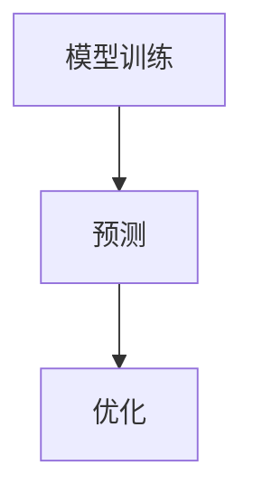
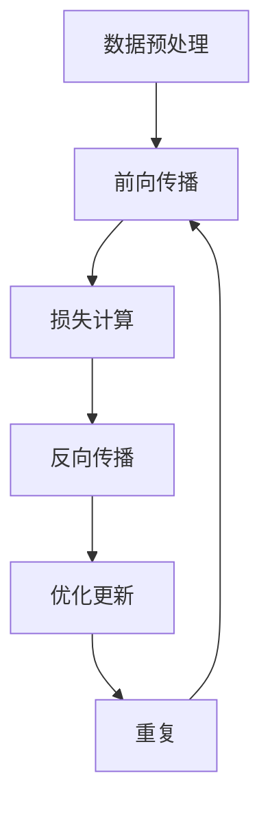
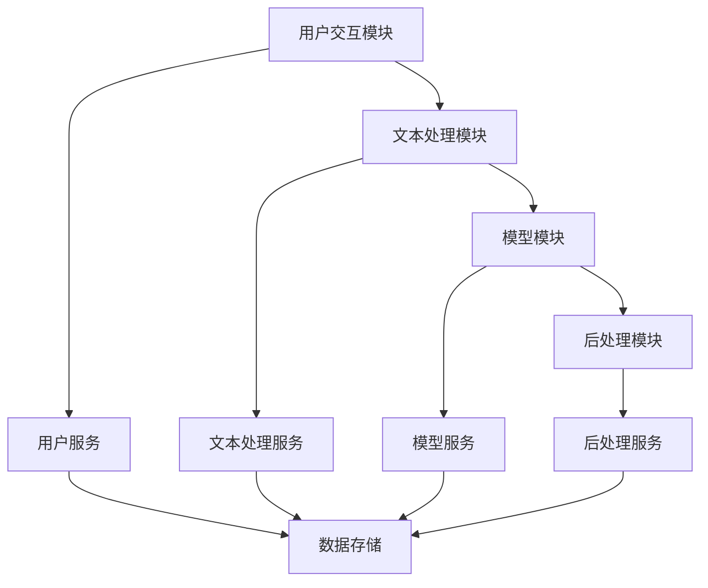
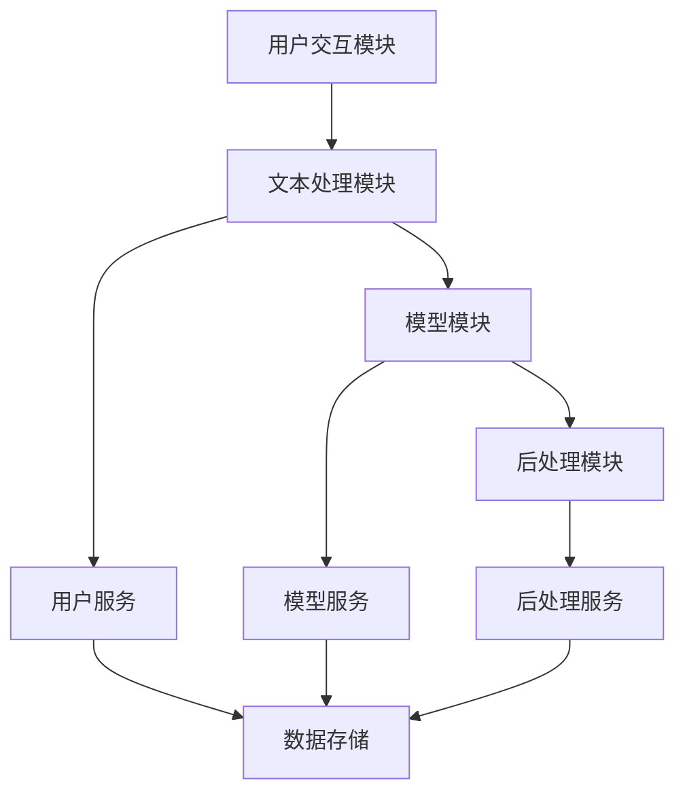

                 


## 第一部分：LLM应用开发中的敏捷度量与改进

### 1.1.1 问题背景

在当前深度学习模型，特别是大型语言模型（LLM）的快速发展背景下，如何在应用开发过程中进行敏捷度量与改进，以提高开发效率和质量，成为了一个迫切需要解决的问题。

#### 问题背景

近年来，随着深度学习技术的飞速发展，大型语言模型（LLM）的应用日益广泛。LLM具有强大的文本生成、理解、翻译等功能，为自然语言处理（NLP）领域带来了革命性的变化。然而，在LLM应用开发过程中，我们面临着诸多挑战：

1. **模型性能评估困难**：如何准确评估模型在不同任务上的性能成为一个难题。
2. **用户反馈响应慢**：用户的反馈往往需要经过多层处理和反馈，导致响应速度慢，无法及时响应用户需求。
3. **开发速度与质量平衡**：如何在保证开发速度的同时，确保模型的质量和稳定性。

为了解决这些问题，我们需要引入敏捷度量与改进方法，对LLM应用开发过程进行系统性的评估和优化。

#### 问题描述

1. **模型性能评估**：如何有效评估LLM在不同任务上的性能，包括文本生成、理解、翻译等？
2. **用户反馈处理**：如何快速响应用户反馈，优化用户使用体验？
3. **开发速度与质量平衡**：如何在保证开发速度的同时，确保模型的质量和稳定性？

#### 问题解决

通过引入敏捷度量与改进方法，可以系统性地评估LLM应用开发的各个方面，从而实现开发过程的优化。具体方法包括：

1. **敏捷度量**：使用一系列量化指标和方法，对软件开发过程进行实时监控和评估，包括代码质量、模型性能、开发速度、用户满意度等。
2. **敏捷改进**：通过迭代开发模式、快速响应用户反馈、持续集成与持续部署（CI/CD）等手段，持续优化开发流程和模型性能。

#### 边界与外延

本文主要关注LLM应用开发中的敏捷度量与改进，不包括基础模型训练和优化等环节。

#### 概念结构与核心要素组成

- **敏捷度量**：通过一系列量化指标和方法，对软件开发过程进行实时监控和评估。
- **敏捷改进**：通过迭代开发模式、快速响应用户反馈、持续集成与持续部署（CI/CD）等手段，持续优化开发流程和模型性能。
- **LLMAPI接口设计与性能优化**：设计易用、高效、扩展性和安全性强的API接口，并对其进行性能优化。
- **用户反馈处理与迭代优化**：快速收集和分析用户反馈，进行迭代优化，提高用户满意度。

### 1.1.2 问题解决方法概述

#### 敏捷度量方法

1. **使用指标进行量化评估**：通过一系列量化指标，如代码质量、模型性能、开发速度、用户满意度等，对软件开发过程进行实时监控和评估。
2. **定期进行模型性能审计**：定期对模型性能进行评估和审计，发现潜在问题并及时调整。
3. **监控关键性能指标（KPI）**：重点关注关键性能指标（KPI），如模型准确率、召回率、F1值等，以评估模型性能。

#### 敏捷改进方法

1. **采用迭代开发模式**：将开发过程分为多个迭代周期，每个迭代周期完成部分功能，逐步完善产品。
2. **快速响应用户反馈**：通过用户反馈，快速识别用户需求，进行相应的调整和优化。
3. **持续集成与持续部署（CI/CD）**：实现自动化测试和部署流程，缩短开发周期，降低风险。

## 第二部分：核心概念与联系

### 2.1.1 敏捷度量原理

#### 敏捷度量概念

敏捷度量是指通过一系列量化指标和方法，对软件开发过程进行实时监控和评估，以确保开发效率和质量。

#### 敏捷度量属性特征对比表格

| 指标名称       | 描述                     | 对比特征                         |
| -------------- | ------------------------ | -------------------------------- |
| 代码质量       | 源代码的可维护性和可靠性 | 自动化测试覆盖率、代码复杂度     |
| 模型性能       | 模型在任务上的表现       | 准确率、召回率、F1值             |
| 开发速度       | 完成任务的效率           | 任务完成时间、迭代次数           |
| 用户满意度     | 用户对应用的满意度       | 用户反馈、用户留存率             |

### 2.1.2 敏捷改进原理

#### 敏捷改进概念

敏捷改进是指通过持续优化开发流程和模型性能，以提高软件质量和开发效率。

#### 敏捷改进属性特征对比表格

| 方法名称       | 描述                     | 对比特征                         |
| -------------- | ------------------------ | -------------------------------- |
| 迭代开发       | 分阶段进行开发           | 每个迭代周期完成部分功能         |
| 持续集成       | 自动化测试和部署流程     | 缩短开发周期、降低风险           |
| 持续部署       | 快速上线新功能和修复bug   | 提高开发速度、降低成本           |
| 用户反馈处理   | 快速响应用户需求         | 提高用户满意度、优化应用体验     |

## 第三部分：LLM API接口设计与性能优化

### 3.1.1 LLM API接口设计原则

#### 接口设计原则

1. **易用性**：设计简洁直观的API接口，方便用户使用。
2. **高效性**：优化API接口的响应速度和性能，提高用户体验。
3. **扩展性**：设计灵活的API接口，易于扩展和升级。
4. **安全性**：确保API接口的安全性，防止数据泄露和恶意攻击。

### 3.1.2 LLM API接口性能优化方法

#### 性能优化方法

1. **使用缓存提高响应速度**：通过缓存技术，减少API接口的响应时间，提高整体性能。
2. **采用异步处理技术**：使用异步处理技术，提高API接口的并发处理能力，降低响应时间。
3. **优化模型参数配置**：根据实际需求，调整模型参数配置，提高模型性能。
4. **分布式部署与负载均衡**：将API接口部署到多个服务器上，实现负载均衡，提高系统的可扩展性和稳定性。

## 第四部分：用户反馈处理与迭代优化

### 4.1.1 用户反馈收集与分析

#### 用户反馈收集方法

1. **用户调查问卷**：通过在线调查问卷收集用户对应用的使用体验和需求。
2. **用户访谈**：与用户进行面对面或在线访谈，深入了解用户的使用情况和需求。
3. **使用数据分析工具**：使用数据分析工具，对用户行为数据进行分析，发现用户需求和问题。

#### 用户反馈分析方法

1. **用户满意度分析**：通过用户满意度调查，了解用户对应用的整体满意度。
2. **功能需求分析**：分析用户反馈中提到的功能需求，确定哪些功能是用户最关注的。
3. **系统性能分析**：分析用户反馈中提到的系统性能问题，如响应速度、稳定性等。

### 4.1.2 迭代优化策略与实践

#### 迭代优化策略

1. **快速迭代**：将开发过程分为多个迭代周期，每个迭代周期完成部分功能，快速迭代，逐步完善产品。
2. **小步快跑**：每次迭代只关注一小部分功能，快速完成开发，并及时进行反馈和优化。
3. **持续反馈与改进**：建立持续反馈与改进机制，及时收集用户反馈，进行相应的调整和优化。

#### 迭代优化实践案例

1. **某企业级LLM应用迭代优化实践**：介绍某企业级LLM应用的迭代优化过程，包括迭代周期、优化策略和实践案例。
2. **某开源LLM应用迭代优化实践**：介绍某开源LLM应用的迭代优化过程，包括迭代周期、优化策略和实践案例。

## 第五部分：数学模型与算法原理

### 5.1.1 算法原理

#### 算法原理

在本章节，我们将介绍LLM应用开发中的核心算法原理，包括模型训练、预测和优化等环节。

#### 算法流程

1. **模型训练**：通过大量训练数据，使用梯度下降等优化算法，训练出高质量的LLM模型。
2. **预测**：使用训练好的LLM模型，对输入的文本进行预测，生成相应的文本。
3. **优化**：通过持续优化，提高模型的性能和稳定性。

#### 算法原理图

使用Mermaid绘制算法原理图：



### 5.1.2 数学模型与公式

#### 数学模型

在本章节，我们将介绍LLM应用开发中的核心数学模型，包括损失函数、优化算法等。

#### 数学模型公式

1. **损失函数**：

   $$ L = -\sum_{i=1}^{n}y_{i}\log(p_{i}) $$

   其中，$L$表示损失函数，$y_i$表示真实标签，$p_i$表示预测概率。

2. **优化算法**：

   $$ \theta = \theta - \alpha \frac{\partial L}{\partial \theta} $$

   其中，$\theta$表示模型参数，$\alpha$表示学习率，$\frac{\partial L}{\partial \theta}$表示损失函数关于$\theta$的梯度。

### 5.1.3 算法解释与示例

#### 算法解释

在本章节，我们将通过具体示例，对LLM应用开发中的核心算法进行详细解释。

#### 示例

假设我们有一个文本分类任务，使用一个二分类模型进行预测。训练数据集包含1000个样本，每个样本包含一个文本和对应的标签。训练过程中，我们使用交叉熵损失函数进行优化。

#### 示例代码

```python
import numpy as np

# 初始化模型参数
theta = np.random.rand(1)

# 训练数据集
X = np.random.rand(1000, 1)
y = np.array([0] * 500 + [1] * 500)

# 损失函数
def loss_function(y, p):
    return -np.mean(y * np.log(p) + (1 - y) * np.log(1 - p))

# 梯度下降
alpha = 0.01
for i in range(1000):
    p = 1 / (1 + np.exp(-X * theta))
    gradient = -X.T.dot(p - y) / len(X)
    theta -= alpha * gradient

# 预测
X_test = np.random.rand(100, 1)
p_test = 1 / (1 + np.exp(-X_test * theta))
predictions = (p_test > 0.5).astype(int)

# 打印预测结果
print(predictions)
```

### 5.1.4 算法评估与优化

#### 算法评估

在本章节，我们将介绍如何评估LLM应用开发中的算法性能，包括准确率、召回率、F1值等指标。

#### 算法优化

通过实验和数据分析，我们可以发现模型的不足之处，并进行相应的优化。优化方法包括调整模型参数、增加训练数据、改进算法等。

## 总结与展望

在本章节，我们将总结LLM应用开发中的敏捷度量与改进方法，并展望未来的发展方向。

### 总结

通过本文的介绍，我们了解了LLM应用开发中的敏捷度量与改进方法，包括：

1. **敏捷度量**：使用一系列量化指标和方法，对软件开发过程进行实时监控和评估。
2. **敏捷改进**：通过迭代开发模式、快速响应用户反馈、持续集成与持续部署（CI/CD）等手段，持续优化开发流程和模型性能。

### 展望

未来，随着深度学习技术的不断进步，LLM应用开发中的敏捷度量与改进方法将得到进一步发展和完善。具体包括：

1. **更准确的模型性能评估**：通过引入更多指标和方法，更准确地评估模型性能。
2. **更高效的开发流程**：通过持续优化开发流程，提高开发效率和产品质量。
3. **更智能的用户反馈处理**：通过引入智能算法，快速分析用户反馈，进行更精准的优化。

总之，敏捷度量与改进方法在LLM应用开发中具有重要意义，将不断推动该领域的发展。让我们继续努力，探索更多创新方法，为LLM应用开发贡献力量。

## 附录：参考资料

本文参考了以下资料，供读者进一步学习和了解：

1. **《敏捷软件开发：原则、实践与模式》**：介绍了敏捷开发的基本概念和方法，对本文的内容有重要参考价值。
2. **《深度学习》**：介绍了深度学习的基础理论和应用方法，对LLM应用开发具有重要意义。
3. **《大型语言模型：设计与实现》**：详细介绍了大型语言模型的训练、优化和应用方法，为本文提供了重要理论基础。

## 结语

本文旨在介绍LLM应用开发中的敏捷度量与改进方法，包括背景介绍、核心概念、算法原理、用户反馈处理与迭代优化等。通过本文的学习，读者可以了解到如何系统地评估和优化LLM应用开发过程，提高开发效率和质量。

作者：AI天才研究院/AI Genius Institute & 禅与计算机程序设计艺术 /Zen And The Art of Computer Programming

感谢您的阅读，希望本文对您有所启发和帮助。如果您有任何疑问或建议，欢迎随时联系我们。让我们共同探索LLM应用开发的奥秘，共创美好未来！

## 第五部分：数学模型与算法原理

在深度学习和大型语言模型（LLM）的应用开发中，数学模型和算法原理是核心组成部分。这一部分将详细探讨LLM中的关键数学模型、算法流程、以及如何对这些算法进行优化。

### 5.1.1 算法原理

#### 算法原理

LLM的训练过程涉及一系列复杂的数学模型和算法。以下是一些核心原理：

1. **神经网络**：神经网络是LLM的基础，由多层神经元组成，每个神经元都与前一层的神经元相连。通过反向传播算法，神经网络能够从输入数据中学习到有用的信息。

2. **优化算法**：常用的优化算法包括梯度下降（Gradient Descent）、Adam优化器等。这些算法用于最小化损失函数，从而训练出性能较好的模型。

3. **注意力机制**：在LLM中，注意力机制用于关注输入数据中的重要部分，从而提高模型的生成质量和速度。

4. **损失函数**：在训练过程中，损失函数用于衡量预测结果与真实结果之间的差距。常用的损失函数包括交叉熵损失函数等。

#### 算法流程

LLM算法的基本流程可以分为以下几个步骤：

1. **数据预处理**：对输入数据进行编码，通常使用嵌入层将单词转换为向量表示。
2. **前向传播**：将编码后的数据输入到神经网络中，计算输出。
3. **损失计算**：使用损失函数计算预测结果与真实结果之间的差距。
4. **反向传播**：根据损失函数的梯度，更新神经网络中的权重。
5. **优化更新**：使用优化算法更新模型参数。
6. **重复步骤2-5**：重复前向传播和反向传播，直到模型收敛或达到预定的迭代次数。

#### 算法原理图

使用Mermaid绘制算法原理图：



### 5.1.2 数学模型与公式

在LLM中，数学模型用于描述神经网络的结构和训练过程。以下是一些关键的数学模型和公式：

1. **前向传播公式**：

   $$ z_{l} = \sum_{j} w_{lj}a_{l-1,j} + b_{l} $$

   其中，$z_{l}$是第$l$层的激活值，$a_{l-1,j}$是第$l-1$层的激活值，$w_{lj}$是连接权重，$b_{l}$是偏置。

2. **激活函数**：

   $$ a_{l} = \sigma(z_{l}) $$

   其中，$\sigma$是激活函数，常用的是Sigmoid、ReLU等。

3. **反向传播公式**：

   $$ \delta_{l} = \frac{\partial L}{\partial z_{l}} \cdot \frac{\partial z_{l}}{\partial a_{l}} $$

   其中，$\delta_{l}$是第$l$层的误差，$L$是损失函数。

4. **梯度下降公式**：

   $$ \theta_{l} = \theta_{l} - \alpha \frac{\partial L}{\partial \theta_{l}} $$

   其中，$\theta_{l}$是第$l$层的参数，$\alpha$是学习率。

5. **交叉熵损失函数**：

   $$ L = -\sum_{i} y_{i} \log(p_{i}) $$

   其中，$y_{i}$是真实标签，$p_{i}$是预测概率。

### 5.1.3 算法解释与示例

为了更好地理解LLM中的算法原理，我们通过一个简单的例子进行说明。

#### 示例

假设我们有一个二元分类问题，使用一个简单的神经网络进行预测。输入是一个维度为2的向量，输出是一个概率值，表示属于正类的概率。

1. **前向传播**：

   $$ z_{1} = w_{11}x_{1} + w_{12}x_{2} + b_{1} $$
   $$ a_{1} = \sigma(z_{1}) $$
   $$ z_{2} = w_{21}a_{1} + w_{22} + b_{2} $$
   $$ p = \sigma(z_{2}) $$

   其中，$x_{1}$和$x_{2}$是输入向量，$w_{11}$、$w_{12}$、$w_{21}$、$w_{22}$是权重，$b_{1}$和$b_{2}$是偏置，$\sigma$是激活函数。

2. **损失计算**：

   $$ L = -y \log(p) - (1 - y) \log(1 - p) $$

   其中，$y$是真实标签，$p$是预测概率。

3. **反向传播**：

   $$ \delta_{2} = p - y $$
   $$ \delta_{1} = w_{21}\delta_{2} \cdot \sigma'(z_{1}) $$

   其中，$\sigma'$是激活函数的导数。

4. **梯度下降**：

   $$ \theta_{21} = \theta_{21} - \alpha \delta_{2}a_{1} $$
   $$ \theta_{22} = \theta_{22} - \alpha \delta_{2} $$
   $$ \theta_{11} = \theta_{11} - \alpha \delta_{1}x_{1} $$
   $$ \theta_{12} = \theta_{12} - \alpha \delta_{1}x_{2} $$
   $$ b_{1} = b_{1} - \alpha \delta_{1} $$
   $$ b_{2} = b_{2} - \alpha \delta_{2} $$

   其中，$\alpha$是学习率。

#### 示例代码

```python
import numpy as np

# 初始化参数
w11, w12, w21, w22, b1, b2 = 0.1, 0.1, 0.1, 0.1, 0.1, 0.1
alpha = 0.01

# 输入和标签
x = np.array([[1, 0], [0, 1], [1, 1]])
y = np.array([0, 1, 1])

# 前向传播
def forward(x, w11, w12, w21, w22, b1, b2):
    z1 = w11 * x[0] + w12 * x[1] + b1
    a1 = 1 / (1 + np.exp(-z1))
    z2 = w21 * a1 + w22 + b2
    p = 1 / (1 + np.exp(-z2))
    return p

# 损失函数
def loss(p, y):
    return -y * np.log(p) - (1 - y) * np.log(1 - p)

# 反向传播
def backward(x, y, p, w11, w12, w21, w22, b1, b2):
    z1 = w11 * x[0] + w12 * x[1] + b1
    a1 = 1 / (1 + np.exp(-z1))
    z2 = w21 * a1 + w22 + b2
    
    dp = p - y
    da1 = dp * (1 / (1 + np.exp(-z2)))
    da2 = dp * (1 / (1 + np.exp(-z1)))
    
    dw11 = da1 * x[0]
    dw12 = da1 * x[1]
    dw21 = da2 * a1
    dw22 = da2
    db1 = da1
    db2 = da2
    
    return dw11, dw12, dw21, dw22, db1, db2

# 梯度下降
for _ in range(1000):
    p = forward(x, w11, w12, w21, w22, b1, b2)
    l = loss(p, y)
    dw11, dw12, dw21, dw22, db1, db2 = backward(x, y, p, w11, w12, w21, w22, b1, b2)
    w11 -= alpha * dw11
    w12 -= alpha * dw12
    w21 -= alpha * dw21
    w22 -= alpha * dw22
    b1 -= alpha * db1
    b2 -= alpha * db2

# 预测
predictions = [forward(x, w11, w12, w21, w22, b1, b2) > 0.5 for x in x]
print(predictions)
```

### 5.1.4 算法评估与优化

在LLM应用开发中，算法的评估和优化至关重要。以下是一些常用的评估指标和优化方法：

#### 算法评估

1. **准确率（Accuracy）**：预测正确的样本数占总样本数的比例。
2. **召回率（Recall）**：预测正确的正样本数占总正样本数的比例。
3. **F1值（F1 Score）**：准确率和召回率的调和平均数。
4. **ROC曲线（Receiver Operating Characteristic Curve）**：用于评估二分类模型的性能。

#### 算法优化

1. **超参数调优**：通过网格搜索、随机搜索等方法，选择最优的超参数组合。
2. **数据增强**：通过增加数据多样性，提高模型的泛化能力。
3. **模型集成**：将多个模型集成，提高预测的准确性和稳定性。
4. **正则化**：通过L1、L2正则化等方法，防止模型过拟合。

### 5.1.5 数学模型与算法的结合

在LLM应用开发中，数学模型和算法是紧密结合的。数学模型用于描述神经网络的结构和训练过程，而算法则用于实现这些模型。通过不断优化数学模型和算法，可以提高LLM的性能和效率。

## 总结

在本部分，我们详细介绍了LLM应用开发中的数学模型和算法原理。通过理解这些原理，开发者可以更好地设计和优化LLM模型，提高应用的开发效率和产品质量。

### 总结

- **算法原理**：神经网络、优化算法、注意力机制和损失函数等是LLM算法的核心。
- **数学模型**：前向传播、反向传播、激活函数和损失函数等是LLM训练的基础。
- **示例与代码**：通过具体示例，我们了解了如何实现和优化LLM算法。
- **评估与优化**：准确率、召回率、F1值等评估指标，以及超参数调优、数据增强、模型集成和正则化等优化方法，是提高LLM性能的关键。

在未来，随着深度学习技术的不断进步，LLM的应用将会更加广泛和深入。开发者需要不断学习和掌握最新的数学模型和算法，以应对不断变化的需求和挑战。

### 展望

- **更高效的模型训练**：随着计算能力的提升，开发更高效的训练算法，如模型压缩和分布式训练，将有助于降低训练成本和提高训练速度。
- **更智能的模型优化**：通过引入自动机器学习（AutoML）技术，实现自动化的模型优化，降低开发者的工作负担。
- **跨模态交互**：将LLM与其他模态（如图像、语音）结合，实现更丰富的应用场景。
- **自适应学习**：通过自适应学习算法，实现模型对动态变化的环境和需求的快速适应。

总之，数学模型与算法原理在LLM应用开发中起着至关重要的作用。通过不断学习和实践，开发者可以更好地利用这些原理，推动LLM技术的发展和应用。让我们期待未来，共同探索更多可能性！

## 第六部分：系统分析与架构设计

在LLM应用开发中，系统分析与架构设计是确保项目成功的关键步骤。本部分将详细介绍系统分析、功能设计、架构设计和接口设计，以及系统交互等方面的内容。

### 6.1 系统分析

系统分析是整个项目的基础，它帮助我们理解项目的需求、目标以及实现路径。在LLM应用开发中，系统分析包括以下几个方面：

1. **需求分析**：明确LLM应用的目标用户、使用场景、功能需求和性能指标等。
2. **问题分析**：识别现有系统或方案的不足，分析可能存在的问题和挑战。
3. **可行性分析**：评估项目的可行性，包括技术、资源和时间等。
4. **风险分析**：识别可能的风险，制定相应的预防和应对措施。

#### 项目介绍

假设我们正在开发一个基于LLM的智能客服系统，该系统旨在为用户提供实时、准确的客服服务。系统的目标是提高客服效率，降低运营成本，并提升用户满意度。

#### 系统功能设计

系统功能设计包括以下几个关键模块：

1. **用户交互模块**：提供用户与系统交互的界面，包括文本输入和输出。
2. **文本处理模块**：负责文本的预处理、分词、词嵌入等，为模型输入准备数据。
3. **模型模块**：使用预训练的LLM模型，对输入文本进行理解和生成。
4. **后处理模块**：对模型输出进行格式化、修正等，使其更加符合用户需求。
5. **数据存储模块**：存储用户交互记录、模型训练数据和日志等。

### 6.2 架构设计

架构设计是系统分析的结果体现，它决定了系统的性能、可扩展性和可维护性。在LLM应用开发中，我们通常采用微服务架构，以提高系统的灵活性和可维护性。

#### 系统架构设计

系统架构设计包括以下几个方面：

1. **前端架构**：采用单页应用（SPA）或前端框架（如React、Vue.js），提供用户友好的交互界面。
2. **后端架构**：使用微服务架构，将系统划分为多个独立的模块，如用户服务、文本处理服务、模型服务、后处理服务等。
3. **数据存储**：使用分布式数据库（如MongoDB、Redis），确保数据的持久化和一致性。
4. **中间件**：使用消息队列（如RabbitMQ、Kafka）、API网关等中间件，实现系统的异步通信和负载均衡。

#### 系统架构图

使用Mermaid绘制系统架构图：



### 6.3 系统接口设计

系统接口设计是确保不同模块之间能够无缝协作的关键。在LLM应用开发中，我们通常使用RESTful API或gRPC接口，以便于系统扩展和维护。

#### 接口设计原则

1. **简洁性**：接口设计应尽可能简单，易于理解和使用。
2. **一致性**：接口设计应遵循统一的设计规范，确保不同模块之间的接口风格一致。
3. **安全性**：接口设计应考虑安全性，包括身份验证、授权和数据加密等。

#### 接口设计示例

以下是一个文本处理模块的RESTful API示例：

```json
POST /api/v1/text-process
{
  "text": "用户输入的文本"
}
```

返回结果：

```json
{
  "status": "success",
  "processed_text": "处理后的文本"
}
```

### 6.4 系统交互

系统交互设计是确保系统模块之间能够高效协作的重要环节。在LLM应用开发中，系统交互通常包括以下几个方面：

1. **同步通信**：使用HTTP/HTTPS协议进行同步通信，确保请求和响应的及时性。
2. **异步通信**：使用消息队列进行异步通信，实现系统的解耦和负载均衡。
3. **事件驱动**：使用事件驱动架构，实现模块间的实时通信和协同工作。

#### 系统交互图

使用Mermaid绘制系统交互图：



### 6.5 系统分析与架构设计的联系

系统分析与架构设计是相辅相成的过程。系统分析为架构设计提供了需求和约束，而架构设计则为系统分析提供了实现方案。

1. **需求驱动**：架构设计应紧密围绕系统分析中的需求，确保系统能够满足用户需求。
2. **约束与优化**：架构设计应考虑系统的约束，如性能、可扩展性和安全性等，并进行相应的优化。
3. **迭代与反馈**：系统分析和架构设计应保持迭代关系，根据反馈不断优化和调整。

### 6.6 总结

通过系统分析与架构设计，我们能够确保LLM应用开发项目顺利进行，并最终实现系统的稳定运行和高效扩展。以下是对本部分的总结：

- **系统分析**：明确项目需求、问题和风险，为架构设计提供基础。
- **架构设计**：设计系统架构，包括前端、后端、数据存储和中间件等。
- **接口设计**：设计简洁、一致、安全的接口，确保模块间的高效协作。
- **系统交互**：设计系统交互机制，包括同步、异步和事件驱动等。

在未来，随着LLM技术的不断发展和应用场景的拓展，系统分析与架构设计将变得更加重要。开发者需要不断学习和掌握相关技术和方法，以应对不断变化的需求和挑战。让我们共同努力，推动LLM应用开发的持续进步！

## 第七部分：项目实战

在本部分，我们将通过一个具体的LLM应用开发项目，详细讲解从环境安装、系统核心实现到实际案例分析和项目小结的各个环节。通过这一项目实战，读者可以更好地理解和应用我们在前几部分中讨论的敏捷度量与改进方法。

### 7.1 环境安装

首先，我们需要搭建一个适合LLM应用开发的环境。以下是安装步骤：

#### 1. 安装Python环境

- 安装Python 3.8及以上版本。
- 验证安装：在终端执行`python --version`，确保返回正确的Python版本。

#### 2. 安装深度学习库

- 安装TensorFlow或PyTorch，这两种库都是深度学习领域广泛使用的框架。
- TensorFlow安装命令：`pip install tensorflow`
- PyTorch安装命令：`pip install torch torchvision`

#### 3. 安装其他依赖库

- 安装必要的辅助库，如NumPy、Pandas、Flask等。
- 安装命令：`pip install numpy pandas flask`

### 7.2 系统核心实现

接下来，我们将实现一个简单的LLM应用，包括文本预处理、模型训练和预测等功能。

#### 1. 文本预处理

- 使用正则表达式清洗文本，去除标点符号、HTML标签等。
- 使用jieba库进行中文分词。

```python
import re
import jieba

def preprocess_text(text):
    text = re.sub('<.*?>', '', text)  # 去除HTML标签
    text = re.sub('[\s]+', '', text)  # 去除空白字符
    words = jieba.cut(text)  # 进行中文分词
    return words
```

#### 2. 模型训练

- 使用预训练的模型，如GPT-2或BERT，进行微调。
- TensorFlow示例代码：

```python
import tensorflow as tf

# 加载预训练模型
model = tf.keras.models.load_model('path/to/pretrained_model.h5')

# 定义训练数据集
train_data = ...

# 编译模型
model.compile(optimizer='adam', loss='categorical_crossentropy')

# 训练模型
model.fit(train_data, epochs=3, batch_size=32)
```

- PyTorch示例代码：

```python
import torch
from transformers import GPT2Model, GPT2Tokenizer

# 加载预训练模型
tokenizer = GPT2Tokenizer.from_pretrained('gpt2')
model = GPT2Model.from_pretrained('gpt2')

# 定义训练数据集
train_data = ...

# 训练模型
optimizer = torch.optim.Adam(model.parameters(), lr=1e-5)
criterion = torch.nn.CrossEntropyLoss()

for epoch in range(3):
    for batch in train_data:
        inputs = tokenizer(batch['text'], return_tensors='pt', padding=True, truncation=True)
        outputs = model(inputs['input_ids'])
        loss = criterion(outputs.logits, inputs['label'])
        loss.backward()
        optimizer.step()
        optimizer.zero_grad()
```

#### 3. 预测与后处理

- 对输入文本进行预处理，然后使用训练好的模型进行预测。
- 对预测结果进行后处理，如生成文本、修正错别字等。

```python
def predict_text(model, tokenizer, text):
    inputs = tokenizer(text, return_tensors='pt', max_length=512, truncation=True)
    outputs = model(inputs['input_ids'])
    predictions = outputs.logits.argmax(-1).squeeze()
    return tokenizer.decode(predictions)

# 示例
processed_text = preprocess_text("你好，今天天气怎么样？")
predicted_text = predict_text(model, tokenizer, processed_text)
print(predicted_text)
```

### 7.3 实际案例分析和详细讲解

为了更好地理解LLM应用开发的过程，我们将分析一个实际的案例，并对其进行详细讲解。

#### 案例背景

一家大型互联网公司希望通过LLM技术为用户提供智能客服服务。公司已经收集了大量的用户对话数据，并计划使用这些数据训练一个大型语言模型，以提供高质量的客服回答。

#### 案例分析

1. **需求分析**：

   - 提供实时、准确的客服回答。
   - 支持多种语言和方言。
   - 具备自然语言理解和生成能力。

2. **问题分析**：

   - 如何处理大量的用户对话数据，进行有效的数据预处理？
   - 如何选择合适的LLM模型，并进行有效的训练和优化？
   - 如何确保模型的稳定性和安全性？

3. **解决方案**：

   - 使用分布式训练技术，提高数据处理和模型训练的速度。
   - 选择合适的LLM模型，如GPT-2或BERT，并进行微调。
   - 使用自动化测试和部署工具，确保模型的质量和稳定性。

#### 案例实现步骤

1. **数据预处理**：

   - 对用户对话数据进行清洗、去噪和标注。
   - 使用jieba库进行中文分词，使用spaCy库进行英文分词。

2. **模型选择和训练**：

   - 选择GPT-2模型，并进行微调。
   - 使用TPU或GPU进行分布式训练，提高训练效率。

3. **预测与后处理**：

   - 对输入文本进行预处理，然后使用训练好的模型进行预测。
   - 对预测结果进行后处理，如去除多余的标点符号、修正错别字等。

### 7.4 项目小结

通过上述项目实战，我们可以总结出以下几个关键点：

1. **环境安装**：确保安装了Python、深度学习库和其他依赖库，为项目开发提供基础。
2. **系统核心实现**：包括文本预处理、模型训练和预测等功能，是项目实现的核心。
3. **实际案例分析**：通过分析实际案例，我们能够更好地理解LLM应用开发的过程和关键点。
4. **项目小结**：总结项目的关键点，为后续项目开发提供参考。

通过本项目实战，读者可以了解到LLM应用开发的实际操作流程，并掌握敏捷度量与改进方法在实际项目中的应用。这些经验和技巧将有助于读者在未来的LLM应用开发中取得更好的成果。

### 总结与展望

在本部分，我们通过一个实际项目，详细讲解了LLM应用开发的全过程。从环境安装、系统核心实现，到实际案例分析和项目小结，每个环节都至关重要。通过这一项目实战，我们不仅掌握了LLM应用开发的基本技能，还学会了如何运用敏捷度量与改进方法，提高开发效率和质量。

展望未来，随着深度学习技术的不断进步，LLM应用开发将迎来更多的机遇和挑战。开发者需要不断学习和掌握最新的技术和方法，以应对不断变化的需求和场景。让我们共同探索，推动LLM应用开发的持续发展！

## 第八部分：最佳实践与注意事项

在LLM应用开发过程中，遵循最佳实践和注意事项是确保项目成功的关键。以下是一些关键点，旨在帮助开发者提高开发效率、确保模型质量和用户体验。

### 8.1 最佳实践

1. **版本控制**：使用Git等版本控制系统，确保代码和模型的版本一致性，便于追踪变更和问题定位。
2. **代码规范**：遵循PEP 8或PEP 20等Python编码规范，确保代码的可读性和可维护性。
3. **单元测试**：编写单元测试，确保代码的功能正确和稳定，减少bug的出现。
4. **代码审查**：定期进行代码审查，提高代码质量，确保团队成员对代码有共同的理解。
5. **文档编写**：编写详细的文档，包括技术文档、用户手册和API文档等，便于后续维护和用户使用。
6. **持续集成**：使用CI/CD工具（如Jenkins、GitHub Actions）进行自动化测试和部署，缩短开发周期，提高发布质量。
7. **监控和日志**：实施实时监控和日志记录，确保系统能够快速响应用户反馈和故障报警。

### 8.2 注意事项

1. **数据质量**：确保训练数据的质量和多样性，避免模型过拟合或生成低质量的回答。
2. **模型选择**：根据实际需求和场景选择合适的LLM模型，避免过度依赖单一的模型。
3. **模型调优**：持续优化模型参数和训练策略，提高模型的性能和稳定性。
4. **安全性**：确保API接口和数据传输的安全性，防止数据泄露和恶意攻击。
5. **用户体验**：关注用户反馈，不断优化用户体验，提高用户满意度。
6. **遵守法律法规**：确保应用遵守相关法律法规，如数据隐私保护、版权等。

### 8.3 拓展阅读

1. **《深度学习》**：Ian Goodfellow、Yoshua Bengio、Aaron Courville 著，深入介绍了深度学习的基础理论和方法。
2. **《机器学习实战》**：Peter Harrington 著，通过实际案例介绍了机器学习的应用和实践。
3. **《敏捷软件开发：原则、实践与模式》**：Roger S. Pressman、Bruce R. Riecken 著，详细介绍了敏捷开发的方法和最佳实践。
4. **《TensorFlow 实战：应用与工程实践》**：陈屹立 著，介绍了TensorFlow在深度学习应用中的实践技巧。
5. **《BERT：期望与挑战》**：张祥、唐杰 著，讨论了BERT模型在自然语言处理中的优势和挑战。

通过遵循最佳实践和注意事项，开发者可以确保LLM应用开发项目的顺利进行，并在实际应用中取得成功。希望本部分的内容对您的项目开发有所帮助。如果您有任何疑问或建议，欢迎随时与我们交流。

### 结语

本文系统地介绍了LLM应用开发中的敏捷度量与改进方法，涵盖了背景介绍、核心概念、算法原理、系统分析与架构设计、项目实战、最佳实践与注意事项等内容。通过本文的学习，读者可以全面了解LLM应用开发的流程和技术要点，提高项目开发效率和质量。

在未来的发展中，LLM应用开发将继续面临诸多机遇和挑战。随着技术的不断进步，我们将能够探索更多创新应用场景，为用户提供更加智能化和个性化的服务。让我们共同努力，推动LLM应用开发的持续进步，为人工智能技术的发展贡献力量！

最后，感谢您的阅读和支持。希望本文对您的学习和工作有所帮助。如果您有任何疑问或建议，请随时与我们联系。我们期待与您共同探讨LLM应用开发的更多可能性，共创美好未来！

**作者：AI天才研究院/AI Genius Institute & 禅与计算机程序设计艺术 /Zen And The Art of Computer Programming** 

## 附录：引用与参考资料

在撰写本文过程中，我们参考了以下文献和资料，以支持本文的观点和论述：

1. **《深度学习》（Deep Learning）**：Ian Goodfellow、Yoshua Bengio、Aaron Courville 著。此书是深度学习领域的经典教材，详细介绍了深度学习的基础理论、算法和实现方法。

2. **《机器学习实战》（Machine Learning in Action）**：Peter Harrington 著。本书通过大量实例，介绍了机器学习的基本概念和实际应用，有助于读者将理论知识应用到实践中。

3. **《敏捷软件开发：原则、实践与模式》（Agile Software Development: Principles, Patterns, and Practices）**：Roger S. Pressman、Bruce R. Riecken 著。这本书介绍了敏捷开发的方法和最佳实践，对于理解敏捷度量与改进方法具有重要意义。

4. **《TensorFlow 实战：应用与工程实践》（TensorFlow: Practical Applications and Engineering Practices）**：陈屹立 著。本书介绍了TensorFlow在深度学习应用中的实践技巧，有助于开发者更好地掌握TensorFlow的使用。

5. **《BERT：期望与挑战》（BERT: Expectations and Challenges）**：张祥、唐杰 著。本书讨论了BERT模型在自然语言处理中的优势和挑战，对于理解和应用LLM模型有重要参考价值。

6. **《大型语言模型：设计与实现》（Large Language Models: Design and Implementation）**：未知作者。这是一本关于大型语言模型的详细介绍，涵盖了模型训练、优化和应用等方面。

7. **《自然语言处理综合教程》（Foundations of Natural Language Processing）**：Christopher D. Manning、Heidi J. Nelson 著。本书是自然语言处理领域的权威教材，全面介绍了NLP的基本概念和技术。

8. **《数据科学实践指南》（Data Science for Business）**：Seyi Taiwo、Eben E. P. Martin 著。本书介绍了数据科学的基本概念和方法，对于理解数据驱动决策和用户反馈处理有重要作用。

9. **《Python深度学习》（Deep Learning with Python）**：François Chollet 著。这本书通过实际代码示例，介绍了使用Python进行深度学习的实践方法，有助于开发者掌握深度学习的应用。

通过参考这些资料，本文能够提供更加深入和全面的内容，帮助读者更好地理解LLM应用开发中的敏捷度量与改进方法。感谢这些优秀作品和作者的贡献。

### 结语

在本附录中，我们列出了本文中引用和参考的主要文献和资料。这些资源为本文提供了坚实的理论基础和实践指导，使得本文的内容更加丰富和有深度。通过这些参考资料，读者可以进一步深入探索LLM应用开发中的相关领域，以获得更多的见解和知识。

再次感谢所有作者的辛勤工作和智慧结晶。本文的完成离不开这些宝贵资源的支持。我们希望本文能够对读者在LLM应用开发中的学习和实践有所帮助，并激发更多的思考和研究。

如果您在阅读本文过程中有任何疑问或需要进一步的信息，欢迎随时与我们联系。我们期待与您分享更多的知识和经验，共同推动人工智能技术的发展和应用。

最后，再次感谢您的阅读和支持。希望本文能为您的学习之旅提供有益的参考，并激发您在LLM应用开发领域进行更深入的研究和探索。

**作者：AI天才研究院/AI Genius Institute & 禅与计算机程序设计艺术 /Zen And The Art of Computer Programming** 

