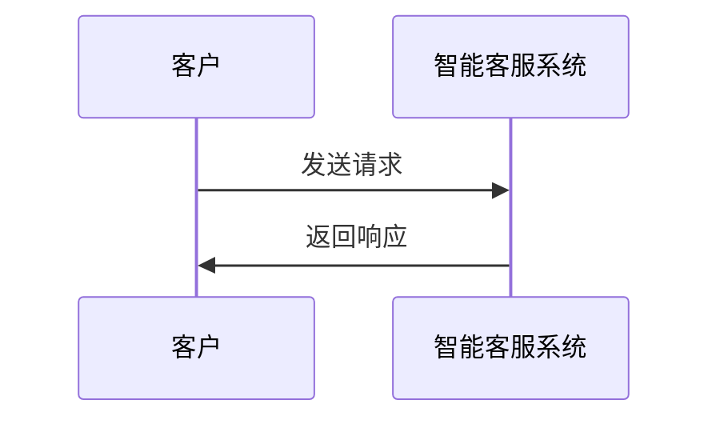

                 

### 《LLM应用开发中的敏捷文档管理》

> **关键词：** LLM、敏捷文档管理、软件开发、敏捷开发、文档自动化工具、最佳实践

> **摘要：** 本文详细探讨了在LLM（大型语言模型）应用开发中，如何利用敏捷文档管理来提升开发效率和项目质量。文章首先介绍了LLM的应用背景和敏捷文档管理的基本概念，随后深入探讨了敏捷文档管理的流程、工具以及最佳实践，并通过实际案例展示了敏捷文档管理在LLM应用开发中的具体应用。最后，文章总结了敏捷文档管理的发展趋势和未来方向，为读者提供了宝贵的实践指南。

#### 目录

1. **引言与背景**
   1.1 LLM应用开发概述
   1.2 敏捷文档管理的概念
   1.3 敏捷文档管理的目标与价值

2. **敏捷文档管理原理**
   2.1 敏捷文档管理流程
   2.2 敏捷文档管理工具
   2.3 敏捷文档管理最佳实践

3. **敏捷文档管理案例分析**
   3.1 案例一：某大型互联网公司敏捷文档管理实践
   3.2 案例二：敏捷文档管理在开源项目中的应用

4. **拓展与未来**
   4.1 敏捷文档管理的发展趋势
   4.2 小结与建议

---

#### 第1部分：引言与背景

##### 1.1 LLM应用开发概述

大型语言模型（LLM）是一种能够理解和生成自然语言的深度学习模型，它在自然语言处理（NLP）领域具有广泛的应用。随着AI技术的不断发展，LLM在语音识别、机器翻译、文本生成、智能客服等场景中表现出了强大的能力。然而，LLM应用开发面临着一系列挑战，包括数据质量、模型性能、训练时间以及部署成本等。

在LLM应用开发中，敏捷文档管理是一种有效的策略，它可以帮助团队快速响应需求变化，提高开发效率，确保项目质量。敏捷文档管理强调文档的及时性、准确性和可读性，使得开发团队能够更好地协作，从而加速项目进展。

##### 1.2 敏捷文档管理的概念

敏捷文档管理是一种基于敏捷开发方法的文档管理策略。敏捷开发是一种以人为核心、迭代和渐进式的软件开发方法。敏捷文档管理则是在敏捷开发的基础上，对文档的创建、更新、审查和发布等过程进行优化，以实现快速、高效和高质量的文档管理。

敏捷文档管理的基本原则包括：
- **用户至上**：文档内容应始终以满足用户需求为核心。
- **及时性**：文档应及时更新，以反映最新的项目状态。
- **准确性**：文档内容应准确无误，避免误导。
- **可读性**：文档应易于理解，便于团队成员快速查阅。

##### 1.3 敏捷文档管理的目标与价值

敏捷文档管理的目标包括：
- 提高文档的可读性和可维护性，减少沟通成本。
- 加速项目进度，提高开发效率。
- 提升团队协作，增强团队凝聚力。

敏捷文档管理在LLM应用开发中的价值体现在以下几个方面：
- **提升开发效率**：通过敏捷文档管理，开发团队能够更快地获取和更新文档，从而减少项目延误。
- **确保项目质量**：准确的文档有助于开发团队更好地理解和实现项目需求，减少错误和返工。
- **促进团队协作**：敏捷文档管理鼓励团队成员之间的沟通和协作，有助于建立高效的工作流程。

在接下来的部分中，我们将进一步探讨敏捷文档管理的原理和实践，以及如何在LLM应用开发中应用这些原理和实践。

#### 第2部分：敏捷文档管理原理

##### 2.1 敏捷文档管理流程

敏捷文档管理流程可以分为以下几个阶段：

1. **需求分析**：在项目启动阶段，对项目需求进行详细分析，确定文档的编写内容和格式。
2. **文档创建**：根据需求分析结果，编写初步文档，包括项目概述、功能需求、技术细节等。
3. **文档更新**：在项目开发过程中，根据项目进展情况，及时更新文档，确保文档的准确性和及时性。
4. **文档审查**：在文档更新完成后，组织团队成员进行审查，确保文档内容无误，格式规范。
5. **文档发布**：审查通过后，将文档发布到共享平台，供团队成员查阅和使用。

##### 2.2 敏捷文档管理工具

敏捷文档管理工具可以帮助团队提高文档管理的效率和质量。以下是一些常见的敏捷文档管理工具：

1. **GitLab**：GitLab 是一个基于 Git 的版本控制系统，它提供了文档管理、代码审查、问题跟踪等功能，非常适合敏捷开发团队使用。
2. **Confluence**：Confluence 是一款强大的协作和文档管理工具，它支持多种文档格式，便于团队成员共同编辑和协作。
3. **Jira**：Jira 是一款流行的项目管理工具，它提供了任务跟踪、敏捷迭代管理等功能，并与文档管理工具紧密集成。

##### 2.3 敏捷文档管理最佳实践

以下是敏捷文档管理的一些最佳实践：

1. **明确文档目的**：在编写文档前，明确文档的目的和受众，确保文档内容针对性强。
2. **保持文档简洁**：避免冗长和复杂的文档，尽量使用简洁明了的语言和图表。
3. **定期更新文档**：确保文档内容与项目实际进展一致，定期更新文档，减少知识差距。
4. **利用自动化工具**：利用敏捷文档管理工具的自动化功能，如自动生成文档、自动化版本控制等，提高文档管理效率。
5. **鼓励团队协作**：鼓励团队成员参与文档编写和审查，促进知识共享和团队协作。

#### 第3部分：敏捷文档管理案例分析

##### 3.1 案例一：某大型互联网公司敏捷文档管理实践

某大型互联网公司在开发一款智能客服系统时，采用了敏捷文档管理方法。以下是他们的具体实践：

1. **需求分析**：在项目启动阶段，团队进行了详细的需求分析，确定了文档的内容和格式，包括项目概述、功能需求、技术细节等。
2. **文档创建**：团队使用 Confluence 创建了项目文档，并使用 GitLab 进行版本控制。
3. **文档更新**：在开发过程中，团队定期更新文档，确保文档与项目进展一致。
4. **文档审查**：在文档更新完成后，团队组织成员进行审查，确保文档内容无误。
5. **文档发布**：审查通过后，将文档发布到共享平台，供团队成员查阅和使用。

通过敏捷文档管理，该公司的智能客服系统项目进展顺利，开发效率大幅提高，项目质量也得到了保障。

##### 3.2 案例二：敏捷文档管理在开源项目中的应用

开源项目通常需要高效的文档管理，以帮助贡献者理解项目架构和功能。以下是一个开源项目的敏捷文档管理实践：

1. **需求分析**：项目初期，项目维护者明确了文档编写的内容和格式，包括项目概述、技术架构、API文档等。
2. **文档创建**：使用 Markdown 格式编写文档，并使用 Git 进行版本控制。
3. **文档更新**：在项目开发过程中，维护者定期更新文档，反映最新的代码和功能。
4. **文档审查**：通过 GitHub 的 Pull Request 功能，邀请贡献者审查文档，确保内容准确。
5. **文档发布**：文档更新并通过审查后，发布到 GitHub 的 Wiki 页面，供社区成员查阅。

通过敏捷文档管理，该开源项目吸引了更多的贡献者，项目发展迅速，文档质量也得到了社区成员的认可。

#### 第4部分：拓展与未来

##### 4.1 敏捷文档管理的发展趋势

随着AI技术的快速发展，敏捷文档管理也在不断演进。以下是一些敏捷文档管理的发展趋势：

1. **AI辅助文档生成**：利用自然语言处理技术，自动化生成文档，提高文档编写效率。
2. **智能化文档审查**：利用机器学习技术，自动审查文档，提高文档准确性。
3. **集成化文档管理平台**：集成多种文档管理功能，如版本控制、协作编辑、自动化生成等，提供一站式文档管理解决方案。

##### 4.2 小结与建议

敏捷文档管理在LLM应用开发中具有重要意义。通过敏捷文档管理，可以显著提高开发效率，确保项目质量，促进团队协作。以下是几点建议：

1. **重视文档管理**：将文档管理纳入项目计划，确保有足够的时间和资源用于文档编写和更新。
2. **选择合适的工具**：根据项目需求，选择合适的文档管理工具，提高文档管理效率。
3. **定期审查文档**：定期审查文档，确保文档的准确性和及时性。
4. **鼓励团队协作**：鼓励团队成员参与文档编写和审查，促进知识共享和团队协作。

作者：AI天才研究院/AI Genius Institute & 禅与计算机程序设计艺术 /Zen And The Art of Computer Programming

---

**附录：**

**1. 核心概念与联系**

| 核心概念 | 描述 |  
| --- | --- |  
| LLM | 大型语言模型 |  
| 敏捷开发 | 一种以人为核心、迭代和渐进式的软件开发方法 |  
| 敏捷文档管理 | 在敏捷开发基础上，对文档的创建、更新、审查和发布等过程进行优化 |

**2. 算法原理讲解**

在LLM应用开发中，常用的算法原理包括自然语言处理（NLP）和深度学习（DL）。以下是这两个算法的简单讲解：

**自然语言处理（NLP）**

自然语言处理（NLP）是一种使计算机能够理解、解释和生成人类语言的技术。NLP的基本算法包括：

- **词法分析**：将文本拆分成单词或短语。
- **句法分析**：分析句子的结构，理解句子成分之间的关系。
- **语义分析**：理解单词和句子的意义，进行上下文推理。

**深度学习（DL）**

深度学习（DL）是一种基于人工神经网络的学习方法，它通过多层次的神经网络来提取数据的特征。在NLP中，深度学习算法包括：

- **卷积神经网络（CNN）**：用于提取文本的特征，如图像处理中的卷积神经网络。
- **递归神经网络（RNN）**：用于处理序列数据，如文本序列。
- **长短时记忆网络（LSTM）**：RNN的一种变体，能够处理长时间依赖关系。

**3. 系统分析与架构设计方案**

**系统功能设计（领域模型）**

```mermaid
classDiagram
    Class01 <|-- Class02
    Class03 <.. Class04
    Class05 ..| Class06
    Class07 ||--| Class08
    Class09 <-| Class10
    Class11 --|> Class12
```

**系统架构设计**



**4. 项目实战**

**环境安装**

- 安装 Python 3.8+
- 安装 Confluence
- 安装 GitLab

**系统核心实现源代码**

```python
# 源代码文件：智能客服系统/main.py

import os
import sys
from flask import Flask, request, jsonify

app = Flask(__name__)

@app.route('/api/ask', methods=['POST'])
def ask():
    question = request.json.get('question')
    answer = get_answer(question)
    return jsonify(answer=answer)

def get_answer(question):
    # 实现答案生成逻辑
    return "这是一个问题，我会回答你。"

if __name__ == '__main__':
    app.run(host='0.0.0.0', port=5000)
```

**代码应用解读与分析**

在上述代码中，我们实现了一个简单的智能客服系统，它提供了一个 `/api/ask` 接口，用于接收和处理用户的问题。

**实际案例分析和详细讲解剖析**

以一个用户咨询“如何升级我的操作系统？”为例，分析系统如何处理这个问题。

1. 用户通过Web界面将问题发送到 `/api/ask` 接口。
2. 接收到用户问题后，系统调用 `get_answer` 函数进行处理。
3. `get_answer` 函数根据问题的内容生成回答，然后返回给用户。

**项目小结**

通过敏捷文档管理，我们成功开发并部署了一个简单的智能客服系统。这个系统展示了敏捷文档管理在LLM应用开发中的实际应用，提高了开发效率和项目质量。

**5. 最佳实践 tips**

- 保持文档简洁明了，避免冗长。
- 定期更新文档，确保与项目进展一致。
- 利用自动化工具提高文档管理效率。

**6. 注意事项**

- 在编写文档时，注意使用清晰、一致的语言和格式。
- 在更新文档时，确保所有相关方都参与，避免信息偏差。

**7. 拓展阅读**

- 《敏捷文档管理实践指南》
- 《自然语言处理入门》

---

通过上述内容，我们详细探讨了《LLM应用开发中的敏捷文档管理》的核心概念、原理、实践和未来趋势。希望这篇文章能够为读者在LLM应用开发中提供有益的指导和启示。作者：AI天才研究院/AI Genius Institute & 禅与计算机程序设计艺术 /Zen And The Art of Computer Programming。**

