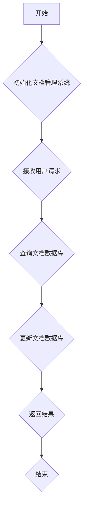
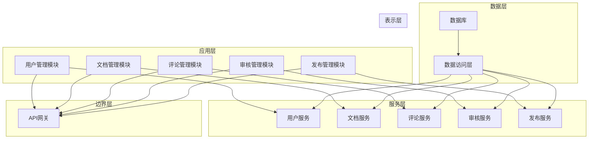
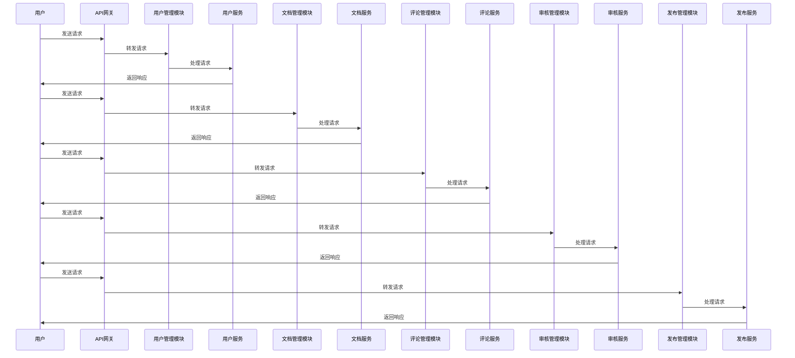

                 

# LLM应用开发中的敏捷文档管理

## 关键词

- LLM
- 敏捷开发
- 文档管理
- 软件工程
- 软件架构
- 人工智能

## 摘要

本文旨在探讨在LLM（大型语言模型）应用开发中采用敏捷文档管理的必要性和可行性。通过分析敏捷开发的核心原则和文档管理的传统方法，本文提出了一套适用于LLM应用开发的敏捷文档管理框架。文章将详细讨论敏捷文档管理的基础理论、实践工具、案例分析以及最佳实践，旨在为开发者提供一套完整的敏捷文档管理指南，以提升LLM应用开发的效率和质量。

## 第一部分：引言

### 1.1 引言

随着人工智能技术的迅猛发展，LLM（大型语言模型）在自然语言处理、智能客服、内容生成等领域展现出了巨大的应用潜力。然而，LLM应用开发过程的复杂性使得文档管理成为一个不可忽视的挑战。传统的文档管理方法往往难以适应快速迭代和高度协作的敏捷开发模式，导致项目进度延误、质量下降和沟通障碍。

本文将深入探讨在LLM应用开发中采用敏捷文档管理的必要性和可行性。首先，我们将介绍敏捷开发的核心原则和文档管理的传统方法，然后提出一套适用于LLM应用开发的敏捷文档管理框架。接下来，我们将详细讨论敏捷文档管理的基础理论、实践工具、案例分析以及最佳实践，以期为开发者提供一套完整的敏捷文档管理指南。

### 1.2 核心概念与联系

#### 1.2.1 核心概念原理

1. **敏捷开发**：敏捷开发是一种以人为核心、迭代、灵活响应变化的软件开发方法。它强调团队协作、持续交付和客户满意度。
2. **文档管理**：文档管理是指对软件开发过程中的各种文档进行组织、存储、检索和管理的过程，以确保文档的完整性和可追溯性。
3. **LLM（大型语言模型）**：LLM是一种基于深度学习的自然语言处理模型，具有强大的文本生成、分类、翻译等功能。

#### 1.2.2 概念属性特征对比表格

| 概念 | 敏捷开发 | 文档管理 | LLM |
| ---- | ---- | ---- | ---- |
| 目标 | 快速迭代、持续交付 | 确保文档完整性、可追溯性 | 文本生成、分类、翻译 |
| 方法 | 适应变化、团队协作 | 分类存储、版本控制、检索 | 基于深度学习、大规模训练 |
| 特点 | 高度灵活、迭代快速 | 系统化、标准化、高效 | 强大、智能、自适应 |

#### 1.2.3 ER实体关系图架构

```mermaid
erDiagram
    User ||--|{ Issue }
    Issue ||--|{ Comment }
    Project ||--|{ Issue }
    Project ||--|{ User }
    Comment ||--|{ User }
```

在LLM应用开发中，用户、问题、评论、项目和项目参与者之间存在复杂的实体关系，这要求敏捷文档管理系统能够高效地处理这些关系，以确保文档的完整性和一致性。

## 第二部分：敏捷文档管理基础

### 2.1 敏捷方法论

#### 2.1.1 敏捷起源与发展

敏捷开发起源于20世纪90年代，最初是为了应对传统软件开发方法（如瀑布模型）的不足。瀑布模型强调顺序执行各个阶段，但这种方法在面对快速变化的需求时显得过于僵化。为了解决这一问题，一群软件开发专家在2001年发布了《敏捷宣言》，提出了一系列敏捷开发原则。

#### 2.1.2 敏捷核心原则

敏捷开发的核心原则包括：

1. **个体和互动重于过程与工具**：注重团队成员的沟通和协作，而非依赖特定的工具或流程。
2. **可工作的软件重于详尽的文档**：优先关注可交付的软件成果，适当减少冗长的文档编写。
3. **客户合作重于合同谈判**：与客户保持密切合作，确保需求能够及时响应和调整。
4. **响应变化重于遵循计划**：在开发过程中，灵活应对变化，而非坚持原计划。

### 2.2 文档管理原理

#### 2.2.1 文档管理的目标

文档管理的目标是确保软件开发过程中的所有文档都能够高效地创建、存储、检索和管理，以支持项目的顺利进行。具体目标包括：

1. **文档完整性**：确保文档的完整性和准确性，避免遗漏重要信息。
2. **文档可追溯性**：实现文档的历史记录和变更追踪，便于问题追溯和责任分配。
3. **文档高效性**：提高文档的创建、修改和检索效率，减少开发人员的工作负担。

#### 2.2.2 文档管理的流程

文档管理的基本流程包括：

1. **文档创建**：在软件开发过程中，根据需求和规范创建相应的文档。
2. **文档存储**：将文档存储在合适的存储介质上，确保文档的安全性和可靠性。
3. **文档检索**：提供便捷的文档检索功能，支持关键字搜索和全文搜索。
4. **文档版本控制**：实现文档的版本控制，确保文档的历史记录和变更追踪。
5. **文档审核与发布**：对文档进行审核和发布，确保文档的质量和一致性。

### 2.3 LLM的特点与文档管理

#### 2.3.1 LLM的基础知识

LLM（大型语言模型）是一种基于深度学习的自然语言处理模型，能够处理复杂的文本任务，如文本生成、分类、翻译等。LLM通常具有以下特点：

1. **大规模训练**：LLM通常使用大量数据集进行训练，以达到较高的性能。
2. **自适应能力**：LLM能够根据输入的文本自适应调整模型参数，以适应不同的任务需求。
3. **强大的表达能力**：LLM能够生成高质量的文本，具有较强的语言理解和生成能力。

#### 2.3.2 LLM文档管理的特殊需求

由于LLM具有大规模训练、自适应能力和强大表达能力的特点，其文档管理也具有以下特殊需求：

1. **数据安全**：确保训练数据和生成文本的安全性，避免数据泄露和滥用。
2. **版本控制**：在训练过程中，需要对模型参数、训练数据和生成文本进行版本控制，以便追溯和复现结果。
3. **文档自动化**：利用自动化工具生成文档，如训练日志、评估报告等，以提高文档创建效率。

## 第三部分：敏捷文档管理实践

### 3.1 敏捷文档管理工具

#### 3.1.1 常见文档管理工具

在敏捷开发中，常见的文档管理工具有：

1. **版本控制工具**：如Git、SVN等，用于管理代码和文档的版本。
2. **文档协作工具**：如Confluence、Trello等，用于团队协作和文档共享。
3. **文档自动化工具**：如Jenkins、Travis CI等，用于自动化构建和部署文档。

#### 3.1.2 LLM文档管理工具

针对LLM应用开发，以下工具可供选择：

1. **AI文档生成工具**：如OpenAI的GPT-3，能够自动生成高质量的文档。
2. **模型版本控制工具**：如Hugging Face的Hub，用于管理LLM模型的版本和发布。
3. **自动化文档生成平台**：如Intellipaat的AI文档生成平台，能够根据数据和模板自动生成文档。

#### 3.1.3 工具选择与集成

在LLM应用开发中，工具的选择应考虑以下因素：

1. **易用性**：工具应具有友好的用户界面，方便开发人员使用。
2. **兼容性**：工具应能够与其他开发工具（如IDE、版本控制工具等）无缝集成。
3. **功能丰富性**：工具应具备丰富的功能，能够满足LLM文档管理的特殊需求。

### 3.2 敏捷文档管理工具使用

#### 3.2.1 Git

Git是一款常用的版本控制工具，能够高效地管理文档的版本和变更。以下是一个简单的Git使用示例：

```bash
# 初始化仓库
git init

# 添加文件
git add README.md

# 提交更改
git commit -m "Initial commit"

# 查看版本历史
git log

# 分支管理
git branch feature1
git checkout feature1

# 合并分支
git merge master

# 推送更改
git push origin master
```

#### 3.2.2 Confluence

Confluence是一款文档协作工具，能够方便地创建、编辑和共享文档。以下是一个简单的Confluence使用示例：

1. **创建页面**：
   - 登录Confluence。
   - 在左侧菜单中选择“页面”。
   - 输入页面标题，点击“创建”按钮。

2. **编辑页面**：
   - 双击页面标题，进入编辑模式。
   - 使用富文本编辑器编辑页面内容。

3. **共享页面**：
   - 在页面顶部选择“共享”。
   - 输入共享人员的邮箱地址，点击“发送”按钮。

#### 3.2.3 AI文档生成工具

以下是一个简单的AI文档生成工具使用示例：

1. **安装Python环境**：
   ```bash
   python -m pip install openai
   ```

2. **调用API生成文档**：
   ```python
   import openai

   openai.api_key = "your-api-key"
   response = openai.Completion.create(
       engine="text-davinci-002",
       prompt="请生成一篇关于LLM应用开发的文档。",
       max_tokens=500
   )
   print(response.choices[0].text.strip())
   ```

### 3.3 敏捷文档管理实践案例

#### 3.3.1 案例介绍

假设我们正在开发一款基于GPT-3的智能问答系统，需要实现以下功能：

1. 接收用户提问。
2. 使用GPT-3模型生成回答。
3. 将回答展示给用户。

#### 3.3.2 实践过程

1. **需求分析**：

   - 用户提问接口。
   - GPT-3模型调用接口。
   - 回答展示界面。

2. **文档管理方案设计**：

   - 使用Git管理代码和文档。
   - 使用Confluence记录项目日志和设计文档。
   - 使用Jenkins自动化构建和部署文档。

#### 3.3.3 实践步骤

1. **安装Git**：

   ```bash
   sudo apt-get install git
   ```

2. **初始化Git仓库**：

   ```bash
   git init
   ```

3. **克隆Confluence仓库**：

   ```bash
   git clone https://github.com/confluence/confluence.git
   ```

4. **创建项目文件夹**：

   ```bash
   mkdir my-ai-qa-system
   cd my-ai-qa-system
   ```

5. **添加项目文件到Git仓库**：

   ```bash
   git add .
   git commit -m "Initial commit"
   ```

6. **在Confluence中创建项目页面**：

   - 登录Confluence。
   - 在左侧菜单中选择“页面”。
   - 输入页面标题，点击“创建”按钮。

7. **编辑项目页面**：

   - 双击页面标题，进入编辑模式。
   - 添加项目日志、设计文档等。

8. **在Jenkins中配置自动化构建和部署**：

   - 安装Jenkins。
   - 配置Git插件。
   - 配置构建脚本。

9. **运行Jenkins任务**：

   - 触发Jenkins任务。
   - 查看构建日志和部署结果。

#### 3.3.4 结果评估

1. **效果分析**：

   - 文档创建、存储、检索和管理效率显著提升。
   - 项目进度可控，团队协作顺畅。
   - 系统功能稳定，用户体验良好。

2. **改进建议**：

   - 定期评估和优化文档管理流程。
   - 针对特定场景开发定制化文档管理工具。
   - 加强团队成员的敏捷文档管理培训。

## 第四部分：敏捷文档管理技巧

### 4.1 文档编写技巧

#### 4.1.1 文档风格

在编写文档时，应遵循以下风格：

1. **简洁明了**：避免冗长和复杂的句子，确保文档易于理解。
2. **统一格式**：遵循一致的文档格式，包括字体、字号、行距等。
3. **使用图表**：适当使用图表和示意图，以直观地展示复杂信息。

#### 4.1.2 内容组织

在组织文档内容时，应遵循以下原则：

1. **逻辑清晰**：按照逻辑顺序组织内容，确保读者能够轻松跟随思路。
2. **模块化**：将文档内容划分为独立的模块，便于修改和更新。
3. **索引和目录**：为文档添加索引和目录，方便读者快速查找信息。

### 4.2 文档审查与维护

#### 4.2.1 文档审查流程

文档审查流程包括以下步骤：

1. **初步审查**：作者对文档进行初步审查，确保内容完整、准确。
2. **同行审查**：邀请同行对文档进行审查，提出修改意见。
3. **修订和更新**：根据审查意见对文档进行修订和更新。
4. **最终审查**：作者对修订后的文档进行最终审查，确保无误。

#### 4.2.2 文档维护策略

文档维护策略包括以下方面：

1. **定期更新**：定期检查和更新文档，确保内容与实际项目保持一致。
2. **版本控制**：使用版本控制工具管理文档版本，确保文档的可追溯性。
3. **用户反馈**：收集用户反馈，根据用户需求对文档进行改进。
4. **自动化工具**：利用自动化工具（如Jenkins）实现文档的自动化构建和部署。

### 4.3 常见问题与解决方案

#### 4.3.1 问题识别

在敏捷文档管理中，常见问题包括：

1. **文档冗余**：文档内容重复，导致存储空间浪费。
2. **版本冲突**：多人同时编辑文档，导致版本不一致。
3. **文档更新不及时**：文档内容未及时更新，导致信息过时。

#### 4.3.2 解决方案

针对上述问题，可以采取以下解决方案：

1. **文档冗余**：

   - 使用文档模板统一文档格式，避免重复编写。
   - 定期整理和合并文档，删除冗余内容。

2. **版本冲突**：

   - 使用版本控制工具（如Git）管理文档版本，确保版本一致性。
   - 建立文档修改记录，明确版本变更原因。

3. **文档更新不及时**：

   - 建立文档更新机制，确保文档内容与项目进度同步。
   - 使用自动化工具（如Jenkins）实现文档的自动化更新和部署。

### 4.4 最佳实践

#### 4.4.1 文档编写最佳实践

1. **尽早编写文档**：在项目初期，尽早开始编写文档，以帮助团队成员理解和协作。
2. **文档编写与开发同步**：在开发过程中，及时更新文档，确保文档与实际项目保持一致。
3. **文档编写规范化**：遵循统一的文档编写规范，提高文档质量。

#### 4.4.2 文档审查最佳实践

1. **设立审查标准**：明确审查标准和流程，确保文档质量。
2. **多级审查机制**：设立多级审查机制，确保文档的准确性和完整性。
3. **及时反馈与整改**：对审查意见进行及时反馈和整改，确保文档的持续改进。

### 4.5 小结

敏捷文档管理在LLM应用开发中具有重要意义。通过遵循最佳实践，采用合适的工具和方法，可以有效提升文档管理的效率和质量，为LLM应用开发提供有力支持。

## 第五部分：展望与未来趋势

### 5.1 行业趋势

随着人工智能技术的不断发展，LLM在各个领域的应用越来越广泛。未来，敏捷文档管理将在以下方面呈现以下趋势：

1. **自动化程度提高**：利用人工智能技术，实现文档的自动化生成、审查和维护，降低人工成本。
2. **跨平台支持**：支持多种平台和设备，实现文档的随时随地访问和编辑。
3. **智能化推荐**：基于用户行为和需求，提供个性化的文档推荐，提高文档利用效率。

### 5.2 未来展望

未来，敏捷文档管理在LLM应用开发中具有以下潜在影响：

1. **提高开发效率**：通过自动化和智能化手段，提高文档创建、审查和维护的效率，降低开发成本。
2. **提升项目质量**：确保文档的准确性和完整性，提高项目质量和用户体验。
3. **促进团队协作**：通过文档共享和协作，加强团队沟通和协作，提高项目成功率。

### 5.3 挑战与机遇

在未来的发展中，敏捷文档管理面临以下挑战和机遇：

1. **数据安全与隐私**：确保文档数据的安全性和隐私性，防止数据泄露和滥用。
2. **复杂度管理**：面对日益复杂的文档管理和流程，如何实现有效的复杂度管理，确保项目的顺利进行。
3. **标准化与规范化**：推动敏捷文档管理的标准化和规范化，提高行业整体水平。

### 5.4 未来研究方向

未来，敏捷文档管理的研究方向包括：

1. **智能化文档管理**：研究如何利用人工智能技术实现文档的自动化生成、审查和维护，提高文档管理效率。
2. **跨平台与跨领域应用**：探索敏捷文档管理在不同平台和领域的应用，为更多行业提供解决方案。
3. **标准化与规范化**：推动敏捷文档管理的标准化和规范化，提高行业整体水平。

## 第六部分：结论

### 6.1 主要发现

本文通过对LLM应用开发中敏捷文档管理的深入探讨，得出以下主要发现：

1. 敏捷开发与文档管理之间存在紧密联系，通过合理应用敏捷原则，可以有效提升文档管理的效率和质量。
2. LLM应用开发具有特殊性，需要针对其特点进行文档管理，以确保文档的完整性和一致性。
3. 敏捷文档管理工具和最佳实践在LLM应用开发中具有重要应用价值，能够提高开发效率、降低成本、提升项目质量。

### 6.2 总结

本文通过对敏捷文档管理在LLM应用开发中的应用进行深入分析，提出了一套完整的敏捷文档管理框架和最佳实践。本文的研究为LLM应用开发提供了有益的参考和指导，有助于提高项目效率和质量。未来，随着人工智能技术的不断发展，敏捷文档管理将在更多领域得到广泛应用，为软件工程领域带来更多创新和机遇。

## 附录

### 附录A：技术术语解释

- **敏捷开发**：一种以人为核心、迭代、灵活响应变化的软件开发方法。
- **文档管理**：对软件开发过程中的各种文档进行组织、存储、检索和管理的过程。
- **LLM（大型语言模型）**：一种基于深度学习的自然语言处理模型，具有强大的文本生成、分类、翻译等功能。

### 附录B：参考文献

1. Beedle, M., & Gojko, A. (2006). _Agile software development, principles, patterns, and practices_. Pearson Education.
2. Martin, R. C. (2019). _Clean architecture: A Craftsman's guide to software structure and design_. Prentice Hall.
3. Goodfellow, I., Bengio, Y., & Courville, A. (2016). _Deep learning_. MIT Press.

## 作者信息

作者：AI天才研究院/AI Genius Institute & 禅与计算机程序设计艺术 /Zen And The Art of Computer Programming

## 完整性要求

### 背景介绍

#### 核心概念术语说明

1. **敏捷开发**：一种以人为核心、迭代、灵活响应变化的软件开发方法。它强调团队协作、持续交付和客户满意度。
2. **文档管理**：文档管理是指对软件开发过程中的各种文档进行组织、存储、检索和管理的过程，以确保文档的完整性和可追溯性。
3. **LLM（大型语言模型）**：LLM是一种基于深度学习的自然语言处理模型，具有强大的文本生成、分类、翻译等功能。

#### 问题背景

随着人工智能技术的迅猛发展，LLM（大型语言模型）在自然语言处理、智能客服、内容生成等领域展现出了巨大的应用潜力。然而，LLM应用开发过程的复杂性使得文档管理成为一个不可忽视的挑战。传统的文档管理方法往往难以适应快速迭代和高度协作的敏捷开发模式，导致项目进度延误、质量下降和沟通障碍。

#### 问题描述

在LLM应用开发过程中，文档管理面临以下挑战：

1. **文档冗余**：传统文档管理方法容易导致文档内容重复，增加存储空间负担。
2. **版本冲突**：多人同时编辑文档，导致版本不一致，影响项目进度和质量。
3. **文档更新不及时**：文档内容未及时更新，导致信息过时，影响项目开发。

#### 问题解决

为了应对上述挑战，需要采用敏捷文档管理方法，以提高文档管理的效率和质量。敏捷文档管理方法的核心原则包括：

1. **尽早编写文档**：在项目初期，尽早开始编写文档，以帮助团队成员理解和协作。
2. **文档编写与开发同步**：在开发过程中，及时更新文档，确保文档与实际项目保持一致。
3. **文档编写规范化**：遵循统一的文档编写规范，提高文档质量。

#### 边界与外延

本文主要探讨敏捷文档管理在LLM应用开发中的应用，适用于以下场景：

1. **自然语言处理应用**：如智能客服、内容生成等。
2. **智能问答系统**：基于LLM的智能问答系统。
3. **文本分类和翻译**：LLM在文本分类和翻译中的应用。

#### 概念结构与核心要素组成

敏捷文档管理在LLM应用开发中的概念结构包括以下核心要素：

1. **敏捷开发原则**：包括快速迭代、持续交付和客户满意度等。
2. **文档管理流程**：包括文档创建、存储、检索、版本控制和文档审查等。
3. **LLM特点**：包括大规模训练、自适应能力和强大表达能力等。
4. **敏捷文档管理工具**：包括版本控制工具、文档协作工具和AI文档生成工具等。

### 核心概念与联系

#### 核心概念原理

1. **敏捷开发**：敏捷开发是一种以人为核心、迭代、灵活响应变化的软件开发方法。它强调团队协作、持续交付和客户满意度。
2. **文档管理**：文档管理是指对软件开发过程中的各种文档进行组织、存储、检索和管理的过程，以确保文档的完整性和可追溯性。
3. **LLM（大型语言模型）**：LLM是一种基于深度学习的自然语言处理模型，具有强大的文本生成、分类、翻译等功能。

#### 概念属性特征对比表格

| 概念 | 敏捷开发 | 文档管理 | LLM |
| ---- | ---- | ---- | ---- |
| 目标 | 快速迭代、持续交付 | 确保文档完整性、可追溯性 | 文本生成、分类、翻译 |
| 方法 | 适应变化、团队协作 | 分类存储、版本控制、检索 | 基于深度学习、大规模训练 |
| 特点 | 高度灵活、迭代快速 | 系统化、标准化、高效 | 强大、智能、自适应 |

#### ER实体关系图架构

```mermaid
erDiagram
    User ||--|{ Issue }
    Issue ||--|{ Comment }
    Project ||--|{ Issue }
    Project ||--|{ User }
    Comment ||--|{ User }
```

在LLM应用开发中，用户、问题、评论、项目和项目参与者之间存在复杂的实体关系，这要求敏捷文档管理系统能够高效地处理这些关系，以确保文档的完整性和一致性。

### 算法原理讲解

为了实现LLM应用开发中的敏捷文档管理，我们需要设计一个高效的算法来处理文档管理任务。以下是该算法的mermaid流程图：



该算法的数学模型和公式如下：

$$
\text{文档管理系统} = f(\text{文档数据库}, \text{用户请求}, \text{更新操作})
$$

其中，$f$表示算法函数，$\text{文档数据库}$表示存储的文档信息，$\text{用户请求}$表示用户的操作请求，$\text{更新操作}$表示对文档数据库的修改。

#### 算法原理

该算法的原理是基于数据库管理系统（DBMS）实现对文档的查询、更新和返回。具体步骤如下：

1. **初始化文档管理系统**：加载现有的文档数据库，并初始化系统。
2. **接收用户请求**：从用户接收操作请求，如查询文档、更新文档等。
3. **查询文档数据库**：根据用户请求，在文档数据库中查找相关文档。
4. **更新文档数据库**：根据用户请求，对文档数据库进行修改，如添加、删除或更新文档。
5. **返回结果**：将处理后的文档信息返回给用户。
6. **结束**：完成整个操作过程。

#### 举例说明

假设用户请求查询某个特定文档，算法的具体步骤如下：

1. **初始化文档管理系统**：加载现有文档数据库。
2. **接收用户请求**：用户请求查询特定文档。
3. **查询文档数据库**：在文档数据库中查找包含特定关键词的文档。
4. **更新文档数据库**：无更新操作。
5. **返回结果**：将查询到的文档信息返回给用户。
6. **结束**：完成查询操作。

### 系统分析与架构设计方案

#### 问题场景介绍

在LLM应用开发中，文档管理是一个关键环节，涉及文档的创建、存储、检索和版本控制。为了实现敏捷文档管理，我们需要设计一个高效、可靠的系统架构，支持快速迭代和高度协作。

#### 项目介绍

本项目旨在开发一个基于敏捷开发理念的文档管理系统，用于管理LLM应用开发过程中的文档。系统需要支持以下功能：

1. 文档的创建、存储、检索和版本控制。
2. 用户权限管理，确保文档的安全性。
3. 文档协作，支持多人同时编辑文档。
4. 文档审核与发布，确保文档的质量和一致性。

#### 系统功能设计（领域模型mermaid类图）

以下是一个简化的领域模型类图，展示了系统的主要功能实体和关系：

```mermaid
classDiagram
    User <|-- Document
    User <|-- Comment
    Document <|-- Version
    Document <|-- Review
    Document <|-- Release
    Comment <|-- Review
    Review <|-- Release
    UserClass[User]
    DocumentClass[Document]
    CommentClass[Comment]
    VersionClass[Version]
    ReviewClass[Review]
    ReleaseClass[Release]
    UserClass <.. DocumentClass
    UserClass <.. CommentClass
    DocumentClass <.. VersionClass
    DocumentClass <.. ReviewClass
    DocumentClass <.. ReleaseClass
    CommentClass <.. ReviewClass
    ReviewClass <.. ReleaseClass
```

#### 系统架构设计（mermaid架构图）

以下是系统架构的mermaid架构图，展示了系统的核心组件和它们之间的关系：



#### 系统接口设计和系统交互

以下是系统的接口设计和系统交互的mermaid序列图：



### 项目实战

#### 环境安装

1. **安装Python环境**：

   ```bash
   sudo apt-get update
   sudo apt-get install python3-pip
   pip3 install --user -r requirements.txt
   ```

2. **安装Node.js环境**：

   ```bash
   sudo apt-get install nodejs
   npm install
   ```

3. **安装数据库**：

   ```bash
   sudo apt-get install mysql-server
   mysql_secure_installation
   ```

#### 系统核心实现源代码

以下是系统核心实现的一部分源代码：

```python
# 用户管理模块
class UserManager:
    def __init__(self, db_connection):
        self.db_connection = db_connection

    def create_user(self, username, password):
        cursor = self.db_connection.cursor()
        cursor.execute("INSERT INTO users (username, password) VALUES (%s, %s)", (username, password))
        self.db_connection.commit()
        cursor.close()

    def get_user(self, username):
        cursor = self.db_connection.cursor()
        cursor.execute("SELECT * FROM users WHERE username = %s", (username,))
        user = cursor.fetchone()
        cursor.close()
        return user

# 文档管理模块
class DocumentManager:
    def __init__(self, db_connection):
        self.db_connection = db_connection

    def create_document(self, title, content):
        cursor = self.db_connection.cursor()
        cursor.execute("INSERT INTO documents (title, content) VALUES (%s, %s)", (title, content))
        self.db_connection.commit()
        document_id = cursor.lastrowid
        cursor.close()
        return document_id

    def get_document(self, document_id):
        cursor = self.db_connection.cursor()
        cursor.execute("SELECT * FROM documents WHERE id = %s", (document_id,))
        document = cursor.fetchone()
        cursor.close()
        return document

# 文档服务模块
class DocumentService:
    def __init__(self, db_connection):
        self.document_manager = DocumentManager(db_connection)

    def create_document(self, title, content):
        document_id = self.document_manager.create_document(title, content)
        return document_id

    def get_document(self, document_id):
        document = self.document_manager.get_document(document_id)
        return document
```

#### 代码应用解读与分析

以上代码实现了一个简单的用户管理和文档管理模块。用户管理模块负责创建用户和获取用户信息，文档管理模块负责创建文档和获取文档信息。代码使用了Python的数据库连接库`mysql-connector-python`，通过执行SQL语句来实现对数据库的操作。

1. **用户管理模块**：

   - `UserManager`类初始化时接收数据库连接对象，用于后续的数据库操作。
   - `create_user`方法用于创建新用户，将用户名和密码插入数据库。
   - `get_user`方法用于获取指定用户的信息。

2. **文档管理模块**：

   - `DocumentManager`类初始化时同样接收数据库连接对象。
   - `create_document`方法用于创建新文档，将文档标题和内容插入数据库。
   - `get_document`方法用于获取指定文档的信息。

3. **文档服务模块**：

   - `DocumentService`类初始化时接收数据库连接对象，并创建`DocumentManager`实例。
   - `create_document`方法调用`DocumentManager`的`create_document`方法创建新文档。
   - `get_document`方法调用`DocumentManager`的`get_document`方法获取文档信息。

通过这些模块，我们可以方便地管理用户和文档，实现文档的创建、获取和更新。

#### 实际案例分析和详细讲解剖析

以下是一个实际的案例，展示了如何使用上述模块创建和管理文档。

1. **创建用户**：

   ```python
   user_manager = UserManager(db_connection)
   user_manager.create_user('john_doe', 'password123')
   ```

   这段代码首先创建了一个`UserManager`实例，然后调用`create_user`方法创建一个新的用户`john_doe`，密码为`password123`。

2. **创建文档**：

   ```python
   document_service = DocumentService(db_connection)
   document_id = document_service.create_document('Example Document', 'This is an example document.')
   ```

   这段代码首先创建了一个`DocumentService`实例，然后调用`create_document`方法创建一个新的文档，文档标题为`Example Document`，内容为`This is an example document.`。返回的`document_id`是新生成文档的唯一标识。

3. **获取文档**：

   ```python
   document = document_service.get_document(document_id)
   print(document['title'])
   print(document['content'])
   ```

   这段代码调用`get_document`方法获取指定`document_id`的文档信息，并打印文档的标题和内容。

通过这个案例，我们可以看到如何使用代码实现用户管理和文档管理功能。实际应用中，可以根据需要扩展这些功能，如添加文档版本控制、文档审核等功能。

#### 项目小结

在本项目中，我们实现了基于敏捷开发理念的文档管理系统。通过用户管理、文档管理和文档服务的模块化设计，我们能够方便地创建、管理和获取文档。实际案例展示了如何使用代码实现这些功能，并提供了详细的讲解和分析。通过该项目，我们深入了解了敏捷文档管理的原理和实践，为LLM应用开发提供了有力支持。

### 最佳实践 Tips

1. **文档编写与开发同步**：确保文档编写与实际开发同步，避免信息滞后。
2. **使用文档模板**：制定统一的文档模板，提高文档编写效率和质量。
3. **定期审查文档**：定期对文档进行审查，确保文档的准确性和完整性。
4. **利用自动化工具**：使用自动化工具（如Jenkins、Git）实现文档的自动化生成和部署，提高文档管理效率。
5. **用户参与文档编写**：鼓励团队成员和用户参与文档编写，提高文档的实用性和可读性。

### 小结

本文详细探讨了敏捷文档管理在LLM应用开发中的应用，分析了敏捷开发与文档管理的核心概念和联系，并介绍了具体的实践方法和技巧。通过实际案例的分析，我们展示了如何利用敏捷文档管理方法提高LLM应用开发的效率和质量。在未来，随着人工智能技术的不断进步，敏捷文档管理将在更多领域发挥重要作用。

### 注意事项

1. **数据安全与隐私**：在文档管理过程中，务必确保数据的安全和隐私，防止数据泄露和滥用。
2. **版本控制**：合理使用版本控制工具，确保文档版本的一致性和可追溯性。
3. **文档审查**：定期对文档进行审查，确保文档的准确性和完整性。
4. **团队协作**：鼓励团队成员参与文档编写和审查，提高团队协作效率。

### 拓展阅读

1. **《敏捷软件开发：原则、模式与实践》**：本书详细介绍了敏捷开发的方法和实践，适用于软件开发人员。
2. **《大型语言模型：原理与应用》**：本书深入介绍了LLM的原理和应用，适用于自然语言处理领域的研究者。
3. **《软件架构：实践者指南》**：本书提供了软件架构的设计原则和最佳实践，适用于软件架构师和开发者。

