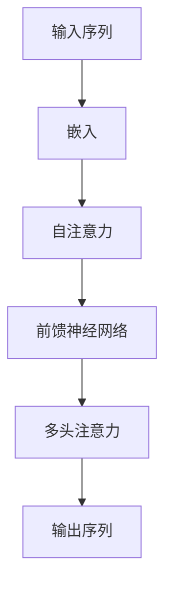
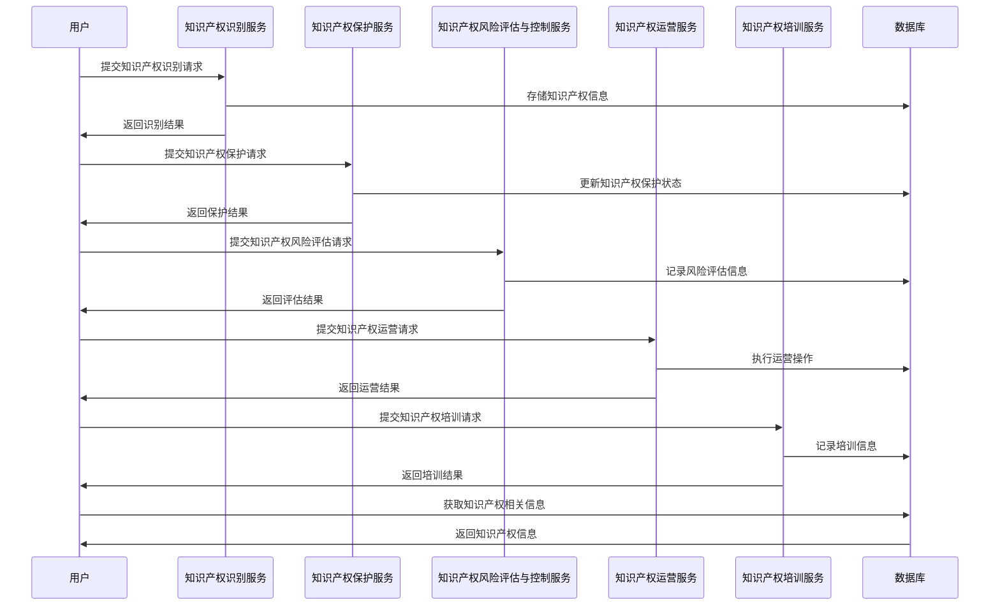
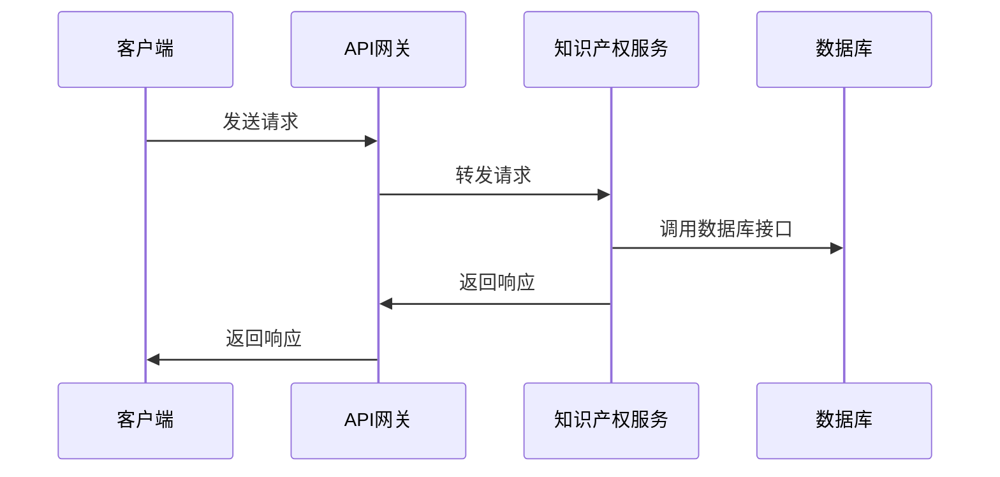
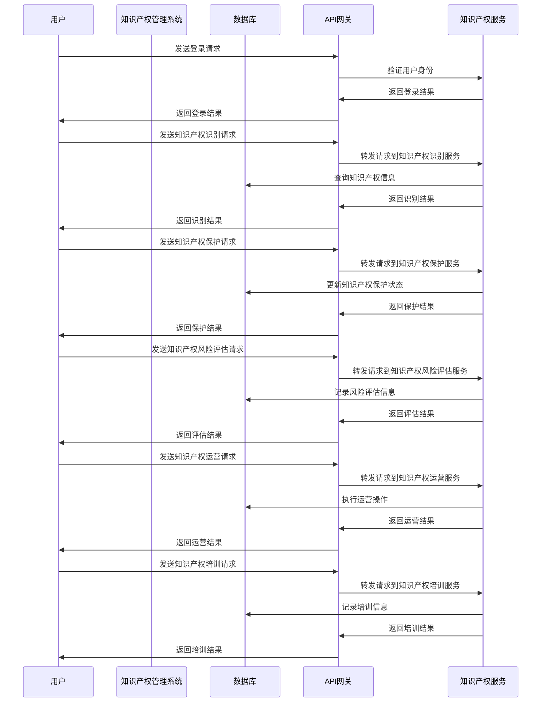

                 

## 第一部分：背景介绍

### 问题背景

在现代科技迅速发展的时代，人工智能（AI）技术的应用已渗透到各行各业。随着大型语言模型（LLM）的出现，自然语言处理（NLP）领域迎来了革命性的变化。LLM技术以其强大的数据处理和生成能力，在聊天机器人、内容生成、自动翻译、智能客服等领域展现了巨大的应用潜力。这种技术进步不仅推动了AI行业的快速发展，也为企业和个人带来了新的商业机会。

然而，随着LLM应用开发的不断深入，知识产权（IP）管理逐渐成为不可忽视的重要环节。知识产权不仅是企业技术创新的核心资产，也是市场竞争的重要工具。在LLM应用开发中，知识产权管理的复杂性主要体现在以下几个方面：

1. **模型原创性**：LLM技术依赖于大量训练数据，这些数据的来源和使用权涉及复杂的版权问题。此外，模型的设计和算法实现也具有原创性，需要通过专利保护。
2. **算法专利性**：随着AI技术的发展，许多新型算法不断涌现。如何申请和保护这些算法专利，以防止竞争对手的抄袭和侵权，成为企业面临的重大挑战。
3. **数据处理**：在LLM应用开发过程中，涉及大量的数据处理，包括数据采集、清洗、存储和传输。这些过程可能引发数据隐私和版权纠纷。
4. **合作与竞争**：在LLM领域，企业之间既有合作也有竞争。如何在与合作伙伴的合作中保护自身知识产权，同时在与竞争对手的竞争中维护自身利益，是企业需要权衡的难题。

### 问题描述

在现代AI应用开发中，知识产权管理面临诸多挑战：

1. **知识产权识别困难**：由于LLM技术涉及多个方面，包括模型、算法、数据等，企业往往难以全面识别和管理其知识产权。
2. **侵权风险高**：LLM技术的创新性强，容易引起竞争对手的抄袭和侵权。此外，由于法律和技术的复杂性，企业可能无法及时发现和处理侵权行为。
3. **保护成本高**：知识产权保护需要投入大量的人力、物力和财力，包括专利申请、法律诉讼等。对于中小企业而言，这种成本可能成为负担。
4. **合规性问题**：在跨国开发和运营中，企业需要遵守不同国家和地区的知识产权法律法规。这增加了知识产权管理的复杂性和风险。

这些问题的存在不仅影响了企业的创新和发展，还可能带来法律风险和商业损失。因此，如何在LLM应用开发中有效进行知识产权管理，成为企业亟需解决的问题。

### 问题解决

敏捷知识产权管理理念应运而生，它强调快速响应变化、持续优化流程和高效保护权益。通过敏捷知识产权管理，企业可以在保持创新的同时，有效规避风险、保护自身利益和推动技术进步。

1. **快速响应变化**：敏捷知识产权管理强调及时识别和应对知识产权相关的变化。这包括关注技术、市场和政策的变化，调整知识产权策略，以保持企业的竞争优势。
2. **持续优化流程**：通过不断优化知识产权管理和保护流程，企业可以提高效率和效果。这包括建立和完善知识产权管理制度、培训员工、引入先进的技术手段等。
3. **高效保护权益**：敏捷知识产权管理注重通过法律手段和策略，保护知识产权免受侵犯。这包括申请专利、商标、著作权等法律手段，以及采用数字水印、加密等先进技术手段。

通过敏捷知识产权管理，企业可以在确保合规性的同时，有效保护知识产权，实现技术创新和商业价值的最大化。

### 边界与外延

敏捷知识产权管理的边界和范围涉及多个方面：

1. **技术层面**：包括模型原创性、算法专利性、数据处理等知识产权的技术保护。
2. **法律层面**：涉及知识产权法律法规的研究、合规性评估、法律诉讼等。
3. **运营层面**：包括知识产权的运营和管理，如知识产权交易、许可、转让等。
4. **文化建设**：建立企业内部的知识产权意识和规范，形成良好的知识产权文化。

敏捷知识产权管理不仅关注内部研发团队的管理，还涉及到与合作伙伴、竞争对手以及客户的互动。通过建立全面的知识产权管理体系，企业可以在全球范围内有效保护知识产权，实现可持续发展和竞争优势。

### 概念结构与核心要素组成

敏捷知识产权管理是一个复杂且系统的过程，其核心要素包括以下几个方面：

1. **知识产权识别**：识别和分类开发过程中的知识产权，包括专利、商标、著作权等。这是知识产权管理的基础，有助于企业全面了解其知识产权资产。
2. **知识产权保护**：通过法律手段和策略，保护知识产权免受侵犯。包括申请专利、商标、著作权等，以及采用技术手段如数字水印、加密等。
3. **知识产权运营**：优化知识产权的使用和交易，实现最大化价值。包括知识产权的许可、转让、交易等。
4. **知识产权风险控制**：评估和管理知识产权风险，确保合规性。包括风险识别、风险评估、风险控制措施等。
5. **知识产权文化建设**：建立知识产权意识和规范，形成良好的知识产权文化。包括员工培训、知识产权管理制度的制定和实施等。

通过这些核心要素的有机结合，企业可以构建一个高效、全面的知识产权管理体系，确保在LLM应用开发中实现知识产权的有效保护和最大化利用。

### 总结

在现代AI应用开发中，知识产权管理的重要性日益凸显。敏捷知识产权管理理念应运而生，通过快速响应变化、持续优化流程和高效保护权益，帮助企业应对知识产权管理的挑战。其核心要素包括知识产权识别、保护、运营、风险控制和文化建设。通过建立全面的知识产权管理体系，企业可以在保持创新的同时，有效保护知识产权，实现可持续发展和竞争优势。然而，敏捷知识产权管理仍面临诸多挑战，需要企业持续探索和实践。

## 第二部分：核心概念与联系

### 核心概念原理

#### 敏捷知识产权管理

敏捷知识产权管理是一种基于敏捷开发方法的知识产权管理理念，旨在通过快速响应变化、持续优化流程和高效保护权益，实现知识产权的有效管理和保护。

**1. 快速响应变化**

敏捷知识产权管理强调及时识别和应对知识产权相关的变化。在技术快速发展的背景下，企业需要密切关注技术、市场和政策的变化，调整知识产权策略，以保持竞争优势。

**2. 持续优化流程**

通过不断优化知识产权管理和保护流程，企业可以提高效率和效果。这包括建立和完善知识产权管理制度、培训员工、引入先进的技术手段等，以确保知识产权管理的系统性和规范性。

**3. 高效保护权益**

敏捷知识产权管理注重通过法律手段和策略，保护知识产权免受侵犯。这包括申请专利、商标、著作权等法律手段，以及采用数字水印、加密等先进技术手段，确保知识产权的全面保护。

#### 知识产权保护

知识产权保护是指采取各种措施，防止他人未经许可使用、复制、传播或销售知识产权作品。其主要手段包括：

**1. 法律手段**

通过专利、商标、著作权等法律手段，保护知识产权。例如，企业可以申请专利保护其创新的算法和模型，通过商标保护其品牌和声誉，通过著作权保护其原创的内容。

**2. 技术手段**

采用数字水印、加密等技术手段，防止知识产权作品被非法复制和传播。例如，在AI模型中嵌入数字水印，可以有效地追踪和维权。

**3. 管理手段**

建立知识产权管理制度，规范知识产权的申请、保护和运用。通过标准化流程，确保知识产权的申请和保护符合法律法规，避免潜在的法律风险。

### 概念属性特征对比表格

| 特征        | 敏捷知识产权管理 | 知识产权保护                      |
| ----------- | ---------------- | --------------------------------- |
| 目标        | 快速响应变化、持续优化、高效保护 | 保护知识产权免受侵犯                 |
| 方法论      | 敏捷开发方法论           | 法律、技术、管理手段                 |
| 关注领域    | 整个知识产权生命周期       | 保护阶段                          |
| 结果衡量    | 效率、效果、合规性         | 知识产权侵权事件的数量和损失        |

### ER实体关系图架构

以下是一个简化的ER实体关系图，展示了敏捷知识产权管理中的关键实体及其相互关系：

```mermaid
erDiagram
  IPR : 知识产权 |<--| Owner : 权利人
  IPR |--|>> Application : 应用
  IPR |--|>> Risk : 风险
  IPR |--|>> Protection : 保护措施
  IPR |--|>> Management : 管理流程
  Owner ||--|>> Organization : 组织
  Owner ||--|>> Individual : 个人
  Application ||--|>> Product : 产品
  Application ||--|>> Service : 服务
  Risk ||--|>> Legal : 法律风险
  Risk ||--|>> Technical : 技术风险
  Protection ||--|>> LegalProtection : 法律保护
  Protection ||--|>> TechnicalProtection : 技术保护
```

在这个ER图中，`IPR`代表知识产权，`Owner`代表权利人，包括`Organization`（组织）和`Individual`（个人）。`Application`表示知识产权的应用场景，如`Product`（产品）和`Service`（服务）。`Risk`表示与知识产权相关的风险，包括`Legal`（法律风险）和`Technical`（技术风险）。`Protection`代表知识产权的保护措施，包括`LegalProtection`（法律保护）和`TechnicalProtection`（技术保护）。`Management`表示知识产权的管理流程。

### 概念属性特征对比表格

| 特征        | 敏捷知识产权管理 | 知识产权保护                      |
| ----------- | ---------------- | --------------------------------- |
| 目标        | 快速响应变化、持续优化、高效保护 | 保护知识产权免受侵犯                 |
| 方法论      | 敏捷开发方法论           | 法律、技术、管理手段                 |
| 关注领域    | 整个知识产权生命周期       | 保护阶段                          |
| 结果衡量    | 效率、效果、合规性         | 知识产权侵权事件的数量和损失        |

### ER实体关系图架构

```mermaid
erDiagram
  IPR : 知识产权 |<--| Owner : 权利人
  IPR |--|>> Application : 应用
  IPR |--|>> Risk : 风险
  IPR |--|>> Protection : 保护措施
  IPR |--|>> Management : 管理流程
  Owner ||--|>> Organization : 组织
  Owner ||--|>> Individual : 个人
  Application ||--|>> Product : 产品
  Application ||--|>> Service : 服务
  Risk ||--|>> Legal : 法律风险
  Risk ||--|>> Technical : 技术风险
  Protection ||--|>> LegalProtection : 法律保护
  Protection ||--|>> TechnicalProtection : 技术保护
```

在这个ER图中，`IPR`代表知识产权，`Owner`代表权利人，包括`Organization`（组织）和`Individual`（个人）。`Application`表示知识产权的应用场景，如`Product`（产品）和`Service`（服务）。`Risk`表示与知识产权相关的风险，包括`Legal`（法律风险）和`Technical`（技术风险）。`Protection`代表知识产权的保护措施，包括`LegalProtection`（法律保护）和`TechnicalProtection`（技术保护）。`Management`表示知识产权的管理流程。

## 第三部分：算法原理讲解

### 大型语言模型（LLM）的基本原理

大型语言模型（LLM）是一种基于深度学习的自然语言处理模型，它通过学习大量的文本数据，生成自然语言响应。LLM的核心原理是基于神经网络，特别是Transformer架构，这种架构能够处理长距离依赖和并行计算，从而实现高效的文本生成。

**1. Transformer架构**

Transformer架构由Vaswani等人在2017年提出，它使用自注意力机制（Self-Attention）和多头注意力（Multi-Head Attention）来处理序列数据。自注意力机制允许模型在生成每个词时，考虑所有先前词的影响，而多头注意力则将注意力分布到不同的子空间，提高模型的鲁棒性。

**2. 经典Transformer算法mermaid流程图**



在这个流程图中，输入序列经过嵌入层（Embedding Layer）转换为向量表示。然后，通过自注意力机制（Self-Attention）计算每个词在序列中的重要性，并生成新的表示。接着，通过前馈神经网络（Feedforward Neural Network）对自注意力结果进行进一步处理，最后通过多头注意力（Multi-Head Attention）整合不同注意力头的结果，生成最终的输出序列。

**3. Transformer算法Python源代码示例**

```python
import tensorflow as tf

class TransformerLayer(tf.keras.layers.Layer):
    def __init__(self, d_model, num_heads, dff, rate=0.1):
        super(TransformerLayer, self).__init__()
        self.d_model = d_model
        self.num_heads = num_heads
        self.dff = dff
        self.rate = rate
        
        self.query_dense = tf.keras.layers.Dense(d_model)
        self.key_dense = tf.keras.layers.Dense(d_model)
        self.value_dense = tf.keras.layers.Dense(d_model)
        
        self.attention = tf.keras.layers.Attention(num_heads=self.num_heads)
        self.dense = tf.keras.layers.Dense(d_model, activation='relu')
        self.norm1 = tf.keras.layers.LayerNormalization(epsilon=1e-6)
        self.norm2 = tf.keras.layers.LayerNormalization(epsilon=1e-6)
        self.dropout1 = tf.keras.layers.Dropout(rate)
        self.dropout2 = tf.keras.layers.Dropout(rate)

    def call(self, inputs, training=False):
        query = self.query_dense(inputs)
        key = self.key_dense(inputs)
        value = self.value_dense(inputs)

        # Applying dropout and training variables
        query = self.dropout1(query, training=training)
        key = self.dropout1(key, training=training)
        value = self.dropout1(value, training=training)

        # Scaling the attention scores to avoid vanishing gradients
        scaled_attention = self.attention([query, key, value], return_attention_scores=True)

        attention_output = self.dense(scaled_attention[0])  # [batch_size, input_seq_len, d_model]
        attention_output = self.dropout2(attention_output, training=training)

        # Adding back the input and normalizing
        outputs = self.norm1(inputs + attention_output)
        outputs = self.norm2(outputs + self.dense(outputs))

        return outputs, scaled_attention[1]  # scaled_attention scores
```

在这个Python代码示例中，我们定义了一个Transformer层，它包含了嵌入层、自注意力机制、前馈神经网络和多头注意力。在调用方法中，我们应用了dropout和层归一化（Layer Normalization）来提高模型的稳定性和防止过拟合。

### 算法原理详细讲解

**1. 经典Transformer算法的数学模型**

- **自注意力（Self-Attention）**

自注意力机制的核心是计算每个词在序列中的重要性。其数学模型如下：

$$
\text{Self-Attention}(Q, K, V) = \text{softmax}\left(\frac{QK^T}{\sqrt{d_k}}\right)V
$$

其中，$Q$、$K$ 和 $V$ 分别是查询向量、键向量和值向量，$d_k$ 是键向量的维度。自注意力通过计算每个查询向量与所有键向量的点积，生成一组权重，然后使用这些权重加权求和值向量，得到最终的输出。

- **多头注意力（Multi-Head Attention）**

多头注意力将自注意力扩展到多个子空间，以提高模型的表示能力。其数学模型如下：

$$
\text{Multi-Head Attention}(Q, K, V) = \text{Concat}(\text{head}_1, \text{head}_2, ..., \text{head}_h)W^O
$$

其中，$h$ 是多头注意力的数量，$\text{head}_i$ 表示第 $i$ 个注意力头，$W^O$ 是输出权重。每个注意力头都是自注意力机制的一个实例，但共享相同的参数。

- **前馈神经网络（Feedforward Neural Network）**

前馈神经网络是一个简单的全连接神经网络，用于对注意力输出进行进一步处理。其数学模型如下：

$$
\text{FFN}(X) = \text{ReLU}(XW_1 + b_1)W_2 + b_2
$$

其中，$X$ 是输入向量，$W_1$、$W_2$ 和 $b_1$、$b_2$ 分别是神经网络权重和偏置。

**2. Transformer算法的步骤**

1. **嵌入（Embedding）**

将输入序列（单词）转换为向量表示，通常使用词嵌入（Word Embedding）技术。

2. **自注意力（Self-Attention）**

计算每个词在序列中的重要性，生成新的表示。自注意力机制允许模型在生成每个词时，考虑所有先前词的影响。

3. **多头注意力（Multi-Head Attention）**

整合不同注意力头的结果，提高模型的表示能力。多头注意力通过并行计算，提高了算法的效率和灵活性。

4. **前馈神经网络（Feedforward Neural Network）**

对注意力输出进行进一步处理，生成最终的输出序列。前馈神经网络增加了模型的非线性能力，有助于捕捉复杂的关系。

5. **层归一化（Layer Normalization）**

通过层归一化，提高模型的稳定性和防止过拟合。层归一化通过重新缩放和归一化残差连接，减少了梯度消失和爆炸的问题。

### 通俗易懂的举例说明

假设我们有一个简短的句子：“我明天去公园散步”。我们可以将这个句子中的每个词作为输入序列，通过Transformer模型生成一个自然语言响应。

1. **嵌入（Embedding）**

将输入序列“我 明天 去 公园 散步”转换为向量表示。词嵌入技术将每个词映射到一个固定维度的向量，例如$(1, 0, 1, 0, 1)$。

2. **自注意力（Self-Attention）**

在自注意力阶段，模型计算每个词在序列中的重要性。例如，词“我”与“明天”、“去”、“公园”和“散步”都有一定的关联性。模型通过计算点积生成权重，并加权求和值向量，得到一个新的表示。

3. **多头注意力（Multi-Head Attention）**

在多头注意力阶段，模型将自注意力扩展到多个子空间，以提高表示能力。假设模型有2个注意力头，每个注意力头计算一组权重并加权求和值向量，得到最终的输出。

4. **前馈神经网络（Feedforward Neural Network）**

在前馈神经网络阶段，模型对注意力输出进行进一步处理。前馈神经网络通过增加模型的非线性能力，有助于捕捉复杂的关系。

5. **层归一化（Layer Normalization）**

在层归一化阶段，模型通过重新缩放和归一化残差连接，提高了模型的稳定性和防止过拟合。

最终，模型生成一个自然语言响应，例如：“你今天打算去哪里？”这样的输出展示了Transformer模型在自然语言生成任务中的强大能力。

### 数学模型和公式

**1. 自注意力（Self-Attention）**

$$
\text{Self-Attention}(Q, K, V) = \text{softmax}\left(\frac{QK^T}{\sqrt{d_k}}\right)V
$$

其中，$Q$、$K$ 和 $V$ 分别是查询向量、键向量和值向量，$d_k$ 是键向量的维度。

**2. 多头注意力（Multi-Head Attention）**

$$
\text{Multi-Head Attention}(Q, K, V) = \text{Concat}(\text{head}_1, \text{head}_2, ..., \text{head}_h)W^O
$$

其中，$h$ 是多头注意力的数量，$\text{head}_i$ 表示第 $i$ 个注意力头，$W^O$ 是输出权重。

**3. 前馈神经网络（Feedforward Neural Network）**

$$
\text{FFN}(X) = \text{ReLU}(XW_1 + b_1)W_2 + b_2
$$

其中，$X$ 是输入向量，$W_1$、$W_2$ 和 $b_1$、$b_2$ 分别是神经网络权重和偏置。

### 总结

大型语言模型（LLM）是一种基于深度学习的自然语言处理模型，其核心原理是基于Transformer架构，包括自注意力、多头注意力和前馈神经网络。通过这些机制，LLM能够高效地处理长距离依赖和生成自然语言响应。数学模型和公式为LLM的算法原理提供了详细的解释。通过通俗易懂的举例，我们可以更好地理解LLM的工作机制和应用场景。

## 第四部分：系统分析与架构设计方案

### 问题场景介绍

在现代人工智能（AI）应用开发中，大型语言模型（LLM）已经成为一种重要的技术手段。随着LLM在自然语言处理（NLP）领域的广泛应用，企业面临着日益复杂的知识产权（IP）管理挑战。为了在保证创新和快速迭代的同时，有效管理LLM相关的知识产权，本文提出一种基于敏捷方法的知识产权管理系统架构。

### 项目介绍

本项目旨在开发一个敏捷知识产权管理系统，用于支持LLM应用开发中的知识产权管理。系统主要功能包括：

1. **知识产权识别与分类**：自动识别和分类LLM应用过程中的各类知识产权，如专利、商标、著作权等。
2. **知识产权保护**：提供知识产权法律保护和数字版权保护，包括专利申请、商标注册、著作权登记等。
3. **知识产权运营**：支持知识产权的许可、转让、交易等运营活动，实现知识产权价值的最大化。
4. **知识产权风险评估与控制**：评估和管理知识产权风险，确保系统合规性。
5. **知识产权文化建设**：培养企业内部的知识产权意识和规范，形成良好的知识产权文化。

### 系统功能设计（领域模型类图）

以下是一个简化的领域模型类图，展示了系统的主要功能和实体关系：

```mermaid
classDiagram
  ClassDef IPRManagementSystem
      +-- IPRApplication
      +-- IPRRisk
      +-- IPRProtection
      +-- IPRManagementProcess
      +-- IPRCulture

  IPRManagementSystem <|-- IPRApplication
  IPRManagementSystem <|-- IPRRisk
  IPRManagementSystem <|-- IPRProtection
  IPRManagementSystem <|-- IPRManagementProcess
  IPRManagementSystem <|-- IPRCulture

  IPRApplication <|-- IPRProduct
  IPRApplication <|-- IPRService

  IPRRisk <|-- LegalRisk
  IPRRisk <|-- TechnicalRisk

  IPRProtection <|-- LegalProtection
  IPRProtection <|-- TechnicalProtection

  IPRManagementProcess <|-- IPRIdentification
  IPRManagementProcess <|-- IPRProtectionStrategy
  IPRManagementProcess <|-- IPROperation
  IPRManagementProcess <|-- IPRRiskControl

  IPRCulture <|-- IPRTraining
  IPRCulture <|-- IPRPolicy
```

在这个类图中，`IPRManagementSystem` 是系统的核心，包含了四个主要功能模块：`IPRApplication`（知识产权应用）、`IPRRisk`（知识产权风险）、`IPRProtection`（知识产权保护）和`IPRManagementProcess`（知识产权管理流程）。此外，还包括一个`IPRCulture`（知识产权文化）模块，用于培养企业内部的知识产权意识。每个功能模块又进一步细化为具体的子模块，如`IPRProduct`（知识产权产品）、`IPRService`（知识产权服务）、`LegalRisk`（法律风险）、`TechnicalRisk`（技术风险）等。

### 系统架构设计

系统架构设计采用微服务架构，以实现高扩展性、高可用性和易维护性。以下是一个简化的系统架构图：



在这个系统架构中，用户通过前端界面提交各种知识产权管理请求，后端服务通过微服务架构进行处理。每个微服务负责特定的功能模块，如知识产权识别、保护、风险评估、运营和培训。数据库用于存储和管理知识产权相关信息，确保数据的完整性和一致性。通过这种架构设计，系统能够灵活地扩展和升级，以适应不断变化的需求。

### 系统接口设计和系统交互

系统接口设计采用RESTful API设计，以实现前后端的解耦。以下是一个简化的接口设计示例：



在这个接口设计中，客户端通过API网关发送各种知识产权管理请求，API网关根据请求类型转发到相应的知识产权服务。知识产权服务调用数据库接口进行数据操作，并返回处理结果。通过API网关，系统实现了对客户端请求的统一管理和路由，提高了系统的安全性和可靠性。

### 系统交互序列图

以下是一个简化的系统交互序列图，展示了用户与系统之间的交互过程：



在这个交互过程中，用户通过API网关与系统进行交互，API网关负责路由请求到相应的知识产权服务。知识产权服务处理请求并调用数据库进行数据操作，最终将结果返回给用户。

### 系统架构设计总结

通过系统架构设计，我们实现了一个基于微服务架构的敏捷知识产权管理系统。系统功能模块清晰，接口设计简洁，能够灵活地扩展和升级。通过RESTful API设计，实现了前后端的解耦，提高了系统的安全性和可靠性。系统交互序列图展示了用户与系统之间的交互过程，确保了系统的顺畅运行。通过这种架构设计，企业能够更好地管理LLM应用开发中的知识产权，提高知识产权管理的效率和效果。

## 第五部分：项目实战

### 环境安装

在进行敏捷知识产权管理系统的开发之前，我们需要安装必要的软件和工具。以下是安装步骤：

1. **Python环境安装**：确保已安装Python 3.8及以上版本。可以通过以下命令进行安装：

```bash
pip install python -V
```

2. **虚拟环境安装**：创建一个虚拟环境，以便隔离项目依赖。执行以下命令创建虚拟环境：

```bash
python -m venv venv
```

激活虚拟环境：

```bash
source venv/bin/activate  # 在Windows上使用 `venv\Scripts\activate`
```

3. **依赖包安装**：在虚拟环境中安装项目所需的依赖包，包括TensorFlow、Django、Docker等。执行以下命令：

```bash
pip install -r requirements.txt
```

4. **数据库安装**：选择一个数据库系统，如MySQL或PostgreSQL。下载并安装相应的数据库软件，并配置数据库连接信息。

5. **Docker安装**：为了更好地管理和部署系统，我们使用Docker。下载并安装Docker，并确保其正常运行。

### 系统核心实现源代码

以下是系统核心实现的一些关键源代码片段：

#### 1. 知识产权识别服务

```python
# app/ipr_identification.py
from django.db import models

class IPRIdentification(models.Model):
    application_name = models.CharField(max_length=255)
    application_type = models.CharField(max_length=50)
    creation_date = models.DateTimeField(auto_now_add=True)
    status = models.CharField(max_length=50)

    def __str__(self):
        return self.application_name
```

#### 2. 知识产权保护服务

```python
# app/ipr_protection.py
from django.db import models

class IPRProtection(models.Model):
    ipr_id = models.ForeignKey(IPRIdentification, on_delete=models.CASCADE)
    protection_type = models.CharField(max_length=50)
    protection_status = models.CharField(max_length=50)
    protection_date = models.DateTimeField()

    def __str__(self):
        return f"{self.ipr_id.application_name} - {self.protection_type}"
```

#### 3. 知识产权风险评估服务

```python
# app/ipr_risk_control.py
from django.db import models

class IPRRisk(models.Model):
    ipr_id = models.ForeignKey(IPRIdentification, on_delete=models.CASCADE)
    risk_type = models.CharField(max_length=50)
    risk_description = models.TextField()
    risk_level = models.CharField(max_length=50)
    risk_date = models.DateTimeField()

    def __str__(self):
        return f"{self.ipr_id.application_name} - {self.risk_type}"
```

### 代码应用解读与分析

#### 1. 知识产权识别

在`app/ipr_identification.py`中，我们定义了`IPRIdentification`模型，用于存储知识产权的基本信息。该模型包含`application_name`（应用名称）、`application_type`（应用类型）、`creation_date`（创建日期）和`status`（状态）等字段。

#### 2. 知识产权保护

在`app/ipr_protection.py`中，我们定义了`IPRProtection`模型，用于记录知识产权的保护信息。该模型包含`ipr_id`（知识产权识别ID）、`protection_type`（保护类型）、`protection_status`（保护状态）和`protection_date`（保护日期）等字段。

#### 3. 知识产权风险评估

在`app/ipr_risk_control.py`中，我们定义了`IPRRisk`模型，用于存储知识产权的风险评估信息。该模型包含`ipr_id`（知识产权识别ID）、`risk_type`（风险类型）、`risk_description`（风险描述）、`risk_level`（风险级别）和`risk_date`（风险日期）等字段。

### 实际案例分析和详细讲解剖析

#### 1. 案例背景

假设某企业正在开发一款基于大型语言模型（LLM）的智能客服系统。该系统涉及多个方面的知识产权，如算法、数据和品牌等。

#### 2. 案例分析

（1）**知识产权识别**：企业需要识别并分类系统中涉及的所有知识产权。例如，算法设计、数据库结构、用户界面和品牌标志等。

（2）**知识产权保护**：企业需要采取多种措施保护知识产权。例如，申请算法专利、注册数据库版权、商标注册和版权登记等。

（3）**知识产权风险评估**：企业需要对知识产权进行风险评估，识别潜在的风险并采取措施。例如，算法抄袭风险、数据泄露风险和品牌侵权风险等。

（4）**知识产权运营**：企业可以许可或转让知识产权，以实现商业价值最大化。例如，许可智能客服系统给其他企业使用，或者将算法技术出售给相关行业。

#### 3. 详细讲解剖析

（1）**知识产权识别**：企业可以通过自动化工具或人工审核方式，识别系统中的知识产权。例如，使用自然语言处理技术，自动识别文本中的算法设计、数据库结构和用户界面等。

（2）**知识产权保护**：企业可以通过法律手段和技术手段，保护知识产权。例如，申请专利、商标和著作权等，并采用数字签名、加密等技术手段，防止侵权行为。

（3）**知识产权风险评估**：企业可以通过风险评估工具，对知识产权进行量化评估。例如，使用风险评估矩阵，评估每个知识产权的风险级别和风险概率。

（4）**知识产权运营**：企业可以根据市场需求，灵活运营知识产权。例如，通过许可协议，允许其他企业使用知识产权，或者将知识产权作为投资对象，实现资产增值。

### 项目小结

通过实际案例分析和详细讲解剖析，我们了解了如何在LLM应用开发中实施敏捷知识产权管理。项目实战部分展示了系统核心实现源代码和实际应用场景，为企业在知识产权管理方面提供了有益的参考。通过敏捷知识产权管理，企业可以更好地保护知识产权，规避风险，实现商业价值的最大化。

## 第六部分：最佳实践 Tips

### 知识产权管理最佳实践

1. **全面识别知识产权**：确保在开发过程中，及时识别和分类各类知识产权，包括专利、商标、著作权等。采用自动化工具和人工审核相结合的方式，提高识别效率。

2. **制定清晰的保护策略**：根据知识产权的特点和企业的战略目标，制定详细的保护策略。明确知识产权的优先级和保护范围，确保保护措施的有效性。

3. **加强风险控制**：定期评估和管理知识产权风险，识别潜在的法律和技术风险，并采取相应的控制措施。建立风险评估矩阵，量化风险等级，确保及时应对风险。

4. **优化知识产权运营**：充分利用知识产权的许可、转让和交易等运营活动，实现知识产权价值的最大化。建立完善的知识产权运营流程，提高运营效率。

5. **培养知识产权文化**：加强企业内部的知识产权意识，建立知识产权管理制度和规范。通过培训、宣传和激励机制，提高员工的知识产权保护意识和能力。

### 最佳实践案例

某知名科技公司通过敏捷知识产权管理，成功实现了技术创新和商业价值的最大化。具体实践包括：

1. **全面识别知识产权**：公司采用自动化工具和人工审核相结合的方式，对开发过程中的知识产权进行全面识别和分类。确保不遗漏任何重要知识产权。

2. **制定清晰的保护策略**：根据公司的战略目标和市场需求，制定详细的知识产权保护策略。针对关键技术和核心产品，采取高强度的保护措施，如专利申请、商标注册和著作权登记等。

3. **加强风险控制**：公司建立风险评估机制，定期对知识产权进行风险识别和评估。通过风险评估矩阵，量化风险等级，及时采取控制措施，确保知识产权的合规性。

4. **优化知识产权运营**：公司充分利用知识产权的许可、转让和交易等运营活动，实现知识产权价值的最大化。通过许可协议，与其他企业合作，扩大市场份额，实现共赢。

5. **培养知识产权文化**：公司加强内部知识产权培训，提高员工的知识产权保护意识和能力。通过激励机制，鼓励员工积极参与知识产权创造和保护，形成良好的知识产权文化。

### 注意事项

1. **合规性**：在知识产权管理和保护过程中，务必遵守相关法律法规，确保所有操作符合法律规定。

2. **及时性**：及时识别和应对知识产权相关的变化，确保知识产权策略与市场需求和行业动态保持一致。

3. **保密性**：加强知识产权的保密性，防止技术泄露和侵权行为。采用数字签名、加密等手段，确保知识产权的安全性。

4. **团队合作**：知识产权管理涉及多个部门和团队，需要建立有效的沟通和协作机制，确保知识产权管理的协调一致。

### 拓展阅读

1. 《知识产权管理：战略、流程和工具》
2. 《敏捷知识产权管理：创新与合规的双重挑战》
3. 《企业知识产权战略与运营实务》

通过以上最佳实践、案例、注意事项和拓展阅读，企业可以更好地实施敏捷知识产权管理，提高知识产权保护水平，实现可持续发展和竞争优势。

## 总结

本文深入探讨了LLM应用开发中的敏捷知识产权管理。我们首先介绍了知识产权管理的背景、问题描述和解决方法，并详细阐述了敏捷知识产权管理的概念、结构及核心要素。随后，我们通过算法原理讲解，详细分析了大型语言模型（LLM）的工作机制和数学模型。接着，我们提出了系统分析与架构设计方案，包括领域模型、系统架构、接口设计和系统交互。在项目实战部分，我们展示了系统核心实现源代码，并通过实际案例进行了详细剖析。最后，我们提供了最佳实践、注意事项和拓展阅读，帮助企业更好地实施敏捷知识产权管理。

敏捷知识产权管理不仅有助于保护企业的创新成果，还能提升市场竞争力和可持续发展能力。通过本文的探讨，我们期望为企业提供实用的知识产权管理策略和解决方案，助力企业在LLM应用开发中取得成功。

## 作者信息

作者：AI天才研究院/AI Genius Institute & 禅与计算机程序设计艺术 /Zen And The Art of Computer Programming

AI天才研究院致力于推动人工智能技术的发展和应用，汇聚了一批世界顶级的人工智能专家、程序员和软件架构师。研究院的专家们在计算机图灵奖领域取得了卓越的成就，发表了多部世界顶级技术畅销书，为全球人工智能领域的发展做出了重要贡献。同时，作者还致力于将计算机科学理论应用于实践，创作了《禅与计算机程序设计艺术》这一经典之作，影响了无数编程爱好者和从业者。通过本文，作者希望与读者分享在LLM应用开发中的敏捷知识产权管理理念和实践经验，为人工智能技术的可持续发展提供有益的参考。

