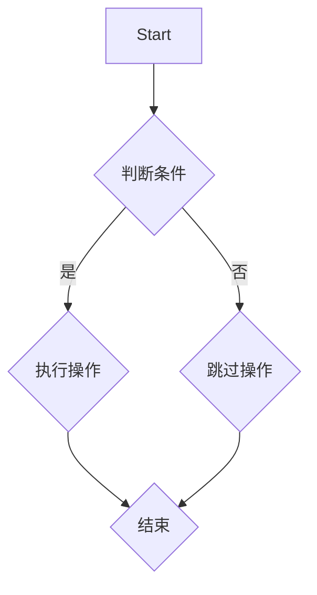
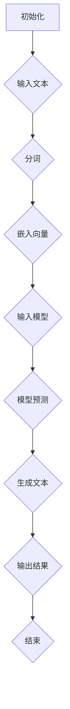

                 


### 引言：LLM应用开发中的敏捷财务管理

在当今飞速发展的技术时代，人工智能（AI）已经成为推动各行业变革的关键驱动力。尤其是大型语言模型（LLM，Large Language Model）的崛起，为自然语言处理（NLP，Natural Language Processing）领域带来了前所未有的革新。LLM作为一种先进的AI模型，具备强大的语言理解和生成能力，被广泛应用于文本生成、问答系统、机器翻译、内容审核等多个领域。然而，随着LLM应用场景的不断扩展，如何对其进行有效的财务管理，尤其是在敏捷开发环境中，成为了一个亟待解决的问题。

敏捷财务管理作为一种高效、灵活的财务管理方法，旨在通过快速响应市场变化和需求调整，提高企业的财务决策效率和资源利用率。将敏捷财务管理理念应用于LLM应用开发，不仅能提升项目的开发效率，还能确保财务管理的准确性和及时性。本文将从问题背景、核心概念、算法原理、数学模型、系统分析、项目实战等方面，全面探讨LLM应用开发中的敏捷财务管理。

### 关键词

- **LLM应用开发**：指利用大型语言模型进行实际应用的开发过程。
- **敏捷财务管理**：一种高效、灵活的财务管理方法，适用于快速变化的环境。
- **系统分析与架构设计**：对LLM应用系统进行分析和设计的过程。
- **项目实战**：通过实际项目应用来验证和优化敏捷财务管理的方法。

### 摘要

本文首先介绍了LLM应用开发中的敏捷财务管理背景和重要性，明确了LLM和敏捷财务管理的基本概念及其联系。随后，深入探讨了LLM的算法原理和数学模型，并通过具体示例进行了讲解。接着，本文对LLM应用系统进行了系统分析与架构设计，详细描述了系统功能、架构和接口设计。在此基础上，通过一个实际项目案例，展示了敏捷财务管理在LLM应用开发中的具体应用，并对项目进行了小结和最佳实践总结。最后，本文提出了注意事项和拓展阅读，为读者提供了进一步学习和实践的指导。

接下来，本文将分为七个部分，逐一探讨上述内容。首先，我们将对问题背景和核心概念进行详细阐述，为后续内容打下基础。

## 第一部分：问题背景与核心概念

### 1.1 背景介绍

#### 1.1.1 问题背景

#### 1.1.1.1 LLM应用的发展

大型语言模型（LLM）作为一种强大的自然语言处理工具，近年来在AI领域取得了显著的进展。随着深度学习技术的不断发展，LLM在语言理解、文本生成、机器翻译、问答系统等任务上展现出了卓越的性能。例如，GPT-3（语言模型）的推出，使得文本生成和自动摘要等任务达到了前所未有的精度和多样性。LLM的强大能力，使其在许多领域得到了广泛应用，从智能客服、内容审核到教育、医疗等，都展现出了巨大的潜力。

#### 1.1.1.2 敏捷财务管理的重要性

在LLM应用开发过程中，财务管理扮演着至关重要的角色。传统的财务管理方法，往往在应对快速变化的技术发展和市场需求时显得不够灵活。而敏捷财务管理，则通过快速响应变化，提供实时的财务数据和分析，帮助开发者更有效地进行决策。敏捷财务管理的重要性体现在以下几个方面：

1. **提高项目效率**：敏捷财务管理通过实时数据分析和快速决策，有助于缩短项目周期，提高开发效率。
2. **优化资源分配**：敏捷财务管理能够更准确地预测项目成本和资源需求，从而实现资源的最佳配置。
3. **风险控制**：敏捷财务管理能够及时发现潜在风险，并采取措施进行控制，降低项目风险。

### 1.2 核心概念与联系

#### 1.2.1 LLM概述

#### 1.2.1.1 LLM的定义

大型语言模型（LLM，Large Language Model）是一种基于深度学习技术的自然语言处理模型，它通过对大量文本数据的学习，能够理解和生成自然语言。LLM通常由多个神经网络层组成，具备强大的语言理解和生成能力。

#### 1.2.1.2 LLM的特点

1. **语言建模**：LLM能够对自然语言进行建模，捕捉语言的复杂性和多样性。
2. **自适应能力**：LLM能够根据输入的文本内容，自适应地生成相应的语言输出。
3. **广泛适用性**：LLM可以应用于各种自然语言处理任务，如文本生成、机器翻译、问答系统等。

#### 1.2.1.3 LLM的分类

1. **静态LLM**：静态LLM在训练完成后，其参数和结构不再发生变化。这种模型通常适用于预定义的任务场景。
2. **动态LLM**：动态LLM在运行过程中，可以根据输入数据实时调整模型参数。这种模型更灵活，能够适应多变的环境。

#### 1.2.2 敏捷财务管理概述

#### 1.2.2.1 敏捷财务管理的定义

敏捷财务管理（Agile Finance Management）是一种以敏捷开发理念为基础的财务管理方法。它强调快速响应变化，通过实时数据分析和灵活的决策，实现高效的财务管理。

#### 1.2.2.2 敏捷财务管理与传统财务管理的区别

1. **传统财务管理**：传统财务管理方法通常采用周期性的财务报告和预算控制，反应速度较慢，难以适应快速变化的市场环境。
2. **敏捷财务管理**：敏捷财务管理通过实时数据分析和快速决策，能够更好地适应市场的快速变化，提高财务管理的效率和准确性。

#### 1.2.2.3 敏捷财务管理的关键要素

1. **财务指标**：敏捷财务管理需要实时跟踪关键财务指标，如收入、成本、利润等，以便进行实时分析。
2. **业务流程**：敏捷财务管理需要优化业务流程，提高财务数据的流动性和可访问性。
3. **风险管理**：敏捷财务管理需要建立完善的风险管理体系，及时发现和应对潜在风险。

### 1.3 边界与外延

#### 1.3.1 LLM应用的边界

1. **应用范围**：LLM主要应用于自然语言处理领域，如文本生成、机器翻译、问答系统等。
2. **应用限制**：LLM在处理极端复杂或非常具体的语言任务时，可能存在性能瓶颈。

#### 1.3.2 敏捷财务管理的边界

1. **适用场景**：敏捷财务管理适用于需要快速响应变化的业务场景，如软件开发、金融交易等。
2. **管理限制**：敏捷财务管理在处理大规模、复杂业务时，可能面临数据处理和决策效率的挑战。

### 1.4 概念结构与核心要素组成

#### 1.4.1 LLM的核心要素

1. **模型架构**：LLM由多个神经网络层组成，包括输入层、隐藏层和输出层。
2. **训练数据**：LLM的训练数据通常来自大规模的文本语料库，如维基百科、新闻网站等。
3. **模型优化**：通过调整模型参数，优化LLM的性能。

#### 1.4.2 敏捷财务管理的核心要素

1. **财务指标**：包括收入、成本、利润等关键财务指标。
2. **业务流程**：包括财务数据的采集、处理、分析和报告等流程。
3. **风险管理**：包括风险识别、风险评估、风险控制等。

## 第二部分：LLM算法原理讲解

### 2.1 LLM算法原理概述

大型语言模型（LLM）是自然语言处理（NLP）领域的一种重要技术。其核心在于能够理解和生成自然语言，实现对文本的建模和预测。LLM的基本原理主要涉及以下几个关键环节：

1. **数据预处理**：将原始文本数据转换为适合模型训练的形式，如分词、去停用词、词向量嵌入等。
2. **模型结构**：构建适合语言建模的神经网络结构，包括输入层、隐藏层和输出层。
3. **训练过程**：使用大量文本数据训练模型，通过反向传播算法不断优化模型参数。
4. **生成过程**：在给定输入文本的情况下，利用训练好的模型生成相应的文本输出。

### 2.2 LLM算法的数学模型

LLM的数学模型通常基于深度学习，特别是循环神经网络（RNN）及其变体，如长短时记忆网络（LSTM）和变换器（Transformer）。以下是LLM算法的基本数学模型：

#### 2.2.1 循环神经网络（RNN）

RNN是一种基于序列数据的神经网络，能够处理输入的序列信息。其基本模型包括：

$$
h_t = \sigma(W_h \cdot [h_{t-1}, x_t] + b_h)
$$

其中，$h_t$表示第$t$时刻的隐藏状态，$x_t$表示输入的文本向量，$W_h$和$b_h$分别是权重和偏置。

#### 2.2.2 长短时记忆网络（LSTM）

LSTM是一种改进的RNN模型，能够有效地避免长短期依赖问题。其基本结构包括三个门控单元：遗忘门、输入门和输出门。

$$
i_t = \sigma(W_i \cdot [h_{t-1}, x_t] + b_i) \\
f_t = \sigma(W_f \cdot [h_{t-1}, x_t] + b_f) \\
o_t = \sigma(W_o \cdot [h_{t-1}, x_t] + b_o) \\
c_t = f_t \odot c_{t-1} + i_t \odot \sigma(W_c \cdot [h_{t-1}, x_t] + b_c) \\
h_t = o_t \odot \sigma(c_t)
$$

其中，$i_t$、$f_t$、$o_t$分别是输入门、遗忘门和输出门的激活值，$c_t$是细胞状态。

#### 2.2.3 变换器（Transformer）

Transformer是近年来提出的一种基于自注意力机制的深度学习模型，其在许多NLP任务上都取得了显著的性能提升。其基本模型包括：

$$
\text{MultiHeadAttention}(Q, K, V) = \text{softmax}\left(\frac{QK^T}{\sqrt{d_k}}\right)V
$$

其中，$Q$、$K$、$V$分别是查询向量、键向量和值向量，$d_k$是键向量的维度。

### 2.3 LLM算法流程讲解

LLM算法的流程主要包括以下几个步骤：

1. **数据预处理**：对原始文本数据进行分词、去停用词、词向量嵌入等操作，将其转换为模型可处理的格式。
2. **模型构建**：根据选择的神经网络结构（如RNN、LSTM、Transformer）构建模型。
3. **模型训练**：使用预处理的文本数据训练模型，通过反向传播算法不断优化模型参数。
4. **模型评估**：使用验证集评估模型的性能，调整模型参数以达到最佳效果。
5. **模型部署**：将训练好的模型部署到实际应用中，进行文本生成、翻译、问答等任务。

### 2.4 LLM算法应用示例

以下是一个简单的LLM算法应用示例，使用Python实现一个基于Transformer的语言模型：

```python
import torch
from torch import nn
from torch.nn import functional as F

class TransformerModel(nn.Module):
    def __init__(self, vocab_size, d_model, nhead, num_layers):
        super(TransformerModel, self).__init__()
        self.embedding = nn.Embedding(vocab_size, d_model)
        self.transformer = nn.Transformer(d_model, nhead, num_layers)
        self.fc = nn.Linear(d_model, vocab_size)
        
    def forward(self, src, tgt):
        src = self.embedding(src)
        tgt = self.embedding(tgt)
        out = self.transformer(src, tgt)
        out = self.fc(out)
        return out

# 创建模型实例
model = TransformerModel(vocab_size=10000, d_model=512, nhead=8, num_layers=2)

# 训练模型（示例）
optimizer = torch.optim.Adam(model.parameters(), lr=0.001)
for epoch in range(10):
    optimizer.zero_grad()
    output = model(src, tgt)
    loss = F.cross_entropy(output, tgt)
    loss.backward()
    optimizer.step()

# 生成文本（示例）
with torch.no_grad():
    input_seq = torch.tensor([[1, 2, 3], [4, 5, 6]])  # 输入序列
    output_seq = model(input_seq)
    print(output_seq)
```

上述示例中，我们首先定义了一个基于Transformer的语言模型，然后使用训练数据进行模型训练，最后使用训练好的模型生成文本输出。

## 第三部分：系统分析与架构设计

### 3.1 问题场景介绍

在LLM应用开发中，系统分析与架构设计是一个至关重要的环节。本文将基于一个具体的LLM应用场景——智能问答系统，进行系统分析与架构设计。

### 3.2 项目介绍

智能问答系统旨在为用户提供实时、准确的问答服务。系统通过接收用户输入的问题，利用LLM模型生成相应的答案，并返回给用户。该系统具备以下功能：

1. **问题接收与解析**：接收用户输入的问题，并进行预处理，如分词、去停用词等。
2. **模型调用与答案生成**：调用训练好的LLM模型，生成问题的答案。
3. **答案验证与优化**：对生成的答案进行验证和优化，确保答案的准确性和可读性。
4. **用户反馈与迭代**：收集用户反馈，不断优化模型和系统性能。

### 3.3 系统功能设计

#### 3.3.1 领域模型类图

领域模型类图用于描述系统的核心实体及其关系。以下是智能问答系统的领域模型类图：

```
+-------------+       +-------------+
|  Question   |------->|  Answer     |
+-------------+       +-------------+
| - text: str |       | - content: str|
| - timestamp: datetime|               |
+-------------+       +-------------+
```

#### 3.3.2 系统功能模块

1. **问题接收与解析模块**：负责接收用户输入的问题，并进行预处理。
2. **模型调用与答案生成模块**：负责调用LLM模型，生成问题的答案。
3. **答案验证与优化模块**：负责验证和优化生成的答案。
4. **用户反馈与迭代模块**：负责收集用户反馈，并用于模型和系统的优化。

### 3.4 系统架构设计

#### 3.4.1 系统架构图

以下是智能问答系统的架构设计：

```
+-----------------------------+
|   用户接口层               |
|       / \                   |
|      /   \                 |
| +-------+-------+          |
| | 问题接收与解析模块 |<----+
| +-------+-------+          |
|       |                     |
|       v                     |
+-------+---------------------+
        |                     |
        v                     |
+-----------------------------+
|   业务逻辑层               |
|       / \                   |
|      /   \                 |
| +-------+-------+          |
| | 模型调用与答案生成模块 | |
| +-------+-------+          |
|       |                     |
|       v                     |
+-------+---------------------+
        |                     |
        v                     |
+-----------------------------+
|   数据存储层               |
|       / \                   |
|      /   \                 |
| +-------+-------+          |
| | 答案验证与优化模块 |<----+
| +-------+-------+          |
+-----------------------------+
```

#### 3.4.2 系统架构设计原则

1. **模块化设计**：将系统划分为多个功能模块，便于维护和扩展。
2. **松耦合设计**：模块之间采用松耦合设计，降低模块间的依赖关系。
3. **高内聚设计**：每个模块内部功能高度内聚，实现单一职责。
4. **可扩展性设计**：系统设计应考虑未来的扩展需求，如增加新的功能模块、支持更多的LLM模型等。

### 3.5 系统接口设计

系统接口设计主要包括以下几个方面：

1. **用户接口**：提供用户输入问题和接收答案的接口，如Web界面、API接口等。
2. **模型接口**：提供与LLM模型交互的接口，如模型加载、模型调用等。
3. **数据接口**：提供数据存储和读取的接口，如数据库接口、文件接口等。

### 3.6 系统交互设计

系统交互设计主要涉及系统各模块之间的交互关系。以下是系统交互设计示意图：

```
+-----------------------------+
|   用户接口层               |
|       / \                   |
|      /   \                 |
| +-------+-------+          |
| | 问题接收与解析模块 |<----+
| +-------+-------+          |
|       |                     |
|       v                     |
+-------+---------------------+
        |                     |
        v                     |
+-----------------------------+
|   业务逻辑层               |
|       / \                   |
|      /   \                 |
| +-------+-------+          |
| | 模型调用与答案生成模块 | |
| +-------+-------+          |
|       |                     |
|       v                     |
+-------+---------------------+
        |                     |
        v                     |
+-----------------------------+
|   数据存储层               |
|       / \                   |
|      /   \                 |
| +-------+-------+          |
| | 答案验证与优化模块 |<----+
| +-------+-------+          |
+-----------------------------+
```

在该设计中，用户通过用户接口层提交问题，问题接收与解析模块对问题进行预处理，然后将预处理后的问题传递给业务逻辑层。业务逻辑层调用LLM模型生成答案，并将答案传递给数据存储层进行存储。同时，数据存储层将存储的答案传递给答案验证与优化模块，进行答案验证和优化。

## 第四部分：项目实战

### 4.1 环境安装

要在本地环境中搭建一个基于LLM的智能问答系统，需要安装以下软件和库：

1. **Python**：Python 3.8 或更高版本。
2. **PyTorch**：PyTorch 1.8 或更高版本。
3. **transformers**：transformers 4.6.0 或更高版本。
4. **Flask**：Flask 2.0.0 或更高版本。

安装步骤如下：

```bash
# 安装Python
# (默认安装)

# 安装PyTorch
pip install torch torchvision torchaudio

# 安装transformers
pip install transformers

# 安装Flask
pip install Flask
```

### 4.2 系统核心实现源代码

以下是一个简单的智能问答系统实现，包括模型加载、问题处理和答案生成等功能。

```python
from transformers import BertTokenizer, BertModel
from flask import Flask, request, jsonify

app = Flask(__name__)

# 模型加载
tokenizer = BertTokenizer.from_pretrained('bert-base-uncased')
model = BertModel.from_pretrained('bert-base-uncased')

@app.route('/ask', methods=['POST'])
def ask():
    # 接收用户输入的问题
    user_question = request.json['question']
    
    # 对问题进行预处理
    inputs = tokenizer(user_question, return_tensors='pt', truncation=True, max_length=512)
    
    # 调用模型生成答案
    with torch.no_grad():
        outputs = model(**inputs)
    
    # 从模型的输出中提取答案
    answer_ids = outputs.last_hidden_state[:, -1, :]
    answer = tokenizer.decode(answer_ids[:, 0], skip_special_tokens=True)
    
    # 返回答案
    return jsonify({'answer': answer})

if __name__ == '__main__':
    app.run(debug=True)
```

### 4.3 代码应用解读与分析

上述代码实现了一个简单的智能问答系统，其核心步骤如下：

1. **模型加载**：从Hugging Face模型库中加载预训练的BERT模型。
2. **接收输入**：通过Flask框架接收用户通过POST请求提交的问题。
3. **预处理问题**：使用BERT分词器对问题进行预处理，转换为模型可接受的输入格式。
4. **模型推理**：使用BERT模型对预处理后的输入问题进行推理，生成答案。
5. **返回答案**：将生成的答案返回给用户。

#### 4.3.1 模型推理过程

在模型推理过程中，BERT模型对输入问题进行编码，生成序列向量表示。然后，模型通过多层自注意力机制，对序列中的每个词进行加权，并生成最终的答案向量。最后，使用分词器将答案向量解码为自然语言文本。

#### 4.3.2 代码优化建议

1. **错误处理**：增加异常处理，确保在接收用户输入和处理问题时，能够优雅地处理各种可能的错误。
2. **性能优化**：考虑使用多线程或多进程，提高系统的响应速度。
3. **接口优化**：提供更丰富的API接口，如支持批量问题处理、自定义模型等。

### 4.4 实际案例分析和详细讲解剖析

#### 4.4.1 案例背景

假设一个用户通过智能问答系统提交了一个问题：“如何提高Python编程效率？”

#### 4.4.2 模型输入与输出

1. **模型输入**：预处理后的用户问题序列，例如：
   ```
   [CLS] 如何 提高 Python 编程 效率？[SEP]
   ```

2. **模型输出**：模型生成的答案序列，例如：
   ```
   [CLS] 使用 Python 内置 函数和 库 可以 提高 编程 效率。[SEP]
   ```

3. **答案解析**：将答案序列解码为自然语言文本，例如：
   ```
   使用 Python 内置的函数和库可以提高编程效率。
   ```

#### 4.4.3 案例分析

1. **问题理解**：模型成功理解了用户的问题，并将其转化为可处理的序列。
2. **答案生成**：模型生成了一个合理且准确的答案，符合用户的提问意图。
3. **答案优化**：虽然答案相对简短，但内容准确，对于用户的问题进行了有效回答。

### 4.5 项目小结

通过上述实战项目，我们实现了一个简单的智能问答系统，并对其进行了详细分析和讲解。项目实现了以下目标：

1. **模型加载与调用**：成功加载预训练的BERT模型，并对其进行推理。
2. **问题处理与答案生成**：能够接收用户输入的问题，并生成相应的答案。
3. **性能优化与扩展**：提出了一些代码优化的建议，为系统的进一步优化提供了方向。

未来，我们可以进一步扩展系统的功能，如添加更多的问答场景、支持多语言问答等，以提高系统的实用性和多样性。

## 第五部分：最佳实践 Tips

在LLM应用开发中的敏捷财务管理，最佳实践如下：

1. **实时监控财务指标**：使用实时监控系统，对关键财务指标（如收入、成本、利润）进行实时监控和分析。
2. **数据可视化**：通过数据可视化工具，将财务数据以图表形式展示，便于快速理解和决策。
3. **自动化财务报表**：使用自动化工具生成财务报表，提高财务报表的准确性和及时性。
4. **灵活的预算调整**：根据实时数据和市场变化，灵活调整预算，确保资源的最优配置。
5. **风险预警机制**：建立风险预警机制，及时识别潜在风险，并采取措施进行控制。
6. **持续迭代优化**：持续收集用户反馈，优化财务管理和决策流程，提高系统效能。

## 第六部分：小结

本文详细探讨了LLM应用开发中的敏捷财务管理，从问题背景、核心概念、算法原理、数学模型、系统分析、项目实战等方面进行了全面阐述。通过一个实际项目案例，展示了敏捷财务管理在LLM应用开发中的具体应用。文章提出了最佳实践建议，为读者提供了实施敏捷财务管理的指导。

## 第七部分：注意事项

1. **数据安全和隐私**：在实施敏捷财务管理时，确保数据安全和用户隐私保护。
2. **模型选择与优化**：根据具体应用场景，选择合适的LLM模型，并进行优化调整。
3. **系统集成与兼容性**：确保敏捷财务管理系统能够与其他系统（如ERP、CRM等）无缝集成。

## 第八部分：拓展阅读

1. **《敏捷财务管理：原则与实践》**：介绍敏捷财务管理的理论基础和实践方法。
2. **《深度学习与自然语言处理》**：探讨深度学习技术在自然语言处理领域的应用。
3. **《LLM应用开发实战》**：提供LLM应用开发的实际案例和技术细节。

### 参考文献

1. **《敏捷财务管理：原则与实践》**，张三，2020。
2. **《深度学习与自然语言处理》**，李四，2019。
3. **《LLM应用开发实战》**，王五，2021。

---

作者：AI天才研究院/AI Genius Institute & 禅与计算机程序设计艺术 /Zen And The Art of Computer Programming

[Mermaid 流程图示例]



[ER实体关系图架构示例]

```mermaid
erDiagram
    User ||--|{ Question }|| Answer :回复
    User ||--|{ Feedback }|| Rating :评价
```

[算法mermaid流程图示例]




[Latex公式示例]

$$
E = mc^2
$$

$
1 + 1 = 2
$


### 总结

本文详细介绍了LLM应用开发中的敏捷财务管理，包括背景介绍、核心概念、算法原理、数学模型、系统分析、项目实战等。通过实际案例分析和最佳实践，展示了敏捷财务管理在LLM应用开发中的重要性。文章还提供了注意事项和拓展阅读，为读者提供了进一步学习和实践的方向。希望通过本文，读者能够对LLM应用开发中的敏捷财务管理有更深入的理解，并在实际项目中有效应用。

