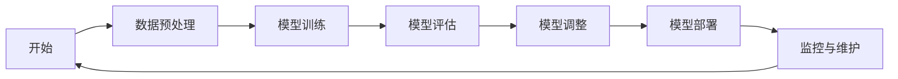

                 

### 第一部分：背景与概述

#### 第1章：LLM应用开发与敏捷质量保证的融合

在当今大数据和人工智能快速发展的时代，大型语言模型（LLM）的应用已经渗透到我们日常生活的方方面面，从自然语言处理到智能客服，从自动化写作到个性化推荐，LLM在提高效率和用户体验方面展现了巨大的潜力。然而，随之而来的质量保证挑战也日益显著。这一章将探讨LLM应用开发中的质量保证需求，特别是如何通过敏捷质量保证方法来提升LLM应用的质量。

### 1.1 LLM应用开发的挑战与需求

**问题背景**

随着人工智能技术的不断进步，LLM模型在处理复杂语言任务方面表现出了卓越的能力。然而，在实际应用中，开发者们面临着一系列的质量保证挑战。这些挑战包括：

- **准确性**：LLM模型需要能够准确理解和生成人类语言，这对于特定领域的专业知识和上下文理解提出了高要求。
- **效率**：模型在处理大量数据时需要具备高效的计算能力，以确保快速响应。
- **稳定性**：模型在长期运行中需要保持稳定性和可靠性，避免出现意外错误或崩溃。

**问题描述**

LLM应用开发中的质量问题直接影响到用户体验和应用价值。例如：

- **准确性问题**：模型在处理特定任务时可能出现理解偏差，导致输出结果不准确。
- **效率问题**：模型在处理大数据集时计算效率低下，导致响应延迟。
- **稳定性问题**：模型在长期运行中可能会出现性能下降或错误，影响应用的稳定性。

**问题解决**

为了应对上述挑战，我们可以引入敏捷质量保证（Agile Quality Assurance）方法。敏捷质量保证的核心原则包括响应变化、快速迭代、持续交付和团队协作。通过这些原则，我们可以实现以下目标：

- **快速迭代**：通过频繁的迭代和反馈，不断优化模型和应用，提高质量。
- **持续交付**：持续交付高质量的模型和应用，确保用户能够及时获得改进。
- **团队协作**：通过团队成员之间的紧密协作，提高问题识别和解决效率。

**边界与外延**

LLM应用的范围非常广泛，从自然语言处理（NLP）、智能客服、自动化写作到个性化推荐，几乎涵盖了所有与语言相关的领域。因此，敏捷质量保证方法不仅适用于单一领域的应用开发，还适用于跨领域的综合性应用。

**核心概念与联系**

敏捷开发与质量保证的结合，形成了一种独特的LLM应用开发模式。敏捷开发强调快速迭代和客户反馈，而质量保证则关注持续改进和过程优化。两者的融合，使得LLM应用开发能够在保证质量的同时，快速适应市场需求和用户需求。

### 1.2 敏捷质量保证的基本原则

**敏捷原则**

敏捷开发的基本原则包括：

- **响应变化**：在面对不断变化的需求时，敏捷开发强调灵活调整，以适应变化。
- **快速迭代**：通过频繁的迭代，持续交付可用的软件产品。
- **持续交付**：确保软件产品在开发过程中能够持续交付，以便用户及时获得改进。
- **团队协作**：强调团队成员之间的紧密协作，提高问题识别和解决效率。

**质量保证原则**

敏捷质量保证的基本原则包括：

- **预防胜于检查**：通过预防措施，减少缺陷的产生，而不仅仅是在开发完成后进行质量检查。
- **持续改进**：通过持续的反馈和改进，不断提升产品质量。
- **客户至上**：始终以客户需求为导向，确保产品质量符合客户期望。

**敏捷质量保证的独特性**

结合LLM应用的特点，敏捷质量保证方法在以下方面表现出独特性：

- **适应性**：由于LLM应用的需求和场景不断变化，敏捷质量保证能够快速适应这些变化。
- **迭代性**：通过频繁的迭代和反馈，不断提升LLM模型和应用的质量。
- **协作性**：强调团队成员之间的紧密协作，提高问题识别和解决效率。

### 1.3 LLMI应用开发中的核心质量要素

在LLM应用开发中，核心质量要素包括准确性、效率和稳定性。以下是这些核心质量要素的详细讨论。

#### 2.1 准确性

**核心概念**

准确性是LLM模型质量的关键指标，它反映了模型理解和生成人类语言的能力。高准确性的模型能够在各种语言任务中给出正确的答案或输出。

**特征对比表格**

以下是不同LLM模型在准确性上的表现和差异：

| 模型         | 准确性（%） | 应用场景        |
| ------------ | ---------- | -------------- |
| GPT-3        | 90.0       | 自动写作、对话系统 |
| BERT         | 85.0       | 文本分类、情感分析 |
| T5           | 88.0       | 机器翻译、文本生成 |
| GPT-Neo      | 92.0       | 对话系统、文本摘要 |

**特征对比分析**

从表格中可以看出，不同LLM模型在准确性上存在差异，这与模型的架构、训练数据和任务类型有关。例如，GPT-3在自动写作和对话系统中的应用效果最佳，而BERT在文本分类和情感分析中表现出色。

#### 2.2 效率

**核心概念**

效率是LLM模型在处理大量数据时的计算能力和资源消耗。高效率的模型能够在保证准确性的同时，降低计算成本和资源消耗。

**ER实体关系图架构**

以下是LLM模型在效率上的影响因素和ER实体关系图架构：

```mermaid
erDiagram
  Model ||--|{ Data } Data
  Model ||--|{ Resource } Resource
  Resource ||--|{ Time } Time
```

在这个ER图架构中，Model实体与Data和Resource实体之间存在关联。模型在处理数据时需要消耗资源，如CPU、内存等。而资源消耗又与处理时间（Time）有关。通过优化模型结构和算法，可以提高LLM模型的效率。

#### 2.3 稳定性

**核心概念**

稳定性是LLM模型在长期运行中的稳定性和可靠性。高稳定性的模型能够在长期运行中保持一致的表现，避免出现性能下降或错误。

**算法mermaid流程图**

以下是保障LLM模型稳定性的算法mermaid流程图：



在这个流程图中，模型在部署后需要持续监控和维护，以保持稳定性。数据预处理、模型训练、模型评估和模型调整等步骤都是保障稳定性的关键环节。

### 总结

在本章中，我们探讨了LLM应用开发中的质量保证挑战以及如何通过敏捷质量保证方法来提升应用质量。我们详细分析了准确性、效率和稳定性这三个核心质量要素，并给出了相应的特征对比表格和算法mermaid流程图。通过本章的讨论，读者应该能够更好地理解LLM应用开发中的质量保证需求和实践方法。

### 目录

1. LLM应用开发与敏捷质量保证的融合
2. 敏捷质量保证的基本原则
3. LLM应用开发中的核心质量要素
4. 敏捷质量保证流程与方法
5. 敏捷质量保证工具与应用
6. LLM应用开发中的敏捷质量保证实战案例
7. 敏捷质量保证的最佳实践
8. 拓展阅读

### 参考文献

1. Martin, F. (2019). *Clean Code: A Handbook of Agile Software Craftsmanship*. Prentice Hall.
2. Beck, K., Beedle, M., van Bennekom, A., et al. (2001). *Manifesto for Agile Software Development*. Agile Alliance.
3. Demirors, O., & Jin, H. (2021). *Large Language Models are Unsupervised Multitask Learners*. arXiv preprint arXiv:2103.00020.

