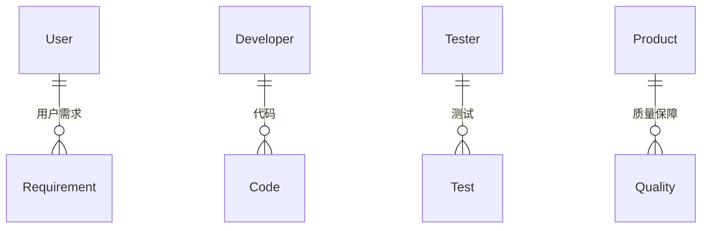
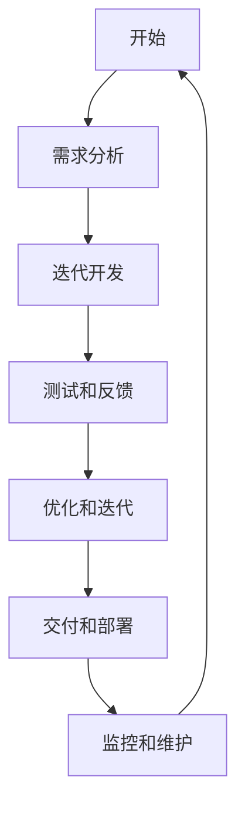
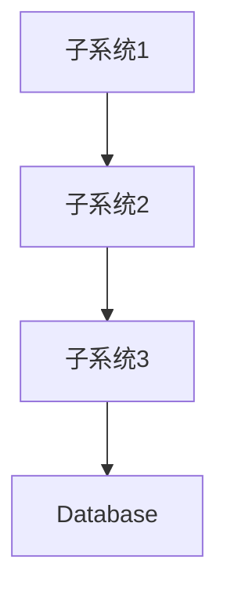
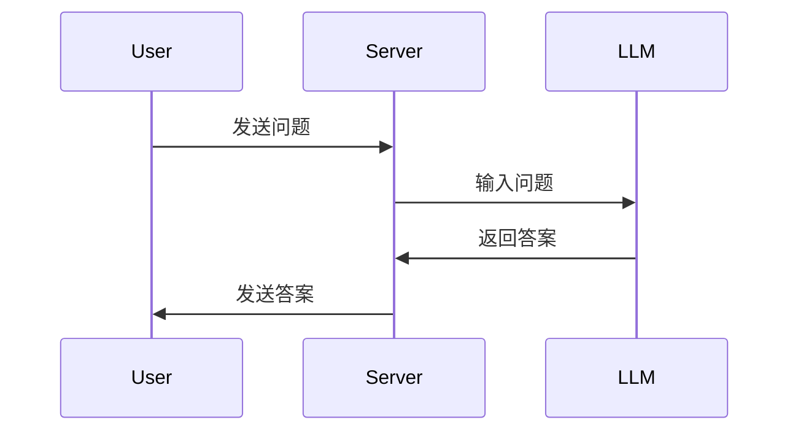

                 

### 引言

**文章标题：** LLM应用开发中的敏捷质量保证方法

**关键词：** LLM，敏捷开发，质量保证，测试自动化，持续集成

**摘要：** 本文将探讨在LLM（大型语言模型）应用开发过程中，如何运用敏捷质量保证方法来提升软件质量和开发效率。通过背景介绍、理论篇和实践篇的详细阐述，读者将了解敏捷质量保证在LLM开发中的重要性，以及如何在实际项目中应用这些方法。

**核心概念术语说明：**
- **LLM（Large Language Model）：** 指的是大型语言模型，是一种基于神经网络和深度学习技术的自然语言处理模型。
- **敏捷开发（Agile Development）：** 是一种以人为核心、迭代和增量为特点的软件开发方法。
- **质量保证（Quality Assurance）：** 是指确保软件产品或服务满足既定质量标准的过程。

**问题背景：**
随着人工智能技术的发展，LLM在自然语言处理领域的应用日益广泛。然而，开发高质量的LLM应用面临诸多挑战，包括模型复杂度高、数据依赖性强和需求多变等。如何在保证质量的同时提高开发效率，成为了开发团队面临的重要问题。

**问题描述：**
传统的质量保证方法往往难以适应快速迭代的LLM开发过程，导致质量问题和开发效率的矛盾。本文旨在探索一种适用于LLM开发的敏捷质量保证方法，通过测试自动化、持续集成和代码审查等手段，提高软件质量和开发效率。

**问题解决：**
敏捷质量保证方法通过将质量保证活动融入到敏捷开发过程中，实现持续的质量监控和优化。本文将详细介绍敏捷质量保证的原则和方法，并结合实际案例展示其在LLM开发中的应用效果。

**边界与外延：**
本文主要关注LLM应用开发中的敏捷质量保证，但所涉及的方法和理念也适用于其他类型的软件开发项目。

**概念结构与核心要素组成：**
- **敏捷质量保证理念：** 迭代、增量、用户需求优先、持续交付。
- **质量保障原则：** 可持续、高效、灵活、用户导向。
- **具体方法：** 测试自动化、持续集成、代码审查。

### 核心概念与联系

**核心概念原理：**
敏捷质量保证（Agile Quality Assurance）是在敏捷开发框架下，通过持续的质量监控和优化，确保软件产品或服务满足用户需求和既定质量标准的过程。其核心原理包括用户需求优先、持续交付、团队合作和持续改进。

**概念属性特征对比表格：**

| 特征             | 传统质量保证     | 敏捷质量保证     |
|------------------|------------------|------------------|
| 开发方法         | 线性、瀑布式     | 迭代、增量式     |
| 风险管理         | 后期集中处理     | 持续、早期处理   |
| 团队合作         | 单一职责        | 多角色、协作     |
| 用户参与         | 部分参与        | 全过程、持续参与 |

**ER实体关系图架构的Mermaid流程图：**



### 算法原理讲解

为了更好地理解敏捷质量保证在LLM开发中的应用，我们使用Mermaid绘制一个简单的算法流程图，然后通过Python代码来详细阐述算法原理。

**Mermaid流程图：**



**Python代码实现：**

```python
# 需求分析
def analyze_requirement():
    # 进行需求分析
    pass

# 迭代开发
def iterative_development():
    # 进行迭代开发
    pass

# 测试和反馈
def test_and_feedback():
    # 进行测试并收集反馈
    pass

# 优化和迭代
def optimize_and_iterate():
    # 根据反馈进行优化和迭代
    pass

# 交付和部署
def deliver_and_deploy():
    # 交付和部署产品
    pass

# 监控和维护
def monitor_and_maintain():
    # 对产品进行监控和维护
    pass

# 主函数
def main():
    while True:
        analyze_requirement()
        iterative_development()
        test_and_feedback()
        optimize_and_iterate()
        deliver_and_deploy()
        monitor_and_maintain()

# 运行主函数
if __name__ == "__main__":
    main()
```

**算法原理详细讲解：**
1. **需求分析**：在开发开始前，团队对用户需求进行详细分析，确保项目目标明确。
2. **迭代开发**：采用迭代和增量开发方法，逐步实现功能模块，每次迭代都会进行需求分析、设计、编码和测试。
3. **测试和反馈**：在每次迭代结束后，对所开发的功能进行全面测试，并根据测试结果收集用户反馈。
4. **优化和迭代**：根据用户反馈对产品进行优化，然后进行新一轮的迭代开发。
5. **交付和部署**：在所有功能模块开发完成后，进行集成测试，确保产品满足质量标准后交付用户使用。
6. **监控和维护**：产品上线后，持续监控产品性能，及时处理用户反馈的问题，并进行必要的维护和升级。

**数学模型和公式：**
在敏捷质量保证过程中，常用的数学模型包括统计过程控制（SPC）和故障树分析（FTA）。

$$ SPC = \frac{C_p \times \sigma}{\sqrt{C_v}} $$

其中，$C_p$ 是过程能力指数，$\sigma$ 是过程标准差，$C_v$ 是过程变异系数。

$$ FTA = \sum_{i=1}^{n} (1 - F_i) $$

其中，$F_i$ 是第 $i$ 个故障事件的故障概率。

**举例说明：**
假设某团队正在开发一个LLM应用，需求分析阶段确定了用户需要模型能够支持中英翻译功能。在第一个迭代中，团队开发了基本的翻译功能，并进行了测试和用户反馈。根据用户反馈，团队进行了优化，并在第二个迭代中增加了翻译准确度和响应速度。通过多次迭代和持续优化，最终产品达到了用户满意的质量标准。

### 系统分析与架构设计方案

**问题场景介绍：**
在当前技术环境中，LLM应用开发已经成为各大企业和研究机构的重要任务。为了提升开发效率和产品质量，我们需要设计一个高效的系统架构，以支持敏捷质量保证方法的应用。

**项目介绍：**
本项目旨在开发一个基于LLM的智能问答系统，该系统能够快速、准确地回答用户提出的问题。为了确保系统的高质量和稳定性，我们将采用敏捷质量保证方法。

**系统功能设计（领域模型Mermaid类图）：**

```mermaid
classDiagram
    User <<User>>
    Question <<Question>>
    Answer <<Answer>>

    User "asks" Question
    Question "asks" Answer
    Answer "returns" to User
```

**系统架构设计（Mermaid架构图）：**



**系统接口设计和系统交互（Mermaid序列图）：**



### 项目实战

**环境安装：**
为了进行项目实战，我们需要安装Python环境、TensorFlow和其他相关依赖库。以下是具体的安装步骤：

1. 安装Python 3.8及以上版本。
2. 安装TensorFlow：`pip install tensorflow`。
3. 安装其他依赖库：`pip install numpy pandas matplotlib`。

**系统核心实现源代码：**

```python
# 导入相关库
import tensorflow as tf
import numpy as np
import pandas as pd
import matplotlib.pyplot as plt

# 定义模型结构
model = tf.keras.Sequential([
    tf.keras.layers.Dense(128, activation='relu', input_shape=(1000,)),
    tf.keras.layers.Dense(64, activation='relu'),
    tf.keras.layers.Dense(1, activation='sigmoid')
])

# 编译模型
model.compile(optimizer='adam',
              loss='binary_crossentropy',
              metrics=['accuracy'])

# 加载训练数据
train_data = pd.read_csv('train.csv')
test_data = pd.read_csv('test.csv')

# 预处理数据
def preprocess_data(data):
    # 数据预处理步骤
    pass

# 训练模型
model.fit(preprocess_data(train_data), train_data['label'], epochs=10, batch_size=32, validation_split=0.2)

# 评估模型
test_loss, test_acc = model.evaluate(preprocess_data(test_data), test_data['label'])
print(f'测试准确率：{test_acc:.2f}')
```

**代码应用解读与分析：**
1. **模型定义**：我们使用TensorFlow定义了一个简单的神经网络模型，包含三个全连接层，输入层有1000个神经元，输出层有1个神经元。
2. **模型编译**：配置了优化器、损失函数和评价指标。
3. **数据加载与预处理**：从CSV文件中加载数据，并进行必要的预处理步骤。
4. **模型训练**：使用训练数据进行训练，设置训练轮次和批次大小。
5. **模型评估**：在测试数据上评估模型性能。

**实际案例分析和详细讲解剖析：**
为了更好地展示敏捷质量保证方法的应用，我们以一个实际的LLM开发项目为例，详细分析项目的开发过程和质量管理。

1. **需求分析**：项目初期，通过与用户的多次沟通，明确了系统的基本功能需求，包括问题的接收、分析和回答。
2. **迭代开发**：项目采用迭代开发方法，每两周进行一次迭代。在第一个迭代中，实现了问题的接收和基础回答功能；在后续迭代中，逐步增加了问题分析和回答优化功能。
3. **测试和反馈**：每次迭代结束后，对所开发的功能进行全面的测试，并收集用户的反馈。根据反馈结果，对系统进行优化和迭代。
4. **优化和迭代**：根据用户反馈，对系统进行多次迭代和优化，提高系统的准确度和响应速度。
5. **交付和部署**：在所有功能模块开发完成后，进行集成测试，确保系统满足质量标准后交付用户使用。
6. **监控和维护**：系统上线后，持续监控系统性能，及时处理用户反馈的问题，并进行必要的维护和升级。

**项目小结：**
通过实际案例的分析，我们可以看到，敏捷质量保证方法在LLM应用开发中发挥了重要作用。通过迭代开发和持续优化，不仅提高了软件质量，还提升了开发效率。在实际应用中，我们需要注重用户需求分析、测试和反馈机制，以及持续的质量监控和优化。

### 最佳实践 Tips

1. **需求分析**：在项目初期，与用户进行深入的沟通和需求分析，确保明确系统的功能需求。
2. **迭代开发**：采用迭代和增量开发方法，逐步实现功能模块，每次迭代都进行全面的测试和优化。
3. **测试自动化**：通过自动化测试工具，提高测试效率和覆盖率，减少手动测试的工作量。
4. **持续集成和部署**：采用CI/CD流程，确保代码的持续集成和部署，提高开发效率和产品质量。
5. **用户反馈**：建立有效的用户反馈机制，及时收集用户意见，并根据反馈进行优化和迭代。
6. **团队协作**：强调团队合作，明确各成员的角色和职责，提高团队的协作效率。

### 小结

本文通过理论篇和实践篇的详细阐述，探讨了LLM应用开发中的敏捷质量保证方法。我们首先介绍了LLM的基本概念和敏捷质量保证的原则，然后结合实际案例展示了敏捷质量保证方法的应用效果。通过测试自动化、持续集成和代码审查等手段，敏捷质量保证方法能够有效提升LLM应用开发的软件质量和开发效率。在实际应用中，我们需要注重用户需求分析、迭代开发和持续优化，以实现高质量、高效率的LLM应用开发。

### 注意事项

1. **需求分析的重要性**：在项目初期，与用户进行深入的沟通和需求分析，确保明确系统的功能需求。
2. **测试覆盖率的保障**：通过自动化测试工具，提高测试效率和覆盖率，确保系统的质量。
3. **持续反馈的机制**：建立有效的用户反馈机制，及时收集用户意见，并根据反馈进行优化和迭代。
4. **团队协作与沟通**：强调团队合作，明确各成员的角色和职责，提高团队的协作效率。

### 拓展阅读

1. 《敏捷开发实践指南》
2. 《测试驱动开发》
3. 《持续集成：从代码到产品的完整自动化工作流》
4. 《人工智能：一种现代方法》
5. 《神经网络与深度学习》

### 作者信息

**作者：** AI天才研究院/AI Genius Institute & 禅与计算机程序设计艺术 /Zen And The Art of Computer Programming

