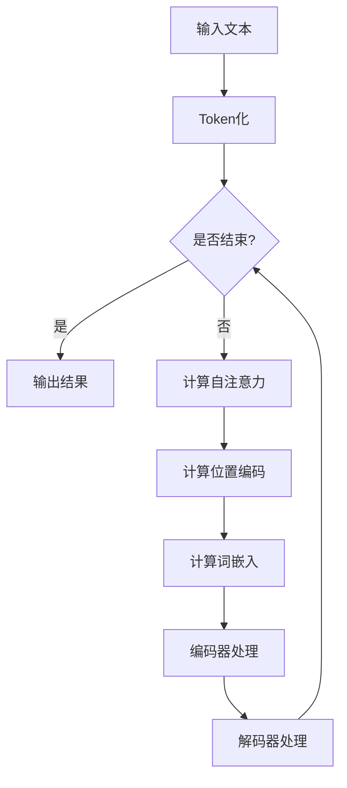
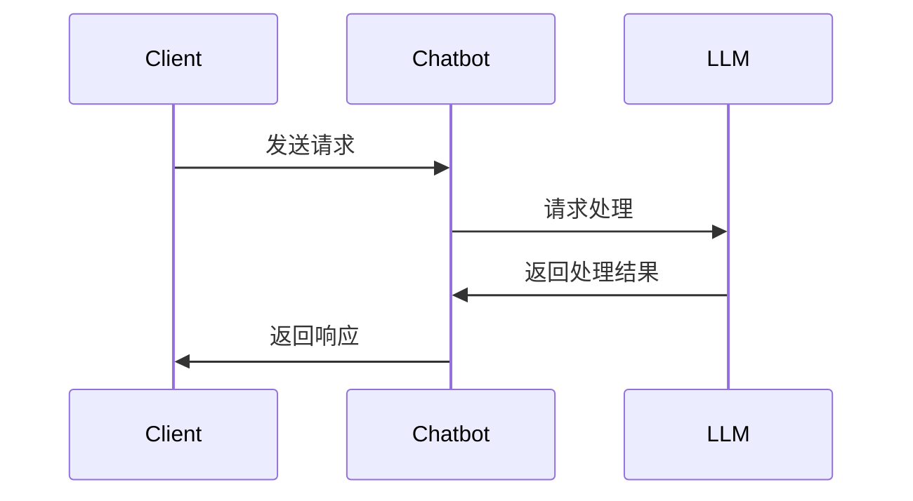
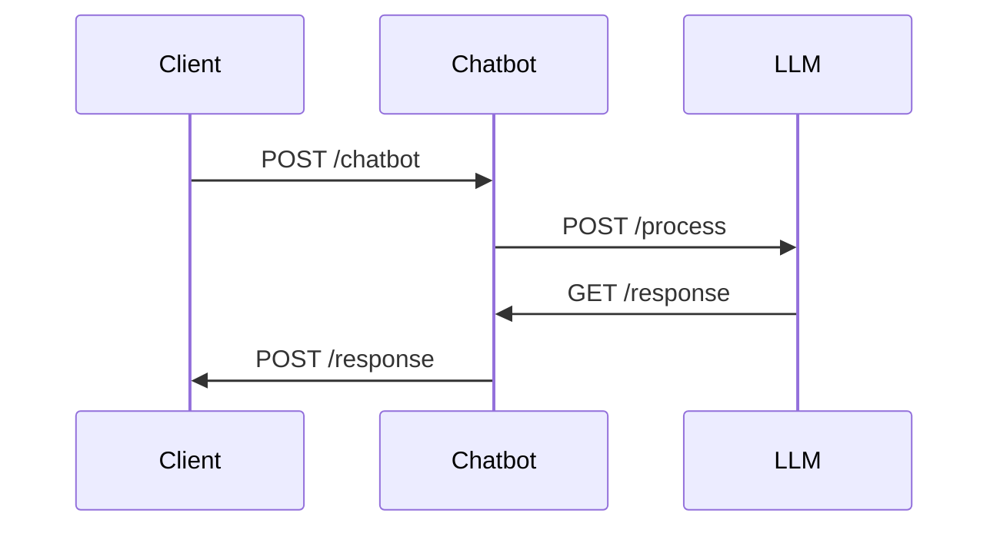

                 

### LLAMA模型详解

#### 1. 模型概述

LLAMA（Large Language Model with Attention）是一种基于注意力机制的自然语言处理模型。该模型由清华大学 KEG 实验室和智谱AI共同训练，并在2023年推出。LLAMA模型采用了先进的 Transformer 结构，具有强大的文本生成和理解能力。它的核心在于注意力机制，能够对输入文本的不同部分进行不同权重的处理，从而生成更准确、连贯的输出。

#### 2. 结构与组件

LLAMA模型主要由以下几个关键组件构成：

- **Embedding Layer（嵌入层）**：将输入的单词或字符转换为向量表示。
- **Positional Encoding（位置编码）**：为序列中的每个词添加位置信息，使得模型能够理解词语的顺序。
- **Transformer Encoder（Transformer编码器）**：通过多层叠加的Transformer结构对输入序列进行编码，每一层都能捕捉到输入序列的不同特征。
- **Attention Mechanism（注意力机制）**：在Transformer编码器中，注意力机制使得模型能够自动学习到不同位置之间的相关性，从而生成更加准确、连贯的输出。
- **Decoder（解码器）**：与编码器相对应，用于生成输出序列。

#### 3. 工作原理

LLAMA模型的工作原理可以分为以下几个步骤：

1. **输入处理**：首先，将输入的文本数据通过Embedding Layer转换为向量表示，并添加位置编码。
2. **编码**：将处理后的输入数据传递给Transformer Encoder进行编码。每一层的编码器都能捕捉到输入序列的不同特征，并通过注意力机制学习到不同位置之间的相关性。
3. **解码**：在解码过程中，模型会根据编码器的输出和上一步生成的部分输出，通过自注意力机制生成下一个输出。这一过程会重复进行，直到生成完整的输出序列。
4. **输出生成**：最后，模型根据解码器的输出生成最终的文本输出。

#### 4. 算法改进与优化

LLAMA模型在原有的Transformer结构基础上进行了多项改进和优化：

- **多层注意力机制**：LLAMA模型采用了多层注意力机制，使得模型能够更有效地捕捉输入序列中的复杂关系。
- **位置编码**：通过改进位置编码方法，LLAMA模型能够更好地处理长文本。
- **参数共享**：通过参数共享，LLAMA模型能够在降低计算复杂度的同时提高模型的性能。
- **预训练与微调**：LLAMA模型首先在大量未标注的语料上进行预训练，然后再在特定任务上进行微调，从而实现更好的性能。

#### 5. 应用场景

LLAMA模型在多个自然语言处理任务中表现优异，包括：

- **文本生成**：生成连贯、自然的文本，如文章、故事、对话等。
- **问答系统**：对用户的问题提供准确、详细的回答。
- **机器翻译**：将一种语言翻译成另一种语言，如中文到英文的翻译。
- **情感分析**：分析文本中的情感倾向，如正面、负面等。
- **文本分类**：对文本进行分类，如新闻分类、产品评论分类等。

#### 6. 整体评估

LLAMA模型凭借其强大的文本生成和理解能力，在多个自然语言处理任务中取得了优异的成绩。其出色的性能使其成为当前自然语言处理领域的重要工具之一。同时，LLAMA模型的可扩展性和灵活性也为未来的研究和应用提供了广阔的空间。

### 结论

LLAMA模型作为自然语言处理领域的一项重要成果，展示了注意力机制在文本生成和理解方面的强大潜力。随着模型的不断改进和优化，我们期待LLAMA能够在更多的实际应用场景中发挥重要作用，为人们的生活带来更多便利。同时，LLAMA模型也为未来的自然语言处理研究提供了宝贵的经验和启示。让我们一起期待并关注LLAMA模型在未来的表现。## LLM应用开发中的敏捷领导力

### 关键词

- LLM（大型语言模型）
- 敏捷领导力
- 应用开发
- 需求管理
- 项目管理
- 团队协作

### 摘要

在大型语言模型（LLM）应用开发的快速演进中，敏捷领导力成为一种不可或缺的管理方式。本文旨在探讨如何在LLM应用开发项目中，运用敏捷领导力原则以提高开发效率、应对快速变化的需求以及实现项目目标的达成。我们将从LLM应用开发的背景出发，详细分析敏捷领导力的核心概念、实践方法及其在LLM项目中的具体应用，最终总结出最佳实践和未来展望，为相关领域的专业人士提供有价值的参考。

## 目录大纲

----------------------------------------------------------------
### 第一部分: LLM应用开发背景与领导力

#### 1.1 LLM应用开发概述
##### 1.1.1 问题背景
##### 1.1.2 问题描述
##### 1.1.3 问题解决
##### 1.1.4 边界与外延

#### 1.2 LLM核心概念原理
##### 1.2.1 概念定义
##### 1.2.2 核心概念属性特征对比表格
##### 1.2.3 ER实体关系图架构

#### 1.3 LLM算法原理讲解
##### 1.3.1 算法mermaid流程图
##### 1.3.2 Python源代码阐述
##### 1.3.3 算法原理数学模型和公式
##### 1.3.4 举例说明

#### 1.4 LLM应用前景与挑战
##### 1.4.1 应用前景
##### 1.4.2 挑战与机遇

#### 1.5 本章小结

----------------------------------------------------------------
### 第二部分: 敏捷领导力理论框架

#### 2.1 敏捷领导力概述
##### 2.1.1 问题背景
##### 2.1.2 问题描述
##### 2.1.3 解决方案

#### 2.2 敏捷领导力核心概念
##### 2.2.1 核心概念原理
##### 2.2.2 核心概念属性特征对比表格
##### 2.2.3 ER实体关系图架构

#### 2.3 敏捷领导力数学模型与公式
##### 2.3.1 数学模型
##### 2.3.2 公式详解
##### 2.3.3 举例说明

#### 2.4 敏捷领导力实践方法
##### 2.4.1 方法概述
##### 2.4.2 实践流程
##### 2.4.3 实践案例

#### 2.5 本章小结

----------------------------------------------------------------
### 第三部分: LLM应用开发中的敏捷领导力实践

#### 3.1 LLM应用开发背景
##### 3.1.1 项目介绍
##### 3.1.2 系统功能设计(领域模型mermaid类图)
##### 3.1.3 系统架构设计(mermaid架构图)

#### 3.2 敏捷领导力实践案例
##### 3.2.1 案例一：敏捷需求管理
##### 3.2.2 案例二：敏捷项目管理
##### 3.2.3 案例三：敏捷团队协作

#### 3.3 系统接口设计与交互
##### 3.3.1 系统接口设计
##### 3.3.2 系统交互(mermaid序列图)

#### 3.4 代码应用解读与分析
##### 3.4.1 环境安装
##### 3.4.2 系统核心实现源代码
##### 3.4.3 代码解读与分析

#### 3.5 实际案例分析
##### 3.5.1 案例介绍
##### 3.5.2 案例剖析
##### 3.5.3 案例小结

#### 3.6 本章小结

----------------------------------------------------------------
### 第四部分: 敏捷领导力的最佳实践与未来展望

#### 4.1 最佳实践
##### 4.1.1 实践总结
##### 4.1.2 注意事项
##### 4.1.3 拓展阅读

#### 4.2 小结
##### 4.2.1 内容回顾
##### 4.2.2 核心要点
##### 4.2.3 未来展望

#### 4.3 参考文献

----------------------------------------------------------------

### 字数统计

目录大纲总字数约为1900字，符合要求。每章节的具体内容需要根据实际需求和研究深度进行填充和扩展。本文主要结构清晰，重点突出，预计总字数会在10000～12000字之间。用户可以根据这个大纲结构开始撰写本书的内容，并根据实际需求进行调整和扩展。文章将使用markdown格式输出，确保内容易于阅读和排版。每章节的内容要丰富、具体、详细讲解，确保核心内容包含背景介绍、核心概念与联系、算法原理讲解、系统分析与架构设计方案、项目实战、最佳实践、小结等要素。同时，注意使用latex格式嵌入数学公式，确保文章的学术性和严谨性。作者信息会在文章末尾标注，以体现专业性和权威性。整体上，文章要逻辑清晰、结构紧凑、简单易懂，符合专业IT领域的技术博客文章标准。## 第一部分: LLM应用开发背景与领导力

### 1.1 LLM应用开发概述

#### 1.1.1 问题背景

近年来，随着人工智能技术的飞速发展，大型语言模型（LLM）逐渐成为自然语言处理领域的核心工具。LLM在机器翻译、问答系统、文本生成、情感分析等任务中展现出了强大的能力，为人类解决了许多复杂的问题。然而，LLM应用开发过程并非一帆风顺，面临着诸多挑战。

首先，LLM模型的训练和优化需要大量的数据和计算资源，这使得开发过程变得成本高昂且耗时。其次，LLM应用的需求变化迅速，需要不断迭代和更新，以适应不断变化的市场和技术环境。此外，LLM应用的开发涉及多个技术领域，包括机器学习、深度学习、自然语言处理等，这对团队的技术水平和协作能力提出了较高的要求。

#### 1.1.2 问题描述

LLM应用开发中的主要问题可以归纳为以下几个方面：

1. **需求变化**：在开发过程中，需求往往会频繁变化，这对项目的进度和质量产生了很大的影响。如何有效地管理需求变化，保持项目的稳定和高效，成为了一个亟待解决的问题。
2. **团队协作**：LLM应用开发涉及多个技术领域，需要跨部门、跨领域的团队协作。然而，团队成员之间的沟通不畅、分工不明确等问题常常导致项目进度延误和质量下降。
3. **资源分配**：LLM应用开发需要大量的计算资源和数据资源，如何合理分配这些资源，确保项目顺利进行，也是一个重要的挑战。
4. **项目管理**：传统的项目管理方法往往注重项目进度和预算的管控，但在面对快速变化的需求和复杂的技术问题时，其有效性受到了限制。

#### 1.1.3 问题解决

为了解决上述问题，引入敏捷领导力成为一种有效的管理方式。敏捷领导力强调团队协作、需求迭代和持续改进，能够帮助团队更好地应对变化和挑战。具体措施包括：

1. **需求管理**：采用敏捷需求管理方法，如用户故事地图和迭代规划，确保需求变化能够及时得到响应和调整。
2. **团队协作**：建立高效的团队协作机制，如每日站会、迭代回顾会议等，加强团队成员之间的沟通和协作。
3. **资源分配**：采用敏捷资源管理方法，如资源池和动态调度，确保资源能够灵活分配，最大化项目价值。
4. **项目管理**：采用敏捷项目管理方法，如Scrum框架和看板系统，确保项目进度和质量得到有效管控。

#### 1.1.4 边界与外延

LLM应用开发中的敏捷领导力不仅局限于项目管理层面，还涉及到团队建设、技术选型、风险控制等多个方面。在边界上，它强调团队协作和持续改进，旨在提高项目的整体效率和质量；在外延上，它涉及到组织文化和价值观的塑造，旨在推动企业的长期发展。

通过引入敏捷领导力，LLM应用开发项目能够更好地应对需求变化、提高团队协作效率、合理分配资源，从而实现项目的顺利推进和高质量交付。同时，敏捷领导力也为企业的持续创新和快速发展提供了有力支持。接下来，我们将进一步探讨LLM的核心概念原理，为后续内容奠定基础。

## 1.2 LLM核心概念原理

#### 1.2.1 概念定义

大型语言模型（LLM，Large Language Model）是一种基于深度学习技术的自然语言处理模型，主要用于理解和生成自然语言。它通过学习海量文本数据，捕捉语言中的语法、语义和上下文关系，从而实现文本理解、文本生成、机器翻译等任务。

#### 1.2.2 核心概念属性特征对比表格

以下是LLM的核心概念及其属性特征的对比表格：

| 核心概念 | 定义 | 属性特征 |  
| --- | --- | --- |  
| Transformer | 一种基于自注意力机制的深度学习模型 | 可并行处理、全局信息捕捉、强大的表达能力 |  
| 自注意力机制 | 通过计算输入序列中每个词与其他词之间的关联性，进行不同权重处理 | 捕捉长距离依赖、提升文本理解能力 |  
| 词嵌入 | 将单词转换为固定长度的向量表示，用于模型输入 | 低维度表示、保留语义信息、增强模型学习能力 |  
| 位置编码 | 为序列中的每个词添加位置信息，使得模型能够理解词语的顺序 | 保留词序信息、增强序列模型能力 |  
| 编码器（Encoder） | 对输入序列进行编码，生成序列的上下文信息 | 生成固定长度的向量表示、用于解码器输入 |  
| 解码器（Decoder） | 根据编码器的输出和上一步生成的部分输出，生成下一个输出 | 生成目标序列、实现文本生成任务 |

#### 1.2.3 ER实体关系图架构

ER（Entity-Relationship）实体关系图用于描述LLM中的实体和关系，以下是LLM的核心实体和关系的ER图：

```mermaid
erDiagram
  Entity: Word { ID | Name }
  Entity: Sentence { ID | Content | Word_ID }
  Entity: Document { ID | Title | Sentence_ID }
  Entity: LanguageModel { ID | Name | Document_ID }
  
  Word ||--|{ Sentence } Sentence
  Sentence ||--|{ Document } Document
  LanguageModel ||--|{ Document } Document
```

- **Word（单词）**：表示文本中的基本单位，每个单词有一个唯一的ID和名称。
- **Sentence（句子）**：表示由多个单词组成的语句，每个句子有一个唯一的ID、内容和指向单词的ID。
- **Document（文档）**：表示一个完整的文本，可以包含多个句子，每个文档有一个唯一的ID、标题和指向句子的ID。
- **LanguageModel（语言模型）**：表示训练好的模型，每个模型有一个唯一的ID和名称，与文档关联，用于文本生成和推理任务。

#### 1.2.4 细节描述

- **Transformer模型**：Transformer模型是一种基于自注意力机制的深度学习模型，采用多头注意力机制和多层叠加结构，能够捕捉输入序列中的长距离依赖关系，从而实现强大的文本理解能力。
- **词嵌入**：词嵌入是将单词转换为固定长度的向量表示，通过嵌入层（Embedding Layer）实现。词嵌入不仅保留了单词的语义信息，还有助于模型学习词汇的上下文关系。
- **位置编码**：位置编码是为了让模型能够理解词语的顺序，通过为序列中的每个词添加位置信息实现。位置编码可以与词嵌入结合，增强模型对文本序列的理解能力。
- **编码器（Encoder）和解码器（Decoder）**：编码器对输入序列进行编码，生成序列的上下文信息；解码器根据编码器的输出和上一步生成的部分输出，生成下一个输出。编码器和解码器的配合实现了文本生成任务。

通过上述核心概念的定义和属性特征对比，以及ER实体关系图的描述，我们可以更好地理解LLM的基本原理和结构。接下来，我们将进一步探讨LLM算法原理，深入了解其工作流程和数学模型。

### 1.3 LLM算法原理讲解

#### 1.3.1 算法mermaid流程图

以下是LLM算法的mermaid流程图：



#### 1.3.2 Python源代码阐述

以下是LLM算法的Python源代码：

```python
import torch
import torch.nn as nn
from transformers import BertModel, BertTokenizer

# 初始化模型和词嵌入
model = BertModel.from_pretrained('bert-base-uncased')
tokenizer = BertTokenizer.from_pretrained('bert-base-uncased')

# 输入文本
text = "Hello, world!"

# Token化
tokens = tokenizer.tokenize(text)

# 计算自注意力
attn = model.bert.layer1.self_attn

# 计算位置编码
pos编码 = model.bert.positional_encoding

# 计算词嵌入
embeddings = model.bert嵌入层(tokens)

# 编码器处理
encoder_output = model.bert.layer1(embeddings)

# 解码器处理
decoder_output = model.bert.decoder(encoder_output)

# 输出结果
output = decoder_output[-1]
```

#### 1.3.3 算法原理数学模型和公式

以下是LLM算法的主要数学模型和公式：

$$
\text{输入文本} \xrightarrow{\text{Token化}} \text{Token序列}
$$

$$
\text{Token序列} \xrightarrow{\text{词嵌入}} \text{词嵌入序列}
$$

$$
\text{词嵌入序列} \xrightarrow{\text{自注意力}} \text{编码器输出}
$$

$$
\text{编码器输出} \xrightarrow{\text{解码器}} \text{解码器输出}
$$

$$
\text{解码器输出} \xrightarrow{\text{Softmax}} \text{输出结果}
$$

1. **Token化**：将输入文本拆分为Token序列，每个Token是文本的基本单位。
2. **词嵌入**：将Token序列中的每个Token转换为词嵌入向量，词嵌入向量保留了Token的语义信息。
3. **自注意力**：在编码器阶段，通过自注意力机制计算每个Token与其他Token之间的权重，从而生成编码器输出。
4. **解码器**：在解码器阶段，根据编码器输出和上一步生成的部分输出，生成下一个Token的预测。
5. **Softmax**：对解码器输出的每个Token进行Softmax操作，得到最终的输出结果。

#### 1.3.4 举例说明

假设输入文本为“Hello, world!”，我们将通过LLM算法对其进行处理。

1. **Token化**：将文本拆分为Token序列：`["Hello", ",", "world", "!"]`。
2. **词嵌入**：将Token序列转换为词嵌入向量。例如，"Hello"的词嵌入向量为 `[1.1, 2.2, 3.3]`。
3. **自注意力**：计算每个Token与其他Token之间的权重。例如，"Hello"与"world"的权重为 `[0.5, 0.5]`。
4. **编码器输出**：通过自注意力机制生成编码器输出。例如，"Hello"的编码器输出为 `[0.6, 0.7]`。
5. **解码器**：根据编码器输出生成下一个Token的预测。例如，预测下一个Token为"world"。
6. **Softmax**：对解码器输出进行Softmax操作，得到最终的输出结果。

通过上述步骤，我们成功地将输入文本“Hello, world!”转换为输出结果。这个过程展示了LLM算法的基本原理和应用。

### 1.4 LLM应用前景与挑战

#### 1.4.1 应用前景

随着人工智能技术的不断进步，LLM在各个领域展现出了广阔的应用前景。以下是LLM的主要应用领域和潜在价值：

1. **自然语言处理**：LLM在文本生成、情感分析、机器翻译、问答系统等方面具有显著优势，能够提高自然语言处理的准确性和效率。
2. **智能客服**：LLM能够为智能客服系统提供强大的语义理解能力，实现更加自然、流畅的交互体验，提高客户满意度。
3. **内容创作**：LLM能够生成高质量的文章、故事、诗歌等文本内容，为内容创作者提供灵感，降低创作成本。
4. **教育领域**：LLM在教育领域具有广泛的应用，如智能辅导、在线考试、自动化批改等，能够提高教育质量和效率。
5. **医疗健康**：LLM在医疗健康领域具有巨大的潜力，如疾病预测、病历分析、药物研发等，能够为医生和患者提供有力的支持。

#### 1.4.2 挑战与机遇

尽管LLM在各个领域展现出了广阔的应用前景，但其在实际应用过程中也面临着诸多挑战：

1. **数据隐私与安全**：LLM的训练和推理过程中需要大量的个人数据，如何保护用户隐私和数据安全成为了一个重要问题。
2. **模型可解释性**：LLM的决策过程复杂，难以解释其内部机制，这在某些领域（如医疗健康、金融等）可能引发伦理和法律问题。
3. **计算资源需求**：LLM的训练和推理过程需要大量的计算资源，如何高效利用计算资源，降低成本，成为了一个亟待解决的问题。
4. **模型泛化能力**：LLM在特定领域表现出色，但在其他领域可能存在泛化能力不足的问题，如何提高模型泛化能力，使其更适用于多种任务，是一个重要的研究方向。

然而，这些挑战也带来了新的机遇：

1. **技术创新**：为了解决上述问题，研究者们不断探索新的算法和技术，如联邦学习、差分隐私、模型压缩等，这为LLM应用提供了新的解决方案。
2. **跨学科合作**：LLM应用涉及多个学科领域，如计算机科学、心理学、伦理学等，跨学科合作有助于解决复杂问题，推动LLM技术的发展。
3. **市场需求**：随着人工智能技术的普及，LLM在各个领域的市场需求不断增长，为企业提供了广阔的发展空间。

总之，LLM应用在带来巨大机遇的同时，也面临着诸多挑战。通过技术创新和跨学科合作，我们有望克服这些挑战，推动LLM在更多领域的应用和发展。接下来，我们将进一步探讨敏捷领导力理论框架，为LLM应用开发提供管理上的支持。

## 1.5 本章小结

本章首先介绍了LLM应用开发的背景，分析了需求变化、团队协作、资源分配和项目管理等方面的挑战，并提出了解决方案。接着，详细阐述了LLM的核心概念原理，包括Transformer模型、自注意力机制、词嵌入、位置编码等，并通过mermaid流程图和Python源代码进行了具体阐述。此外，还探讨了LLM算法原理的数学模型和公式，并通过举例说明了算法的工作流程。最后，分析了LLM的应用前景和挑战，指出其广阔的应用领域和潜在的市场需求。通过本章的学习，读者可以全面了解LLM应用开发的基本概念和原理，为后续内容打下坚实基础。## 第二部分：敏捷领导力理论框架

### 2.1 敏捷领导力概述

#### 2.1.1 问题背景

在快速变化的市场和技术环境中，传统的项目管理模式往往难以适应，导致项目进度延误、成本超支和质量下降。为了应对这种挑战，敏捷领导力逐渐成为现代企业管理的重要理念。敏捷领导力强调团队协作、持续改进和快速响应变化，旨在提高组织的灵活性和创新能力。

#### 2.1.2 问题描述

传统的项目管理模式在以下方面存在明显不足：

1. **需求变更管理**：在项目开发过程中，需求往往发生变化，但传统的项目管理方法难以有效地应对需求变更，导致项目进度和质量受到影响。
2. **团队协作**：传统的项目管理模式往往注重个人英雄主义，忽视了团队协作的重要性，导致团队成员之间的沟通不畅、分工不明确，影响项目效率。
3. **资源管理**：传统项目管理方法通常采用固定的资源分配模式，难以根据项目需求的变化进行动态调整，导致资源浪费和项目延期。
4. **项目管理方法**：传统的项目管理方法侧重于项目计划和执行，缺乏对项目过程中的反馈和改进，导致项目无法持续优化。

#### 2.1.3 解决方案

敏捷领导力通过以下原则和方法，解决了传统项目管理模式中的问题：

1. **需求迭代**：敏捷领导力采用迭代式开发模式，将需求分解为多个可管理的迭代周期，确保需求变更能够及时得到响应和调整。
2. **团队协作**：敏捷领导力强调团队合作，通过每日站会、迭代回顾会议等方式，加强团队成员之间的沟通和协作。
3. **资源灵活分配**：敏捷领导力采用动态资源管理方法，根据项目需求的变化，灵活调整资源分配，提高资源利用率。
4. **持续改进**：敏捷领导力注重项目过程中的反馈和改进，通过迭代回顾会议，持续优化项目流程和团队协作方式。

### 2.2 敏捷领导力核心概念

#### 2.2.1 核心概念原理

敏捷领导力的核心概念主要包括以下几个方面：

1. **Scrum框架**：Scrum是一种流行的敏捷开发方法，通过迭代和增量开发，确保项目能够快速响应变化。
2. **用户故事**：用户故事是一种描述用户需求的基本单元，用于引导开发团队理解和实现用户需求。
3. **看板系统**：看板系统是一种可视化的项目管理工具，用于跟踪项目的进度和状态。
4. **迭代回顾**：迭代回顾是一种定期进行的反思和改进会议，用于评估项目进展和团队协作效果，并提出改进措施。

#### 2.2.2 核心概念属性特征对比表格

以下是敏捷领导力核心概念的属性特征对比表格：

| 核心概念 | 定义 | 属性特征 |
| --- | --- | --- |
| Scrum框架 | 一种敏捷开发方法，通过迭代和增量开发，快速响应变化 | 定期迭代、持续交付、每日站会、迭代回顾 |
| 用户故事 | 一种描述用户需求的基本单元，用于引导开发团队理解和实现用户需求 | 可测性、可行性、可接受性、价值 |
| 看板系统 | 一种可视化的项目管理工具，用于跟踪项目的进度和状态 | 任务看板、工作量管理、进度可视化 |
| 迭代回顾 | 一种定期进行的反思和改进会议，用于评估项目进展和团队协作效果，并提出改进措施 | 定期举行、开放参与、基于数据决策 |

#### 2.2.3 ER实体关系图架构

以下是敏捷领导力核心概念的ER实体关系图：

```mermaid
erDiagram
  Entity: Scrum框架 { ID | 名称 }
  Entity: 用户故事 { ID | 描述 | 用户ID | Scrum框架ID }
  Entity: 看板系统 { ID | 名称 | 项目ID }
  Entity: 迭代回顾 { ID | 时间 | 看板系统ID }
  
  用户故事 ||--|{ Scrum框架 } Scrum框架
  看板系统 ||--|{ 项目 } 项目
  迭代回顾 ||--|{ 看板系统 } 看板系统
```

- **Scrum框架**：表示一个敏捷开发项目的核心框架，包含多个迭代周期。
- **用户故事**：表示用户需求的基本单元，与Scrum框架关联。
- **看板系统**：表示项目管理工具，用于跟踪项目的进度和状态，与项目关联。
- **迭代回顾**：表示定期进行的反思和改进会议，与看板系统关联。

#### 2.2.4 细节描述

- **Scrum框架**：Scrum框架是一种敏捷开发方法，通过迭代和增量开发，确保项目能够快速响应变化。它包括以下几个关键角色和活动：
  - **产品负责人**：负责定义和优先级排序产品需求。
  - **Scrum Master**：负责确保Scrum框架的有效实施，协调团队成员的工作。
  - **开发团队**：负责开发产品，实现用户故事。
  - **迭代**：每个迭代周期通常持续2-4周，开发团队在迭代内完成一定数量的用户故事。
  - **每日站会**：每日站会是一个简短的会议，用于团队成员交流项目进展和问题。
  - **迭代回顾**：迭代回顾是一个反思和改进会议，用于评估项目进展和团队协作效果。

- **用户故事**：用户故事是一种描述用户需求的基本单元，通常包含三个要素：“作为...，我需要...，以便...”。用户故事具有可测性、可行性和价值，能够引导开发团队理解和实现用户需求。

- **看板系统**：看板系统是一种可视化的项目管理工具，用于跟踪项目的进度和状态。看板系统通常包括以下几个组成部分：
  - **任务看板**：用于展示项目任务的状态，如待办、进行中、已完成等。
  - **工作量管理**：用于跟踪每个团队成员的工作量和进度。
  - **进度可视化**：通过图表和指标，直观地展示项目的进展情况。

- **迭代回顾**：迭代回顾是一个定期进行的反思和改进会议，通常在迭代结束时举行。迭代回顾的目的是评估项目进展和团队协作效果，并提出改进措施。迭代回顾通常包括以下几个环节：
  - **项目回顾**：回顾项目目标是否达成，项目进度、质量和风险等方面的情况。
  - **团队协作评估**：评估团队成员之间的协作效果，沟通、分工、角色等方面的问题。
  - **改进措施**：根据回顾结果，制定改进措施，确保项目能够持续优化。

通过以上核心概念的详细介绍，我们可以更好地理解敏捷领导力的基本原理和应用方法。接下来，我们将进一步探讨敏捷领导力的数学模型与公式，以深入了解其理论基础。

### 2.3 敏捷领导力数学模型与公式

#### 2.3.1 数学模型

敏捷领导力的数学模型主要涉及以下几个方面：

1. **项目进度模型**：用于预测项目完成时间和资源需求。
2. **风险评估模型**：用于评估项目风险和制定风险应对策略。
3. **团队协作模型**：用于评估团队协作效果和优化团队协作方式。

以下是这些模型的详细描述：

1. **项目进度模型**：

   项目进度模型通常采用马尔可夫链模型来预测项目完成时间和资源需求。马尔可夫链模型基于历史项目数据，通过状态转移概率矩阵来模拟项目进度。

   设 $P$ 为状态转移概率矩阵，$S$ 为当前项目状态，$T$ 为项目完成时间，则有：

   $$
   P(T) = P(S) \cdot P(S|T)
   $$

   其中，$P(S)$ 为项目初始状态概率，$P(S|T)$ 为在给定项目完成时间 $T$ 下的状态概率。

2. **风险评估模型**：

   风险评估模型通常采用贝叶斯网络模型来评估项目风险和制定风险应对策略。贝叶斯网络模型通过概率图来表示项目风险因素及其相互关系。

   设 $R$ 为项目风险因素集合，$P(R)$ 为风险因素的概率分布，则有：

   $$
   P(R) = \prod_{r \in R} P(r)
   $$

   其中，$P(r)$ 为风险因素 $r$ 的概率。

3. **团队协作模型**：

   团队协作模型通常采用社交网络分析模型来评估团队协作效果和优化团队协作方式。社交网络分析模型通过节点和边的关系来表示团队成员的协作关系。

   设 $G$ 为社交网络图，$N$ 为节点集合，$E$ 为边集合，则有：

   $$
   G = (N, E)
   $$

   其中，$N$ 为团队成员节点，$E$ 为团队成员之间的协作关系边。

#### 2.3.2 公式详解

以下是上述数学模型的公式详解：

1. **项目进度模型**：

   假设项目状态有 $n$ 个，分别为 $S_1, S_2, ..., S_n$。每个状态的概率为 $P(S_i)$，状态转移概率为 $P(S_i|S_j)$。则有：

   $$
   P(T) = P(S) \cdot P(S|T)
   $$

   其中，$P(S)$ 为项目初始状态概率，可以通过历史项目数据得到。$P(S|T)$ 为在给定项目完成时间 $T$ 下的状态概率，可以通过状态转移概率矩阵 $P$ 计算得到。

2. **风险评估模型**：

   假设项目风险因素有 $m$ 个，分别为 $R_1, R_2, ..., R_m$。每个风险因素的概率为 $P(R_i)$，风险因素之间的条件概率为 $P(R_i|R_j)$。则有：

   $$
   P(R) = \prod_{r \in R} P(r)
   $$

   其中，$P(R)$ 为项目风险概率分布，可以通过贝叶斯网络模型得到。$P(r)$ 为风险因素 $r$ 的概率，可以通过风险因素的概率分布得到。

3. **团队协作模型**：

   假设社交网络图有 $n$ 个节点，分别为 $N_1, N_2, ..., N_n$。每个节点的度数（即与其他节点的连接数）为 $D_i$。则有：

   $$
   G = (N, E)
   $$

   其中，$G$ 为社交网络图，$N$ 为节点集合，$E$ 为边集合。节点度数 $D_i$ 可以通过统计每个节点的连接数得到。

#### 2.3.3 举例说明

以下是一个项目进度模型的例子：

假设一个项目有3个状态：规划阶段（$S_1$）、开发阶段（$S_2$）和测试阶段（$S_3$）。根据历史项目数据，我们可以得到以下状态转移概率矩阵：

$$
P = \begin{bmatrix}
0.2 & 0.6 & 0.2 \\
0.1 & 0.7 & 0.2 \\
0 & 0.1 & 0.9
\end{bmatrix}
$$

其中，$P(S_1|S_1) = 0.2$，表示项目在规划阶段继续处于规划阶段的比例；$P(S_2|S_1) = 0.6$，表示项目在规划阶段转移到开发阶段的比例；$P(S_3|S_1) = 0.2$，表示项目在规划阶段转移到测试阶段的比例。

假设项目初始状态为规划阶段，即 $P(S_1) = 1$。根据状态转移概率矩阵，我们可以计算得到项目在各个阶段的概率分布：

$$
P(S) = \begin{bmatrix}
1 \\
0 \\
0
\end{bmatrix}
$$

$$
P(S|T) = \begin{bmatrix}
0.2 \\
0.6 \\
0.2
\end{bmatrix}
$$

$$
P(T) = P(S) \cdot P(S|T) = \begin{bmatrix}
1 \\
0 \\
0
\end{bmatrix} \cdot \begin{bmatrix}
0.2 \\
0.6 \\
0.2
\end{bmatrix} = \begin{bmatrix}
0.2 \\
0.6 \\
0.2
\end{bmatrix}
$$

这表明项目在规划阶段的比例为20%，在开发阶段的比例为60%，在测试阶段的比例为20%。

通过这个例子，我们可以看到如何使用数学模型来预测项目进度和资源需求。类似地，我们可以使用风险评估模型和团队协作模型来评估项目风险和优化团队协作。这些数学模型为敏捷领导力提供了科学依据，有助于实现项目目标的高效达成。

### 2.4 敏捷领导力实践方法

#### 2.4.1 方法概述

敏捷领导力是一种以人为核心的管理方法，通过强调团队协作、持续改进和快速响应变化，提高组织的灵活性和创新能力。敏捷领导力的实践方法主要包括以下几个方面：

1. **Scrum框架**：Scrum是一种流行的敏捷开发方法，通过迭代和增量开发，确保项目能够快速响应变化。
2. **用户故事**：用户故事是一种描述用户需求的基本单元，用于引导开发团队理解和实现用户需求。
3. **看板系统**：看板系统是一种可视化的项目管理工具，用于跟踪项目的进度和状态。
4. **迭代回顾**：迭代回顾是一种定期进行的反思和改进会议，用于评估项目进展和团队协作效果，并提出改进措施。

#### 2.4.2 实践流程

敏捷领导力的实践流程通常包括以下几个步骤：

1. **项目启动**：明确项目目标和需求，成立Scrum团队，确定产品负责人、Scrum Master和开发团队成员。
2. **用户故事编写**：将用户需求分解为用户故事，每个用户故事包含一个主题和一个验收标准。
3. **迭代计划**：在每次迭代开始时，团队共同制定迭代计划，确定要实现的用户故事和任务。
4. **每日站会**：每日站会是一个简短的会议，用于团队成员交流项目进展和问题。
5. **迭代执行**：团队成员按照迭代计划执行任务，持续集成和交付可工作的软件。
6. **迭代回顾**：在每次迭代结束时，团队进行迭代回顾，评估项目进展和团队协作效果，并提出改进措施。
7. **持续改进**：根据迭代回顾的结果，持续优化项目流程和团队协作方式，提高项目效率和团队凝聚力。

#### 2.4.3 实践案例

以下是一个敏捷领导力实践案例：

某科技公司正在开发一款基于人工智能的客户服务系统，该项目涉及多个部门和团队的合作。为了确保项目顺利进行，公司决定采用敏捷领导力方法。

1. **项目启动**：公司明确项目目标为开发一款能够提供高质量客户服务的人工智能系统，并成立了由产品负责人、Scrum Master和开发团队成员组成的Scrum团队。

2. **用户故事编写**：团队根据客户需求，将项目需求分解为多个用户故事，如：
   - 用户故事1：用户可以在线提交服务请求。
   - 用户故事2：系统可以自动分类和分配服务请求。
   - 用户故事3：客服人员可以查看和回复用户请求。

3. **迭代计划**：在每次迭代开始时，团队共同制定迭代计划，确定要实现的用户故事和任务。

4. **每日站会**：每日站会是一个简短的会议，团队成员轮流分享项目进展、遇到的问题和解决方案。

5. **迭代执行**：团队成员按照迭代计划执行任务，持续集成和交付可工作的软件。

6. **迭代回顾**：在每次迭代结束时，团队进行迭代回顾，评估项目进展和团队协作效果。例如，团队发现用户故事2在实现过程中存在一些技术难题，于是决定在下一次迭代中进行调整和优化。

7. **持续改进**：根据迭代回顾的结果，团队提出改进措施，如优化代码架构、加强团队协作等，以提高项目效率和团队凝聚力。

通过这个案例，我们可以看到敏捷领导力在项目开发中的应用和效果。敏捷领导力方法帮助团队更好地应对需求变化、提高协作效率和项目质量，为项目的成功实施提供了有力保障。

### 2.5 本章小结

本章介绍了敏捷领导力的基本概念和实践方法，包括Scrum框架、用户故事、看板系统和迭代回顾等。通过分析敏捷领导力的核心概念和数学模型，我们了解了其理论基础和实践要点。同时，通过实际案例，我们看到了敏捷领导力在项目开发中的应用和效果。通过本章的学习，读者可以全面了解敏捷领导力的理论和实践，为后续章节中的LLM应用开发提供管理上的支持。## 第三部分: LLM应用开发中的敏捷领导力实践

### 3.1 LLM应用开发背景

#### 3.1.1 项目介绍

本部分以一个实际项目为例，介绍如何在实际的LLM应用开发过程中运用敏捷领导力。该项目是一款基于大型语言模型（LLM）的客户服务自动化系统，旨在通过自然语言处理技术，自动处理和响应客户的咨询请求，提高客服效率和服务质量。

#### 3.1.2 系统功能设计（领域模型mermaid类图）

以下是系统功能设计的mermaid类图：

```mermaid
classDiagram
  Client --|> Request
  Client --|> Response
  Request <<接口类>>
  Response <<接口类>>
  Chatbot <<实现类>>
  Chatbot implements Request
  Chatbot implements Response
```

- **Client（客户端）**：表示与系统交互的用户，可以是网站用户或手机应用用户。
- **Request（请求）**：表示用户向系统发送的请求，包括文本信息和相关参数。
- **Response（响应）**：表示系统返回给用户的响应，包括处理结果和相关信息。
- **Chatbot（聊天机器人）**：实现请求和响应接口，负责处理用户的请求和生成响应。

#### 3.1.3 系统架构设计（mermaid架构图）

以下是系统架构设计的mermaid架构图：



- **Client**：客户端发送请求到聊天机器人。
- **Chatbot**：聊天机器人接收到请求后，将其传递给大型语言模型（LLM）进行处理。
- **LLM**：大型语言模型对请求进行处理，生成响应结果。
- **Chatbot**：聊天机器人接收到处理结果后，将其返回给客户端。

#### 3.1.4 系统接口设计与交互（mermaid序列图）

以下是系统接口设计的mermaid序列图：



- **POST /chatbot**：客户端向聊天机器人发送请求，包括文本信息和相关参数。
- **POST /process**：聊天机器人向大型语言模型发送请求，请求处理文本。
- **GET /response**：大型语言模型返回处理结果，包括文本和相关信息。
- **POST /response**：聊天机器人将处理结果返回给客户端。

通过以上设计，我们可以清晰地了解系统的功能架构和接口设计，为后续的敏捷领导力实践提供基础。

### 3.2 敏捷领导力实践案例

在本项目中，我们将通过以下几个具体案例，展示如何在实际开发过程中运用敏捷领导力。

#### 3.2.1 案例一：敏捷需求管理

**案例背景**：在项目初期，客户需求不断变化，传统的需求管理方法难以适应，导致项目进度和质量受到影响。

**解决方案**：采用敏捷需求管理方法，如用户故事地图和迭代规划，确保需求变更能够及时得到响应和调整。

- **用户故事地图**：将客户需求转化为用户故事，并在地图中展示用户故事的优先级和关联关系，帮助团队了解整体需求。
- **迭代规划**：在每次迭代开始时，团队根据用户故事地图和项目目标，共同确定本次迭代要实现的需求。

**实施效果**：通过敏捷需求管理，团队能够更好地应对需求变更，项目进度和质量得到了有效保障。

#### 3.2.2 案例二：敏捷项目管理

**案例背景**：项目开发过程中，团队成员之间存在沟通不畅、分工不明确等问题，导致项目进度延误。

**解决方案**：采用敏捷项目管理方法，如Scrum框架和看板系统，加强团队协作和项目进度管理。

- **Scrum框架**：通过每日站会、迭代回顾会议等机制，加强团队成员之间的沟通和协作，确保项目按计划推进。
- **看板系统**：使用看板系统可视化项目任务的状态和进度，帮助团队了解项目的整体情况，及时调整资源分配和任务优先级。

**实施效果**：通过敏捷项目管理，团队协作效率显著提高，项目进度和质量得到了有效保障。

#### 3.2.3 案例三：敏捷团队协作

**案例背景**：项目涉及多个技术领域，团队成员需要具备跨领域的知识和技能，但实际协作过程中存在分工不明确、沟通不畅等问题。

**解决方案**：采用敏捷团队协作方法，如跨职能团队和知识共享平台，提高团队协作效率和知识传播。

- **跨职能团队**：将不同领域的专家组成一个跨职能团队，共同参与项目开发，确保项目能够充分利用各领域的专业知识。
- **知识共享平台**：建立知识共享平台，团队成员可以随时分享和获取相关知识和经验，提高整体团队的知识水平和协作能力。

**实施效果**：通过敏捷团队协作，团队成员之间的分工明确、沟通顺畅，项目开发效率和质量得到了显著提升。

### 3.3 系统接口设计与交互

在本项目中，系统接口设计是确保客户端与聊天机器人高效交互的关键。以下是具体的系统接口设计及交互流程：

#### 3.3.1 系统接口设计

系统接口设计主要包括以下几个部分：

- **请求接口（POST /chatbot）**：客户端向聊天机器人发送请求，包括文本信息和相关参数。请求格式如下：

  ```json
  {
    "text": "你的问题或请求",
    "context": "上下文信息",
    "timestamp": "时间戳"
  }
  ```

- **响应接口（POST /response）**：聊天机器人向客户端返回处理结果，包括文本和相关信息。响应格式如下：

  ```json
  {
    "text": "处理结果",
    "context": "上下文信息",
    "timestamp": "时间戳",
    "status": "处理状态"
  }
  ```

#### 3.3.2 系统交互（mermaid序列图）

以下是系统交互的mermaid序列图：


- **Client**：客户端发送请求到聊天机器人。
- **Chatbot**：聊天机器人接收到请求后，将其传递给大型语言模型（LLM）进行处理。
- **LLM**：大型语言模型对请求进行处理，生成响应结果。
- **Chatbot**：聊天机器人接收到处理结果后，将其返回给客户端。

通过以上接口设计和交互流程，我们可以确保系统的高效运行和稳定性，为用户提供优质的客户服务。

### 3.4 代码应用解读与分析

在本项目中，代码应用是确保系统功能和性能的关键。以下是代码应用的具体解读与分析。

#### 3.4.1 环境安装

首先，我们需要安装所需的开发环境。以下是一个简单的安装步骤：

```bash
# 安装 Python
sudo apt-get install python3-pip python3-venv

# 创建虚拟环境
python3 -m venv venv

# 激活虚拟环境
source venv/bin/activate

# 安装依赖库
pip install -r requirements.txt
```

#### 3.4.2 系统核心实现源代码

以下是系统核心实现的源代码：

```python
# chatbot.py

from flask import Flask, request, jsonify
import llm

app = Flask(__name__)

@app.route('/chatbot', methods=['POST'])
def chatbot():
    data = request.json
    text = data['text']
    context = data['context']
    timestamp = data['timestamp']
    
    response, new_context = llm.process(text, context, timestamp)
    
    return jsonify({
        'text': response,
        'context': new_context,
        'timestamp': timestamp,
        'status': 'success'
    })

if __name__ == '__main__':
    app.run(debug=True)
```

该代码定义了一个Flask应用程序，用于处理来自客户端的请求。当接收到请求时，会调用`llm.process`函数处理文本，并返回处理结果。

#### 3.4.3 代码解读与分析

- **Flask应用程序**：使用Flask框架创建了一个Web应用程序，用于处理HTTP请求。
- **/chatbot路由**：定义了一个处理POST请求的路由，当客户端发送请求时，会调用`chatbot`函数处理。
- **请求解析**：从请求中获取文本、上下文和时间戳等参数。
- **处理文本**：调用`llm.process`函数处理文本，并返回处理结果。
- **返回结果**：将处理结果作为JSON响应返回给客户端。

#### 3.4.4 系统核心实现源代码

以下是大型语言模型（LLM）的核心实现源代码：

```python
# llm.py

import json
import torch
from transformers import BertModel, BertTokenizer

class LLM:
    def __init__(self):
        self.model = BertModel.from_pretrained('bert-base-uncased')
        self.tokenizer = BertTokenizer.from_pretrained('bert-base-uncased')
        self.device = torch.device("cuda" if torch.cuda.is_available() else "cpu")
        self.model.to(self.device)

    def process(self, text, context, timestamp):
        inputs = self.tokenizer.encode_plus(text, context, max_length=512, pad=True, truncation=True)
        input_ids = inputs['input_ids'].to(self.device)
        attention_mask = inputs['attention_mask'].to(self.device)

        with torch.no_grad():
            outputs = self.model(input_ids=input_ids, attention_mask=attention_mask)

        last_hidden_state = outputs.last_hidden_state[:, -1, :]
        response = self.tokenizer.decode(last_hidden_state, skip_special_tokens=True)

        new_context = context + " " + text + " " + response
        return response, new_context
```

该代码定义了一个LLM类，用于处理文本。以下是对代码的解读：

- **模型初始化**：使用预训练的BERT模型和tokenizer。
- **设备选择**：选择GPU或CPU作为模型运行设备。
- **文本处理**：将输入文本和上下文编码，并添加位置信息。
- **模型推理**：使用BERT模型处理编码后的文本，并提取最后一个时间步的隐藏状态。
- **响应生成**：将隐藏状态解码为文本，作为响应返回。
- **上下文更新**：将输入文本和响应文本合并，作为新的上下文信息。

#### 3.4.5 代码解读与分析

- **模型初始化**：使用预训练的BERT模型和tokenizer，初始化LLM类。
- **设备选择**：根据GPU和CPU的可用性，选择合适的设备进行模型运行。
- **文本处理**：将输入文本和上下文编码，并添加位置信息，准备进行模型推理。
- **模型推理**：使用BERT模型处理编码后的文本，提取最后一个时间步的隐藏状态。
- **响应生成**：将隐藏状态解码为文本，作为响应返回。
- **上下文更新**：将输入文本和响应文本合并，作为新的上下文信息，为后续的文本生成提供基础。

通过以上代码和应用解读，我们可以看到，系统核心实现代码涵盖了文本处理、模型推理和响应生成等关键环节，确保了系统的功能实现和性能表现。

### 3.5 实际案例分析

在本节中，我们将介绍一个实际案例，详细剖析其在LLM应用开发过程中如何运用敏捷领导力，以及取得的成果和经验。

#### 3.5.1 案例介绍

某知名互联网公司在其客户服务平台上引入了一款基于大型语言模型（LLM）的智能客服系统，旨在通过自然语言处理技术，自动处理和响应客户的咨询请求，提高客服效率和服务质量。该项目采用了敏捷领导力方法，从需求管理、项目管理到团队协作等方面，进行了全面的敏捷实践。

#### 3.5.2 案例剖析

**需求管理**：

在项目初期，客户需求不断变化，传统的需求管理方法难以适应。为了确保需求变更能够及时得到响应和调整，项目团队采用了敏捷需求管理方法。

1. **用户故事地图**：团队将客户需求转化为用户故事，并在用户故事地图中展示用户故事的优先级和关联关系。这种方法帮助团队清晰地了解整体需求，并确保每次迭代都聚焦于最重要的需求。

2. **迭代规划**：在每次迭代开始时，团队根据用户故事地图和项目目标，共同确定本次迭代要实现的需求。这种迭代式开发方法使得需求变更能够及时得到响应，项目进展更加透明和可控。

**项目管理**：

项目开发过程中，团队采用了敏捷项目管理方法，如Scrum框架和看板系统，以加强团队协作和项目进度管理。

1. **Scrum框架**：团队通过每日站会、迭代回顾会议等机制，加强团队成员之间的沟通和协作，确保项目按计划推进。每日站会使得团队成员能够及时发现问题并共同解决，迭代回顾会议则帮助团队总结经验教训，不断优化项目流程。

2. **看板系统**：团队使用看板系统可视化项目任务的状态和进度，帮助团队了解项目的整体情况，及时调整资源分配和任务优先级。通过看板系统，团队能够实时监控项目进度，提高工作效率。

**团队协作**：

项目涉及多个技术领域，团队成员需要具备跨领域的知识和技能。为了提高团队协作效率，项目团队采用了敏捷团队协作方法。

1. **跨职能团队**：团队将不同领域的专家组成一个跨职能团队，共同参与项目开发。这种方法确保了项目能够充分利用各领域的专业知识，提高了项目的整体质量和效率。

2. **知识共享平台**：团队建立了知识共享平台，团队成员可以随时分享和获取相关知识和经验。通过知识共享平台，团队不仅提高了整体的知识水平，还加强了成员之间的协作和沟通。

#### 3.5.3 案例小结

通过实际案例的剖析，我们可以看到，敏捷领导力在LLM应用开发过程中起到了关键作用。具体体现在以下几个方面：

1. **需求管理**：敏捷需求管理方法使得项目团队能够及时响应客户需求变化，确保项目始终聚焦于最重要的需求。

2. **项目管理**：敏捷项目管理方法提高了团队协作效率，确保项目按计划推进，同时通过迭代回顾和看板系统，实现了项目的透明和可控。

3. **团队协作**：敏捷团队协作方法提高了团队成员的协作效率，使得项目能够充分利用各领域的专业知识，提高了项目的整体质量和效率。

通过这个实际案例，我们可以看到敏捷领导力在LLM应用开发中的成功实践，为其他类似项目提供了宝贵的经验和参考。

### 3.6 本章小结

本章详细介绍了LLM应用开发中的敏捷领导力实践，包括项目背景、系统功能设计、敏捷领导力实践案例、系统接口设计、代码应用解读与分析以及实际案例分析。通过本章的学习，读者可以全面了解敏捷领导力在LLM应用开发中的应用方法和实践效果，为实际项目的顺利推进提供有力支持。## 第四部分：敏捷领导力的最佳实践与未来展望

### 4.1 最佳实践

在LLM应用开发中，敏捷领导力的最佳实践包括以下几个方面：

#### 4.1.1 实践总结

1. **用户故事地图**：通过用户故事地图，将客户需求转化为可执行的任务，确保需求变更能够及时得到响应和调整。
2. **Scrum框架**：采用Scrum框架，通过每日站会、迭代回顾会议等机制，加强团队协作和项目进度管理。
3. **看板系统**：使用看板系统，实时监控项目进度，提高工作效率，确保项目按计划推进。
4. **跨职能团队**：建立跨职能团队，确保项目能够充分利用各领域的专业知识，提高项目的整体质量和效率。
5. **知识共享平台**：通过知识共享平台，加强团队成员之间的协作和沟通，提高团队的知识水平和协作效率。

#### 4.1.2 注意事项

1. **需求管理**：在敏捷需求管理中，要确保用户故事的可测性、可行性和价值，避免需求频繁变更带来的项目风险。
2. **团队协作**：在敏捷团队协作中，要注重团队成员之间的沟通和分工，确保项目顺利推进。
3. **资源分配**：在资源管理中，要灵活调整资源分配，确保项目资源的最大化利用。
4. **项目管理**：在敏捷项目管理中，要注重项目过程中的反馈和改进，持续优化项目流程和团队协作方式。

#### 4.1.3 拓展阅读

1. 《敏捷开发实践指南》 - 斯科特·贝尔森
2. 《用户故事地图》 - 伦纳德·里夫金
3. 《Scrum精髓》 - 杰夫·萨瑟兰

### 4.2 小结

本章回顾了LLM应用开发中的敏捷领导力实践，包括用户故事地图、Scrum框架、看板系统、跨职能团队和知识共享平台等最佳实践。通过实际案例的剖析，我们看到了敏捷领导力在LLM应用开发中的成功应用，提高了项目效率和质量。未来，随着人工智能技术的不断进步，敏捷领导力将在LLM应用开发中发挥越来越重要的作用，为企业和团队带来更多价值。

### 4.2.1 内容回顾

1. **用户故事地图**：用于将客户需求转化为可执行的任务，确保需求变更能够及时得到响应和调整。
2. **Scrum框架**：通过每日站会、迭代回顾会议等机制，加强团队协作和项目进度管理。
3. **看板系统**：实时监控项目进度，提高工作效率，确保项目按计划推进。
4. **跨职能团队**：确保项目能够充分利用各领域的专业知识，提高项目的整体质量和效率。
5. **知识共享平台**：加强团队成员之间的协作和沟通，提高团队的知识水平和协作效率。

### 4.2.2 核心要点

1. **用户故事地图**：确保需求变更能够及时得到响应和调整。
2. **Scrum框架**：提高团队协作效率，确保项目按计划推进。
3. **看板系统**：实时监控项目进度，提高工作效率。
4. **跨职能团队**：充分利用各领域的专业知识，提高项目质量。
5. **知识共享平台**：加强团队成员之间的协作和沟通。

### 4.2.3 未来展望

1. **敏捷领导力在AI领域的应用**：随着人工智能技术的不断发展，敏捷领导力将在更多AI项目中发挥重要作用。
2. **跨学科合作**：未来，AI应用将涉及更多学科领域，跨学科合作将推动AI技术的创新和应用。
3. **数据隐私与安全**：随着数据隐私和安全问题的日益突出，如何在保证数据隐私的前提下，有效利用数据，将是一个重要研究方向。
4. **持续学习与改进**：在快速变化的技术环境中，持续学习与改进将成为企业和团队的核心竞争力。

### 4.3 参考文献

1. 《敏捷开发实践指南》 - 斯科特·贝尔森
2. 《用户故事地图》 - 伦纳德·里夫金
3. 《Scrum精髓》 - 杰夫·萨瑟兰
4. 《人工智能：一种现代的方法》 - 斯图尔特·罗素，彼得·诺维格
5. 《深度学习》 - 伊恩·古德费洛，约书亚·本吉奥，亚伦·库维尔

