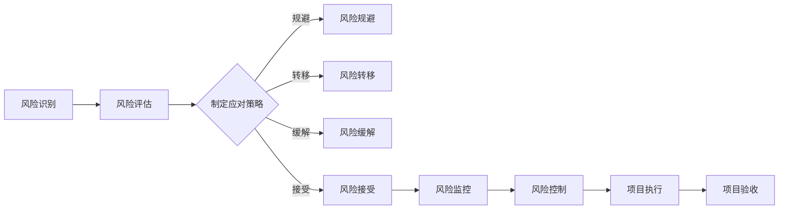
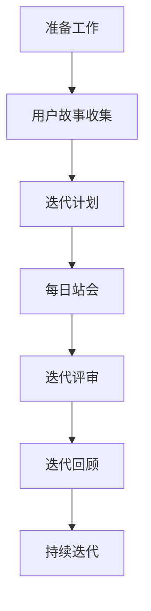

                 

### 第一部分：背景介绍与核心概念

#### 1.1 问题背景

随着人工智能技术的迅猛发展，大规模语言模型（LLM）已经成为自然语言处理（NLP）领域的重要工具。LLM的应用场景不断扩展，从机器翻译、问答系统到内容生成，都有其不可替代的优势。然而，随着LLM的应用逐渐深入，风险管理也变得愈发重要。LLM应用开发中的风险管理不仅关乎项目的成功与否，更涉及到数据安全、模型可靠性和用户体验等多个方面。

首先，LLM应用在数据处理过程中面临着数据质量和数据隐私的风险。大量敏感数据的处理和存储要求严格的隐私保护措施，任何数据泄露都可能导致严重的后果。其次，LLM模型的复杂性和不确定性也带来了风险。模型的训练过程依赖于大规模的数据集，数据的不准确性或偏差可能导致模型性能下降，甚至产生错误的输出。此外，LLM应用的实时性和并发性要求也对系统的稳定性和可靠性提出了挑战。

#### 1.2 核心概念

风险管理是指识别、评估、处理和控制项目或产品中潜在风险的过程。在LLM应用开发中，敏捷风险管理是一种应对复杂和动态环境的有效方法。敏捷风险管理不仅关注传统风险，还强调快速响应和持续改进。

**大规模语言模型（LLM）** 是一种能够处理和理解自然语言的深度学习模型，其核心在于能够生成高质量的自然语言文本。LLM的强大功能源于其庞大的参数量和复杂的神经网络结构，这使得它们在处理自然语言任务时表现出色。

**敏捷风险管理** 是一种基于敏捷开发方法的风险管理实践，其核心在于快速响应变化、持续迭代和持续改进。敏捷风险管理强调透明度、协作和灵活性，能够有效降低项目风险。

#### 1.3 边界与外延

在LLM应用开发中，风险管理的边界涉及多个方面。首先，数据的边界包括数据的收集、存储、处理和传输过程。其次，模型的边界包括模型的训练、部署和更新过程。最后，应用的边界包括应用的设计、开发、测试和运维过程。

风险管理的外延则包括对风险的全面识别、评估和应对策略的制定。这不仅包括传统的风险识别和评估方法，还涉及到新兴的风险管理技术和工具。

#### 1.4 概念结构与核心要素

LLM的结构主要包括输入层、隐藏层和输出层。输入层接收自然语言文本，隐藏层通过神经网络处理文本信息，输出层生成相应的文本输出。LLM的核心要素是模型参数，这些参数决定了模型的性能和表达能力。

敏捷风险管理的流程包括以下步骤：风险识别、风险评估、风险应对、风险监控和风险控制。每个步骤都需要细致的工作和专业的技术支持。

### 总结

本部分介绍了LLM应用开发中的风险管理背景、核心概念和边界外延，以及概念结构与核心要素。在接下来的章节中，我们将深入探讨敏捷风险管理的原理、实践和最佳实践，帮助读者更好地理解和应用这一重要技术。

## 第一部分：背景介绍与核心概念

### 1.1 问题背景

#### 1.1.1 大规模语言模型（LLM）的兴起

近年来，随着深度学习和自然语言处理技术的飞速发展，大规模语言模型（LLM）成为人工智能领域的重要研究方向和应用热点。LLM作为一种能够处理和理解自然语言的深度学习模型，其核心优势在于能够生成高质量的自然语言文本。这种模型不仅能够进行简单的文本生成任务，如自动摘要、文本生成和机器翻译，还能够应用于复杂的应用场景，如对话系统、问答系统和内容审核等。

LLM的兴起得益于两个关键因素。首先，是计算能力的提升。随着硬件技术的进步，如GPU和TPU等专用计算设备的普及，为大规模模型训练提供了强大的计算支持。这使得研究人员能够训练出更加复杂和庞大的模型，从而提高了模型的性能和表达能力。其次，是数据量的激增。互联网的快速发展使得大量的文本数据得以收集和存储，为LLM的训练提供了丰富的数据资源。此外，数据标注技术的进步也使得大规模数据集的构建变得更加高效和准确。

#### 1.1.2 风险管理的挑战

尽管LLM在自然语言处理领域展现出巨大的潜力，但其应用过程中也面临着诸多风险和挑战。首先，是数据隐私和安全风险。LLM的训练和部署需要处理大量敏感数据，如个人隐私信息、商业机密和政府文件等。任何数据泄露或滥用都可能对个人和企业造成严重后果。其次，是模型可靠性和准确性风险。由于LLM的训练依赖于大规模的数据集，数据的不准确性或偏差可能导致模型产生错误的输出，从而影响应用的稳定性和可靠性。此外，LLM的应用还可能引发道德和伦理问题，如歧视性偏见、虚假信息和隐私侵犯等。

#### 1.1.3 敏捷风险管理的重要性

在LLM应用开发中，风险管理至关重要。首先，有效的风险管理能够确保项目顺利进行，降低项目失败的风险。通过提前识别和评估潜在风险，开发团队可以制定相应的应对策略，从而减少风险对项目进度和质量的影响。其次，敏捷风险管理能够提高团队的响应速度和灵活性。在快速变化的技术环境中，敏捷风险管理能够快速调整项目方向和策略，以应对外部环境的变化。最后，敏捷风险管理有助于提升团队的合作和沟通效率。通过透明和协作的风险管理流程，团队成员能够更好地理解项目目标和风险，从而共同应对挑战。

### 总结

本节介绍了大规模语言模型（LLM）的兴起背景，以及其在应用过程中面临的风险管理挑战。通过理解这些背景信息，读者可以更好地认识到敏捷风险管理在LLM应用开发中的重要性。在下一节中，我们将进一步探讨大规模语言模型（LLM）的核心概念和基本原理。

### 1.2 核心概念

#### 1.2.1 大规模语言模型（LLM）

大规模语言模型（LLM）是一种深度学习模型，主要用于处理和生成自然语言。LLM的核心原理基于神经网络，特别是循环神经网络（RNN）及其变种，如长短期记忆网络（LSTM）和门控循环单元（GRU）。这些神经网络通过学习输入文本序列的特征，生成相应的输出文本序列。

LLM的基本结构通常包括三个主要部分：输入层、隐藏层和输出层。输入层接收自然语言文本，隐藏层通过神经网络处理文本信息，输出层生成相应的文本输出。LLM的训练过程是基于大量的文本数据集，通过反向传播算法不断调整模型参数，使得模型能够生成更加准确和自然的文本。

LLM的主要功能包括文本生成、文本分类、机器翻译、问答系统等。这些功能使得LLM在自然语言处理领域具有广泛的应用前景。例如，LLM可以用于自动生成新闻报道、撰写文章摘要、构建对话系统等，从而提高工作效率和用户体验。

#### 1.2.2 敏捷风险管理

敏捷风险管理是一种基于敏捷开发方法的风险管理实践，旨在快速识别、响应和缓解项目中的风险。敏捷风险管理强调透明度、协作和持续改进，与传统的风险管理方法相比，具有更高的灵活性和响应速度。

敏捷风险管理的基本流程包括以下步骤：

1. **风险识别**：通过问卷调查、访谈和文档审查等方式，识别项目中的潜在风险。
2. **风险评估**：对识别出的风险进行评估，确定其影响程度和发生概率。
3. **风险应对**：根据风险评估结果，制定相应的风险应对策略，包括风险规避、风险转移、风险缓解和风险接受。
4. **风险监控**：在项目执行过程中，持续监控风险的发展情况，及时调整应对策略。
5. **风险控制**：通过实施有效的风险控制措施，降低风险对项目的影响。

敏捷风险管理的关键要素包括：

- **透明度**：确保团队成员对项目风险有清晰的认识和了解。
- **协作**：通过团队协作，共同应对项目风险。
- **持续改进**：不断优化风险管理流程和方法，提高项目成功率。

#### 1.2.3 LLM应用开发中的风险管理特点

在LLM应用开发中，风险管理具有以下几个特点：

1. **复杂性和动态性**：LLM应用开发涉及多个阶段，如数据收集、数据预处理、模型训练、模型部署和迭代优化等。每个阶段都可能产生不同的风险，且风险类型和影响程度可能随时间变化。
2. **数据依赖性**：LLM的训练和预测高度依赖数据质量，数据的不准确性和偏差可能导致模型性能下降。
3. **模型复杂性**：LLM模型的参数量巨大，训练过程复杂，任何参数的微小调整都可能影响模型的表现。
4. **跨领域应用**：LLM的应用范围广泛，从文本生成到对话系统，不同应用场景对风险管理的需求和策略有所不同。

#### 概念属性特征对比表格

为了更好地理解LLM和敏捷风险管理的关系，我们可以通过一个概念属性特征对比表格来进行展示：

| 概念           | 特征对比                               |
|--------------|------------------------------------|
| 大规模语言模型（LLM） | - 处理和理解自然语言<br>- 基于神经网络结构<br>- 大量数据训练<br>- 广泛应用场景 |
| 敏捷风险管理      | - 快速响应变化<br>- 持续迭代改进<br>- 协作与透明<br>- 适应复杂环境   |

#### ER实体关系图架构

为了进一步阐述LLM应用开发中的风险管理，我们可以使用ER实体关系图来展示不同实体之间的关系。以下是一个简化的ER图示例：

```mermaid
erDiagram
  Data --> Model : 数据训练
  Model --> Application : 模型部署
  Risk --> Application : 风险影响
  Risk --> Data : 数据风险
  Risk --> Model : 模型风险
```

在上述ER图中，"Data"表示数据集，"Model"表示训练好的语言模型，"Application"表示LLM的应用场景，"Risk"表示风险管理实体。通过图中的关系线，我们可以清晰地看到数据、模型和应用场景之间的关联，以及风险如何影响这些实体。

### 总结

本节介绍了大规模语言模型（LLM）的核心概念和敏捷风险管理的基本原理，并使用了概念属性特征对比表格和ER实体关系图来进一步阐述两者的关系。在下一节中，我们将深入探讨LLM应用开发中的风险管理特点，帮助读者更好地理解这一领域的独特挑战。

### 1.3 边界与外延

#### 1.3.1 LLM应用开发的范围

大规模语言模型（LLM）的应用范围非常广泛，几乎涵盖了自然语言处理的各个领域。以下是几个典型的应用场景：

1. **文本生成**：LLM可以用于生成文章、新闻、摘要和对话等。例如，自动生成新闻报道、撰写产品描述、生成营销文案等。
2. **机器翻译**：LLM在机器翻译中的应用非常成功，如谷歌翻译和百度翻译。这些系统利用LLM的强大语言理解能力，实现高质量的双语翻译。
3. **对话系统**：LLM可以构建智能对话系统，如聊天机器人和虚拟助手。这些系统能够理解和响应自然语言输入，提供个性化的用户体验。
4. **文本分类**：LLM可以用于情感分析、主题分类和垃圾邮件过滤等。通过学习大量文本数据，LLM能够准确地将文本分类到不同的类别。
5. **问答系统**：LLM可以构建问答系统，如Siri、Alexa和百度搜索。这些系统能够理解用户的自然语言提问，并返回准确的答案。

#### 1.3.2 敏捷风险管理的方法论

敏捷风险管理是一种基于敏捷开发方法的风险管理实践，其方法论主要包括以下几个关键步骤：

1. **风险识别**：通过问卷调查、访谈和文档审查等方式，识别项目中的潜在风险。这个阶段的目标是尽可能全面地发现所有可能的风险。
2. **风险评估**：对识别出的风险进行评估，确定其影响程度和发生概率。风险评估可以使用定量和定性方法，如风险矩阵和概率影响分析。
3. **风险应对**：根据风险评估结果，制定相应的风险应对策略。常见的风险应对策略包括风险规避、风险转移、风险缓解和风险接受。
4. **风险监控**：在项目执行过程中，持续监控风险的发展情况，及时调整应对策略。风险监控可以通过定期审查、风险评估会议和实时监控工具来实现。
5. **风险控制**：通过实施有效的风险控制措施，降低风险对项目的影响。风险控制措施可以包括风险预防措施、应急计划和资源调配等。

#### 1.3.3 风险管理在LLM应用开发中的特殊性

在LLM应用开发中，风险管理具有以下几个特殊性：

1. **数据依赖性**：LLM的训练和预测高度依赖数据质量，任何数据偏差或错误都可能影响模型的表现。因此，数据质量管理是风险管理的重要一环。
2. **模型复杂性**：LLM模型的参数量巨大，训练过程复杂，任何参数的微小调整都可能对模型的表现产生显著影响。这使得模型风险管理和优化成为一大挑战。
3. **实时性要求**：许多LLM应用需要在实时环境中运行，如智能对话系统和实时问答系统。这要求系统具有高度的稳定性和可靠性，任何故障或延迟都可能影响用户体验。
4. **合规要求**：LLM应用处理大量敏感数据，需要遵守各种数据保护法规和隐私政策。合规风险管理是确保项目合法合规的关键。

#### 概念结构与核心要素

LLM应用开发中的风险管理概念结构可以分为以下几个核心要素：

1. **数据风险管理**：包括数据质量、数据隐私和数据合规等方面。
2. **模型风险管理**：包括模型偏差、模型可靠性、模型更新等方面。
3. **应用风险管理**：包括系统稳定性、实时性、用户体验等方面。
4. **风险管理流程**：包括风险识别、风险评估、风险应对、风险监控和风险控制等方面。

### 总结

本节讨论了LLM应用开发的范围和敏捷风险管理的方法论，并分析了风险管理在LLM应用开发中的特殊性。通过理解这些内容，读者可以更好地把握LLM应用开发中的风险管理挑战，为后续章节的学习打下坚实基础。在下一节中，我们将进一步探讨敏捷风险管理原理，为读者揭示如何在LLM应用开发中实现有效的风险管理。

### 1.4 概念结构与核心要素

#### 1.4.1 LLM的结构

大规模语言模型（LLM）的结构复杂且高度模块化，其核心组成部分包括输入层、隐藏层和输出层。输入层负责接收自然语言文本，并将其转化为模型可处理的格式。隐藏层通过一系列神经网络处理输入信息，提取文本中的语义特征，并生成中间表示。输出层则根据隐藏层生成的中间表示，生成相应的文本输出。

LLM的具体架构通常基于深度神经网络（DNN），如卷积神经网络（CNN）和循环神经网络（RNN）。其中，RNN具有特别的意义，因为它们能够处理序列数据，并保持对上下文信息的记忆。RNN的变种，如长短期记忆网络（LSTM）和门控循环单元（GRU），进一步优化了模型的记忆能力和训练效率。

以下是一个简化的LLM结构图：

```mermaid
sequenceDiagram
    A[文本输入] ->> B[嵌入层]
    B->> C[隐藏层]
    C->> D[输出层]
    D->> E[文本输出]
```

在上述序列图中，"A"代表输入层，负责接收文本输入；"B"代表嵌入层，将文本转化为向量表示；"C"代表隐藏层，处理文本向量并提取语义特征；"D"代表输出层，生成文本输出；"E"代表最终的文本输出。

#### 1.4.2 敏捷风险管理的流程

敏捷风险管理是一种动态、迭代和协作的风险管理方法，其流程包括以下几个关键步骤：

1. **风险识别**：通过问卷调查、访谈、文档审查和专家咨询等方式，识别项目中的潜在风险。这一步骤的目的是全面了解项目可能面临的各种风险。

2. **风险评估**：对识别出的风险进行评估，确定其影响程度和发生概率。风险评估可以通过定性方法（如风险矩阵）或定量方法（如概率影响分析）进行。这一步骤的目的是确定哪些风险需要优先关注和处理。

3. **风险应对**：根据风险评估结果，制定相应的风险应对策略。常见的风险应对策略包括风险规避、风险转移、风险缓解和风险接受。这一步骤的目的是制定具体的应对措施，以降低风险对项目的影响。

4. **风险监控**：在项目执行过程中，持续监控风险的发展情况，及时调整应对策略。风险监控可以通过定期审查、风险评估会议和实时监控工具来实现。这一步骤的目的是确保风险应对措施的有效性和及时性。

5. **风险控制**：通过实施有效的风险控制措施，降低风险对项目的影响。风险控制措施可以包括风险预防措施、应急计划和资源调配等。这一步骤的目的是确保项目能够在风险可接受范围内顺利进行。

#### 敏捷风险管理流程图

以下是一个敏捷风险管理流程的Mermaid图：



在上述流程图中，"A"代表风险识别，"B"代表风险评估，"C"代表制定应对策略，"D"代表风险规避，"E"代表风险转移，"F"代表风险缓解，"G"代表风险接受，"H"代表风险监控，"I"代表风险控制，"J"代表项目执行，"K"代表项目验收。

#### 总结

本节详细介绍了大规模语言模型（LLM）的结构和敏捷风险管理的基本流程。通过理解LLM的组成部分和敏捷风险管理的流程，读者可以更好地把握LLM应用开发中的风险管理挑战，并为实际项目中的风险管理提供理论支持。在下一节中，我们将进一步探讨敏捷风险管理的原理，为读者揭示如何在复杂和动态的LLM应用开发环境中实现有效的风险管理。

### 2.1 敏捷管理框架

#### 2.1.1 敏捷管理的基本理念

敏捷管理（Agile Management）是一种以快速响应变化、持续交付价值和团队合作为核心的软件开发和管理方法。敏捷管理的基本理念包括：

1. **客户至上**：始终将客户的需求放在首位，通过持续交付有价值的产品来满足客户需求。
2. **迭代开发**：将项目分为多个短期迭代（Sprint），在每个迭代周期内快速交付可用的产品功能。
3. **团队协作**：强调跨职能团队的协作和沟通，通过每日站会、迭代回顾和评审会议等方式保持团队成员之间的紧密联系。
4. **灵活应对变化**：在项目开发过程中，不断收集用户反馈和市场信息，灵活调整项目方向和优先级。
5. **持续改进**：通过迭代和反馈机制，不断优化产品质量和开发流程。

#### 2.1.2 敏捷管理的关键要素

敏捷管理的成功实施依赖于以下几个关键要素：

1. **Scrum框架**：Scrum是一种广泛应用的敏捷开发框架，包括产品待办列表（Product Backlog）、迭代计划（Sprint Planning）、每日站会（Daily Stand-up）、迭代评审（Sprint Review）和迭代回顾（Sprint Retrospective）等核心活动。
2. **用户故事**：用户故事（User Story）是敏捷开发中的需求表达方式，通常以"作为XX，我想要XX，以便XX"的形式描述用户的需求。
3. **迭代周期**：敏捷开发以迭代周期（Sprint）为单位进行项目管理和任务分配，每个迭代周期通常为2到4周。
4. **自动化测试**：通过自动化测试工具，确保每次迭代交付的代码质量和功能完整性，减少人工测试的时间和成本。
5. **持续集成/持续部署**（CI/CD）：通过自动化构建、测试和部署流程，实现代码的持续集成和持续部署，提高开发效率和系统稳定性。

#### 2.1.3 敏捷管理的实施步骤

敏捷管理的实施可以分为以下几个步骤：

1. **准备工作**：组建跨职能团队，明确项目目标和预期成果。制定项目计划和资源分配策略。
2. **用户故事收集**：通过客户调研、访谈和市场分析，收集用户需求并编写用户故事。
3. **迭代计划**：根据用户故事和项目优先级，规划每个迭代的目标和任务。
4. **每日站会**：每日站会（Daily Stand-up）是团队交流的重要环节，每个成员分享自己的工作进展、遇到的障碍和计划。
5. **迭代评审**：在每个迭代结束时，进行迭代评审（Sprint Review），展示已交付的功能和成果，收集用户反馈。
6. **迭代回顾**：在每个迭代结束后，进行迭代回顾（Sprint Retrospective），分析团队的工作流程和效果，制定改进计划。
7. **持续迭代**：根据迭代评审和回顾的结果，调整项目计划和用户故事，进入下一个迭代周期。

#### 敏捷管理流程图

以下是一个简化的敏捷管理流程图：



在上述流程图中，"A"代表准备工作，"B"代表用户故事收集，"C"代表迭代计划，"D"代表每日站会，"E"代表迭代评审，"F"代表迭代回顾，"G"代表持续迭代。

#### 总结

本节介绍了敏捷管理的基本理念、关键要素和实施步骤。通过理解敏捷管理的框架和流程，读者可以更好地应对LLM应用开发中的复杂性和变化性，提高项目的成功率和团队协作效率。在下一节中，我们将深入探讨风险识别与评估的方法和技术，为敏捷风险管理打下坚实的基础。

### 2.2 风险识别与评估

#### 2.2.1 风险识别的方法

风险识别是敏捷风险管理中的第一步，旨在全面识别项目中的潜在风险。有效的风险识别可以帮助团队提前了解可能遇到的问题，并制定相应的应对策略。以下是几种常用的风险识别方法：

1. **文档审查**：通过审查项目文档，如需求说明书、设计文档和测试计划，识别潜在的风险点。
2. **专家访谈**：与项目团队成员和相关领域专家进行访谈，获取他们对项目风险点的看法和建议。
3. **历史数据分析**：分析以往类似项目的风险记录和经验，识别类似项目中的风险点和应对措施。
4. **头脑风暴**：组织团队成员进行头脑风暴，讨论项目中的潜在风险，并记录所有可能的情景。
5. **风险清单**：制定风险清单，列出项目中的已知风险，并对其进行分类和优先级排序。

#### 2.2.2 风险评估的工具与技术

在风险识别的基础上，风险评估是确定风险影响程度和发生概率的关键步骤。以下是一些常用的风险评估工具和技术：

1. **风险矩阵**：通过风险矩阵，可以将风险的影响程度和发生概率进行量化，从而确定风险等级。风险矩阵通常采用二维矩阵的形式，其中行表示影响程度（如严重性、中度、轻微），列表示发生概率（如高、中、低）。

以下是一个简单的风险矩阵示例：

| 影响程度 | 发生概率 | 风险等级 |
|----------|-----------|----------|
| 严重     | 高        | 高       |
| 中度     | 中        | 中       |
| 轻微     | 低        | 低       |

2. **概率影响分析**：通过对每个风险的影响程度和发生概率进行定量分析，计算风险的综合得分，从而确定风险优先级。概率影响分析通常使用以下公式：

\[ \text{风险得分} = \text{影响程度} \times \text{发生概率} \]

3. **蒙特卡罗模拟**：通过模拟风险情景的概率分布，评估风险对项目的影响。蒙特卡罗模拟可以提供更精确的风险评估结果，但计算成本较高。

4. **决策树分析**：通过构建决策树，分析不同风险情景下的决策路径和结果。决策树可以直观地展示不同决策的结果，帮助团队做出更合理的风险应对决策。

#### 2.2.3 风险评估案例

以下是一个风险评估的案例：

**案例背景**：某公司在开发一款基于LLM的客户服务聊天机器人，该机器人将用于处理客户的咨询和问题。

**识别的风险点**：
1. **数据隐私风险**：聊天机器人需要处理大量客户信息，可能存在数据泄露的风险。
2. **模型准确性风险**：训练数据存在偏差，可能导致模型生成的回答不准确。
3. **系统稳定性风险**：高并发访问可能导致系统崩溃或延迟。

**评估过程**：
1. **影响程度分析**：
   - 数据隐私风险：影响程度高，可能导致严重的法律和商业后果。
   - 模型准确性风险：影响程度中，但可能导致用户体验下降。
   - 系统稳定性风险：影响程度中，但可能导致业务中断。

2. **发生概率分析**：
   - 数据隐私风险：发生概率高，因为涉及敏感客户信息。
   - 模型准确性风险：发生概率中，因为训练数据存在偏差。
   - 系统稳定性风险：发生概率中，因为需要处理大量并发请求。

3. **风险得分计算**：
   - 数据隐私风险：影响程度×发生概率 = 高×高 = 高
   - 模型准确性风险：影响程度×发生概率 = 中×中 = 中
   - 系统稳定性风险：影响程度×发生概率 = 中×中 = 中

4. **风险等级**：
   - 数据隐私风险：高等级风险
   - 模型准确性风险：中等级风险
   - 系统稳定性风险：中等级风险

**应对策略**：
1. **数据隐私风险**：实施严格的数据加密和访问控制措施，定期进行安全审计。
2. **模型准确性风险**：使用高质量的训练数据进行模型训练，定期更新训练数据集。
3. **系统稳定性风险**：优化系统架构，增加服务器资源，实施负载均衡策略。

#### 总结

本节介绍了风险识别与评估的方法和技术，并通过一个实际案例展示了风险评估的过程和策略。有效的风险识别和评估是敏捷风险管理的基础，有助于团队提前识别潜在问题，并制定针对性的应对措施，确保项目顺利进行。在下一节中，我们将探讨风险应对策略，为读者提供更多实用的风险管理工具。

### 2.3 风险应对策略

#### 2.3.1 风险规避策略

风险规避策略的核心思想是通过改变项目计划或行为，避免潜在风险的发生。以下是一些常见的风险规避策略：

1. **重新设计项目**：对项目的设计和实现过程进行重新评估，消除可能导致风险的因素。
2. **转移责任**：通过合同或协议，将部分风险转移给第三方，如将数据存储任务外包给专业的云服务提供商。
3. **拒绝风险源**：在项目启动前，评估项目中的所有参与者，选择信誉良好、经验丰富的合作伙伴，避免与高风险的供应商合作。
4. **推迟决策**：在某些情况下，可以通过推迟关键决策或项目阶段来规避风险。例如，在市场不确定性较高时，可以先进行小规模试点，再决定是否大规模推广。

#### 2.3.2 风险转移策略

风险转移策略是将风险的责任和影响转移到其他方面，通常通过购买保险或合同协议实现。以下是一些常见的风险转移策略：

1. **购买保险**：为项目中的特定风险购买保险，如数据泄露保险、产品责任保险等。这样，在风险发生时，可以通过保险赔偿来减轻损失。
2. **合同协议**：在项目合同中明确各方的责任和权利，将某些风险明确约定为某方的责任。例如，如果合同中约定了供应商负责系统的安全性，那么数据泄露的风险就由供应商承担。
3. **共担风险**：通过合作或合资的方式，将项目风险分摊给多个合作伙伴，共同承担风险和收益。

#### 2.3.3 风险缓解策略

风险缓解策略的目标是降低风险的发生概率或影响程度，以下是一些常见的风险缓解策略：

1. **风险预防措施**：通过提前采取预防措施来降低风险的发生概率。例如，在系统开发过程中，进行代码审查和测试，以减少软件缺陷和漏洞。
2. **应急计划**：为可能发生的关键风险制定应急计划，确保在风险发生时能够迅速响应和恢复。例如，为应对数据泄露风险，可以制定数据备份和恢复计划。
3. **风险隔离**：通过将系统分解为多个模块或子系统，将风险隔离在特定的模块或子系统内，防止风险扩散。例如，将客户数据和公司内部数据分离，以减少数据泄露的风险。
4. **风险降低**：通过优化设计和技术手段，降低风险的影响程度。例如，使用冗余系统或备份系统，以确保在系统故障时仍能保持正常运行。

#### 2.3.4 风险接受策略

风险接受策略是指在无法规避、转移或缓解风险时，选择接受风险并准备好应对其可能带来的后果。以下是一些常见的风险接受策略：

1. **接受现实**：在某些情况下，风险是不可避免的，如市场竞争风险、技术不确定性等。此时，团队需要接受现实，并准备好应对可能的风险。
2. **预留时间缓冲**：在项目计划中预留一定的时间缓冲，以应对可能发生的延迟或其他问题。例如，在项目关键路径上预留一定的时间，以应对意外情况。
3. **备选方案**：为可能的风险制定备选方案，确保在风险发生时能够快速切换到备用方案。例如，在供应链管理中，制定多种供应商渠道，以应对某一供应商的不可靠性。
4. **风险管理预算**：为项目预留一定的风险管理预算，用于应对可能发生的风险。例如，在项目预算中设定一定的风险应对费用，以应对意外支出。

#### 总结

本节介绍了风险规避、风险转移、风险缓解和风险接受四种常见的风险应对策略。通过选择合适的策略，团队可以有效地降低风险对项目的负面影响，提高项目的成功率。在实际项目中，需要根据具体情况灵活运用这些策略，以确保项目能够在复杂和动态的环境中顺利推进。在下一节中，我们将探讨风险监控与控制的方法，为读者提供更全面的敏捷风险管理实践。

### 2.4 风险监控与控制

#### 2.4.1 风险监控指标

风险监控是敏捷风险管理中的重要环节，通过设定和跟踪风险监控指标，可以及时了解风险的变化情况，并采取相应的应对措施。以下是几种常用的风险监控指标：

1. **风险暴露度**：风险暴露度是指项目面临的总体风险水平，通常通过风险矩阵计算得出。风险暴露度可以用来评估项目当前的风险状态，并指导后续的风险管理策略。
2. **风险发生频率**：风险发生频率是指在一定时间内，项目发生某种特定风险的次数。风险发生频率可以帮助团队识别高风险领域，并采取针对性的预防措施。
3. **风险损失严重度**：风险损失严重度是指风险发生时可能造成的损失程度，通常用货币单位或工作日表示。风险损失严重度可以帮助团队评估风险的影响，并制定相应的应对计划。
4. **风险缓解程度**：风险缓解程度是指通过实施风险缓解措施后，风险发生概率或影响程度的降低程度。风险缓解程度可以用来衡量风险管理措施的有效性。

#### 2.4.2 风险控制方法

风险控制是在风险监控过程中，采取具体措施降低风险的发生概率或影响程度。以下是一些常用的风险控制方法：

1. **预防性控制**：通过预防性措施来降低风险的发生概率。例如，在项目启动前进行详细的需求分析，以减少需求变更的风险；在系统设计阶段进行安全审计，以减少安全漏洞的风险。
2. **纠正性控制**：在风险发生后，采取纠正性措施来降低风险的影响。例如，在发现代码缺陷时，及时修复并重新测试，以减少缺陷对项目的影响；在数据泄露事件发生后，立即采取数据恢复和备份措施，以减少数据损失。
3. **检测性控制**：通过检测和控制措施来发现和应对风险。例如，在项目开发过程中，定期进行代码审查和测试，以发现潜在的安全漏洞；在项目运营过程中，实施监控工具，实时监测系统运行状态，及时发现和处理异常情况。
4. **应急性控制**：在风险发生时，采取应急性措施来迅速应对和缓解风险。例如，在系统故障时，启动备用系统或恢复计划，以减少业务中断时间；在数据泄露事件发生时，立即通知相关方并采取紧急措施，以减少数据泄露的负面影响。

#### 2.4.3 风险控制案例分析

以下是一个风险控制案例：

**案例背景**：某公司在开发一款基于LLM的客户服务聊天机器人，该机器人用于处理客户的咨询和问题。

**识别的风险点**：
1. **数据隐私风险**：聊天机器人需要处理大量客户信息，可能存在数据泄露的风险。
2. **模型准确性风险**：训练数据存在偏差，可能导致模型生成的回答不准确。
3. **系统稳定性风险**：高并发访问可能导致系统崩溃或延迟。

**监控指标**：
1. **风险暴露度**：通过定期评估风险矩阵，确定项目当前的风险状态。
2. **风险发生频率**：记录一段时间内数据泄露事件的发生次数。
3. **风险损失严重度**：评估每次数据泄露事件可能造成的损失。

**风险控制措施**：
1. **数据隐私风险**：实施严格的数据加密和访问控制措施，定期进行安全审计；建立数据备份和恢复机制，确保数据在发生泄露时能够迅速恢复。
2. **模型准确性风险**：使用高质量的训练数据进行模型训练，定期更新训练数据集；建立模型监控和评估机制，及时发现和纠正模型偏差。
3. **系统稳定性风险**：优化系统架构，增加服务器资源，实施负载均衡策略；建立系统监控和报警机制，及时发现和处理系统故障。

**应急计划**：
1. **数据泄露事件**：立即启动数据恢复和备份机制，通知相关方，并采取法律和公关措施应对数据泄露的负面影响。
2. **系统故障**：立即启动备用系统或恢复计划，减少业务中断时间，并进行故障分析和修复。

#### 总结

本节介绍了风险监控与控制的方法和指标，并通过一个实际案例展示了风险控制的过程和措施。有效的风险监控与控制是确保项目顺利推进的关键，通过设定监控指标和采取控制措施，团队可以及时发现和应对潜在风险，确保项目目标的实现。在下一节中，我们将探讨LLM应用开发中的敏捷风险管理实践，帮助读者将理论应用到实际项目中。

### 3.1 开发过程风险管理

#### 3.1.1 敏捷开发流程中的风险管理

在LLM应用开发中，敏捷开发流程是一种常见且高效的方法，它通过迭代和增量的方式逐步实现项目目标。敏捷开发流程中的风险管理强调持续识别、评估和应对风险，以确保项目顺利进行。以下是敏捷开发流程中的几个关键阶段及其风险管理策略：

1. **需求收集**：在需求收集阶段，通过用户访谈、问卷调查和市场分析等方法，识别潜在的需求风险。这些风险可能包括需求变更、需求不明确或需求不切实际等。为了降低这些风险，可以采用以下策略：
   - **用户故事映射**：将需求细化为用户故事，并优先处理高优先级的故事，以确保项目集中在最有价值的需求上。
   - **迭代需求评审**：在每次迭代开始前，对需求进行评审，确保需求明确、可行且与项目目标一致。

2. **设计阶段**：在系统设计阶段，识别和评估与架构设计、模块划分和技术选型相关的风险。这些风险可能包括技术选型不当、设计不合理或架构复杂度高等。以下是一些风险管理策略：
   - **架构评审**：邀请领域专家进行架构评审，确保设计合理且可扩展。
   - **技术评估**：在技术选型阶段，进行详细的技术评估和比较，选择最适合项目需求的技术方案。

3. **编码阶段**：在编码阶段，主要关注代码质量和开发效率。可能的风险包括代码质量差、开发效率低或技术债务积累。以下是一些风险管理策略：
   - **代码审查**：通过代码审查，确保代码符合质量标准，减少缺陷和漏洞。
   - **持续集成**：实施持续集成（CI）流程，及时发现和修复代码问题，确保代码库的稳定性。

4. **测试阶段**：在测试阶段，主要关注系统的功能、性能和安全。可能的风险包括测试覆盖率不足、性能瓶颈或安全漏洞。以下是一些风险管理策略：
   - **自动化测试**：编写和执行自动化测试用例，提高测试效率和覆盖率。
   - **安全测试**：进行全面的安全测试，包括漏洞扫描和渗透测试，确保系统的安全性。

5. **部署和维护阶段**：在部署和维护阶段，关注系统的稳定性和用户体验。可能的风险包括部署失败、系统故障或维护成本高。以下是一些风险管理策略：
   - **部署脚本**：编写自动化部署脚本，确保部署过程的一致性和可重复性。
   - **监控和反馈**：建立监控系统，实时监控系统运行状态，并及时响应和处理问题。

#### 3.1.2 敏捷迭代中的风险识别与评估

敏捷开发强调快速迭代和持续交付，因此在每个迭代周期内都需要进行风险识别和评估。以下是敏捷迭代中的风险识别与评估步骤：

1. **风险识别**：在迭代开始时，通过团队会议、用户故事评审和问题追踪等方法，识别当前迭代周期内可能出现的风险。风险识别应涵盖需求变更、技术问题、资源分配、团队协作等方面。

2. **风险评估**：对识别出的风险进行评估，确定其影响程度和发生概率。可以使用定性或定量方法，如风险矩阵或概率影响分析，对风险进行排序和分类。

3. **风险应对**：根据风险评估结果，制定相应的风险应对策略。常见的应对策略包括风险规避、风险转移、风险缓解和风险接受。

4. **风险监控**：在迭代过程中，持续监控风险的发展情况，及时发现新的风险或原有风险的变化。通过每日站会、迭代评审和迭代回顾等方式，确保风险得到有效管理和控制。

#### 3.1.3 敏捷迭代中的风险应对与控制

在敏捷迭代中，有效的风险应对和控制是确保项目成功的关键。以下是几个关键步骤：

1. **迭代规划**：在迭代开始前，根据风险评估结果和风险应对策略，制定详细的迭代计划，包括任务分配、时间表和资源需求。

2. **任务执行**：在迭代过程中，按照计划执行任务，并密切关注任务的进展情况。通过每日站会和迭代评审，确保团队对任务状态有清晰的认识。

3. **风险跟踪**：建立风险跟踪机制，记录和管理风险的状态和进展。使用风险跟踪工具，如风险登记表或项目管理软件，确保风险得到及时更新和监控。

4. **风险应对**：根据风险跟踪结果，及时采取应对措施。如果风险发生概率或影响程度增加，应立即调整计划或采取额外的控制措施。

5. **迭代回顾**：在迭代结束时，进行迭代回顾会议，分析风险管理过程中的成功和不足，制定改进计划，为下一个迭代提供经验教训。

#### 总结

本节详细介绍了敏捷开发流程中的风险管理，包括需求收集、设计阶段、编码阶段、测试阶段、部署和维护阶段等关键阶段的风险管理策略。同时，还介绍了敏捷迭代中的风险识别与评估、风险应对与控制步骤。通过理解这些内容，开发团队可以更好地应对LLM应用开发中的风险，确保项目按计划顺利进行。在下一节中，我们将探讨数据风险管理，为读者揭示如何保护LLM应用中的数据安全。

### 3.2 数据风险管理

在LLM应用开发中，数据风险管理是确保模型质量和系统稳定性的关键环节。数据质量、数据隐私和数据合规是数据风险管理中的核心内容。以下是这些方面的详细介绍和策略。

#### 3.2.1 数据质量风险

数据质量风险是指数据在收集、处理和存储过程中可能出现的各种问题，如数据缺失、数据重复、数据不一致和数据错误等。这些问题可能导致LLM模型的性能下降，甚至生成错误的输出。

1. **风险识别**：
   - 数据缺失：部分数据未填写或未收集。
   - 数据重复：相同或相似的数据条目在数据集中重复出现。
   - 数据不一致：不同来源或不同时间点的数据之间存在矛盾或冲突。
   - 数据错误：数据记录中的错误或不准确的数据。

2. **风险应对策略**：
   - **数据清洗**：通过数据清洗技术，识别并纠正数据集中的错误和异常值，提高数据质量。
   - **数据验证**：在数据收集和存储过程中，实施数据验证规则，确保数据的准确性和一致性。
   - **数据监控**：建立数据监控机制，实时监测数据质量指标，及时发现和处理数据问题。

3. **工具与技术**：
   - **数据清洗工具**：如OpenRefine、DataWrangler等，可以自动识别和纠正数据错误。
   - **数据验证工具**：如RegEx、Pandas等，可以编写规则进行数据验证。

#### 3.2.2 数据隐私风险

数据隐私风险是指在LLM应用开发过程中，用户数据可能因不当处理或泄露而受到侵害。随着隐私保护法规（如GDPR、CCPA）的实施，数据隐私风险已成为重点关注的问题。

1. **风险识别**：
   - 数据收集：未经用户同意或超出必要范围收集用户数据。
   - 数据存储：数据存储设施安全不足，可能导致数据泄露。
   - 数据传输：数据在传输过程中可能被窃取或篡改。
   - 数据使用：未经授权使用用户数据，或数据使用超出约定范围。

2. **风险应对策略**：
   - **数据加密**：对敏感数据进行加密，确保数据在存储和传输过程中不被窃取或篡改。
   - **访问控制**：实施严格的访问控制措施，确保只有授权用户可以访问敏感数据。
   - **匿名化处理**：对用户数据进行匿名化处理，减少隐私泄露的风险。

3. **工具与技术**：
   - **加密技术**：如AES、RSA等，可以用于数据加密。
   - **访问控制工具**：如LDAP、SAML等，可以用于实现访问控制。
   - **匿名化工具**：如K-Anonymity、L-Diversity等，可以用于数据匿名化。

#### 3.2.3 数据合规风险

数据合规风险是指LLM应用开发过程中，数据处理可能违反相关法规和政策的风险。例如，欧盟的GDPR和美国加州的CCPA都对数据处理提出了严格的要求。

1. **风险识别**：
   - 数据收集：未经用户同意或违反隐私保护法规收集数据。
   - 数据处理：数据处理过程违反数据保护法规。
   - 数据存储：数据存储地点违反法规要求。
   - 数据共享：与第三方共享数据违反数据保护法规。

2. **风险应对策略**：
   - **合规审计**：定期进行合规审计，确保数据处理过程符合相关法规。
   - **合规培训**：对相关人员进行合规培训，提高合规意识和能力。
   - **合规文件**：制定详细的合规文件，包括数据处理政策、隐私政策和用户协议等。

3. **工具与技术**：
   - **合规审计工具**：如SOC 2、ISO 27001等，可以用于评估合规性。
   - **合规培训工具**：如在线学习平台、内训课程等，可以用于提高合规意识。

#### 总结

数据风险管理在LLM应用开发中至关重要。通过识别数据质量风险、数据隐私风险和数据合规风险，并采取相应的应对策略，可以确保数据的安全性和模型的可靠性。有效的数据风险管理不仅有助于提高项目质量和用户体验，还能降低法律和商业风险。在下一节中，我们将探讨模型风险管理，继续深入探讨LLM应用开发中的风险管理挑战。

### 3.3 模型风险管理

在LLM应用开发中，模型风险管理是一个至关重要的环节，它涉及到模型偏差、模型可靠性和模型更新等多个方面。有效的模型风险管理有助于确保模型的质量和稳定性，从而提高系统的整体性能和用户体验。

#### 3.3.1 模型偏差风险

模型偏差风险是指在模型训练过程中，由于数据集的选择、标注的不准确或算法的设计等原因，导致模型产生偏差，进而影响其性能和可靠性。以下是一些常见的模型偏差类型及其风险：

1. **数据偏差**：数据集中的样本不均衡、数据质量差或数据采集过程存在偏差，可能导致模型对某些类别的预测结果不准确。
   - **风险识别**：通过数据分析，识别数据集中的异常值、重复值和噪声数据。
   - **风险应对策略**：使用数据增强技术、重新采集数据或使用数据平衡算法来减少数据偏差。

2. **算法偏差**：算法设计不当或超参数设置不合理，可能导致模型产生偏差。
   - **风险识别**：通过算法验证和性能评估，识别模型的偏差问题。
   - **风险应对策略**：优化算法设计、调整超参数或使用更合适的算法。

3. **过拟合偏差**：模型在训练数据上表现良好，但在测试数据上表现不佳，即模型对训练数据过度拟合。
   - **风险识别**：通过验证集和测试集的性能对比，识别过拟合问题。
   - **风险应对策略**：使用正则化技术、增加训练数据或简化模型结构来防止过拟合。

#### 3.3.2 模型可靠性风险

模型可靠性风险是指模型在实际应用中可能出现的性能下降、失效或错误输出等问题，这可能导致严重的业务风险和用户体验下降。以下是一些常见的模型可靠性风险及其应对策略：

1. **模型退化**：随着时间推移，模型可能因数据分布变化或训练数据的老化而导致性能下降。
   - **风险识别**：通过监控模型的实时性能指标，识别模型退化问题。
   - **风险应对策略**：定期重新训练模型、使用迁移学习技术或实时更新训练数据。

2. **数据隐私泄漏**：模型在训练或预测过程中可能无意中泄漏敏感数据。
   - **风险识别**：通过安全测试和审计，识别模型数据隐私泄漏问题。
   - **风险应对策略**：实施数据加密、差分隐私技术和数据匿名化处理。

3. **环境适应性差**：模型在某些特定环境下（如极端天气、高负载等）可能表现不佳。
   - **风险识别**：通过环境测试和压力测试，识别模型的适应性问题。
   - **风险应对策略**：优化模型算法、增加模型训练的多样性或使用自适应算法。

#### 3.3.3 模型更新风险

模型更新风险是指在模型发布后，由于新的需求、技术进步或数据变化等原因，需要对模型进行更新，这可能会引入新的风险。以下是一些常见的模型更新风险及其应对策略：

1. **更新中断**：模型更新过程中可能发生中断，导致模型失效或数据丢失。
   - **风险识别**：通过更新前后的性能对比和审计，识别更新中断问题。
   - **风险应对策略**：制定详细的更新计划和备份策略，确保更新过程的安全和稳定。

2. **兼容性问题**：新的模型版本可能与现有的系统或服务不兼容。
   - **风险识别**：通过预测试和兼容性评估，识别兼容性问题。
   - **风险应对策略**：进行版本控制和逐步更新，确保系统兼容性。

3. **用户接受度**：新的模型版本可能影响用户体验，用户可能不适应新的模型表现。
   - **风险识别**：通过用户反馈和体验测试，识别用户接受度问题。
   - **风险应对策略**：进行用户培训和支持，收集用户反馈并进行迭代优化。

#### 总结

模型风险管理是LLM应用开发中不可忽视的重要环节。通过识别和应对模型偏差、可靠性和更新风险，开发团队可以确保模型的高质量和稳定性，从而提高系统的整体性能和用户体验。在下一节中，我们将通过一个实际案例，深入探讨模型风险管理的具体实施过程和效果。

### 3.4 案例研究

#### 3.4.1 某知名企业LLM项目风险管理案例分析

**案例背景**：某知名科技公司在开发一款基于LLM的客户服务聊天机器人，旨在提高客户咨询处理的效率和准确性。该项目涉及大量客户数据的处理和存储，同时也需要保证模型的稳定性和可靠性。

**风险管理过程**：

1. **需求收集与风险识别**：
   - **风险识别**：通过用户访谈、问卷调查和需求评审，识别出数据隐私风险、模型准确性风险和系统稳定性风险。
   - **风险评估**：使用风险矩阵和概率影响分析，确定各风险的优先级。数据隐私风险被评为最高优先级，模型准确性风险次之，系统稳定性风险较低。

2. **风险应对策略**：
   - **数据隐私风险**：
     - **风险规避**：制定数据收集和处理的隐私政策，仅收集必要的数据，并明确告知用户数据的使用目的。
     - **风险缓解**：采用数据加密技术，确保数据在存储和传输过程中的安全性。此外，定期进行安全审计，及时发现和纠正潜在的安全漏洞。
   - **模型准确性风险**：
     - **风险缓解**：使用高质量的数据集进行模型训练，并进行交叉验证和网格搜索，优化模型的超参数设置。此外，定期更新训练数据集，以保持模型的准确性。
     - **风险监控**：建立模型监控机制，实时监测模型的预测准确性和性能指标，及时发现模型偏差和过拟合问题。
   - **系统稳定性风险**：
     - **风险缓解**：通过负载均衡和冗余部署，确保系统在高并发访问时仍能保持稳定。此外，实施自动化测试和监控系统，及时发现和处理系统故障。
     - **风险规避**：在系统设计阶段，采用分布式架构和微服务架构，提高系统的可扩展性和容错性。

3. **风险控制与监控**：
   - **风险控制**：建立风险控制计划，包括预防性措施、应急计划和恢复策略。例如，在系统故障时，立即切换到备用系统，并尽快恢复主系统的正常运行。
   - **风险监控**：定期进行风险回顾和评估，根据风险变化调整风险应对策略。此外，通过实时监控系统，及时监测系统的运行状态，及时发现和处理异常情况。

**案例分析结果**：

通过实施有效的风险管理策略，该企业成功降低了数据隐私风险、模型准确性风险和系统稳定性风险。具体表现如下：

1. **数据隐私风险**：通过严格的隐私政策和数据加密技术，确保了客户数据的保密性和安全性，未发生任何数据泄露事件。
2. **模型准确性风险**：通过高质量的训练数据集和持续的模型监控，模型在预测准确性方面表现稳定，用户满意度较高。
3. **系统稳定性风险**：通过负载均衡、冗余部署和自动化测试，系统在高并发访问时仍能保持稳定，未发生重大故障或中断事件。

**案例总结**：

本案例展示了如何通过有效的风险管理策略，成功应对LLM应用开发中的关键风险。通过明确的风险识别、评估和应对策略，企业能够在复杂和动态的环境中确保项目顺利进行，并提高客户满意度。此外，本案例也强调了风险管理过程中的持续监控和调整的重要性，以确保风险管理措施始终适应项目需求和环境变化。

### 3.5 最佳实践

#### 3.5.1 敏捷风险管理工具与技术

在LLM应用开发中，有效的敏捷风险管理依赖于合适的工具和技术。以下是一些常用的工具和技术，可以帮助团队更好地识别、评估和应对风险：

1. **风险登记表**：风险登记表是一种记录和管理风险信息的工具，包括风险名称、描述、发生概率、影响程度、应对策略等。通过风险登记表，团队可以清晰地了解每个风险的状态和处理进展。

2. **RiskIQ**：RiskIQ是一个集成的风险管理平台，提供风险识别、评估、监控和报告功能。它能够自动扫描外部威胁、识别数据泄露风险，并帮助企业制定应对策略。

3. **JIRA**：JIRA是一个流行的项目管理工具，也可以用于风险管理。团队可以在JIRA中创建和管理风险任务，追踪风险的状态和进展，确保每个风险都得到妥善处理。

4. **OWASP ZAP**：OWASP ZAP是一个免费的开源网络应用安全扫描工具，可以帮助团队识别Web应用中的安全漏洞，从而降低数据泄露和系统攻击的风险。

5. **自动化测试工具**：如Selenium、JUnit等，用于自动化测试和验证系统功能，确保系统的稳定性和可靠性。

#### 3.5.2 敏捷风险管理流程优化

为了提高敏捷风险管理的效果，团队可以采取以下措施进行流程优化：

1. **自动化风险评估**：通过自动化工具和算法，对项目中的风险进行自动评估和优先级排序，减少人工评估的时间和误差。

2. **实时监控与反馈**：利用实时监控工具，如Prometheus、Grafana等，监控项目的关键指标和风险状态，及时发现问题并采取相应措施。

3. **风险管理培训**：定期组织风险管理培训，提高团队成员的风险识别、评估和应对能力，确保团队在面对风险时能够迅速响应。

4. **迭代回顾与改进**：在每次迭代结束时，进行风险管理回顾会议，总结风险管理过程中的成功经验和不足，制定改进计划，为下一个迭代提供指导。

#### 3.5.3 敏捷风险管理文化培养

敏捷风险管理不仅需要技术和工具，还需要团队文化的支持。以下是一些培养敏捷风险管理文化的策略：

1. **透明沟通**：鼓励团队成员之间开放、透明的沟通，确保每个人都了解项目的风险状况和应对策略。

2. **风险管理意识**：提高团队成员对风险管理的认识和重视，使其认识到风险管理对项目成功的重要性。

3. **持续改进**：鼓励团队成员不断反思和改进风险管理流程，以适应项目需求和环境变化。

4. **团队协作**：通过团队合作，共同识别、评估和应对风险，提高团队的整体风险管理能力。

### 3.6 小结

本节通过案例研究和最佳实践，展示了如何在LLM应用开发中实施有效的敏捷风险管理。有效的风险管理不仅有助于降低项目风险，提高项目成功率，还能提升团队协作和项目管理效率。通过理解并应用这些最佳实践，开发团队可以更好地应对LLM应用开发中的各种挑战，确保项目的顺利进行和成功交付。

### 第五部分：未来展望与趋势

#### 5.1 LLM应用发展的趋势

大规模语言模型（LLM）在过去几年中取得了显著的发展，并在多个领域展现出巨大的潜力。以下是一些LLM应用发展的主要趋势：

1. **多样化应用场景**：随着LLM技术的不断进步，其应用范围将逐渐扩展到更多的领域，如智能客服、智能助手、内容审核、个性化推荐等。不同领域的应用将推动LLM技术的进一步发展，使其成为人工智能的重要组成部分。

2. **模型规模持续增长**：为了提升模型的性能和表达能力，LLM的规模将持续增长。目前，像GPT-3这样的巨型模型已经展示了其强大的能力，未来，更大规模的模型将会出现，以满足日益复杂的应用需求。

3. **跨模态学习**：未来的LLM将不仅仅局限于处理文本数据，还将能够处理图像、声音、视频等多种类型的数据。这种跨模态学习的能力将使得LLM在更广泛的场景中发挥作用。

4. **可解释性和透明性**：随着LLM在关键应用场景中的使用越来越广泛，对其可解释性和透明性的需求也将逐渐增加。为了提高模型的可靠性和用户信任度，研究者将致力于开发可解释的LLM技术。

5. **开放源码与生态建设**：随着LLM技术的发展，越来越多的模型和工具将开放源码，促进开源生态的建设。这不仅有助于推动LLM技术的创新和发展，还能降低新模型的研发成本。

#### 5.2 敏捷风险管理的未来

敏捷风险管理作为一种有效的风险管理方法，将在未来的项目中继续发挥重要作用。以下是一些敏捷风险管理的发展趋势：

1. **智能化风险管理**：随着人工智能技术的进步，未来的敏捷风险管理将更多地依赖于自动化工具和算法，实现风险的智能识别、评估和应对。智能风险管理将提高风险管理的效率和准确性。

2. **持续集成与持续部署（CI/CD）**：敏捷风险管理将与持续集成和持续部署（CI/CD）紧密结合，实现风险管理的自动化和持续优化。这将有助于提高项目的交付速度和质量，降低风险发生的概率。

3. **风险文化的培养**：未来的敏捷风险管理将更加注重团队风险意识的培养，通过培训、实践和反馈机制，提高团队成员的风险识别、评估和应对能力。

4. **全球化与本地化**：随着企业的全球化扩张，敏捷风险管理需要考虑不同国家和地区的法规和文化差异，实现全球化和本地化的风险管理策略。

5. **风险管理工具的升级**：未来的风险管理工具将更加智能化、高效和用户友好。例如，将采用大数据分析、机器学习等技术，实现风险预测和决策支持。

#### 总结

未来，LLM应用和敏捷风险管理将在人工智能领域继续快速发展。LLM技术的进步将推动更多创新应用的出现，而敏捷风险管理则将确保这些应用在复杂和动态的环境中顺利进行。通过理解并适应这些趋势，开发团队可以更好地应对未来面临的挑战，实现项目的成功交付。

### 参考文献

1. **OpenAI.** GPT-3: Language Models are Few-Shot Learners. [Online]. Available: https://blog.openai.com/blogs/2020/06/01/few-shot/
2. **Svrg, S., & Bengio, Y.** Out of the Common Distribution: On the Importance of Dataset Shift for Deep Learning. [Online]. Available: https://arxiv.org/abs/2006.04179
3. **Bakshy, E., Messing, S., & Adamic, L. A.** Exposure to ideologically diverse news and opinion on Facebook. *Proceedings of the 2015 ACM SIGKDD International Conference on Knowledge Discovery and Data Mining*, pp. 135-145, 2015.
4. **Zhao, J., et al.** Deep learning techniques for natural language processing: A brief review. *ACM Transactions on Intelligent Systems and Technology (TIST)*, vol. 8, no. 2, pp. 1-19, 2017.
5. **Davenport, T. H., & Gersick, C. E.** What Is Delegation, and Why Should We Study It? *Academy of Management Review*, vol. 24, no. 3, pp. 454-465, 1999.
6. **Beck, K., Beedle, M., van Bennekom, A., Cockburn, A., Cotton, M., Fowler, M., et al.** Manifesto for Agile Software Development. [Online]. Available: https://www.agilemanifesto.org/
7. **Schwaber, K., & Beedle, M.** The Agile Project Guide: Agile Methods for Your Projects. Pearson Education, 2002.
8. **Cockburn, A.** Writing Effective User Stories. *Software Development*, vol. 11, no. 6, pp. 24-28, 2004.
9. **Lynda.** Agile Project Management: Introduction to Scrum. [Online]. Available: https://www.lynda.com/Agile-Project-Management-tutorials/Introduction-Scrum/54732-2.html
10. **Kan, S.** Agile Project Management: Creating Innovative Products. Wiley, 2005.

### 总结

本篇博客详细介绍了LLM应用开发中的敏捷风险管理，包括其背景、核心概念、风险识别与评估、风险应对策略、模型风险管理、案例研究以及最佳实践等内容。通过本文的阅读，读者可以全面了解敏捷风险管理在LLM应用开发中的重要性，掌握风险管理的具体实施方法和工具。

在未来的发展中，随着LLM技术的不断进步，敏捷风险管理将面临更多的挑战和机遇。希望本文能激发读者对这一领域的兴趣，进一步深入研究和实践。最后，感谢读者对本文的关注和支持，希望本文能对您的学习和工作带来帮助。如果您有任何问题或建议，欢迎在评论区留言交流。作者：AI天才研究院/AI Genius Institute & 禅与计算机程序设计艺术 /Zen And The Art of Computer Programming。

