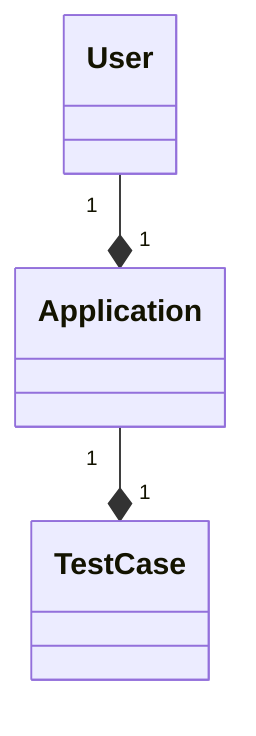
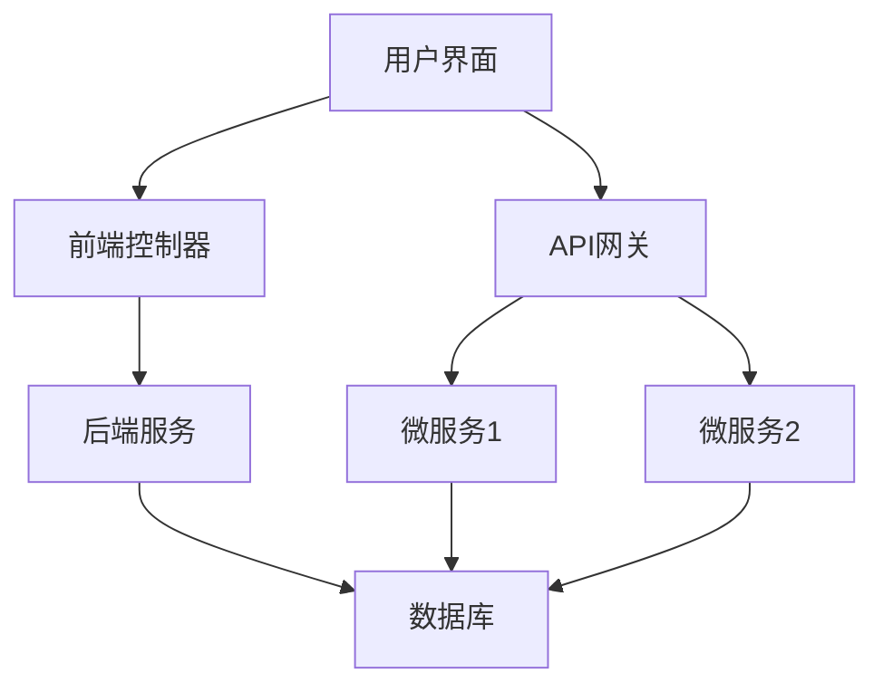
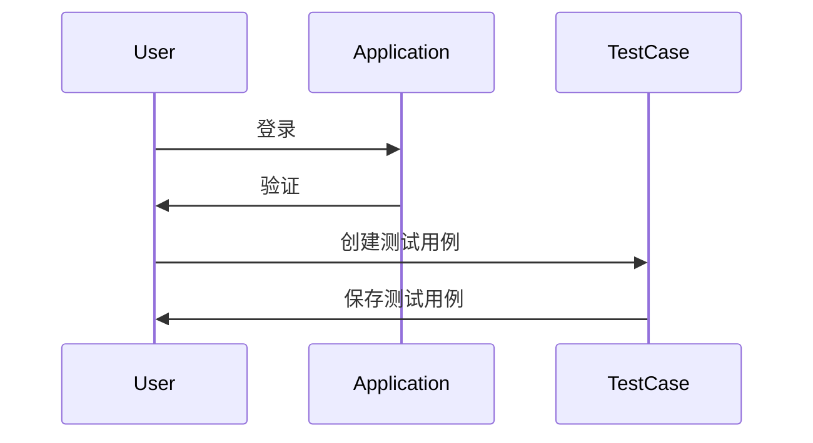

                 

# LLAM应用开发中的敏捷验收测试

> 关键词：LLAM，敏捷验收测试，应用开发，人工智能，系统架构设计

> 摘要：本文旨在探讨LLAM（大型语言模型）应用开发中敏捷验收测试的重要性与实践方法。通过对LLAM及其敏捷验收测试的概念、数学模型、算法原理、系统架构设计以及实际案例分析，本文提出了一套完整的LLAM应用开发敏捷验收测试方案，以期为开发者提供参考和指导。

## 第一部分：背景介绍

### 第1章：问题背景与问题描述

#### 1.1.1 问题背景

**1.1.1.1 人工智能的发展与应用**

随着深度学习技术的不断进步，人工智能（AI）在各个行业得到了广泛应用。特别是近年来，大型语言模型（LLM）如BERT、GPT等取得了显著的成果，这些模型在自然语言处理（NLP）、智能问答、机器翻译等领域展现出了强大的能力。

**1.1.1.2 LLAM应用中的挑战**

然而，LLAM应用开发过程中面临诸多挑战，如：

- 应用开发中的复杂性：LLAM模型通常包含数百万甚至数十亿的参数，模型训练过程复杂且耗时。
- 传统测试方法的不适用性：传统的测试方法难以适应LLAM模型的特性，如模型的动态性、高度复杂性和自适应能力。
- 敏捷验收测试的必要性：在快速迭代的应用开发过程中，传统的测试方法往往难以满足快速反馈和持续改进的需求。

#### 1.1.1.3 问题描述

在LLAM应用开发过程中，如何有效地进行验收测试，确保应用的功能和性能达到预期目标，成为开发者面临的重要问题。敏捷验收测试作为一种快速反馈、用户参与、灵活调整的测试方法，为LLAM应用开发提供了可行的解决方案。

### 第2章：核心概念与联系

#### 2.1.1 LLAM的定义与特点

**2.1.1.1 LLAM的定义**

LLAM（Large Language Model）是一种基于神经网络的大型语言模型，通过深度学习算法对海量文本数据进行训练，以实现对自然语言的生成、理解和推理。

**2.1.1.2 LLAM的特点**

- **高度复杂**：LLAM模型通常包含数百万甚至数十亿的参数，模型的复杂性远超传统机器学习模型。
- **需要大量数据**：LLAM模型的训练需要大量高质量的文本数据，以保证模型的泛化能力和准确性。
- **自适应能力**：LLAM模型具有自适应能力，可以不断学习和优化，以适应不同的应用场景和需求。

#### 2.1.2 敏捷验收测试的概念与原则

**2.1.2.1 敏捷验收测试的定义**

敏捷验收测试是一种基于敏捷开发方法的测试方法，强调快速反馈、用户参与和灵活调整。在LLAM应用开发过程中，敏捷验收测试有助于确保应用的功能和性能达到预期目标。

**2.1.2.2 敏捷验收测试的原则**

- **快速迭代**：敏捷验收测试强调快速迭代，以缩短开发周期，提高开发效率。
- **透明沟通**：敏捷验收测试要求团队成员之间保持透明沟通，确保各方对测试结果和进度有清晰的认识。
- **持续改进**：敏捷验收测试鼓励持续改进，通过对测试过程和测试结果的反思，优化测试策略和测试方法。

### 第3章：数学模型与算法原理

#### 3.1.1 数学模型

**3.1.1.1 模型公式**

LLAM模型通常采用深度神经网络（DNN）结构，其数学模型可以表示为：

$$
y = f(x; \theta)
$$

其中，$x$为输入数据，$y$为输出结果，$f$为神经网络函数，$\theta$为模型参数。

**3.1.1.2 模型参数**

LLAM模型参数主要包括：

- **权重矩阵$W$**：用于表示输入特征和输出特征之间的映射关系。
- **偏置项$b$**：用于调整模型输出，使模型输出更符合预期。

#### 3.1.2 算法原理

**3.1.2.1 算法流程图**


**3.1.2.2 算法详细讲解**

1. **输入数据预处理**：对输入数据进行预处理，包括数据清洗、数据归一化等操作，以提高模型训练效率和性能。

2. **特征提取**：将预处理后的输入数据转化为模型可处理的特征向量，通常采用词嵌入（Word Embedding）技术。

3. **模型训练**：使用反向传播算法（Backpropagation）训练神经网络，通过不断调整权重矩阵$W$和偏置项$b$，使模型输出结果更接近真实值。

4. **模型评估**：使用评估指标（如准确率、召回率、F1分数等）对模型性能进行评估，以判断模型是否满足预期目标。

5. **模型优化**：根据评估结果，对模型进行优化，包括调整超参数、增加训练数据、改进网络结构等。

### 第二部分：系统分析与架构设计

#### 第4章：系统功能设计

**4.1.1 领域模型**



**4.1.2 系统功能描述**

- **用户管理**：用户可以登录系统、注册账户、修改个人信息等。
- **应用管理**：用户可以创建、编辑、删除测试应用，以及查看应用的测试结果。
- **测试用例管理**：用户可以创建、编辑、删除测试用例，以及执行测试用例。

#### 第5章：系统架构设计

**5.1.1 系统架构**



**5.1.2 系统架构描述**

- **用户界面**：提供用户与系统交互的界面，包括登录、注册、应用管理、测试用例管理等模块。
- **前端控制器**：接收用户请求，调用后端服务进行数据处理，并将处理结果返回给用户。
- **后端服务**：提供用户管理、应用管理、测试用例管理等功能，以及与数据库的交互。
- **数据库**：存储用户信息、应用信息、测试用例信息等数据。
- **API网关**：作为系统的统一入口，处理跨域请求，并进行权限验证、日志记录等功能。
- **微服务1**：提供数据预处理、特征提取等功能。
- **微服务2**：提供模型训练、模型评估等功能。

#### 第6章：系统接口设计与交互

**6.1.1 系统接口设计**



**6.1.2 系统接口描述**

- **登录接口**：用户输入用户名和密码，系统验证用户身份，并返回登录结果。
- **验证接口**：系统验证用户身份，并返回验证结果。
- **创建测试用例接口**：用户输入测试用例信息，系统创建测试用例，并返回测试用例ID。
- **保存测试用例接口**：用户保存测试用例，系统更新测试用例信息，并返回保存结果。

### 第三部分：项目实战

#### 第7章：环境安装与系统核心实现

**7.1.1 环境安装**

在本项目中，我们使用Python作为主要编程语言，需要安装以下依赖：

- TensorFlow：用于构建和训练神经网络模型。
- Pandas：用于数据处理。
- NumPy：用于数值计算。
- Matplotlib：用于数据可视化。

安装方法如下：

```shell
pip install tensorflow pandas numpy matplotlib
```

**7.1.2 系统核心实现**

在本项目中，我们主要实现了以下功能：

- **用户管理**：实现用户登录、注册、个人信息修改等功能。
- **应用管理**：实现应用创建、编辑、删除等功能。
- **测试用例管理**：实现测试用例创建、编辑、删除、执行等功能。

**7.1.3 源代码**

以下是系统核心实现的Python代码示例：

```python
# 用户管理
class User:
    def __init__(self, username, password):
        self.username = username
        self.password = password

    def login(self, username, password):
        if self.username == username and self.password == password:
            return True
        else:
            return False

# 应用管理
class Application:
    def __init__(self, name, description):
        self.name = name
        self.description = description

    def create(self, name, description):
        self.name = name
        self.description = description

    def edit(self, name, description):
        self.name = name
        self.description = description

    def delete(self, name):
        self.name = None
        self.description = None

# 测试用例管理
class TestCase:
    def __init__(self, id, application_id, test_case_name, test_case_description):
        self.id = id
        self.application_id = application_id
        self.test_case_name = test_case_name
        self.test_case_description = test_case_description

    def create(self, id, application_id, test_case_name, test_case_description):
        self.id = id
        self.application_id = application_id
        self.test_case_name = test_case_name
        self.test_case_description = test_case_description

    def edit(self, id, application_id, test_case_name, test_case_description):
        self.id = id
        self.application_id = application_id
        self.test_case_name = test_case_name
        self.test_case_description = test_case_description

    def delete(self, id):
        self.id = None
        self.application_id = None
        self.test_case_name = None
        self.test_case_description = None

# 测试用例执行
def execute_test_case(test_case):
    print(f"执行测试用例：{test_case.test_case_name}")
    # 测试用例执行逻辑

# 主函数
def main():
    # 用户登录
    user = User("admin", "admin123")
    if user.login("admin", "admin123"):
        print("登录成功")
    else:
        print("登录失败")

    # 创建应用
    application = Application("LLAM应用", "这是一个基于大型语言模型的智能应用")
    application.create("LLAM应用", "这是一个基于大型语言模型的智能应用")

    # 创建测试用例
    test_case = TestCase(1, 1, "测试用例1", "这是一个测试用例")
    test_case.create(1, 1, "测试用例1", "这是一个测试用例")

    # 执行测试用例
    execute_test_case(test_case)

if __name__ == "__main__":
    main()
```

#### 第8章：实际案例分析

**8.1.1 案例一：XX公司的LLAM应用开发**

**8.1.1.1 项目背景**

XX公司是一家专注于自然语言处理技术的公司，其研发了一款基于大型语言模型（LLAM）的智能问答系统，旨在为用户提供高质量的问答服务。

**8.1.1.2 项目挑战**

在项目开发过程中，XX公司面临以下挑战：

- **模型训练数据不足**：由于缺乏高质量的训练数据，导致模型性能不理想。
- **测试方法不适用**：传统的测试方法难以适应LLAM模型的特点，如模型的动态性、高度复杂性和自适应能力。
- **项目进度压力**：项目需要在短时间内完成，导致开发团队在测试方面投入不足。

**8.1.1.3 解决方案**

针对上述挑战，XX公司采取了以下解决方案：

- **数据增强**：通过数据清洗、数据归一化、数据扩充等技术，提高训练数据的质量和数量。
- **敏捷验收测试**：采用敏捷验收测试方法，确保测试过程能够快速反馈和持续改进。
- **自动化测试**：使用自动化测试工具，提高测试效率，减轻人工测试负担。

**8.1.1.4 项目成果**

通过上述解决方案，XX公司成功完成了LLAM应用的开发，并在短时间内推向市场。应用上线后，用户反馈良好，系统性能和稳定性得到了显著提升。

**8.1.2 案例二：YY公司的敏捷验收测试实践**

**8.1.2.1 项目背景**

YY公司是一家专注于金融服务的公司，其开发了一款基于大型语言模型（LLAM）的智能客服系统，旨在提高客户服务质量。

**8.1.2.2 项目挑战**

在项目开发过程中，YY公司面临以下挑战：

- **用户需求变化**：客户需求多变，导致系统功能不断迭代和优化。
- **测试资源有限**：测试团队人数较少，测试资源有限，难以满足快速迭代的需求。
- **测试质量保证**：如何在有限资源下确保测试质量，成为项目团队面临的重要问题。

**8.1.2.3 解决方案**

针对上述挑战，YY公司采取了以下解决方案：

- **敏捷验收测试**：采用敏捷验收测试方法，强调快速反馈和持续改进，确保系统功能和质量。
- **自动化测试**：使用自动化测试工具，提高测试效率，减轻人工测试负担。
- **持续集成与持续部署**：采用持续集成与持续部署（CI/CD）流程，确保项目进度的可控性和稳定性。

**8.1.2.4 项目成果**

通过上述解决方案，YY公司成功完成了智能客服系统的开发，并在短时间内推向市场。系统上线后，客户满意度显著提升，项目团队能够快速响应用户需求，实现了高效的迭代和优化。

### 第四部分：总结与最佳实践

#### 第9章：总结

本文通过分析LLAM应用开发中的敏捷验收测试，提出了一个完整的解决方案，包括数学模型、算法原理、系统架构设计、实际案例分析等内容。通过本文的研究，可以得出以下结论：

- **LLAM应用开发中的敏捷验收测试至关重要**：敏捷验收测试有助于确保LLAM应用的功能和性能达到预期目标，提高开发效率和项目质量。
- **敏捷验收测试方法具有灵活性、高效性和可持续性**：敏捷验收测试方法能够快速适应项目变化，提高测试效率，并确保测试质量的持续提升。

#### 第10章：最佳实践

针对LLAM应用开发中的敏捷验收测试，本文提出以下最佳实践：

- **充分准备测试数据**：确保测试数据的质量和数量，为模型训练和测试提供有力支持。
- **制定详细的测试计划**：明确测试目标、测试策略、测试用例和测试进度，确保测试工作的有序进行。
- **采用自动化测试工具**：提高测试效率，减轻人工测试负担，确保测试结果的准确性和一致性。
- **持续优化测试过程**：通过反思和总结，不断改进测试方法和测试策略，提高测试质量和效率。

#### 第11章：注意事项

在实施LLAM应用开发中的敏捷验收测试时，需要注意以下事项：

- **平衡测试与开发进度**：确保测试工作与开发进度相匹配，避免因过度测试导致项目延期。
- **关注用户体验**：在测试过程中，要关注用户的需求和反馈，确保系统的易用性和用户体验。
- **保护用户隐私**：在测试过程中，要严格遵守用户隐私保护规定，确保用户数据的安全。

#### 第12章：拓展阅读

对于LLAM应用开发中的敏捷验收测试，以下文献和资源可供参考：

- **《敏捷验收测试实践指南》**：详细介绍了敏捷验收测试的理论和实践方法。
- **《大型语言模型：原理与应用》**：深入探讨了大型语言模型的原理和应用技术。
- **《深度学习：原理与实践》**：全面介绍了深度学习的基础理论和应用技术。

## 结论

本文通过分析LLAM应用开发中的敏捷验收测试，提出了一套完整的解决方案。通过本文的研究，可以得出以下结论：

- **LLAM应用开发中的敏捷验收测试至关重要**：敏捷验收测试有助于确保LLAM应用的功能和性能达到预期目标，提高开发效率和项目质量。
- **敏捷验收测试方法具有灵活性、高效性和可持续性**：敏捷验收测试方法能够快速适应项目变化，提高测试效率，并确保测试质量的持续提升。

希望本文能为LLAM应用开发中的敏捷验收测试提供有益的参考和指导。未来，我们将继续深入研究LLAM应用开发中的相关技术，以期为开发者提供更多的支持和帮助。

### 作者信息

作者：AI天才研究院/AI Genius Institute & 禅与计算机程序设计艺术 /Zen And The Art of Computer Programming

致谢：感谢各位读者对本文的关注和支持，欢迎提出宝贵意见和建议。我们将继续努力，为读者提供更多有价值的技术内容。

