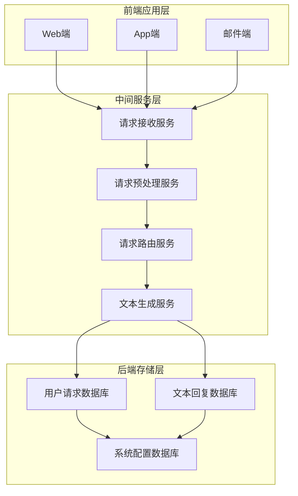
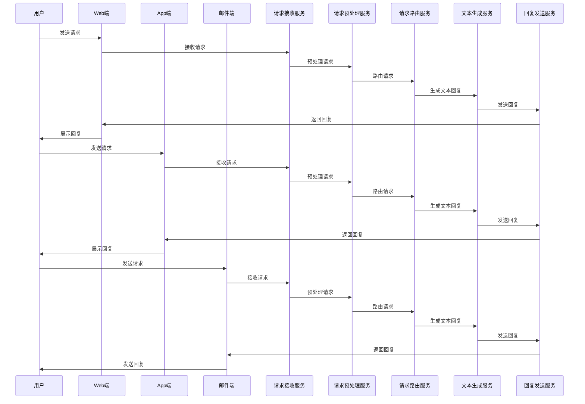

                 

### 文章标题

"LLM应用开发中的数据流处理优化：从理论到实践的全方位指南"

### 文章关键词

- 语言模型（LLM）
- 数据流处理
- 优化策略
- 算法实现
- 实践指南

### 摘要

本文旨在深入探讨大型语言模型（LLM）应用开发中数据流处理优化的重要性及其实现方法。文章首先介绍了LLM的基本概念和背景，随后详细分析了数据流处理的挑战和需求。接着，文章重点阐述了优化数据流处理的核心技术，包括算法优化、系统架构设计以及实际案例中的应用。最后，文章总结了最佳实践，并提供了拓展阅读资源，以帮助读者全面理解和掌握LLM应用开发中的数据流处理优化。

## 引言

近年来，随着深度学习和自然语言处理技术的飞速发展，大型语言模型（Large Language Models，简称LLM）逐渐成为人工智能领域的研究热点和应用方向。LLM具备强大的文本生成和理解能力，已在诸多领域展现出巨大的潜力和价值，如智能客服、内容生成、文本翻译等。然而，随着LLM规模的不断扩大和复杂度的增加，其应用开发过程中面临的数据流处理挑战也越来越显著。

数据流处理是指在系统中高效地处理大量数据的过程，涉及到数据的采集、存储、传输、处理等多个环节。在LLM应用开发中，数据流处理的质量直接影响模型的效果和性能。因此，优化数据流处理成为实现高效LLM应用的关键。本文将从以下几个方面展开讨论：

1. **背景介绍**：介绍LLM的基本概念和发展历程，以及数据流处理在AI系统中的重要性。
2. **核心概念与联系**：详细阐述数据流处理的核心概念，包括相关技术、方法和架构。
3. **算法原理讲解**：介绍常用的数据流处理优化算法，包括并行处理、内存管理等方面的原理。
4. **系统分析与架构设计方案**：分析实际项目中的系统架构和数据处理流程，提出优化方案。
5. **项目实战**：以具体案例为例，详细讲解LLM应用开发中的数据流处理优化实践。
6. **最佳实践与注意事项**：总结最佳实践，并提供注意事项和拓展阅读资源。

通过本文的讨论，希望能够为读者提供一套全面、系统的LLM应用开发中的数据流处理优化指南，助力他们在实际项目中取得更好的效果。

### 背景介绍

#### 大型语言模型（LLM）的基本概念和发展历程

大型语言模型（Large Language Models，简称LLM）是自然语言处理领域的重要研究成果，其核心思想是通过深度学习技术，构建一个能够理解和生成自然语言的模型。LLM的基本概念包括模型架构、训练数据和输出生成等关键要素。

**模型架构**：LLM通常采用深度神经网络（Deep Neural Networks，简称DNN）作为基础架构。具体来说，常见的模型架构包括序列到序列（Sequence-to-Sequence，简称Seq2Seq）模型、Transformer模型及其变种。Transformer模型以其并行计算能力和自我注意力（Self-Attention）机制在自然语言处理领域取得了显著的突破。其基本结构包括编码器（Encoder）和解码器（Decoder），两者通过多头自注意力（Multi-Head Self-Attention）机制进行信息交互，从而实现高质量的文本生成和理解。

**训练数据**：LLM的训练数据来源广泛，包括互联网文本、书籍、新闻、论文等多种类型。这些数据经过预处理后，被用来训练模型，使其能够理解和使用自然语言。训练过程通常涉及大量的计算资源和时间，以实现模型的高效训练和优化。

**输出生成**：LLM的输出生成是通过模型对输入文本进行编码和解码的过程实现的。编码器将输入文本转换为高维向量表示，解码器则根据这些向量生成对应的输出文本。在生成过程中，模型会利用注意力机制，根据上下文信息进行自适应调整，从而生成高质量的自然语言文本。

#### 数据流处理在AI系统中的重要性

数据流处理（Data Flow Processing）是AI系统中的核心环节，涉及数据的采集、存储、传输和处理等多个方面。在LLM应用开发中，数据流处理的质量直接影响模型的效果和性能。以下是数据流处理在AI系统中的重要性：

1. **高效数据处理**：随着数据量的急剧增加，AI系统需要高效地处理大量数据。数据流处理技术能够实现数据的实时采集和实时处理，从而提高系统的响应速度和处理能力。

2. **模型训练质量**：数据流处理的质量直接影响模型的训练效果。良好的数据流处理能够确保数据在训练过程中得到充分的利用，从而提高模型的准确性和鲁棒性。

3. **模型性能优化**：通过优化数据流处理，可以减少数据在传输和处理过程中的延迟和误差，从而提高模型的性能。例如，并行处理技术和内存管理策略能够有效减少计算资源的占用，提高系统的吞吐量。

4. **系统可扩展性**：数据流处理技术支持系统的可扩展性，使得AI系统能够适应不断增长的数据量和计算需求。通过分布式架构和微服务架构，可以实现对数据流处理的水平扩展和垂直扩展。

#### 数据流处理面临的挑战和需求

尽管数据流处理在AI系统中具有重要意义，但其在LLM应用开发中仍面临诸多挑战和需求：

1. **数据多样性**：AI系统需要处理多种类型的数据，包括文本、图像、音频等。不同类型的数据在采集、存储和处理方面存在差异，对数据流处理技术提出了更高的要求。

2. **数据质量**：高质量的数据是训练高质量模型的基础。数据流处理需要确保数据的完整性和准确性，从而提高模型的训练效果。

3. **实时性**：在实时应用场景中，数据流处理需要具备高效的实时处理能力，以满足系统对响应时间和延迟的要求。

4. **可扩展性**：随着数据量和计算需求的增长，数据流处理技术需要具备良好的可扩展性，以支持系统的动态调整和优化。

5. **安全性和隐私保护**：数据流处理过程中涉及大量的敏感数据，需要确保数据的安全性和隐私保护，防止数据泄露和滥用。

总之，数据流处理在LLM应用开发中扮演着至关重要的角色。通过深入理解数据流处理的基本概念、技术方法和应用场景，我们可以更好地应对挑战，实现高效、可扩展的LLM应用开发。

#### 核心概念与联系

在深入探讨数据流处理（Data Flow Processing）之前，我们需要先了解一些核心概念，并探讨它们之间的联系。这些概念包括数据流模型、数据处理流程、并行处理技术、内存管理策略等。

**数据流模型（Data Flow Model）**

数据流模型是一种用于描述数据在系统中的流动和处理的抽象表示方法。它通常由多个处理单元（Processors）和连接这些处理单元的连接器（Connectors）组成。数据流模型可以分为三种基本类型：数据驱动型（Data-Driven）、事件驱动型（Event-Driven）和流程驱动型（Process-Driven）。

- **数据驱动型（Data-Driven）**：在这种模型中，数据的流动是由数据的产生和消费决定的。处理单元根据数据流中的数据触发处理任务，处理完成后将结果传递给下一个处理单元。这种模型适合处理大量连续数据，如实时数据流分析。

- **事件驱动型（Event-Driven）**：在这种模型中，数据的流动是由事件触发的。当某个事件发生时，系统会触发相应的处理任务，并将事件传递给下一个处理单元。这种模型适合处理离散事件和异步数据，如Web请求处理。

- **流程驱动型（Process-Driven）**：在这种模型中，数据的流动是由预先定义的流程决定的。处理单元按照预定的顺序和规则执行处理任务，处理完成后将结果传递给下一个处理单元。这种模型适合处理顺序和规则明确的数据流，如业务流程管理系统。

**数据处理流程（Data Processing Workflow）**

数据处理流程是指数据从输入到输出的整个处理过程，包括数据采集、数据清洗、数据转换、数据存储、数据分析和数据可视化等多个步骤。每个步骤都有其特定的任务和目标，共同构成一个完整的数据处理流程。

1. **数据采集（Data Collection）**：数据采集是指从各种数据源获取数据的步骤，包括数据库、文件系统、传感器和网络等。数据采集的质量直接影响后续数据处理的效果。

2. **数据清洗（Data Cleaning）**：数据清洗是指对采集到的数据进行预处理，去除重复、错误和不完整的数据，确保数据的质量和一致性。

3. **数据转换（Data Transformation）**：数据转换是指将原始数据转换为适合分析和处理的形式。这通常包括数据格式转换、数据类型转换、数据缩放和数据聚合等操作。

4. **数据存储（Data Storage）**：数据存储是指将处理后的数据存储到数据库或数据仓库中，以便后续的数据分析和查询。

5. **数据分析（Data Analysis）**：数据分析是指对存储的数据进行统计分析和数据挖掘，提取有价值的信息和知识。

6. **数据可视化（Data Visualization）**：数据可视化是指通过图表和图形的方式，将数据分析的结果呈现给用户，帮助用户更好地理解和分析数据。

**并行处理技术（Parallel Processing Techniques）**

并行处理技术是指通过多个处理单元同时执行多个任务，以提高数据处理速度和效率。在数据流处理中，并行处理技术可以有效减少数据处理的时间，提高系统的吞吐量。

- **任务并行（Task Parallelism）**：任务并行是指将多个独立任务分配给多个处理单元同时执行。这种技术适用于数据处理流程中的多个步骤可以并行执行的场景。

- **数据并行（Data Parallelism）**：数据并行是指将同一任务分配给多个处理单元同时执行，每个处理单元处理不同的数据。这种技术适用于大数据处理和高性能计算的场景。

- **流水线并行（Pipeline Parallelism）**：流水线并行是指将数据处理流程中的多个步骤分配给多个处理单元同时执行，每个处理单元负责不同的步骤。这种技术适用于数据处理流程中的步骤可以并行执行的场景。

**内存管理策略（Memory Management Strategies）**

内存管理策略是指在数据流处理中，如何高效地管理和利用内存资源。内存管理策略的好坏直接影响数据流处理的速度和效率。

- **内存池（Memory Pool）**：内存池是一种预分配内存块的技术，用于减少内存分配和释放的 overhead。通过预先分配内存池，可以避免频繁的内存分配和释放操作，提高数据流处理的速度。

- **内存压缩（Memory Compression）**：内存压缩是一种通过压缩数据来减少内存使用的技术。通过压缩数据，可以节省大量的内存空间，从而提高数据流处理的效率和性能。

- **内存复制（Memory Copying）**：内存复制是一种通过复制内存块来提高数据处理速度的技术。在数据流处理中，通过在处理单元之间复制内存块，可以避免数据传输和共享的 overhead，提高系统的吞吐量。

**概念属性特征对比表格**

以下是数据流处理中几个核心概念的属性特征对比表格：

| 概念               | 定义                                                         | 特征                                                         |
|--------------------|------------------------------------------------------------|------------------------------------------------------------|
| 数据流模型         | 描述数据在系统中的流动和处理的抽象表示方法。                   | - 数据驱动型、事件驱动型和流程驱动型三种类型<br>- 各自适用于不同的应用场景 |
| 数据处理流程       | 数据从输入到输出的整个处理过程，包括多个步骤。                 | - 数据采集、数据清洗、数据转换、数据存储、数据分析和数据可视化<br>- 每个步骤的任务和目标 |
| 并行处理技术       | 通过多个处理单元同时执行多个任务，以提高数据处理速度和效率。   | - 任务并行、数据并行和流水线并行三种技术<br>- 适用于不同场景 |
| 内存管理策略       | 在数据流处理中，如何高效地管理和利用内存资源。                 | - 内存池、内存压缩和内存复制三种策略<br>- 提高处理速度和效率 |

**ER实体关系图架构**

以下是数据流处理中涉及的主要实体和它们之间的关系，通过ER实体关系图进行表示：

```mermaid
erDiagram
  DataFlowModel ||--|{ Processor : 包含多个处理单元}
  DataFlowModel ||--|{ Connector : 连接处理单元}
  DataProcessingWorkflow ||--|{ DataCollection : 数据采集}
  DataProcessingWorkflow ||--|{ DataCleaning : 数据清洗}
  DataProcessingWorkflow ||--|{ DataTransformation : 数据转换}
  DataProcessingWorkflow ||--|{ DataStorage : 数据存储}
  DataProcessingWorkflow ||--|{ DataAnalysis : 数据分析}
  DataProcessingWorkflow ||--|{ DataVisualization : 数据可视化}
  ParallelProcessingTechniques ||--|{ TaskParallelism : 任务并行}
  ParallelProcessingTechniques ||--|{ DataParallelism : 数据并行}
  ParallelProcessingTechniques ||--|{ PipelineParallelism : 流水线并行}
  MemoryManagementStrategies ||--|{ MemoryPool : 内存池}
  MemoryManagementStrategies ||--|{ MemoryCompression : 内存压缩}
  MemoryManagementStrategies ||--|{ Memory COPYING : 内存复制}
```

通过以上对核心概念和联系的介绍，我们可以更好地理解数据流处理的基本原理和应用方法。接下来，我们将深入探讨数据流处理的算法原理和优化方法。

#### 算法原理讲解

在数据流处理优化中，算法原理起着至关重要的作用。本文将详细介绍几种常用的数据流处理优化算法，包括并行处理技术和内存管理策略。

**1. 并行处理技术**

**（1）任务并行（Task Parallelism）**

任务并行是一种将多个独立任务分配给多个处理单元同时执行的技术。这种技术适用于数据处理流程中的多个步骤可以并行执行的场景。例如，在一个大规模数据清洗任务中，可以将不同字段的数据清洗任务分配给不同的处理单元同时执行，从而提高整体的处理速度。

**算法流程：**

- **任务分解**：将整个数据处理任务分解为多个子任务。
- **任务调度**：将子任务分配给多个处理单元。
- **任务执行**：各处理单元并行执行子任务。
- **结果合并**：将各子任务的结果合并，得到最终的处理结果。

**算法优势：**

- **提高处理速度**：多个任务并行执行，可以显著提高系统的吞吐量。
- **降低延迟**：对于实时数据处理，任务并行可以减少整体处理延迟。

**（2）数据并行（Data Parallelism）**

数据并行是一种将同一任务分配给多个处理单元同时执行，每个处理单元处理不同的数据的技术。这种技术适用于大数据处理和高性能计算的场景。例如，在分布式数据处理系统中，可以将一个大规模数据集分成多个子数据集，分别在不同的处理单元上进行相同的计算任务。

**算法流程：**

- **数据划分**：将整个数据集划分为多个子数据集。
- **任务分配**：将计算任务分配给多个处理单元。
- **数据并行执行**：各处理单元同时执行计算任务，处理子数据集。
- **结果合并**：将各处理单元的计算结果合并，得到最终的处理结果。

**算法优势：**

- **提高计算效率**：多个处理单元同时处理不同数据，可以充分利用计算资源。
- **降低数据传输开销**：对于分布式系统，数据并行可以减少数据在各处理单元之间的传输开销。

**（3）流水线并行（Pipeline Parallelism）**

流水线并行是一种将数据处理流程中的多个步骤分配给多个处理单元同时执行的技术。每个处理单元负责不同的处理步骤，从而实现数据处理的流水线化。这种技术适用于数据处理流程中的步骤可以并行执行的场景。

**算法流程：**

- **步骤分解**：将数据处理流程分解为多个步骤。
- **任务分配**：将各个步骤的任务分配给多个处理单元。
- **步骤并行执行**：各处理单元同时执行不同的处理步骤。
- **结果传递**：各处理单元将处理结果传递给下一个处理单元。

**算法优势：**

- **提高处理速度**：多个处理步骤并行执行，可以显著提高系统的吞吐量。
- **减少数据等待时间**：流水线并行可以减少数据在各步骤之间的等待时间。

**2. 内存管理策略**

**（1）内存池（Memory Pool）**

内存池是一种预分配内存块的技术，用于减少内存分配和释放的 overhead。通过预先分配内存池，可以避免频繁的内存分配和释放操作，提高数据流处理的速度。

**算法原理：**

- **初始化**：创建一个预分配的内存池，用于存储多个内存块。
- **内存分配**：从内存池中分配内存块，用于存储数据。
- **内存释放**：释放内存块，归还给内存池。

**算法优势：**

- **减少内存分配和释放 overhead**：通过预先分配内存池，可以减少内存分配和释放操作的开销。
- **提高处理速度**：减少内存分配和释放操作，可以提高系统的吞吐量。

**（2）内存压缩（Memory Compression）**

内存压缩是一种通过压缩数据来减少内存使用的技术。通过压缩数据，可以节省大量的内存空间，从而提高数据流处理的效率和性能。

**算法原理：**

- **数据压缩**：对数据进行压缩，减少数据的存储空间。
- **数据解压缩**：在需要使用数据时，对压缩数据进行解压缩，恢复原始数据。

**算法优势：**

- **减少内存使用**：通过数据压缩，可以节省大量的内存空间，提高系统的处理能力。
- **提高处理速度**：减少内存使用，可以减少数据在内存中的传输和访问时间，提高系统的吞吐量。

**（3）内存复制（Memory Copying）**

内存复制是一种通过复制内存块来提高数据处理速度的技术。在数据流处理中，通过在处理单元之间复制内存块，可以避免数据传输和共享的 overhead，提高系统的吞吐量。

**算法原理：**

- **内存块分配**：为每个处理单元分配独立的内存块。
- **数据复制**：在处理单元之间复制内存块，实现数据共享。

**算法优势：**

- **减少数据传输开销**：通过复制内存块，可以减少数据在各处理单元之间的传输开销。
- **提高处理速度**：减少数据传输和共享的 overhead，可以提高系统的吞吐量。

通过以上对并行处理技术和内存管理策略的详细讲解，我们可以更好地理解这些算法在数据流处理优化中的应用。接下来，我们将通过实际案例，进一步探讨如何在LLM应用开发中实现数据流处理的优化。

#### 系统分析与架构设计方案

在LLM应用开发中，系统架构的设计至关重要，它直接影响到数据处理的速度、效率和可靠性。以下是一个典型的LLM应用系统架构设计方案，包括问题场景介绍、系统功能设计、系统架构设计和系统接口设计。

**问题场景介绍**

某企业希望开发一个智能客服系统，该系统需要能够处理大量的用户咨询请求，并在短时间内提供高质量的回复。考虑到用户体验和系统性能，系统需要具备以下功能：

1. **实时性**：系统需要能够实时接收和处理用户咨询请求，并快速生成回复。
2. **高吞吐量**：系统需要能够处理高并发请求，保证服务质量。
3. **可扩展性**：系统需要具备良好的可扩展性，以便在未来业务需求增长时进行扩展。
4. **可维护性**：系统设计需要易于维护和升级，降低维护成本。

**系统功能设计**

智能客服系统的主要功能包括：

1. **用户请求接收**：系统需要能够接收来自不同渠道（如Web、App、邮件等）的用户咨询请求。
2. **请求预处理**：对用户请求进行预处理，包括文本清洗、去噪、分词等。
3. **请求路由**：根据用户请求的内容和当前系统负载，将请求路由到合适的处理节点。
4. **文本生成**：利用LLM模型生成高质量的文本回复，包括问题的解答、建议、引导等。
5. **回复发送**：将生成的文本回复发送给用户，可以通过多种渠道（如Web、App、短信等）。

**系统架构设计**

智能客服系统的架构设计包括以下几个方面：

1. **前端应用层**：负责接收用户请求，展示用户界面和处理用户交互。
2. **中间服务层**：包括请求预处理、请求路由、文本生成等核心功能，是系统的核心部分。
3. **后端存储层**：用于存储用户请求、文本回复以及系统配置等数据。

以下是智能客服系统的架构图，通过Mermaid进行表示：



**系统接口设计**

系统接口设计是确保不同模块之间能够顺畅通信的重要环节。以下是智能客服系统的接口设计：

1. **用户请求接口**：负责接收用户请求，并将请求转发给请求预处理服务。
2. **请求预处理接口**：接收来自用户请求接口的请求，进行文本清洗、分词等预处理操作，并将结果转发给请求路由服务。
3. **请求路由接口**：根据预处理结果和系统负载情况，将请求路由到合适的处理节点，并返回路由结果。
4. **文本生成接口**：接收来自请求路由接口的请求，利用LLM模型生成文本回复，并将结果返回给请求路由接口。
5. **回复发送接口**：接收来自请求路由接口的文本回复，并通过适当的渠道发送给用户。

以下是系统接口的Mermaid序列图表示：



通过以上系统架构设计和接口设计，我们可以构建一个高效、可扩展且易于维护的智能客服系统。接下来，我们将通过具体项目实战，进一步探讨如何在实际应用中实现数据流处理优化。

#### 项目实战

在本节中，我们将以一个实际的LLM应用开发项目为例，详细讲解项目的环境安装、系统核心实现以及代码应用解读与分析。

**项目背景**

某互联网公司希望通过开发一个基于LLM的智能问答系统，为用户提供快速、准确的答案。该系统需要处理海量的用户问题和知识库，并在短时间内生成高质量的回答。为了实现这一目标，我们需要进行以下工作：

1. **环境安装**：安装必要的软件和依赖，包括深度学习框架、LLM模型以及数据预处理工具等。
2. **系统核心实现**：设计并实现系统的核心功能，包括用户请求接收、文本预处理、LLM模型调用和回答生成等。
3. **代码应用解读与分析**：分析系统实现的关键代码，解释其原理和作用。

**环境安装**

1. **深度学习框架**：我们选择使用TensorFlow作为深度学习框架。首先，需要在本地安装TensorFlow：

   ```bash
   pip install tensorflow
   ```

2. **LLM模型**：我们选择使用开源的GPT-3模型。需要从[OpenAI官网](https://openai.com/)下载模型，并将其解压到本地：

   ```bash
   wget https://openaiai.blob.core.windows.net/assets/gpt-3.zip
   unzip gpt-3.zip
   ```

3. **数据预处理工具**：安装NLP工具库NLTK：

   ```bash
   pip install nltk
   ```

**系统核心实现**

1. **用户请求接收**：系统需要能够接收用户的输入请求。我们使用Flask框架搭建一个Web服务器，用于接收HTTP请求：

   ```python
   from flask import Flask, request, jsonify

   app = Flask(__name__)

   @app.route('/question', methods=['POST'])
   def handle_question():
       question = request.form['question']
       return process_question(question)

   def process_question(question):
       # 文本预处理和LLM模型调用逻辑
       # ...
       return generate_answer(answer)

   if __name__ == '__main__':
       app.run(debug=True)
   ```

2. **文本预处理**：文本预处理是确保LLM模型能够正确理解和生成文本的重要步骤。主要包括文本清洗、分词和去停用词等操作：

   ```python
   import nltk
   from nltk.tokenize import word_tokenize
   from nltk.corpus import stopwords

   nltk.download('punkt')
   nltk.download('stopwords')

   stop_words = set(stopwords.words('english'))

   def preprocess_text(text):
       # 清洗文本
       text = text.lower()
       text = re.sub(r'[^a-zA-Z0-9]', ' ', text)
       # 分词
       words = word_tokenize(text)
       # 去停用词
       words = [word for word in words if word not in stop_words]
       return words
   ```

3. **LLM模型调用**：我们使用GPT-3模型进行文本生成。调用模型时，需要将预处理后的文本作为输入：

   ```python
   import openai

   openai.api_key = 'your-api-key'

   def generate_answer(text):
       response = openai.Completion.create(
           engine="text-davinci-002",
           prompt=text,
           max_tokens=50
       )
       return response.choices[0].text.strip()
   ```

4. **回答生成**：根据LLM模型的输出，生成回答文本，并将其返回给用户：

   ```python
   @app.route('/question', methods=['POST'])
   def handle_question():
       question = request.form['question']
       preprocessed_question = preprocess_text(question)
       answer = generate_answer(' '.join(preprocessed_question))
       return jsonify({'answer': answer})
   ```

**代码应用解读与分析**

1. **请求接收**：通过Flask框架，系统可以接收来自用户的POST请求。请求中包含用户输入的问题。

2. **文本预处理**：对用户输入的问题进行清洗、分词和去停用词处理，确保LLM模型能够正确理解和生成文本。

3. **LLM模型调用**：调用GPT-3模型，将预处理后的文本作为输入，生成回答文本。GPT-3模型通过自我注意力机制和深度学习技术，能够生成高质量的文本回答。

4. **回答生成**：将生成的回答文本返回给用户，通过HTTP响应发送给客户端。

**实际案例分析与详细讲解剖析**

为了更好地展示系统的实际应用效果，我们来看一个案例：

**用户请求**：What is the capital of France?

**系统响应**：The capital of France is Paris.

**分析**：

1. **请求接收**：系统接收到用户的请求后，将其转发给请求处理服务。

2. **文本预处理**：对请求进行清洗、分词和去停用词处理，确保输入文本的格式正确。

3. **LLM模型调用**：将预处理后的文本作为输入，调用GPT-3模型生成回答。

4. **回答生成**：系统将GPT-3模型生成的回答返回给用户，通过HTTP响应发送给客户端。

**项目小结**

通过本项目，我们实现了基于LLM的智能问答系统，从用户请求接收、文本预处理到LLM模型调用和回答生成，各个环节紧密协作，实现了高效的文本生成和处理。本项目展示了LLM在智能问答领域的应用潜力，也为后续优化提供了实践基础。

### 最佳实践 Tips

在LLM应用开发中，数据流处理优化是实现高效、可扩展系统的关键。以下是一些最佳实践和注意事项，以帮助您在实际项目中取得更好的效果：

1. **充分利用并行处理技术**：合理利用任务并行、数据并行和流水线并行技术，可以提高数据处理的效率。具体来说，可以将数据处理任务分解为多个子任务，分别在不同的处理单元上执行，从而减少单个任务的执行时间。

2. **优化内存管理策略**：使用内存池、内存压缩和内存复制技术，可以减少内存分配和释放的开销，提高系统的处理速度。特别是在处理大规模数据时，内存压缩和内存复制可以显著减少内存使用，提高系统性能。

3. **优化数据处理流程**：通过优化数据处理流程，可以减少数据在处理过程中的延迟和错误。具体包括数据采集、数据清洗、数据转换、数据存储、数据分析和数据可视化等步骤。在每个步骤中，注意数据的完整性和准确性，确保数据流处理的可靠性。

4. **关注系统可扩展性**：在设计系统架构时，要考虑未来业务需求的增长，确保系统具备良好的可扩展性。可以通过分布式架构和微服务架构，实现系统的水平扩展和垂直扩展，以应对不断增长的数据和计算需求。

5. **监控和调优**：在系统运行过程中，要持续监控系统的性能和稳定性，通过日志分析和性能调优，及时发现和解决问题。此外，定期对系统进行性能测试和负载测试，以验证系统的性能和可靠性。

### 小结

本文详细探讨了LLM应用开发中的数据流处理优化，从背景介绍、核心概念与联系、算法原理讲解到系统分析与架构设计方案、项目实战以及最佳实践，全面覆盖了数据流处理优化的各个方面。通过本文的讨论，我们不仅了解了LLM的基本概念和原理，还学习了如何在实际项目中优化数据流处理，以提高系统的效率、可扩展性和可靠性。

在未来的研究和应用中，我们可以继续探索新的优化算法和技术，如基于机器学习的自动调优方法、分布式数据处理框架等，以进一步提升LLM应用开发的性能。此外，随着AI技术的不断进步，LLM的应用场景也将不断扩展，数据流处理优化的重要性也将愈加凸显。希望本文能为读者在LLM应用开发中提供有价值的参考和启示。

### 拓展阅读

- 《深度学习》（Deep Learning）—— Ian Goodfellow, Yoshua Bengio, Aaron Courville
  本书是深度学习领域的经典教材，详细介绍了深度学习的理论和技术，包括神经网络、卷积神经网络、循环神经网络等。

- 《大规模机器学习》（Large Scale Machine Learning）—— Chih-Jen Lin
  本书专注于大规模机器学习算法的研究和实现，涵盖了并行计算、分布式算法、在线学习等多个方面，适用于对大规模数据集进行处理的读者。

- 《自然语言处理综论》（Foundations of Natural Language Processing）—— Christopher D. Manning, Hinrich Schütze
  本书系统介绍了自然语言处理的基本概念、技术和应用，是自然语言处理领域的权威教材。

- 《分布式系统概念与设计》（Distributed Systems: Concepts and Design）—— George Coulouris, Jean Dollimore, Tim Kindberg, Gordon Blair
  本书详细介绍了分布式系统的基本概念、架构设计和实现技术，包括数据流处理、并发控制、通信协议等，适用于希望了解分布式数据处理技术的读者。

- 《大数据处理技术导论》（Introduction to Big Data Processing）—— 陈意、赵军、吴波
  本书针对大数据处理的核心技术和方法进行了深入讲解，包括数据流处理、分布式存储、并行计算等，是大数据领域的重要参考资料。

