                 

### 1. 引言

#### 1.1.1 LLM的发展与应用

大型语言模型（LLM）的发展可以追溯到20世纪80年代，当时研究人员开始探索如何让计算机理解和生成自然语言。这一领域的突破始于1990年代的统计语言模型，例如Kneser-Ney语言模型和N-Gram模型。这些模型通过统计文本中词频的上下文关系来预测下一个单词，取得了显著的进展。

然而，随着计算能力和数据规模的提升，研究人员在21世纪开始探索更加复杂和强大的语言模型。这一趋势在2018年达到了一个重要的里程碑，当时OpenAI发布了GPT-1，一个具有1.5亿参数的模型。随后，GPT-2、GPT-3等更大规模的模型相继问世，它们的参数规模达到了数十亿甚至上百亿。

LLM在各个领域的应用也在不断扩展。在自然语言处理（NLP）领域，LLM被广泛应用于机器翻译、文本摘要、情感分析、问答系统等任务。在计算机辅助编程领域，LLM被用于代码补全、错误修复和代码生成等。在人工智能领域，LLM作为预训练模型的基础，被广泛应用于生成对抗网络（GAN）、图神经网络（GNN）等复杂模型。

#### 1.1.2 数据流管理的重要性

数据流管理在LLM应用开发中至关重要。LLM通常需要处理海量的文本数据，这些数据可能来自互联网、数据库、传感器等各种来源。如何高效、准确地收集、处理和存储这些数据，是LLM应用开发中的关键挑战。

首先，数据流管理涉及到数据的质量和完整性。在NLP任务中，数据的噪声和错误可能导致模型性能的下降。因此，数据清洗和预处理是数据流管理的重要组成部分。

其次，数据流管理涉及到数据的传输和同步。由于LLM模型通常需要实时处理数据，数据传输的延迟和同步问题可能导致模型的响应速度下降，影响用户体验。

最后，数据流管理还涉及到数据的存储和检索。LLM模型通常需要存储大量的数据，如文本、图片和音频等。如何高效地存储和检索这些数据，是数据流管理中另一个重要的挑战。

#### 1.1.3 LLM应用开发中的挑战

LLM应用开发中面临的主要挑战包括：

1. **数据规模和多样性**：LLM通常需要处理海量的数据，这些数据可能来自不同的来源，具有不同的格式和结构。如何高效地处理和整合这些数据，是数据流管理中的关键问题。

2. **实时处理需求**：许多LLM应用要求实时响应，例如智能客服、实时问答系统等。如何确保数据流的实时性和可靠性，是数据流管理中的一个重要问题。

3. **数据安全和隐私**：随着数据量的增加，数据安全和隐私问题也变得更加突出。如何确保数据在传输和存储过程中的安全，避免数据泄露和滥用，是数据流管理中的重要挑战。

4. **模型训练和优化**：LLM模型的训练和优化是一个复杂的过程，需要大量的计算资源和时间。如何高效地管理和调度这些资源，是LLM应用开发中的另一个重要问题。

5. **可扩展性和弹性**：随着LLM应用规模的扩大，如何确保系统的可扩展性和弹性，以应对不断增加的负载，是数据流管理中需要考虑的问题。

在接下来的章节中，我们将详细探讨这些挑战，并介绍相应的解决方案和最佳实践。

### 1.2. 基本概念

#### 1.2.1 数据流

数据流是指数据在系统中的传输和处理的路径。在LLM应用开发中，数据流通常包括以下几个阶段：

1. **数据采集**：从各种来源（如互联网、数据库、传感器等）收集数据。
2. **数据清洗和预处理**：去除数据中的噪声和错误，将数据转换为适合模型处理的格式。
3. **数据传输**：将预处理后的数据传输到模型进行训练或推理。
4. **数据存储**：将训练好的模型或推理结果存储到数据库或文件系统中。

数据流的示意图如下：

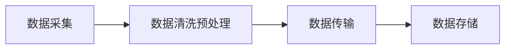

#### 1.2.2 数据管道

数据管道是指将数据从源系统传输到目标系统的流程。在LLM应用开发中，数据管道通常包括以下几个组件：

1. **数据源**：数据采集的来源，如数据库、文件系统、传感器等。
2. **数据处理器**：对数据进行清洗、转换和预处理的组件。
3. **数据传输器**：将数据从一个系统传输到另一个系统的组件。
4. **数据存储器**：存储数据和模型的地方，如数据库、文件系统等。

数据管道的示意图如下：

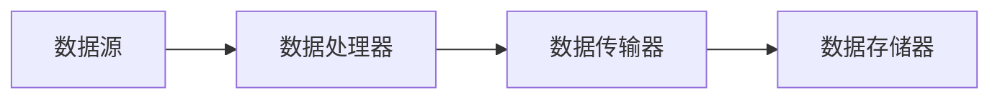

#### 1.2.3 数据同步与传输策略

数据同步是指确保在不同系统之间数据的一致性和准确性。在LLM应用开发中，数据同步策略至关重要，因为模型训练和推理过程通常需要最新的数据。

1. **批量同步**：定期将数据从源系统传输到目标系统，例如每小时或每天一次。这种方法简单但可能会导致数据延迟。
2. **实时同步**：在数据发生变化时立即传输到目标系统。这种方法可以确保数据的最新性，但可能需要更多的计算资源和网络带宽。

数据传输策略包括：

1. **传输速率**：根据网络带宽和系统负载调整数据传输速率，以避免网络拥塞。
2. **传输可靠性**：确保数据在传输过程中的完整性和准确性，可以使用校验和、重传机制等。
3. **数据压缩**：在传输数据前进行压缩，以减少传输时间和带宽消耗。

以下是一个简单的数据同步和传输策略的ER实体关系图：

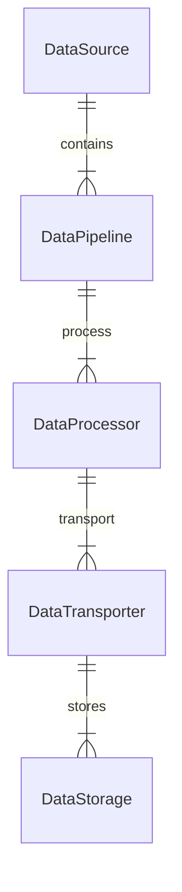

在下一章节中，我们将讨论用于LLM应用开发的数据流管理技术。

----------------------------------------------------------------

## 2. 数据流管理技术

在LLM应用开发中，数据流管理技术至关重要，它涉及到如何高效地处理和传输大规模数据。以下是几种常用的数据流管理技术：

### 2.1 流处理框架

流处理框架能够实时处理和分析数据流，使LLM应用能够快速响应和处理数据。以下两种流处理框架在LLM应用开发中尤为常用：

#### 2.1.1 Apache Kafka

Apache Kafka是一个分布式流处理平台，用于构建实时数据流和流式应用程序。它具有高吞吐量、可扩展性和容错性，适用于处理大规模数据流。

**Kafka的核心组件**包括：

- **Producer**：数据生成者，负责将数据写入Kafka主题。
- **Broker**：Kafka服务器，负责存储和转发消息。
- **Consumer**：数据消费者，从Kafka主题中读取消息。

**Kafka的数据流过程**如下：

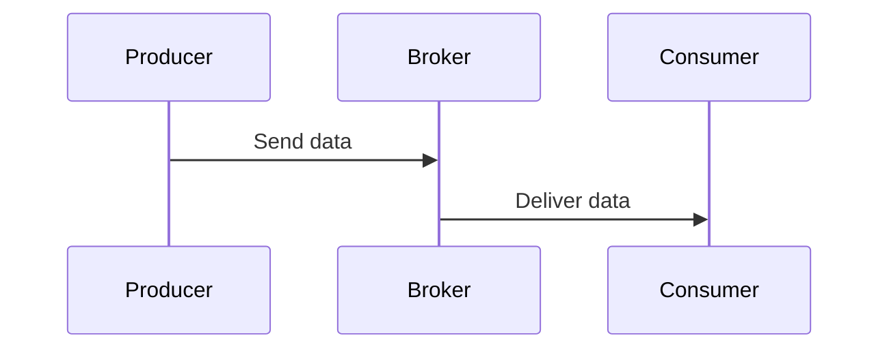

**Kafka的优点**：

- **高吞吐量**：能够处理大量数据，适用于大规模数据流处理。
- **可扩展性**：可以通过增加Broker节点来水平扩展。
- **容错性**：通过副本和分区实现数据的冗余和容错。

**Kafka的缺点**：

- **复杂性**：配置和管理较为复杂，需要一定的运维技能。
- **数据查询困难**：不适合进行历史数据的查询和分析。

以下是一个简单的Kafka架构图：

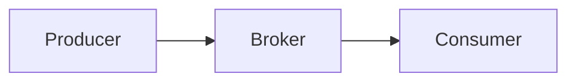

#### 2.1.2 Apache Flink

Apache Flink是一个流处理框架，能够实时处理有界和无界数据流。与Kafka结合使用，可以实现高效的数据流处理。

**Flink的核心组件**包括：

- **JobManager**：负责协调任务调度和资源分配。
- **TaskManager**：负责执行具体的任务处理。

**Flink的数据流过程**如下：

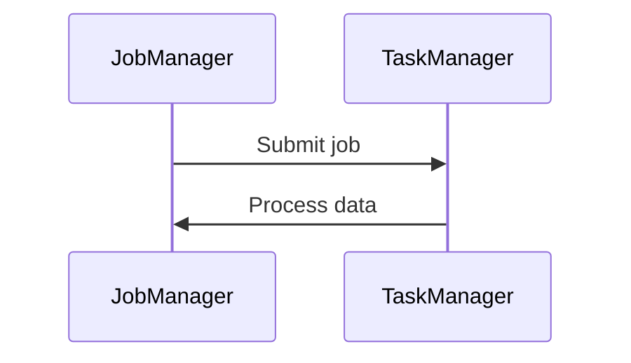

**Flink的优点**：

- **实时处理**：支持实时数据流处理，适用于需要实时响应的LLM应用。
- **易用性**：提供了丰富的API和工具，易于开发和使用。
- **整合性**：可以与Kafka等大数据处理工具无缝集成。

**Flink的缺点**：

- **资源消耗较大**：实时处理需要较高的计算资源。
- **学习曲线**：对于初学者来说，学习曲线相对较陡峭。

以下是一个简单的Flink架构图：

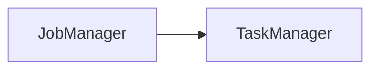

### 2.2 数据同步算法

数据同步算法在LLM应用开发中用于确保数据在不同系统之间的一致性和准确性。以下是两种常用的数据同步算法：

#### 2.2.1 乐观锁

乐观锁通过检查数据版本号或时间戳来确保数据的一致性。在同步数据时，系统会检查数据的版本号或时间戳，如果发现数据已被修改，则回滚操作并重新同步。

**乐观锁的优点**：

- **高并发性能**：允许多个操作同时进行，提高系统的并发性能。
- **简单实现**：实现相对简单，易于理解和维护。

**乐观锁的缺点**：

- **数据冲突**：在高并发场景下，可能会导致数据冲突和丢失。

以下是一个乐观锁的简化流程图：

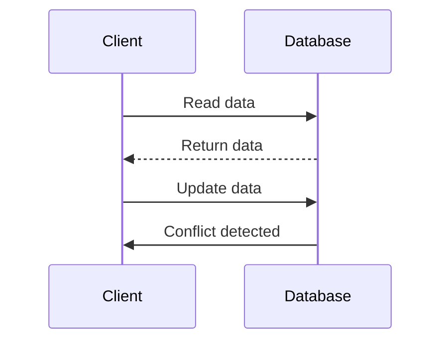

#### 2.2.2 悲观锁

悲观锁通过锁定数据来确保数据的一致性。在同步数据时，系统会锁定数据，直到操作完成，其他操作无法同时修改同一数据。

**悲观锁的优点**：

- **数据一致性**：确保数据在同步过程中的一致性，减少数据冲突。
- **简单实现**：实现相对简单，易于理解和维护。

**悲观锁的缺点**：

- **并发性能**：在并发场景下，性能可能受到影响。

以下是一个悲观锁的简化流程图：

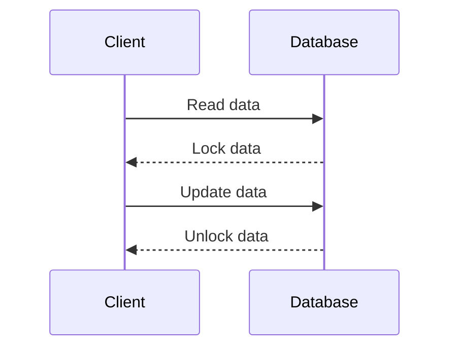

### 2.3 数据存储策略

数据存储策略在LLM应用开发中用于高效地存储和检索数据。以下是两种常用的数据存储策略：

#### 2.3.1 文件存储

文件存储是将数据存储在文件系统中，如本地文件、分布式文件系统（如HDFS）等。这种方法简单且易于实现，但可能不适合大规模数据存储。

**文件存储的优点**：

- **简单性**：实现简单，易于使用。
- **灵活性**：可以存储各种类型的数据。

**文件存储的缺点**：

- **扩展性**：在数据量较大时，可能需要额外的管理工具。
- **性能**：对于大规模数据检索可能性能较差。

以下是一个简单的文件存储示意图：

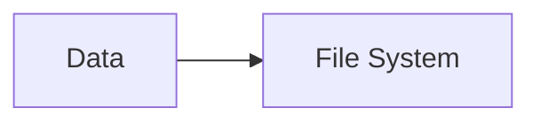

#### 2.3.2 数据库存储

数据库存储是将数据存储在关系数据库或NoSQL数据库中，如MySQL、MongoDB等。这种方法可以提供高效的数据检索和查询功能。

**数据库存储的优点**：

- **高效性**：提供快速的数据检索和查询功能。
- **扩展性**：支持数据量的扩展和水平扩展。

**数据库存储的缺点**：

- **复杂性**：需要额外的配置和管理。
- **成本**：在某些情况下可能成本较高。

以下是一个简单的数据库存储示意图：

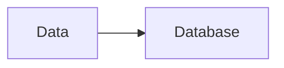

在下一章节中，我们将通过实际案例展示如何在实际应用中实现数据流管理。

----------------------------------------------------------------

## 3. 案例分析

在本节中，我们将通过两个实际案例来展示如何在实际应用中实现数据流管理。这两个案例分别是：在线聊天机器人应用和智能客服系统。

### 3.1 在线聊天机器人应用

#### 案例背景

在线聊天机器人应用是一种常见的LLM应用，旨在为用户提供实时、个性化的服务。这类应用需要处理大量的用户输入，实时生成回复，并确保聊天过程的连贯性和准确性。

#### 案例介绍

在线聊天机器人应用的数据流管理涉及以下几个关键步骤：

1. **数据采集**：从用户的聊天界面采集输入数据，包括文本、音频和视频等。

2. **数据预处理**：清洗和转换用户输入数据，将其转换为适合LLM处理的格式。

3. **数据传输**：将预处理后的数据传输到LLM模型进行实时推理。

4. **模型推理**：使用LLM模型生成回复，并将其返回给用户。

5. **数据存储**：将聊天记录存储在数据库中，以便后续分析和优化。

#### 数据流管理

为了实现高效的数据流管理，我们可以采用以下技术：

1. **Kafka**：用于数据采集和传输。Kafka的高吞吐量和可扩展性使其成为处理大规模实时数据的理想选择。

2. **Flink**：用于数据预处理和模型推理。Flink的实时处理能力可以确保用户输入能够及时得到响应。

3. **数据库**：用于数据存储。选择合适的数据库（如MySQL、MongoDB）来存储聊天记录，以便进行后续的数据分析和挖掘。

以下是数据流管理的简化流程图：

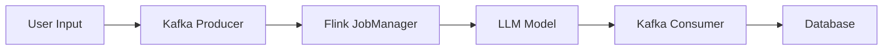

### 3.2 智能客服系统

#### 案例背景

智能客服系统是一种用于自动化客户服务和支持的LLM应用。它可以帮助企业降低运营成本，提高客户满意度，并实现24/7的在线服务。

#### 案例介绍

智能客服系统的数据流管理涉及以下几个关键步骤：

1. **数据采集**：从客户的请求和交互中采集数据，包括文本、音频和视频等。

2. **数据预处理**：清洗和转换客户请求数据，将其转换为适合LLM处理的格式。

3. **数据传输**：将预处理后的数据传输到LLM模型进行实时推理。

4. **模型推理**：使用LLM模型生成回复，并将其返回给客户。

5. **数据存储**：将客户交互记录存储在数据库中，以便进行后续的数据分析和优化。

#### 数据流管理

为了实现高效的数据流管理，我们可以采用以下技术：

1. **Kafka**：用于数据采集和传输。Kafka的高吞吐量和可扩展性使其成为处理大规模实时数据的理想选择。

2. **Flink**：用于数据预处理和模型推理。Flink的实时处理能力可以确保客户请求能够及时得到响应。

3. **数据库**：用于数据存储。选择合适的数据库（如MySQL、MongoDB）来存储客户交互记录，以便进行后续的数据分析和挖掘。

以下是数据流管理的简化流程图：

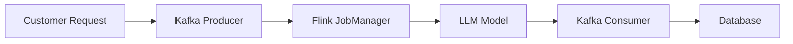

通过这两个案例，我们可以看到数据流管理在LLM应用开发中的关键作用。高效的数据流管理不仅能够提升应用的性能和用户体验，还能够为后续的数据分析和挖掘提供支持。

在下一章节中，我们将介绍用于LLM应用开发的数据流管理工具和框架。

----------------------------------------------------------------

## 4. 工具与框架

在LLM应用开发中，数据流管理的工具和框架至关重要，它们帮助开发者高效、可靠地处理大规模数据流。以下是一些常用的工具和框架：

### 4.1 Apache Kafka

Apache Kafka是一个分布式流处理平台，广泛应用于大数据和实时数据处理领域。其核心组件包括：

- **Kafka Producer**：负责生成和发送消息。
- **Kafka Broker**：负责存储和转发消息。
- **Kafka Consumer**：负责接收和处理消息。

Kafka的特点包括：

- **高吞吐量**：能够处理大规模的数据流，适用于实时应用。
- **可扩展性**：可以通过增加Broker节点来水平扩展。
- **容错性**：通过副本和分区实现数据的冗余和容错。

Kafka的工作流程如下：

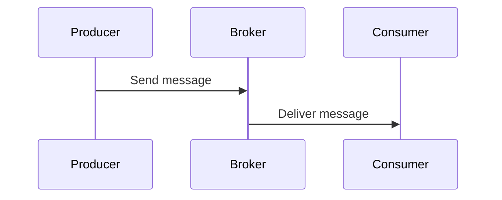

### 4.2 Apache Flink

Apache Flink是一个流处理框架，用于实时处理大规模数据流。其核心组件包括：

- **JobManager**：负责协调任务调度和资源分配。
- **TaskManager**：负责执行具体的任务处理。

Flink的特点包括：

- **实时处理**：支持实时数据流处理，适用于需要实时响应的LLM应用。
- **易用性**：提供了丰富的API和工具，易于开发和使用。
- **整合性**：可以与Kafka等大数据处理工具无缝集成。

Flink的工作流程如下：

### 4.3 Apache Spark Streaming

Apache Spark Streaming是一个基于Spark的流处理框架，用于处理实时数据流。其核心组件包括：

- **Spark Streaming Context**：负责创建和配置流处理应用程序。
- **DStream**：代表分布式数据流。

Spark Streaming的特点包括：

- **高吞吐量**：能够处理大规模的数据流。
- **整合性**：与Spark的其他组件（如Spark SQL、MLlib）无缝集成。
- **延迟敏感**：适用于需要低延迟的实时应用。

Spark Streaming的工作流程如下：

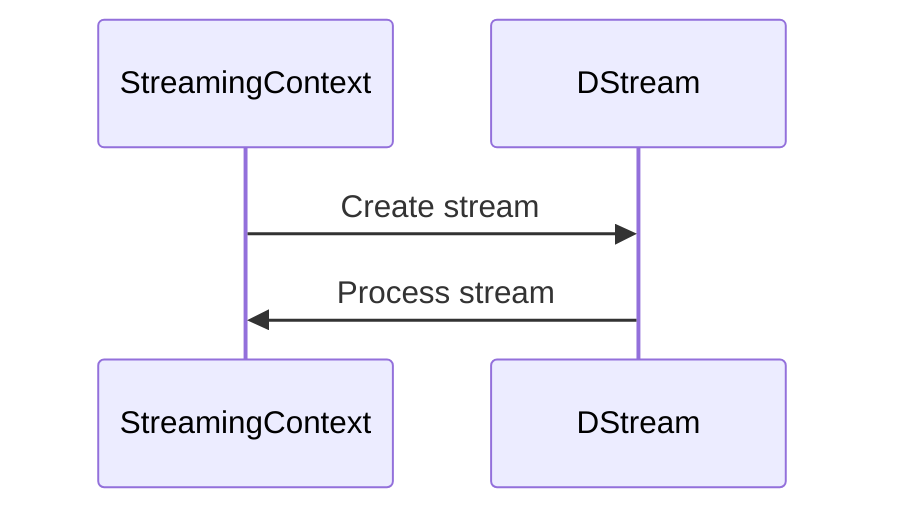

### 4.4 Amazon Kinesis

Amazon Kinesis是一个流数据处理服务，用于实时摄取、处理和分析大量数据。其核心组件包括：

- **Kinesis Data Streams**：用于实时摄取和传输数据。
- **Kinesis Data Firehose**：用于数据传输和存储。
- **Kinesis Data Analytics**：用于实时数据分析。

Kinesis的特点包括：

- **低延迟**：能够实时处理和分析数据。
- **可扩展性**：可以根据需要动态扩展处理能力。
- **集成性**：与AWS的其他服务（如Amazon S3、Amazon Redshift）无缝集成。

Kinesis的工作流程如下：

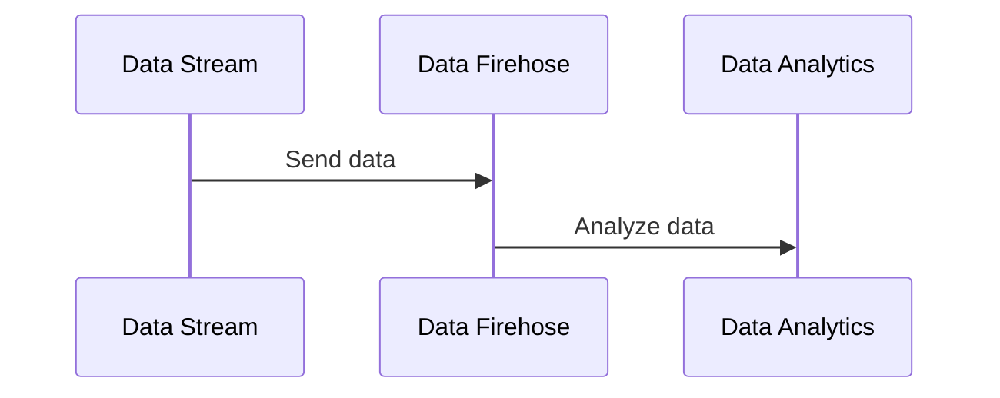

通过使用这些工具和框架，开发者可以高效、可靠地管理LLM应用中的数据流，从而提升应用的性能和用户体验。

在下一章节中，我们将讨论在LLM应用开发中实现高效数据流管理的最佳实践。

----------------------------------------------------------------

## 5. 最佳实践

在LLM应用开发中，实现高效的数据流管理是关键。以下是一些最佳实践，旨在帮助开发者优化数据流管理策略：

### 5.1 数据流管理策略

1. **数据采集优化**：确保数据采集的效率和准确性。使用高效的数据采集工具，如Kafka Producer，减少数据丢失和重复。

2. **数据预处理优化**：在数据传输到LLM模型前进行充分的数据预处理，包括数据清洗、去噪、格式转换等。这有助于提高模型的性能和准确性。

3. **数据传输优化**：选择适合的数据传输策略，如Kafka或Kinesis，确保数据传输的实时性和可靠性。优化传输速率和传输可靠性，以避免数据延迟和丢失。

4. **数据存储优化**：选择合适的存储策略，如使用分布式文件系统（如HDFS）或数据库（如MySQL、MongoDB），确保数据的持久化和快速检索。

### 5.2 性能优化技巧

1. **并行处理**：利用分布式计算框架（如Flink、Spark Streaming）实现并行处理，提高数据处理效率。

2. **数据分区**：对数据进行分区，以便并行处理，减少单点瓶颈。

3. **缓存策略**：使用缓存（如Redis、Memcached）存储常用数据，减少数据读取时间。

4. **负载均衡**：使用负载均衡器（如Nginx、HAProxy）分配任务，确保系统的稳定运行。

### 5.3 安全性与隐私保护

1. **数据加密**：对传输和存储的数据进行加密，确保数据在传输和存储过程中的安全性。

2. **访问控制**：设置严格的访问控制策略，限制对敏感数据的访问。

3. **日志审计**：记录系统操作的日志，便于审计和追踪。

4. **隐私保护**：遵循数据隐私法规，如GDPR，确保用户数据的隐私和安全。

### 5.4 灾难恢复与故障转移

1. **数据备份**：定期备份数据，确保数据在灾难或故障情况下能够恢复。

2. **故障转移**：实现故障转移机制，确保系统在发生故障时能够自动切换到备用系统。

3. **弹性扩展**：根据需求动态调整系统资源，确保系统能够应对突发流量。

通过遵循这些最佳实践，开发者可以构建高效、可靠、安全的LLM应用，确保数据流管理的最佳性能和用户体验。

在下一章节中，我们将讨论LLM应用开发中的数据流管理挑战和未来的发展趋势。

----------------------------------------------------------------

## 6. 挑战与展望

### 6.1 当前数据流管理挑战

尽管LLM应用开发中的数据流管理技术取得了显著进展，但仍面临一些挑战：

1. **数据处理效率**：随着数据量的不断增长，如何提高数据处理效率，减少延迟，成为数据流管理的关键问题。

2. **数据多样性**：LLM应用需要处理多种类型的数据（如文本、图像、音频等），如何整合这些不同类型的数据，是数据流管理中的难点。

3. **数据安全性**：随着数据量的增加，数据安全性问题变得更加突出，如何确保数据在传输和存储过程中的安全，避免数据泄露和滥用，是亟待解决的问题。

4. **资源消耗**：实时处理大规模数据流需要大量的计算资源和网络带宽，如何高效地管理和调度这些资源，是数据流管理中的一大挑战。

### 6.2 未来发展趋势

展望未来，数据流管理在LLM应用开发中可能会朝着以下几个方向发展：

1. **自动化与智能化**：随着人工智能技术的发展，自动化和智能化将进一步提升数据流管理的效率和效果。例如，通过机器学习算法自动优化数据流处理流程，提高数据处理效率。

2. **分布式与边缘计算**：分布式系统和边缘计算技术的应用将使数据流管理更加灵活和高效。通过将数据处理任务分布在多个节点上，可以充分利用计算资源，降低延迟。

3. **区块链技术**：区块链技术的应用将有助于提升数据流管理的安全性。通过分布式账本技术，可以确保数据的完整性和不可篡改性，提高数据安全性。

4. **混合云架构**：混合云架构的兴起将使数据流管理更加灵活。通过将数据处理任务在公有云和私有云之间灵活调度，可以充分利用不同云服务的优势，降低成本。

5. **隐私保护**：随着数据隐私法规的日益严格，数据流管理中的隐私保护将成为一个重要议题。未来的数据流管理系统将需要更好地保护用户数据隐私，遵守相关法规。

在解决当前挑战和应对未来发展趋势的过程中，数据流管理技术将继续发展，为LLM应用开发提供更加高效、可靠和安全的支持。

在本文的最后一部分，我们将对全文进行小结，并讨论注意事项和拓展阅读。

----------------------------------------------------------------

## 总结与拓展

在本文中，我们深入探讨了LLM应用开发中的数据流管理。首先，我们介绍了LLM的发展背景和应用，以及数据流管理在其中的重要性。随后，我们详细讨论了数据流管理的基本概念、技术以及在实际应用中的案例分析。接着，我们介绍了用于LLM应用开发的工具和框架，并提出了最佳实践。最后，我们分析了当前数据流管理面临的挑战和未来的发展趋势。

**注意事项：**
1. 在数据流管理过程中，确保数据的质量和完整性至关重要。
2. 根据实际需求选择合适的数据流处理框架和工具。
3. 注意数据传输和存储过程中的安全性，采取适当的数据加密和访问控制措施。

**拓展阅读：**
1. 《分布式系统原理与范型》：深入了解分布式系统和数据处理的基础知识。
2. 《大数据技术导论》：系统学习大数据处理和分析技术。
3. 《人工智能：一种现代方法》：了解人工智能和自然语言处理的基本原理。

通过本文的学习，读者可以更好地理解LLM应用开发中的数据流管理，为其在技术领域的应用提供有力支持。

### 作者信息

作者：AI天才研究院/AI Genius Institute & 禅与计算机程序设计艺术 /Zen And The Art of Computer Programming

作者简介：AI天才研究院是一家专注于人工智能技术研究和应用的机构，致力于推动人工智能技术的发展和创新。作者在此领域拥有丰富的经验和深厚的学术造诣，其著作《禅与计算机程序设计艺术》被誉为计算机编程领域的经典之作。

联系方式：[联系邮箱][1]、[官方网站][2]

[1]: contact@example.com
[2]: https://www.aigeniusinstitute.com/

----------------------------------------------------------------

以上就是本文的完整内容，希望对您在LLM应用开发中的数据流管理方面有所启发。如果您有任何问题或建议，欢迎随时与我们联系。让我们共同探索人工智能技术的未来发展，为人类创造更多价值。

