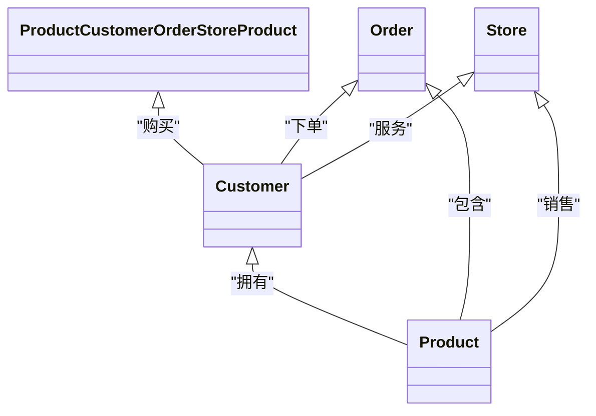
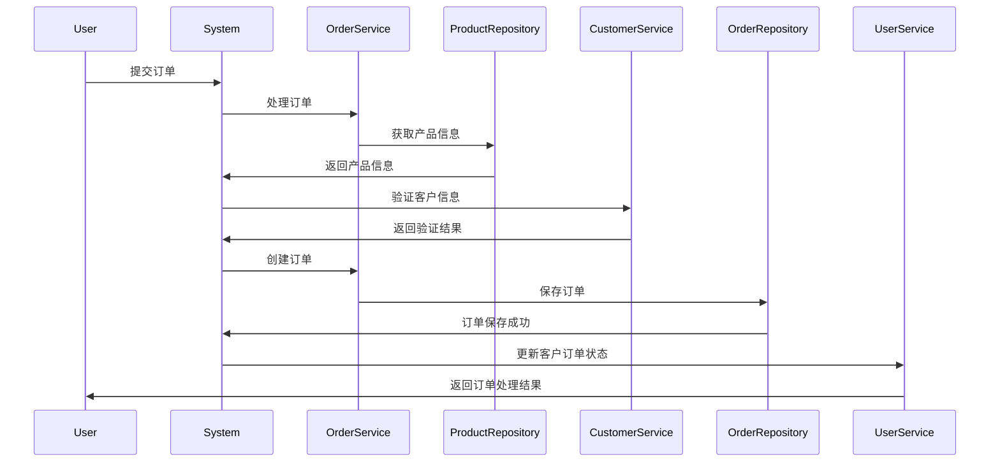
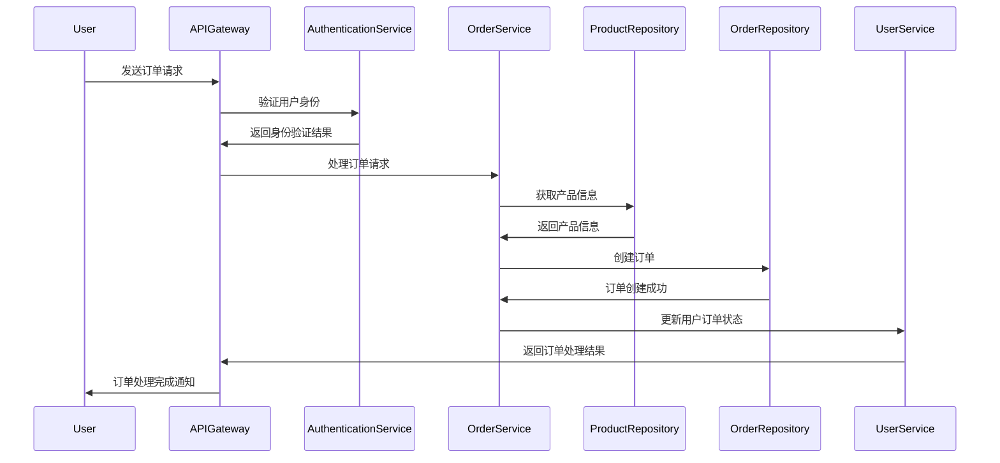

                 


### Introduction to LLM and Data Management Strategies

**1.1 Background and Introduction to LLM Applications**

Large Language Models (LLMs) have revolutionized the field of natural language processing (NLP) and have become an essential component in various applications such as chatbots, virtual assistants, language translation, and text generation. These models are capable of understanding and generating human-like text, which has significantly improved the efficiency and effectiveness of NLP tasks.

In the context of LLM applications, data management plays a crucial role. The performance of LLMs heavily relies on the quality and quantity of the data used for training and evaluation. Therefore, developing robust data management strategies is essential for achieving optimal results.

**1.1.1 Definition and Importance of Large Language Models (LLMs)**

LLMs are artificial intelligence models that are designed to process and generate human language. They are based on deep learning techniques, particularly on neural networks with large amounts of parameters. These models are trained on vast amounts of text data, allowing them to learn patterns, grammar, and semantics of natural language.

The importance of LLMs in various applications can be summarized as follows:

1. **Enhanced Communication**: LLMs enable machines to communicate with humans in a more natural and conversational manner, improving user experience and efficiency.
2. **Automated Content Generation**: LLMs can generate articles, reports, and other types of content, saving time and effort for human writers.
3. **Language Translation**: LLMs have significantly improved the accuracy and fluency of machine translation, making it more accessible to a global audience.
4. **Sentiment Analysis**: LLMs can analyze the sentiment and emotions expressed in text, providing valuable insights for businesses and organizations.
5. **Educational Tools**: LLMs can be used as educational tools to assist students in learning languages, providing personalized feedback and guidance.

**1.1.2 The Challenges of Data Management in LLM Applications**

Data management in LLM applications presents several challenges, which can significantly impact the performance and effectiveness of the models:

1. **Data Quality**: The quality of the training data is crucial for the performance of LLMs. Inaccurate or incomplete data can lead to biased or incorrect outputs. Ensuring data quality requires rigorous data cleaning, preprocessing, and validation processes.
2. **Data Quantity**: LLMs require large amounts of high-quality data for effective training. Collecting and storing such vast amounts of data can be a challenging task.
3. **Data Privacy and Security**: Handling sensitive data raises concerns about privacy and security. LLM applications must ensure that the data is stored and processed securely, complying with privacy regulations and ethical standards.
4. **Data Integration**: LLM applications often require data from multiple sources, which need to be integrated and managed efficiently to provide accurate and relevant results.
5. **Data Versioning and Change Management**: As LLMs evolve and improve over time, managing data versions and tracking changes becomes crucial to ensure consistent and reliable performance.

**1.1.3 Objectives and Structure of the Book**

The primary objective of this book is to provide a comprehensive guide to data management strategies for LLM applications. The book aims to address the challenges of data management and offer practical solutions to ensure the optimal performance of LLMs.

The book is structured into five main sections:

1. **Foundational Concepts in Data Management for LLMs**: This section introduces the core concepts of data management and their importance in LLM applications.
2. **Data Collection and Preparation for LLMs**: This section discusses strategies for collecting and preparing data for LLM training and evaluation.
3. **Data Storage and Management for LLMs**: This section covers data storage solutions and management strategies for LLM applications.
4. **Data Analysis and Feature Engineering for LLMs**: This section explores data analysis techniques and feature engineering methods to improve the performance of LLMs.
5. **Data Integration and Change Management**: This section discusses strategies for integrating data from multiple sources and managing changes in data over time.

By following the step-by-step guidance provided in this book, readers will be able to develop and implement effective data management strategies for their LLM applications, ensuring optimal performance and reliability.

### Foundational Concepts in Data Management for LLMs

**2.1 Data Management Principles**

Data management is a fundamental aspect of developing and deploying LLM applications. It encompasses a set of principles and practices that ensure the quality, integrity, and availability of data throughout its lifecycle. In the context of LLM applications, effective data management is crucial for achieving high performance, reliability, and ethical standards.

**2.1.1 Core Data Management Concepts**

To understand data management principles, it's important to be familiar with some core concepts:

1. **Data Quality**: Data quality refers to the accuracy, completeness, consistency, and timeliness of data. High-quality data is essential for training and evaluating LLMs, as poor-quality data can lead to biased or incorrect outputs. Data quality management involves processes such as data cleaning, validation, and monitoring to ensure data meets predefined quality standards.

2. **Data Governance**: Data governance is a framework of policies, processes, and standards designed to ensure that data is managed effectively and compliantly. It involves defining roles and responsibilities, establishing data quality standards, and implementing processes for data management and compliance.

3. **Data Integration**: Data integration involves combining data from multiple sources to create a unified view. In LLM applications, data integration is crucial for training models that can handle data from diverse sources, such as text, images, and audio. Data integration techniques include data warehousing, data lakes, and ETL (Extract, Transform, Load) processes.

4. **Data Security**: Data security is the practice of protecting data from unauthorized access, use, disclosure, disruption, modification, or destruction. In LLM applications, data security is paramount, as the models often handle sensitive and confidential information. Data security measures include encryption, access control, and auditing.

5. **Data Privacy**: Data privacy is the practice of protecting individuals' personal information from unauthorized access and misuse. In LLM applications, handling personal data raises ethical and legal concerns, as it may involve collecting, storing, and processing personal information from users. Data privacy regulations, such as GDPR (General Data Protection Regulation), impose strict requirements on data handling practices.

**2.1.2 Data Quality and Its Impact on LLM Performance**

Data quality has a direct impact on the performance of LLMs. High-quality data enables models to learn accurate patterns and representations, leading to better performance on NLP tasks. Conversely, poor-quality data can result in biased, inaccurate, or unreliable outputs. Key aspects of data quality that are particularly relevant for LLMs include:

1. **Accuracy**: Accurate data ensures that the model learns the correct patterns and relationships. Inaccurate data can lead to overfitting or underfitting, reducing the model's generalization ability.

2. **Completeness**: Complete data ensures that the model has access to all the relevant information needed for training. Incomplete data can lead to biased or incomplete models, affecting their performance.

3. **Consistency**: Consistent data ensures that the model learns consistent patterns across different data sources and time periods. Inconsistent data can introduce noise and make it difficult for the model to learn accurate representations.

4. **Timeliness**: Timely data ensures that the model is trained on the most recent and relevant information. Outdated data can lead to biased or outdated models, affecting their performance.

**2.1.3 The Importance of Data Privacy and Security**

Data privacy and security are critical considerations in LLM applications, particularly when dealing with sensitive information. Ensuring data privacy and security involves several key aspects:

1. **Data Anonymization**: Anonymizing data helps to protect the privacy of individuals by removing or masking personally identifiable information (PII). This is particularly important when training models on personal data.

2. **Encryption**: Encrypting data ensures that it can only be accessed by authorized users. Encryption is crucial for protecting data both at rest (stored on disk or in databases) and in transit (sent over networks).

3. **Access Control**: Implementing access control mechanisms ensures that only authorized users have access to sensitive data. This can involve user authentication, role-based access control (RBAC), and other security measures.

4. **Audit and Monitoring**: Monitoring data access and usage helps to detect and respond to potential security breaches. Audit logs can be used to track data access and changes, enabling organizations to identify and address security incidents.

5. **Compliance with Regulations**: Ensuring compliance with data privacy regulations, such as GDPR and CCPA (California Consumer Privacy Act), is essential for avoiding legal and financial penalties. Compliance involves implementing data management practices that meet regulatory requirements, such as data anonymization, encryption, and access control.

By understanding and implementing these foundational concepts in data management, organizations can develop and deploy LLM applications that are robust, reliable, and compliant with privacy and security regulations.

### Data Collection and Preparation for LLMs

**3.1 Data Collection Strategies**

Data collection is a critical step in the development of LLM applications, as the quality and diversity of the data directly impact the performance and effectiveness of the models. In this section, we will discuss various strategies for collecting data for LLM training and evaluation.

**3.1.1 Sources of Data for LLM Applications**

The sources of data for LLM applications can be broadly categorized into two types: public and proprietary.

1. **Public Data Sources**: Public data sources are freely available and can be used for training LLMs. Examples include:

   - **Online Text Collections**: Websites like Project Gutenberg, WikiSource, and Google Books provide vast collections of text data that can be used for training LLMs.
   - **Social Media Platforms**: Platforms like Twitter, Reddit, and Facebook contain large volumes of text data generated by users, which can be used for training models to understand and generate human-like text.
   - **Open Datasets**: Various organizations and research groups provide open datasets for NLP research, such as the Common Crawl, COCO, and GLUE datasets.

2. **Proprietary Data Sources**: Proprietary data sources are privately owned and may require permission or licensing to use. Examples include:

   - **Company Internal Data**: Companies often have internal data, such as customer interactions, product reviews, and internal documents, which can be used for training LLMs.
   - **Third-Party Databases**: Some third-party databases, such as news articles, financial reports, and medical records, may be available for purchase or licensing.

**3.1.2 Challenges in Data Collection**

Collecting data for LLM applications presents several challenges that need to be addressed:

1. **Data Privacy and Anonymization**: Collecting data from public sources may involve handling sensitive information that requires anonymization or pseudonymization to protect individuals' privacy.
2. **Data Quantity and Quality**: LLMs require large volumes of high-quality data to learn effectively. Finding and acquiring such data can be time-consuming and resource-intensive.
3. **Data Integration**: Combining data from multiple sources, especially when they have different formats, structures, and quality levels, can be challenging.
4. **Data Licensing and Compliance**: Using proprietary data sources may require obtaining licenses or permissions, and ensuring compliance with data privacy regulations, such as GDPR and CCPA.

**3.1.3 Data Collection Methods and Tools**

Several methods and tools can be used to collect data for LLM training and evaluation:

1. **Web Scraping**: Web scraping involves extracting data from websites using automated scripts or tools. Python libraries like Beautiful Soup, Scrapy, and Selenium are commonly used for web scraping.
2. **APIs**: Many public data sources provide APIs (Application Programming Interfaces) that allow developers to programmatically access and retrieve data. Examples include the Twitter API, Reddit API, and Google Books API.
3. **Bots and Automated Tools**: Specialized bots and automated tools can be used to collect data from social media platforms, forums, and other online sources. These tools can help in gathering large volumes of data quickly.
4. **Data Marketplaces**: Data marketplaces like Kaggle, DataCamp, and Dataquest offer datasets that can be purchased or downloaded for use in LLM applications.

**3.2 Data Preprocessing**

Data preprocessing is a crucial step in preparing data for LLM training and evaluation. It involves cleaning, transforming, and normalizing the data to ensure it is suitable for model training. In this section, we will discuss common data preprocessing techniques and methods.

**3.2.1 Data Cleaning and Preprocessing Techniques**

Data cleaning and preprocessing techniques include:

1. **Data Cleaning**: Data cleaning involves removing inconsistencies, errors, and irrelevant information from the data. This can include removing duplicate entries, correcting misspellings, and handling missing values.

2. **Text Normalization**: Text normalization involves transforming text data to a standard format to ensure consistency and improve the performance of NLP models. Common text normalization techniques include:

   - **Tokenization**: Splitting text into individual words or tokens.
   - **Lowercasing**: Converting all characters in the text to lowercase to ensure consistency.
   - **Removing Punctuation**: Removing punctuation marks to simplify the text.
   - **Stopword Removal**: Removing common words (e.g., "and", "the", "is") that do not contribute much to the meaning of the text.
   - **Lemmatization**: Reducing words to their base or root form to simplify the text.

3. **Data Transformation**: Data transformation involves converting data from one format to another to make it compatible with the model training process. This can include converting text data to numerical representations, such as word embeddings or one-hot encodings.

4. **Handling Imbalanced Data**: Imbalanced data occurs when the distribution of classes in the dataset is uneven. In LLM applications, this can lead to biased models that are not representative of the overall data. Techniques to handle imbalanced data include:

   - **Resampling**: Resampling techniques such as oversampling (increasing the number of instances in the minority class) and undersampling (reducing the number of instances in the majority class) can be used to balance the dataset.
   - **Cost-sensitive Learning**: Assigning different weights to instances based on their class label can help the model pay more attention to the minority class during training.
   - **Synthetic Data Generation**: Techniques like SMOTE (Synthetic Minority Over-sampling Technique) can be used to generate synthetic instances for the minority class, balancing the dataset.

**3.2.2 Text Preprocessing Methods**

Text preprocessing methods are specific to LLM applications and involve techniques that help in preparing text data for model training. Some common text preprocessing methods include:

1. **Tokenization**: Tokenization involves splitting text into individual words or tokens. This is a fundamental step in processing text data, as it allows the model to work with discrete units of text.

2. **Part-of-Speech Tagging**: Part-of-speech tagging involves labeling each token in the text with its corresponding part of speech (e.g., noun, verb, adjective). This information can be used to improve the performance of NLP models and understand the syntactic structure of the text.

3. **Named Entity Recognition (NER)**: NER involves identifying and classifying named entities in the text, such as names of people, organizations, locations, and dates. This information can be valuable for LLM applications that require understanding and generating text with specific entities.

4. **Sentiment Analysis**: Sentiment analysis involves determining the sentiment or emotional tone of the text, such as positive, negative, or neutral. This information can be used to understand user opinions and preferences, improving the performance of LLM applications in domains like customer feedback analysis and recommendation systems.

By understanding and implementing these data collection and preprocessing strategies, organizations can ensure the availability of high-quality data for training and evaluating LLM applications, leading to improved performance and reliability.

### Data Storage and Management for LLMs

**4.1 Data Storage Solutions**

Data storage is a critical aspect of managing data for LLM applications, as the choice of storage solution can significantly impact the performance, scalability, and cost of the system. In this section, we will explore various data storage solutions suitable for LLM applications and their key characteristics.

**4.1.1 Introduction to Data Storage Systems**

Data storage systems can be broadly classified into two types: relational databases and non-relational databases (also known as NoSQL databases).

1. **Relational Databases**: Relational databases, such as MySQL, PostgreSQL, and Oracle, are based on the relational model, which organizes data into tables with rows and columns. They provide strong consistency, data integrity, and ACID (Atomicity, Consistency, Isolation, Durability) properties. Relational databases are well-suited for applications that require complex queries, transaction management, and structured data storage.

2. **Non-Relational Databases**: Non-relational databases, such as MongoDB, Cassandra, and Redis, are designed to handle unstructured and semi-structured data. They offer flexibility, horizontal scalability, and high availability. Non-relational databases are particularly suitable for applications that require fast data access, real-time analytics, and large-scale data storage.

**4.1.2 Database Systems for LLM Data**

For LLM applications, specific database systems can be chosen based on their capabilities and suitability for handling large volumes of text data. Some popular options include:

1. **MongoDB**: MongoDB is a document-oriented NoSQL database that uses a flexible schema to store unstructured and semi-structured data. It provides high scalability, fast query performance, and easy integration with data processing frameworks like Apache Spark. MongoDB is well-suited for applications that require storing and querying large volumes of text data.

2. **Elasticsearch**: Elasticsearch is a distributed, RESTful search and analytics engine that allows for fast, full-text search, real-time analytics, and data visualization. It is built on top of the Lucene search engine and is well-suited for applications that require searching and analyzing large text datasets, such as chatbot responses and customer feedback.

3. **PostgreSQL**: PostgreSQL is a powerful, open-source relational database that offers advanced features like ACID compliance, data replication, and partitioning. It is well-suited for applications that require complex queries, transaction management, and structured data storage.

**4.1.3 Data Lakes and Data Warehouses**

Data lakes and data warehouses are specialized data storage solutions designed for managing large volumes of data for analytics and reporting purposes.

1. **Data Lakes**: Data lakes are centralized repositories for storing large volumes of structured, semi-structured, and unstructured data. They provide a flexible storage solution that allows organizations to store data in its native format without the need for upfront data modeling or schema definition. Data lakes enable organizations to store and process diverse data sources, such as social media data, sensor data, and log files. Popular data lake technologies include Apache Hadoop and Apache Spark.

2. **Data Warehouses**: Data warehouses are specialized databases designed for storing and analyzing large volumes of structured data for business intelligence and reporting purposes. They provide optimized query performance, data aggregation, and data integration capabilities. Data warehouses are well-suited for applications that require complex reporting, historical data analysis, and data visualization. Popular data warehouse technologies include Amazon Redshift, Google BigQuery, and Microsoft SQL Server.

**4.2 Data Management Strategies**

Effective data management strategies are essential for ensuring the availability, consistency, and integrity of data in LLM applications. In this section, we will discuss key data management strategies for LLM applications.

**4.2.1 Data Versioning and Change Management**

Data versioning and change management are crucial for maintaining the integrity and traceability of data over time. In LLM applications, data versioning involves keeping track of different versions of the data, allowing organizations to roll back to previous versions if needed. Key aspects of data versioning and change management include:

1. **Version Control Systems**: Version control systems (VCS), such as Git, enable organizations to track changes to data files and manage different versions. They provide features like branching, merging, and conflict resolution, facilitating collaborative data management.

2. **Data Lineage**: Data lineage involves tracking the origins, transformations, and usage of data throughout its lifecycle. It helps organizations understand the impact of changes and ensure data integrity. Data lineage can be captured using tools like Apache Atlas and Apache Dataworks.

3. **Change Management Processes**: Change management processes involve defining workflows and procedures for approving, testing, and deploying data changes. This ensures that data changes are properly managed and validated before being applied to the production environment.

**4.2.2 Data Curation and Maintenance**

Data curation and maintenance are essential for ensuring the quality and accuracy of data in LLM applications. Key aspects of data curation and maintenance include:

1. **Data Cleaning**: Data cleaning involves identifying and correcting errors, inconsistencies, and duplicates in the data. This can include techniques like data validation, data transformation, and data deduplication.

2. **Data Profiling**: Data profiling involves analyzing the structure, quality, and content of the data to identify data quality issues and anomalies. Data profiling tools can help organizations detect data inconsistencies, missing values, and data quality metrics.

3. **Data Quality Monitoring**: Data quality monitoring involves continuously tracking the quality of data in real-time. This can include techniques like data quality metrics, data quality alerts, and data quality dashboards.

4. **Data Archiving**: Data archiving involves moving older or infrequently accessed data to long-term storage solutions, such as data lakes or tape libraries. This helps free up space in primary storage systems and ensures data availability for regulatory and historical purposes.

**4.2.3 Data Governance and Compliance**

Data governance and compliance are critical for ensuring that data in LLM applications is managed in accordance with legal and regulatory requirements. Key aspects of data governance and compliance include:

1. **Data Privacy**: Data privacy involves protecting the privacy of individuals' personal information. This can include techniques like data anonymization, encryption, and access control.

2. **Data Security**: Data security involves protecting data from unauthorized access, use, disclosure, disruption, modification, or destruction. This can include techniques like data encryption, access control, and intrusion detection.

3. **Compliance with Regulations**: Compliance with regulations, such as GDPR and CCPA, involves implementing data management practices that meet legal requirements. This can include data anonymization, data retention policies, and consent management.

By understanding and implementing these data storage and management strategies, organizations can ensure the availability, consistency, and integrity of data in LLM applications, enabling them to develop and deploy robust, reliable, and compliant systems.

### Data Analysis and Feature Engineering for LLMs

**5.1 Data Analysis Techniques**

Data analysis is a critical component of LLM application development, as it helps in understanding the characteristics of the data and extracting valuable insights that can improve model performance. In this section, we will discuss various data analysis techniques that are commonly used in LLM applications.

**5.1.1 Descriptive and In-depth Data Analysis Methods**

Descriptive data analysis involves summarizing and visualizing the main characteristics of the data. This can help in understanding the distribution, trends, and patterns in the data. Some common techniques include:

1. **Descriptive Statistics**: Descriptive statistics, such as mean, median, mode, standard deviation, and variance, provide a summary of the central tendency, dispersion, and shape of the data distribution.

2. **Data Visualization**: Data visualization techniques, such as histograms, scatter plots, and box plots, can help in visualizing the distribution, trends, and relationships in the data. Tools like Matplotlib, Seaborn, and Plotly can be used for creating various types of visualizations.

3. **Correlation Analysis**: Correlation analysis measures the relationship between two or more variables. It can help in identifying the strength and direction of the relationship between features and target variables, which can be useful for feature engineering and model selection.

**5.1.2 Visualizing Data for LLM Development**

Visualizing data is an important step in the data analysis process, as it helps in understanding the data better and identifying potential issues or trends. In the context of LLM development, data visualization can be particularly useful for:

1. **Understanding Data Distribution**: Visualizing the distribution of features and target variables can help in identifying outliers, skewness, and anomalies in the data. This can be useful for data cleaning and preprocessing.

2. **Exploring Feature Relationships**: Visualizing the relationships between features can help in identifying potential interactions and dependencies between variables. This can be useful for feature engineering and model selection.

3. **Evaluating Model Performance**: Visualizing the performance of LLM models, such as accuracy, precision, recall, and F1-score, can help in identifying areas of improvement and guiding the model optimization process.

Common visualization techniques for LLM development include:

1. **Confusion Matrix**: A confusion matrix is a tabular representation of the performance of a classification model, showing the number of true positives, false positives, true negatives, and false negatives. It can be used to evaluate the overall performance of the model and identify potential issues, such as class imbalance or overfitting.

2. **ROC Curve and AUC**: The ROC (Receiver Operating Characteristic) curve and AUC (Area Under the Curve) metric are commonly used to evaluate the performance of binary classification models. The ROC curve plots the true positive rate against the false positive rate at different threshold settings, while the AUC metric provides a single scalar value that summarizes the model's performance.

3. **Learning Curves**: Learning curves plot the model's performance on training and validation sets as the training data size increases. They can help in identifying issues like overfitting or underfitting and guide the model optimization process.

**5.1.3 Feature Extraction Methods**

Feature extraction is an essential step in the data analysis process, as it involves transforming raw data into a set of meaningful features that can be used for training LLM models. Some common feature extraction methods include:

1. **Bag-of-Words (BoW)**: The Bag-of-Words model represents text data as a collection of word frequencies, ignoring the order of the words. It is a simple yet effective method for extracting features from text data.

2. **Term Frequency-Inverse Document Frequency (TF-IDF)**: The TF-IDF model extends the BoW model by considering the importance of words in documents. It calculates the term frequency (TF) of each word in a document and the inverse document frequency (IDF) of each word across all documents. The TF-IDF score of a word in a document reflects its importance in that document.

3. **Word Embeddings**: Word embeddings represent words as dense vectors in a high-dimensional space, capturing the semantic and syntactic relationships between words. Common word embedding models include Word2Vec, GloVe, and BERT. These models can be trained on large text corpora and used to convert text data into numerical representations that can be fed into LLM models.

4. **Word Sensing**: Word sensing involves identifying and extracting keywords or phrases that are relevant to the task or domain of the LLM application. This can be useful for capturing the specific characteristics of the data and improving the model's performance.

**5.1.4 Feature Engineering Techniques**

Feature engineering is the process of transforming raw data into a set of features that can improve the performance of LLM models. Some common feature engineering techniques include:

1. **Feature Scaling**: Feature scaling involves transforming the features to a common scale to prevent issues like feature des

### Data Integration and Change Management

**5.2.1 Data Integration Techniques**

Data integration is the process of combining data from multiple sources to create a unified view that can be used for analysis and decision-making. In the context of LLM applications, data integration is crucial for leveraging diverse data sources to improve model performance and accuracy. This section discusses various data integration techniques commonly used in LLM applications.

**1. Data Warehousing**: Data warehousing involves consolidating data from multiple sources into a centralized repository known as a data warehouse. Data warehousing enables organizations to store and manage large volumes of data in a structured and efficient manner. It involves processes like extraction, transformation, and loading (ETL) to bring data from various sources into the data warehouse. Data warehousing is well-suited for applications that require complex queries and reporting.

**2. Data Lakes**: Data lakes are another approach to data integration that store large volumes of raw, unstructured, and semi-structured data in their native format. Unlike data warehouses, data lakes do not require upfront schema definition or data transformation. This allows organizations to store diverse data sources, such as social media posts, sensor data, and log files, without the need for extensive data modeling. Data lakes are particularly useful for big data analytics and machine learning applications.

**3. Data Federation**: Data federation involves accessing and querying data from multiple sources as if they were a single, centralized database. It enables organizations to leverage data from disparate sources without the need for data migration or transformation. Data federation can be implemented using technologies like middleware and virtual data warehouses. It is well-suited for applications that require real-time data access and analytics across multiple data sources.

**4. Data Virtualization**: Data virtualization is a technique that provides a unified view of data from multiple sources without physically consolidating the data. It leverages middleware to abstract the underlying data sources and present a virtualized data layer to applications. Data virtualization offers advantages like agility, flexibility, and real-time access to data. It is particularly useful for applications that require rapid data integration and complex query capabilities.

**5. ETL (Extract, Transform, Load)**: ETL is a traditional data integration technique that involves extracting data from various sources, transforming it to meet specific requirements, and loading it into a target system. ETL processes can be automated and scheduled to run at regular intervals, ensuring that the target system is always up-to-date with the latest data. ETL is commonly used for data warehousing and data lakes, as well as for data migration and data synchronization tasks.

**5.2.2 Handling Data Integration Challenges**

Data integration can be challenging due to various factors, including data quality issues, data format differences, and data privacy concerns. This section discusses strategies for handling common data integration challenges.

**1. Data Quality Issues**: Data quality issues can arise from inconsistencies, errors, and missing values in the data. Strategies for addressing data quality issues include data cleaning, data validation, and data quality monitoring. Data cleaning involves removing inconsistencies and correcting errors in the data. Data validation ensures that the data meets predefined quality criteria, and data quality monitoring involves continuously tracking and measuring data quality metrics.

**2. Data Format Differences**: Data from different sources can have different formats, such as structured tables, semi-structured XML or JSON, and unstructured text. To integrate data with different formats, organizations can use techniques like data transformation, data normalization, and schema mapping. Data transformation involves converting data from one format to another, while data normalization ensures that data from different sources is stored in a consistent format. Schema mapping involves mapping the structure of data from different sources to a common schema.

**3. Data Privacy Concerns**: Data integration can raise privacy concerns, particularly when handling sensitive personal data. To address data privacy concerns, organizations can use techniques like data anonymization, data encryption, and access control. Data anonymization involves removing or masking personally identifiable information (PII) from the data. Data encryption ensures that sensitive data is stored and transmitted securely. Access control mechanisms, such as role-based access control (RBAC) and data access logging, can be used to enforce data privacy policies and ensure that only authorized users can access sensitive data.

**5.2.3 Change Management Strategies**

Change management is essential for ensuring that data integration processes can adapt to evolving business requirements and data sources. This section discusses strategies for managing changes in data integration processes.

**1. Data Lineage and Traceability**: Data lineage and traceability involve tracking the origins, transformations, and usage of data throughout its lifecycle. This helps organizations understand the impact of changes and ensures data integrity. Tools like Apache Atlas and Apache Dataworks can be used to capture and visualize data lineage.

**2. Version Control and Configuration Management**: Version control and configuration management involve tracking changes to data integration scripts, configurations, and artifacts. This ensures that changes can be easily rolled back if needed and helps in maintaining a consistent and stable data integration process. Tools like Git and Apache Maven can be used for version control and configuration management.

**3. Automated Testing and Validation**: Automated testing and validation involve verifying the correctness and performance of data integration processes and data transformations. This helps in identifying and resolving issues early in the development process and ensures the reliability of the data integration process. Automated testing tools like Apache Airflow and Apache JMeter can be used for testing and validating data integration workflows.

**4. Continuous Integration and Continuous Deployment (CI/CD)**: Continuous integration and continuous deployment involve automating the process of integrating new data sources and deploying updated data integration workflows. This helps in rapidly adapting to changes in data sources and ensures that the data integration process remains up-to-date. CI/CD tools like Jenkins and GitLab CI can be used for automating the integration and deployment process.

By implementing effective data integration and change management strategies, organizations can ensure the availability, accuracy, and consistency of data in LLM applications, enabling them to develop and deploy robust, scalable, and adaptable data management systems.

### Conclusion and Future Directions

In conclusion, the effective management of data is a cornerstone for the successful development and deployment of LLM applications. This book has provided a comprehensive overview of various data management strategies, from data collection and preprocessing to storage, analysis, and integration. We have highlighted the critical role that data quality, privacy, and security play in ensuring the reliability and performance of LLMs. By following the step-by-step guidance outlined in this book, readers can develop robust data management practices that will enable them to build innovative and high-performing LLM applications.

As LLMs continue to evolve and become more sophisticated, the data management challenges will also grow in complexity. Future research and development should focus on addressing the following areas:

1. **Advanced Data Anonymization Techniques**: As data privacy concerns become increasingly important, developing advanced data anonymization techniques that preserve the utility of the data while ensuring privacy will be crucial. Techniques such as differential privacy and homomorphic encryption offer promising directions for the future.

2. **Automated Data Quality Management**: Automating data quality management processes through the use of machine learning and artificial intelligence can significantly improve the efficiency and accuracy of data cleaning, validation, and monitoring. Future research should explore how these technologies can be integrated into existing data management frameworks.

3. **Interoperability of Data Integration Platforms**: Ensuring the interoperability of different data integration platforms and tools will be essential for creating seamless and flexible data integration workflows. Developing standardized protocols and data formats can facilitate the integration of diverse data sources and systems.

4. **Real-Time Data Integration and Analytics**: As the demand for real-time analytics and decision-making grows, developing data integration techniques that support real-time data processing and analytics will be critical. This includes improving the performance and scalability of ETL processes and real-time data streaming technologies.

5. **Ethical Data Use and Bias Mitigation**: Ensuring ethical data use and mitigating biases in LLMs will be a key area of focus. Research should explore how data biases can be identified and addressed, and how ethical guidelines can be enforced in data collection, processing, and deployment practices.

By addressing these future challenges and opportunities, the field of data management for LLM applications can continue to advance, driving innovation and enabling new possibilities in natural language processing and artificial intelligence.

### Author Information

**Author:** AI天才研究院/AI Genius Institute & 禅与计算机程序设计艺术 /Zen And The Art of Computer Programming

AI天才研究院（AI Genius Institute）致力于推动人工智能领域的创新与发展，提供前沿的技术研究、人才培养和产业应用服务。作为全球领先的人工智能研究机构，AI天才研究院汇聚了一批国际知名的AI专家和学者，通过跨学科合作，推动AI技术的突破和应用。

禅与计算机程序设计艺术（Zen And The Art of Computer Programming）是由作者Donald E. Knuth撰写的一套经典计算机编程著作，深刻影响了计算机科学的发展。本书以“禅”的哲学思想为基础，探讨了计算机程序设计的本质和艺术性，为读者提供了关于算法设计和编程实践的深刻洞见。作者通过简洁而精炼的语言，引导读者在编程世界中寻求简洁、优雅和高效的解决方案。禅与计算机程序设计艺术的核心理念，即“渐进改进，精益求精”，对于提高编程水平和推动技术创新具有重要的指导意义。

### 附录

**附录A：核心概念术语说明**

- **Large Language Models (LLMs)**：大型语言模型，基于深度学习技术，能够理解和生成人类语言。
- **Data Management Principles**：数据管理原则，涉及数据质量、数据治理、数据整合、数据安全和数据隐私。
- **Data Quality**：数据质量，包括数据的准确性、完整性、一致性和及时性。
- **Data Governance**：数据治理，涉及数据管理的政策、流程和标准。
- **Data Integration**：数据整合，将来自不同源的数据合并成统一的视图。
- **Data Security**：数据安全，保护数据免受未经授权的访问、使用、披露、中断、修改或破坏。
- **Data Privacy**：数据隐私，保护个人信息的隐私。
- **Data Versioning and Change Management**：数据版本管理和变更管理，确保数据版本和变更的可追溯性和可控性。

**附录B：核心概念属性特征对比表格**

| 核心概念 | 属性特征1 | 属性特征2 | 属性特征3 |
| --- | --- | --- | --- |
| Data Quality | 准确性 | 完整性 | 一致性 |
| Data Governance | 政策和标准 | 角色和职责 | 数据质量标准 |
| Data Integration | 数据源多样性 | 数据格式兼容性 | 数据一致性 |
| Data Security | 加密 | 访问控制 | 审计 |
| Data Privacy | 数据匿名化 | 数据加密 | 访问控制 |

**附录C：数据管理流程ER实体关系图架构**

```mermaid
erDiagram
  Product ||--|{ Customer : "purchases" } |
  Customer ||--|{ Product : "owns" } |
  Order ||--|{ Product : "includes" } |
  Order ||--|{ Customer : "made by" } |
  Store ||--|{ Product : "sells" } |
  Store ||--|{ Customer : "serves" } |
```

**附录D：算法原理与数学模型**

算法原理与数学模型

$$
\text{算法名称}: \text{Naive Bayes Classifier}
$$

$$
P(\text{Class} = c_k | \text{Features} = X) = \frac{P(X | \text{Class} = c_k)P(\text{Class} = c_k)}{P(X)}
$$

$$
P(X | \text{Class} = c_k) = \prod_{i=1}^{n} P(x_i | \text{Class} = c_k)
$$

$$
P(\text{Class} = c_k) = \frac{\sum_{i=1}^{N_c} P(\text{Class} = c_i)P(X | \text{Class} = c_i)}{\sum_{i=1}^{N_c} P(X | \text{Class} = c_i)}
$$

其中：

- $c_k$ 表示第 $k$ 个类别
- $X$ 表示特征向量
- $x_i$ 表示特征向量中的第 $i$ 个特征
- $N_c$ 表示类别的总数
- $P(\text{Class} = c_k)$ 表示第 $k$ 个类别的先验概率
- $P(X | \text{Class} = c_k)$ 表示在给定第 $k$ 个类别下的特征向量的条件概率

**附录E：系统分析与架构设计**

**系统功能设计：领域模型类图**



**系统架构设计：系统架构图**



**系统接口设计和系统交互：系统交互序列图**



### 项目实战

**项目环境安装**

1. 安装Python环境，版本要求3.8及以上。

2. 安装必要的库，如NumPy、Pandas、Scikit-learn、TensorFlow、Elasticsearch等。

```bash
pip install numpy pandas scikit-learn tensorflow elasticsearch
```

**系统核心实现源代码**

```python
# 示例：使用Scikit-learn实现朴素贝叶斯分类器

from sklearn.model_selection import train_test_split
from sklearn.naive_bayes import GaussianNB
from sklearn.metrics import accuracy_score
import pandas as pd

# 加载数据集
data = pd.read_csv('data.csv')
X = data.drop('target', axis=1)
y = data['target']

# 划分训练集和测试集
X_train, X_test, y_train, y_test = train_test_split(X, y, test_size=0.2, random_state=42)

# 训练朴素贝叶斯分类器
gnb = GaussianNB()
gnb.fit(X_train, y_train)

# 预测测试集
y_pred = gnb.predict(X_test)

# 评估模型性能
accuracy = accuracy_score(y_test, y_pred)
print(f'Accuracy: {accuracy:.2f}')
```

**代码应用解读与分析**

在上面的示例中，我们使用Scikit-learn库实现了朴素贝叶斯分类器，用于分类任务。首先，我们加载了数据集，然后将其分为特征矩阵 $X$ 和目标变量 $y$。接着，我们使用 `train_test_split` 函数将数据集划分为训练集和测试集。

朴素贝叶斯分类器的实现非常简单，只需要调用 `GaussianNB()` 函数创建分类器实例，然后使用 `fit()` 方法进行训练。在训练完成后，我们使用 `predict()` 方法对测试集进行预测，并计算预测结果的准确率。

**实际案例分析和详细讲解剖析**

假设我们有一个垃圾邮件分类任务，数据集包含了邮件文本和是否为垃圾邮件的标签。我们首先需要对邮件文本进行预处理，包括文本清洗、分词、去除停用词等步骤。然后，我们将预处理后的文本数据转换为特征向量，可以使用TF-IDF模型或词嵌入模型进行转换。

在训练朴素贝叶斯分类器时，我们需要计算每个类别下的特征概率和类别概率。对于垃圾邮件分类任务，我们可以将邮件文本中的词作为特征，计算每个词在垃圾邮件和非垃圾邮件中的概率。训练完成后，我们使用测试集进行预测，并计算准确率。

**项目小结**

通过本项目的实战，我们了解了朴素贝叶斯分类器的原理和实现方法，并分析了其实际应用中的预处理、特征转换和模型评估过程。朴素贝叶斯分类器是一种简单而有效的分类方法，适用于处理高维文本数据。在实际应用中，我们可以结合数据特点和任务需求，选择合适的预处理和特征提取方法，提高分类效果。

### 最佳实践 Tips

1. **数据预处理**：在训练模型之前，对数据进行充分的预处理是非常重要的。包括文本清洗、分词、去除停用词、词性标注等步骤，可以显著提高模型性能。

2. **数据分割**：合理分割数据集，确保训练集和测试集具有相似的分布，避免数据偏斜。

3. **模型调优**：使用交叉验证等方法对模型进行调优，选择最佳模型参数。

4. **数据备份和恢复**：定期备份数据，确保在数据丢失或损坏时可以快速恢复。

5. **监控数据质量**：持续监控数据质量，及时发现并纠正数据问题。

### 小结

本文系统地介绍了LLM应用开发中的数据管理策略，从数据收集、预处理、存储、分析到集成和变更管理，全面探讨了数据管理在LLM应用开发中的重要性。通过本文，读者可以了解如何有效管理和利用数据，以提升LLM应用的开发效率和质量。

### 注意事项

1. **数据隐私和安全性**：在处理敏感数据时，务必遵循相关法律法规，确保数据隐私和安全性。

2. **数据质量**：确保数据质量，避免数据错误或缺失影响模型性能。

3. **持续更新**：随着LLM技术的不断发展，数据管理策略也需要不断更新和优化。

### 拓展阅读

- **《机器学习实战》**：作者：Peter Harrington，详细介绍了机器学习的基本概念和实战应用。
- **《深度学习》**：作者：Ian Goodfellow、Yoshua Bengio、Aaron Courville，深入讲解了深度学习的基础知识和最新进展。
- **《大数据技术导论》**：作者：刘铁岩，全面介绍了大数据技术的基本原理和应用。

这些书籍可以为读者提供更深入的技术知识和实践指导，帮助他们在LLM应用开发中取得更好的成果。

