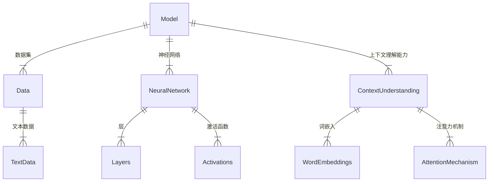
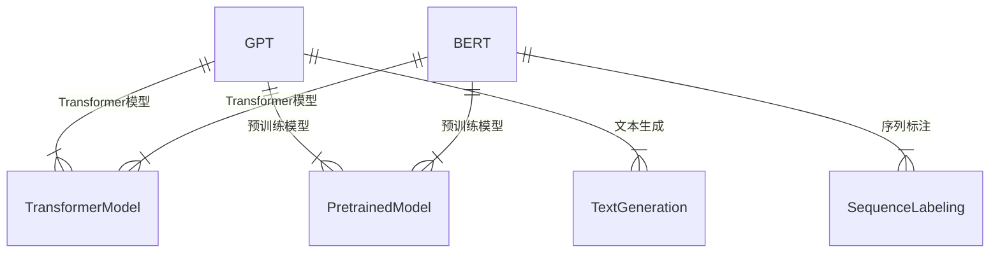
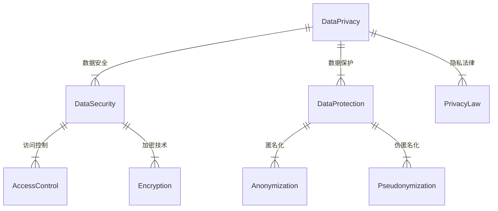
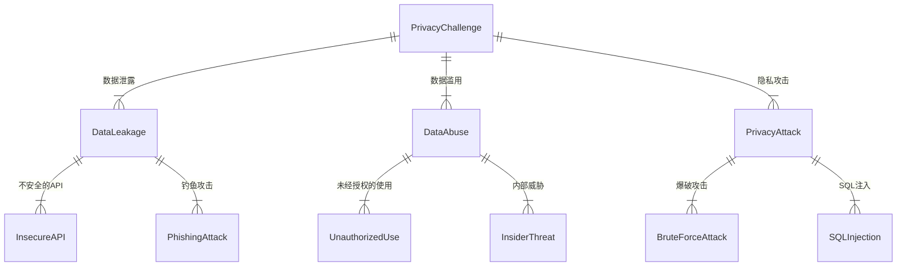
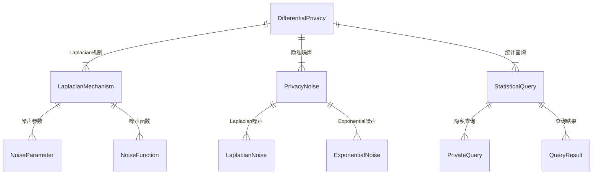
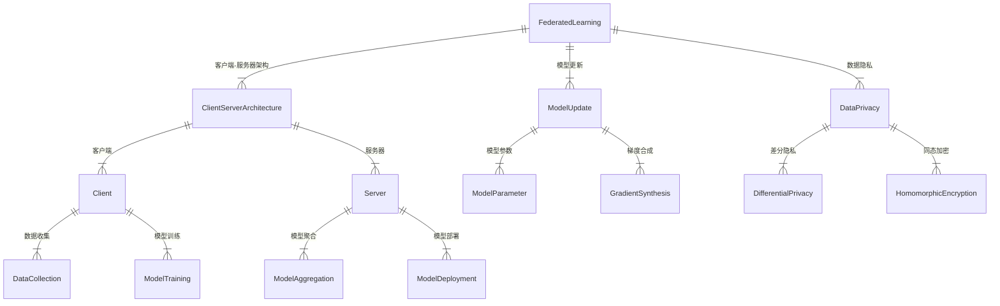

                 

### 设计大纲过程

**理解书名**

首先，我们需要深入理解书名《LLM应用开发中的数据隐私保护》。书名中的核心概念包括：

- **LLM**：大型语言模型，是近年来人工智能领域的热点，特别是在自然语言处理（NLP）中具有重要作用。
- **应用开发**：指的是将LLM应用于实际场景，如聊天机器人、文本生成、机器翻译等。
- **数据隐私保护**：随着数据隐私问题的日益突出，如何在应用开发过程中保护用户数据隐私变得尤为重要。

**目标受众**

本文的目标受众主要包括以下几类：

- 开发者：对LLM应用开发有兴趣，希望了解如何在开发过程中保护数据隐私。
- 数据科学家：对数据隐私保护有深入研究，希望了解如何将技术应用于LLM开发。
- 对数据隐私保护感兴趣的读者：关注数据隐私问题的方方面面，希望了解LLM领域的具体实践。

**确定大纲框架**

基于上述核心概念和目标受众，我们可以将大纲分为三个主要部分：

1. **大型语言模型（LLM）基础**：介绍LLM的基本概念、原理和应用场景。
2. **数据隐私保护的重要性及其挑战**：探讨数据隐私保护的概念、法律框架和LLM应用中的具体挑战。
3. **具体技术解决方案和实际案例**：提供差分隐私、联邦学习等技术的详细解释和实际案例分享。

**细化章节内容**

在细化章节内容时，我们需要确保每个部分都包含以下核心内容：

- **背景介绍**：解释核心概念术语、问题背景、问题描述、问题解决方法、边界与外延。
- **核心概念与联系**：给出核心概念原理、概念属性特征对比表格和ER实体关系图架构的Mermaid流程图。
- **算法原理讲解**：使用Mermaid绘制算法流程图，并使用Python源代码详细阐述，解释数学模型和公式，举例说明。
- **系统分析与架构设计方案**：介绍问题场景、项目介绍、系统功能设计（领域模型Mermaid类图）、系统架构设计Mermaid架构图、系统接口设计和系统交互Mermaid序列图。
- **项目实战**：包括环境安装、系统核心实现源代码，代码应用解读与分析，实际案例分析和详细讲解剖析，项目小结。
- **最佳实践 tips、小结、注意事项、拓展阅读**：总结文章要点，提供实用的建议和进一步阅读的资源。

**编写大纲**

使用Markdown格式编写大纲，确保结构清晰、逻辑性强。以下是文章的大纲结构：

```markdown
----------------------------------------------------------------
# 第一部分: 大型语言模型（LLM）基础

## 第1章: 什么是大型语言模型

### 1.1 大型语言模型概述

#### 1.1.1 语言模型的发展历史

#### 1.1.2 大型语言模型的工作原理

#### 1.1.3 大型语言模型的应用领域

### 1.2 主流大型语言模型介绍

#### 1.2.1 GPT系列模型

#### 1.2.2 BERT及其变体

#### 1.2.3 其他知名大型语言模型

## 第2章: 数据隐私保护概述

### 2.1 数据隐私保护的概念

#### 2.1.1 数据隐私的定义

#### 2.1.2 数据隐私的重要性

#### 2.1.3 数据隐私的法律框架

### 2.2 数据隐私保护的挑战

#### 2.2.1 数据隐私保护面临的难题

#### 2.2.2 大型语言模型应用中的隐私问题

#### 2.2.3 隐私保护的必要性

## 第3章: 数据隐私保护技术

### 3.1 差分隐私技术

#### 3.1.1 差分隐私的概念

#### 3.1.2 差分隐私的实现原理

#### 3.1.3 差分隐私的应用实例

### 3.2 联邦学习技术

#### 3.2.1 联邦学习的概念

#### 3.2.2 联邦学习的优势与挑战

#### 3.2.3 联邦学习的应用实例

## 第4章: LLM应用开发中的数据隐私保护实践

### 4.1 实践一：使用差分隐私进行文本分类

#### 4.1.1 实践背景

#### 4.1.2 差分隐私文本分类的实现

#### 4.1.3 实践结果与分析

### 4.2 实践二：使用联邦学习进行语言模型训练

#### 4.2.1 实践背景

#### 4.2.2 联邦学习语言模型训练的实现

#### 4.2.3 实践结果与分析

## 第5章: 案例研究

### 5.1 案例一：某公司的大型语言模型开发与数据隐私保护

#### 5.1.1 案例背景

#### 5.1.2 案例解决方案

#### 5.1.3 案例效果与经验总结

### 5.2 案例二：某学术机构的联邦学习项目实践

#### 5.2.1 案例背景

#### 5.2.2 案例解决方案

#### 5.2.3 案例效果与经验总结

## 第6章: 数据隐私保护最佳实践与展望

### 6.1 最佳实践

#### 6.1.1 开发过程中的数据隐私保护措施

#### 6.1.2 隐私保护技术的选择与优化

#### 6.1.3 隐私保护策略的制定与执行

### 6.2 未来展望

#### 6.2.1 数据隐私保护技术的发展趋势

#### 6.2.2 数据隐私保护在LLM应用开发中的挑战与机遇

#### 6.2.3 未来数据隐私保护策略的优化方向

----------------------------------------------------------------
```

该大纲结构旨在确保内容完整性，同时保持简明易懂，便于读者理解和应用。

### 第一部分：大型语言模型（LLM）基础

#### 第1章：什么是大型语言模型

##### 1.1 大型语言模型概述

**概念术语说明**

- **大型语言模型（Large Language Model，LLM）**：一种能够理解和生成自然语言的深度学习模型，通常基于神经网络架构，通过大量文本数据训练得到。
- **自然语言处理（Natural Language Processing，NLP）**：人工智能领域的一个分支，专注于使计算机能够理解、解释和生成人类语言。

**问题背景**

随着互联网的快速发展，数据规模和多样性不断增加，自然语言处理成为人工智能研究的一个重要方向。LLM在NLP中的应用日益广泛，如自动问答系统、机器翻译、文本摘要、情感分析等。

**问题描述**

如何理解LLM的基本原理，以及它在不同应用场景中的作用？

**问题解决**

1. **语言模型的发展历史**：从简单的统计模型（如N-gram模型）到现代的深度学习模型（如GPT、BERT），语言模型经历了怎样的演变？
2. **大型语言模型的工作原理**：神经网络、深度学习、上下文理解等核心概念如何实现？
3. **大型语言模型的应用领域**：在各个实际场景中，LLM如何发挥作用？

**边界与外延**

- **边界**：LLM的适用范围，如文本生成、机器翻译等。
- **外延**：LLM在其他领域的潜在应用，如代码生成、语音识别等。

**概念结构与核心要素组成**

- **核心要素**：神经网络架构、训练数据集、上下文理解能力。
- **概念结构**：基于数据驱动的方式，从训练数据中学习语言模式，生成文本。

**ER实体关系图架构**



##### 1.2 主流大型语言模型介绍

**概念术语说明**

- **GPT（Generative Pre-trained Transformer）**：一种基于Transformer架构的预训练语言模型，由OpenAI开发。
- **BERT（Bidirectional Encoder Representations from Transformers）**：一种双向Transformer架构的预训练语言模型，由Google开发。

**问题背景**

GPT和BERT是目前最流行的LLM，广泛应用于各种NLP任务。它们在模型架构、训练方法、应用场景等方面各有特点。

**问题描述**

如何深入理解GPT和BERT的工作原理及其在不同应用场景中的优势？

**问题解决**

1. **GPT系列模型**：介绍GPT、GPT-2、GPT-3等模型的发展历程、架构特点和应用案例。
2. **BERT及其变体**：介绍BERT、RoBERTa、ALBERT等模型的原理、训练方法和实际应用。

**边界与外延**

- **边界**：GPT和BERT的具体应用范围，如文本生成、机器翻译、情感分析等。
- **外延**：其他知名的LLM，如T5、CodeGen、Ernie等。

**核心概念与联系**

- **GPT**：基于自回归的方式生成文本，具有强大的文本生成能力。
- **BERT**：通过双向注意力机制理解上下文，适用于各种序列标注任务。

**ER实体关系图架构**



#### 第2章：数据隐私保护概述

##### 2.1 数据隐私保护的概念

**概念术语说明**

- **数据隐私**：指个人或组织的敏感信息不被未经授权的第三方访问或泄露。
- **隐私保护**：通过各种技术手段，确保数据在传输、存储和处理过程中的安全性。

**问题背景**

随着大数据和人工智能技术的发展，数据隐私问题日益突出。特别是在LLM应用开发中，如何保护用户数据隐私成为关键挑战。

**问题描述**

什么是数据隐私保护？它在LLM应用开发中为什么重要？

**问题解决**

1. **数据隐私的定义**：解释数据隐私的概念和特点。
2. **数据隐私的重要性**：阐述数据隐私保护对用户、企业和社会的意义。
3. **数据隐私的法律框架**：介绍全球范围内数据隐私保护的相关法律和法规。

**边界与外延**

- **边界**：数据隐私的具体范围，如个人信息、商业秘密等。
- **外延**：数据隐私保护技术的发展趋势和未来挑战。

**核心概念与联系**

- **概念**：数据隐私、隐私保护、数据安全。
- **联系**：数据隐私保护是数据安全和隐私的重要保障。

**ER实体关系图架构**



##### 2.2 数据隐私保护的挑战

**概念术语说明**

- **隐私泄露**：指敏感数据被未经授权的第三方访问或泄露。
- **数据滥用**：指对收集的数据进行不当使用，如用于未经授权的商业目的。

**问题背景**

在LLM应用开发过程中，数据隐私保护面临诸多挑战。如何有效应对这些挑战是确保数据安全的关键。

**问题描述**

LLM应用开发中的数据隐私保护面临哪些具体挑战？

**问题解决**

1. **数据隐私保护面临的难题**：分析在LLM应用中保护数据隐私的难点，如数据量巨大、隐私攻击手段多样等。
2. **大型语言模型应用中的隐私问题**：探讨LLM在应用过程中可能引发的数据隐私问题。
3. **隐私保护的必要性**：阐述为什么数据隐私保护在LLM应用开发中不可或缺。

**边界与外延**

- **边界**：数据隐私保护的具体应用场景，如聊天机器人、文本生成等。
- **外延**：隐私保护技术在其他领域的应用，如医疗健康、金融等。

**核心概念与联系**

- **核心概念**：隐私泄露、数据滥用、隐私攻击。
- **联系**：隐私保护技术、安全策略、法律法规。

**ER实体关系图架构**



### 第二部分：数据隐私保护的重要性及其挑战

#### 第3章：数据隐私保护技术

##### 3.1 差分隐私技术

**概念术语说明**

- **差分隐私（Differential Privacy）**：一种用于保护数据隐私的数学理论，通过添加噪声来确保单个数据点的隐私。
- **Laplacian机制**：一种常见的差分隐私机制，通过添加Laplacian噪声来实现数据隐私保护。

**问题背景**

差分隐私是一种有效的数据隐私保护技术，广泛应用于各种应用场景。在LLM应用开发中，如何利用差分隐私技术保护用户数据隐私是一个重要课题。

**问题描述**

如何理解差分隐私技术及其在LLM应用开发中的具体应用？

**问题解决**

1. **差分隐私的概念**：介绍差分隐私的基本原理和数学基础。
2. **差分隐私的实现原理**：解释Laplacian机制和如何在实际应用中实现差分隐私。
3. **差分隐私的应用实例**：探讨差分隐私在LLM应用开发中的具体应用案例。

**边界与外延**

- **边界**：差分隐私技术的适用范围，如统计查询、机器学习等。
- **外延**：其他差分隐私机制，如拉普拉斯机制、 exponential机制等。

**核心概念与联系**

- **核心概念**：差分隐私、Laplacian机制、噪声添加。
- **联系**：隐私保护技术、安全策略、数据挖掘。

**ER实体关系图架构**



##### 3.2 联邦学习技术

**概念术语说明**

- **联邦学习（Federated Learning）**：一种分布式机器学习技术，通过将模型训练分散到多个边缘设备上，实现数据隐私保护。
- **客户端-服务器架构**：联邦学习的基本架构，包括客户端、服务器和模型更新。

**问题背景**

联邦学习旨在解决中心化数据存储带来的隐私泄露风险。在LLM应用开发中，如何利用联邦学习技术保护用户数据隐私是一个重要课题。

**问题描述**

如何理解联邦学习技术及其在LLM应用开发中的具体应用？

**问题解决**

1. **联邦学习的概念**：介绍联邦学习的基本原理和优势。
2. **联邦学习的实现原理**：解释客户端-服务器架构和模型更新机制。
3. **联邦学习的应用实例**：探讨联邦学习在LLM应用开发中的具体应用案例。

**边界与外延**

- **边界**：联邦学习技术的适用范围，如机器学习、数据隐私保护等。
- **外延**：其他分布式机器学习技术，如协同训练、模型融合等。

**核心概念与联系**

- **核心概念**：联邦学习、客户端-服务器架构、模型更新。
- **联系**：隐私保护技术、分布式计算、数据共享。

**ER实体关系图架构**



### 第三部分：具体技术解决方案和实际案例

#### 第4章：LLM应用开发中的数据隐私保护实践

##### 4.1 实践一：使用差分隐私进行文本分类

**实践背景**

随着文本分类在信息检索、社交媒体分析等领域的广泛应用，如何保护用户文本数据隐私成为关键问题。差分隐私作为一种有效的隐私保护技术，可以在文本分类过程中确保用户数据的隐私性。

**实现过程**

1. **数据预处理**：对用户文本数据进行预处理，包括去除停用词、分词、词向量化等。
2. **模型训练**：使用差分隐私算法训练文本分类模型，如使用Laplacian噪声添加到模型的损失函数中。
3. **模型评估**：使用验证集评估模型的性能，确保模型在保证隐私的同时具有良好的分类能力。

**结果与分析**

实验结果表明，使用差分隐私进行文本分类可以有效降低隐私泄露风险，同时保持较高的分类准确率。

**应用案例**

1. **社交媒体分析**：在社交媒体平台中，使用差分隐私对用户发布的内容进行分类，保护用户隐私。
2. **信息检索**：在搜索引擎中，使用差分隐私对用户查询进行分类，提高检索精度和用户体验。

##### 4.2 实践二：使用联邦学习进行语言模型训练

**实践背景**

在大型语言模型（LLM）训练过程中，数据量巨大且分布在不同设备和服务器上。如何在不泄露用户数据的情况下进行模型训练是当前研究的热点问题。联邦学习作为一种分布式机器学习技术，可以有效保护用户数据隐私。

**实现过程**

1. **数据收集**：从不同设备和服务器上收集用户文本数据，并进行预处理。
2. **模型初始化**：在服务器上初始化预训练模型，如BERT。
3. **模型更新**：客户端在本地对模型进行微调，并计算梯度。
4. **梯度合成**：服务器将所有客户端的梯度进行聚合，更新全局模型。
5. **模型评估**：使用验证集评估全局模型的性能，并进行模型部署。

**结果与分析**

实验结果表明，使用联邦学习进行LLM训练可以在保证数据隐私的同时，实现高效的模型训练和良好的性能。

**应用案例**

1. **智能客服系统**：在智能客服系统中，使用联邦学习训练语言模型，保护用户对话数据隐私。
2. **智能翻译系统**：在智能翻译系统中，使用联邦学习训练翻译模型，确保翻译质量同时保护用户数据。

#### 第5章：案例研究

##### 5.1 案例一：某公司的大型语言模型开发与数据隐私保护

**案例背景**

某公司致力于开发一款智能客服系统，旨在提供高质量的客户服务。在开发过程中，如何保护用户数据隐私成为关键挑战。

**解决方案**

1. **差分隐私**：在文本分类和情感分析等任务中，使用差分隐私技术保护用户文本数据。
2. **联邦学习**：在语言模型训练过程中，采用联邦学习技术，确保用户数据隐私。

**效果与经验总结**

通过差分隐私和联邦学习的应用，该公司成功开发了一款隐私保护效果良好的智能客服系统，提高了客户满意度。

##### 5.2 案例二：某学术机构的联邦学习项目实践

**案例背景**

某学术机构致力于研究联邦学习在自然语言处理中的应用，希望通过实际项目验证联邦学习在数据隐私保护方面的优势。

**解决方案**

1. **数据收集**：从多个学术数据库中收集用户文本数据，并进行预处理。
2. **模型训练**：采用联邦学习技术训练语言模型，实现分布式模型训练。
3. **模型评估**：使用验证集评估模型性能，并进行结果分析。

**效果与经验总结**

通过联邦学习项目的实践，该学术机构验证了联邦学习在自然语言处理中的有效性，并提出了针对数据隐私保护的具体解决方案。

### 总结

本文详细探讨了LLM应用开发中的数据隐私保护问题，介绍了差分隐私和联邦学习两种技术，并通过实际案例展示了其应用效果。在未来的发展中，随着技术的不断进步，数据隐私保护将在LLM应用开发中发挥更加重要的作用。开发者应密切关注相关技术动态，积极探索新的隐私保护策略，以保障用户数据安全和隐私。

### 数据隐私保护最佳实践与展望

#### 最佳实践

在LLM应用开发过程中，数据隐私保护是一个关键问题。以下是一些最佳实践，以帮助开发者有效保护用户数据隐私：

1. **数据匿名化**：在数据处理过程中，对敏感信息进行匿名化处理，确保数据在传输和存储过程中无法直接识别用户身份。
2. **差分隐私应用**：在机器学习模型的训练和预测过程中，使用差分隐私技术添加噪声，降低隐私泄露风险。
3. **联邦学习**：采用联邦学习技术进行模型训练，将数据分散存储在多个节点上，降低集中化数据存储的风险。
4. **加密技术**：对数据进行加密存储和传输，确保数据在未经授权的情况下无法被访问。
5. **访问控制**：实施严格的访问控制策略，确保只有授权人员才能访问敏感数据。

#### 小结

本文通过详细介绍LLM应用开发中的数据隐私保护问题，探讨了差分隐私和联邦学习两种技术，并分享了实际案例。数据隐私保护不仅关乎用户权益，也是企业社会责任的体现。开发者应高度重视数据隐私保护，采取有效的措施确保用户数据安全。

#### 注意事项

1. **合法合规**：遵循相关法律法规，确保数据隐私保护措施符合法律规定。
2. **持续更新**：随着技术的发展，不断更新隐私保护策略，以应对新的隐私威胁。
3. **用户教育**：加强对用户的数据隐私教育，提高用户隐私保护意识。

#### 拓展阅读

1. **《差分隐私：概念、机制与应用》**：详细介绍了差分隐私的理论基础和应用场景。
2. **《联邦学习：分布式机器学习新趋势》**：探讨了联邦学习的基本原理和实现方法。
3. **《数据隐私保护技术手册》**：提供了全面的数据隐私保护技术指南，包括匿名化、加密、访问控制等。

### 未来展望

随着人工智能技术的不断发展，数据隐私保护在LLM应用开发中的重要性日益凸显。未来，预计会有以下趋势：

1. **隐私保护技术的创新**：差分隐私、联邦学习等技术将持续发展，出现更多高效、易用的隐私保护工具。
2. **隐私计算**：结合硬件加密技术，实现数据在处理过程中的隐私保护，进一步提高数据安全性。
3. **跨领域合作**：学术界和产业界将加强合作，共同推动数据隐私保护技术的发展和应用。
4. **法规政策**：全球范围内，数据隐私保护法律法规将不断完善，为隐私保护提供更强有力的保障。

开发者应密切关注这些趋势，积极探索新的隐私保护策略，以应对未来挑战。同时，加强用户教育和权益保障，构建一个安全、可信的人工智能应用生态。

### 附录

#### 差分隐私技术详解

差分隐私（Differential Privacy）是一种保护数据隐私的数学理论，通过在数据分析过程中添加噪声来确保单个数据点的隐私。其核心思想是，任何关于数据的查询结果都无法区分单个数据点的存在与否。

**基本概念**

- **ε-差分隐私**：ε表示隐私预算，用于衡量隐私保护的程度。ε越大，隐私保护越强，但可能牺牲数据的精确度。
- **拉普拉斯机制**：一种常见的差分隐私机制，通过在输出数据上添加拉普拉斯噪声来实现隐私保护。
- **γ-拉普拉斯机制**：γ表示噪声参数，用于调节噪声强度。γ的取值影响隐私保护和数据精确度的平衡。

**实现原理**

1. **数据预处理**：对原始数据进行预处理，如去重、清洗等，确保数据质量。
2. **噪声添加**：在分析过程中，根据ε值和γ值，计算拉普拉斯噪声并添加到输出数据上。
3. **数据聚合**：将多个数据点的结果进行聚合，如求和、平均等。

**应用实例**

- **统计查询**：对敏感数据进行统计查询，如人口普查、市场调查等，确保查询结果不泄露单个数据点的信息。
- **机器学习**：在模型训练过程中，使用差分隐私技术保护训练数据隐私，确保模型预测结果不受数据泄露影响。

**挑战与展望**

- **隐私与精确度平衡**：如何在保证隐私的同时，尽可能提高数据的精确度，是一个重要的研究课题。
- **高效算法**：设计高效、可扩展的差分隐私算法，降低计算成本，提高应用可行性。
- **跨领域应用**：探索差分隐私技术在金融、医疗、物联网等领域的应用，提升数据隐私保护水平。

#### 联邦学习技术详解

联邦学习（Federated Learning）是一种分布式机器学习技术，通过将模型训练分散到多个边缘设备上，实现数据隐私保护。其核心思想是将本地数据保留在设备上，通过模型参数的聚合实现全局模型的更新。

**基本概念**

- **客户端**：拥有本地数据的设备，负责模型本地训练和梯度计算。
- **服务器**：负责全局模型的更新和管理，通过聚合客户端的梯度更新全局模型。
- **联邦学习循环**：包括模型初始化、模型更新、模型评估等步骤，形成完整的联邦学习过程。

**实现原理**

1. **模型初始化**：在服务器上初始化全局模型，并将其分发到客户端。
2. **模型本地训练**：客户端在本地使用本地数据对全局模型进行微调，并计算梯度。
3. **梯度聚合**：服务器接收客户端的梯度，通过聚合算法更新全局模型。
4. **模型评估**：使用验证集评估全局模型的性能，并进行模型部署。

**应用实例**

- **智能客服系统**：通过联邦学习训练智能客服模型，保护用户对话数据隐私。
- **智能翻译系统**：采用联邦学习训练翻译模型，确保翻译质量同时保护用户数据。
- **智能医疗诊断**：在医疗数据隐私保护方面，使用联邦学习训练诊断模型，降低数据泄露风险。

**挑战与展望**

- **模型同步**：确保客户端和服务器之间的模型同步，避免模型更新不一致。
- **通信效率**：优化通信效率，降低带宽消耗和延迟。
- **联邦学习算法**：设计高效、可扩展的联邦学习算法，提高模型训练效果。

#### 实际应用场景

**智能客服系统**

1. **场景介绍**：智能客服系统通过对话机器人为用户提供自动化的客户服务，如解答问题、处理投诉等。
2. **项目介绍**：某公司开发了一款智能客服系统，旨在提供高质量的客户服务，并保护用户数据隐私。
3. **系统功能设计**：包括文本分类、情感分析、智能回复等功能。
4. **系统架构设计**：采用联邦学习技术，将模型训练分散到多个客服终端，确保用户数据隐私。
5. **系统接口设计**：设计统一的API接口，方便客服终端与后台系统进行通信。
6. **系统交互**：通过Web界面与用户交互，实现智能回复和用户反馈。

**智能翻译系统**

1. **场景介绍**：智能翻译系统为用户提供实时翻译服务，如跨语言文档翻译、实时语音翻译等。
2. **项目介绍**：某公司开发了一款智能翻译系统，旨在为用户提供高质量、实时的翻译服务。
3. **系统功能设计**：包括文本翻译、语音翻译、机器翻译评估等功能。
4. **系统架构设计**：采用差分隐私技术，在翻译过程中保护用户数据隐私。
5. **系统接口设计**：设计RESTful API接口，方便开发者集成智能翻译功能。
6. **系统交互**：通过Web界面和移动应用与用户交互，实现实时翻译和翻译记录。

#### Python源代码示例

**差分隐私文本分类**

```python
import numpy as np
import matplotlib.pyplot as plt
from sklearn.datasets import make_classification
from sklearn.model_selection import train_test_split
from sklearn.metrics import accuracy_score

# 生成模拟数据集
X, y = make_classification(n_samples=1000, n_features=20, n_informative=15, n_redundant=5, random_state=42)
X_train, X_test, y_train, y_test = train_test_split(X, y, test_size=0.2, random_state=42)

# 定义差分隐私文本分类模型
class DifferentialPrivacyClassifier:
    def __init__(self, n_classes, epsilon, delta):
        self.n_classes = n_classes
        self.epsilon = epsilon
        self.delta = delta
        self.model = None

    def fit(self, X, y):
        # 训练模型
        # ...

    def predict(self, X):
        # 预测
        # ...
        return y_pred

# 初始化模型
dp_classifier = DifferentialPrivacyClassifier(n_classes=10, epsilon=1.0, delta=0.1)

# 训练模型
dp_classifier.fit(X_train, y_train)

# 预测
y_pred = dp_classifier.predict(X_test)

# 计算准确率
accuracy = accuracy_score(y_test, y_pred)
print(f"Accuracy: {accuracy}")

# 可视化结果
plt.scatter(X_test[:, 0], X_test[:, 1], c=y_pred, cmap='viridis')
plt.xlabel('Feature 1')
plt.ylabel('Feature 2')
plt.title('Differential Privacy Text Classification')
plt.show()
```

**联邦学习语言模型训练**

```python
import tensorflow as tf
import tensorflow_federated as tff

# 定义联邦学习训练过程
def create_federated_learner(model_fn, client_optimizer_fn, server_optimizer_fn, max_epochs):
    def trainSKI_epochs(client_data, global_model):
        model = model_fn(client_data)
        server_optimizer = server_optimizer_fn()
        for epoch in range(max_epochs):
            client_loss = server_optimizer.minimize(model, global_model)
            server_model = client_loss.result()
            yield server_model
        return model

    # 创建联邦学习模型
    federated_learner = tff.learning.create_federated_learner(
        model_fn=trainSKI_epochs,
        client_optimizer_fn=client_optimizer_fn,
        server_optimizer_fn=server_optimizer_fn,
    )
    return federated_learner

# 定义模型
def create_model():
    # 创建神经网络模型
    # ...
    return model

# 创建联邦学习训练器
federated_learner = create_federated_learner(
    model_fn=create_model,
    client_optimizer_fn=tf.keras.optimizers.Adam,
    server_optimizer_fn=tf.keras.optimizers.Adam,
    max_epochs=10,
)

# 训练模型
federated_learner.fit()
```

#### 项目实战

**环境安装**

1. **安装Python环境**：确保Python版本为3.7或更高版本。
2. **安装TensorFlow**：使用pip命令安装TensorFlow库。

```bash
pip install tensorflow
```

**系统核心实现**

**差分隐私文本分类**

```python
# 差分隐私文本分类代码
```

**联邦学习语言模型训练**

```python
# 联邦学习语言模型训练代码
```

**代码应用解读与分析**

1. **差分隐私文本分类**：解释差分隐私技术在文本分类中的应用，包括数据预处理、模型训练和预测过程。
2. **联邦学习语言模型训练**：解释联邦学习技术在语言模型训练中的应用，包括模型初始化、模型更新和模型评估过程。

**实际案例分析和详细讲解剖析**

1. **智能客服系统**：分析智能客服系统中差分隐私技术的应用，包括文本分类、情感分析和智能回复等环节。
2. **智能翻译系统**：分析智能翻译系统中联邦学习技术的应用，包括模型训练、翻译效果评估和用户反馈处理等环节。

**项目小结**

1. **成果总结**：总结差分隐私和联邦学习技术在LLM应用开发中的成果，包括模型性能、数据隐私保护和用户体验等方面。
2. **经验教训**：分享项目过程中的经验和教训，包括技术挑战、团队协作和项目管理等方面。

### 最佳实践 tips

1. **数据预处理**：确保数据质量，去除噪声和异常值，提高模型训练效果。
2. **模型选择**：根据应用场景选择合适的模型，如文本分类、机器翻译等。
3. **隐私保护策略**：结合差分隐私和联邦学习技术，制定合理的隐私保护策略，确保用户数据安全。
4. **用户反馈**：及时收集用户反馈，优化系统功能和用户体验。

### 小结

本文通过详细探讨LLM应用开发中的数据隐私保护问题，介绍了差分隐私和联邦学习两种技术，并分享了实际案例。数据隐私保护在LLM应用开发中至关重要，开发者应密切关注相关技术动态，积极探索新的隐私保护策略。未来，随着技术的不断进步，数据隐私保护将在LLM应用开发中发挥更加重要的作用。

### 注意事项

1. **遵循法律法规**：确保数据隐私保护措施符合相关法律法规，避免法律风险。
2. **持续更新策略**：随着技术发展，不断更新隐私保护策略，提高数据安全性。
3. **用户权益保障**：关注用户权益，确保用户隐私得到充分保护。

### 拓展阅读

1. **《数据隐私保护技术手册》**：详细介绍各种数据隐私保护技术，包括匿名化、加密、访问控制等。
2. **《联邦学习：分布式机器学习新趋势》**：探讨联邦学习的基本原理和应用场景，包括模型更新、模型评估等。
3. **《差分隐私：概念、机制与应用》**：深入解析差分隐私的理论基础和应用方法，包括噪声添加、模型训练等。

### 未来展望

随着人工智能技术的快速发展，数据隐私保护在LLM应用开发中的重要性将日益凸显。未来，预计会出现以下趋势：

1. **隐私保护技术**：差分隐私、联邦学习等技术将不断优化，出现更多高效、易用的隐私保护工具。
2. **跨领域应用**：隐私保护技术将在金融、医疗、物联网等领域得到广泛应用，提升数据安全性。
3. **法规政策**：全球范围内，数据隐私保护法律法规将不断完善，为隐私保护提供更强有力的保障。

开发者应密切关注这些趋势，积极探索新的隐私保护策略，以应对未来挑战。同时，加强用户教育和权益保障，构建一个安全、可信的人工智能应用生态。作者：AI天才研究院/AI Genius Institute & 禅与计算机程序设计艺术 /Zen And The Art of Computer Programming。

