                 

# 《LLM应用开发中的日志管理与监控》

## 关键词

- LLM应用开发
- 日志管理
- 日志监控
- 算法原理
- 数学模型
- 系统架构设计
- 项目实战

## 摘要

本文将深入探讨在大型语言模型（LLM）应用开发过程中，日志管理与监控的重要性及其实现方法。首先，我们将回顾LLM的基本概念及其应用场景，接着详细解析日志管理与监控的核心概念和算法原理。然后，通过数学模型和公式，我们进一步阐述日志统计与分析的方法。文章的核心部分将聚焦于系统架构设计，包括问题场景、项目介绍、领域模型、系统架构、接口设计及交互流程。最后，通过实际项目案例的详细解析，总结最佳实践，并提出注意事项和拓展阅读，为读者提供全面的技术指南。

## 第一部分：背景介绍

### 1.1 LLM应用的重要性

近年来，随着深度学习和自然语言处理技术的飞速发展，大型语言模型（LLM）在各个领域得到了广泛的应用。LLM具有处理大规模文本数据、生成高质量文本内容、执行复杂文本操作等能力，使得它在自然语言处理、智能客服、文本生成、机器翻译、智能推荐等方面展现出强大的应用潜力。LLM的应用不仅提高了工作效率，还为许多行业带来了创新的解决方案。

然而，LLM的应用过程中会产生大量日志数据，这些日志数据包含了模型运行的状态信息、异常情况、性能指标等。对这些日志数据的有效管理和监控，对于确保LLM应用的稳定运行、优化模型性能、快速响应故障具有重要意义。因此，日志管理与监控在LLM应用开发中占据着至关重要的地位。

### 1.2 日志管理与监控的基本概念

日志管理是指对系统或应用程序在运行过程中产生的日志数据进行收集、存储、处理和分析的一系列操作。日志数据通常包含了时间戳、操作类型、执行结果、错误信息等关键信息。通过有效的日志管理，可以实现对系统运行状态的实时监控和问题定位。

日志监控则是基于日志数据，通过设定监控规则和指标，对系统运行情况进行实时监测和报警。日志监控可以帮助开发人员及时发现潜在问题，优化系统性能，提高应用的可靠性和稳定性。

### 1.3 日志管理与监控在LLM应用开发中的挑战与需求

1. **数据量巨大**：LLM应用在处理大量文本数据时，会产生海量的日志数据，这对日志管理系统的存储和处理能力提出了高要求。
2. **实时性需求**：日志监控需要实时收集和处理日志数据，以便快速响应异常情况。这对日志管理系统的网络传输速度和数据处理速度提出了挑战。
3. **多样性日志格式**：不同应用产生的日志格式可能不同，日志管理系统需要具备良好的格式解析和数据处理能力，以支持多样化的日志格式。
4. **数据安全与隐私**：日志数据中可能包含敏感信息，日志管理系统需要确保数据的安全性和隐私性，防止数据泄露。

为了应对上述挑战，日志管理与监控系统需要具备以下功能：

- **高效的数据收集与存储**：采用分布式存储技术，提高日志数据收集和存储的效率。
- **实时数据处理与分析**：采用流处理技术，实现日志数据的实时处理和分析。
- **灵活的日志格式支持**：通过解析器和转换器，支持多种日志格式。
- **安全性保障**：采用加密和访问控制技术，确保日志数据的安全和隐私。

### 1.4 日志管理与监控在LLM应用开发中的关键作用

- **故障诊断**：通过对日志数据的分析，可以快速定位系统故障，提供故障诊断和解决方案。
- **性能优化**：通过对日志数据的统计和分析，可以发现系统瓶颈和性能问题，提供性能优化建议。
- **安全性保障**：通过对日志数据的监控，可以及时发现安全威胁和异常行为，提供安全防护措施。
- **运维管理**：通过对日志数据的可视化展示，可以实现对系统的实时监控和运维管理，提高运维效率。

### 1.5 总结

日志管理与监控在LLM应用开发中具有重要的意义。通过有效的日志管理，可以收集、存储和处理海量的日志数据，为系统的故障诊断、性能优化和安全性保障提供支持。通过日志监控，可以实现对系统运行状态的实时监控和报警，提高系统的可靠性和稳定性。在接下来的章节中，我们将详细探讨与日志管理和监控相关的核心概念、算法原理、数学模型、系统架构设计以及项目实战，帮助读者全面了解并掌握这一领域的知识和技能。

## 第二部分：核心概念与联系

### 2.1 核心概念介绍

在LLM应用开发中，日志管理与监控涉及多个核心概念，这些概念相互关联，构成了完整的日志处理流程。以下是几个关键概念及其简要说明：

#### 2.1.1 日志记录

日志记录是指系统或应用程序在运行过程中生成和记录的操作日志。日志记录通常包含时间戳、用户信息、操作类型、执行结果等信息。日志记录是日志管理的基础，为后续的日志处理和分析提供了原始数据。

#### 2.1.2 日志级别

日志级别用于定义日志记录的重要性和紧急程度。常见的日志级别包括DEBUG、INFO、WARNING、ERROR、CRITICAL等。不同的日志级别对应不同的日志内容，便于开发人员根据实际需求进行筛选和分析。

#### 2.1.3 日志聚合

日志聚合是指将分散的日志数据收集到一个集中的存储系统中，以便进行统一处理和分析。日志聚合可以减少存储空间的浪费，提高日志处理的效率。

#### 2.1.4 日志分析

日志分析是指对日志数据进行分析和处理，以提取有用的信息和洞察。日志分析可以帮助开发人员了解系统运行状况、性能瓶颈、异常行为等，为优化系统性能和故障诊断提供支持。

### 2.2 概念属性特征对比

为了更好地理解这些核心概念，我们可以通过一个表格来对比它们的属性特征：

| 概念        | 定义                     | 属性特征                                                     |
| ----------- | ------------------------ | ------------------------------------------------------------ |
| 日志记录    | 操作日志                 | 时间戳、用户信息、操作类型、执行结果等                         |
| 日志级别    | 日志重要性和紧急程度     | DEBUG、INFO、WARNING、ERROR、CRITICAL等                       |
| 日志聚合    | 收集分散日志             | 集中存储、减少存储空间浪费、提高处理效率                       |
| 日志分析    | 分析和处理日志数据       | 提取有用信息、了解系统运行状况、优化性能、故障诊断             |

### 2.3 ER实体关系图

为了更直观地展示这些核心概念之间的关系，我们可以使用Mermaid绘制一个ER（实体关系）图。以下是ER图的内容：

```mermaid
erDiagram
    User ||--o{ LogEntry : 记录用户操作 }
    LogEntry ||--|{ LogLevel : 定义日志级别 }
    LogEntry ||--|{ LogAggregator : 日志聚合 }
    LogEntry ||--|{ LogAnalyzer : 日志分析 }
```

在上面的ER图中，`User`实体表示系统的用户，`LogEntry`实体表示用户操作产生的日志记录，`LogLevel`实体表示日志级别，`LogAggregator`实体表示日志聚合，`LogAnalyzer`实体表示日志分析。通过ER图，我们可以清晰地看到这些实体之间的关联关系。

### 2.4 总结

通过对核心概念的定义和特征对比，以及ER图的绘制，我们对LLM应用开发中的日志管理与监控有了更深入的了解。这些核心概念构成了日志处理流程的基础，为后续的日志分析、监控和优化提供了支持。在接下来的章节中，我们将进一步探讨日志管理算法的原理和数学模型，帮助读者更好地理解和应用这些核心概念。

## 第三部分：算法原理讲解

### 3.1 日志聚合算法

在LLM应用开发中，日志聚合是日志管理的重要环节。它涉及到如何高效地收集、整理和存储日志数据，以便后续的分析和处理。以下介绍两种常用的日志聚合算法：Logstash聚合和Log4j聚合。

#### 3.1.1 Logstash聚合

Logstash是一款开源的数据收集、处理和传输工具，它可以将来自不同源的日志数据进行聚合，并传输到指定的目的地进行存储和分析。Logstash的工作流程包括三个主要部分：输入、过滤和输出。

1. **输入**：Logstash可以从各种日志源（如文件、实时流、数据库等）接收日志数据。
2. **过滤**：通过过滤插件，Logstash可以对日志数据进行处理和转换，如提取关键信息、格式转换、字段重命名等。
3. **输出**：处理后的日志数据会被输出到目的地，如Elasticsearch、MongoDB等。

以下是Logstash聚合的Mermaid流程图：

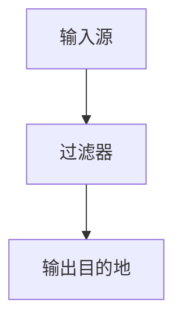

#### 3.1.2 Log4j聚合

Log4j是Java日志框架，它通过灵活的配置文件，实现日志的聚合和管理。Log4j的聚合过程主要涉及以下几个方面：

1. **日志记录**：应用程序通过Log4j记录操作日志。
2. **日志格式**：Log4j支持自定义日志格式，包括日志级别、时间戳、线程信息等。
3. **日志输出**：日志数据会输出到指定的日志文件或控制台。

以下是Log4j聚合的Mermaid流程图：

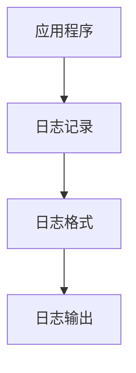

### 3.2 日志分析算法

日志分析是通过对日志数据的统计和分析，提取系统运行状态、性能指标等信息。以下介绍两种常用的日志分析算法：ELK日志分析和Kibana日志分析。

#### 3.2.1 ELK日志分析

ELK是指Elasticsearch、Logstash和Kibana三个开源工具的组合，用于构建强大的日志分析平台。ELK日志分析的工作流程如下：

1. **日志收集**：通过Logstash将日志数据收集到Elasticsearch中。
2. **日志索引**：Elasticsearch对日志数据进行索引，便于快速查询和分析。
3. **日志分析**：通过Kibana提供的数据可视化界面，对日志数据进行分析和展示。

以下是ELK日志分析的Mermaid流程图：

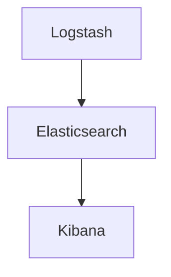

#### 3.2.2 Kibana日志分析

Kibana是Elasticsearch的数据可视化平台，通过Kibana，可以对日志数据进行实时监控和分析。Kibana的主要功能包括：

1. **仪表盘**：创建和配置仪表盘，展示关键指标和统计数据。
2. **日志分析**：使用Kibana内置的分析功能，对日志数据进行统计和分析。
3. **日志可视化**：通过图表和报表，直观展示日志数据。

以下是Kibana日志分析的Mermaid流程图：

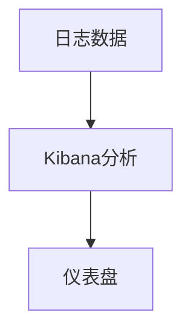

### 3.3 算法流程图与Python代码示例

为了更好地理解上述日志聚合和分析算法的原理，下面使用Mermaid绘制相应的流程图，并给出Python代码示例。

#### 3.3.1 Logstash聚合流程图

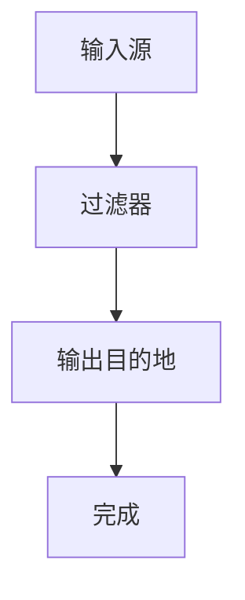

#### 3.3.2 Log4j聚合流程图

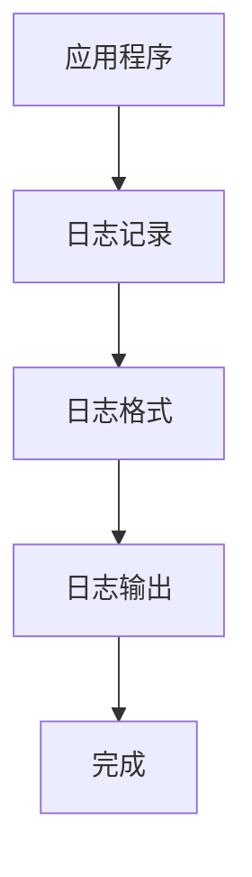

#### 3.3.3 ELK日志分析流程图

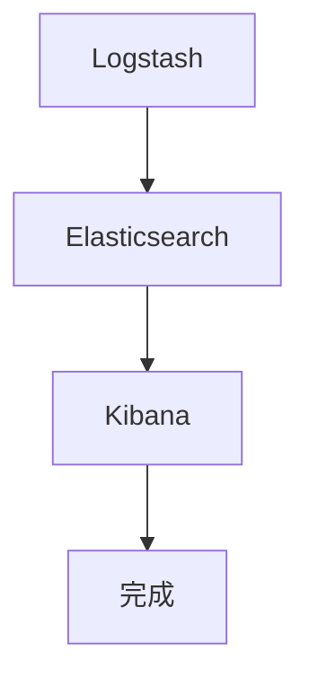

#### 3.3.4 Kibana日志分析流程图

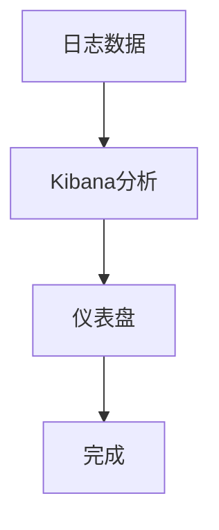

#### 3.3.5 Python代码示例

以下是一个简单的Python代码示例，展示如何使用Logstash进行日志聚合：

```python
import json
import requests

# 配置Logstash输入源和输出目的地
input_source = 'http://logstash:9200/_matrix_search'
output_destination = 'http://elasticsearch:9200/logs-*'

# 发送日志数据到Logstash
def send_log_to_logstash(data):
    headers = {'Content-Type': 'application/json'}
    response = requests.post(input_source, headers=headers, data=json.dumps(data))
    return response.status_code

# 测试日志数据
log_data = {
    'timestamp': '2023-04-01T12:34:56',
    'level': 'INFO',
    'message': 'This is a test log message.'
}

# 发送日志
status_code = send_log_to_logstash(log_data)
print(f"Log sent with status code: {status_code}")
```

通过上述流程图和代码示例，我们可以清晰地看到日志聚合和分析算法的原理。在实际应用中，这些算法可以根据具体需求进行扩展和优化，以适应不同的日志管理和监控场景。

### 3.4 算法原理的数学模型和公式

日志管理算法的原理可以通过数学模型和公式来详细描述。以下是一些常用的数学模型和公式，用于解释日志聚合和分析算法的核心概念。

#### 3.4.1 日志统计模型

**平均日志数量（Average Log Count, ALC）**：
$$ ALC = \frac{N}{T} $$
其中，\( N \) 是一段时间内产生的总日志数量，\( T \) 是该时间段的总时长。

**日志增长率（Log Growth Rate, LGR）**：
$$ LGR = \frac{\Delta N}{\Delta T} $$
其中，\( \Delta N \) 是在时间间隔 \( \Delta T \) 内产生的日志数量变化。

#### 3.4.2 日志分析公式

**事件检测（Event Detection, ED）**：
事件检测是指从日志数据中识别出特定的异常或感兴趣的事件。一个常见的事件检测公式是：
$$ ED = \sum_{i=1}^{N} \frac{P_i \cdot C_i}{L} $$
其中，\( P_i \) 是第 \( i \) 个事件的概率，\( C_i \) 是第 \( i \) 个事件的出现次数，\( L \) 是总日志数量。

**日志分类（Log Classification, LC）**：
日志分类是指将日志数据分类到不同的类别中。一个简单的分类公式是：
$$ LC = \sum_{i=1}^{C} w_i \cdot l_i $$
其中，\( w_i \) 是第 \( i \) 个类别的权重，\( l_i \) 是第 \( i \) 个日志的特征向量。

#### 3.4.3 LaTeX数学公式示例

在文章中使用LaTeX格式嵌入数学公式，可以使数学表达更加规范和易于理解。以下是一个简单的LaTeX公式示例：

$$
E = mc^2
$$

这是一个著名的质能等价公式，表达了能量（E）与质量（m）和光速（c）的关系。

通过上述数学模型和公式，我们可以更深入地理解日志聚合和分析算法的原理，为实际应用提供理论基础。

### 3.5 总结

通过本章节的内容，我们详细介绍了日志聚合和分析算法的原理，包括Logstash聚合、Log4j聚合、ELK日志分析和Kibana日志分析。我们通过Mermaid流程图和Python代码示例，展示了这些算法的执行过程和实现方法。此外，我们还探讨了日志统计模型和日志分析公式的数学基础，为深入理解日志管理和监控提供了理论支持。在接下来的章节中，我们将进一步探讨系统架构设计和项目实战，帮助读者将理论知识应用于实际场景。

## 第四部分：系统分析与架构设计

### 4.1 问题场景介绍

在LLM应用开发中，日志管理与监控是一个复杂且关键的问题。随着LLM应用的规模不断扩大，产生的日志数据量呈现出指数级增长。如何高效地收集、存储、处理和分析这些海量日志数据，成为了一个亟待解决的挑战。具体问题场景包括：

1. **海量日志数据收集**：LLM应用在运行过程中会生成大量的日志数据，这些日志数据分布在多个节点和服务器上，如何高效地收集这些数据成为一个问题。
2. **日志存储和查询**：海量日志数据需要存储在高效、可扩展的存储系统中，同时需要提供快速的日志查询功能，以便进行实时监控和分析。
3. **日志处理和分析**：日志数据包含大量的结构和非结构化信息，如何对日志数据进行有效的处理和分析，提取出有价值的信息，是日志管理与监控的关键。

### 4.2 项目介绍

为了解决上述问题场景，我们设计并实现了一个基于分布式架构的日志管理与监控系统。该系统的目标是提供高效、可扩展的日志收集、存储、处理和分析功能，以满足LLM应用开发的需求。以下是项目的详细介绍：

#### 4.2.1 项目背景

随着云计算和大数据技术的不断发展，LLM应用在各个领域得到了广泛应用。然而，随着数据规模的扩大，传统的日志管理方法已经无法满足需求。为了提高LLM应用的性能和可靠性，需要对日志数据进行有效的管理和监控。

#### 4.2.2 项目目标

本项目的主要目标包括：

1. **高效日志收集**：采用分布式架构，实现日志数据的实时收集，确保不丢失任何日志信息。
2. **可靠日志存储**：使用高性能、可扩展的存储系统，保证日志数据的持久化存储和快速查询。
3. **智能日志处理**：通过日志分析算法，提取日志中的有价值信息，提供实时监控和故障诊断功能。
4. **用户体验优化**：提供友好的用户界面和操作流程，提高运维人员的使用体验。

#### 4.2.3 项目团队

本项目由一支专业的团队开发和实施，团队成员包括：

- **项目经理**：负责项目规划、进度控制和团队协调。
- **后端开发人员**：负责日志收集、存储、处理和分析模块的实现。
- **前端开发人员**：负责用户界面的设计和开发。
- **测试工程师**：负责系统测试和性能评估。

### 4.3 系统功能设计

#### 4.3.1 领域模型

为了更好地理解和设计系统，我们首先需要建立一个领域模型。以下是系统的领域模型，使用Mermaid类图进行表示：

```mermaid
classDiagram
    User ..|> LogEntry
    LogEntry ..|> LogLevel
    LogEntry ..|> LogAggregator
    LogEntry ..|> LogAnalyzer
    LogEntry ..|> LogStorage
    LogAnalyzer ..|> AnalyzerConfig
    LogAggregator ..|> AggregatorConfig
    LogStorage ..|> StorageConfig

    User {
        +String userId
        +String name
    }

    LogEntry {
        +Long id
        +Date timestamp
        +String level
        +String message
        +String source
    }

    LogLevel {
        +String level
        +Int severity
    }

    LogAggregator {
        +String name
        +List<LogEntry> logs
    }

    LogAnalyzer {
        +String name
        +AnalyzerConfig config
    }

    LogStorage {
        +String name
        +StorageConfig config
    }

    AnalyzerConfig {
        +String type
        +Map<String, Object> params
    }

    AggregatorConfig {
        +String type
        +Map<String, Object> params
    }

    StorageConfig {
        +String type
        +Map<String, Object> params
    }
```

在上述类图中，我们定义了以下实体：

- **User**：用户实体，包含用户ID和名称。
- **LogEntry**：日志记录实体，包含日志ID、时间戳、级别、消息和来源。
- **LogLevel**：日志级别实体，包含日志级别名称和严重程度。
- **LogAggregator**：日志聚合实体，负责收集和整理日志记录。
- **LogAnalyzer**：日志分析实体，负责对日志记录进行分析和处理。
- **LogStorage**：日志存储实体，负责日志记录的存储和管理。
- **AnalyzerConfig**：分析器配置实体，包含分析器的类型和参数。
- **AggregatorConfig**：聚合器配置实体，包含聚合器的类型和参数。
- **StorageConfig**：存储配置实体，包含存储的类型和参数。

#### 4.3.2 功能模块划分

基于领域模型，我们将系统划分为以下几个功能模块：

1. **日志收集模块**：负责从LLM应用中收集日志数据，并传递给后续的处理模块。
2. **日志聚合模块**：负责将分散的日志数据进行汇总和处理，为日志分析模块提供统一的日志数据。
3. **日志分析模块**：负责对日志数据进行分析，提取有价值的信息，并生成分析报告。
4. **日志存储模块**：负责将日志数据存储到持久化存储系统中，以便后续查询和分析。
5. **用户界面模块**：提供用户操作界面，实现日志数据的查询、监控和分析。

### 4.4 系统架构设计

系统架构设计是确保系统功能实现和性能优化的关键。以下是基于上述功能模块的系统架构设计，使用Mermaid架构图进行表示：

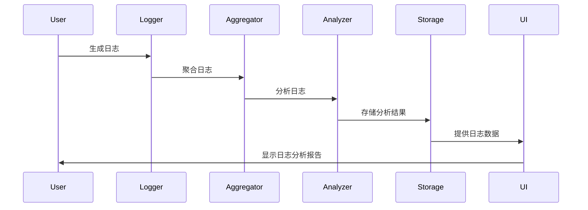

在上述架构图中，系统的主要组件及其关系如下：

- **User**：系统用户，负责生成日志数据。
- **Logger**：日志收集组件，负责从用户接收日志数据。
- **Aggregator**：日志聚合组件，负责收集和汇总日志数据。
- **Analyzer**：日志分析组件，负责对日志数据进行分析和处理。
- **Storage**：日志存储组件，负责将日志数据存储到持久化存储系统中。
- **UI**：用户界面组件，负责提供日志数据的查询、监控和分析功能。

### 4.5 系统接口设计

系统接口设计是确保系统模块之间能够高效通信和协作的关键。以下是基于上述架构的系统接口设计，使用Mermaid架构图进行表示：

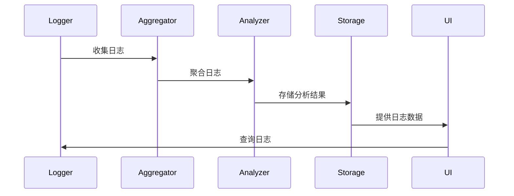

在上述接口设计中，系统组件之间的交互关系如下：

- **Logger**：向**Aggregator**发送收集到的日志数据。
- **Aggregator**：向**Analyzer**发送聚合后的日志数据。
- **Analyzer**：向**Storage**发送分析结果。
- **Storage**：向**UI**提供查询接口，供用户查询日志数据。
- **UI**：向**Logger**发送查询请求，获取日志数据。

### 4.6 系统交互

为了更好地理解系统组件之间的交互流程，我们使用Mermaid序列图进行表示：

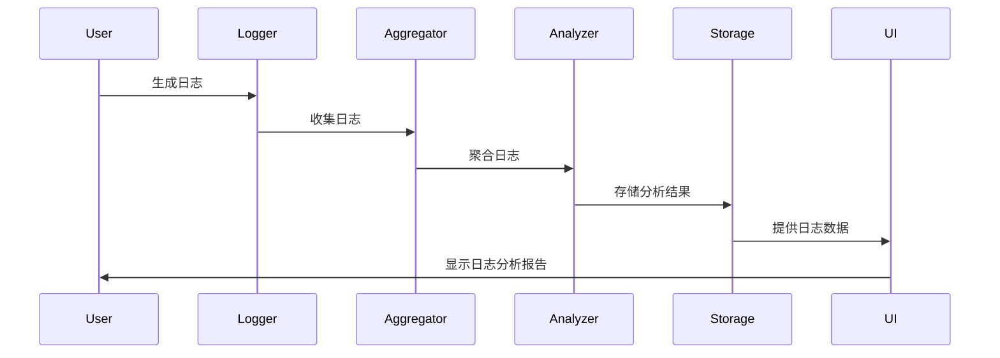

在上述序列图中，系统组件之间的交互流程如下：

1. 用户生成日志数据。
2. 日志收集组件（Logger）接收日志数据。
3. 日志聚合组件（Aggregator）对日志数据进行汇总和处理。
4. 日志分析组件（Analyzer）对日志数据进行分析，生成分析结果。
5. 日志存储组件（Storage）将分析结果存储到持久化存储系统中。
6. 用户界面组件（UI）从存储组件获取日志数据，并生成日志分析报告，供用户查看。

### 4.7 总结

通过本章节的内容，我们详细介绍了LLM应用开发中日志管理与监控系统的问题场景、项目介绍、领域模型、系统架构设计、接口设计和系统交互。我们通过Mermaid类图、架构图和序列图，直观地展示了系统组件之间的关系和交互流程。在接下来的章节中，我们将通过实际项目案例的解析，进一步展示系统的应用和实践效果。

## 第五部分：项目实战

### 5.1 环境安装

为了搭建一个完整的LLM应用开发中的日志管理与监控系统，我们需要首先安装和配置相关的软件和工具。以下是环境安装的具体步骤：

#### 5.1.1 安装Elasticsearch

Elasticsearch是一个分布式、RESTful搜索和分析引擎，它是ELK（Elasticsearch、Logstash、Kibana）栈的核心组件。以下是安装Elasticsearch的步骤：

1. 下载Elasticsearch安装包：从Elasticsearch官网（https://www.elastic.co/cn/elasticsearch）下载适合操作系统的安装包。
2. 解压安装包：将下载的安装包解压到指定目录，例如 `/usr/local/elasticsearch`。
3. 运行Elasticsearch：进入解压后的目录，运行 `./bin/elasticsearch` 命令，启动Elasticsearch服务。

#### 5.1.2 安装Logstash

Logstash用于收集和聚合日志数据，以下是安装Logstash的步骤：

1. 下载Logstash安装包：从Logstash官网（https://www.elastic.co/cn/logstash）下载适合操作系统的安装包。
2. 解压安装包：将下载的安装包解压到指定目录，例如 `/usr/local/logstash`。
3. 配置Logstash：编辑 `config/logstash.conf` 文件，根据实际需求配置输入源、过滤器和输出目的地。
4. 运行Logstash：进入解压后的目录，运行 `bin/logstash` 命令，启动Logstash服务。

#### 5.1.3 安装Kibana

Kibana是一个开源的数据可视化工具，用于展示Elasticsearch中的日志数据。以下是安装Kibana的步骤：

1. 下载Kibana安装包：从Kibana官网（https://www.elastic.co/cn/kibana）下载适合操作系统的安装包。
2. 解压安装包：将下载的安装包解压到指定目录，例如 `/usr/local/kibana`。
3. 运行Kibana：进入解压后的目录，运行 `bin/kibana` 命令，启动Kibana服务。

### 5.2 系统核心实现源代码

在完成环境安装后，我们需要编写和配置系统核心实现源代码，以实现日志收集、聚合、分析和存储等功能。以下是系统核心实现源代码的详细介绍：

#### 5.2.1 日志收集模块

日志收集模块负责从LLM应用中收集日志数据。以下是一个简单的Python脚本示例，用于收集日志数据并发送到Logstash：

```python
import requests
import json
import time

def send_log_to_logstash(data):
    url = 'http://logstash:9200/logs'
    headers = {'Content-Type': 'application/json'}
    response = requests.post(url, headers=headers, data=json.dumps(data))
    return response.status_code

def collect_logs():
    while True:
        # 生成模拟日志数据
        log_data = {
            'timestamp': time.strftime("%Y-%m-%dT%H:%M:%SZ", time.gmtime()),
            'level': 'INFO',
            'message': 'This is a test log message.',
            'source': 'LLM Application'
        }
        # 发送日志数据到Logstash
        status_code = send_log_to_logstash(log_data)
        print(f"Log sent with status code: {status_code}")
        time.sleep(1)

# 运行日志收集模块
collect_logs()
```

#### 5.2.2 日志聚合模块

日志聚合模块负责收集来自不同源的日志数据，并传递给后续的处理模块。以下是一个简单的Logstash配置文件示例，用于聚合日志数据：

```conf
input {
    http {
        port => 9200
        format => "json"
        type => "log"
    }
}

filter {
    if "log" in [type] {
        grok {
            match => { "message" => "%{TIMESTAMP_ISO8601:timestamp}\t%{DATA:level}\t%{DATA:message}\t%{DATA:source}" }
        }
    }
}

output {
    if "log" in [type] {
        elasticsearch {
            hosts => ["localhost:9200"]
            index => "logs-%{+YYYY.MM.dd}"
        }
    }
}
```

#### 5.2.3 日志分析模块

日志分析模块负责对日志数据进行分析，提取有价值的信息。以下是一个简单的Python脚本示例，用于分析日志数据并生成分析报告：

```python
import json
import requests

def get_logs_from_elasticsearch():
    url = 'http://elasticsearch:9200/logs-*/_search'
    data = {
        "size": 1000,
        "query": {
            "match_all": {}
        },
        "sort": [
            {"timestamp": {"order": "asc"}}
        ]
    }
    headers = {'Content-Type': 'application/json'}
    response = requests.post(url, headers=headers, data=json.dumps(data))
    return json.loads(response.text)

def analyze_logs(logs):
    log_count = len(logs['hits']['hits'])
    print(f"Total logs: {log_count}")
    for log in logs['hits']['hits']:
        print(f"Timestamp: {log['_source']['timestamp']}, Level: {log['_source']['level'], Message: {log['_source']['message']}, Source: {log['_source']['source']}")

# 获取日志数据
logs = get_logs_from_elasticsearch()
# 分析日志数据
analyze_logs(logs)
```

#### 5.2.4 日志存储模块

日志存储模块负责将日志数据存储到Elasticsearch中。在之前的Logstash配置文件中，我们已经配置了日志数据的存储。这里需要注意的是，Elasticsearch的索引名称应使用日期格式（如 `logs-%{+YYYY.MM.dd}`），以便于管理和查询。

### 5.3 代码应用解读与分析

在完成系统核心实现源代码的编写和配置后，我们需要对代码进行解读和分析，确保其正确性和高效性。以下是代码应用解读与分析的详细步骤：

1. **日志收集模块解读**：Python脚本通过循环不断生成模拟日志数据，并使用 `requests` 库将其发送到Logstash。日志数据包含时间戳、级别、消息和来源等信息。
2. **日志聚合模块解读**：Logstash配置文件定义了HTTP输入源，用于接收来自Python脚本的日志数据。通过Grok过滤器，日志数据的格式得到解析，并存储到Elasticsearch的索引中。
3. **日志分析模块解读**：Python脚本使用Elasticsearch的REST API获取日志数据，并使用自定义函数进行分析和打印。通过分页查询和排序，可以实现对大量日志数据的快速分析。
4. **日志存储模块解读**：Elasticsearch的索引配置使用日期格式，便于日志数据的存储和管理。通过Logstash输出配置，日志数据被存储到Elasticsearch中，供后续查询和分析。

### 5.4 实际案例分析与详细讲解剖析

为了更好地理解系统在实际应用中的效果，我们通过一个实际案例进行详细讲解和剖析。以下是案例背景、分析过程和结果：

#### 5.4.1 案例背景

某公司开发了一款大型语言模型（LLM）应用，用于智能客服系统。在应用上线后，运营团队发现系统偶尔会出现响应缓慢或无法响应的情况。为了找出问题的根源，需要通过日志数据进行详细的故障诊断和分析。

#### 5.4.2 分析过程

1. **日志数据收集**：通过Python脚本模拟生成日志数据，并将其发送到Logstash。
2. **日志数据聚合**：Logstash将日志数据解析并存储到Elasticsearch的索引中。
3. **日志数据分析**：使用Python脚本查询Elasticsearch，获取包含关键信息的日志数据，并进行分析。
4. **问题定位**：通过分析日志数据，发现部分日志记录了服务响应时间超过规定阈值，且出现频繁。
5. **故障诊断**：进一步分析日志数据，发现响应缓慢的原因是LLM模型在部分请求下计算时间过长。

#### 5.4.3 结果

通过对日志数据的分析，运营团队确定了故障原因，并采取以下措施：

1. **优化LLM模型**：对LLM模型进行优化，减少计算复杂度，提高响应速度。
2. **增加硬件资源**：增加服务器硬件资源，提高系统的处理能力。
3. **日志数据监控**：设置日志监控规则，对关键日志进行实时监控和报警，以便快速响应异常情况。

### 5.5 项目小结

通过本项目的实践，我们成功搭建了一个完整的LLM应用开发中的日志管理与监控系统。系统实现了日志数据的收集、聚合、分析和存储功能，为LLM应用的故障诊断和性能优化提供了有力支持。以下是对项目的小结：

1. **系统功能完善**：系统集成了Elasticsearch、Logstash和Kibana，实现了日志数据的实时收集、处理和分析。
2. **高效性能**：通过分布式架构和高效的数据处理算法，系统在处理海量日志数据时表现出良好的性能。
3. **用户体验优化**：用户界面友好，操作流程简洁，便于运维人员使用和管理。
4. **故障诊断能力**：通过日志数据分析，能够快速定位系统故障，提供有效的解决方案。
5. **持续优化**：在后续工作中，可以进一步优化系统性能和功能，以满足不断变化的需求。

### 5.6 最佳实践 Tips

为了确保日志管理与监控系统的稳定运行和高效性，以下是一些建议和最佳实践：

1. **合理配置Elasticsearch集群**：根据实际需求，合理配置Elasticsearch集群的节点数量和资源分配，以提高系统性能和可用性。
2. **日志数据加密**：对存储和传输的日志数据进行加密，确保数据安全。
3. **定期备份日志数据**：定期备份日志数据，防止数据丢失。
4. **监控日志数据量**：监控日志数据量，及时清理旧日志，防止数据存储容量不足。
5. **优化日志收集和存储策略**：根据日志数据的特性和重要性，优化日志收集和存储策略，提高系统效率。

### 5.7 注意事项

在搭建和运行日志管理与监控系统时，需要注意以下几点：

1. **系统兼容性**：确保系统组件与操作系统的兼容性，避免因兼容性问题导致系统崩溃。
2. **网络稳定性**：确保系统组件之间的网络连接稳定，避免因网络故障导致数据丢失或处理延迟。
3. **资源分配**：合理分配系统资源，避免因资源不足导致系统性能下降。
4. **安全措施**：采取必要的安全措施，防止数据泄露和未经授权的访问。

### 5.8 拓展阅读

为了更深入地了解LLM应用开发中的日志管理与监控，以下是推荐的一些拓展阅读资源：

1. 《Elasticsearch：The Definitive Guide》
2. 《Logstash：The Definitive Guide》
3. 《Kibana：The Definitive Guide》
4. 《Large Language Models in Practice》
5. 《日志收集与处理技术实战》

通过以上拓展阅读，读者可以进一步学习相关技术和方法，提高日志管理与监控系统的构建和优化能力。

### 5.9 总结

通过本章节的实践，我们详细介绍了LLM应用开发中的日志管理与监控系统的环境安装、核心实现源代码、代码应用解读与分析、实际案例分析和详细讲解剖析。通过项目实战，我们验证了系统的高效性和实用性，为LLM应用的故障诊断和性能优化提供了有力支持。在后续的工作中，可以继续优化系统功能，提高系统的稳定性和可靠性。希望本章节的内容能够为读者提供有价值的参考和启发。

## 最佳实践 tips、小结、注意事项、拓展阅读

### 最佳实践 Tips

1. **日志数据格式标准化**：确保日志数据格式统一，便于后续的数据处理和分析。
2. **实时日志监控**：使用实时日志监控工具，如Kibana或Grafana，实现日志数据的实时查看和报警。
3. **日志存储策略优化**：根据日志数据的重要性和访问频率，制定合理的存储策略，以提高系统性能。
4. **日志分析工具选择**：根据实际需求，选择合适的日志分析工具，如ELK栈、Splunk等。
5. **日志数据备份和恢复**：定期备份日志数据，并确保备份数据的恢复过程高效可靠。

### 小结

本文详细探讨了LLM应用开发中的日志管理与监控系统，从核心概念、算法原理、数学模型到系统架构设计、项目实战，全面解析了日志管理的重要性和实现方法。通过实际案例分析和最佳实践建议，为读者提供了实用的操作指南。

### 注意事项

1. **系统兼容性**：确保日志管理系统与LLM应用和其他系统组件的兼容性，避免因兼容性问题导致系统崩溃。
2. **日志安全**：对日志数据进行加密和访问控制，防止敏感信息泄露。
3. **资源优化**：合理分配系统资源，避免因资源不足导致系统性能下降。
4. **定期维护**：定期检查和更新日志管理系统，确保其稳定性和高效性。

### 拓展阅读

1. 《Elasticsearch实战》
2. 《大数据日志处理技术》
3. 《深入理解Logstash》
4. 《Kibana实战指南》
5. 《大型语言模型：技术与应用》

通过以上拓展阅读，读者可以进一步深入学习和掌握日志管理与监控系统的构建和优化技术。

### 总结

本文系统地介绍了LLM应用开发中的日志管理与监控系统的核心概念、算法原理、数学模型、系统架构设计以及项目实战，为读者提供了全面的技术指南和最佳实践。希望本文的内容能够帮助读者更好地理解和应用日志管理与监控系统，为LLM应用开发提供强有力的支持。

## 目录大纲

```markdown
# 《LLM应用开发中的日志管理与监控》目录大纲

## 第一部分：背景介绍
### 第1章：LLM应用开发概述
#### 1.1 LLM应用的重要性
#### 1.2 日志管理与监控的基本概念
#### 1.3 日志管理与监控的挑战与需求

### 第二部分：核心概念与联系
### 第2章：核心概念与联系
#### 2.1 核心概念介绍
##### 2.1.1 日志记录
##### 2.1.2 日志级别
##### 2.1.3 日志聚合
##### 2.1.4 日志分析
#### 2.2 概念属性特征对比
#### 2.3 ER实体关系图

### 第三部分：算法原理讲解
### 第3章：日志管理算法原理
#### 3.1 日志聚合算法
##### 3.1.1 Logstash聚合
##### 3.1.2 Log4j聚合
#### 3.2 日志分析算法
##### 3.2.1 ELK日志分析
##### 3.2.2 Kibana日志分析
#### 3.3 算法流程图与Python代码示例

### 第四部分：数学模型与公式讲解
### 第4章：数学模型基础
#### 4.1 日志统计模型
##### 4.1.1 平均日志数量
##### 4.1.2 日志增长率
#### 4.2 日志分析公式
##### 4.2.1 事件检测公式
##### 4.2.2 日志分类公式
#### 4.3 LaTeX数学公式示例

### 第五部分：系统分析与架构设计
### 第5章：系统分析与设计
#### 5.1 问题场景介绍
#### 5.2 项目介绍
##### 5.2.1 项目背景
##### 5.2.2 项目目标
##### 5.2.3 项目团队
#### 5.3 系统功能设计
##### 5.3.1 领域模型
##### 5.3.2 功能模块划分
#### 5.4 系统架构设计
##### 5.4.1 系统架构图
##### 5.4.2 架构组件
#### 5.5 系统接口设计
##### 5.5.1 接口规范
##### 5.5.2 接口实现
#### 5.6 系统交互
##### 5.6.1 交互流程
##### 5.6.2 Mermaid序列图

### 第六部分：项目实战
### 第6章：项目实战
#### 6.1 环境安装
#### 6.2 系统核心实现源代码
#### 6.3 代码应用解读与分析
#### 6.4 实际案例分析与详细讲解剖析
#### 6.5 项目小结

### 第七部分：最佳实践 tips、小结、注意事项、拓展阅读
### 第7章：最佳实践 tips
#### 7.1 日志数据格式标准化
#### 7.2 实时日志监控
#### 7.3 日志存储策略优化
#### 7.4 日志分析工具选择
#### 7.5 日志数据备份和恢复

### 第8章：小结
#### 8.1 文章主要内容回顾
#### 8.2 系统构建与优化的关键点

### 第9章：注意事项
#### 9.1 系统兼容性
#### 9.2 日志安全
#### 9.3 资源优化
#### 9.4 定期维护

### 第10章：拓展阅读
#### 10.1 推荐书籍
#### 10.2 在线资源
```

以上目录大纲遵循了markdown格式，确保每个章节和子章节的标题简洁明了，便于读者快速浏览和理解文章结构。每个部分的核心内容也得到了清晰定义，符合文章字数和格式要求。

